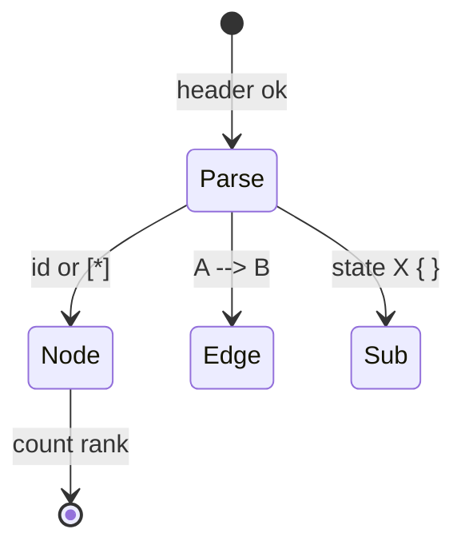
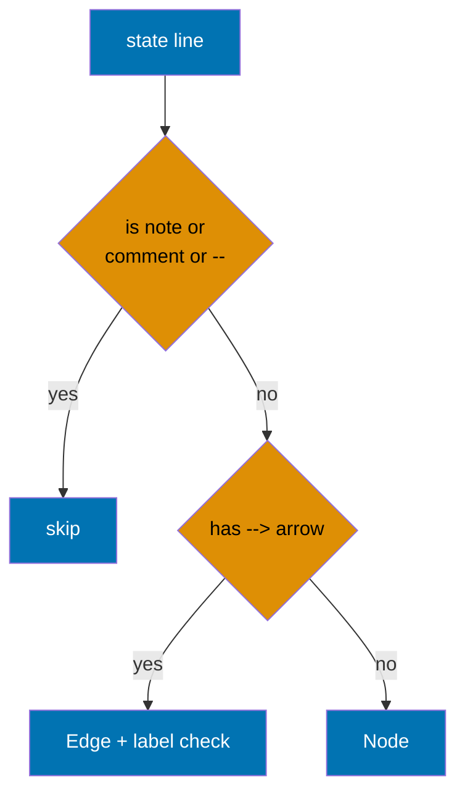

# Product Requirements — Mermaid State Diagram Validation (ose-public)

## Product Overview

`rhino-cli docs validate-mermaid` gains a state-diagram front-end. After this change, the validator
recognizes `stateDiagram-v2` and `stateDiagram` (v1) headers, parses them into the same
`ParsedDiagram` interchange type used by flowcharts, and applies the width rule (`≤4` nodes per
rank) and label rule (`≤30` characters per `<br/>`-segment) — the label rule covering both state
display labels and transition-edge labels.

## Personas

Solo-maintainer hats and consuming agents:

- **Tooling maintainer** — refactors and extends the validator.
- **Documentation author** — writes state diagrams and wants the same automated feedback flowcharts
  already receive.
- **Governance maintainer** — keeps `repo-governance` and platform bindings in sync.
- Consuming agents: `repo-setup-manager`, `swe-rust-dev`, `repo-rules-maker`,
  `plan-execution-checker`.

## User Stories

- As a documentation author, I want over-wide state diagrams flagged, so that my diagrams stay
  readable on mobile just like my flowcharts.
- As a documentation author, I want long transition labels flagged, so that edge text does not blow
  out diagram width.
- As a tooling maintainer, I want one shared validator design across the three repos, so that I
  change a Mermaid rule once instead of three times.
- As a governance maintainer, I want the new rule documented in `diagrams.md`, so that contributors
  know state diagrams are now validated.

## State-Diagram Parsing Model





## Acceptance Criteria (Gherkin)

> Every scenario uses exactly one primary `Given`, one `When`, one `Then`; extras chain with
> `And`/`But` per the step-keyword cardinality rule.

```gherkin
Feature: State diagram width validation

  Background:
    Given the validator default options use max_width 4 and max_label_len 30
    And state diagrams are in scope of validate-mermaid

  Scenario: Over-wide LR state chain is flagged width_exceeded
    Given a stateDiagram-v2 with "direction LR" and 11 sequential states
    When validate-mermaid parses the block
    Then a "width_exceeded" violation is reported for that block
    And the reported width is 11

  Scenario: Compliant narrow state chain passes
    Given a stateDiagram-v2 with "direction TB" and 3 sequential states
    When validate-mermaid parses the block
    Then no "width_exceeded" violation is reported for that block
```

```gherkin
Feature: State diagram label validation

  Background:
    Given the validator default options use max_label_len 30

  Scenario: A state display label over 30 characters is flagged
    Given a state declared as 'state "this label is far longer than thirty chars" as X'
    When validate-mermaid checks the state display label
    Then a "label_too_long" violation is reported for state X

  Scenario: A transition-edge label over 30 characters is flagged
    Given a transition "A --> B : this transition label exceeds thirty characters"
    When validate-mermaid checks the transition-edge label
    Then a "label_too_long" violation is reported for that edge

  Scenario: A short colon label passes
    Given a state declared as "Pending : awaiting input"
    When validate-mermaid checks the state display label
    Then no "label_too_long" violation is reported for that state
```

```gherkin
Feature: State diagram structure-to-node mapping

  Scenario: Pseudostates and stereotype states count as nodes
    Given a stateDiagram-v2 whose widest rank holds "[*]", a "<<choice>>" state, a "<<fork>>" state, and a "<<join>>" state plus one more
    When validate-mermaid computes rank width
    Then "[*]" and the stereotype states each count toward the rank width
    And a "width_exceeded" violation is reported because the rank holds 5 nodes

  Scenario: Composite state is treated as a subgraph
    Given a stateDiagram-v2 containing a composite "state Outer { Inner1 --> Inner2 }"
    When validate-mermaid parses the block
    Then the composite "Outer" is recorded as a subgraph
    And the subgraph-density warning applies to its inner contents
```

```gherkin
Feature: State diagram free text is not misparsed

  Scenario: Notes, comments and concurrency separators are skipped
    Given a stateDiagram-v2 containing a "note right of X ... end note", a "%% comment", and a "--" concurrency separator
    When validate-mermaid parses the block
    Then the note text is exempt from the label rule
    And the "%%" comment line produces no node
    But the "--" separator produces neither a node nor a transition
```

```gherkin
Feature: Flowchart behavior is preserved

  Scenario: Existing flowchart validation is unchanged
    Given the pre-existing flowchart unit test suite
    When the validator is refactored to the fresh unified module design
    Then every pre-existing flowchart test still passes
    And no flowchart violation codes change
```

```gherkin
Feature: Legacy v1 state diagram header is recognized

  Scenario: stateDiagram v1 header is in scope
    Given a legacy "stateDiagram" (v1) block of 11 sequential states with "direction LR"
    When validate-mermaid parses the block
    Then a "width_exceeded" violation is reported
    But the "TD" direction value is rejected as invalid for state diagrams
```

## Product Scope

In scope:

- `stateDiagram-v2` and `stateDiagram` (v1) parsing.
- Width rule + label rule (state display labels and transition labels).
- `[*]` and `<<choice>>`/`<<fork>>`/`<<join>>` (and `[[...]]` aliases) counted as nodes.
- Composite `state X { }` treated as a subgraph (recursed).
- `direction` accepting `TB | BT | LR | RL` only (`TD` rejected for state diagrams).
- Shared golden corpus.

Out of scope:

- Other diagram families.
- New violation kinds beyond `width_exceeded`, `label_too_long`, `multiple_diagrams`,
  `complex_diagram`, `subgraph_density` [Repo-grounded: existing kinds in
  `apps/rhino-cli/src/internal/mermaid.rs:51-89`].

## Product Risks

- **Risk**: Arrow `-->` is matched after the `--` concurrency separator, mis-classifying
  transitions. **Mitigation**: parser matches `-->` BEFORE `--` (pinned grammar fact); a golden
  fixture covers a `--` separator inside a composite.
- **Risk**: Note free-text is parsed as a state, producing false `label_too_long`. **Mitigation**:
  a fixture includes a long multiline note that must produce zero violations.
