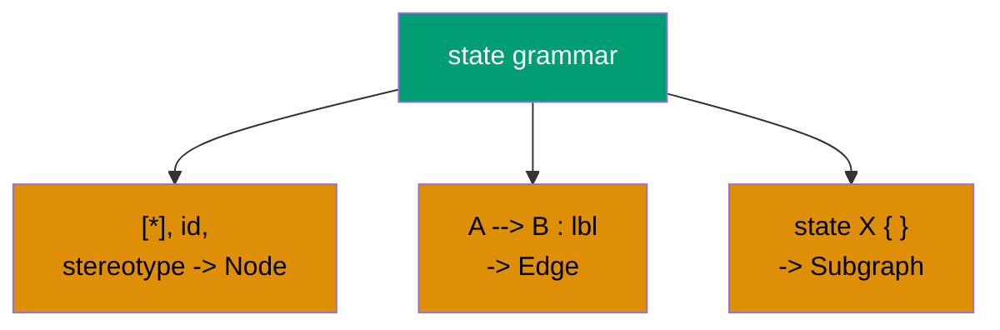

# Technical Documentation — Mermaid State Diagram Validation (ose-public)

## Architecture

The current validator is a single 1757-line file
`apps/rhino-cli/src/internal/mermaid.rs` [Repo-grounded], re-exported as `pub mod mermaid;` from
`apps/rhino-cli/src/internal.rs:15` [Repo-grounded]. It exposes `extract_blocks`, `parse_diagram`,
`validate_blocks`, `format_text`, `format_json`, `format_markdown`, plus the `ParsedDiagram`,
`Node`, `Edge`, `Subgraph`, `Violation`, `Warning`, `ViolationKind`, `WarningKind`, `Direction`,
`ValidateOptions` types [Repo-grounded: symbol survey of `mermaid.rs`].

### Target Module Layout (fresh unified design — identical in all 3 repos)

The monolith is split into a `mermaid/` directory module. `apps/rhino-cli/src/internal.rs` keeps
exporting `pub mod mermaid;`; the file `mermaid.rs` becomes `mermaid/mod.rs`.

```text
apps/rhino-cli/src/internal/mermaid/
  mod.rs        # public API re-exports: extract_blocks, validate_blocks, format_*
  types.rs      # Direction, Node, Edge, Subgraph, ParsedDiagram, Violation, Warning,
                #   ViolationKind, WarningKind, ValidateOptions, DiagramKind
  extractor.rs  # pull mermaid fenced blocks out of markdown (unchanged behavior)
  diagram.rs    # DiagramKind { Flowchart, State } detection + dispatch to a parser
  flowchart.rs  # flowchart/graph front-end parser -> ParsedDiagram (existing logic, moved)
  state.rs      # NEW state front-end parser -> ParsedDiagram (stateDiagram-v2 + stateDiagram)
  graph.rs      # rank/width/depth computation over ParsedDiagram (shared core)
  validator.rs  # rule application over ParsedDiagram (width, label, multiple, subgraph density)
  reporter.rs   # human-readable + JSON output (unchanged behavior)
```

Hard invariants:

- `ParsedDiagram` is the single interchange type. `flowchart.rs` and `state.rs` are the only
  kind-specific files; `graph.rs`, `validator.rs`, `reporter.rs` are kind-agnostic and shared.
- The `validate:mermaid` Nx target, the `docs validate-mermaid` CLI command, pre-commit, and CI
  wiring are UNCHANGED — state diagrams stop being skipped because `diagram.rs` recognizes their
  header. [Repo-grounded: target at `apps/rhino-cli/project.json:167`]
- Flowchart behavior is byte-for-byte preserved: every existing flowchart test stays green.

## Design Decisions

### D-TYPE — diagram types in scope

`stateDiagram-v2` and `stateDiagram` (v1) only. Both share the same AST surface. Other block types
stay unvalidated (deferred). Rationale: the trigger is a state-diagram defect; scope is bounded to
keep the refactor reviewable.

### D-ARCH — unify first, then add state support once

All three repos converge onto the fresh layout above (not public's monolith, not primer's current
split). State support is added once against the shared core, so the rule semantics are identical
everywhere. Rationale: removes drift risk at the root; the largest-effort, cleanest end-state,
chosen deliberately.

### D-LABEL — label rule covers state labels AND transition labels

Both state display labels and transition-edge labels (`A --> B : event text`) are checked against
`≤30`. This is stricter than flowchart (which checks node labels only). Rationale: transition text
materially affects state-diagram render width.

### D-MAP — structure-to-width mapping

- `[*]` start/end pseudostates COUNT as nodes (participate in rank width).
- Composite `state X { ... }` blocks are treated like flowchart subgraphs (recursed; the
  subgraph-density warning applies inside them).

### D-STEREO — stereotype nodes count

`state X <<choice>>` (diamond), `<<fork>>` / `<<join>>` (bars), and their `[[...]]` aliases COUNT as
nodes toward the `≤4`-per-rank rule, consistent with `[*]` counting. Rationale: most faithful to
render width.

### Pinned grammar facts for `state.rs`

Confirmed by web research against mermaid.js.org and the `stateDiagram.jison` grammar (recorded in
the decisions brief):

- Headers: `stateDiagram-v2` and `stateDiagram` (v1) — same AST surface; both in scope.
- `direction` values for state diagrams: `TB | BT | LR | RL` only — `TD` is NOT valid (unlike
  flowcharts). `LR`/`RL` swap width/depth axes exactly as flowchart `LR` does.
- Arrows: only `-->` (optional `:` label suffix). Match `-->` BEFORE the `--` concurrency
  separator.
- `--` inside a composite body = concurrent-region separator; NOT a transition, NOT a node.
- States: bare id; `id : desc` (colon label); `state "desc" as id` (quoted label); `[*]` start/end
  pseudostate (multiple allowed; start vs end by arrow side); composite `state X { ... }` (recursed
  like a subgraph); stereotype states (D-STEREO).
- Notes: `note left of X: ...` inline and `note right of X ... end note` multiline — free text, NOT
  parsed as states/labels/transitions, EXEMPT from the label rule.
- Comments: `%%...` (canonical) and `#...` (grammar-supported) — ignored.

### Direction handling note

The existing `Direction` enum carries a `TD` variant for flowcharts [Repo-grounded:
`apps/rhino-cli/src/internal/mermaid.rs:21-32`]. `state.rs` MUST reject `TD` as a direction (state
diagrams have no `TD`); an unknown/invalid direction defaults to `TB` exactly as flowchart parsing
does today. The state parser maps `LR`/`RL` to the depth-as-horizontal axis, same as flowcharts.

## Parser Mapping (state.rs → ParsedDiagram)



- `[*]` and stereotype states become `Node`s (counted in rank width).
- `A --> B : lbl` becomes an `Edge` whose label feeds the transition-label check.
- Composite `state X { }` becomes a `Subgraph` (recursed).
- Notes, comments, `--` are skipped.

## Shared Golden Corpus

One identical set of `.md` fixtures plus expected violation JSON is committed to all three repos'
rhino-cli test suites. Same input -> same violations in every repo. This is the machine-checked
parity lock. Fixtures cover: over-wide LR chain, compliant narrow chain, long state label, long
transition label, `[*]`/stereotype counting, composite-as-subgraph, note/comment/`--` exemption.

Fixture location: under `apps/rhino-cli/tests/` (siblings: existing `apps/rhino-cli/tests/**/*.rs`
referenced by the `test:integration` target inputs [Repo-grounded:
`apps/rhino-cli/project.json` test:integration inputs include `{projectRoot}/tests/**/*.rs`]).
_Exact fixture subdirectory to confirm at authoring time against existing tests/ layout._

## Dependencies

No new crates. The validator already uses `regex`, `serde`, `anyhow` [Repo-grounded: imports at
`apps/rhino-cli/src/internal/mermaid.rs:9-15`].

## Testing Strategy

- **Unit** (`nx run rhino-cli:test:unit`): each Gherkin scenario in `prd.md` maps to a unit test in
  the relevant module (`state.rs`, `validator.rs`, `graph.rs`). RED-first per TDD.
- **Coverage** (`nx run rhino-cli:test:quick`): library coverage must stay `≥90`
  (`--fail-under-lines 90`) [Repo-grounded: `apps/rhino-cli/project.json` test:quick command].
- **Golden corpus**: committed fixtures with expected JSON, run as part of the unit suite.
- **End-to-end gate**: `nx run rhino-cli:validate:mermaid` over the whole repo.

Acceptance-criterion-to-test-level mapping: all `prd.md` scenarios are covered at the unit level;
the repo-wide cleanup and gate scenarios are verified by the `validate:mermaid` target.

## Rollback

Phase A and Phase B are additive within a worktree. If a regression appears, revert the worktree
branch; the `validate:mermaid` target and CLI surface are unchanged, so no external wiring needs
rollback.
