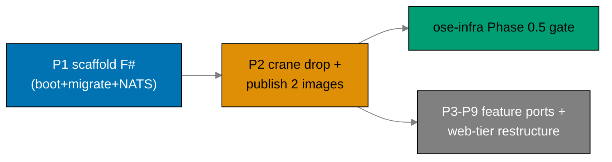

# Restructure Backends to F# and Split Web Tiers

> **Status**: In progress — authored 2026-06-13. Execution not started.
> **Supersedes**: `rewrite-be-fsharp-drop-crane` (this plan's former, narrower identity).

## Context

`ose-public` runs two production backends — `apps/organiclever-be` and `apps/ose-app-be` — both
written in **Rust (Axum / sqlx / async-nats)** and shipped by the archived
[`bootstrap-be-messaging-and-crane-media`](../../done/2026-06-12__bootstrap-be-messaging-and-crane-media/README.md)
plan (done 2026-06-12). That plan also stood up a shared F# media service `apps/crane-be/` (PDF to
Markdown over HTTP + NATS), its paired `apps/crane-be-e2e/`, and the shared library
`libs/fsharp-crane-core/`.

This plan began as a backend-only Rust-to-F# rewrite. Grilling surfaced two facts that widened it
into a **platform-tier restructure**:

1. **`organiclever-be` has no product consumer.** `organiclever-web` is **local-first** (PGlite
   in-browser); its only link to the backend is a `/health` status page
   (`ORGANICLEVER_BE_URL` is **optional**). After media is dropped, `organiclever-be` is just
   `health` + a JetStream demo — a walking skeleton, the same category as crane. The decision
   (recorded below) is to make it a **real** backend rather than port an empty shell or drop it.
2. **The web tier is inconsistent.** `organiclever-web` is a single app that conflates a marketing
   landing surface with the local-first journal app. OSE already runs the clean two-tier split
   (`ose-web` marketing + `ose-app-web` app + `ose-app-be`). OrganicLever should match it.

### What this plan does

1. **Rewrites both backends from Rust to F#**, mirroring the reference stack in
   `ose-primer/apps/crud-be-fsharp-giraffe/` — Giraffe on .NET 10, EF Core 10 for data access,
   **DbUp** for run-on-boot migrations (replacing `sqlx::migrate!`), and **NATS.Net** for messaging
   (replacing `async-nats`).
   - `ose-app-be` is a **port**: it has a real consumer (`ose-app-web` via generated contracts) and
     five non-media bounded contexts; its OpenAPI contract is **preserved** (minus media).
   - `organiclever-app-be` is **greenfield-ish**: it becomes a real backend with **minimal `journal`
     CRUD** (mirroring the existing PGlite client schema), plus `health` + the JetStream demo. The
     web↔be consumption model (server-authoritative vs local-first + sync) is a **deferred
     decision**; the journal CRUD ships **unconsumed but contract-smoke-tested** in this plan.
2. **Removes the crane media service entirely.** `apps/crane-be/` and `apps/crane-be-e2e/` are
   deleted; both backends lose their `contexts/media/`, their `crane_client`, the `/media/pdf-to-md`
   HTTP endpoint, and the `crane.convert` NATS subject. The image roster drops from three to two.
3. **Splits the organiclever web tier and renames to the `*-app-*` family.** Today's
   `organiclever-web` (the PGlite app) is renamed to **`organiclever-app-web`**; a **new, simple
   `organiclever-web`** marketing site is created from the extracted `landing` context. The backend
   is renamed `organiclever-be` → **`organiclever-app-be`**.
4. **Adds a shared design-system lib** (`libs/ts-ui`) consumed by all **four** product frontends
   (`organiclever-web`, `organiclever-app-web`, `ose-web`, `ose-app-web`).
5. **Simplifies the marketing sites to the wahidyankf-web pattern** — `ose-web` (structure-only;
   keeps its tRPC + content/feed pipeline) and the new `organiclever-web` (greenfield-simple) adopt
   the flat `src/features/` shape; the DDD/Effect/XState/CSR weight stays in the `-app-` webs.
6. **Restructures the matching `specs/`** — rename organiclever spec surfaces, add the marketing
   tier, drop crane-be specs (keep crane-cli), remove media everywhere.

`libs/fsharp-crane-core/` **stays** — `apps/crane-cli` (F#) still depends on it. `libs/rust-commons/`
**stays** — `apps/ayokoding-cli` and `apps/ose-cli` (both remain Rust) still depend on it.

### What this plan does NOT do

- **No production cutover.** Vercel project creation, `app.organiclever.com` DNS, and the new
  `prod-organiclever-app-web` branch are **deferred downstream** (a follow-on / `ose-infra` cutover
  plan). This plan delivers everything renamed, built, and CI-green, but the new www/app split is
  **not live in production** at plan end.
- It does not resolve the deferred organiclever **sync-vs-server-authoritative** product decision.
- It does not author the converged toolchain (owned by `standardize-repo-toolchain-parity`,
  assumed DONE).

This plan assumes the sibling
[`standardize-repo-toolchain-parity`](../../done/2026-06-13__standardize-repo-toolchain-parity/README.md) plan is
**DONE**: the converged Nx F#/.NET targets, the `npm run doctor` .NET SDK check, the CI conventions,
and the F# coverage tooling already exist. This plan **references** that toolchain; it does not
author it.

## Decision Ledger (resolved during grilling)

| #   | Fork                         | Decision                                                                     |
| --- | ---------------------------- | ---------------------------------------------------------------------------- |
| 1   | organiclever-be purpose      | Becomes **real** (client-server)                                             |
| 2   | fold vs separate plan        | **Fold + rename** into this plan                                             |
| 3   | data architecture            | Build **CRUD now**, consumption model **decided later**                      |
| 4   | k3s gate                     | **Decouple** — bootable BE images ship early                                 |
| 5   | CRUD scope                   | **Minimal** (one context) now                                                |
| 6   | www marketing content        | **Extract** the existing `landing` context                                   |
| 7   | naming                       | **Full `*-app-*` parity rename**                                             |
| 8   | OSE frontend                 | **Also realign** (simplify + audit)                                          |
| 9   | first CRUD context           | **journal**                                                                  |
| 10  | prod topology (target)       | Reuse www project for marketing; new app project + DNS (**wiring deferred**) |
| 11  | shared design system         | **One shared UI lib** (`libs/ts-ui`) for all four frontends                  |
| 12  | OSE realign depth            | Full structure + naming audit                                                |
| 13  | ose-web simplify depth       | **Structure-only** (keep tRPC + content/feed infra)                          |
| 14  | organiclever marketing build | **Greenfield-simple**, reuse landing content                                 |
| 15  | plan shape                   | **Single mega-plan**                                                         |
| 16  | k3s unblock timing           | **ASAP** — publish bootable images right after scaffold                      |
| 17  | ts-ui ordering               | **ts-ui first**, then all frontends consume it                               |
| 18  | prod wiring                  | **Defer** Vercel/DNS/prod-branch downstream                                  |
| 19  | push cadence / rollback      | **Incremental push per gate**; the rename is one **atomic** commit           |

### Default mechanical mappings

| Item           | Mapping                                                                                                                                              |
| -------------- | ---------------------------------------------------------------------------------------------------------------------------------------------------- |
| Rename         | `organiclever-web` (app) → `organiclever-app-web`; `organiclever-be` → `organiclever-app-be`; NEW `organiclever-web` = marketing                     |
| Dev ports      | marketing `organiclever-web` keeps **3200**; app `organiclever-app-web` = **3202**; `organiclever-app-be` keeps **8202**                             |
| E2E pairs      | `organiclever-web-e2e` (app) → `organiclever-app-web-e2e`; NEW `organiclever-web-e2e` (marketing); `organiclever-be-e2e` → `organiclever-app-be-e2e` |
| Shared lib     | `libs/ts-ui` (tokens + primitives; shadcn/Radix/Tailwind/CVA per swe-ui conventions)                                                                 |
| OSE names      | `ose-web` / `ose-app-web` / `ose-app-be` already correct — **no rename**                                                                             |
| wahidyankf-web | **pattern reference only** — not renamed, not forced onto `ts-ui` (separate personal brand)                                                          |

## Approach

```mermaid
%% Color-blind-friendly palette: blue #0173B2, orange #DE8F05, green #029E73, purple #CC78BC, grey #808080
flowchart TB
  subgraph BEFORE["Before (Rust + crane, single organiclever web)"]
    direction TB
    R_OL["organiclever-be<br/>Rust/Axum"]
    R_OA["ose-app-be<br/>Rust/Axum"]
    R_CB["crane-be (F#)<br/>media service"]
    W_OL["organiclever-web<br/>app + landing (PGlite)"]
  end

  subgraph AFTER["After (F#, no crane, split web)"]
    direction TB
    F_OL["organiclever-app-be<br/>F#/Giraffe (journal CRUD)"]
    F_OA["ose-app-be<br/>F#/Giraffe"]
    WW["organiclever-web<br/>marketing (simple)"]
    WA["organiclever-app-web<br/>app (PGlite, CSR)"]
    UI["libs/ts-ui<br/>shared design system"]
  end

  R_OL -->|rewrite + rename| F_OL
  R_OA -->|rewrite| F_OA
  R_CB -->|deleted| GONE["removed:<br/>media + crane.convert"]
  W_OL -->|rename| WA
  W_OL -->|extract landing| WW
  UI -.consumed by.-> WW
  UI -.consumed by.-> WA

  linkStyle default stroke:#808080,stroke-width:1px

  style BEFORE fill:#FFFFFF,stroke:#000000,color:#000000
  style AFTER fill:#FFFFFF,stroke:#000000,color:#000000
  style R_OL fill:#DE8F05,stroke:#000000,color:#000000
  style R_OA fill:#DE8F05,stroke:#000000,color:#000000
  style R_CB fill:#CC78BC,stroke:#000000,color:#000000
  style W_OL fill:#DE8F05,stroke:#000000,color:#000000
  style F_OL fill:#029E73,stroke:#000000,color:#000000
  style F_OA fill:#029E73,stroke:#000000,color:#000000
  style WW fill:#0173B2,stroke:#000000,color:#FFFFFF
  style WA fill:#0173B2,stroke:#000000,color:#FFFFFF
  style UI fill:#CC78BC,stroke:#000000,color:#000000
  style GONE fill:#808080,stroke:#000000,color:#FFFFFF
```

## Scope

### In Scope

- Rewrite `apps/ose-app-be` from Rust to F# (Giraffe / EF Core 10 / DbUp / NATS.Net), preserving its
  OpenAPI contract minus media, including its five non-media bounded contexts (`health`,
  `ai-orchestration`, `gap-analysis`, `internal-policy`, `regulatory-source`).
- Rewrite + rename `apps/organiclever-be` → `apps/organiclever-app-be` (F#), with **minimal
  `journal` CRUD** mirroring the existing PGlite client schema, plus `health` + the JetStream demo.
- Reuse / author migration SQL via DbUp-embedded `db/migrations/*.sql`, run on boot.
- Keep `generated-contracts/` codegen — regenerate F# contract types from the OpenAPI specs.
- **Delete** `apps/crane-be/` and `apps/crane-be-e2e/`; remove `contexts/media/`, `crane_client`,
  the `/media/pdf-to-md` endpoint, and the `crane.convert` subject from both backends.
- Publish workflow **3 → 2 images** (affected-aware): `ghcr.io/wahidyankf/organiclever-app-be`,
  `ghcr.io/wahidyankf/ose-app-be`; bootable images published **early** to unblock the downstream
  k3s Phase 0.5 gate.
- Rename today's `organiclever-web` (app) → `organiclever-app-web`; create a **new simple
  `organiclever-web`** marketing site from the extracted `landing` context (wahidyankf-web pattern).
- Create `libs/ts-ui` and adopt it across all four product frontends.
- Simplify `ose-web` (structure-only) to the wahidyankf-web `src/features/` shape, keeping its tRPC +
  content/feed pipeline; full OSE frontend structure + naming audit.
- Adapt all E2E runners (rename pairs, add a marketing pair, drop media scenarios).
- New F# Dockerfiles for the two backends; per-app integration/e2e compose adjusted.
- `<APP>_*` env vars updated for the F# stack and the renamed projects; crane vars removed; drift
  guard kept green.
- **Restructure `specs/`** to match every rename, the new marketing tier, the dropped crane-be, and
  the removed media surfaces (see [tech-docs.md](./tech-docs.md) Specs Restructure).

### Out of Scope

- **Production cutover**: Vercel project creation, `app.organiclever.com` DNS, the
  `prod-organiclever-app-web` branch — deferred to a follow-on / `ose-infra` plan.
- The deferred organiclever **sync-vs-server-authoritative** decision and any consumption wiring
  beyond the contract smoke-probe.
- Authoring the converged Nx F#/.NET targets, doctor .NET SDK check, CI conventions, or F# coverage
  tooling — owned by `standardize-repo-toolchain-parity` (assumed DONE).
- New end-user backend features beyond `journal` CRUD (organiclever) / current non-media parity (ose).
- `libs/fsharp-crane-core`, `apps/crane-cli`, `libs/rust-commons` internals (dependency graph
  re-verified only).
- `wahidyankf-web` changes (it is the pattern reference, not a target).
- k3s manifests, ClusterIP wiring, production deployment — owned by `ose-infra`.

### Affected Areas

- `apps/ose-app-be/`, `apps/ose-app-be-e2e/` (Rust → F# port; drop media)
- `apps/organiclever-be/` → `apps/organiclever-app-be/`, `apps/organiclever-be-e2e/` →
  `apps/organiclever-app-be-e2e/` (rewrite + rename)
- `apps/organiclever-web/` → `apps/organiclever-app-web/`, `apps/organiclever-web-e2e/` →
  `apps/organiclever-app-web-e2e/` (rename)
- NEW `apps/organiclever-web/` + `apps/organiclever-web-e2e/` (marketing site + e2e)
- NEW `libs/ts-ui/` (shared design system)
- `apps/ose-web/`, `apps/ose-app-web/` (simplify / adopt `ts-ui`)
- `apps/crane-be/`, `apps/crane-be-e2e/` (**deleted**)
- `specs/apps/organiclever/`, `specs/apps/ose/`, `specs/apps/crane/` (restructure; drop crane-be +
  media)
- `.github/workflows/publish-images.yml` (3 → 2 images), CI workflows referencing renamed projects
- `env-contract.yaml`, each backend `.env.example`, each web `.env.example`
- `docs/reference/monorepo-structure.md`, `AGENTS.md`, `CLAUDE.md` (project roster + platform tags)

## Relationship to ose-infra k3s Deploy Plans

This plan is the **upstream prerequisite** for the two `ose-infra` k3s deploy plans (cited by path —
the reader is not assumed to have access to the private `ose-infra` repo):

- `ose-infra/plans/in-progress/deploy-k3s-cluster-staging/`
- `ose-infra/plans/in-progress/deploy-k3s-cluster-prod/`

Each carries a **Phase 0.5 gate** that hard-stops until: the **two** F# backend images
(`ghcr.io/wahidyankf/organiclever-app-be`, `ghcr.io/wahidyankf/ose-app-be`) are publicly pullable;
DbUp run-on-boot migrations and NATS.Net JetStream wiring are confirmed in those images; and
**crane-be is gone**. Because k3s only needs **bootable** images, this plan publishes them **early**
(Phase 2) — the gate unblocks before the full feature ports and the entire web-tier restructure
complete.

## Execution Order (Dependency Chain)

This plan is part of a cross-repo delivery chain; execute in this order:

1. **[standardize-repo-toolchain-parity](../../done/2026-06-13__standardize-repo-toolchain-parity/README.md)** (all three
   repos) — converged toolchain baseline; no upstream prerequisite.
2. **This plan — `restructure-fsharp-be-and-web-app-tiers`** (ose-public) **and**
   **`deploy-proxmox-datacenter-manager`** (ose-infra) — independent of each other (parallel-safe);
   both require step 1.
3. **`deploy-k3s-cluster-staging`** (ose-infra) — requires steps 1 and 2 (this plan delivers the two
   public F# GHCR images its Phase 0.5 gate verifies, **published early at Phase 2**).
4. **`deploy-k3s-cluster-prod`** (ose-infra) — requires steps 1, 2, and 3.

A **prod-cutover follow-on** (Vercel/DNS/prod-branch wiring for the organiclever www/app split) is
registered at archival (Phase 9) but is **not** part of this chain.

## Plan Navigation

| Document                       | Purpose                                                             |
| ------------------------------ | ------------------------------------------------------------------- |
| [README.md](./README.md)       | Context, decisions, scope, approach, infra relationship (this file) |
| [brd.md](./brd.md)             | Business goal, rationale, affected roles, success criteria, risks   |
| [prd.md](./prd.md)             | Personas, user stories, Gherkin acceptance criteria, product scope  |
| [tech-docs.md](./tech-docs.md) | F# stack, Rust→F# mapping, web-tier split, ts-ui, specs restructure |
| [delivery.md](./delivery.md)   | Phased `[AI]`/`[HUMAN]` delivery checklist with per-phase gates     |

## Delivery Phases At A Glance

| Phase | Name                                                   | Outcome                                                                |
| ----- | ------------------------------------------------------ | ---------------------------------------------------------------------- |
| 0     | Environment, prerequisite gate, dependency clearance   | Toolchain converged; parity plan DONE; F# pins re-confirmed            |
| 1     | Scaffold both F# skeletons + EF/DbUp + codegen         | Both backends boot + migrate + NATS + `/health`; F# contract types gen |
| 2     | Remove crane + media; publish 3→2 (bootable)           | crane gone; two bootable images public → **k3s Phase 0.5 unblocked**   |
| 3     | Port ose-app-be (5 contexts, preserve contract)        | ose-app-be fully F#; contract preserved minus media                    |
| 4     | organiclever-app-be minimal journal CRUD + rename      | journal CRUD + smoke-probe; be renamed; consumption deferred           |
| 5     | `libs/ts-ui` shared design system                      | Tokens + primitives lib builds; ready for frontend adoption            |
| 6     | organiclever web split + rename (consume ts-ui)        | app renamed; new simple marketing site; both consume ts-ui (code+CI)   |
| 7     | Simplify ose-web + ose-app-web adopt ts-ui + OSE audit | Marketing sites on wahidyankf pattern; OSE frontend realigned          |
| 8     | E2E + coverage + quality gate                          | All renamed/new e2e pairs green; coverage met; full gate green         |
| 9     | Docs + specs finalize + archival                       | Docs/specs updated; cutover follow-on registered; plan archived; CI ok |

## Git Workflow

- **Worktree**: all work happens in `worktrees/restructure-fsharp-be-and-web-app-tiers/` (see
  [delivery.md](./delivery.md) `## Worktree`).
- **Branching**: Trunk Based Development — worktree-to-main, **incremental push per phase gate** (main
  stays green throughout), direct push to `origin main`, no PR. The wide `*-app-*` rename is pushed as
  **one atomic commit**.
- **Commits**: thematic, Conventional Commits, split by domain/concern. See
  [Trunk Based Development Convention](../../../repo-governance/development/workflow/trunk-based-development.md).
