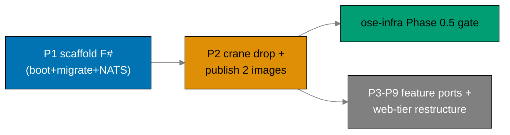

# Restructure Backends to F# and Split Web Tiers

> **Status**: In progress — authored 2026-06-13. Execution not started.
> **Supersedes**: `rewrite-be-fsharp-drop-crane` (this plan's former, narrower identity).

## Context

`ose-public` runs two production backends — `apps/organiclever-be` and `apps/ose-app-be`
`[Repo-grounded: apps/organiclever-be, apps/ose-app-be]` — both
written in **Rust (Axum / sqlx / async-nats)** and shipped by the archived
[`bootstrap-be-messaging-and-crane-media`](../../done/2026-06-12__bootstrap-be-messaging-and-crane-media/README.md)
plan (done 2026-06-12). That plan also stood up a shared F# media service `apps/crane-be/` (PDF to
Markdown over HTTP + NATS), its paired `apps/crane-be-e2e/`, and the shared library
`libs/fsharp-crane-core/`.

This plan began as a backend-only Rust-to-F# rewrite. Grilling surfaced two facts that widened it
into a **platform-tier restructure**:

1. **`organiclever-be` has no product consumer.** `organiclever-web` is **local-first** (PGlite
   in-browser); its only link to the backend is a `/health` status page
   (`ORGANICLEVER_BE_URL` is **optional**). After media is dropped, `organiclever-be` is just
   `health` + a JetStream demo — a walking skeleton, the same category as crane. The decision
   (recorded below) is to make it a **real** backend rather than port an empty shell or drop it.
2. **The web tier is inconsistent.** `organiclever-web` is a single app that conflates a marketing
   landing surface with the local-first journal app. OSE already runs the clean two-tier split
   (`ose-web` marketing + `ose-app-web` app + `ose-app-be`). OrganicLever should match it.
3. **The web-tier naming is ambiguous.** `-web` is used for both public content sites and the OSE
   app's web client, so the **deployment role** a project plays is not legible from its name. This
   plan adopts a repo-wide naming rule (recorded below): **`-www` = a public website served at the
   domain root (the public/marketing/content deployment role, Vercel); `-app-web` = an
   application's web client served at `app.*` (Vercel).** Every public-website project is renamed to
   the `-www` suffix; the application web clients keep `-app-web`. The `-www` suffix denotes the
   **deployment role**, not the internal architecture: the simple flat `src/features/` shape is the
   **default for NEW `-www` sites**, but established content platforms (`ose-www`, `ayokoding-www`)
   keep their existing tRPC/content internals — the suffix does not force a structure retrofit.
4. **The backend tier should be cost-driven generic, not per-tier.** The team self-hosts
   Kubernetes, so each product runs **one generic backend** rather than a per-tier backend. The
   target name is `<product>-be` (generic) — not `<product>-app-be`. The `*-app-web` clients call
   the generic `<product>-be`. This is "generic first": forward-compatible with a future split if
   one is ever needed, without paying the cost of multiple backends today.

### What this plan does

1. **Rewrites both backends from Rust to F# as generic `<product>-be` backends**, mirroring the
   reference stack in `ose-primer/apps/crud-be-fsharp-giraffe/` — Giraffe on .NET 10, EF Core 10 for
   data access, **DbUp** for run-on-boot migrations (replacing `sqlx::migrate!`), and **NATS.Net**
   for messaging (replacing `async-nats`).
   - `ose-app-be` is a **rename + port**: it is renamed `ose-app-be` → **`ose-be`** (generic) and
     ported Rust → F#. It has a real consumer (`ose-app-web` via generated contracts) and six
     non-media bounded contexts; its OpenAPI contract is **preserved** (minus media). It is an
     **AI/LLM backend** (gap-analysis via OpenRouter); the F# port **preserves the OpenRouter
     integration** (core, not media).
   - `organiclever-be` is an **in-place F# rewrite** (the name `organiclever-be` is already generic
     and current — **no `git mv` for the backend**). It becomes a real backend with **minimal
     `journal` CRUD** (mirroring the existing PGlite client schema), plus `health` + the JetStream
     demo. The web↔be consumption model (server-authoritative vs local-first + sync) is a
     **deferred decision**; the journal CRUD ships **unconsumed but contract-smoke-tested** in this
     plan.
2. **Removes the crane media service entirely.** `apps/crane-be/` and `apps/crane-be-e2e/` are
   deleted; both backends lose their `contexts/media/`, their `crane_client`, the `/media/pdf-to-md`
   HTTP endpoint, and the `crane.convert` NATS subject. The image roster drops from three to two.
3. **Splits the organiclever web tier and adopts the `-www`/`-app-web` tier naming.** Today's
   `organiclever-web` (the PGlite app) is renamed to **`organiclever-app-web`**; a **new, simple
   marketing site `organiclever-www`** is created from the extracted `landing` context. The backend
   keeps its current generic name `organiclever-be` (in-place F# rewrite, **not** renamed). So the
   organiclever **atomic rename unit covers only the web tier** (`organiclever-web` →
   `organiclever-app-web` + new `organiclever-www` + their e2e); the backend is a separate in-place
   rewrite.
4. **Renames the existing public-website sites to the `-www` suffix.** `ose-web` → **`ose-www`**
   (structure-only simplification, now also a project rename), `wahidyankf-web` →
   **`wahidyankf-www`** (the structural pattern reference, mechanical rename), and `ayokoding-web` →
   **`ayokoding-www`** (mechanical rename — bilingual content/education platform that **keeps** its
   existing structure and tRPC; the `-www` suffix denotes its public-site deployment role, not a
   structure change). Every public website carries the `-www` tier suffix.
5. **Renames the OSE backend to the generic name.** `ose-app-be` → **`ose-be`** (`git mv`, its own
   atomic rename unit so `main` is never half-renamed): e2e `ose-app-be-e2e` → `ose-be-e2e`, env
   `OSE_APP_BE_*` → `OSE_BE_*`, GHCR image `ghcr.io/wahidyankf/ose-be`, and the `ose-app-web`
   generated-contracts codegen source pointer updated to `ose-be`.
6. **Adds a shared design-system lib** (`libs/ts-ui`) consumed by the app web clients and the new
   simple marketing site (`organiclever-www`, `organiclever-app-web`, `ose-app-web`); `ose-www` and
   `ayokoding-www` keep their established content internals and are not forced to retrofit `ts-ui`.
7. **Simplifies the NEW marketing sites to the wahidyankf pattern** — the new `organiclever-www`
   (greenfield-simple) adopts the flat `src/features/` shape. `ose-www` keeps a structure-only
   simplification (still keeps its tRPC + content/feed pipeline); `ayokoding-www` keeps its full
   existing structure (no reshape). The DDD/Effect/XState/CSR weight stays in the `-app-web` apps.
8. **Restructures the matching `specs/`** — rename organiclever web spec surfaces (keep
   `behavior/organiclever-be`), add the marketing tier; rename the OSE backend spec surfaces to
   match `ose-be` (`behavior/app-be` → `behavior/be`, `components/app-be` → `components/be`) and
   annotate `platform-web` as `ose-www`; rename ayokoding-web spec references to `ayokoding-www`;
   drop crane-be specs (keep crane-cli); remove media everywhere.

`libs/fsharp-crane-core/` **stays** — `apps/crane-cli` (F#) still depends on it. `libs/rust-commons/`
**stays** — `apps/ayokoding-cli` and `apps/ose-cli` (both remain Rust) still depend on it.

### What this plan does NOT do

- **No production cutover.** Vercel project creation, `app.organiclever.com` DNS, the new
  `prod-organiclever-www` / `prod-organiclever-app-web` branches, and the prod-branch renames for the
  renamed public-website sites (`prod-ose-web` → `prod-ose-www`, `prod-wahidyankf-web` →
  `prod-wahidyankf-www`, `prod-ayokoding-web` → `prod-ayokoding-www`) are **deferred downstream** (a
  follow-on / `ose-infra` cutover plan). This plan delivers everything renamed, built, and CI-green,
  but the new www/app split is **not live in production** at plan end.
- It does not resolve the deferred organiclever **sync-vs-server-authoritative** product decision.
- It does not author the converged toolchain (owned by `standardize-repo-toolchain-parity`,
  assumed DONE).

This plan assumes the sibling
[`standardize-repo-toolchain-parity`](../../done/2026-06-13__standardize-repo-toolchain-parity/README.md) plan is
**DONE**: the converged Nx F#/.NET targets, the `npm run doctor` .NET SDK check, the CI conventions,
and the F# coverage tooling already exist. This plan **references** that toolchain; it does not
author it.

## Decision Ledger (resolved during grilling)

| #   | Fork                         | Decision                                                                                                                                                                                                                                                                                                                                                                                     |
| --- | ---------------------------- | -------------------------------------------------------------------------------------------------------------------------------------------------------------------------------------------------------------------------------------------------------------------------------------------------------------------------------------------------------------------------------------------- |
| 1   | organiclever-be purpose      | Becomes **real** (client-server)                                                                                                                                                                                                                                                                                                                                                             |
| 2   | fold vs separate plan        | **Fold + rename** into this plan                                                                                                                                                                                                                                                                                                                                                             |
| 3   | data architecture            | Build **CRUD now**, consumption model **decided later**                                                                                                                                                                                                                                                                                                                                      |
| 4   | k3s gate                     | **Decouple** — bootable BE images ship early                                                                                                                                                                                                                                                                                                                                                 |
| 5   | CRUD scope                   | **Minimal** (one context) now                                                                                                                                                                                                                                                                                                                                                                |
| 6   | www marketing content        | **Extract** the existing `landing` context                                                                                                                                                                                                                                                                                                                                                   |
| 7   | naming                       | organiclever **web** tier → `*-app-*` family (`organiclever-web` app → `organiclever-app-web` + new `organiclever-www`); backend stays generic `organiclever-be` (see #21)                                                                                                                                                                                                                   |
| 8   | OSE frontend                 | **Also realign** (simplify + audit)                                                                                                                                                                                                                                                                                                                                                          |
| 9   | first CRUD context           | **journal**                                                                                                                                                                                                                                                                                                                                                                                  |
| 10  | prod topology (target)       | Reuse www project for marketing; new app project + DNS (**wiring deferred**)                                                                                                                                                                                                                                                                                                                 |
| 11  | shared design system         | **One shared UI lib** (`libs/ts-ui`) for the app web clients + the new `organiclever-www`; `ose-www`/`ayokoding-www` keep their content internals, not forced to adopt                                                                                                                                                                                                                       |
| 12  | OSE realign depth            | Full structure + naming audit                                                                                                                                                                                                                                                                                                                                                                |
| 13  | ose-www simplify depth       | **Structure-only** (keep tRPC + content/feed infra)                                                                                                                                                                                                                                                                                                                                          |
| 14  | organiclever marketing build | **Greenfield-simple**, reuse landing content                                                                                                                                                                                                                                                                                                                                                 |
| 15  | plan shape                   | **Single mega-plan**                                                                                                                                                                                                                                                                                                                                                                         |
| 16  | k3s unblock timing           | **ASAP** — publish bootable images right after scaffold                                                                                                                                                                                                                                                                                                                                      |
| 17  | ts-ui ordering               | **ts-ui first**, then all frontends consume it                                                                                                                                                                                                                                                                                                                                               |
| 18  | prod wiring                  | **Defer** Vercel/DNS/prod-branch downstream                                                                                                                                                                                                                                                                                                                                                  |
| 19  | push cadence / rollback      | **Incremental push per gate**; the rename is one **atomic** commit                                                                                                                                                                                                                                                                                                                           |
| 20  | public-website-tier naming   | **Repo-wide `-www` suffix** = public-website **deployment role** (domain root, Vercel); `-app-web` = app web client at `app.*`. New OL marketing = `organiclever-www`; `ose-web` → `ose-www`; `wahidyankf-web` → `wahidyankf-www`; `ayokoding-web` → `ayokoding-www` (#22). Simple `features/` is the DEFAULT for NEW `-www` sites only — established content platforms keep their internals |
| 21  | backend naming (generic)     | **Generic `<product>-be`** (cost-driven, self-hosted k8s, one backend per product). `organiclever-app-be` REVERTED → in-place F# rewrite of `organiclever-be` (NO `git mv`); `ose-app-be` → **`ose-be`** (`git mv`, own atomic unit). `*-app-web` clients call the generic `<product>-be`                                                                                                    |
| 22  | ayokoding joins `-www`       | `ayokoding-web` → **`ayokoding-www`** (mechanical rename; KEEPS structure + tRPC, NOT a `ts-ui` consumer; `-www` = deployment role)                                                                                                                                                                                                                                                          |
| 23  | container images             | **Only the two generic backends** get GHCR images: `ghcr.io/wahidyankf/organiclever-be`, `ghcr.io/wahidyankf/ose-be`. Web tiers deploy via Vercel — **no** container images                                                                                                                                                                                                                  |
| 24  | `db` context in `ose-app-be` | The Rust `db/` context handles migration orchestration. In the F# port this is **absorbed by DbUp embedded migrations** (`db/migrations/*.sql` as `<EmbeddedResource>`) — not ported as a separate bounded context. The `db/migrations.feature` behavior spec is preserved and re-bound under DbUp infrastructure; it counts toward the Phase 3 gate spec-coverage assertion.                |

### Default mechanical mappings

| Item             | Mapping                                                                                                                                                                                                                                                                                                                                                                                                         |
| ---------------- | --------------------------------------------------------------------------------------------------------------------------------------------------------------------------------------------------------------------------------------------------------------------------------------------------------------------------------------------------------------------------------------------------------------- |
| Rename (OL web)  | `organiclever-web` (app) → `organiclever-app-web`; NEW `organiclever-www` = marketing. Backend `organiclever-be` keeps its name (in-place F# rewrite, NO `git mv`)                                                                                                                                                                                                                                              |
| Rename (BE)      | `ose-app-be` → `ose-be` (own atomic unit); `organiclever-be` unchanged (in-place rewrite)                                                                                                                                                                                                                                                                                                                       |
| Rename (www)     | `ose-web` → `ose-www`; `wahidyankf-web` → `wahidyankf-www`; `ayokoding-web` → `ayokoding-www` (repo-wide `-www` public-site suffix, decisions #20/#22)                                                                                                                                                                                                                                                          |
| Dev ports        | marketing `organiclever-www` keeps **3200**; app `organiclever-app-web` = **3202**; `organiclever-be` keeps **8202**; `ose-www` keeps **3100**; `wahidyankf-www` keeps **3201**; `ayokoding-www` keeps its current port                                                                                                                                                                                         |
| E2E pairs        | `organiclever-web-e2e` (app) → `organiclever-app-web-e2e`; NEW `organiclever-www-e2e` (marketing); `organiclever-be-e2e` (kept, name unchanged); `ose-app-be-e2e` → `ose-be-e2e`; `ose-web-be-e2e` → `ose-www-be-e2e`; `ose-web-fe-e2e` → `ose-www-fe-e2e`; `wahidyankf-web-fe-e2e` → `wahidyankf-www-fe-e2e`; `ayokoding-web-be-e2e` → `ayokoding-www-be-e2e`; `ayokoding-web-fe-e2e` → `ayokoding-www-fe-e2e` |
| Shared lib       | `libs/ts-ui` (tokens + primitives; shadcn/Radix/Tailwind/CVA per swe-ui conventions)                                                                                                                                                                                                                                                                                                                            |
| OSE app-web name | `ose-app-web` already correct — **no rename** (only `ose-app-be` → `ose-be` and `ose-web` → `ose-www`)                                                                                                                                                                                                                                                                                                          |
| wahidyankf-www   | **pattern reference** for the simple `features/` shape **and** renamed `wahidyankf-web` → `wahidyankf-www`; not forced onto `ts-ui` (separate personal brand)                                                                                                                                                                                                                                                   |
| ayokoding-www    | `ayokoding-web` → `ayokoding-www` mechanical rename only; KEEPS structure + tRPC; NOT a `ts-ui` consumer (#22)                                                                                                                                                                                                                                                                                                  |

## Approach

```mermaid
%% Color-blind-friendly palette: blue #0173B2, orange #DE8F05, green #029E73, purple #CC78BC, grey #808080
flowchart TB
  subgraph BEFORE["Before (Rust + crane, single organiclever web)"]
    direction TB
    R_OL["organiclever-be<br/>Rust/Axum"]
    R_OA["ose-app-be<br/>Rust/Axum"]
    R_CB["crane-be (F#)<br/>media service"]
    W_OL["organiclever-web<br/>app + landing (PGlite)"]
  end

  subgraph AFTER["After (F# generic -be, no crane, split web, -www public-site tier)"]
    direction TB
    F_OL["organiclever-be<br/>F#/Giraffe (journal CRUD, in-place)"]
    F_OA["ose-be<br/>F#/Giraffe (+ OpenRouter)"]
    WW["organiclever-www<br/>marketing (simple)"]
    WA["organiclever-app-web<br/>app (PGlite, CSR)"]
    OWW["ose-www<br/>content (was ose-web)"]
    KWW["wahidyankf-www<br/>(was wahidyankf-web)"]
    AKW["ayokoding-www<br/>content (was ayokoding-web)"]
    UI["libs/ts-ui<br/>shared design system"]
  end

  R_OL -->|in-place rewrite| F_OL
  R_OA -->|rewrite + rename| F_OA
  R_CB -->|deleted| GONE["removed:<br/>media + crane.convert"]
  W_OL -->|rename| WA
  W_OL -->|extract landing| WW
  UI -.consumed by.-> WW
  UI -.consumed by.-> WA

  linkStyle default stroke:#808080,stroke-width:1px

  style BEFORE fill:#FFFFFF,stroke:#000000,color:#000000
  style AFTER fill:#FFFFFF,stroke:#000000,color:#000000
  style R_OL fill:#DE8F05,stroke:#000000,color:#000000
  style R_OA fill:#DE8F05,stroke:#000000,color:#000000
  style R_CB fill:#CC78BC,stroke:#000000,color:#000000
  style W_OL fill:#DE8F05,stroke:#000000,color:#000000
  style F_OL fill:#029E73,stroke:#000000,color:#000000
  style F_OA fill:#029E73,stroke:#000000,color:#000000
  style WW fill:#0173B2,stroke:#000000,color:#FFFFFF
  style WA fill:#0173B2,stroke:#000000,color:#FFFFFF
  style OWW fill:#0173B2,stroke:#000000,color:#FFFFFF
  style KWW fill:#0173B2,stroke:#000000,color:#FFFFFF
  style AKW fill:#0173B2,stroke:#000000,color:#FFFFFF
  style UI fill:#CC78BC,stroke:#000000,color:#000000
  style GONE fill:#808080,stroke:#000000,color:#FFFFFF
```



## Scope

### In Scope

- Rewrite + rename `apps/ose-app-be` → `apps/ose-be` from Rust to F# (Giraffe / EF Core 10 / DbUp /
  NATS.Net), preserving its OpenAPI contract minus media, including its six non-media bounded
  contexts (`health`, `ai-orchestration`, `gap-analysis`, `internal-policy`, `regulatory-source`) and
  its **OpenRouter LLM integration** (gap-analysis; core, preserved).
- **In-place F# rewrite** of `apps/organiclever-be` (name kept — NO `git mv`), with **minimal
  `journal` CRUD** mirroring the existing PGlite client schema, plus `health` + the JetStream demo.
- Reuse / author migration SQL via DbUp-embedded `db/migrations/*.sql`, run on boot.
- Keep `generated-contracts/` codegen — regenerate F# contract types from the OpenAPI specs; update
  the `ose-app-web` codegen source pointer to `ose-be`.
- **Delete** `apps/crane-be/` and `apps/crane-be-e2e/` (+ `libs/fsharp-crane-core` is removed once
  `crane-cli`'s dependency is re-verified — see Out of Scope note); remove `contexts/media/`,
  `crane_client`, the `/media/pdf-to-md` endpoint, and the `crane.convert` subject from both backends.
- Publish workflow **3 → 2 images** (affected-aware) — **only the two generic backends** get GHCR
  images: `ghcr.io/wahidyankf/organiclever-be`, `ghcr.io/wahidyankf/ose-be`; web tiers deploy via
  Vercel (no container images); bootable backend images published **early** to unblock the downstream
  k3s Phase 0.5 gate.
- Rename today's `organiclever-web` (app) → `organiclever-app-web`; create a **new simple
  `organiclever-www`** marketing site from the extracted `landing` context (wahidyankf pattern).
- Rename `ose-web` → **`ose-www`** (structure-only simplification PLUS a project rename),
  `wahidyankf-web` → **`wahidyankf-www`** (the pattern reference, mechanical rename), and
  `ayokoding-web` → **`ayokoding-www`** (mechanical rename; keeps structure + tRPC), adopting the
  repo-wide `-www` public-website-tier suffix.
- Create `libs/ts-ui` and adopt it across the app web clients + the new `organiclever-www`
  (`organiclever-www`, `organiclever-app-web`, `ose-app-web`); `ose-www`/`ayokoding-www` keep their
  content internals (not forced to adopt).
- Simplify `ose-www` (structure-only) to the `wahidyankf-www` `src/features/` shape, keeping its
  tRPC + content/feed pipeline; full OSE frontend structure + naming audit.
- Adapt all E2E runners (rename pairs incl. the `-www`/`ose-be`/`ayokoding-www` e2e pairs, add a
  marketing pair, drop media scenarios).
- New F# Dockerfiles for the two backends; per-app integration/e2e compose adjusted.
- `<APP>_*` env vars updated for the F# stack and the renamed projects (`OSE_APP_BE_*` → `OSE_BE_*`;
  `ORGANICLEVER_BE_*` unchanged); crane vars removed; drift guard kept green.
- **Restructure `specs/`** to match every rename (organiclever web, `ose-be`, `ayokoding-www`), the
  new marketing tier, the dropped crane-be, and the removed media surfaces (see
  [tech-docs.md](./tech-docs.md) Specs Restructure).
- **Comprehensive `.md` sweep**: update every related markdown surface (`AGENTS.md`, `CLAUDE.md`,
  `docs/reference/monorepo-structure.md`, `docs/reference/platform-bindings.md`, each renamed app's
  `README.md`, new `apps/organiclever-www/README.md` + `libs/ts-ui/README.md`,
  `repo-governance/conventions/structure/file-naming.md` + the app-naming convention) with a
  repo-wide grep acceptance proving zero stale references.

### Out of Scope

- **Production cutover**: Vercel project creation, `app.organiclever.com` DNS, the
  `prod-organiclever-www` / `prod-organiclever-app-web` branches, and the prod-branch renames for the
  renamed public-website sites (`prod-ose-web` → `prod-ose-www`, `prod-wahidyankf-web` →
  `prod-wahidyankf-www`, `prod-ayokoding-web` → `prod-ayokoding-www`) — deferred to a follow-on /
  `ose-infra` plan.
- The deferred organiclever **sync-vs-server-authoritative** decision and any consumption wiring
  beyond the contract smoke-probe.
- Authoring the converged Nx F#/.NET targets, doctor .NET SDK check, CI conventions, or F# coverage
  tooling — owned by `standardize-repo-toolchain-parity` (assumed DONE).
- New end-user backend features beyond `journal` CRUD (organiclever) / current non-media parity (ose).
- `apps/crane-cli`, `libs/rust-commons` internals (dependency graph re-verified only).
  `libs/fsharp-crane-core` is removed after confirming `crane-cli` no longer depends on it.
- `wahidyankf-web` and `ayokoding-web` **content/behavior/structure** changes; the only change to each
  is the mechanical `-www` project rename (`wahidyankf-web` → `wahidyankf-www`, `ayokoding-web` →
  `ayokoding-www`).
- k3s manifests, ClusterIP wiring, production deployment — owned by `ose-infra`.

### Affected Areas

- `apps/ose-app-be/` → `apps/ose-be/`, `apps/ose-app-be-e2e/` → `apps/ose-be-e2e/` (Rust → F# port +
  rename; drop media; preserve OpenRouter)
- `apps/organiclever-be/`, `apps/organiclever-be-e2e/` (in-place F# rewrite — name kept, **no rename**)
- `apps/organiclever-web/` → `apps/organiclever-app-web/`, `apps/organiclever-web-e2e/` →
  `apps/organiclever-app-web-e2e/` (rename)
- NEW `apps/organiclever-www/` + `apps/organiclever-www-e2e/` (marketing site + e2e)
- NEW `libs/ts-ui/` (shared design system)
- `apps/ose-web/` → `apps/ose-www/`, `apps/ose-web-be-e2e/` → `apps/ose-www-be-e2e/`,
  `apps/ose-web-fe-e2e/` → `apps/ose-www-fe-e2e/` (simplify structure-only + rename)
- `apps/ose-app-web/` (adopt `ts-ui`; codegen source pointer → `ose-be`)
- `apps/wahidyankf-web/` → `apps/wahidyankf-www/`, `apps/wahidyankf-web-fe-e2e/` →
  `apps/wahidyankf-www-fe-e2e/` (mechanical rename only)
- `apps/ayokoding-web/` → `apps/ayokoding-www/`, `apps/ayokoding-web-be-e2e/` →
  `apps/ayokoding-www-be-e2e/`, `apps/ayokoding-web-fe-e2e/` → `apps/ayokoding-www-fe-e2e/`
  (mechanical rename only; keeps structure + tRPC)
- `apps/crane-be/`, `apps/crane-be-e2e/`, `libs/fsharp-crane-core/` (**deleted**)
- `specs/apps/organiclever/`, `specs/apps/ose/`, `specs/apps/crane/`, `specs/apps/ayokoding/`
  (restructure; rename `ose-be` surfaces; ayokoding-www references; drop crane-be + media)
- `.github/workflows/publish-images.yml` (3 → 2 images), CI workflows referencing renamed projects
- `env-contract.yaml`, each backend `.env.example`, each web `.env.example`
- `docs/reference/monorepo-structure.md`, `docs/reference/platform-bindings.md`, `AGENTS.md`,
  `CLAUDE.md`, every renamed app `README.md`, `repo-governance/conventions/structure/file-naming.md`
  (project roster + platform tags + `www` app type)

## Relationship to ose-infra k3s Deploy Plans

This plan is the **upstream prerequisite** for the two `ose-infra` k3s deploy plans (cited by path —
the reader is not assumed to have access to the private `ose-infra` repo):

- `ose-infra/plans/in-progress/deploy-k3s-cluster-staging/`
- `ose-infra/plans/in-progress/deploy-k3s-cluster-prod/`

Each carries a **Phase 0.5 gate** that hard-stops until: the **two** generic F# backend images
(`ghcr.io/wahidyankf/organiclever-be`, `ghcr.io/wahidyankf/ose-be`) are publicly pullable;
DbUp run-on-boot migrations and NATS.Net JetStream wiring are confirmed in those images; and
**crane-be is gone**. Because k3s only needs **bootable** images, this plan publishes them **early**
(Phase 2) — the gate unblocks before the full feature ports and the entire web-tier restructure
complete. Only the two backends ship images; the web tiers deploy via Vercel.



## Execution Order (Dependency Chain)

This plan is part of a cross-repo delivery chain; execute in this order:

1. **[standardize-repo-toolchain-parity](../../done/2026-06-13__standardize-repo-toolchain-parity/README.md)** (all three
   repos) — converged toolchain baseline; no upstream prerequisite.
2. **This plan — `restructure-fsharp-be-and-web-app-tiers`** (ose-public) **and**
   **`deploy-proxmox-datacenter-manager`** (ose-infra) — independent of each other (parallel-safe);
   both require step 1.
3. **`deploy-k3s-cluster-staging`** (ose-infra) — requires steps 1 and 2 (this plan delivers the two
   public F# GHCR images its Phase 0.5 gate verifies, **published early at Phase 2**).
4. **`deploy-k3s-cluster-prod`** (ose-infra) — requires steps 1, 2, and 3.

A **prod-cutover follow-on** (Vercel/DNS/prod-branch wiring for the organiclever www/app split) is
registered at archival (Phase 9) but is **not** part of this chain.

## Plan Navigation

| Document                       | Purpose                                                             |
| ------------------------------ | ------------------------------------------------------------------- |
| [README.md](./README.md)       | Context, decisions, scope, approach, infra relationship (this file) |
| [brd.md](./brd.md)             | Business goal, rationale, affected roles, success criteria, risks   |
| [prd.md](./prd.md)             | Personas, user stories, Gherkin acceptance criteria, product scope  |
| [tech-docs.md](./tech-docs.md) | F# stack, Rust→F# mapping, web-tier split, ts-ui, specs restructure |
| [delivery.md](./delivery.md)   | Phased `[AI]`/`[HUMAN]` delivery checklist with per-phase gates     |

## Delivery Phases At A Glance

| Phase | Name                                                                                | Outcome                                                                                                              |
| ----- | ----------------------------------------------------------------------------------- | -------------------------------------------------------------------------------------------------------------------- |
| 0     | Environment, prerequisite gate, dependency clearance                                | Toolchain converged; parity plan DONE; F# pins re-confirmed                                                          |
| 1     | Scaffold both F# skeletons + EF/DbUp + codegen                                      | Both backends boot + migrate + NATS + `/health`; F# contract types gen                                               |
| 2     | Remove crane + media; publish 3→2 (bootable)                                        | crane gone; two bootable images public → **k3s Phase 0.5 unblocked**                                                 |
| 3     | Port ose-app-be → ose-be (5 contexts, preserve contract + OpenRouter)               | `ose-app-be` → `ose-be` fully F#; contract preserved minus media; OpenRouter intact                                  |
| 4     | organiclever-be in-place rewrite + journal CRUD; organiclever web split + rename    | journal CRUD + smoke-probe (be name kept); web tier renamed `*-app-*` + new `organiclever-www`; consumption deferred |
| 5     | `libs/ts-ui` shared design system                                                   | Tokens + primitives lib builds; ready for frontend adoption                                                          |
| 6     | organiclever web consume ts-ui (split landed in P4)                                 | `organiclever-www` + `organiclever-app-web` consume ts-ui (code+CI)                                                  |
| 7     | Rename + simplify ose-www, rename wahidyankf-www + ayokoding-www, ose-app-web ts-ui | `ose-web`→`ose-www`, `wahidyankf-web`→`wahidyankf-www`, `ayokoding-web`→`ayokoding-www`; OSE frontend realigned      |
| 8     | E2E + coverage + quality gate                                                       | All renamed/new e2e pairs green; coverage met; full gate green                                                       |
| 9     | Docs + specs finalize + archival                                                    | Docs/specs updated; cutover follow-on registered; plan archived; CI ok                                               |

## Worktree

This plan runs in its **own git worktree** at `worktrees/restructure-fsharp-be-and-web-app-tiers/` so
it can execute in **parallel** with other projects without blocking `main`. All delivery phases
execute inside this worktree; pushes go to `origin main` per the per-gate cadence.

Provision the worktree from the repo root (per the
[Worktree Toolchain Initialization](../../../repo-governance/development/workflow/worktree-setup.md)
convention — after `git worktree add`, run **both** `npm install` AND `npm run doctor -- --fix`
inside the worktree):

```bash
git worktree add worktrees/restructure-fsharp-be-and-web-app-tiers main
cd worktrees/restructure-fsharp-be-and-web-app-tiers
npm install
npm run doctor -- --fix
```

The repo-local `WorktreeCreate` hook routes worktrees to `worktrees/<name>/` (see
[Worktree Path Convention](../../../repo-governance/conventions/structure/worktree-path.md)). The
plan-execution Step 0 gate enters this worktree by default, auto-provisioning from the latest
`origin/main` when missing and syncing with `origin/main` before implementing. The full provisioning
checklist also lives in [delivery.md](./delivery.md) `## Worktree`.

## Git Workflow

- **Worktree**: all work happens in `worktrees/restructure-fsharp-be-and-web-app-tiers/` (see the
  `## Worktree` section above and [delivery.md](./delivery.md) `## Worktree`), enabling parallel
  execution alongside other projects without blocking `main`.
- **Branching**: Trunk Based Development — worktree-to-main, **incremental push per phase gate** (main
  stays green throughout), direct push to `origin main`, no PR. Each wide rename (the organiclever
  web-tier `*-app-*` rename, the `ose-app-be` → `ose-be` rename, and each `-www` rename) is pushed as
  its **own atomic commit** so `main` is never left with a half-renamed Nx graph.
- **Commits**: thematic, Conventional Commits, split by domain/concern. See
  [Trunk Based Development Convention](../../../repo-governance/development/workflow/trunk-based-development.md).
