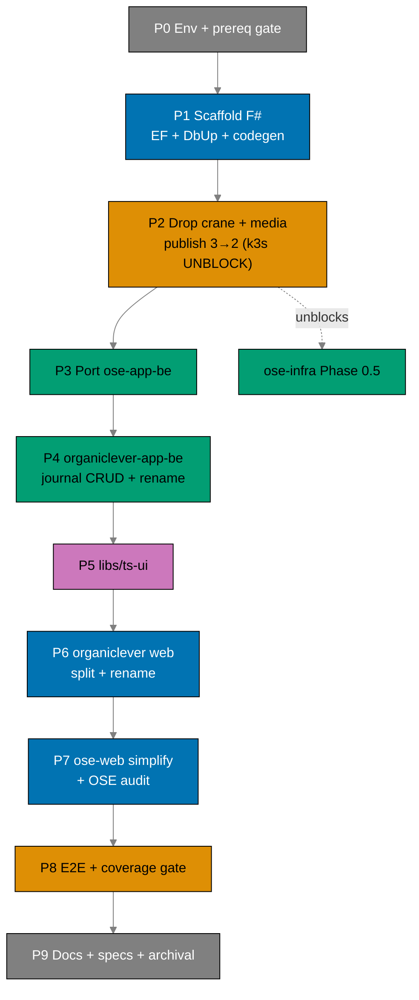

# Delivery Checklist: Restructure Backends to F# and Split Web Tiers

> **Legend** — `[AI]`: an agent performs the step (the default; unmarked steps are `[AI]`).
> `[HUMAN]`: only a human can do it (physical action, out-of-band approval, real-secret or
> privileged-credential handling). `[AI+HUMAN]`: agent prepares, human approves or finishes.
>
> **Phase Gate** — every phase ends with a `### Phase N Gate` (must-pass verification) plus a
> `> **Pause Safety**:` note (the safe-to-stop state and the single command to resume). A phase is not
> complete until its gate is green; do not start phase N+1 while any gate check fails.
>
> **Push cadence** — push to `origin main` after each phase gate is green (decision #19). `main` must
> stay green throughout. The wide `*-app-*` rename is pushed as **one atomic commit**.

## Human Touchpoints (autonomy map)

This plan runs autonomously end-to-end except for **at most one** human action:

- **GHCR package visibility for `organiclever-app-be`** (Phase 2). The organiclever backend image is a
  **new GHCR package name** after the rename, so it may default to private on first push. If anonymous
  `docker pull` fails, a human flips it to public once in package settings (no `gh`/REST API for it).
  `ose-app-be` keeps its existing public package.

Everything else is `[AI]`. **No real `.env*` handling is required** — all automated test env comes from
committed, non-secret `docker-compose` files. Agents never touch real `.env*` per the secrets guardrail.
The production cutover (Vercel/DNS/prod branches) is **out of scope** (deferred downstream).

## Worktree

Worktree path: `worktrees/restructure-fsharp-be-and-web-app-tiers/`

Optional manual pre-provisioning (run from repo root):

```bash
claude --worktree restructure-fsharp-be-and-web-app-tiers
```

The plan-execution Step 0 gate enters this worktree by default: it auto-provisions from the latest
`origin/main` when missing, syncs with `origin/main` before implementing, and prompts before deleting
the worktree after the plan is archived and pushed.

See
[Worktree Path Convention](../../../repo-governance/conventions/structure/worktree-path.md)
and
[Plans Organization Convention §Worktree Specification](../../../repo-governance/conventions/structure/plans.md#worktree-specification).

## Phase Dependency Overview



---

## Phase 0: Environment, Prerequisite Gate, Dependency Clearance

> _Executor: repo-setup-manager_

- [ ] [AI] Install dependencies in the root worktree: `npm install` — acceptance: exits 0.
- [ ] [AI] Converge the polyglot toolchain: `npm run doctor -- --fix` — acceptance: exits 0; .NET 10
      SDK, Rust, Docker, Node, jq present.
- [ ] [AI] **Prerequisite hard-stop**: confirm `standardize-repo-toolchain-parity` is DONE — verify the
      converged F#/.NET Nx targets exist, `npm run doctor` reports the .NET SDK, and the F# coverage
      tooling resolves. If any is missing, **stop** and surface it.
- [ ] [AI] Grep `env-contract.yaml` to confirm `lang: fsharp` is an accepted value. If not, record the
      resolution path before retagging surfaces.
- [ ] [AI] Record the affected-projects baseline:
      `npx nx affected -t typecheck lint test:quick specs:coverage --base=origin/main` — acceptance:
      pass/fail counts recorded; every preexisting failure documented and resolved. Fix ALL failures
      found — including preexisting issues not caused by your changes. This follows the root cause
      orientation principle.
- [ ] [AI] **Dependency clearance (Path B)**: re-confirm each F# pin (Giraffe 8.x, EF Core 10, Npgsql,
      EFCore.NamingConventions, dbup-core/postgresql, FSharp.SystemTextJson, NATS.Net, analyzers,
      altcover) **and** the new frontend deps for `ts-ui` (shadcn/Radix/CVA) against release dates;
      cutoff = exec date minus 60 days; CVE-clean. Resolve the exact Giraffe 8.x pin. — acceptance:
      confirmed versions + dates written back into `tech-docs.md`; none inside the soak.
      _Suggested executor: web-research-maker._
- [ ] [AI] Verify the dependency-graph baseline: `apps/crane-cli` → `libs/fsharp-crane-core`, and
      `apps/ayokoding-cli` + `apps/ose-cli` → `libs/rust-commons`. — acceptance: `nx graph` confirms.

### Phase 0 Gate

- [ ] [AI] `npm run doctor` — exits 0; .NET 10 SDK, Rust, Docker, Node, jq present.
- [ ] [AI] `standardize-repo-toolchain-parity` present in `plans/done/`.
- [ ] [AI] `grep -r 'lang: fsharp' env-contract.yaml` — at least one match.
- [ ] [AI] `npx nx affected -t typecheck lint test:quick specs:coverage --base=origin/main` — no
      unresolved failures.
- [ ] [AI] `nx graph` shows the three preserved dependency edges.
- [ ] [AI] F# + ts-ui pins written back to `tech-docs.md` with Path-B soak dates.

> **Pause Safety**: clean tree, no source changes. Resume: re-run the baseline command.

---

## Phase 1: Scaffold Both F# Skeletons + EF/DbUp + Codegen

> _Suggested executor: swe-fsharp-dev (or swe-rust-dev as F#-capable agent)_

Goal: both backends **boot + migrate + connect NATS + serve `/health`** — bootable but feature-empty —
so Phase 2 can publish images. Work under the **current** names (`ose-app-be`, `organiclever-be`); the
organiclever rename happens atomically in Phase 4.

### 1a — Fsproj scaffolding

- [ ] [AI] **RED**: Create minimal fsproj stubs (`src/OseAppBe/OseAppBe.fsproj`,
      `src/OrganicleverBe/OrganicleverBe.fsproj`; OutputType=Exe, net10.0, empty `<Compile>`); run
      `nx build ose-app-be organiclever-be` — acceptance: build fails (stubs wired but incomplete).
- [ ] [AI] **GREEN**: Fill both fsproj to mirror the primer (analyzers, NoWarn, explicit `<Compile>`
      ordering, `<EmbeddedResource Include="db/migrations/*.sql" />`); add `global.json`,
      `dotnet-tools.json`, `fsharplint.json` by copying from `ose-primer/apps/crud-be-fsharp-giraffe/` —
      acceptance: `nx build ose-app-be organiclever-be` exits 0; .NET artifacts in `dist/`.
- [ ] [AI] **REFACTOR**: No Rust toolchain entry points remain in either build target — acceptance:
      `grep -r 'cargo\|rustc' apps/ose-app-be/project.json apps/organiclever-be/project.json` zero.

### 1b — EF Core / DbUp wiring

- [ ] [AI] **RED**: Integration test asserting the EF context boots against a fresh PostgreSQL container
      and the schema-version table exists — run `nx run ose-app-be:test:integration` — acceptance: fails
      ("relation SchemaVersions does not exist").
- [ ] [AI] **GREEN**: Create `Infrastructure/AppDbContext.fs` (snake_case mapping) + DbUp on-boot
      upgrade in `Program.fs` mirroring the primer (lines 153-166) for both backends; move ose-app-be's
      `migrations/*.sql` → `db/migrations/` (embedded); author organiclever's `db/migrations/` from the
      PGlite journal schema; record the missing-`DATABASE_URL` decision (SQLite fallback vs fail-fast)
      in `tech-docs.md` Deviations — acceptance: `test:integration` passes for both; ose-app-be schema
      matches the sqlx-produced schema on a fresh DB.
- [ ] [AI] **REFACTOR**: Extract the DbUp bootstrap into a shared `Database.fs` per backend —
      acceptance: `test:integration` still passes for both.

### 1c — Codegen + Nx target retargeting

- [ ] [AI] **RED**: Remove the Rust stub codegen target from each `project.json`; run
      `nx run ose-app-be:codegen` — acceptance: fails ("target not found").
- [ ] [AI] **GREEN**: Replace codegen with the F# `openapi-generator-cli -g fsharp-giraffe-server`
      invocation; set `dependsOn: ["codegen"]` on `typecheck`/`build`; retarget the full F# target set
      (post-parity names); switch tags to `lang:fsharp`/`platform:giraffe` — acceptance:
      `nx run ose-app-be:codegen` and `nx run organiclever-be:codegen` exit 0; F# types under
      `generated-contracts/`.
- [ ] [AI] **REFACTOR**: `implicitDependencies` still include `<domain>-contracts` + `rhino-cli` —
      acceptance: `nx graph` shows edges; `typecheck` exits 0.

### 1d — Minimal `/health` + NATS connect + compose

- [ ] [AI] **RED**: Unit test asserting the `/health` Giraffe handler returns 200 + JSON — run
      `nx run ose-app-be:test:unit` — acceptance: fails ("HealthHandler module not found").
- [ ] [AI] **GREEN**: Implement `/health` handler + a minimal NATS.Net connect in `Program.fs` for both
      backends; add `docker-compose.integration.yml` (PostgreSQL) for each — acceptance:
      `test:unit` passes; `nx build ose-app-be organiclever-be` exits 0.
- [ ] [AI] **REFACTOR**: Each `Program.fs` composition root is clean (host, DbUp, NATS, routes) —
      acceptance: `typecheck` exits 0 with TreatWarningsAsErrors.

### Phase 1 Gate

- [ ] [AI] `nx build ose-app-be organiclever-be` — exits 0; .NET artifacts present.
- [ ] [AI] `nx run ose-app-be:codegen && nx run organiclever-be:codegen` — exits 0.
- [ ] [AI] `nx run ose-app-be:test:unit && nx run organiclever-be:test:unit` — exits 0.
- [ ] [AI] `nx run ose-app-be:test:integration && nx run organiclever-be:test:integration` — exits 0;
      DbUp schema correct on a fresh DB.
- [ ] [AI] `grep -r 'cargo\|rustc' apps/ose-app-be/project.json apps/organiclever-be/project.json` zero.
- [ ] [AI] Missing-`DATABASE_URL` decision recorded in `tech-docs.md`.

> **Pause Safety**: two bootable F# shells (empty routing). Rust feature sources still in history.
> Resume: `nx build ose-app-be organiclever-be`. **Push after gate.**

---

## Phase 2: Remove Crane + Media; Publish 3 → 2 (bootable) — k3s UNBLOCK

> _Suggested executor: swe-rust-dev (Rust-side removal) + ci-fixer (workflow)_

- [ ] [AI] Delete `apps/crane-be/` and `apps/crane-be-e2e/` (`git rm -r`).
- [ ] [AI] Remove any media/crane references from both backends (routes, `*_CRANE_URL` env vars,
      `crane.convert`) — most absent after Phase 1's empty scaffold; sweep to zero.
- [ ] [AI] **Specs — crane/media removal** (per tech-docs Specs Restructure): delete
      `specs/apps/ose/behavior/app-be/gherkin/messaging/crane-convert.feature`,
      `specs/apps/organiclever/behavior/organiclever-be/gherkin/messaging/crane-convert.feature`; remove
      crane/media terms from `specs/apps/ose/ddd/ubiquitous-language/messaging.md`; remove/repurpose
      `specs/apps/ose/ddd/ubiquitous-language/media.md` + `specs/apps/organiclever/ddd/ubiquitous-language/be-media.md`;
      remove `crane-be via crane.convert` from `specs/apps/ose/ddd/bounded-contexts.yaml`; remove
      `be-media` + crane refs from `specs/apps/organiclever/ddd/bounded-contexts.yaml`; delete
      `specs/apps/crane/behavior/crane-be/` + `specs/apps/crane/components/be/` (keep crane-cli); update
      `specs/apps/crane/README.md` + containers/product/system-context to crane-cli-only — acceptance:
      `grep -rE 'crane[_.]|/media/pdf-to-md|crane\.convert' apps/ specs/ --exclude-dir=crane-cli --exclude-dir=fsharp-crane-core`
      returns zero.
- [ ] [AI] Update `.github/workflows/publish-images.yml`: drop `build-crane-be` + `publish-crane-be`
      (3 → 2); keep affected-aware `detect`; rename the organiclever output to `organiclever-app-be`
      (placeholder until Phase 4 rename — or keep `organiclever-be` job here and rename atomically in
      Phase 4; record the chosen order).
- [ ] [AI] Replace each backend's Rust Dockerfile with a .NET multi-stage Dockerfile (sdk:10.0 →
      aspnet:10.0).
- [ ] [AI] Remove crane env vars from `apps/ose-app-be/.env.example` and
      `apps/organiclever-be/.env.example`; also remove the crane-be surface entry from
      `env-contract.yaml` — acceptance: `rhino-cli env validate` exits 0; `grep -rE
'OSE_APP_BE_CRANE_URL|ORGANICLEVER_BE_CRANE_URL' apps/ose-app-be/.env.example
apps/organiclever-be/.env.example` returns zero.
- [ ] [AI] Confirm `libs/fsharp-crane-core` + `libs/rust-commons` still exist and dependents build:
      `nx build crane-cli ayokoding-cli ose-cli`.
- [ ] [AI] Build both backends as .NET Docker images locally (`docker build -f apps/<be>/Dockerfile …`)
      — acceptance: both exit 0.
- [ ] [AI] Push to `origin main` to trigger `publish-images.yml` (already wired to push); verify via
      `gh run list --workflow=publish-images.yml` that a run appears and succeeds — acceptance: `gh run
list --workflow=publish-images.yml` shows a completed successful run publishing both
      `ose-app-be` and `organiclever-app-be` (or `organiclever-be` if rename deferred) images.
- [ ] [HUMAN] Verify anonymous `docker pull ghcr.io/wahidyankf/ose-app-be:latest` and
      `…/organiclever-app-be:latest` (or `organiclever-be` if rename deferred to P4) succeed without
      auth. If the organiclever package defaults private, flip it public once.

### Phase 2 Gate

- [ ] [AI] `test ! -d apps/crane-be && test ! -d apps/crane-be-e2e` — exits 0.
- [ ] [AI] `grep -rE 'crane[_.]|/media/pdf-to-md|crane\.convert' apps/ specs/ --exclude-dir=crane-cli --exclude-dir=fsharp-crane-core` — zero.
- [ ] [AI] `grep -rE 'crane-be' specs/apps/crane/` — zero (crane-cli refs only remain).
- [ ] [AI] `rhino-cli env validate` — exits 0; no crane env vars.
- [ ] [AI] `grep 'crane-be' .github/workflows/publish-images.yml` — zero.
- [ ] [AI] `nx build crane-cli ayokoding-cli ose-cli` — exits 0.
- [ ] [HUMAN] Both backend images anonymously pullable → **ose-infra Phase 0.5 unblocked.**

> **Pause Safety**: media fully removed; two bootable images public; infra unblocked. Resume:
> `npx nx affected -t build --base=origin/main`. **Push after gate.**

---

## Phase 3: Port ose-app-be to F# (5 contexts, preserve contract)

> _Suggested executor: swe-fsharp-dev_

- [ ] [AI] **RED**: Failing unit tests for each of the five bounded-context handlers (`health`,
      `ai-orchestration`, `gap-analysis`, `internal-policy`, `regulatory-source`) in
      `apps/ose-app-be/tests/unit/` — acceptance: all five fail (module/route not found).
- [ ] [AI] **GREEN**: Implement each as a `Contexts/<Name>/{Domain,Application,Infrastructure,Api}`
      slice; wire EF repositories (`Infrastructure/Repositories/EfRepositories.fs`) + DI in `Program.fs`;
      implement `Contexts/Messaging/` (NATS.Net client, JetStream demo, status surface), **dropping**
      `crane_client`; preserve `OSE_APP_BE_OPENROUTER_*` placeholder guards — acceptance:
      `nx run ose-app-be:test:unit` + `:test:integration` pass.
- [ ] [AI] **REFACTOR**: Extract `Infrastructure/NatsClient.fs`; each context independent (no
      cross-context imports except shared Domain) — acceptance: `typecheck` exits 0.
- [ ] [AI] **Spec adaptation**: bind F# TickSpec steps for all five contexts; remove media from
      `specs/apps/ose/` behavior/contract; regenerate via `nx run ose-app-be:codegen` — acceptance:
      `nx run ose-app-be:spec-coverage` exits 0 (messaging excluded); no media in generated types.

### Phase 3 Gate

- [ ] [AI] `nx affected -t typecheck lint test:quick spec-coverage --base=origin/main` — exits 0 for
      ose-app-be.
- [ ] [AI] `nx run ose-app-be:test:quick` — exits 0; coverage ≥90%.
- [ ] [AI] `nx run ose-app-be:spec-coverage` — exits 0; all five contexts bound.
- [ ] [AI] `nx run ose-app-be:codegen` — exits 0; contract validates minus media.
- [ ] [AI] `grep 'OSE_APP_BE_OPENROUTER' apps/ose-app-be/src/OseAppBe/Program.fs` — ≥1 match.

> **Pause Safety**: ose-app-be fully F#, contract preserved. Resume: `nx run ose-app-be:test:quick`.
> **Push after gate.**

---

## Phase 4: organiclever-app-be — Minimal journal CRUD + Atomic Rename

> _Suggested executor: swe-fsharp-dev_

### 4a — journal CRUD + health + messaging

- [ ] [AI] **RED**: Failing unit + journal-CRUD tests in `apps/organiclever-be/tests/` asserting
      create/read/update/delete return expected status + shape, and `/health` + messaging status — run
      `nx run organiclever-be:test:unit` — acceptance: fail (handlers/repo not found).
- [ ] [AI] **GREEN**: Implement `Contexts/{Health,Journal,Messaging}/` slices; EF repository for
      `journal` whose entity mirrors the PGlite client schema
      (`apps/organiclever-web/src/contexts/journal/`); NATS.Net JetStream demo + status; DI in
      `Program.fs` — acceptance: `test:unit` + `test:integration` pass.
- [ ] [AI] **REFACTOR**: Extract `NatsClient.fs`; journal slice independent — acceptance: `typecheck` 0.
- [ ] [AI] **Contract**: add the `journal` path to `specs/apps/organiclever/.../contracts`; add journal
      Gherkin under `specs/apps/organiclever/behavior/organiclever-be/gherkin/journal/`; regenerate via
      `nx run organiclever-be:codegen` — acceptance: codegen 0; journal types present.
- [ ] [AI] **Smoke-probe**: a contract smoke-probe (curl or test) exercises the journal CRUD over HTTP
      — acceptance: all four verbs return expected responses. The CRUD ships **unconsumed**
      (organiclever-app-web stays PGlite).

### 4b — Atomic `*-app-*` rename

> Single atomic commit (decision #19). Apply ALL of the following together, then push as one commit.

- [ ] [AI] Rename dirs: `apps/organiclever-be` → `apps/organiclever-app-be`,
      `apps/organiclever-be-e2e` → `apps/organiclever-app-be-e2e`,
      `apps/organiclever-web` → `apps/organiclever-app-web`,
      `apps/organiclever-web-e2e` → `apps/organiclever-app-web-e2e` (`git mv`).
- [ ] [AI] Rename the F# project/namespace `OrganicleverBe` → `OrganicleverAppBe` (fsproj, namespaces,
      `<Compile>` paths, `src/` folder).
- [ ] [AI] Update every `project.json` `name`/targets, tags, `implicitDependencies`, tsconfig path
      aliases, e2e `webServer` configs, import paths, dev ports (app-web → 3202), Dockerfiles —
      acceptance: `nx show projects` lists `organiclever-app-be`, `organiclever-app-web`,
      `organiclever-app-be-e2e`, `organiclever-app-web-e2e`; `npx nx run-many -t typecheck
--projects=tag:scope:organiclever` exits 0.
- [ ] [AI] Update `.github/workflows/publish-images.yml` to `organiclever-app-be`; rename env vars
      `ORGANICLEVER_BE_*` → `ORGANICLEVER_APP_BE_*` in `.env.example` + `env-contract.yaml`; run
      `rhino-cli env validate`.
- [ ] [AI] **Specs rename** (per tech-docs Specs Restructure): `git mv`
      `specs/apps/organiclever/behavior/organiclever-be` → `…/organiclever-app-be`,
      `…/behavior/organiclever-web` → `…/behavior/organiclever-app-web`,
      `components/be` → `components/app-be`, `components/web` → `components/app-web`; update internal
      references.
- [ ] [AI] Update `docs/reference/monorepo-structure.md`, `AGENTS.md`, `CLAUDE.md` project roster.

### Phase 4 Gate

- [ ] [AI] `nx show projects` — `organiclever-app-be`, `organiclever-app-web`,
      `organiclever-app-be-e2e`, `organiclever-app-web-e2e` exist; old `organiclever-be` /
      app-flavored `organiclever-web` gone.
- [ ] [AI] `npx nx run-many -t build --projects=tag:scope:organiclever` (or full affected build) —
      exits 0; no dangling old-name references.
- [ ] [AI] `nx run organiclever-app-be:test:quick` — exits 0; coverage ≥90%.
- [ ] [AI] `nx run organiclever-app-be:spec-coverage` — exits 0; journal steps bound.
- [ ] [AI] `rhino-cli env validate` — exits 0; `ORGANICLEVER_APP_BE_*` registered, no crane vars.
- [ ] [AI] `grep -rE 'organiclever-be|ORGANICLEVER_BE_' apps/ specs/ .github/` — zero (fully renamed).

> **Pause Safety**: both backends F#; organiclever fully renamed; journal CRUD shipped unconsumed.
> Resume: `npx nx affected -t build --base=origin/main`. **Push the rename as one atomic commit.**

---

## Phase 5: libs/ts-ui — Shared Design System (FIRST)

> _Suggested executor: swe-ui-maker_

- [ ] [AI] **RED**: Generate `libs/ts-ui` (Nx TS lib) with a failing unit test asserting a primitive
      (e.g. `Button`) renders with a token-driven class — run `nx run ts-ui:test:unit` — acceptance:
      fails (component absent).
- [ ] [AI] **GREEN**: Implement design tokens (color/spacing/typography — WCAG AA, color-blind-friendly) + a starter set of primitives (shadcn/Radix + Tailwind + CVA per swe-ui), exported via
      `@open-sharia-enterprise/ts-ui`; seed primitives from the `wahidyankf-web` pattern — acceptance:
      `nx run ts-ui:test:unit` passes; `nx build ts-ui` exits 0.
- [ ] [AI] **REFACTOR**: Add Storybook/story or usage docs per swe-ui-maker convention; ensure tree-
      shakeable exports — acceptance: `nx run ts-ui:lint` + `:typecheck` exit 0.

### Phase 5 Gate

- [ ] [AI] `nx build ts-ui` + `nx run ts-ui:test:unit` + `:lint` + `:typecheck` — all exit 0.
- [ ] [AI] `swe-ui-checker` (or token/a11y check) — no CRITICAL/HIGH findings.

> **Pause Safety**: `ts-ui` builds standalone; no frontend consumes it yet. Resume: `nx build ts-ui`.
> **Push after gate.**

---

## Phase 6: organiclever Web Split + Rename (consume ts-ui)

> _Suggested executor: swe-ui-maker + swe-typescript-dev. Code + CI only — NO prod wiring._

- [ ] [AI] **RED**: Write a failing Playwright e2e test in `apps/organiclever-web-e2e/` (new project)
      asserting the marketing site home page renders with the expected `<h1>` heading — run
      `nx run organiclever-web-e2e:test:e2e` — acceptance: fails (project or page not found).
- [ ] [AI] **GREEN**: Scaffold a fresh Next.js project (`src/app` + `src/features/{home,app-shell}`,
      wahidyankf pattern, port 3200) at `apps/organiclever-web/`; add Nx project.json; wire
      `@open-sharia-enterprise/ts-ui` import; carry over content + assets from the former `landing`
      context; **no** PGlite/Effect/XState — acceptance: `nx build organiclever-web` exits 0;
      `nx run organiclever-web-e2e:test:e2e` passes; `grep -rE 'pglite|xstate|effect'
apps/organiclever-web/src` zero.
- [ ] [AI] **REFACTOR**: Ensure `src/features/` is the only context shape in `apps/organiclever-web/src`
      — acceptance: `grep -r 'src/contexts' apps/organiclever-web/src` zero; `nx run
organiclever-web:lint && nx run organiclever-web:typecheck` exit 0.
- [ ] [AI] **RED**: Write a failing unit test for the `landing` context removal in
      `apps/organiclever-app-web/` asserting the landing route/component does not exist — run
      `nx run organiclever-app-web:test:unit` — acceptance: test fails (landing module unexpectedly
      found or assertion inverted).
- [ ] [AI] **GREEN**: Remove the `landing` context (`src/contexts/landing/`) from
      `apps/organiclever-app-web/` (now redundant); update routing and imports — acceptance:
      `nx build organiclever-app-web` exits 0; `nx run organiclever-app-web:test:unit` passes; app
      still serves journal/routine/settings.
- [ ] [AI] **REFACTOR**: Clean up any dead imports or unused exports after landing removal —
      acceptance: `nx run organiclever-app-web:lint && nx run organiclever-app-web:typecheck` exit 0.
- [ ] [AI] **RED**: Write a failing unit test asserting `@open-sharia-enterprise/ts-ui` is imported in
      at least one component of `apps/organiclever-app-web/src/` — run
      `nx run organiclever-app-web:test:unit` — acceptance: test fails (import absent).
- [ ] [AI] **GREEN**: Wire `libs/ts-ui` into `apps/organiclever-app-web/` — add to `tsconfig` path
      aliases and `project.json` `implicitDependencies`; replace at least one primitive with the ts-ui
      equivalent — acceptance: `nx graph` shows `organiclever-app-web` → `ts-ui`; `nx build
organiclever-app-web` exits 0; test passes.
- [ ] [AI] **REFACTOR**: Ensure all ts-ui imports use the canonical package name
      `@open-sharia-enterprise/ts-ui` — acceptance: `nx run organiclever-app-web:typecheck` exits 0.
- [ ] [AI] **New marketing e2e** `organiclever-web-e2e` (Playwright) asserting the marketing site
      renders; keep `organiclever-app-web-e2e` for the app — acceptance: both project.json valid;
      `nx show projects` lists both.
- [ ] [AI] **Specs — marketing tier**: add `specs/apps/organiclever/behavior/organiclever-web/` +
      `components/web/` for the marketing surface (per tech-docs Specs Restructure) — acceptance: spec
      dirs exist with at least a README + landing behavior.
- [ ] [AI] `.env.example` for the new `organiclever-web` (port only) registered in `env-contract.yaml`;
      `rhino-cli env validate`.

### Phase 6 Gate

- [ ] [AI] `nx build organiclever-web organiclever-app-web` — exits 0.
- [ ] [AI] `nx graph` — both consume `libs/ts-ui`.
- [ ] [AI] `grep -rE 'pglite|xstate|@effect' apps/organiclever-web/src` — zero (marketing is simple).
- [ ] [AI] `nx run organiclever-web:test:unit && nx run organiclever-app-web:test:unit` — exit 0.
- [ ] [AI] `rhino-cli env validate` — exits 0.

> **Pause Safety**: organiclever two-tier in code; split not live in prod (deferred). Resume:
> `nx build organiclever-web organiclever-app-web`. **Push after gate.**

---

## Phase 7: Simplify ose-web + ose-app-web adopt ts-ui + OSE FE Audit

> _Suggested executor: swe-ui-maker + swe-typescript-dev_

- [ ] [AI] **RED**: Write a failing unit test in `apps/ose-web/` asserting that
      `src/features/` exists as the module root (e.g., import from `@/features/landing`) and that the
      tRPC feed handler is reachable — run `nx run ose-web:test:unit` — acceptance: test fails
      (features/ path not found).
- [ ] [AI] **GREEN**: Reshape `apps/ose-web/src/contexts/*` → `apps/ose-web/src/features/*` matching the
      wahidyankf pattern, **keeping** tRPC + the content/updates/feed/rss pipeline intact; adopt
      `libs/ts-ui` for primitives; update all internal imports and tsconfig path aliases — acceptance:
      `nx build ose-web` exits 0; `apps/ose-web/src/features/` exists; `nx run ose-web:test:unit`
      passes; tRPC + content infra intact.
- [ ] [AI] **REFACTOR**: Confirm no `src/contexts` references remain in `apps/ose-web/src/` —
      acceptance: `grep -r 'src/contexts' apps/ose-web/src` zero; `nx run ose-web:lint && nx run
ose-web:typecheck` exit 0.
- [ ] [AI] **RED**: Write a failing unit test asserting `@open-sharia-enterprise/ts-ui` is imported in
      at least one component of `apps/ose-app-web/src/` — run `nx run ose-app-web:test:unit` —
      acceptance: test fails (import absent).
- [ ] [AI] **GREEN**: Wire `libs/ts-ui` into `apps/ose-app-web/` — add to `tsconfig` path aliases and
      `project.json` `implicitDependencies`; replace at least one primitive with the ts-ui equivalent —
      acceptance: `nx graph` shows `ose-app-web` → `ts-ui`; `nx build ose-app-web` exits 0; test
      passes.
- [ ] [AI] **REFACTOR**: Ensure all ts-ui imports use the canonical package name
      `@open-sharia-enterprise/ts-ui` — acceptance: `nx run ose-app-web:typecheck` exits 0.
- [ ] [AI] **OSE FE structure + naming audit**: confirm `ose-web`/`ose-app-web`/`ose-app-be` naming +
      structure parity with the new organiclever layout; record findings (incl. the spec short-name vs
      full-name inconsistency, deliberately not forced) in `tech-docs.md` — acceptance: audit notes
      written; no required rename, or any required change applied + built.
- [ ] [AI] Confirm all four frontends now consume `ts-ui` — acceptance: `nx graph` shows four edges.

### Phase 7 Gate

- [ ] [AI] `nx build ose-web ose-app-web` — exits 0; `ose-web/src/features/` present.
- [ ] [AI] `nx run ose-web:test:unit` — exits 0; tRPC/content pipeline intact.
- [ ] [AI] `nx graph` — `organiclever-web`, `organiclever-app-web`, `ose-web`, `ose-app-web` all →
      `libs/ts-ui`.
- [ ] [AI] OSE FE audit notes recorded in `tech-docs.md`.

> **Pause Safety**: all four frontends simplified/consistent + on `ts-ui`. Resume:
> `nx build ose-web ose-app-web`. **Push after gate.**

---

## Phase 8: E2E + Coverage + Quality Gate

> _Suggested executor: swe-e2e-dev_

- [ ] [AI] Adapt all e2e: `ose-app-be-e2e`, `organiclever-app-be-e2e` (drop media + crane NATS steps;
      keep preserved-path + JetStream-demo-over-HTTP); `organiclever-app-web-e2e` (app);
      `organiclever-web-e2e` (marketing renders); ose-web FE e2e (feed/updates render) — acceptance:
      `grep -rE 'crane|media' apps/*-e2e/` zero.
- [ ] [AI] Update each backend `docker-compose.e2e.yml` to PostgreSQL + NATS (no crane) — acceptance:
      `grep crane apps/*/docker-compose.e2e.yml` zero.
- [ ] [AI] Run all e2e: `nx run ose-app-be-e2e:test:e2e`, `nx run organiclever-app-be-e2e:test:e2e`,
      `nx run organiclever-app-web-e2e:test:e2e`, `nx run organiclever-web-e2e:test:e2e`, ose-web FE e2e
      — acceptance: all exit 0; JetStream demo (delivered + acked) asserted.
- [ ] [AI] Full affected quality gate:
      `npx nx affected -t typecheck lint test:quick test:integration spec-coverage --base=origin/main`
      — acceptance: exits 0.
- [ ] [AI] If any target failed: root-cause + fix-forward (no `--skip-nx-cache` / bypass), re-run —
      acceptance: exits 0.

### Manual UI Verification (Playwright MCP)

- [ ] [AI] Start dev servers: `nx dev organiclever-web` (port 3200) and `nx dev ose-web` (port 3100).
- [ ] [AI] Navigate to the new `organiclever-web` marketing site via `browser_navigate
  http://localhost:3200` — acceptance: page loads without errors.
- [ ] [AI] Inspect DOM via `browser_snapshot` — verify the marketing site home page renders the
      expected landing content from the former `landing` context (headline, hero section).
- [ ] [AI] Test interactive elements via `browser_click` on any nav links or CTAs — verify navigation
      works without JS errors.
- [ ] [AI] Check for JS errors via `browser_console_messages` — must be zero errors on
      `organiclever-web`.
- [ ] [AI] Take a screenshot via `browser_take_screenshot` for visual record of the new marketing site.
- [ ] [AI] Navigate to `ose-web` via `browser_navigate http://localhost:3100` — verify `src/features/`
      layout renders correctly and content pipeline (feed/updates) is present via `browser_snapshot`.
- [ ] [AI] Check `browser_console_messages` on `ose-web` — must be zero JS errors.
- [ ] [AI] Take a screenshot via `browser_take_screenshot` for visual record of the simplified
      `ose-web`. Stop dev servers.

### Manual API Verification (curl)

- [ ] [AI] Start each backend dev server; `curl /health` → 200 + JSON; verify one non-`/health`
      preserved endpoint (ose-app-be) + one journal CRUD verb (organiclever-app-be) returns 2xx; verify
      an error case returns 404/400 (not 500). Stop servers.

### Phase 8 Gate

- [ ] [AI] All e2e runs exit 0; no media scenarios executed.
- [ ] [AI] `nx run ose-app-be:test:quick && nx run organiclever-app-be:test:quick` — coverage ≥90%.
- [ ] [AI] `npx nx affected -t typecheck lint test:quick test:integration spec-coverage --base=origin/main`
      — exits 0.
- [ ] [AI] `curl` /health on both backends — 200 confirmed.

> **Pause Safety**: all gates green locally. Resume: re-run the full affected gate. **Push after gate.**

---

## Phase 9: Docs + Specs Finalize + Archival

> _Suggested executor: docs-maker + specs-fixer_

- [ ] [AI] Update `docs/reference/monorepo-structure.md`: platform tags for both backends → F#/Giraffe;
      add `organiclever-app-be`/`organiclever-app-web`/`organiclever-web`(marketing)/`libs/ts-ui`; remove
      `crane-be` — acceptance: `grep 'axum\|crane-be' docs/reference/monorepo-structure.md` zero.
- [ ] [AI] Update `apps/ose-app-be/README.md` + `apps/organiclever-app-be/README.md` to the F# stack —
      acceptance: `grep 'Rust\|Axum\|sqlx\|cargo'` zero in both.
- [ ] [AI] Update `apps/organiclever-app-web/README.md`, `apps/organiclever-web/README.md`,
      `apps/organiclever-app-be-e2e/README.md`, `apps/organiclever-app-be/README.md`, and
      `libs/ts-ui/README.md` to reflect the new stack, rename, and purpose — acceptance:
      `grep -rE 'organiclever-be\b|Rust|Axum' apps/organiclever-app-web/README.md
apps/organiclever-web/README.md apps/organiclever-app-be-e2e/README.md
apps/organiclever-app-be/README.md` returns zero.
- [ ] [AI] Finalize specs: confirm `specs/apps/organiclever` reflects the `*-app-*` shape + marketing
      tier + journal; `specs/apps/ose` media-free; `specs/apps/crane` crane-cli-only — run
      `specs-checker` on those three folders — acceptance: no CRITICAL/HIGH findings.
- [ ] [AI] `grep -r 'crane-be\|pdf-to-md\|crane\.convert' docs/` — zero (crane-cli-scoped OK).
- [ ] [AI] `npm run lint:md:fix && npm run format:md`; `npm run lint:md` — exits 0.
- [ ] [AI] **Register the prod-cutover follow-on**: add `plans/backlog/YYYY-MM-DD__cutover-organiclever-web-app-tiers/`
      (or an `ideas.md` entry) capturing the deferred Vercel project + `app.organiclever.com` DNS +
      `prod-organiclever-app-web` branch wiring.
- [ ] [AI] Commit thematically (Conventional Commits, split by domain); push to `origin main`.
- [ ] [AI] Monitor `.github/workflows/ci.yml` + `publish-images.yml` after push — acceptance: both green;
      fix at root cause + push follow-up if either fails.
- [ ] [AI] Move the plan to `done/`:
      `git mv plans/in-progress/restructure-fsharp-be-and-web-app-tiers plans/done/YYYY-MM-DD__restructure-fsharp-be-and-web-app-tiers`;
      update `plans/in-progress/README.md` + `plans/done/README.md`.

### Phase 9 Gate

- [ ] [AI] `grep 'axum\|crane-be' docs/reference/monorepo-structure.md` — zero.
- [ ] [AI] `grep 'Rust\|Axum\|sqlx\|cargo' apps/ose-app-be/README.md apps/organiclever-app-be/README.md`
      — zero.
- [ ] [AI] `grep -r 'crane-be\|pdf-to-md\|crane\.convert' docs/` — zero.
- [ ] [AI] `specs-checker` on `specs/apps/{organiclever,ose,crane}` — no CRITICAL/HIGH.
- [ ] [AI] `npm run lint:md` — exits 0.
- [ ] [AI] Prod-cutover follow-on registered in `plans/`.
- [ ] [AI] CI `ci.yml` + `publish-images.yml` green for the final push.
- [ ] [AI] `test -d plans/done/*restructure-fsharp-be-and-web-app-tiers` — present in `done/`.

> **Pause Safety**: plan complete and archived; the prod cutover remains as a registered follow-on.
> Resume: n/a.
