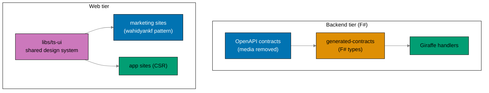

# Product Requirements: Restructure Backends to F# and Split Web Tiers

## Product Overview

Two changes ship together:

1. **Backend tier → F#.** `ose-app-be` is ported Rust→F# behaviorally equivalent on its preserved
   contract (minus media). `organiclever-be` becomes `organiclever-app-be`, a **real** F# backend with
   minimal `journal` CRUD (mirroring the existing PGlite client schema). Crane and the PDF-to-Markdown
   feature disappear from the product.
2. **Web tier → two-tier parity.** OrganicLever's single `organiclever-web` splits into a simple
   marketing site (`organiclever-web`) and a CSR app (`organiclever-app-web`). A shared `libs/ts-ui`
   design system feeds all four product frontends, and the marketing sites (`ose-web`, the new
   `organiclever-web`) collapse to the lightweight `wahidyankf-web` pattern.

Each F# backend mirrors `ose-primer/apps/crud-be-fsharp-giraffe`: Giraffe over a hexagonal `Contexts/`
layout, EF Core 10 on Npgsql, DbUp run-on-boot migrations, and a NATS.Net JetStream durable demo.

The organiclever app stays **local-first (PGlite)** in this plan; the journal CRUD on
`organiclever-app-be` ships **unconsumed but contract-smoke-tested**. The production cutover for the new
domains is **deferred downstream**.



## Personas

This solo-maintainer repo's personas are the hats worn and the agents/services that consume the output.

- **Backend maintainer** — rewrites both backends to F#, builds journal CRUD, removes crane; wants
  idiomatic F#, a preserved ose-app-be contract, and green gates.
- **Frontend maintainer** — splits + renames the organiclever web tier, builds `libs/ts-ui`, simplifies
  the marketing sites; wants consistent structure, a shared design system, no brand drift.
- **Infra operator (ose-infra)** — pulls the two public F# GHCR images early; wants images that build,
  run DbUp migrations on boot, connect to NATS, and serve the contract. Owns the deferred prod cutover.
- **Contract consumer (`ose-app-web` / external)** — calls the preserved ose-app-be non-media
  endpoints; must see no breaking change beyond the removed media path.
- **E2E runners** — Playwright black-box clients that drive a running backend (BE e2e) or a built site
  (FE e2e) over real HTTP, asserting preserved behavior, the JetStream demo, and rendered marketing/app
  surfaces.

## User Stories

- As the **backend maintainer**, I want `ose-app-be` rewritten to F# with all five non-media bounded
  contexts intact so that no functionality is lost and its contract is preserved.
- As the **backend maintainer**, I want `organiclever-be` renamed to `organiclever-app-be` and given
  real `journal` CRUD so that it is a genuine backend, not an empty skeleton.
- As the **backend maintainer**, I want the journal CRUD schema mirrored from the existing PGlite
  client model so that the eventual consumption decision does not force a rewrite.
- As the **backend maintainer**, I want the crane media service and PDF-to-Markdown fully removed so
  that the deploy surface is two backends, not three services.
- As the **infra operator**, I want two **bootable** public GHCR images published **early** so that the
  k3s Phase 0.5 gate unblocks before the rest of the restructure finishes.
- As the **frontend maintainer**, I want `organiclever-web` (the app) renamed to `organiclever-app-web`
  and a new simple `organiclever-web` marketing site so that OrganicLever matches OSE's two-tier shape.
- As the **frontend maintainer**, I want a shared `libs/ts-ui` consumed by all four product frontends
  so that brand and components stay consistent across each product's `www → app` jump.
- As the **frontend maintainer**, I want the marketing sites (`ose-web`, new `organiclever-web`) on the
  simple `wahidyankf-web` `features/` pattern so that marketing stays lightweight while the apps keep
  the heavier CSR/DDD stack.
- As the **spec maintainer**, I want the `specs/` surfaces renamed, the marketing tier added, and
  crane-be/media removed so that the specs match the new project topology.

## Acceptance Criteria (Gherkin)

> Every scenario uses exactly one primary `Given`, one `When`, one `Then`; extras chain with
> `And`/`But`. These scenarios seed the first failing tests for the matching delivery phases.

### Prerequisite gate

```gherkin
Scenario: the toolchain-parity prerequisite is confirmed done before restructure work
  Given the standardize-repo-toolchain-parity plan is expected to be complete
  When Phase 0 checks for the converged F# Nx targets, the doctor .NET SDK check, and F# coverage tooling
  Then all three are present and pass
  And the restructure phases are cleared to begin
```

### F# backends build and boot

```gherkin
Scenario: both backends build as F# services
  Given ose-app-be and organiclever-app-be have been written in F# Giraffe on net10.0
  When nx build ose-app-be organiclever-app-be runs
  Then the .NET release artifacts are produced
  And no Rust toolchain is invoked for either backend
```

```gherkin
Scenario: a backend runs DbUp migrations on boot
  Given a backend starts against an empty database with DATABASE_URL set
  When the backend process boots
  Then DbUp applies all embedded db/migrations/*.sql before serving requests
  And the backend reports healthy after migrations complete
```

### Early bootable images unblock k3s

```gherkin
Scenario: two bootable F# images publish before the feature ports complete
  Given the F# skeletons boot, migrate, connect NATS, and serve /health
  When the publish-images workflow runs at Phase 2
  Then ghcr.io/wahidyankf/ose-app-be and ghcr.io/wahidyankf/organiclever-app-be are publicly pullable
  And no crane-be image job exists
```

### ose-app-be contract preserved minus media

```gherkin
Scenario: the ose-app-be OpenAPI contract still validates after media removal
  Given the media path has been removed from the ose-app-be OpenAPI contract
  When the contract lint and bundle target runs
  Then the contract validates and bundles successfully
  And every previously documented non-media path is still present
```

```gherkin
Scenario: all five ose-app-be bounded contexts are preserved
  Given ose-app-be has been ported to F#
  When the spec-coverage target runs over its behavior specs [Repo-grounded: ose-primer/apps/crud-be-fsharp-giraffe/project.json — future F# backend mirrors primer target name]
  Then health, ai-orchestration, gap-analysis, internal-policy, and regulatory-source steps are all bound
  And no bounded context is missing
```

### organiclever-app-be is a real backend

```gherkin
Scenario: organiclever-app-be serves journal CRUD mirrored from the PGlite client schema
  Given organiclever-app-be has been created in F# with a journal context
  When a contract smoke-probe exercises the journal CRUD endpoints
  Then create, read, update, and delete each return their expected status and shape
  And the journal entity schema matches the existing PGlite client model
```

```gherkin
Scenario: the journal CRUD ships unconsumed in this plan
  Given the web-to-backend consumption decision is deferred
  When organiclever-app-web is inspected
  Then it still uses local-first PGlite for journal data
  And it does not depend on organiclever-app-be for journal persistence
```

### Crane and media fully removed

```gherkin
Scenario: the crane service and its e2e runner no longer exist
  Given the restructure is complete
  When the apps directory is inspected
  Then apps/crane-be does not exist
  And apps/crane-be-e2e does not exist
```

```gherkin
Scenario: no media or crane references remain in apps or specs
  Given the restructure is complete
  When a search for crane, media, pdf-to-md, and crane.convert runs over apps and specs
  Then no crane_client module is found
  And no /media/pdf-to-md route is found
  And no crane.convert subject usage is found
  But crane-cli and fsharp-crane-core are untouched
```

### Renames applied cleanly

```gherkin
Scenario: the organiclever projects are renamed to the *-app-* family
  Given the wide rename has been applied as one atomic change
  When nx show projects runs
  Then organiclever-app-be, organiclever-app-web, and organiclever-app-web-e2e exist
  And the old organiclever-be and the old app-flavored organiclever-web are gone
  And the full affected build passes
```

### New marketing site

```gherkin
Scenario: a new simple organiclever-web marketing site is created from the landing context
  Given the landing context has been extracted from the former organiclever-web
  When nx build organiclever-web runs
  Then the marketing site builds using the src/features layout matching wahidyankf-web
  And it does not depend on PGlite, Effect, or XState
```

### Shared design system

```gherkin
Scenario: libs/ts-ui is consumed by all four product frontends
  Given libs/ts-ui has been created and the frontends have adopted it
  When nx graph is inspected
  Then organiclever-web, organiclever-app-web, ose-web, and ose-app-web each depend on libs/ts-ui
  And libs/ts-ui builds independently
```

### Marketing-site simplification

```gherkin
Scenario: ose-web is simplified structure-only while keeping its content pipeline
  Given ose-web has been reshaped to the wahidyankf-web features layout
  When nx build ose-web and its fe-e2e run
  Then ose-web uses the src/features layout
  And its tRPC content/updates/feed/rss pipeline still renders
```

### JetStream demo on NATS.Net

```gherkin
@e2e
Scenario: a backend publishes and durably consumes its demo subject with ack
  Given a backend has a JetStream durable stream and consumer for its demo subject
  When the backend publishes a demo message to that subject
  Then the durable consumer receives the message
  And the message is acknowledged
  And the messaging status surface reports the demo delivered and acked
```

### Specs restructured

```gherkin
Scenario: the organiclever specs match the new project topology
  Given the restructure is complete
  When specs/apps/organiclever is inspected
  Then the behavior and component surfaces reflect organiclever-app-be and organiclever-app-web
  And a marketing-tier surface for organiclever-web exists
  And no media or crane references remain
```

```gherkin
Scenario: crane-be specs are removed but crane-cli specs are kept
  Given crane-be has been deleted
  When specs/apps/crane is inspected
  Then the crane-be behavior and component surfaces are gone
  And the crane-cli behavior and component surfaces are intact
```

### Dependency preservation

```gherkin
Scenario: the crane-cli and rust-commons dependents are preserved
  Given crane-be has been removed and the backends are F#
  When the dependency graph is inspected
  Then apps/crane-cli still references libs/fsharp-crane-core
  And apps/ayokoding-cli and apps/ose-cli still reference libs/rust-commons
```

### Env drift guard

```gherkin
Scenario: env drift guard passes with renamed/F# vars and without crane vars
  Given the F# backend env vars are annotated and registered for the renamed projects
  And the crane-specific vars have been removed
  When rhino-cli env validate runs
  Then it reports no drift
  And the pre-push and CI env-validate checks pass
```

## Product Scope

### In Scope (Product Features)

- `ose-app-be` rewritten to F#, preserving `/health`, all non-media paths, its messaging status surface
  - JetStream demo, and its five bounded contexts.
- `organiclever-app-be` (renamed) as a real F# backend: `health`, minimal `journal` CRUD (PGlite-schema
  mirror), messaging status + JetStream demo.
- Crane + media fully removed; two bootable images published early; image roster 3 → 2.
- organiclever web split + rename: `organiclever-app-web` (the app) + new simple `organiclever-web`
  (marketing, from `landing`).
- `libs/ts-ui` shared design system adopted by all four product frontends.
- `ose-web` structure-only simplification (keeps tRPC + content pipeline); OSE frontend audit.
- Adapted Playwright e2e (renamed pairs, a new marketing pair, media scenarios dropped).
- F# Dockerfiles; adjusted integration/e2e compose; env-var updates + drift-guard registration.
- `specs/` restructure across organiclever, ose, and crane.

### Out of Scope (Product Features)

- Production cutover (Vercel/DNS/prod branches) — deferred downstream.
- The organiclever sync-vs-server-authoritative decision and any consumption wiring beyond the
  smoke-probe.
- The PDF-to-Markdown feature in any form (removed).
- New endpoints/business features beyond journal CRUD (organiclever) / non-media parity (ose).
- Authoring the converged toolchain (assumed DONE).
- `libs/fsharp-crane-core`, `apps/crane-cli`, `libs/rust-commons` internals; `wahidyankf-web`.

## Product Risks

- **Behavioral parity on the ose-app-be contract**: the F# port must serve every non-media path the
  Rust backend served; mitigated by driving the port from the preserved behavior specs and asserting
  via the adapted e2e runner before the gate.
- **Journal CRUD built blind to consumption**: mitigated by mirroring the PGlite client schema and
  keeping it minimal + contract-smoke-tested.
- **EF Core mapping fidelity**: snake_case columns and types must match; mitigated by reusing migration
  SQL and the primer's `UseSnakeCaseNamingConvention` + `[<Column>]`-annotated entities.
- **ts-ui adoption rework**: mitigated by building `ts-ui` before the frontends consume it.
- **ose-web content pipeline regression**: mitigated by structure-only simplification keeping tRPC +
  content infra and asserting feed/updates render at e2e.
- **NATS.Net JetStream demo flakiness**: depends on a real NATS container at e2e; mitigated by keeping
  `test:e2e` non-cacheable and gating on a `/health` healthcheck wait.
