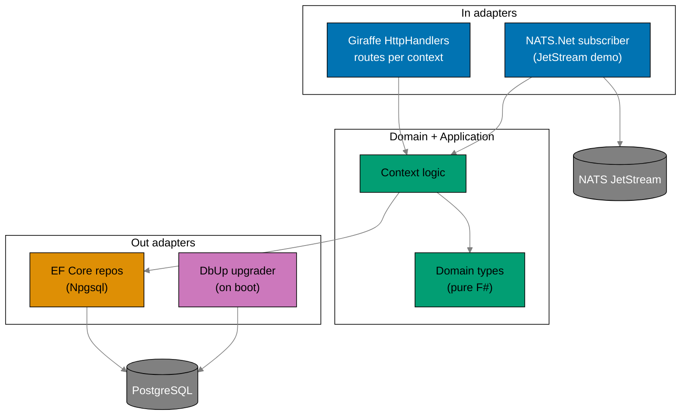
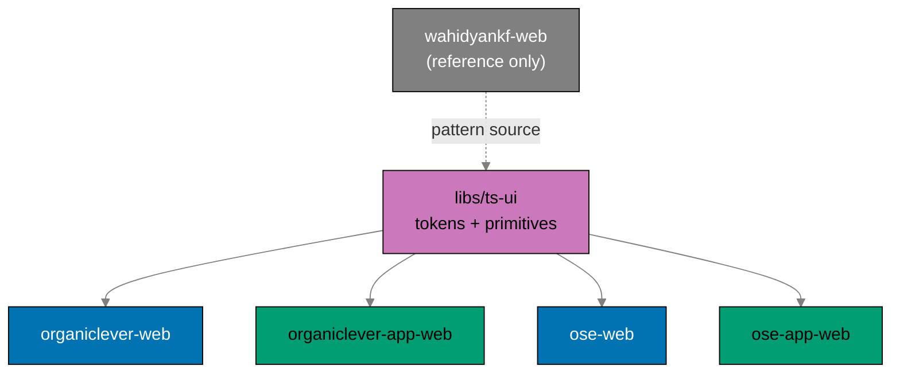

# Technical Documentation: Restructure Backends to F# and Split Web Tiers

## Architecture Overview

This plan has two halves: a **backend tier** moving to F#, and a **web tier** splitting into
marketing/app pairs with a shared design system.

Each backend mirrors `ose-primer/apps/crud-be-fsharp-giraffe/src/DemoBeFsgi`
`[Repo-grounded: primer fsproj + Program.fs]`: a Giraffe web host composing `HttpHandler` routes over a
hexagonal `Contexts/` layout, EF Core 10 repositories on Npgsql, DbUp performing a run-on-boot upgrade
from embedded SQL, and NATS.Net for the JetStream durable demo.



## F# Stack (mirror of ose-primer crud-be-fsharp-giraffe)

The stack and pins below are read from the primer fsproj, `global.json`, and `dotnet-tools.json`
`[Repo-grounded: ose-primer/apps/crud-be-fsharp-giraffe]`. **Phase 0 re-confirms each version** against
the primer at execution time and against the Path-B 60-day soak (cutoff = execution date minus 60
days); values below are the confirmed-as-of-authoring baseline and are `[Unverified]` until Phase 0
re-confirms.

| Concern              | Package / tool                                                          | Version (primer baseline) |
| -------------------- | ----------------------------------------------------------------------- | ------------------------- |
| Runtime / TFM        | .NET SDK / `net10.0`                                                    | SDK `10.0.204`            |
| Web framework        | `Giraffe`                                                               | `8.x` (primer: `7.0.2`)   |
| ORM                  | `Microsoft.EntityFrameworkCore`                                         | `10.0.8`                  |
| PostgreSQL provider  | `Npgsql.EntityFrameworkCore.PostgreSQL`                                 | `10.0.2`                  |
| Naming convention    | `EFCore.NamingConventions` (snake_case)                                 | `10.0.1`                  |
| Migrations (on boot) | `dbup-core` + `dbup-postgresql`                                         | `5.0.87` / `5.0.40`       |
| JSON                 | `FSharp.SystemTextJson`                                                 | `1.4.36`                  |
| Messaging            | `NATS.Net`                                                              | `2.7.3` (crane-be pin)    |
| Lint / analyzers     | `fsharplint` + `FSharp.Analyzers.Build` + `G-Research.FSharp.Analyzers` | `0.5.0` / `0.22.0`        |
| Coverage             | `altcover.global` (+ coverlet path per parity)                          | `9.0.102`                 |
| Pinning              | `global.json` (SDK) + `dotnet-tools.json` (CLI)                         | as above                  |

> **Giraffe version note** `[Judgment call]`: the locked decision states Giraffe 8.x; the primer fsproj
> currently pins `7.0.2` while `apps/crane-be` already pins `Giraffe 8.2.0`
> `[Repo-grounded: crane-be.fsproj]`. Phase 0 resolves the exact 8.x pin (reuse crane-be's `8.2.0` if
> still Path-B-eligible) and applies it to both backends; do not silently inherit the primer's 7.x.

### Frontend stack (web tier)

| Concern         | Tool                                                           | Source                                           |
| --------------- | -------------------------------------------------------------- | ------------------------------------------------ |
| Framework       | Next.js 16 (App Router) · React 19 · Tailwind CSS 4            | `[Repo-grounded: wahidyankf-web, ose-web]`       |
| Marketing shape | `src/app` + `src/features/*` (flat, no DDD)                    | `[Repo-grounded: wahidyankf-web]` pattern source |
| App shape       | `src/contexts/*` DDD + PGlite + Effect + XState                | `[Repo-grounded: organiclever-web]` (the app)    |
| Design system   | `libs/ts-ui` — tokens + primitives (shadcn/Radix/Tailwind/CVA) | per swe-ui conventions                           |

## Rust to F# Mapping

| Concern                  | Rust (current) `[Repo-grounded]`       | F# (target, primer-mirrored)                                                                                  |
| ------------------------ | -------------------------------------- | ------------------------------------------------------------------------------------------------------------- |
| HTTP framework / routing | `axum` 0.8 routers + handlers          | `Giraffe` `HttpHandler` + `choose`/`route`/`subRoute`                                                         |
| Web host                 | `tokio` + `axum::serve`                | `Host.CreateDefaultBuilder().ConfigureWebHostDefaults(...)`                                                   |
| DB queries               | `sqlx` query macros / `query_as`       | EF Core 10 `DbSet` + LINQ in `EfRepositories.fs` (Npgsql)                                                     |
| Entity mapping           | `sqlx::FromRow` structs                | `[<CLIMutable>]` + `[<Table>]`/`[<Column>]` entities in `AppDbContext.fs`                                     |
| Schema migrations        | `sqlx::migrate!` (`migrations/*.sql`)  | DbUp `DeployChanges.To.PostgresqlDatabase(...).WithScriptsEmbeddedInAssembly(...)` over `db/migrations/*.sql` |
| Messaging client         | `async-nats` 0.47                      | `NATS.Net` 2.x (`NatsClient`, JetStream context)                                                              |
| JSON (ser/de)            | `serde` / `serde_json`                 | `FSharp.SystemTextJson` (`JsonFSharpConverter`)                                                               |
| Error handling           | `anyhow::Result` / `thiserror`         | F# `Result<'T,'E>` + typed domain errors; `failwith` only at boot                                             |
| Config / env             | `dotenvy` + `envy` fail-fast           | `Environment.GetEnvironmentVariable` + explicit fail-fast guards                                              |
| Async                    | `tokio` futures + `futures::StreamExt` | .NET `task {}` / `IAsyncEnumerable` for JetStream consumption                                                 |
| Contract types           | `generated-contracts/` (Rust, stubbed) | `generated-contracts/` (F#, `-g fsharp-giraffe-server` models)                                                |
| Lint                     | `clippy -D warnings`                   | `fsharplint` + G-Research analyzers (treat-as-error)                                                          |
| Coverage                 | `cargo llvm-cov` (LCOV, ≥90%)          | `altcover` LCOV (≥90% per parity coverage tooling)                                                            |

> **Removed in the mapping**: `reqwest` (crane HTTP client) and the `crane.convert` request/reply path —
> both belong to the deleted media feature and have **no** F# equivalent.

## Migration SQL Reuse

The current backends carry `migrations/0001_initial.sql` (+ `.gitkeep`)
`[Repo-grounded: apps/*/migrations/]`, applied by `sqlx::migrate!` on boot. The rewrite:

1. Moves each backend's SQL to `apps/<backend>/db/migrations/*.sql` (ordered numeric prefixes, matching
   the primer's `001-…`/`002-…` convention).
2. Marks them `<EmbeddedResource Include="db/migrations/*.sql" />` in the fsproj
   `[Repo-grounded: primer fsproj line 78-80]`.
3. Runs DbUp once at startup before serving, exactly as the primer does
   `[Repo-grounded: primer Program.fs lines 153-166]`:

   ```fsharp
   let result =
       DeployChanges.To
           .PostgresqlDatabase(connStr)
           .WithScriptsEmbeddedInAssembly(Reflection.Assembly.GetExecutingAssembly())
           .LogToConsole()
           .Build()
           .PerformUpgrade()
   if not result.Successful then
       failwith (sprintf "Database migration failed: %s" result.Error.Message)
   ```

For **ose-app-be**, the SQL is reused verbatim where dialect-compatible (it already targets PostgreSQL)
and the Phase 3 gate asserts the DbUp-produced schema matches the sqlx-produced schema. For
**organiclever-app-be**, the `journal` schema is **authored fresh** by mirroring the existing PGlite
client model (`apps/organiclever-web/src/contexts/journal/`) rather than the near-empty current Rust
migration. DbUp tracks applied scripts in its `SchemaVersions` table.

## Per-App Context Layout

Both backends adopt the primer's source layout under `apps/<backend>/src/<AppName>/`
`[Repo-grounded: primer src/DemoBeFsgi]`, with bounded contexts as `Contexts/` slices.

### ose-app-be (F#)

Carries **five** non-media bounded contexts to preserve `[Repo-grounded: apps/ose-app-be/src/contexts/]`:
`health`, `ai-orchestration`, `gap-analysis`, `internal-policy`, `regulatory-source` — plus `messaging`
(status + JetStream demo). The `media/` slice and `messaging/crane_client.rs` are **dropped**.

```
apps/ose-app-be/
  global.json  dotnet-tools.json  fsharplint.json
  Dockerfile  docker-compose.integration.yml  docker-compose.e2e.yml
  .env.example  generated-contracts/  db/migrations/*.sql
  src/OseAppBe/
    OseAppBe.fsproj
    Domain/  Infrastructure/{AppDbContext.fs, Repositories/{RepositoryTypes.fs, EfRepositories.fs}}
    Contexts/{Health,AiOrchestration,GapAnalysis,InternalPolicy,RegulatorySource,Messaging}/
    Handlers/  Program.fs
  tests/{unit,integration}/
```

### organiclever-app-be (F#, renamed from organiclever-be)

```
apps/organiclever-app-be/
  global.json  dotnet-tools.json  fsharplint.json
  Dockerfile  docker-compose.integration.yml  docker-compose.e2e.yml
  .env.example  generated-contracts/  db/migrations/*.sql   # journal schema mirrors PGlite client
  src/OrganicleverAppBe/
    OrganicleverAppBe.fsproj
    Domain/  Infrastructure/{AppDbContext.fs, Repositories/...}
    Contexts/{Health,Journal,Messaging}/{Domain,Application,Infrastructure,Api}
    Handlers/  Program.fs
  tests/{unit,integration}/
```

> **`journal` is minimal**: a single bounded context with CRUD endpoints whose entity schema mirrors the
> PGlite `journal` context. It ships **unconsumed** (organiclever-app-web stays local-first) but is
> exercised by a contract smoke-probe. The fuller routine/settings contexts are deferred with the
> consumption decision.
>
> **Module ordering**: F# compilation is order-sensitive; the fsproj `<Compile Include>` list is
> explicit (generated-contracts first, then Domain → Infrastructure → Contexts → Handlers → Program),
> mirroring the primer `[Repo-grounded: primer fsproj ItemGroup ordering]`.

## Contract Codegen (F#)

The codegen target mirrors the primer `[Repo-grounded: primer project.json codegen]`:

```bash
npx openapi-generator-cli generate \
  -i $(pwd)/specs/apps/<domain>/containers/contracts/generated/openapi-bundled.yaml \
  -g fsharp-giraffe-server \
  -o $(pwd)/apps/<backend>/generated-contracts \
  --model-package <AppName>.Contracts \
  --global-property=models,modelDocs=false,apiDocs=false
```

This **replaces** the current Rust stub codegen target (which only `echo`-s a TODO and diffs
`generated-contracts/` `[Repo-grounded: organiclever-be/project.json codegen]`). `codegen` is a
`dependsOn` of `typecheck`/`build`. For ose-app-be the media path is removed from the spec first; for
organiclever-app-be the journal path is **added** to the spec, then types regenerate.

## Web Tier Split and Rename

### Project topology (after)

| Project (new/renamed)           | Role                           | Pattern                           | Port |
| ------------------------------- | ------------------------------ | --------------------------------- | ---- |
| `organiclever-web` (NEW)        | OrganicLever marketing         | simple `features/` (wahidyankf)   | 3200 |
| `organiclever-app-web` (rename) | OrganicLever app (PGlite, CSR) | DDD `contexts/` + Effect + XState | 3202 |
| `organiclever-app-be` (rename)  | OrganicLever backend (F#)      | Giraffe hexagonal                 | 8202 |
| `ose-web` (simplify)            | OSE marketing/content          | simple `features/` + tRPC/content | 3100 |
| `ose-app-web` (adopt ts-ui)     | OSE app                        | existing                          | 3300 |
| `ose-app-be` (port)             | OSE backend (F#)               | Giraffe hexagonal                 | —    |
| `wahidyankf-web` (reference)    | personal portfolio (untouched) | simple `features/`                | 3201 |

E2E pairs: `organiclever-web-e2e` (NEW, marketing), `organiclever-app-web-e2e` (renamed from
`organiclever-web-e2e`), `organiclever-app-be-e2e` (renamed from `organiclever-be-e2e`),
`ose-app-be-e2e` (kept), the existing `ose-web` FE e2e (kept).

### The rename is atomic

The `*-app-*` rename touches Nx project names, every `project.json`, tags, `implicitDependencies`,
import paths, `tsconfig` path aliases, e2e `webServer` configs, `publish-images.yml`, Dockerfiles,
`env-contract.yaml`, `.env.example`, dev ports, docs, and specs. It is applied and pushed as **one
atomic commit** (decision #19) so `main` is never left with a half-renamed graph. A post-rename gate
runs `nx show projects` + `nx run-many -t build` before any further work.

### Marketing extraction (organiclever-web)

The new marketing `organiclever-web` is **greenfield-simple**: a fresh `src/app` + `src/features/`
(`home`, `app-shell`) Next.js project in the `wahidyankf-web` shape, carrying over the **content and
assets** from `apps/organiclever-web/src/contexts/landing/` but **not** its DDD/Effect/XState shape. The
`landing` context is then removed from the app (`organiclever-app-web`).

### ose-web simplification (structure-only)

`ose-web` today uses `src/contexts/{landing,content,rss-feed,search,seo,app-shell,health}` + tRPC
(`src/lib/trpc`, `src/app/api`) + an fs content repository `[Repo-grounded: ose-web/src]`. The
simplification is **structure-only** (decision #13): reshape `contexts/` → `features/` to match
`wahidyankf-web`'s layout, **keeping** tRPC and the content/updates/feed/rss pipeline intact. No content
behavior changes; the FE e2e asserts updates/feed still render.

## libs/ts-ui (Shared Design System)

`libs/ts-ui` is a new TypeScript lib `[naming: ts-<name>]` imported as
`@open-sharia-enterprise/ts-ui`. It holds **design tokens** (color, spacing, typography — WCAG AA,
color-blind-friendly per repo accessibility principles) and **primitive components** built on
shadcn/Radix + Tailwind + CVA per the swe-ui conventions. It is built **first** (decision #17, Phase 5)
so every frontend consumes it natively rather than being retrofitted.

Adoption order: the new `organiclever-web` and `organiclever-app-web` (Phase 6) consume it as they are
built/renamed; `ose-web` and `ose-app-web` adopt it during their simplification/audit (Phase 7).
`wahidyankf-web` is the **structural reference** for the lib's primitives but is **not** forced to adopt
it (separate personal brand).



## Specs Restructure

The `specs/apps/` tree must track every rename, the new marketing tier, the dropped crane-be, and the
removed media surfaces. Current structure `[Repo-grounded: find specs/apps]`:

- `specs/apps/organiclever/{behavior/{organiclever-be,organiclever-web}, components/{be,web}, containers/contracts, ddd/ubiquitous-language, product, system-context}`
- `specs/apps/ose/{behavior/{app-be,app-web,platform-be,platform-web,ose-cli}, components/{app-be,platform-be,platform-web}, containers/contracts, ddd, product, system-context}`
- `specs/apps/crane/{behavior/{crane-be,crane-cli}, components/{be,cli}, containers, product, system-context, README.md}`

### organiclever specs (rename + add marketing tier)

| Current                                         | Target                                                 |
| ----------------------------------------------- | ------------------------------------------------------ |
| `behavior/organiclever-be/`                     | `behavior/organiclever-app-be/`                        |
| `behavior/organiclever-web/`                    | `behavior/organiclever-app-web/`                       |
| —                                               | `behavior/organiclever-web/` (NEW — marketing surface) |
| `components/be/`                                | `components/app-be/`                                   |
| `components/web/`                               | `components/app-web/`                                  |
| —                                               | `components/web/` (NEW — marketing)                    |
| `ddd/ubiquitous-language/be-media.md`           | **deleted** (media gone)                               |
| `ddd/bounded-contexts.yaml` (`be-media`, crane) | remove `be-media` context + crane refs; add `journal`  |

> **Naming note** `[Judgment call]`: organiclever specs use full project names (`organiclever-app-be`),
> consistent with their current style, while OSE specs use short tier names (`app-be`). This plan keeps
> each domain's existing convention rather than unifying cross-product spec naming (out of scope); the
> OSE frontend audit (Phase 7) records the inconsistency but does not force a rename.

Add `journal` behavior Gherkin under `behavior/organiclever-app-be/gherkin/journal/` (CRUD scenarios,
seeding the Phase 4 first failing tests).

### ose specs (remove media; keep tiers)

OSE specs are already two-tier `[Repo-grounded]`. Changes:

- Delete `behavior/app-be/gherkin/messaging/crane-convert.feature`.
- Remove `crane.convert` / `media-convert endpoint` from `ddd/ubiquitous-language/messaging.md`.
- Remove or repurpose `ddd/ubiquitous-language/media.md` (`POST /api/v1/media/convert`).
- Remove the `crane-be via crane.convert` entry from `ddd/bounded-contexts.yaml`.
- `platform-web` (= ose-web) behavior unchanged in content; the simplification is structure-only.

### crane specs (drop crane-be, keep crane-cli)

- Delete `specs/apps/crane/behavior/crane-be/` and `specs/apps/crane/components/be/`.
- **Keep** `specs/apps/crane/behavior/crane-cli/` and `specs/apps/crane/components/cli/`.
- Update `specs/apps/crane/README.md`, `containers/`, `product/`, `system-context/` to drop the crane-be
  service and retain only the crane-cli scope.

### Spec-coverage binding

`spec-coverage` (post-parity: `specs:coverage`) for each backend points at its renamed behavior dir;
`messaging` stays `--exclude-dir` (e2e-only) as today
`[Repo-grounded: organiclever-be project.json spec-coverage --exclude-dir messaging]`. The Phase 8 gate
asserts every non-messaging step (incl. journal CRUD for organiclever-app-be) is bound.

## Removing Crane and Media (single sweep, Phase 2)

- **Delete** `apps/crane-be/` and `apps/crane-be-e2e/`.
- **Remove** from both backends: any `contexts/media/` (F# equivalent never ported),
  `messaging/crane_client.rs` (never written in F#), the `/media/pdf-to-md` route, the
  `*_CRANE_URL` env vars, and any `crane.convert` subject usage.
- **Remove** media from `specs/apps/organiclever/`, `specs/apps/ose/`; drop crane-be from
  `specs/apps/crane/` (see Specs Restructure).
- **Keep** `libs/fsharp-crane-core/` (depended on by `apps/crane-cli`) and `libs/rust-commons/`
  (depended on by `apps/ayokoding-cli`, `apps/ose-cli`).
- **Gate**: `grep -rE 'crane[_.]|/media/pdf-to-md|crane\.convert'` over `apps/` and `specs/` returns
  zero hits (excluding `crane-cli` and `fsharp-crane-core`).

## Image and Publish Changes

`.github/workflows/publish-images.yml` currently builds **three** images via a `detect` job plus three
`publish-*` jobs `[Repo-grounded: publish-images.yml]`. The rewrite:

- Drops the `build-crane-be` output and the `publish-crane-be` job (3 → 2).
- Renames the organiclever backend job/output to `organiclever-app-be`
  (`ghcr.io/wahidyankf/organiclever-app-be`); keeps `ose-app-be`.
- Keeps `detect` affected-aware (`nx show projects --affected`) for the two backends.
- Replaces each backend's Rust multi-stage Dockerfile with a **.NET multi-stage** Dockerfile:
  `mcr.microsoft.com/dotnet/sdk:10.0` builder running `dotnet publish -c Release`, then
  `mcr.microsoft.com/dotnet/aspnet:10.0` runtime.
- **Early publish (Phase 2)**: bootable images (boot + DbUp + NATS + `/health`) publish before the
  feature ports, unblocking the k3s Phase 0.5 gate.
- `organiclever-app-be` is a **new GHCR package name**; Phase 2 verifies anonymous `docker pull` and a
  one-time `[HUMAN]` visibility flip may be required (no `gh`/REST API for it).

## Nx Project Configuration

Each backend `project.json` is retargeted from Rust to the parity F# target set, mirroring the primer +
crane-be `[Repo-grounded: primer project.json, crane-be project.json]`:

- `codegen` → `openapi-generator-cli -g fsharp-giraffe-server` (replaces the Rust stub).
- `build` → `dotnet publish src/<AppName>/<AppName>.fsproj -c Release -o dist` (`dependsOn: codegen`).
- `dev`/`start` → `dotnet watch run` / `dotnet run`.
- `typecheck` → `dotnet build … /p:TreatWarningsAsErrors=true` (`dependsOn: codegen`).
- `lint` → fantomas `--check` + `fsharplint` + `fsharp-analyzers` (treat-as-error).
- `test:unit` (cacheable) / `test:integration` (compose PostgreSQL, `cache: false`) / `test:quick`
  (altcover instrument + run + `rhino-cli test-coverage validate … 90`).
- `spec-coverage` → renamed behavior dir; `messaging` excluded.
- Tags `lang:rust`/`platform:axum` → `lang:fsharp`/`platform:giraffe`; `implicitDependencies` keep
  `<domain>-contracts` + `rhino-cli`.

The new `libs/ts-ui` gets a standard TS lib `project.json` (build/typecheck/lint/test:unit). The four
frontends gain an `implicitDependency`/import edge on `ts-ui`.

> Canonical target names follow the converged set from `standardize-repo-toolchain-parity` (assumed
> DONE); this plan uses the **post-parity** names and Phase 0 greps the converged conventions rather
> than hardcoding pre-parity names.

## Environment Variables

The F# backends keep the per-app `SCREAMING_SNAKE` + app-prefix rule and `.env.example` annotation
format `[Repo-grounded: apps/*/.env.example]`, registered in `env-contract.yaml`. The organiclever
backend prefix changes `ORGANICLEVER_BE_*` → `ORGANICLEVER_APP_BE_*`.

| App / surface        | Var                                | Req/Opt  | Change                                            |
| -------------------- | ---------------------------------- | -------- | ------------------------------------------------- |
| organiclever-app-be  | `DATABASE_URL`                     | REQUIRED | kept (EF/DbUp)                                    |
| organiclever-app-be  | `ORGANICLEVER_APP_BE_PORT`         | OPTIONAL | renamed from `ORGANICLEVER_BE_PORT`               |
| organiclever-app-be  | `ORGANICLEVER_APP_BE_CORS_ORIGINS` | OPTIONAL | renamed                                           |
| organiclever-app-be  | `ORGANICLEVER_APP_BE_NATS_URL`     | REQUIRED | renamed (JetStream demo)                          |
| organiclever-app-be  | `ORGANICLEVER_BE_CRANE_URL`        | —        | **removed** (media gone)                          |
| organiclever-app-web | `ORGANICLEVER_APP_BE_URL`          | OPTIONAL | renamed from `ORGANICLEVER_BE_URL` (status probe) |
| ose-app-be           | `DATABASE_URL`                     | REQUIRED | kept                                              |
| ose-app-be           | `OSE_APP_BE_PORT`                  | OPTIONAL | kept                                              |
| ose-app-be           | `OSE_APP_BE_CORS_ORIGINS`          | OPTIONAL | kept                                              |
| ose-app-be           | `OSE_APP_BE_OPENROUTER_*`          | OPTIONAL | kept (placeholder-only key)                       |
| ose-app-be           | `OSE_APP_BE_NATS_URL`              | REQUIRED | kept (JetStream demo)                             |
| ose-app-be           | `OSE_APP_BE_CRANE_URL`             | —        | **removed** (media gone)                          |

> **`lang: fsharp` in env-contract**: Phase 0 greps `env-contract.yaml` to confirm `fsharp` is accepted
> (resolved by the parity plan) before retagging surfaces. Treat as `[Unverified]` until that grep
> resolves.
>
> **Agent guardrail** `[Repo-grounded: secrets-and-env-standards]`: agents never read, write, edit, or
> commit real `.env*` files — only `.env.example`. All automated test env comes from committed,
> non-secret `docker-compose` files (integration = PostgreSQL only; e2e = PostgreSQL + NATS).

## Testing and Coverage

The Three-Level Testing Standard applies unchanged; the harness moves Rust → F# (backends) and the
frontends keep Vitest + Playwright.

| Level              | Backend harness (F#)                 | What is real                   | Cacheable |
| ------------------ | ------------------------------------ | ------------------------------ | --------- |
| `test:unit`        | xUnit + TickSpec, mocked repos/ports | Nothing (mocks)                | yes       |
| `test:integration` | xUnit, real PostgreSQL via compose   | PostgreSQL (EF Core + DbUp)    | no        |
| `test:e2e`         | Playwright (paired `*-be-e2e`)       | Real HTTP + real NATS, running | no        |

- **No network in integration**: NATS is exercised only at e2e; integration is PostgreSQL-only.
- **Coverage** measured at `test:unit` via altcover LCOV, validated by `rhino-cli test-coverage
validate … 90` (≥90% backend floor); frontends keep their existing thresholds.
- **Gherkin-everywhere**: behavior specs (minus media, plus journal) are the single contract;
  `spec-coverage` enforces every step is bound. `messaging` stays `--exclude-dir`.
- **E2E adaptation**: renamed/new pairs; media + crane NATS steps deleted; JetStream-demo-over-HTTP and
  preserved-path scenarios remain; the new `organiclever-web-e2e` asserts the marketing site renders.

## Deviations / Parity

- **Parity with primer**: Giraffe + EF Core 10 + DbUp + NATS.Net + FSharp.SystemTextJson + analyzer set
  - pinning — all mirror `crud-be-fsharp-giraffe`.
- **Deviation (intentional)**: the primer falls back to SQLite via `EnsureCreated` when `DATABASE_URL`
  is unset `[Repo-grounded: primer Program.fs lines 166-170]`. The production backends require
  PostgreSQL; Phase 1 decides whether to keep the SQLite dev fallback or fail-fast on missing
  `DATABASE_URL` — recorded as a Phase 1 decision, not silently inherited.
- **Deviation**: `organiclever-app-be` is greenfield journal CRUD, not a behavioral port — its first
  tests come from the new journal Gherkin, not preserved Rust behavior.
- **Boundary**: production deployment, k3s manifests, ClusterIP wiring, and the organiclever www/app
  prod cutover (Vercel/DNS) are owned downstream; this plan stops at building deployable images +
  CI-green renamed/split projects.

## Dependency Clearance

Per the
[Dependency Bump Stability & Safety Policy](../../../repo-governance/development/workflow/dependency-bump-policy.md),
all pins follow **Path B** (60-day soak + CVE-clean), no waivers, exact pins only. The F# stack pins are
inherited from the primer + `apps/crane-be`. **Phase 0 re-confirms** each version's release date is ≥ 60
days before the execution-date cutoff and CVE-clean (NVD, GitHub Advisories, Snyk, vendor, CISA KEV).
New frontend deps (shadcn/Radix/CVA for `ts-ui`) clear the same Path B. Any version inside the soak at
execution time is rejected and the exact eligible pin written back here.

## Rollback

Each phase is an independent, revertible commit set. Safe rollback units:

- Phase 2 revert restores crane + media.
- Phase 3 revert restores Rust `ose-app-be`.
- Phase 4 revert restores Rust `organiclever-be` (pre-rename). **Note**: the atomic rename lands in
  Phase 4/6 as a single commit — reverting it restores the old project names wholesale.
- Phases 5–7 (ts-ui + web split + ose-web simplify) revert per-workstream commit.

`main` stays green after every phase gate (incremental push). The git history retains the Rust sources
and the pre-split organiclever-web for reference.
