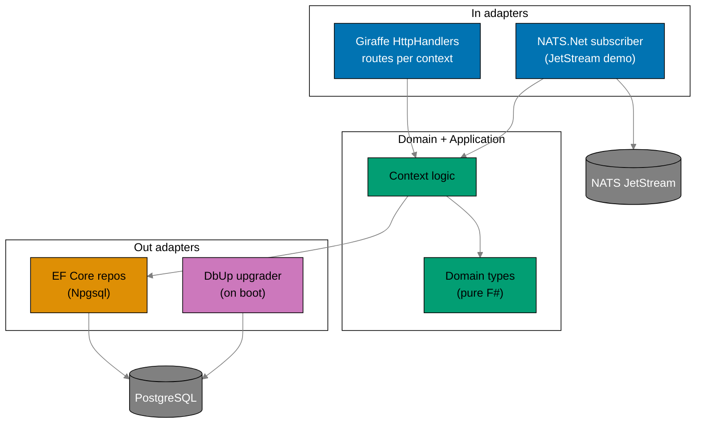
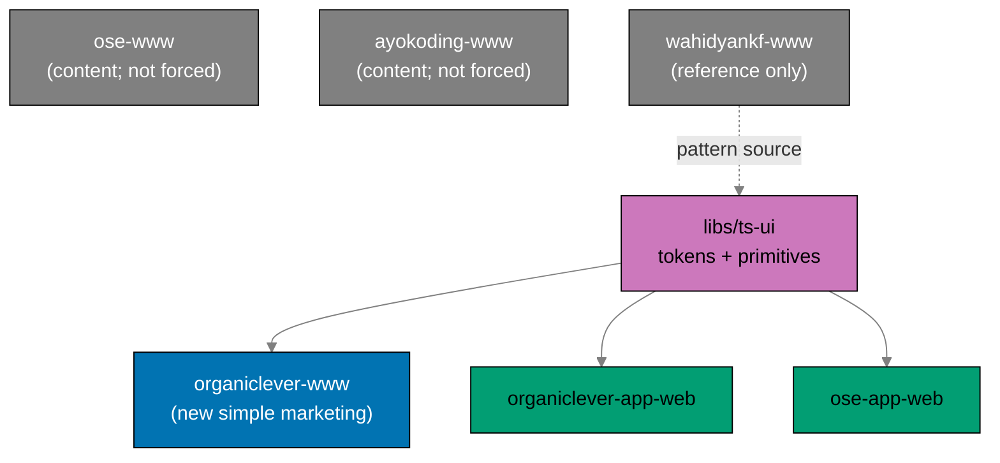

# Technical Documentation: Restructure Backends to F# and Split Web Tiers

## Architecture Overview

This plan has two halves: a **backend tier** moving to F#, and a **web tier** splitting into
marketing/app pairs with a shared design system.

Each backend mirrors `ose-primer/apps/crud-be-fsharp-giraffe/src/DemoBeFsgi`
`[Repo-grounded: primer fsproj + Program.fs]`: a Giraffe web host composing `HttpHandler` routes over a
hexagonal `Contexts/` layout, EF Core 10 repositories on Npgsql, DbUp performing a run-on-boot upgrade
from embedded SQL, and NATS.Net for the JetStream durable demo.



## F# Stack (mirror of ose-primer crud-be-fsharp-giraffe)

The stack and pins below are read from the primer fsproj, `global.json`, and `dotnet-tools.json`
`[Repo-grounded: ose-primer/apps/crud-be-fsharp-giraffe]`. **Phase 0 re-confirms each version** against
the primer at execution time and against the Path-B 60-day soak (cutoff = execution date minus 60
days); values below are the confirmed-as-of-authoring baseline and are `[Unverified]` until Phase 0
re-confirms.

| Concern              | Package / tool                                                          | Version (primer baseline) |
| -------------------- | ----------------------------------------------------------------------- | ------------------------- |
| Runtime / TFM        | .NET SDK / `net10.0`                                                    | SDK `10.0.204`            |
| Web framework        | `Giraffe`                                                               | `8.x` (primer: `7.0.2`)   |
| ORM                  | `Microsoft.EntityFrameworkCore`                                         | `10.0.8`                  |
| PostgreSQL provider  | `Npgsql.EntityFrameworkCore.PostgreSQL`                                 | `10.0.2`                  |
| Naming convention    | `EFCore.NamingConventions` (snake_case)                                 | `10.0.1`                  |
| Migrations (on boot) | `dbup-core` + `dbup-postgresql`                                         | `5.0.87` / `5.0.40`       |
| JSON                 | `FSharp.SystemTextJson`                                                 | `1.4.36`                  |
| Messaging            | `NATS.Net`                                                              | `2.7.3` (crane-be pin)    |
| Lint / analyzers     | `fsharplint` + `FSharp.Analyzers.Build` + `G-Research.FSharp.Analyzers` | `0.5.0` / `0.22.0`        |
| Coverage             | `altcover.global` (+ coverlet path per parity)                          | `9.0.102`                 |
| Pinning              | `global.json` (SDK) + `dotnet-tools.json` (CLI)                         | as above                  |

> **Giraffe version note** `[Judgment call]`: the locked decision states Giraffe 8.x; the primer fsproj
> currently pins `7.0.2` while `apps/crane-be` already pins `Giraffe 8.2.0`
> `[Repo-grounded: crane-be.fsproj]`. **Phase 0 resolution (2026-06-14): pin `Giraffe 8.2.0`** (reuse
> crane-be's pin; Path-B-eligible, released 2025-11-12, CVE-clean) and apply it to both backends; do not
> inherit the primer's 7.x.

### Dependency Clearance (Path B — confirmed Phase 0, 2026-06-14)

Soak cutoff = **2026-04-15** (exec date 2026-06-14 minus 60 days). Each pin below is the most recent
stable released on/before the cutoff, CVE-clean across NVD, GitHub Advisories, Snyk, vendor pages, and
the CISA KEV feed (zero KEV entries for any package). These **confirmed** pins supersede the
primer-baseline column above where they differ.

| Package                                 | Confirmed pin | Release date | CVE-clean | Notes                              |
| --------------------------------------- | ------------- | ------------ | --------- | ---------------------------------- |
| `Giraffe`                               | `8.2.0`       | 2025-11-12   | Y         | reuse crane-be pin                 |
| `Microsoft.EntityFrameworkCore`         | `10.0.6`      | 2026-04-14   | Y         | see runtime CVE note below         |
| `Npgsql.EntityFrameworkCore.PostgreSQL` | `10.0.1`      | 2026-03-12   | Y         | 10.0.2 inside soak                 |
| `Npgsql`                                | `10.0.2`      | 2026-03-12   | Y         | CVE-2024-32655 N/A to 10.x         |
| `EFCore.NamingConventions`              | `10.0.1`      | 2026-01-22   | Y         | snake_case                         |
| `dbup-core`                             | `6.1.1`       | 2026-02-23   | Y         |                                    |
| `dbup-postgresql`                       | `7.0.1`       | 2026-02-23   | Y         |                                    |
| `FSharp.SystemTextJson`                 | `1.4.36`      | 2025-06-13   | Y         | STJ runtime CVEs patched in net10  |
| `NATS.Net`                              | `2.7.3`       | 2026-03-13   | Y         | 2.8.x inside soak; server CVEs N/A |
| `G-Research.FSharp.Analyzers`           | `0.22.0`      | 2026-03-02   | Y         |                                    |
| `altcover`                              | `9.0.102`     | 2025-11-12   | Y         |                                    |
| `class-variance-authority`              | `0.7.1`       | 2024-11-26   | Y         | ts-ui                              |
| `@radix-ui/react-slot`                  | `1.2.4`       | ~2025-11     | Y         | ts-ui; 1.2.5 inside soak           |
| `tailwindcss`                           | `4.2.2`       | 2026-03-18   | Y         | ts-ui; 4.2.3 inside soak           |
| `shadcn` (CLI)                          | last ≤cutoff  | pre-04-15    | Y         | rolling release; pin at scaffold   |

> **EF Core 10.0.6 runtime advisory** `[Path-C candidate]`: CVE-2026-40372 (ASP.NET Core Data
> Protection cookie forgery) is patched in the .NET **10.0.7** runtime (2026-04-21, inside soak). The
> `Microsoft.EntityFrameworkCore` ORM package itself is unaffected. Only relevant if a backend uses
> ASP.NET Core Data Protection cookie auth — neither `ose-be` nor `organiclever-be` does (NATS + EF +
> OpenRouter, no cookie auth), so no waiver is required. If cookie auth is later added, escalate to a
> Path-C waiver per the Dependency Bump Policy.
>
> **shadcn pin** `[resolve at Phase 5 scaffold]`: shadcn uses a rolling-release model with no
> machine-readable per-version date calendar. At ts-ui scaffold time, pin the highest version published
> on/before 2026-04-15 via `npm view shadcn time --json` and record it here.

### Frontend stack (web tier)

| Concern             | Tool                                                           | Source                                                               |
| ------------------- | -------------------------------------------------------------- | -------------------------------------------------------------------- |
| Framework           | Next.js 16 (App Router) · React 19 · Tailwind CSS 4            | `[Repo-grounded: wahidyankf-web, ose-web]`                           |
| New-marketing shape | `src/app` + `src/features/*` (flat, no DDD)                    | `[Repo-grounded: wahidyankf-web]` pattern source                     |
| App shape           | `src/contexts/*` DDD + PGlite + Effect + XState                | `[Repo-grounded: organiclever-web]` (the app)                        |
| Content-site shape  | existing tRPC + content/feed internals (NOT reshaped)          | `[Repo-grounded: ose-web, ayokoding-web]` (kept as-is on rename)     |
| Design system       | `libs/ts-ui` — tokens + primitives (shadcn/Radix/Tailwind/CVA) | per swe-ui conventions; consumed by app clients + `organiclever-www` |

## Rust to F# Mapping

| Concern                  | Rust (current) `[Repo-grounded]`       | F# (target, primer-mirrored)                                                                                  |
| ------------------------ | -------------------------------------- | ------------------------------------------------------------------------------------------------------------- |
| HTTP framework / routing | `axum` 0.8 routers + handlers          | `Giraffe` `HttpHandler` + `choose`/`route`/`subRoute`                                                         |
| Web host                 | `tokio` + `axum::serve`                | `Host.CreateDefaultBuilder().ConfigureWebHostDefaults(...)`                                                   |
| DB queries               | `sqlx` query macros / `query_as`       | EF Core 10 `DbSet` + LINQ in `EfRepositories.fs` (Npgsql)                                                     |
| Entity mapping           | `sqlx::FromRow` structs                | `[<CLIMutable>]` + `[<Table>]`/`[<Column>]` entities in `AppDbContext.fs`                                     |
| Schema migrations        | `sqlx::migrate!` (`migrations/*.sql`)  | DbUp `DeployChanges.To.PostgresqlDatabase(...).WithScriptsEmbeddedInAssembly(...)` over `db/migrations/*.sql` |
| Messaging client         | `async-nats` 0.47                      | `NATS.Net` 2.x (`NatsClient`, JetStream context)                                                              |
| JSON (ser/de)            | `serde` / `serde_json`                 | `FSharp.SystemTextJson` (`JsonFSharpConverter`)                                                               |
| Error handling           | `anyhow::Result` / `thiserror`         | F# `Result<'T,'E>` + typed domain errors; `failwith` only at boot                                             |
| Config / env             | `dotenvy` + `envy` fail-fast           | `Environment.GetEnvironmentVariable` + explicit fail-fast guards                                              |
| Async                    | `tokio` futures + `futures::StreamExt` | .NET `task {}` / `IAsyncEnumerable` for JetStream consumption                                                 |
| Contract types           | `generated-contracts/` (Rust, stubbed) | `generated-contracts/` (F#, `-g fsharp-giraffe-server` models)                                                |
| Lint                     | `clippy -D warnings`                   | `fsharplint` + G-Research analyzers (treat-as-error)                                                          |
| Coverage                 | `cargo llvm-cov` (LCOV, ≥90%)          | `altcover` LCOV (≥90% per parity coverage tooling)                                                            |

> **Removed in the mapping**: `reqwest` (crane HTTP client) and the `crane.convert` request/reply path —
> both belong to the deleted media feature and have **no** F# equivalent.

## Migration SQL Reuse

The current backends carry `migrations/0001_initial.sql` (+ `.gitkeep`)
`[Repo-grounded: apps/*/migrations/]`, applied by `sqlx::migrate!` on boot. The rewrite:

1. Moves each backend's SQL to `apps/<backend>/db/migrations/*.sql` (ordered numeric prefixes, matching
   the primer's `001-…`/`002-…` convention).
2. Marks them `<EmbeddedResource Include="db/migrations/*.sql" />` in the fsproj
   `[Repo-grounded: primer fsproj line 78-80]`.
3. Runs DbUp once at startup before serving, exactly as the primer does
   `[Repo-grounded: primer Program.fs lines 156-165 (let result = DeployChanges.To … failwith)]`:

   ```fsharp
   let result =
       DeployChanges.To
           .PostgresqlDatabase(connStr)
           .WithScriptsEmbeddedInAssembly(Reflection.Assembly.GetExecutingAssembly())
           .LogToConsole()
           .Build()
           .PerformUpgrade()
   if not result.Successful then
       failwith (sprintf "Database migration failed: %s" result.Error.Message)
   ```

For **ose-be** (renamed from `ose-app-be`), the SQL is reused verbatim where dialect-compatible (it
already targets PostgreSQL) and the Phase 3 gate asserts the DbUp-produced schema matches the
sqlx-produced schema. For **organiclever-be** (in-place F# rewrite — name kept), the `journal` schema
is **authored fresh** by mirroring the existing PGlite client model
(`apps/organiclever-web/src/contexts/journal/` `[Repo-grounded]`) rather than the near-empty current
Rust migration. DbUp tracks applied scripts in its `SchemaVersions` table.

## Per-App Context Layout

Both backends adopt the primer's source layout under `apps/<backend>/src/<AppName>/`
`[Repo-grounded: primer src/DemoBeFsgi]`, with bounded contexts as `Contexts/` slices.

### ose-be (F#, renamed from ose-app-be)

Carries **six** non-media bounded contexts to preserve
`[Repo-grounded: apps/ose-app-be/src/contexts/]`: `health`, `ai-orchestration`, `gap-analysis`,
`internal-policy`, `regulatory-source`, `db` — plus `messaging` (status + JetStream demo). The
`media/` slice and `messaging/crane_client.rs` are **dropped**.

> **`db` context (decision #24)**: The Rust `db/` context handles migration orchestration. In the
> F# port this responsibility is absorbed by **DbUp embedded migrations** (`db/migrations/*.sql`
> as `<EmbeddedResource>`). The Rust `db/` context module is therefore **not ported as a
> bounded context**; instead its behavior spec
> (`specs/apps/ose/behavior/app-be/gherkin/db/migrations.feature`) is preserved and re-bound
> under the DbUp infrastructure. The Phase 3 gate assertion "all contexts bound" includes the
> `db/migrations.feature` step binding.
>
> **OpenRouter LLM integration is core and preserved**: `ose-be` is an AI/LLM backend — its
> `gap-analysis` (and `ai-orchestration`) contexts call **OpenRouter** for LLM completions. The F#
> port MUST carry the OpenRouter integration forward (it is **core, not media**). The
> `ai-orchestration`/`gap-analysis` contexts retain an OpenRouter HTTP client adapter under
> `Infrastructure/`, driven by the `OSE_BE_OPENROUTER_*` env vars (see Environment Variables).
> `OSE_BE_OPENROUTER_API_KEY` is a **secret**: env-only, placeholder in `.env.example`, never
> committed (hard iron rule).

```
apps/ose-be/
  global.json  dotnet-tools.json  fsharplint.json
  Dockerfile  docker-compose.integration.yml  docker-compose.e2e.yml
  .env.example  generated-contracts/  db/migrations/*.sql
  src/OseBe/
    OseBe.fsproj
    Domain/  Infrastructure/{AppDbContext.fs, OpenRouterClient.fs, Repositories/{RepositoryTypes.fs, EfRepositories.fs}}
    Contexts/{Health,AiOrchestration,GapAnalysis,InternalPolicy,RegulatorySource,Messaging}/
    Handlers/  Program.fs
  tests/{unit,integration}/
```

### organiclever-be (F#, in-place rewrite — name kept)

> The name `organiclever-be` is already the generic `<product>-be` name and is **current**, so this
> is an **in-place Rust → F# rewrite** with **no `git mv`** for the backend directory.

```
apps/organiclever-be/
  global.json  dotnet-tools.json  fsharplint.json
  Dockerfile  docker-compose.integration.yml  docker-compose.e2e.yml
  .env.example  generated-contracts/  db/migrations/*.sql   # journal schema mirrors PGlite client
  src/OrganicleverBe/
    OrganicleverBe.fsproj
    Domain/  Infrastructure/{AppDbContext.fs, Repositories/...}
    Contexts/{Health,Journal,Messaging}/{Domain,Application,Infrastructure,Api}
    Handlers/  Program.fs
  tests/{unit,integration}/
```

> **`journal` is minimal**: a single bounded context with CRUD endpoints whose entity schema mirrors the
> PGlite `journal` context. It ships **unconsumed** (`organiclever-app-web` stays local-first) but is
> exercised by a contract smoke-probe. The fuller routine/settings contexts are deferred with the
> consumption decision.
>
> **Module ordering**: F# compilation is order-sensitive; the fsproj `<Compile Include>` list is
> explicit (generated-contracts first, then Domain → Infrastructure → Contexts → Handlers → Program),
> mirroring the primer `[Repo-grounded: primer fsproj ItemGroup ordering]`.

## Contract Codegen (F#)

The codegen target mirrors the primer `[Repo-grounded: primer project.json codegen]`:

```bash
npx openapi-generator-cli generate \
  -i $(pwd)/specs/apps/<domain>/containers/contracts/generated/openapi-bundled.yaml \
  -g fsharp-giraffe-server \
  -o $(pwd)/apps/<backend>/generated-contracts \
  --model-package <AppName>.Contracts \
  --global-property=models,modelDocs=false,apiDocs=false
```

This **replaces** the current Rust stub codegen target (which only `echo`-s a TODO and diffs
`generated-contracts/` `[Repo-grounded: organiclever-be/project.json codegen]`). `codegen` is a
`dependsOn` of `typecheck`/`build`. For `ose-be` (renamed from `ose-app-be`) the media path is removed
from the spec first; for `organiclever-be` the journal path is **added** to the spec, then types
regenerate. The `ose-app-web` `codegen` source pointer is updated to read the `ose-be` bundled
OpenAPI spec.

## Web Tier Split and Rename

### Project topology (after)

| Project (new/renamed)           | Role                           | Pattern                           | Port    |
| ------------------------------- | ------------------------------ | --------------------------------- | ------- |
| `organiclever-www` (NEW)        | OrganicLever marketing         | simple `features/` (wahidyankf)   | 3200    |
| `organiclever-app-web` (rename) | OrganicLever app (PGlite, CSR) | DDD `contexts/` + Effect + XState | 3202    |
| `organiclever-be` (in-place)    | OrganicLever backend (F#)      | Giraffe hexagonal (name kept)     | 8202    |
| `ose-www` (rename + simplify)   | OSE content/marketing          | simple `features/` + tRPC/content | 3100    |
| `ose-app-web` (adopt ts-ui)     | OSE app                        | existing                          | 3300    |
| `ose-be` (rename + port)        | OSE backend (F#, + OpenRouter) | Giraffe hexagonal                 | —       |
| `wahidyankf-www` (rename + ref) | personal portfolio (renamed)   | simple `features/`                | 3201    |
| `ayokoding-www` (rename)        | bilingual content/education    | existing structure + tRPC (kept)  | current |

E2E pairs: `organiclever-www-e2e` (NEW, marketing), `organiclever-app-web-e2e` (renamed from
`organiclever-web-e2e`), `organiclever-be-e2e` (kept — backend name unchanged), `ose-be-e2e` (renamed
from `ose-app-be-e2e`), `ose-www-be-e2e` / `ose-www-fe-e2e` (renamed from `ose-web-be-e2e` /
`ose-web-fe-e2e`), `wahidyankf-www-fe-e2e` (renamed from `wahidyankf-web-fe-e2e`),
`ayokoding-www-be-e2e` / `ayokoding-www-fe-e2e` (renamed from `ayokoding-web-be-e2e` /
`ayokoding-web-fe-e2e`).

> **Naming rule (decisions #20/#21/#22)**: `-www` = a public website served at the domain root (the
> public/content/marketing **deployment role**, Vercel); `-app-web` = an application's web client
> served at `app.*` (Vercel); `<product>-be` = a generic per-product backend (self-hosted k8s + GHCR
> image). Every public-website site carries the `-www` suffix; the app web clients keep `-app-web`.
> The simple `features/` shape is the **default for NEW `-www` sites** only — established content
> platforms (`ose-www`, `ayokoding-www`) keep their tRPC/content internals.

### The renames are atomic (three independent units)

There are **three** independent atomic rename units (decision #19), each applied and pushed as **one
atomic commit** so `main` is never left with a half-renamed Nx graph. After each, a post-rename gate
runs `nx show projects` + `nx run-many -t build` before any further work:

1. **organiclever web tier** (Phase 4): `organiclever-web` (app) → `organiclever-app-web` +
   `organiclever-web-e2e` → `organiclever-app-web-e2e`. The backend `organiclever-be` is **not** part
   of this unit (its name is unchanged — in-place rewrite).
2. **OSE backend** (Phase 3): `ose-app-be` → `ose-be` + `ose-app-be-e2e` → `ose-be-e2e`, env
   `OSE_APP_BE_*` → `OSE_BE_*`, GHCR image, and the `ose-app-web` codegen source pointer.
3. **`-www` public-website renames** (Phase 7): `ose-web` → `ose-www`, `wahidyankf-web` →
   `wahidyankf-www`, `ayokoding-web` → `ayokoding-www` (+ their e2e pairs).

Each rename touches Nx project names, every `project.json`, tags, `implicitDependencies`, import
paths, `tsconfig` path aliases, e2e `webServer` configs, `publish-images.yml` (backends only),
Dockerfiles (backends only), `env-contract.yaml`, `.env.example`, dev ports, docs, and specs.

### Marketing extraction (organiclever-www)

The new marketing `organiclever-www` is **greenfield-simple**: a fresh `src/app` + `src/features/`
(`home`, `app-shell`) Next.js project in the `wahidyankf-www` shape, carrying over the **content and
assets** from `apps/organiclever-web/src/contexts/landing/` but **not** its DDD/Effect/XState shape. The
`landing` context is then removed from the app (`organiclever-app-web`).

### ose-web → ose-www rename + simplification (structure-only)

`ose-web` today uses `src/contexts/{landing,content,rss-feed,search,seo,app-shell,health}` + tRPC
(`src/lib/trpc`, `src/app/api`) + an fs content repository `[Repo-grounded: ose-web/src]`. Phase 7
**renames** the project `ose-web` → `ose-www` (`git mv apps/ose-web apps/ose-www`; its e2e pair
`ose-web-be-e2e` → `ose-www-be-e2e`, `ose-web-fe-e2e` → `ose-www-fe-e2e`) **and** performs the
**structure-only** simplification (decision #13): reshape `contexts/` → `features/` to match the
`wahidyankf-www` layout, **keeping** tRPC and the content/updates/feed/rss pipeline intact. No content
behavior changes; the FE e2e asserts updates/feed still render.

### wahidyankf-web → wahidyankf-www rename (mechanical)

`wahidyankf-web` is the structural pattern reference for the simple `features/` shape
`[Repo-grounded: wahidyankf-web]`. Phase 7 also renames it `wahidyankf-web` → `wahidyankf-www`
(`git mv apps/wahidyankf-web apps/wahidyankf-www`; its e2e `wahidyankf-web-fe-e2e` →
`wahidyankf-www-fe-e2e`) for repo-wide `-www` consistency. This is a **mechanical project rename only**:
no structure, content, or `ts-ui` adoption work (separate personal brand). Update `project.json`, the
e2e `webServer` config, dev port 3201, and the app README.

### ayokoding-web → ayokoding-www rename (mechanical, structure kept)

`ayokoding-web` is a **bilingual content/education platform** (English + Indonesian) with an existing
tRPC + content structure `[Repo-grounded: apps/ayokoding-web]`. Phase 7 renames it `ayokoding-web` →
`ayokoding-www` (`git mv apps/ayokoding-web apps/ayokoding-www`; its e2e pair
`ayokoding-web-be-e2e` → `ayokoding-www-be-e2e`, `ayokoding-web-fe-e2e` → `ayokoding-www-fe-e2e`) for
repo-wide `-www` consistency. The `-www` suffix here denotes the **public-site deployment role**, not
an architecture change: `ayokoding-www` **keeps its existing structure and tRPC** — it is **NOT**
reshaped to the simple `features/` pattern and **NOT** a `ts-ui` consumer. This is a **mechanical
project rename only**: update `project.json` `name`/targets, tags, `implicitDependencies`, the two e2e
`webServer` configs, the dev port, the `env-contract.yaml` `root:` entry, and the app README. The
prod-branch rename (`prod-ayokoding-web` → `prod-ayokoding-www`) is a deferred `[HUMAN]` Vercel/DNS
cutover, registered downstream.

## Final `apps/` Inventory (post-implementation)

The complete `apps/` directory once this plan is **done**, in `ls apps/` order. Current names are
`[Repo-grounded]`; target names are this plan's output `[Judgment call]`. Net count is unchanged at
**22** apps: `crane-be` + `crane-be-e2e` are dropped (−2); `organiclever-www` + `organiclever-www-e2e`
are new (+2); every other project is renamed or kept 1:1. The Phase 9 gate asserts `ls apps/` matches
this list exactly.

| Final `apps/` entry        | Type / language                     | Change                                                    |
| -------------------------- | ----------------------------------- | --------------------------------------------------------- |
| `ayokoding-cli`            | Rust CLI (content link validation)  | unchanged                                                 |
| `ayokoding-www`            | Next.js 16 content platform (tRPC)  | renamed from `ayokoding-web` (mechanical; structure kept) |
| `ayokoding-www-be-e2e`     | Playwright BE e2e                   | renamed from `ayokoding-web-be-e2e`                       |
| `ayokoding-www-fe-e2e`     | Playwright FE e2e                   | renamed from `ayokoding-web-fe-e2e`                       |
| `crane-cli`                | F# PDF→Markdown CLI                 | kept (only `crane-be` is dropped)                         |
| `organiclever-app-web`     | Next.js 16 app (PGlite, CSR)        | renamed from `organiclever-web` (the app)                 |
| `organiclever-app-web-e2e` | Playwright FE e2e                   | renamed from `organiclever-web-e2e`                       |
| `organiclever-be`          | F# / Giraffe backend                | in-place F# rewrite (name kept; Rust → F#)                |
| `organiclever-be-e2e`      | Playwright BE e2e                   | kept (name unchanged)                                     |
| `organiclever-www`         | Next.js 16 marketing (simple)       | **NEW** (from extracted `landing` context)                |
| `organiclever-www-e2e`     | Playwright FE e2e                   | **NEW**                                                   |
| `ose-app-web`              | Next.js 16 app                      | kept (adopts `ts-ui`; codegen source → `ose-be`)          |
| `ose-app-web-e2e`          | Playwright FE e2e                   | kept                                                      |
| `ose-be`                   | F# / Giraffe backend (+ OpenRouter) | renamed from `ose-app-be` (Rust → F#)                     |
| `ose-be-e2e`               | Playwright BE e2e                   | renamed from `ose-app-be-e2e`                             |
| `ose-cli`                  | Rust CLI (site maintenance)         | unchanged                                                 |
| `ose-www`                  | Next.js 16 content/marketing (tRPC) | renamed from `ose-web` (+ structure-simplify)             |
| `ose-www-be-e2e`           | Playwright BE e2e                   | renamed from `ose-web-be-e2e`                             |
| `ose-www-fe-e2e`           | Playwright FE e2e                   | renamed from `ose-web-fe-e2e`                             |
| `rhino-cli`                | Rust CLI (repo management)          | unchanged                                                 |
| `wahidyankf-www`           | Next.js 16 portfolio                | renamed from `wahidyankf-web`                             |
| `wahidyankf-www-fe-e2e`    | Playwright FE e2e                   | renamed from `wahidyankf-web-fe-e2e`                      |

**Dropped** (gone from `apps/` when done): `crane-be`, `crane-be-e2e`. **Kept**: `apps/crane-cli`,
`libs/fsharp-crane-core` (crane-cli depends on it `[Repo-grounded: crane-cli.fsproj ProjectReference]`),
and `libs/rust-commons`. Only the media HTTP+NATS service (`crane-be`) and its e2e are removed.

## libs/ts-ui (Shared Design System)

`libs/ts-ui` is a new TypeScript lib `[naming: ts-<name>]` imported as
`@open-sharia-enterprise/ts-ui`. It holds **design tokens** (color, spacing, typography — WCAG AA,
color-blind-friendly per repo accessibility principles) and **primitive components** built on
shadcn/Radix + Tailwind + CVA per the swe-ui conventions. It is built **first** (decision #17, Phase 5)
so its consumers consume it natively rather than being retrofitted.

Adoption (decisions #11/#22): `libs/ts-ui` is consumed by the **app web clients and the new simple
marketing site** — `organiclever-www` and `organiclever-app-web` (Phase 6) consume it as they are
built/renamed; `ose-app-web` adopts it during the OSE frontend audit (Phase 7). `ose-www` and
`ayokoding-www` are **established content platforms** that keep their existing internals and are **not**
forced to retrofit `ts-ui`. `wahidyankf-www` is the **structural reference** for the lib's primitives
but is **not** a consumer (separate personal brand).



## Specs Restructure

The `specs/apps/` tree must track every rename (organiclever web tier, `ose-be`, `ayokoding-www`), the
new marketing tier, the dropped crane-be, and the removed media surfaces. Current structure
`[Repo-grounded: find specs/apps]`:

- `specs/apps/organiclever/{behavior/{organiclever-be,organiclever-web}, components/{be,web}, containers/contracts, ddd/ubiquitous-language, product, system-context}`
- `specs/apps/ose/{behavior/{app-be,app-web,platform-be,platform-web,ose-cli}, components/{app-be,platform-be,platform-web}, containers/contracts, ddd, product, system-context}`
- `specs/apps/crane/{behavior/{crane-be,crane-cli}, components/{be,cli}, containers, product, system-context, README.md}`
- `specs/apps/ayokoding/{behavior/{ayokoding-be,ayokoding-build-tools,ayokoding-cli,ayokoding-web}, components/{api,web}, containers, ddd/ubiquitous-language, product, system-context}`

### organiclever specs (rename web tier + add marketing tier; backend kept)

The backend `organiclever-be` keeps its name (in-place rewrite), so `behavior/organiclever-be/` and
`components/be/` are **not renamed** — only the web tier is renamed and the marketing tier added.

| Current                                         | Target                                                 |
| ----------------------------------------------- | ------------------------------------------------------ |
| `behavior/organiclever-be/`                     | **kept** (name unchanged; add `journal` Gherkin)       |
| `behavior/organiclever-web/`                    | `behavior/organiclever-app-web/`                       |
| —                                               | `behavior/organiclever-www/` (NEW — marketing surface) |
| `components/be/`                                | **kept** (name unchanged)                              |
| `components/web/`                               | `components/app-web/`                                  |
| —                                               | `components/web/` (NEW — marketing)                    |
| `ddd/ubiquitous-language/be-media.md`           | **deleted** (media gone)                               |
| `ddd/bounded-contexts.yaml` (`be-media`, crane) | remove `be-media` context + crane refs; add `journal`  |

Add `journal` behavior Gherkin under `behavior/organiclever-be/gherkin/journal/` (CRUD scenarios,
seeding the Phase 4 first failing tests).

### ose specs (rename backend surfaces to `be`; remove media)

OSE specs are already two-tier `[Repo-grounded]`. The user requirement is to make the rename (not
defer), so the backend spec surfaces are renamed to match `ose-be`:

| Current                               | Target                                                        |
| ------------------------------------- | ------------------------------------------------------------- |
| `behavior/app-be/`                    | `behavior/be/` (`git mv`)                                     |
| `components/app-be/`                  | `components/be/` (`git mv`)                                   |
| `behavior/platform-web/` annotation   | annotate as `ose-www` (renamed from `ose-web`; dir name kept) |
| `components/platform-web/` annotation | annotate as `ose-www`                                         |

> **OSE short-name vs full-name convention** `[Judgment call]`: OSE specs use short tier names
> (`be`/`app-web`/`platform-web`) rather than full project names. This plan renames the backend surface
> `app-be` → `be` to track `ose-app-be` → `ose-be`, keeps the existing short dir names for the web
> surfaces, and **annotates** `platform-web` as `= ose-www`. The Phase 7 OSE FE audit records the
> short-name-vs-full-name convention explicitly; it does not force a cross-product unification (out of
> scope).

Media removal:

- Delete `behavior/be/gherkin/messaging/crane-convert.feature` (post-rename path).
- Remove `crane.convert` / `media-convert endpoint` from `ddd/ubiquitous-language/messaging.md`.
- Remove or repurpose `ddd/ubiquitous-language/media.md` (`POST /api/v1/media/convert`).
- Remove the `crane-be via crane.convert` entry from `ddd/bounded-contexts.yaml`.
- Update the `specs/apps/ose/` README files inside the renamed spec dirs to the `be` naming.

### ayokoding specs (rename web references)

`specs/apps/ayokoding/behavior/ayokoding-web/` and `specs/apps/ayokoding/components/web/` exist
`[Repo-grounded]`. The mechanical `ayokoding-web` → `ayokoding-www` rename requires:

- `git mv specs/apps/ayokoding/behavior/ayokoding-web specs/apps/ayokoding/behavior/ayokoding-www`.
- Update any `ayokoding-web` references inside `specs/apps/ayokoding/` (READMEs, component docs,
  system-context) to `ayokoding-www`.
- `components/web/` keeps its short dir name (consistent with OSE web-surface convention); annotate as
  `= ayokoding-www` where named.

### crane specs (drop crane-be, keep crane-cli)

- Delete `specs/apps/crane/behavior/crane-be/` and `specs/apps/crane/components/be/`.
- **Keep** `specs/apps/crane/behavior/crane-cli/` and `specs/apps/crane/components/cli/`.
- Update `specs/apps/crane/README.md`, `containers/`, `product/`, `system-context/` to drop the crane-be
  service and retain only the crane-cli scope.

### Spec-coverage binding

`spec-coverage` (post-parity: `specs:coverage`) for each backend points at its behavior dir;
`messaging` stays `--exclude-dir` (e2e-only) as today
`[Repo-grounded: organiclever-be project.json specs:coverage --exclude-dir messaging]`. For `ose-be` the
binding points at the renamed `behavior/be/`; for `organiclever-be` the binding is unchanged (name
kept). The Phase 8 gate asserts every non-messaging step (incl. journal CRUD for `organiclever-be`) is
bound.

## Removing Crane and Media (single sweep, Phase 2)

- **Delete** `apps/crane-be/` and `apps/crane-be-e2e/`.
- **Remove** from both backends: any `contexts/media/` (F# equivalent never ported),
  `messaging/crane_client.rs` (never written in F#), the `/media/pdf-to-md` route, the
  `*_CRANE_URL` env vars, and any `crane.convert` subject usage.
- **Remove** media from `specs/apps/organiclever/`, `specs/apps/ose/`; drop crane-be from
  `specs/apps/crane/` (see Specs Restructure).
- **Keep** `libs/fsharp-crane-core/` (depended on by `apps/crane-cli`) and `libs/rust-commons/`
  (depended on by `apps/ayokoding-cli`, `apps/ose-cli`).
- **Gate**: `grep -rE 'crane[_.]|/media/pdf-to-md|crane\.convert'` over `apps/` and `specs/` returns
  zero hits (excluding `crane-cli` and `fsharp-crane-core`).

## Image and Publish Changes

`.github/workflows/publish-images.yml` currently builds **three** images via a `detect` job plus three
`publish-*` jobs `[Repo-grounded: publish-images.yml]`. **Only the two generic backends get container
images** (decision #23) — web tiers deploy via Vercel and ship no images. The rewrite:

- Drops the `build-crane-be` output and the `publish-crane-be` job (3 → 2).
- Keeps the organiclever backend job/output as `organiclever-be` (`ghcr.io/wahidyankf/organiclever-be`)
  — name unchanged (in-place rewrite).
- Renames the OSE backend job/output `ose-app-be` → `ose-be` (`ghcr.io/wahidyankf/ose-be`).
- Keeps `detect` affected-aware (`nx show projects --affected`) for the two backends.
- Replaces each backend's Rust multi-stage Dockerfile with a **.NET multi-stage** Dockerfile:
  `mcr.microsoft.com/dotnet/sdk:10.0` builder running `dotnet publish -c Release`, then
  `mcr.microsoft.com/dotnet/aspnet:10.0` runtime.
- **Early publish (Phase 2)**: bootable images (boot + DbUp + NATS + `/health`) publish before the
  feature ports, unblocking the k3s Phase 0.5 gate.
- `ose-be` is a **new GHCR package name** (renamed from `ose-app-be`); Phase 2 verifies anonymous
  `docker pull` and a one-time `[HUMAN]` visibility flip may be required (no `gh`/REST API for it).
  `organiclever-be` keeps its existing package name/visibility.

## Nx Project Configuration

Each backend `project.json` is retargeted from Rust to the parity F# target set, mirroring the primer +
crane-be `[Repo-grounded: primer project.json, crane-be project.json]`:

- `codegen` → `openapi-generator-cli -g fsharp-giraffe-server` (replaces the Rust stub).
- `build` → `dotnet publish src/<AppName>/<AppName>.fsproj -c Release -o dist` (`dependsOn: codegen`).
- `dev`/`start` → `dotnet watch run` / `dotnet run`.
- `typecheck` → `dotnet build … /p:TreatWarningsAsErrors=true` (`dependsOn: codegen`).
- `lint` → fantomas `--check` + `fsharplint` + `fsharp-analyzers` (treat-as-error).
- `test:unit` (cacheable) / `test:integration` (compose PostgreSQL, `cache: false`) / `test:quick`
  (altcover instrument + run + `rhino-cli test-coverage validate … 90`).
- `spec-coverage` → renamed behavior dir; `messaging` excluded.
- Tags `lang:rust`/`platform:axum` → `lang:fsharp`/`platform:giraffe`; `implicitDependencies` keep
  `<domain>-contracts` + `rhino-cli`.

The new `libs/ts-ui` gets a standard TS lib `project.json` (build/typecheck/lint/test:unit). Its three
consumers (`organiclever-www`, `organiclever-app-web`, `ose-app-web`) gain an
`implicitDependency`/import edge on `ts-ui`; `ose-www` and `ayokoding-www` keep their content internals
and do not add the edge.

> Canonical target names follow the converged set from `standardize-repo-toolchain-parity` (assumed
> DONE); this plan uses the **post-parity** names and Phase 0 greps the converged conventions rather
> than hardcoding pre-parity names.

## Environment Variables

The F# backends keep the per-app `SCREAMING_SNAKE` + app-prefix rule and `.env.example` annotation
format `[Repo-grounded: apps/*/.env.example]`, registered in `env-contract.yaml` (each project is a
`root:` entry `[Repo-grounded: env-contract.yaml]`). The OSE backend prefix changes
`OSE_APP_BE_*` → `OSE_BE_*`; the organiclever backend prefix `ORGANICLEVER_BE_*` is **unchanged**
(name kept, in-place rewrite — **revert** from any earlier `ORGANICLEVER_APP_BE_*` proposal).

> **`-www` public-site renames change only the `root:` path**: `ose-web` → `ose-www`,
> `wahidyankf-web` → `wahidyankf-www`, and `ayokoding-web` → `ayokoding-www` update each project's
> `env-contract.yaml` `root:` entry (`apps/ose-web` → `apps/ose-www`, etc.). If any web env-var name
> keys off the project name (e.g. an `OSE_WEB_*` prefix or a port var), rename it consistently during
> the Phase 7 rename and re-run `rhino-cli env validate`; otherwise the backend env table below is
> unchanged.

| App / surface        | Var                            | Req/Opt  | Change                                                                         |
| -------------------- | ------------------------------ | -------- | ------------------------------------------------------------------------------ |
| organiclever-be      | `DATABASE_URL`                 | REQUIRED | kept (EF/DbUp)                                                                 |
| organiclever-be      | `ORGANICLEVER_BE_PORT`         | OPTIONAL | **kept** (name unchanged)                                                      |
| organiclever-be      | `ORGANICLEVER_BE_CORS_ORIGINS` | OPTIONAL | **kept** (name unchanged)                                                      |
| organiclever-be      | `ORGANICLEVER_BE_NATS_URL`     | REQUIRED | **kept** (JetStream demo)                                                      |
| organiclever-be      | `ORGANICLEVER_BE_CRANE_URL`    | —        | **removed** (media gone)                                                       |
| organiclever-app-web | `ORGANICLEVER_BE_URL`          | OPTIONAL | **kept** (status probe; reverts to `ORGANICLEVER_BE_URL`)                      |
| ose-be               | `DATABASE_URL`                 | REQUIRED | kept                                                                           |
| ose-be               | `OSE_BE_PORT`                  | OPTIONAL | renamed from `OSE_APP_BE_PORT`                                                 |
| ose-be               | `OSE_BE_CORS_ORIGINS`          | OPTIONAL | renamed from `OSE_APP_BE_CORS_ORIGINS`                                         |
| ose-be               | `OSE_BE_OPENROUTER_API_KEY`    | OPTIONAL | renamed; **SECRET** — env-only, placeholder in `.env.example`, never committed |
| ose-be               | `OSE_BE_OPENROUTER_BASE_URL`   | OPTIONAL | renamed from `OSE_APP_BE_OPENROUTER_BASE_URL`                                  |
| ose-be               | `OSE_BE_OPENROUTER_MODEL`      | OPTIONAL | renamed from `OSE_APP_BE_OPENROUTER_MODEL`                                     |
| ose-be               | `OSE_BE_NATS_URL`              | REQUIRED | renamed from `OSE_APP_BE_NATS_URL` (JetStream demo)                            |
| ose-be               | `OSE_APP_BE_CRANE_URL`         | —        | **removed** (media/crane gone; was `OSE_APP_BE_CRANE_URL`)                     |

> **OpenRouter is core, not media**: `OSE_BE_OPENROUTER_*` drive the gap-analysis LLM integration that
> the F# port preserves. `OSE_BE_OPENROUTER_API_KEY` is a **system secret** — it lives only in an
> uncommitted `.env*` file; `.env.example` carries a placeholder/reference only (hard iron rule, see
> [Secrets and Env Standards](../../../repo-governance/conventions/security/secrets-and-env-standards.md)).
>
> **`lang: fsharp` in env-contract**: Phase 0 greps `env-contract.yaml` to confirm `fsharp` is accepted
> (resolved by the parity plan) before retagging surfaces. Treat as `[Unverified]` until that grep
> resolves.
>
> **Agent guardrail** `[Repo-grounded: secrets-and-env-standards]`: agents never read, write, edit, or
> commit real `.env*` files — only `.env.example`. All automated test env comes from committed,
> non-secret `docker-compose` files (integration = PostgreSQL only; e2e = PostgreSQL + NATS).

## Testing and Coverage

The Three-Level Testing Standard applies unchanged; the harness moves Rust → F# (backends) and the
frontends keep Vitest + Playwright.

| Level              | Backend harness (F#)                 | What is real                   | Cacheable |
| ------------------ | ------------------------------------ | ------------------------------ | --------- |
| `test:unit`        | xUnit + TickSpec, mocked repos/ports | Nothing (mocks)                | yes       |
| `test:integration` | xUnit, real PostgreSQL via compose   | PostgreSQL (EF Core + DbUp)    | no        |
| `test:e2e`         | Playwright (paired `*-be-e2e`)       | Real HTTP + real NATS, running | no        |

- **No network in integration**: NATS is exercised only at e2e; integration is PostgreSQL-only.
- **Coverage** measured at `test:unit` via altcover LCOV, validated by `rhino-cli test-coverage
validate … 90` (≥90% backend floor); frontends keep their existing thresholds.
- **Gherkin-everywhere**: behavior specs (minus media, plus journal) are the single contract;
  `spec-coverage` enforces every step is bound. `messaging` stays `--exclude-dir`.
- **E2E adaptation**: renamed/new pairs (`ose-be-e2e` from the backend rename;
  `ose-www-be-e2e`/`ose-www-fe-e2e`, `wahidyankf-www-fe-e2e`, and
  `ayokoding-www-be-e2e`/`ayokoding-www-fe-e2e` from the `-www` renames; `organiclever-be-e2e` kept);
  media + crane NATS steps deleted; JetStream-demo-over-HTTP and preserved-path scenarios remain; the
  new `organiclever-www-e2e` asserts the marketing site renders.

## Deviations / Parity

- **Parity with primer**: Giraffe + EF Core 10 + DbUp + NATS.Net + FSharp.SystemTextJson + analyzer set
  - pinning — all mirror `crud-be-fsharp-giraffe`.
- **Deviation (intentional)**: the primer falls back to SQLite via `EnsureCreated` when `DATABASE_URL`
  is unset `[Repo-grounded: primer Program.fs lines 166-170]`. The production backends require
  PostgreSQL; Phase 1 decides whether to keep the SQLite dev fallback or fail-fast on missing
  `DATABASE_URL` — recorded as a Phase 1 decision, not silently inherited.

### Phase 1 Decisions (recorded 2026-06-14)

- **Missing `DATABASE_URL` → fail-fast (no SQLite fallback)** `[Decision]`: Both F# backends are
  server backends requiring PostgreSQL, so the primer's SQLite `EnsureCreated` dev fallback is
  **dropped**. `Infrastructure/Database.fs.requireDatabaseUrl` raises
  `failwith "DATABASE_URL is required (PostgreSQL connection string)"` when the env var is unset/empty,
  before the host is built. EF Core registers `UseNpgsql(...).UseSnakeCaseNamingConvention()`
  unconditionally; DbUp runs the embedded `db/migrations/*.sql` against the same connection string on
  boot, failing fast if any script fails. This matches the Rust originals' `dotenvy + envy` fail-fast
  behavior (Rust→F# mapping row "Config / env").
- **`db/migrations/` lives at the app root** `[Decision]`: per the tech-docs per-app layout, migrations
  sit at `apps/<backend>/db/migrations/` (sibling to `src/<AppName>/`), not inside `src/` as the primer
  does. The fsproj references them via
  `<EmbeddedResource Include="..\..\db\migrations\*.sql"><Link>db/migrations/...</Link></EmbeddedResource>`
  so DbUp still finds them as embedded resources in the app assembly.
- **`specs:coverage` keeps the `cargo run … apps/rhino-cli/Cargo.toml` invocation** `[Deviation —
flag]`: The 1a-REFACTOR acceptance greps `cargo|rustc` to zero across each backend `project.json`.
  The backend's own Rust toolchain (build/test/lint/typecheck/codegen) is fully removed, BUT the
  shared `rhino-cli` spec validator is invoked repo-wide via
  `cargo run --release --quiet --manifest-path apps/rhino-cli/Cargo.toml -- specs validate coverage`
  — exactly as the F# reference `apps/crane-be/project.json` does (line 99). There is no canonical
  non-cargo rhino-cli invocation in this repo (`package.json` scripts and every other `project.json`
  use the same `cargo run` form). So `specs:coverage` retains one `cargo` line per backend; the literal
  grep returns non-zero for that single line only. Resolution options for the orchestrator: (a) accept
  this as the established convention (recommended — matches crane-be), or (b) introduce a prebuilt
  `rhino-cli` binary/wrapper target repo-wide (out of this sub-section's scope).
- **Deviation**: `organiclever-be` is greenfield journal CRUD, not a behavioral port — its first
  tests come from the new journal Gherkin, not preserved Rust behavior.
- **Boundary**: production deployment, k3s manifests, ClusterIP wiring, the organiclever www/app
  prod cutover (Vercel/DNS), and the prod-branch renames for the `-www` public-website sites
  (`prod-ose-web` → `prod-ose-www`, `prod-wahidyankf-web` → `prod-wahidyankf-www`,
  `prod-ayokoding-web` → `prod-ayokoding-www`) are owned downstream; this plan stops at building
  deployable images + CI-green renamed/split projects.

## Dependency Clearance

Per the
[Dependency Bump Stability & Safety Policy](../../../repo-governance/development/workflow/dependency-bump-policy.md),
all pins follow **Path B** (60-day soak + CVE-clean), no waivers, exact pins only. The F# stack pins are
inherited from the primer + `apps/crane-be`. **Phase 0 re-confirms** each version's release date is ≥ 60
days before the execution-date cutoff and CVE-clean (NVD, GitHub Advisories, Snyk, vendor, CISA KEV).
New frontend deps (shadcn/Radix/CVA for `ts-ui`) clear the same Path B. Any version inside the soak at
execution time is rejected and the exact eligible pin written back here.

## Rollback

Each phase is an independent, revertible commit set. Safe rollback units:

- Phase 2 revert restores crane + media.
- Phase 3 revert restores Rust `ose-app-be` (and its `ose-app-be` name — the `ose-app-be` → `ose-be`
  rename is its own atomic commit within Phase 3; reverting it restores the old name wholesale).
- Phase 4 revert restores Rust `organiclever-be` (the name is unchanged throughout — in-place rewrite);
  the organiclever **web-tier** `*-app-*` rename is a separate atomic commit within Phase 4, reverting
  it restores the old web project names wholesale.
- Phases 5–7 (ts-ui + organiclever web split + `ose-web`→`ose-www` rename/simplify +
  `wahidyankf-web`→`wahidyankf-www` + `ayokoding-web`→`ayokoding-www` renames) revert per-workstream
  commit; the three `-www` renames in Phase 7 are one atomic commit.

`main` stays green after every phase gate (incremental push). The git history retains the Rust sources,
the pre-rename `ose-app-be`, and the pre-split organiclever-web for reference.
