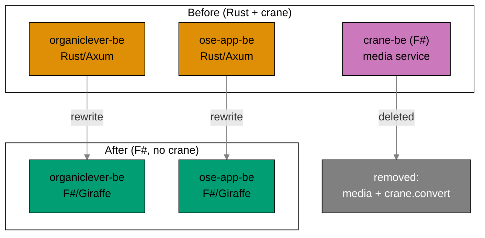
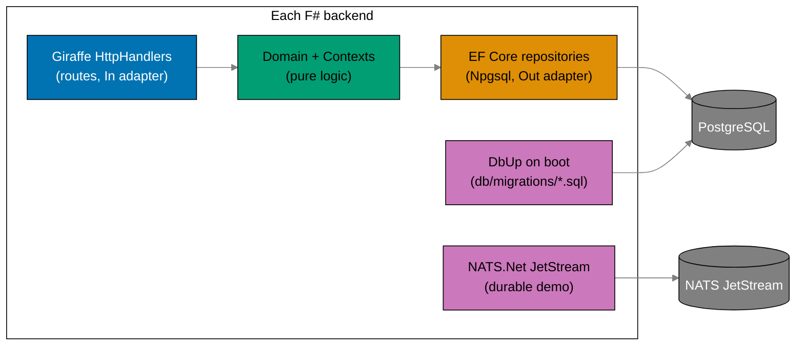
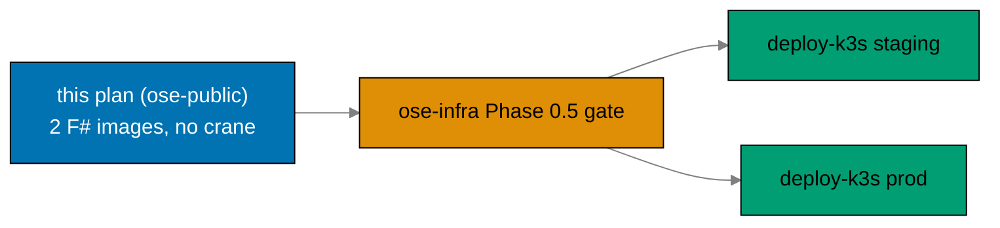

# Rewrite Backends to F# and Drop Crane Media

> **Status**: In progress — authored 2026-06-13. Execution not started.

## Context

`ose-public` runs two production backends — `apps/organiclever-be` and `apps/ose-app-be` — both
written in **Rust (Axum / sqlx / async-nats)** and shipped by the just-archived
[`bootstrap-be-messaging-and-crane-media`](../../done/2026-06-12__bootstrap-be-messaging-and-crane-media/README.md)
plan (done 2026-06-12). That plan also stood up a shared F# media service `apps/crane-be/` (PDF to
Markdown over HTTP + NATS), its paired `apps/crane-be-e2e/`, and the shared library
`libs/fsharp-crane-core/`.

This plan **supersedes the Rust backend half** of that work. It does two things:

1. **Rewrites both backends from Rust to F#**, mirroring the reference stack in
   `ose-primer/apps/crud-be-fsharp-giraffe/` — Giraffe on .NET 10, EF Core 10 for data access,
   **DbUp** for run-on-boot migrations (replacing `sqlx::migrate!`), and **NATS.Net** for messaging
   (replacing `async-nats`). The public OpenAPI contracts are **preserved** (minus the dropped media
   endpoint); `generated-contracts/` codegen stays, regenerating F# types from the same specs.
2. **Removes the crane media service entirely.** `apps/crane-be/` and `apps/crane-be-e2e/` are
   deleted; both backends lose their `contexts/media/` slice, their `crane_client`, the
   `/media/pdf-to-md` HTTP endpoint, and the `crane.convert` NATS subject usage. The PDF to Markdown
   feature is **gone** from the product. The image roster drops from three to two.

`libs/fsharp-crane-core/` **stays** — `apps/crane-cli` (F#) still depends on it. `libs/rust-commons/`
**stays** — `apps/ayokoding-cli` and `apps/ose-cli` (both remain Rust) still depend on it.

This plan assumes the sibling
[`standardize-repo-toolchain-parity`](../standardize-repo-toolchain-parity/README.md) plan is
**DONE**: the converged Nx F#/.NET targets, the `npm run doctor` .NET SDK check, the CI conventions,
and the F# coverage tooling (altcover / coverlet, per the primer) already exist. This plan
**references** that toolchain; it does not author it.

## Why F#, Why Drop Crane

- **One backend language, idiomatic and typed end-to-end.** The repo already runs F# in
  `apps/crane-cli` and `libs/fsharp-crane-core`, and the primer proves a production Giraffe/EF
  Core/DbUp/NATS.Net stack. Consolidating the two backends onto that stack removes the Rust/F# split
  in the backend tier and lets both services share the primer's hexagonal `Contexts/` shape.
- **Media was a walking skeleton, not a product need.** The bootstrap plan shipped PDF to Markdown
  as a deliberate single-op skeleton to prove NATS request/reply, never as an end-user feature. With
  the backend rewrite in flight, carrying a third service plus its dual-NATS-connection topology is
  cost without product value. Dropping it shrinks the deploy surface to the two real backends.
- **Messaging stays, proven.** The JetStream durable demo per backend survives the rewrite (now on
  NATS.Net JetStream, matching the `apps/crane-be` precedent) so the provisioned streams remain
  exercised — only the crane request/reply path is removed with the media feature.

## Scope

### In Scope

- Rewrite `apps/organiclever-be` from Rust to F# (Giraffe / EF Core 10 / DbUp / NATS.Net), adopting
  the primer's `Contexts/` hexagonal layout (Domain / Handlers / Infrastructure / Repositories),
  preserving the OpenAPI contract minus media.
- Rewrite `apps/ose-app-be` from Rust to F# the same way, including its existing non-media bounded
  contexts (`health`, `ai-orchestration`, `gap-analysis`, `internal-policy`, `regulatory-source`).
- Reuse the existing migration SQL: port each backend's `migrations/*.sql` to DbUp-embedded
  `db/migrations/*.sql`, run on boot via `DeployChanges.To.PostgresqlDatabase(...)`.
- Keep `generated-contracts/` codegen — regenerate F# contract types from the same per-app OpenAPI
  specs after the media path is removed from each contract.
- Port the JetStream durable demo per backend to NATS.Net; keep the messaging status surface.
- **Delete** `apps/crane-be/` and `apps/crane-be-e2e/`; remove `contexts/media/`, `crane_client`,
  the `/media/pdf-to-md` endpoint, and the `crane.convert` subject from both backends; remove media
  from both OpenAPI contracts.
- Adapt `apps/organiclever-be-e2e` and `apps/ose-app-be-e2e` (Playwright) to the F# backends; drop
  their media scenarios.
- Update `.github/workflows/publish-images.yml` from **three images to two** (affected-aware),
  publishing the same names as F# images: `ghcr.io/wahidyankf/organiclever-be`,
  `ghcr.io/wahidyankf/ose-app-be`.
- New production Dockerfiles for the two F# backends (multi-stage .NET publish); per-app
  `docker-compose.integration.yml` adjusted for the EF Core / DbUp PostgreSQL path.
- New `<APP>_*` env vars adjusted for the F# stack; crane env vars removed; drift guard kept green.

### Out of Scope

- Authoring the converged Nx F#/.NET targets, doctor .NET SDK check, CI conventions, or F# coverage
  tooling — owned by `standardize-repo-toolchain-parity` (assumed DONE).
- New end-user backend features beyond what the current Rust backends already expose.
- Frontend / web-app changes (`organiclever-web`, `ose-app-fe`, etc.).
- Keeping or reimplementing the PDF to Markdown feature anywhere — it is removed from the product.
- `libs/fsharp-crane-core` and `apps/crane-cli` internals (both stay as-is; only the dependency
  graph is re-verified).
- Production deployment, k3s manifests, ClusterIP wiring — owned by the downstream `ose-infra` k3s
  plans.

### Affected Areas

- `apps/organiclever-be/`, `apps/ose-app-be/` (full Rust to F# rewrite)
- `apps/organiclever-be-e2e/`, `apps/ose-app-be-e2e/` (adapt to F# backends; drop media)
- `apps/crane-be/`, `apps/crane-be-e2e/` (**deleted**)
- `specs/apps/organiclever/`, `specs/apps/ose/` (remove media from contracts + behavior; keep
  messaging)
- `.github/workflows/publish-images.yml` (3 to 2 images)
- `env-contract.yaml`, each backend `.env.example` (F# env vars; crane vars removed)
- `docs/reference/monorepo-structure.md` (platform tags for the F# backends)

## Approach

## F# Stack At A Glance

## Relationship to ose-infra k3s Deploy Plans

This plan is the **upstream prerequisite** for the two `ose-infra` k3s deploy plans (cited by path —
the reader is not assumed to have access to the private `ose-infra` repo):

- `ose-infra/plans/in-progress/deploy-k3s-cluster-staging/`
- `ose-infra/plans/in-progress/deploy-k3s-cluster-prod/`

Each of those plans carries a **Phase 0.5 gate** that hard-stops until **all** of the following hold:

- the **two** F# backend images (`ghcr.io/wahidyankf/organiclever-be`,
  `ghcr.io/wahidyankf/ose-app-be`) are publicly pullable;
- DbUp run-on-boot migrations and NATS.Net JetStream wiring are confirmed working in those images;
- **crane-be is gone** — no third image, no `crane.convert` subject, no media endpoint.

Until this plan lands, those k3s plans cannot pass Phase 0.5.

## Plan Navigation

| Document                       | Purpose                                                               |
| ------------------------------ | --------------------------------------------------------------------- |
| [README.md](./README.md)       | Context, scope, approach, infra relationship, navigation (this file)  |
| [brd.md](./brd.md)             | Business goal, rationale, affected roles, success criteria, risks     |
| [prd.md](./prd.md)             | Personas, user stories, Gherkin acceptance criteria, product scope    |
| [tech-docs.md](./tech-docs.md) | F# architecture, Rust to F# mapping, migration reuse, codegen, images |
| [delivery.md](./delivery.md)   | Phased `[AI]`/`[HUMAN]` delivery checklist with per-phase gates       |

## Delivery Phases At A Glance

| Phase | Name                                                  | Outcome                                                                      |
| ----- | ----------------------------------------------------- | ---------------------------------------------------------------------------- |
| 0     | Environment, prerequisite gate, dependency clearance  | Toolchain converged; parity plan DONE confirmed; F# pins re-confirmed        |
| 1     | Scaffold F# skeletons + EF/DbUp + contracts codegen   | Two F# app shells build; EF context + DbUp wired; F# contract types generate |
| 2     | Port organiclever-be to F#                            | All non-media contexts ported; tests green; contract preserved minus media   |
| 3     | Port ose-app-be to F#                                 | Same for ose-app-be incl. its five bounded contexts                          |
| 4     | Remove crane-be + e2e + crane_client + update publish | crane deleted; media gone everywhere; publish workflow 3 to 2 images         |
| 5     | E2E + coverage + quality gate                         | Adapted Playwright e2e green; F# coverage thresholds met; full gate green    |
| 6     | Docs + archival                                       | Docs/specs updated; plan archived; CI verified                               |

## Git Workflow

- **Worktree**: all work happens in `worktrees/rewrite-be-fsharp-drop-crane/` (see
  [delivery.md](./delivery.md) `## Worktree`).
- **Branching**: Trunk Based Development — worktree-to-main, direct push to `origin main`, no PR.
- **Commits**: thematic, Conventional Commits, split by domain/concern, one or more commits per
  phase. See
  [Trunk Based Development Convention](../../../repo-governance/development/workflow/trunk-based-development.md).
