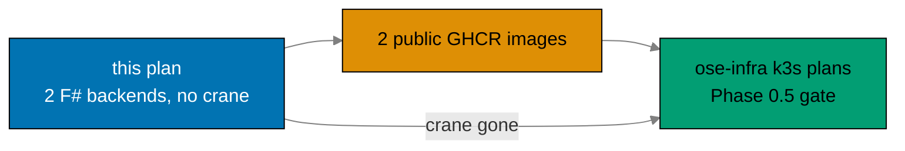

# Business Requirements: Rewrite Backends to F# and Drop Crane Media

## Deliverable Handoff At A Glance

## Business Goal

Consolidate the backend tier onto a single, idiomatic, strongly typed F# stack and shrink the deploy
surface. Concretely: rewrite both production backends (`organiclever-be`, `ose-app-be`) from Rust to
F# (Giraffe / EF Core 10 / DbUp / NATS.Net) while **preserving their public OpenAPI contracts**, and
**remove the crane media service** (and the PDF to Markdown feature) entirely — leaving exactly two
deployable backend images for the downstream `ose-infra` k3s plans to pull.

## Rationale and Pain Points

- **Backend-tier language split** `[Repo-grounded]`: the backends are Rust while `apps/crane-cli` and
  `libs/fsharp-crane-core` are F#. Two backend languages means two idiom sets, two test harnesses,
  and two dependency-clearance surfaces. The primer (`crud-be-fsharp-giraffe`) proves a production
  Giraffe/EF Core/DbUp/NATS.Net stack, so consolidating onto F# is low-risk and removes the split.
- **Media is a skeleton, not a product** `[Repo-grounded: bootstrap plan scope]`: PDF to Markdown was
  shipped as a deliberate walking-skeleton to prove NATS request/reply, never as an end-user feature.
  Carrying a third service and its dual-NATS-connection topology is operational cost without product
  value, especially with a rewrite already touching both backends.
- **Smaller deploy surface for k3s**: the downstream `ose-infra` deploy plans must pull and run the
  backend images. Dropping crane takes the roster from three images to two and removes the shared
  internal ClusterIP media service from the deployment topology.
- **Contract continuity**: the OpenAPI contracts (and the `generated-contracts/` codegen) are
  preserved (minus media), so frontends and external consumers see no breaking change beyond the
  removal of the media endpoint they were never depending on in production.

## Affected Roles

This is a solo-maintainer repository; "roles" denote the hats the maintainer wears and the agents
that consume the artifacts. No sign-off ceremonies apply.

- **Backend maintainer hat**: owns the Rust to F# rewrite of both backends and the crane removal.
- **Platform / infra maintainer hat**: consumes the two F# GHCR images and the DbUp/NATS.Net wiring
  in the downstream `ose-infra` k3s deployments.
- **Spec maintainer hat**: owns removing media from the OpenAPI contracts and behavior specs while
  preserving the rest.
- **Consuming agents**: `swe-rust-dev` (for the Rust-side removals and as the available F#-capable
  developer agent), `docs-maker` (docs + archival), `repo-setup-manager` (Phase 0), `swe-e2e-dev`
  (e2e adaptation), `ci-checker` / `ci-fixer` (CI gate).

## Business Success Criteria

All criteria are observable facts checkable by command or inspection — no fabricated KPIs.

- **Two F# backends build and run** (observable): `nx build organiclever-be` and `nx build
ose-app-be` produce .NET release artifacts; each boots, runs DbUp migrations, and serves `/health`.
- **Contracts preserved minus media** (observable): each backend's OpenAPI contract still validates
  and bundles, and every previously documented non-media path is still served; the media path is
  absent from both contracts.
- **Crane is gone** (observable): `apps/crane-be/` and `apps/crane-be-e2e/` no longer exist; no
  `crane_client`, no `/media/pdf-to-md` route, and no `crane.convert` subject appears anywhere in
  `apps/` or `specs/`; `grep` finds zero references.
- **Two images, public** (observable): `ghcr.io/wahidyankf/organiclever-be` and
  `ghcr.io/wahidyankf/ose-app-be` resolve to publicly pullable F# images after the publish workflow
  runs; the crane-be image/job is gone from `publish-images.yml` (3 to 2).
- **Messaging proven** (observable): the JetStream durable demo per backend passes at the e2e level
  on NATS.Net against a real NATS service; the messaging status surface reports delivered + acked.
- **Migrations reused** (observable): each backend's existing schema is reproduced by DbUp-embedded
  `db/migrations/*.sql`; a fresh database reaches the same schema the Rust `sqlx` migrations produced.
- **Dependencies stay** (observable): `apps/crane-cli` still references `libs/fsharp-crane-core`, and
  `apps/ayokoding-cli` + `apps/ose-cli` still reference `libs/rust-commons`; `nx graph` confirms.
- **Quality gate green** (observable): `nx affected -t typecheck lint test:quick spec-coverage` and
  the adapted e2e runs pass locally and in CI; F# coverage thresholds met.
- **Drift guard clean** (observable): `rhino-cli env validate` passes with the F# env vars registered
  and the crane vars removed.

## Cost

This plan incurs **no vendor charges** — every cost surface it touches is free under current policy:

- **GHCR images**: public GitHub Packages are free and do not count toward storage or data-transfer
  quotas. The roster shrinks from three to two public images, so cost only decreases.
- **GitHub Actions**: `ose-public` is a public repo (free minutes) and CI also runs on the
  self-hosted `ose-infra` runner stack; no GitHub-billed minutes.
- **Dependencies** are all free / open-source: Giraffe, EF Core, Npgsql, DbUp, NATS.Net,
  FSharp.SystemTextJson, fsharplint, FSharp.Analyzers, G-Research.FSharp.Analyzers, Playwright. No
  paid SaaS, no metered API keys (the `ose-app-be` OpenRouter key remains a placeholder-only var).
- **Deployment cost** (k3s runtime, NATS, PostgreSQL) is owned by the downstream `ose-infra` plans
  and runs on self-hosted clusters — out of scope here.

## Non-Goals (Business Scope)

- Not authoring the converged toolchain (Nx F# targets, doctor .NET SDK, CI conventions, F# coverage
  tooling) — that is `standardize-repo-toolchain-parity`, assumed DONE.
- Not adding new end-user backend features beyond current parity.
- Not keeping or reimplementing PDF to Markdown anywhere — the feature is removed.
- Not touching `libs/fsharp-crane-core`, `apps/crane-cli`, or `libs/rust-commons` internals (only
  the dependency graph is re-verified).
- Not delivering k3s manifests, ClusterIP wiring, or production deployment — owned by `ose-infra`.

## Risks and Mitigations

| Risk                                                                      | Impact                                | Mitigation                                                                                                                                               |
| ------------------------------------------------------------------------- | ------------------------------------- | -------------------------------------------------------------------------------------------------------------------------------------------------------- |
| EF Core / Npgsql schema diverges from the Rust `sqlx` schema              | Data-layer regression                 | Reuse the exact migration SQL via DbUp-embedded `db/migrations/*.sql`; assert the resulting schema matches before porting handlers (Phase 1 gate)        |
| F#/.NET dependency versions drift inside the Path-B soak before execution | Path-B violation, blocked dependency  | Phase 0 re-confirms each pin (Giraffe, EF Core 10, Npgsql, DbUp, NATS.Net) against the primer fsproj + release dates; cutoff = exec date minus 60 days   |
| Contract codegen for F# differs from the Rust path                        | Broken `generated-contracts/`         | Mirror the primer's `codegen` target (`openapi-generator-cli -g fsharp-giraffe-server`); regenerate after media removal; typecheck depends on codegen    |
| Removing crane leaves dangling references (routes, subjects, env, specs)  | Build/lint/spec-coverage failures     | A single removal phase (Phase 4) does media + crane in one sweep; a `grep` gate asserts zero `crane`/`media`/`pdf-to-md`/`crane.convert` references left |
| Rewrite breaks the preserved non-media contract                           | Frontend/consumer breakage            | Behavior specs (minus media) drive the F# ports; every preserved path is asserted by the adapted e2e runner before the gate                              |
| `standardize-repo-toolchain-parity` not actually DONE at execution        | Missing F# targets / coverage tooling | Phase 0 hard-stops on a prerequisite check (F# Nx targets present, doctor reports .NET SDK, coverage tooling resolves) before any rewrite work begins    |
| GHCR package visibility defaults to private for re-pushed F# images       | Infra cannot pull images              | Package visibility is already public from the bootstrap plan; Phase 4 re-verifies anonymous `docker pull`; any flip is a one-time `[HUMAN]` setting      |
| ose-app-be has five bounded contexts; porting drops one silently          | Lost functionality                    | Port context-by-context against an enumerated list (`health`, `ai-orchestration`, `gap-analysis`, `internal-policy`, `regulatory-source`); gate checks   |
