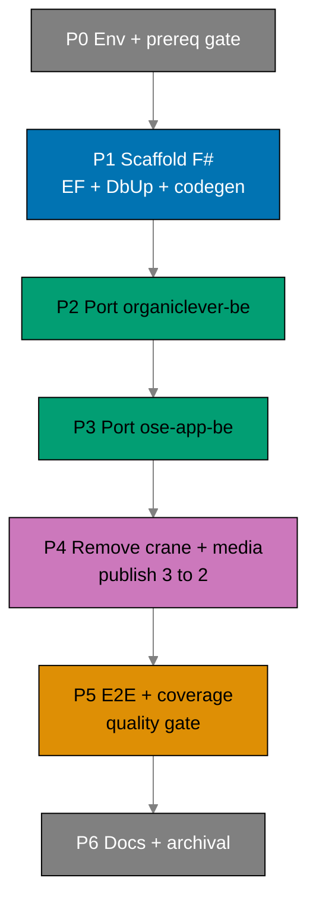

# Delivery Checklist: Rewrite Backends to F# and Drop Crane Media

> **Legend** — `[AI]`: an agent performs the step (the default; unmarked steps are `[AI]`).
> `[HUMAN]`: only a human can do it (physical action, out-of-band approval, real-secret or
> privileged-credential handling). `[AI+HUMAN]`: agent prepares, human approves or finishes.
>
> **Phase Gate** — every phase ends with a `### Phase N Gate` (must-pass verification) plus a
> `> **Pause Safety**:` note (the safe-to-stop state and the single command to resume). A phase is
> not complete until its gate is green; do not start phase N+1 while any gate check fails.

## Human Touchpoints (autonomy map)

This plan runs autonomously end-to-end except for **at most one** human action:

- **GHCR package visibility (verify-only, likely no-op)** (Phase 4). The two image packages
  (`organiclever-be`, `ose-app-be`) were already flipped public by the bootstrap plan, so re-pushing
  F# images keeps them public. If — and only if — a package reverted to private, a human flips it once
  in package settings (GitHub exposes no `gh`/REST API for visibility). Verification is automated via
  anonymous `docker pull`.

Everything else is `[AI]`. **No real `.env*` handling is required** — all automated test env comes
from committed, non-secret `docker-compose` files (integration = PostgreSQL only; e2e = PostgreSQL +
NATS). Agents never touch real `.env*` per the secrets guardrail.

## Worktree

Worktree path: `worktrees/rewrite-be-fsharp-drop-crane/`

Optional manual pre-provisioning (run from repo root):

```bash
claude --worktree rewrite-be-fsharp-drop-crane
```

The plan-execution Step 0 gate enters this worktree by default: it auto-provisions from the latest
`origin/main` when missing, syncs with `origin/main` before implementing, and prompts before deleting
the worktree after the plan is archived and pushed.

See
[Worktree Path Convention](../../../repo-governance/conventions/structure/worktree-path.md)
and
[Plans Organization Convention §Worktree Specification](../../../repo-governance/conventions/structure/plans.md#worktree-specification).

## Phase Dependency Overview



---

## Phase 0: Environment, Prerequisite Gate, Dependency Clearance

> _Executor: repo-setup-manager_

- [ ] [AI] Install dependencies in the root worktree: `npm install`
      — acceptance: exits 0, `node_modules/` synchronized.
- [ ] [AI] Converge the polyglot toolchain: `npm run doctor -- --fix`
      — acceptance: exits 0; .NET 10 SDK, Rust, Docker, Node, jq present.
- [ ] [AI] **Prerequisite hard-stop**: confirm `standardize-repo-toolchain-parity` is DONE — verify
      the converged F#/.NET Nx targets exist, `npm run doctor` reports the .NET SDK, and the F#
      coverage tooling (altcover/coverlet) resolves. If any is missing, **stop** and surface it.
      — acceptance: all three present; otherwise plan halts at Phase 0.
- [ ] [AI] Grep `env-contract.yaml` to confirm `lang: fsharp` is an accepted value (resolved by the
      parity plan). If not accepted, record the resolution path before retagging surfaces.
      — acceptance: `fsharp` accepted, or a written resolution recorded.
- [ ] [AI] Record the affected-projects baseline:
      `npx nx affected -t typecheck lint test:quick spec-coverage --base=origin/main`
      — acceptance: pass/fail counts recorded; every preexisting failure documented and resolved.
- [ ] [AI] **Dependency clearance (Path B)**: re-confirm each F# pin (Giraffe 8.x, EF Core 10,
      Npgsql.EFCore.PostgreSQL, EFCore.NamingConventions, dbup-core/dbup-postgresql,
      FSharp.SystemTextJson, NATS.Net, analyzers, altcover) against the primer fsproj + release dates;
      cutoff = execution date minus 60 days; CVE-clean (NVD, GitHub Advisories, Snyk, vendor, CISA
      KEV). Resolve the exact Giraffe 8.x pin (reuse `apps/crane-be` `8.2.0` if eligible).
      — acceptance: confirmed versions + dates written back into `tech-docs.md` F# Stack table; none
      inside the soak. _Suggested executor: web-research-maker._
- [ ] [AI] Verify the dependency graph baseline: `apps/crane-cli` → `libs/fsharp-crane-core`, and
      `apps/ayokoding-cli` + `apps/ose-cli` → `libs/rust-commons` (these must survive the rewrite).
      — acceptance: `nx graph` confirms all three edges.

### Phase 0 Gate

> All checks below must pass before starting Phase 1.

- [ ] [AI] `npm run doctor` — exits 0; .NET 10 SDK, Rust, Docker, Node, jq all present.
- [ ] [AI] Verify `standardize-repo-toolchain-parity` is in `plans/done/` — acceptance: directory
      matching `done/*standardize-repo-toolchain-parity` exists.
- [ ] [AI] `grep -r 'lang: fsharp' env-contract.yaml` — exits with at least one match (fsharp is an
      accepted lang value).
- [ ] [AI] `npx nx affected -t typecheck lint test:quick spec-coverage --base=origin/main` — all
      preexisting failures documented; no new failures unresolved.
- [ ] [AI] `nx graph --file=stdout 2>/dev/null | grep -E 'crane-cli|ayokoding-cli|ose-cli'` — three
      dependency edges present (crane-cli → fsharp-crane-core; ayokoding-cli, ose-cli → rust-commons).
- [ ] [AI] Confirm F# pin versions written back to `tech-docs.md` F# Stack table with Path-B soak dates
      — acceptance: `grep -E 'SDK.*10\.0|EF Core.*10|Npgsql.*10|Giraffe.*8' plans/in-progress/rewrite-be-fsharp-drop-crane/tech-docs.md`
      returns at least 3 matches (confirms pinned versions written back); also confirm none of the
      listed dates falls within the 60-day soak window.

> **Pause Safety**: clean tree, no source changes. Resume: re-run the baseline command
> `npx nx affected -t typecheck lint test:quick spec-coverage --base=origin/main`.

---

## Phase 1: Scaffold F# Skeletons + EF/DbUp + Contracts Codegen

> _Suggested executor: swe-rust-dev (F#-capable developer agent)_

### 1a — Fsproj scaffolding

- [ ] [AI] **RED**: Write a failing build assertion — create a minimal
      `apps/organiclever-be/src/OrganicleverBe/OrganicleverBe.fsproj` stub (OutputType=Exe, net10.0,
      empty `<Compile>` list) and `apps/ose-app-be/src/OseAppBe/OseAppBe.fsproj` stub — run
      `nx build organiclever-be ose-app-be` — acceptance: build fails with missing-file or
      missing-dependency error (confirms the stubs are wired into Nx but incomplete).
- [ ] [AI] **GREEN**: Fill both fsproj files to mirror the primer structure (analyzers, NoWarn, explicit
      `<Compile Include>` ordering, `<EmbeddedResource Include="db/migrations/*.sql" />`); add
      `global.json` (SDK `10.0.204` pin), `dotnet-tools.json` (altcover + fsharp-analyzers), and
      `fsharplint.json` per backend by copying from
      `ose-primer/apps/crud-be-fsharp-giraffe/` — acceptance:
      `nx build organiclever-be ose-app-be` exits 0, .NET artifacts appear in `dist/`.
- [ ] [AI] **REFACTOR**: Verify no Rust toolchain entry points remain in either `project.json` build
      target — acceptance: `grep -r 'cargo\|rustc' apps/organiclever-be/project.json apps/ose-app-be/project.json`
      returns zero matches; `nx build organiclever-be ose-app-be` still exits 0.

### 1b — EF Core / DbUp wiring

- [ ] [AI] **RED**: Write an integration test
      `apps/organiclever-be/tests/integration/DbUpMigrationTest.fs` that boots the EF Core context
      against a fresh PostgreSQL container and asserts the schema version table exists — run
      `nx run organiclever-be:test:integration` — acceptance: test fails with
      "relation SchemaVersions does not exist" (or similar compile/setup error).
- [ ] [AI] **GREEN**: Create
      `apps/organiclever-be/src/OrganicleverBe/Infrastructure/AppDbContext.fs` (entities +
      `[<Column>]`/`[<Table>]` snake_case mapping) and wire DbUp on-boot upgrade in
      `apps/organiclever-be/src/OrganicleverBe/Program.fs` mirroring
      `ose-primer/apps/crud-be-fsharp-giraffe/src/DemoBeFsgi/Program.fs` lines 153-166; create
      the same files under `apps/ose-app-be/src/OseAppBe/`; move each backend's
      `migrations/*.sql` to `db/migrations/` with ordered numeric prefixes and mark as
      `<EmbeddedResource>`; record the missing-`DATABASE_URL` behavior decision (SQLite fallback
      vs fail-fast) in `tech-docs.md` Deviations — acceptance:
      `nx run organiclever-be:test:integration` passes; schema matches sqlx-produced schema on a
      fresh DB.
- [ ] [AI] **REFACTOR**: Extract the DbUp bootstrap into a shared `Database.fs` module in each backend
      to avoid duplication between `Program.fs` and test setup — acceptance:
      `nx run organiclever-be:test:integration` and `nx run ose-app-be:test:integration` still pass.

### 1c — Codegen + Nx target retargeting

- [ ] [AI] **RED**: Remove the existing Rust stub codegen target from each `project.json` (the one that
      only `echo`-s a TODO) and run `nx run organiclever-be:codegen` — acceptance: command fails
      with "target not found" or similar (confirms the stub is gone and the real target is absent).
- [ ] [AI] **GREEN**: Replace the codegen target in each `project.json` with the F#
      `openapi-generator-cli -g fsharp-giraffe-server` invocation (per `tech-docs.md` Contract
      Codegen section); set `dependsOn: ["codegen"]` on `typecheck` and `build`; retarget the full
      F# target set (build/dev/typecheck/lint/test:unit/test:integration/test:quick/spec-coverage)
      using post-parity canonical names; switch tags to `lang:fsharp`/`platform:giraffe` — acceptance:
      `nx run organiclever-be:codegen` exits 0 and generates F# types under
      `apps/organiclever-be/generated-contracts/`; same for `ose-app-be`.
- [ ] [AI] **REFACTOR**: Confirm `implicitDependencies` still include `<domain>-contracts` and `rhino-cli`
      in each `project.json` — acceptance: `nx graph` shows edges; `nx run organiclever-be:typecheck`
      exits 0.

### 1d — Minimal health endpoint + docker-compose

- [ ] [AI] **RED**: Write a unit test
      `apps/organiclever-be/tests/unit/HealthHandlerTest.fs` asserting the `/health` Giraffe handler
      returns HTTP 200 with a JSON body — run `nx run organiclever-be:test:unit` — acceptance: test
      fails with "HealthHandler module not found" or similar.
- [ ] [AI] **GREEN**: Implement the `/health` Giraffe `HttpHandler` in
      `apps/organiclever-be/src/OrganicleverBe/Contexts/Health/Api/HealthHandler.fs`; wire it in
      `Program.fs`; do the same for `apps/ose-app-be/src/OseAppBe/Contexts/Health/Api/HealthHandler.fs`;
      add `apps/organiclever-be/docker-compose.integration.yml` (PostgreSQL only) and
      `apps/ose-app-be/docker-compose.integration.yml` — acceptance:
      `nx run organiclever-be:test:unit` passes; `nx build organiclever-be ose-app-be` exits 0.
- [ ] [AI] **REFACTOR**: Ensure each `Program.fs` composition root is clean (host creation, DbUp, NATS
      placeholder, routes in one readable pipeline) — acceptance:
      `nx run organiclever-be:typecheck` and `nx run ose-app-be:typecheck` exit 0 with
      TreatWarningsAsErrors.

### Phase 1 Gate

> All checks below must pass before starting Phase 2.

- [ ] [AI] `nx build organiclever-be ose-app-be` — exits 0; .NET artifacts present in `dist/` for both.
- [ ] [AI] `nx run organiclever-be:codegen && nx run ose-app-be:codegen` — exits 0; F# contract types
      generated under `generated-contracts/`.
- [ ] [AI] `nx run organiclever-be:test:unit && nx run ose-app-be:test:unit` — exits 0; health handler
      tests pass.
- [ ] [AI] `nx run organiclever-be:test:integration && nx run ose-app-be:test:integration` — exits 0;
      DbUp produces a schema matching the sqlx-produced schema on a fresh DB.
- [ ] [AI] `grep -r 'cargo\|rustc' apps/organiclever-be/project.json apps/ose-app-be/project.json`
      — zero matches; no Rust toolchain invoked.
- [ ] [AI] Decision on missing-`DATABASE_URL` behavior recorded in `tech-docs.md` Deviations —
      acceptance: `grep -A2 'DATABASE_URL' plans/in-progress/rewrite-be-fsharp-drop-crane/tech-docs.md`
      shows a resolved decision.

> **Pause Safety**: two F# app shells build and boot with empty routing; Rust sources still present in
> history. Resume: `nx build organiclever-be ose-app-be`.

---

## Phase 2: Port organiclever-be to F\#

> _Suggested executor: swe-rust-dev (F#-capable developer agent)_

### 2a — Health context

- [ ] [AI] **RED**: Confirm the health handler unit test from Phase 1d is still failing against the full
      context wiring (EF repo + composition root) — run `nx run organiclever-be:test:unit` — acceptance:
      the test targeting `GET /health` fails or produces a partial response (stub returns empty/no JSON
      body).
- [ ] [AI] **GREEN**: Complete the health context slice in
      `apps/organiclever-be/src/OrganicleverBe/Contexts/Health/` (Domain, Application, Infrastructure,
      Api layers per primer layout); wire the Giraffe handler into `Program.fs` routes — acceptance:
      `nx run organiclever-be:test:unit` passes; `curl http://localhost:$ORGANICLEVER_BE_PORT/health`
      returns HTTP 200 with a JSON body when the dev server is running.
- [ ] [AI] **REFACTOR**: Ensure the health slice has no direct dependencies on EF Core (pure domain +
      application layers, infra via interface) — acceptance: `nx run organiclever-be:typecheck` exits 0.

### 2b — Messaging context (no crane, no media)

- [ ] [AI] **RED**: Write a unit test
      `apps/organiclever-be/tests/unit/MessagingStatusHandlerTest.fs` asserting
      `GET /system/status/messaging` returns a JSON object with a `status` field — run
      `nx run organiclever-be:test:unit` — acceptance: test fails with module-not-found or missing
      route error.
- [ ] [AI] **GREEN**: Implement the `Contexts/Messaging/` slice in
      `apps/organiclever-be/src/OrganicleverBe/Contexts/Messaging/`: NATS.Net client, JetStream
      durable demo (publish → consume → ack), and the messaging status surface
      (`/system/status/messaging`); open the NATS connection in `Program.fs` composition root; **do
      not** port `crane_client` or any media path — acceptance:
      `nx run organiclever-be:test:unit` passes (status handler test green).
- [ ] [AI] **REFACTOR**: Extract NATS connection management into a reusable
      `Infrastructure/NatsClient.fs` module so that `Program.fs` stays clean — acceptance:
      `nx run organiclever-be:typecheck` exits 0.

### 2c — EF repositories + spec adaptation

- [ ] [AI] **RED**: Write a failing unit test asserting the EF repository for any persisted context
      returns a typed result (e.g., health-check ping via `AppDbContext`) — run
      `nx run organiclever-be:test:unit` — acceptance: test fails with "repository not registered"
      or interface mismatch.
- [ ] [AI] **GREEN**: Wire EF repositories in
      `apps/organiclever-be/src/OrganicleverBe/Infrastructure/Repositories/EfRepositories.fs`; register
      them in the `Program.fs` DI composition root; port/adapt the behavior specs (minus media) and
      bind F# TickSpec steps; keep `messaging` spec e2e-only (`--exclude-dir messaging`) in
      `project.json` spec-coverage target — acceptance: `nx run organiclever-be:test:unit` passes;
      `nx run organiclever-be:spec-coverage` exits 0 (all non-messaging Gherkin steps bound).
- [ ] [AI] **REFACTOR**: Remove the media path from
      `specs/apps/organiclever/` contract + behavior (delete or stub any media scenario in
      `organiclever-be` Gherkin); regenerate contracts via `nx run organiclever-be:codegen`; confirm
      the OpenAPI bundle validates — acceptance: `nx run organiclever-be:codegen` exits 0; no media
      paths in generated types.

### Phase 2 Gate

> All checks below must pass before starting Phase 3.

- [ ] [AI] `nx affected -t typecheck lint test:quick spec-coverage --base=origin/main` — exits 0 for
      `organiclever-be`; no failures.
- [ ] [AI] `nx run organiclever-be:test:quick` — exits 0; coverage ≥90%.
- [ ] [AI] `nx run organiclever-be:spec-coverage` — exits 0; all non-messaging steps bound.
- [ ] [AI] `nx run organiclever-be:codegen` — exits 0; contract validates minus media.
- [ ] [AI] Note (or defer to Phase 5) whether the JetStream demo passes at e2e: record "deferred to
      Phase 5" in `tech-docs.md` if the e2e harness is not yet wired.

> **Pause Safety**: `organiclever-be` fully F#, non-media contract served; `ose-app-be` still Rust.
> Resume: `nx run organiclever-be:test:quick`.

---

## Phase 3: Port ose-app-be to F\#

> _Suggested executor: swe-rust-dev (F#-capable developer agent)_

### 3a — Five non-media bounded contexts

- [ ] [AI] **RED**: Write failing unit tests for each of the five bounded-context handlers
      (`health`, `ai-orchestration`, `gap-analysis`, `internal-policy`, `regulatory-source`) in
      `apps/ose-app-be/tests/unit/` — run `nx run ose-app-be:test:unit` — acceptance: all five
      tests fail with module-not-found or route-not-registered error (confirms test-first shape).
- [ ] [AI] **GREEN**: Implement each non-media context as a
      `Contexts/<Name>/{Domain,Application,Infrastructure,Api}` slice in
      `apps/ose-app-be/src/OseAppBe/Contexts/`; wire all five handlers into `Program.fs` routes —
      acceptance: `nx run ose-app-be:test:unit` passes for all five context handler tests.
- [ ] [AI] **REFACTOR**: Verify each context slice is independent (no cross-context imports except
      shared Domain types) — acceptance: `nx run ose-app-be:typecheck` exits 0 with no warnings
      promoted to errors.

### 3b — Messaging context (drop crane + media)

- [ ] [AI] **RED**: Write a failing unit test
      `apps/ose-app-be/tests/unit/MessagingStatusHandlerTest.fs` asserting
      `GET /system/status/messaging` returns a JSON body with a `status` field — run
      `nx run ose-app-be:test:unit` — acceptance: test fails.
- [ ] [AI] **RED**: Write a failing unit test
      `apps/ose-app-be/tests/unit/EfRepositoryTest.fs` asserting the EF repository for any persisted
      context returns a typed result (e.g., health-check ping via `AppDbContext`) — run
      `nx run ose-app-be:test:unit` — acceptance: test fails with "repository not registered" or
      interface mismatch.
- [ ] [AI] **GREEN**: Implement `Contexts/Messaging/` in `apps/ose-app-be/src/OseAppBe/Contexts/Messaging/`
      (NATS.Net client, JetStream demo, status surface); **drop** `crane_client` (do not port it);
      preserve the OpenRouter placeholder-only env vars (`OSE_APP_BE_OPENROUTER_*`) in `Program.fs`
      config guards; wire EF repositories in
      `apps/ose-app-be/src/OseAppBe/Infrastructure/Repositories/EfRepositories.fs` and register them
      in the `Program.fs` DI composition root; confirm DbUp runs on boot (reuse the `Database.fs`
      module pattern from Phase 1b) — acceptance: `nx run ose-app-be:test:unit` passes;
      `nx run ose-app-be:test:integration` exits 0.
- [ ] [AI] **REFACTOR**: Extract NATS connection management into a reusable
      `apps/ose-app-be/src/OseAppBe/Infrastructure/NatsClient.fs` module (mirrors Phase 2b REFACTOR)
      so that `Program.fs` stays clean; remove any duplication between `Program.fs` and test setup
      introduced in this phase — acceptance: `nx run ose-app-be:typecheck` exits 0;
      `nx run ose-app-be:test:integration` still exits 0.

### 3c — Spec adaptation + contract regeneration

- [ ] [AI] **RED**: Run `nx run ose-app-be:spec-coverage` — acceptance: step fails because media
      Gherkin steps exist in `specs/apps/ose/` that are now unbound (no F# TickSpec binding for
      them).
- [ ] [AI] **GREEN**: Port/adapt the behavior specs (minus media): bind F# TickSpec steps for all
      preserved contexts; remove media from `specs/apps/ose/` contract + behavior; regenerate
      contracts via `nx run ose-app-be:codegen` — acceptance:
      `nx run ose-app-be:spec-coverage` exits 0; no media paths in the generated contract.
- [ ] [AI] **REFACTOR**: Confirm the OpenAPI bundle for `ose-app-be` validates cleanly (no orphan
      `$ref` or missing schema) — acceptance: `nx run ose-app-be:codegen` exits 0.

### Phase 3 Gate

> All checks below must pass before starting Phase 4.

- [ ] [AI] `nx affected -t typecheck lint test:quick spec-coverage --base=origin/main` — exits 0 for
      `ose-app-be`; no failures.
- [ ] [AI] `nx run ose-app-be:test:quick` — exits 0; coverage ≥90%.
- [ ] [AI] `nx run ose-app-be:spec-coverage` — exits 0; all five non-media bounded contexts' steps
      bound; messaging excluded via `--exclude-dir`.
- [ ] [AI] `nx run ose-app-be:codegen` — exits 0; contract validates minus media.
- [ ] [AI] `grep 'OSE_APP_BE_OPENROUTER' apps/ose-app-be/src/OseAppBe/Program.fs` — at least one
      match (placeholder env var preserved).

> **Pause Safety**: both backends fully F#; crane-be + media still present elsewhere. Resume:
> `nx run ose-app-be:test:quick`.

---

## Phase 4: Remove crane-be + e2e + media + update publish workflow

> _Suggested executor: swe-rust-dev_

- [ ] [AI] Delete `apps/crane-be/` and `apps/crane-be-e2e/` (`git rm -r`).
- [ ] [AI] Remove any remaining media/crane references from both backends (routes, env vars,
      `crane.convert` subject) — most already absent after Phases 2–3; sweep to zero.
- [ ] [AI] Remove the following confirmed crane/media spec files and sections (per repo grep
      verification): delete
      `specs/apps/ose/behavior/app-be/gherkin/messaging/crane-convert.feature`,
      delete `specs/apps/organiclever/behavior/organiclever-be/gherkin/messaging/crane-convert.feature`,
      remove crane/media terms from `specs/apps/ose/ddd/ubiquitous-language/messaging.md`
      (`crane.convert`, `media-convert endpoint`), remove or repurpose
      `specs/apps/ose/ddd/ubiquitous-language/media.md` and
      `specs/apps/organiclever/ddd/ubiquitous-language/be-media.md` (the `POST /api/v1/media/convert`
      entries), remove the `crane-be via crane.convert` entry from
      `specs/apps/ose/ddd/bounded-contexts.yaml`, and remove the `be-media` bounded context and
      crane references from `specs/apps/organiclever/ddd/bounded-contexts.yaml` —
      acceptance: `grep -r 'crane\|media\|pdf-to-md' specs/apps/organiclever/ specs/apps/ose/`
      returns zero results (excluding any crane-cli scope under `specs/apps/crane/`).
- [ ] [AI] Update `.github/workflows/publish-images.yml`: drop `build-crane-be` output + the
      `publish-crane-be` job (3 → 2); keep affected-aware `detect`.
- [ ] [AI] Replace each backend's Rust Dockerfile with a .NET multi-stage Dockerfile (sdk:10.0 builder
      → aspnet:10.0 runtime), image names unchanged.
- [ ] [AI] Remove the crane env vars from each `.env.example` and `env-contract.yaml`; run
      `rhino-cli env validate`.
- [ ] [AI] **Removal gate (grep)**: `grep -rE 'crane[_.]|/media/pdf-to-md|crane\.convert'` over
      `apps/` and `specs/` returns zero hits, excluding `apps/crane-cli` and `libs/fsharp-crane-core`.
- [ ] [AI] Confirm `libs/fsharp-crane-core` and `libs/rust-commons` still exist and their dependents
      (`crane-cli`; `ayokoding-cli`, `ose-cli`) still build.
- [ ] [AI] Build both F# backends as .NET Docker images locally:
      `docker build -f apps/organiclever-be/Dockerfile -t ghcr.io/wahidyankf/organiclever-be:local .`
      and `docker build -f apps/ose-app-be/Dockerfile -t ghcr.io/wahidyankf/ose-app-be:local .`
      — acceptance: both `docker build` commands exit 0 and images appear in `docker images`.
- [ ] [HUMAN] Verify anonymous `docker pull ghcr.io/wahidyankf/organiclever-be:latest` and
      `docker pull ghcr.io/wahidyankf/ose-app-be:latest` both succeed without authentication. If
      either package visibility reverted to private, flip it to public in the GitHub package settings
      for the `wahidyankf/ose-public` repository. Observable resume signal: both pulls succeed;
      verify with `docker pull --disable-content-trust ghcr.io/wahidyankf/organiclever-be:latest`
      and same for `ose-app-be:latest` returning `Status: Image is up to date` (or a digest line)
      without a login prompt.

### Phase 4 Gate

> All checks below must pass before starting Phase 5.

- [ ] [AI] `test ! -d apps/crane-be && test ! -d apps/crane-be-e2e` — exits 0; both directories gone.
- [ ] [AI] `grep -rE 'crane[_.]|/media/pdf-to-md|crane\.convert' apps/ specs/ --exclude-dir=crane-cli --exclude-dir=fsharp-crane-core`
      — zero matches.
- [ ] [AI] `grep -r 'crane\|media\|pdf-to-md' specs/apps/organiclever/ specs/apps/ose/` — zero matches.
- [ ] [AI] `rhino-cli env validate` — exits 0; no crane env vars present.
- [ ] [AI] `cat .github/workflows/publish-images.yml | grep 'crane-be'` — zero matches (crane-be job
      removed).
- [ ] [AI] `nx build organiclever-be ose-app-be` — exits 0 using .NET Dockerfiles (no Rust build).
- [ ] [AI] `nx build crane-cli && nx build ayokoding-cli && nx build ose-cli` — exits 0; dependents
      still build.
- [ ] [HUMAN] Verify anonymous pulls succeed (per the step above) — observable signal: both
      `docker pull` commands exit 0 without a login prompt.

> **Pause Safety**: media feature fully removed; two-image roster in place. Resume:
> `npx nx affected -t build --base=origin/main`.

---

## Phase 5: E2E + Coverage + Quality Gate

> _Suggested executor: swe-e2e-dev_

- [ ] [AI] Adapt `apps/organiclever-be-e2e` + `apps/ose-app-be-e2e`: delete media + crane NATS
      scenarios/steps; keep preserved-path + JetStream-demo-over-HTTP scenarios; point at the F#
      backends — acceptance: `grep -r 'crane\|media' apps/organiclever-be-e2e/ apps/ose-app-be-e2e/`
      returns zero matches.
- [ ] [AI] Update each backend's `docker-compose.e2e.yml` to bring up PostgreSQL + NATS (no crane) —
      acceptance: `grep 'crane' apps/organiclever-be/docker-compose.e2e.yml apps/ose-app-be/docker-compose.e2e.yml`
      returns zero matches.
- [ ] [AI] Run `nx run organiclever-be-e2e:test:e2e` and `nx run ose-app-be-e2e:test:e2e`; assert the
      JetStream demo (delivered + acked) over the status surface — acceptance: both commands exit 0.
- [ ] [AI] Run the full affected quality gate:
      `npx nx affected -t typecheck lint test:quick test:integration spec-coverage --base=origin/main`
      — acceptance: exits 0, no failures.
- [ ] [AI] If any target above failed: read the failure output, identify root-cause files, fix them,
      and re-run
      `npx nx affected -t typecheck lint test:quick test:integration spec-coverage --base=origin/main`
      — acceptance: command exits 0 with no failures reported; fix-forward only (no `--skip-nx-cache`
      or similar bypass flags permitted).

### Manual API Verification (curl)

- [ ] [AI] Start `organiclever-be` dev server: `nx dev organiclever-be` (background); wait for the
      "Listening on" log line.
- [ ] [AI] `curl -s http://localhost:${ORGANICLEVER_BE_PORT:-3000}/health | jq .` — response HTTP 200
      with a JSON body (e.g., `{"status":"ok"}` or equivalent non-empty object).
- [ ] [AI] Verify at least one non-media preserved endpoint responds correctly — acceptance: the
      first endpoint listed in the `organiclever-be` OpenAPI spec (excluding `/health`) returns an
      HTTP 2xx response when called with valid parameters.
- [ ] [AI] Verify an error case: call the health endpoint with a malformed Accept header or an
      undefined route — acceptance: HTTP 404 or 400 returned (not 500); confirms error handling is
      in place.
- [ ] [AI] Start `ose-app-be` dev server: `nx dev ose-app-be`; repeat the three curl checks above
      for `http://localhost:${OSE_APP_BE_PORT:-3001}/health` — acceptance: same pass criteria.
- [ ] [AI] Stop both dev servers after verification.

### Phase 5 Gate

> All checks below must pass before starting Phase 6.

- [ ] [AI] `nx run organiclever-be-e2e:test:e2e && nx run ose-app-be-e2e:test:e2e` — exits 0; no
      media scenarios executed.
- [ ] [AI] `nx run organiclever-be:test:quick && nx run ose-app-be:test:quick` — exits 0; coverage
      ≥90% for both backends.
- [ ] [AI] `npx nx affected -t typecheck lint test:quick test:integration spec-coverage --base=origin/main`
      — exits 0; full quality gate green locally.
- [ ] [AI] `curl -s http://localhost:${ORGANICLEVER_BE_PORT:-3000}/health` — HTTP 200 confirmed (per
      manual curl verification above).
- [ ] [AI] `curl -s http://localhost:${OSE_APP_BE_PORT:-3001}/health` — HTTP 200 confirmed.

> **Pause Safety**: all gates green locally; docs not yet updated. Resume: re-run
> `npx nx affected -t typecheck lint test:quick test:integration spec-coverage --base=origin/main`.

---

## Phase 6: Docs + Archival

> _Suggested executor: docs-maker_

- [ ] [AI] Update `docs/reference/monorepo-structure.md`: change the platform tags for
      `organiclever-be` and `ose-app-be` from Rust/Axum to F#/Giraffe; remove `crane-be` from any
      service roster entry — acceptance: `grep 'axum\|crane-be' docs/reference/monorepo-structure.md`
      returns zero matches.
- [ ] [AI] Update `apps/organiclever-be/README.md` to describe the F# Giraffe/EF Core/DbUp/NATS.Net
      stack — acceptance: `grep 'Rust\|Axum\|sqlx\|cargo' apps/organiclever-be/README.md` returns
      zero matches; F#/Giraffe/EF Core/DbUp/NATS.Net are mentioned.
- [ ] [AI] Update `apps/ose-app-be/README.md` similarly — acceptance: same grep criteria as above
      for `apps/ose-app-be/README.md`.
- [ ] [AI] Search docs for stale crane/media mentions:
      `grep -r 'crane-be\|pdf-to-md\|crane\.convert' docs/` — acceptance: zero results (or only
      results in crane-cli-scoped docs, which are correct).
- [ ] [AI] Run `npm run lint:md:fix && npm run format:md`; fix any remaining markdownlint violations —
      acceptance: `npm run lint:md` exits 0.
- [ ] [AI] Commit thematically (Conventional Commits, split by domain); push to `origin main`
      (worktree-to-main) — acceptance: `git push` exits 0; commits use Conventional Commits format.
- [ ] [AI] Monitor GitHub Actions after push: watch `.github/workflows/ci.yml` and
      `.github/workflows/publish-images.yml` — acceptance: both workflows complete with green status;
      if either fails, fix at root cause and push a follow-up commit before proceeding to archival.
- [ ] [AI] Move the plan to `done/`:
      `git mv plans/in-progress/rewrite-be-fsharp-drop-crane plans/done/YYYY-MM-DD__rewrite-be-fsharp-drop-crane`
      (replace YYYY-MM-DD with the completion date); update `plans/in-progress/README.md` (remove
      entry) and `plans/done/README.md` (add entry with completion date).

### Phase 6 Gate

> All checks below must pass before closing this plan.

- [ ] [AI] `grep 'axum\|crane-be' docs/reference/monorepo-structure.md` — zero matches.
- [ ] [AI] `grep 'Rust\|Axum\|sqlx\|cargo' apps/organiclever-be/README.md apps/ose-app-be/README.md`
      — zero matches.
- [ ] [AI] `grep -r 'crane-be\|pdf-to-md\|crane\.convert' docs/` — zero matches.
- [ ] [AI] `npm run lint:md` — exits 0; no markdownlint violations.
- [ ] [AI] GitHub Actions `.github/workflows/ci.yml` and `.github/workflows/publish-images.yml` both
      show green for the final push — acceptance: both workflows passed.
- [ ] [AI] `test -d plans/done/*rewrite-be-fsharp-drop-crane` — plan directory present in `done/`.

> **Pause Safety**: plan complete and archived; nothing left in flight. Resume: n/a.
