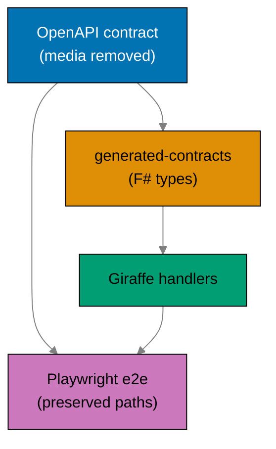

# Product Requirements: Rewrite Backends to F# and Drop Crane Media

## Product Overview

Two production backends move from Rust to F# without changing what they expose to clients (minus the
removed media endpoint), and the crane media service disappears from the product. The deliverable is
"behaviorally equivalent on the preserved contract, and lighter by one service" rather than
feature-additive.

Each F# backend mirrors the `ose-primer/apps/crud-be-fsharp-giraffe` reference: Giraffe routes over a
hexagonal `Contexts/` layout, EF Core 10 repositories on Npgsql, DbUp run-on-boot migrations, and a
NATS.Net JetStream durable demo. Contract types are regenerated from the same OpenAPI specs into
`generated-contracts/`.



## Personas

This solo-maintainer repo's personas are the hats worn and the agents/services that consume the
output.

- **Backend maintainer** — rewrites both backends to F# and removes crane; wants idiomatic F#,
  preserved contracts, and green gates.
- **Infra operator (ose-infra)** — pulls the two public F# GHCR images and deploys them; wants images
  that build, run DbUp migrations on boot, connect to NATS, and serve the contract.
- **Contract consumer (frontend / external)** — calls the preserved non-media endpoints; must see no
  breaking change beyond the removed media path.
- **E2E runners (`organiclever-be-e2e`, `ose-app-be-e2e`)** — Playwright black-box clients that drive
  a running F# backend over real HTTP, asserting the preserved behavior and the JetStream demo
  surface.

## User Stories

- As the **backend maintainer**, I want `organiclever-be` rewritten to F# (Giraffe/EF Core/DbUp/
  NATS.Net) so that the backend tier runs one idiomatic stack matching the primer.
- As the **backend maintainer**, I want `ose-app-be` rewritten to F# with all its non-media bounded
  contexts intact so that no functionality is lost in the port.
- As the **backend maintainer**, I want each backend's existing migration SQL reused via DbUp so that
  a fresh database reaches the same schema without rewriting migrations.
- As the **contract consumer**, I want the OpenAPI contracts preserved minus media so that my
  existing non-media calls keep working unchanged.
- As the **backend maintainer**, I want the crane media service and the PDF to Markdown feature fully
  removed so that the deploy surface is two backends, not three services.
- As the **infra operator**, I want exactly two public GHCR images (no crane image) so that the k3s
  deploy roster matches the new topology.
- As the **backend maintainer**, I want the JetStream durable demo ported to NATS.Net so that the
  provisioned streams stay proven after the rewrite.
- As the **backend maintainer**, I want every new env var registered and the crane vars removed so
  that `rhino-cli env validate` stays green.

## Acceptance Criteria (Gherkin)

> Every scenario uses exactly one primary `Given`, one `When`, one `Then`; extras chain with
> `And`/`But`. These scenarios seed the first failing tests for the matching delivery phases.

### Prerequisite gate

```gherkin
Scenario: the toolchain-parity prerequisite is confirmed done before rewrite work
  Given the standardize-repo-toolchain-parity plan is expected to be complete
  When Phase 0 checks for the converged F# Nx targets, the doctor .NET SDK check, and F# coverage tooling
  Then all three are present and pass
  And the rewrite phases are cleared to begin
```

### F# backend builds and boots

```gherkin
Scenario: organiclever-be builds as an F# service
  Given organiclever-be has been rewritten to F# Giraffe on net10.0
  When nx build organiclever-be runs
  Then the .NET release artifact is produced
  And no Rust toolchain is invoked for organiclever-be
```

```gherkin
Scenario: a rewritten backend runs DbUp migrations on boot
  Given a rewritten F# backend starts against an empty database with DATABASE_URL set
  When the backend process boots
  Then DbUp applies all embedded db/migrations/*.sql before serving requests
  And the backend reports healthy after migrations complete
```

```gherkin
Scenario: a rewritten backend reports healthy over HTTP
  Given a rewritten F# backend is running on its configured port
  When a client sends GET to /health
  Then the response status is 200
  And the response body indicates the service is healthy
```

### Migration reuse

```gherkin
Scenario: DbUp reproduces the schema the Rust sqlx migrations produced
  Given each backend's migrations/*.sql have been ported to db/migrations/*.sql embedded for DbUp
  When DbUp performs the upgrade against a fresh database
  Then the resulting schema matches the schema the Rust sqlx migrations produced
  And no migration is skipped or duplicated
```

### Contract preserved minus media

```gherkin
Scenario: the OpenAPI contract still validates after media removal
  Given the media path has been removed from a backend's OpenAPI contract
  When the contract lint and bundle target runs
  Then the contract validates and bundles successfully
  And every previously documented non-media path is still present
```

```gherkin
Scenario: F# contract types regenerate from the same OpenAPI spec
  Given the media path has been removed from a backend's OpenAPI contract
  When the codegen target runs
  Then F# contract types are generated into generated-contracts
  And the typecheck target consuming them passes
```

### JetStream demo on NATS.Net

```gherkin
@e2e
Scenario: a rewritten backend publishes and durably consumes its demo subject with ack
  Given a rewritten F# backend has a JetStream durable stream and consumer for its demo subject
  When the backend publishes a demo message to that subject
  Then the durable consumer receives the message
  And the message is acknowledged
  And the messaging status surface reports the demo delivered and acked
```

```gherkin
Scenario: a rewritten backend fails fast when its NATS URL is missing
  Given the backend NATS URL variable is unset
  When the backend reads its messaging configuration
  Then startup aborts with a clear missing-variable error
```

### Crane and media fully removed

```gherkin
Scenario: the crane service and its e2e runner no longer exist
  Given the rewrite is complete
  When the apps directory is inspected
  Then apps/crane-be does not exist
  And apps/crane-be-e2e does not exist
```

```gherkin
Scenario: no media or crane references remain in apps or specs
  Given the rewrite is complete
  When a search for crane, media, pdf-to-md, and crane.convert runs over apps and specs
  Then no crane_client module is found
  And no /media/pdf-to-md route is found
  And no crane.convert subject usage is found
```

```gherkin
Scenario: the crane-cli to fsharp-crane-core dependency is preserved
  Given crane-be has been removed
  When the dependency graph is inspected
  Then apps/crane-cli still references libs/fsharp-crane-core
  And libs/fsharp-crane-core is not deleted
```

```gherkin
Scenario: the rust-commons dependents are preserved
  Given the backends have been rewritten to F#
  When the dependency graph is inspected
  Then apps/ayokoding-cli and apps/ose-cli still reference libs/rust-commons
  And libs/rust-commons is not deleted
```

### Publish workflow drops to two images

```gherkin
Scenario: the publish workflow builds two images, not three
  Given the publish-images workflow has been updated for the F# backends
  When the affected-aware workflow is triggered by a push to main
  Then it can build and publish only organiclever-be and ose-app-be
  And no crane-be image job exists
```

```gherkin
Scenario: both F# images are publicly pullable
  Given the publish workflow has run for the F# backends
  When an anonymous docker pull is attempted for each image
  Then ghcr.io/wahidyankf/organiclever-be pulls successfully
  And ghcr.io/wahidyankf/ose-app-be pulls successfully
```

### Adapted e2e over the wire

```gherkin
@e2e
Scenario: the adapted e2e runner asserts preserved behavior against the F# backend
  Given a running F# backend started for its paired e2e runner
  When the e2e runner exercises the preserved non-media scenarios over real HTTP
  Then all preserved scenarios pass
  And no media scenario is executed
```

### Env drift guard

```gherkin
Scenario: env drift guard passes with F# vars and without crane vars
  Given the F# backend env vars are annotated in each .env.example and registered in env-contract.yaml
  And the crane-specific vars have been removed
  When rhino-cli env validate runs
  Then it reports no drift
  And the pre-push and CI env-validate checks pass
```

## Product Scope

### In Scope (Product Features)

- `organiclever-be` rewritten to F# (Giraffe/EF Core 10/DbUp/NATS.Net), preserving its `/health` and
  all non-media paths and its messaging status surface + JetStream demo.
- `ose-app-be` rewritten to F# the same way, preserving its five non-media bounded contexts.
- Migration SQL reuse via DbUp-embedded `db/migrations/*.sql`.
- F# `generated-contracts/` codegen from the same OpenAPI specs (media removed).
- Removal of `apps/crane-be/`, `apps/crane-be-e2e/`, both `contexts/media/`, both `crane_client`,
  the `/media/pdf-to-md` route, and the `crane.convert` subject; media removed from both contracts.
- Adapted Playwright e2e runners (media scenarios dropped).
- Two-image affected-aware publish workflow; new F# Dockerfiles; adjusted integration compose.
- Env-var updates and drift-guard registration.

### Out of Scope (Product Features)

- The PDF to Markdown feature in any form (removed).
- New endpoints or business features beyond current non-media parity.
- Authoring the converged toolchain (assumed DONE).
- Frontend / web-app changes.
- `libs/fsharp-crane-core`, `apps/crane-cli`, `libs/rust-commons` internals.
- Production deployment manifests (owned by `ose-infra`).

## Product Risks

- **Behavioral parity on the preserved contract**: the F# port must serve every non-media path the
  Rust backend served; mitigated by driving the port from the preserved behavior specs and asserting
  via the adapted e2e runner before the gate.
- **EF Core mapping fidelity**: snake_case column mapping and types must match the existing schema;
  mitigated by reusing the migration SQL and the primer's `UseSnakeCaseNamingConvention` +
  `[<Column>]`-annotated entities.
- **NATS.Net JetStream demo flakiness**: depends on a real NATS container at e2e; mitigated by
  keeping `test:e2e` non-cacheable and gating on a `/health` healthcheck wait.
