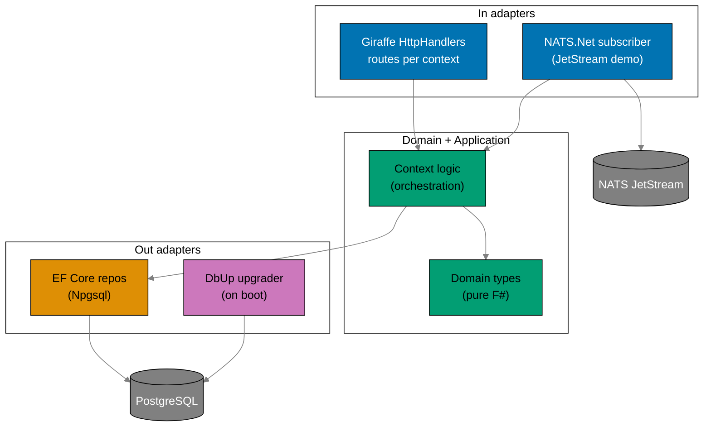
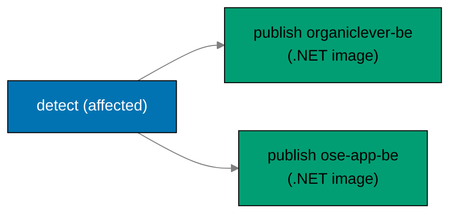

# Technical Documentation: Rewrite Backends to F# and Drop Crane Media

## Architecture Overview

Each backend is rewritten to mirror `ose-primer/apps/crud-be-fsharp-giraffe/src/DemoBeFsgi`
`[Repo-grounded: primer fsproj + Program.fs]`: a Giraffe web host composing `HttpHandler` routes over
a hexagonal `Contexts/` layout, EF Core 10 repositories on Npgsql for persistence, DbUp performing a
run-on-boot upgrade from embedded SQL, and NATS.Net for the JetStream durable demo.



## F# Stack (mirror of ose-primer crud-be-fsharp-giraffe)

The exact stack and pins below are read from the primer fsproj, `global.json`, and `dotnet-tools.json`
`[Repo-grounded: ose-primer/apps/crud-be-fsharp-giraffe]`. **Phase 0 re-confirms each version** against
the primer at execution time and against the Path-B 60-day soak (cutoff = execution date minus 60
days); the values below are the confirmed-as-of-authoring baseline and are treated as `[Unverified]`
until Phase 0 re-confirms.

| Concern              | Package / tool                                                          | Version (primer baseline) |
| -------------------- | ----------------------------------------------------------------------- | ------------------------- |
| Runtime / TFM        | .NET SDK / `net10.0`                                                    | SDK `10.0.204`            |
| Web framework        | `Giraffe`                                                               | `8.x` (primer: `7.0.2`)   |
| ORM                  | `Microsoft.EntityFrameworkCore`                                         | `10.0.8`                  |
| PostgreSQL provider  | `Npgsql.EntityFrameworkCore.PostgreSQL`                                 | `10.0.2`                  |
| Naming convention    | `EFCore.NamingConventions` (snake_case)                                 | `10.0.1`                  |
| Migrations (on boot) | `dbup-core` + `dbup-postgresql`                                         | `5.0.87` / `5.0.40`       |
| JSON                 | `FSharp.SystemTextJson`                                                 | `1.4.36`                  |
| Messaging            | `NATS.Net`                                                              | `2.7.3` (crane-be pin)    |
| Lint / analyzers     | `fsharplint` + `FSharp.Analyzers.Build` + `G-Research.FSharp.Analyzers` | `0.5.0` / `0.22.0`        |
| Coverage             | `altcover.global` (+ coverlet path per parity)                          | `9.0.102`                 |
| Pinning              | `global.json` (SDK) + `dotnet-tools.json` (CLI)                         | as above                  |

> **Giraffe version note** `[Judgment call]`: the locked decision states Giraffe 8.x; the primer
> fsproj currently pins `7.0.2` while `apps/crane-be` already pins `Giraffe 8.2.0`
> `[Repo-grounded: crane-be.fsproj]`. Phase 0 resolves the exact 8.x pin (reuse crane-be's `8.2.0`
> if still Path-B-eligible) and applies it to both backends; do not silently inherit the primer's 7.x.

## Rust to F# Mapping

Every Rust subsystem in the current backends maps to an F#/.NET equivalent from the primer stack:

| Concern                  | Rust (current) `[Repo-grounded]`       | F# (target, primer-mirrored)                                                                                  |
| ------------------------ | -------------------------------------- | ------------------------------------------------------------------------------------------------------------- |
| HTTP framework / routing | `axum` 0.8 routers + handlers          | `Giraffe` `HttpHandler` + `choose`/`route`/`subRoute`                                                         |
| Web host                 | `tokio` + `axum::serve`                | `Host.CreateDefaultBuilder().ConfigureWebHostDefaults(...)`                                                   |
| DB queries               | `sqlx` query macros / `query_as`       | EF Core 10 `DbSet` + LINQ in `EfRepositories.fs` (Npgsql)                                                     |
| Entity mapping           | `sqlx::FromRow` structs                | `[<CLIMutable>]` + `[<Table>]`/`[<Column>]` entities in `AppDbContext.fs`                                     |
| Schema migrations        | `sqlx::migrate!` (`migrations/*.sql`)  | DbUp `DeployChanges.To.PostgresqlDatabase(...).WithScriptsEmbeddedInAssembly(...)` over `db/migrations/*.sql` |
| Messaging client         | `async-nats` 0.47                      | `NATS.Net` 2.x (`NatsClient`, JetStream context)                                                              |
| JSON (ser/de)            | `serde` / `serde_json`                 | `FSharp.SystemTextJson` (`JsonFSharpConverter`)                                                               |
| Error handling           | `anyhow::Result` / `thiserror`         | F# `Result<'T,'E>` + typed domain errors; `failwith` only at boot                                             |
| Config / env             | `dotenvy` + `envy` fail-fast           | `Environment.GetEnvironmentVariable` + explicit fail-fast guards                                              |
| Async                    | `tokio` futures + `futures::StreamExt` | .NET `task {}` / `IAsyncEnumerable` for JetStream consumption                                                 |
| Contract types           | `generated-contracts/` (Rust, stubbed) | `generated-contracts/` (F#, `-g fsharp-giraffe-server` models)                                                |
| Lint                     | `clippy -D warnings`                   | `fsharplint` + G-Research analyzers (treat-as-error)                                                          |
| Coverage                 | `cargo llvm-cov` (LCOV, ≥90%)          | `altcover` LCOV (≥90% per parity coverage tooling)                                                            |

> **Removed in the mapping**: `reqwest` (crane HTTP client) and the `crane.convert` request/reply
> path — both belong to the deleted media feature and have **no** F# equivalent in the target.

## Migration SQL Reuse

The current backends carry `migrations/0001_initial.sql` (+ `.gitkeep`)
`[Repo-grounded: apps/*/migrations/]`, applied by `sqlx::migrate!` on boot. The rewrite:

1. Moves each backend's SQL to `apps/<backend>/db/migrations/*.sql` (keeping ordered numeric
   prefixes, matching the primer's `001-…`/`002-…` convention).
2. Marks them `<EmbeddedResource Include="db/migrations/*.sql" />` in the fsproj
   `[Repo-grounded: primer fsproj line 78-80]`.
3. Runs DbUp once at startup before the host serves, exactly as the primer does
   `[Repo-grounded: primer Program.fs lines 153-166]`:

   ```fsharp
   let result =
       DeployChanges.To
           .PostgresqlDatabase(connStr)
           .WithScriptsEmbeddedInAssembly(Reflection.Assembly.GetExecutingAssembly())
           .LogToConsole()
           .Build()
           .PerformUpgrade()
   if not result.Successful then
       failwith (sprintf "Database migration failed: %s" result.Error.Message)
   ```

The SQL itself is reused verbatim where dialect-compatible (it already targets PostgreSQL). DbUp
tracks applied scripts in its `SchemaVersions` table, replacing sqlx's `_sqlx_migrations`. The Phase 1
gate asserts the DbUp-produced schema matches the sqlx-produced schema before any handler is ported.

## Per-App Context Layout

Both backends adopt the primer's source layout under `apps/<backend>/src/<AppName>/`
`[Repo-grounded: primer src/DemoBeFsgi]`, with the repo's existing bounded contexts expressed as
`Contexts/` slices (the primer scaffolds `Contexts/<Name>/{Api,Application,Domain,Infrastructure}`).

### organiclever-be (F#)

The current Rust app exposes `health` plus a messaging status surface, and (to be removed) `media`
`[Repo-grounded: apps/organiclever-be/src/contexts/]`. Target:

```
apps/organiclever-be/
  global.json                 # SDK pin (mirrors parity / primer)
  dotnet-tools.json           # altcover + fsharp-analyzers
  fsharplint.json
  Dockerfile                  # multi-stage .NET publish (Phase 4-adjacent; built for images)
  docker-compose.integration.yml  # PostgreSQL for EF/DbUp integration
  .env.example                # ORGANICLEVER_BE_* (crane var removed)
  generated-contracts/        # F# contract types (gitignored)
  db/migrations/*.sql         # reused, embedded for DbUp
  src/OrganicleverBe/
    OrganicleverBe.fsproj     # OutputType=Exe, net10.0, EmbeddedResource db/migrations
    Domain/                   # pure types
    Infrastructure/
      AppDbContext.fs         # EF Core entities + snake_case mapping
      Repositories/
        RepositoryTypes.fs
        EfRepositories.fs
    Contexts/
      Health/{Domain,Application,Infrastructure,Api}
      Messaging/              # NATS.Net client + JetStream demo + status surface
    Handlers/                 # Giraffe HttpHandlers per context
    Program.fs                # composition root: host, DbUp, NATS, routes
  tests/
    unit/                     # mocked repos/ports; coverage measured here (≥90%)
    integration/              # real PostgreSQL via docker-compose.integration.yml
```

### ose-app-be (F#)

Carries **five** non-media bounded contexts to preserve `[Repo-grounded:
apps/ose-app-be/src/contexts/]`: `health`, `ai-orchestration`, `gap-analysis`, `internal-policy`,
`regulatory-source` — plus `messaging` (status + JetStream demo). The `media/` slice and
`messaging/crane_client.rs` are **dropped**. Same fsproj/layout shape as above under
`src/OseAppBe/`, with one `Contexts/<Name>/` slice per preserved context.

> **Module ordering**: F# compilation is order-sensitive; the fsproj `<Compile Include>` list is
> explicit (generated-contracts first, then Domain → Infrastructure → Contexts → Handlers → Program),
> mirroring the primer `[Repo-grounded: primer fsproj ItemGroup ordering]`.

## Contract Codegen (F#)

The codegen target mirrors the primer `[Repo-grounded: primer project.json codegen]`:

```bash
npx openapi-generator-cli generate \
  -i $(pwd)/specs/apps/organiclever/containers/contracts/generated/openapi-bundled.yaml \
  -g fsharp-giraffe-server \
  -o $(pwd)/apps/organiclever-be/generated-contracts \
  --model-package OrganicleverBe.Contracts \
  --global-property=models,modelDocs=false,apiDocs=false
```

This **replaces** the current Rust stub codegen target (which only `echo`-s a TODO and diffs
`generated-contracts/` `[Repo-grounded: organiclever-be/project.json codegen]`). `codegen` is a
`dependsOn` of `typecheck`/`build` so contract drift is caught at the gate. Media schemas/paths are
removed from each OpenAPI spec first. The OpenAPI contract specs (`specs/apps/*/containers/`)
currently contain no media references `[Repo-grounded: grep of specs/*/containers found none]`;
however, the behavior Gherkin files and DDD ubiquitous-language docs **do** contain active
crane/media references that Phase 4 must clean up:

- `specs/apps/ose/behavior/app-be/gherkin/messaging/crane-convert.feature` — delete
  `[Repo-grounded: file confirmed present]`
- `specs/apps/organiclever/behavior/organiclever-be/gherkin/messaging/crane-convert.feature` — delete
  `[Repo-grounded: file confirmed present]`
- `specs/apps/ose/ddd/ubiquitous-language/messaging.md` — remove `crane.convert` and
  `media-convert endpoint` terms `[Repo-grounded: grep confirmed]`
- `specs/apps/ose/ddd/ubiquitous-language/media.md` — remove or repurpose the
  `POST /api/v1/media/convert` entry `[Repo-grounded: file confirmed present]`
- `specs/apps/organiclever/ddd/ubiquitous-language/be-media.md` — remove or repurpose the
  `POST /api/v1/media/convert` entry `[Repo-grounded: file confirmed present]`
- `specs/apps/ose/ddd/bounded-contexts.yaml` — remove `crane-be via crane.convert` entry
  `[Repo-grounded: grep confirmed]`
- `specs/apps/organiclever/ddd/bounded-contexts.yaml` — remove `be-media` bounded context and crane
  references `[Repo-grounded: grep confirmed]`

## Removing Crane and Media (single sweep)

Phase 4 removes the entire media feature in one coherent pass:

- **Delete** `apps/crane-be/` and `apps/crane-be-e2e/`.
- **Remove** from both backends: `contexts/media/` (now F# equivalent, never ported),
  `contexts/messaging/crane_client.rs` (F# equivalent never written), the `/media/pdf-to-md` route in
  `app.rs`/handlers, the `ORGANICLEVER_BE_CRANE_URL` / `OSE_APP_BE_CRANE_URL` env vars, and any
  `crane.convert` subject usage `[Repo-grounded: apps/*/src/contexts/{media,messaging/crane_client.rs}]`.
- **Remove** media from `specs/apps/organiclever/` and `specs/apps/ose/` behavior + contract surfaces.
- **Keep** `libs/fsharp-crane-core/` (depended on by `apps/crane-cli`
  `[Repo-grounded: crane-cli.fsproj ProjectReference]`) and `libs/rust-commons/` (depended on by
  `apps/ayokoding-cli`, `apps/ose-cli` `[Repo-grounded: their Cargo.toml]`).
- **Gate**: `grep -r` for `crane`/`media`/`pdf-to-md`/`crane.convert` over `apps/` and `specs/`
  returns zero hits (excluding `fsharp-crane-core` and `crane-cli`, which are crane-cli's own).

## Image and Publish Changes

`.github/workflows/publish-images.yml` currently builds **three** images via a `detect` job plus three
`publish-*` jobs `[Repo-grounded: publish-images.yml]`. The rewrite:

- Drops the `build-crane-be` output and the `publish-crane-be` job (3 to 2).
- Keeps `detect` affected-aware (`nx show projects --affected`) for the two backends.
- Replaces each backend's Rust multi-stage Dockerfile with a **.NET multi-stage** Dockerfile:
  `mcr.microsoft.com/dotnet/sdk:10.0` builder running `dotnet publish -c Release`, then
  `mcr.microsoft.com/dotnet/aspnet:10.0` runtime — image names unchanged
  (`ghcr.io/wahidyankf/organiclever-be`, `ghcr.io/wahidyankf/ose-app-be`).
- Package visibility is already public from the bootstrap plan; Phase 4 re-verifies anonymous
  `docker pull`. Any required flip is a one-time `[HUMAN]` GitHub setting (no `gh`/REST API exists for
  it).



## Nx Project Configuration

Each backend `project.json` is retargeted from Rust commands to the parity F# target set, mirroring
the primer + crane-be `[Repo-grounded: primer project.json, crane-be project.json]`:

- `codegen` → `openapi-generator-cli -g fsharp-giraffe-server` (replaces the Rust stub).
- `build` → `dotnet publish src/<AppName>/<AppName>.fsproj -c Release -o dist` (`dependsOn: codegen`).
- `dev`/`start` → `dotnet watch run` / `dotnet run`.
- `typecheck` → `dotnet build … /p:TreatWarningsAsErrors=true` (`dependsOn: codegen`).
- `lint` → fantomas `--check` + `fsharplint` + `fsharp-analyzers` (treat-as-error).
- `test:unit` → `dotnet test --filter Category=Unit` (cacheable).
- `test:integration` → docker-compose PostgreSQL (`cache: false`).
- `test:quick` → altcover instrument + run + `rhino-cli test-coverage validate … 90`.
- `spec-coverage` → `rhino-cli spec-coverage validate --shared-steps … specs/apps/<domain>/behavior/
<backend>/gherkin apps/<backend>` (messaging stays e2e-only via `--exclude-dir` as today
  `[Repo-grounded: organiclever-be project.json spec-coverage --exclude-dir messaging]`).
- Tags change `lang:rust`/`platform:axum` → `lang:fsharp`/`platform:giraffe`
  `[Repo-grounded: primer tags]`; `implicitDependencies` keep `<domain>-contracts` + `rhino-cli`.

> Canonical target names follow the converged set from `standardize-repo-toolchain-parity` (assumed
> DONE). Where that plan renames `spec-coverage` → `specs:coverage` and `test:quick` semantics, this
> plan uses the **post-parity** names; the delivery checklist greps the converged `project.json`
> conventions in Phase 0 rather than hardcoding pre-parity names.

## Environment Variables

The F# backends keep the per-app `SCREAMING_SNAKE` + app-prefix rule and `.env.example` annotation
format `[Repo-grounded: apps/*/.env.example]`, registered in `env-contract.yaml`:

| App / surface   | Var                            | Req/Opt  | Type   | Change                      |
| --------------- | ------------------------------ | -------- | ------ | --------------------------- |
| organiclever-be | `DATABASE_URL`                 | REQUIRED | string | kept (EF/DbUp connection)   |
| organiclever-be | `ORGANICLEVER_BE_PORT`         | OPTIONAL | u16    | kept                        |
| organiclever-be | `ORGANICLEVER_BE_CORS_ORIGINS` | OPTIONAL | string | kept                        |
| organiclever-be | `ORGANICLEVER_BE_NATS_URL`     | REQUIRED | string | kept (JetStream demo)       |
| organiclever-be | `ORGANICLEVER_BE_CRANE_URL`    | —        | —      | **removed** (media gone)    |
| ose-app-be      | `DATABASE_URL`                 | REQUIRED | string | kept                        |
| ose-app-be      | `OSE_APP_BE_PORT`              | OPTIONAL | u16    | kept                        |
| ose-app-be      | `OSE_APP_BE_CORS_ORIGINS`      | OPTIONAL | string | kept                        |
| ose-app-be      | `OSE_APP_BE_OPENROUTER_*`      | OPTIONAL | string | kept (placeholder-only key) |
| ose-app-be      | `OSE_APP_BE_NATS_URL`          | REQUIRED | string | kept (JetStream demo)       |
| ose-app-be      | `OSE_APP_BE_CRANE_URL`         | —        | —      | **removed** (media gone)    |

> **`lang: fsharp` in env-contract**: the bootstrap plan left open whether `fsharp` is a valid `lang`
> value in `env-contract.yaml` `[Repo-grounded: bootstrap tech-docs env section]`. The parity plan is
> assumed to have resolved this when it standardized the F# surface; Phase 0 greps `env-contract.yaml`
> to confirm `fsharp` is accepted before retagging the two backend surfaces. Treat as `[Unverified]`
> until that grep resolves.
>
> **Agent guardrail** `[Repo-grounded: secrets-and-env-standards]`: agents never read, write, edit, or
> commit real `.env*` files — only `.env.example`. All automated test env comes from committed,
> non-secret `docker-compose` files (integration = PostgreSQL only; e2e = PostgreSQL + NATS).

## Testing and Coverage

The Three-Level Testing Standard applies unchanged; only the harness moves Rust → F#:

| Level              | Harness (F#)                         | What is real                   | Cacheable |
| ------------------ | ------------------------------------ | ------------------------------ | --------- |
| `test:unit`        | xUnit + TickSpec, mocked repos/ports | Nothing (mocks)                | yes       |
| `test:integration` | xUnit, real PostgreSQL via compose   | PostgreSQL (EF Core + DbUp)    | no        |
| `test:e2e`         | Playwright (paired `*-be-e2e`)       | Real HTTP + real NATS, running | no        |

- **No network in integration** stays strict: NATS is exercised only at e2e (JetStream demo via the
  status surface over HTTP); integration is PostgreSQL-only.
- **Coverage** measured at `test:unit` via altcover LCOV, validated by `rhino-cli test-coverage
validate … 90` (≥90% backend floor) `[Repo-grounded: primer test:quick]`.
- **Gherkin-everywhere**: behavior specs (minus media) are the single contract; `spec-coverage`
  enforces every step is bound. `messaging` stays `--exclude-dir` for the F# owner (e2e-only).
- **E2E adaptation**: `organiclever-be-e2e` / `ose-app-be-e2e` keep their Playwright structure; media
  scenarios and any crane NATS steps are deleted; the JetStream-demo-over-HTTP and preserved-path
  scenarios remain.

## Deviations / Parity

- **Parity with primer**: Giraffe + EF Core 10 + DbUp + NATS.Net + FSharp.SystemTextJson + analyzer
  set + `global.json`/`dotnet-tools.json` pinning — all mirror `crud-be-fsharp-giraffe`.
- **Deviation (intentional)**: the primer falls back to SQLite via `EnsureCreated` when `DATABASE_URL`
  is unset `[Repo-grounded: primer Program.fs lines 166-170]`. The production backends require
  PostgreSQL; Phase 1 decides whether to keep the SQLite dev fallback (convenient local dev) or
  fail-fast on missing `DATABASE_URL` (stricter, matches Rust intent) — recorded as a Phase 1
  decision, not silently inherited.
- **Boundary**: production deployment, k3s manifests, and ClusterIP wiring remain owned by `ose-infra`;
  this plan stops at building deployable images + the publish pipeline.

## Dependency Clearance

Per the
[Dependency Bump Stability & Safety Policy](../../../repo-governance/development/workflow/dependency-bump-policy.md),
all pins follow **Path B** (60-day soak + CVE-clean), no waivers, exact pins only. The F# stack pins
are inherited from the primer + `apps/crane-be` (already cleared by the bootstrap plan). **Phase 0
re-confirms** each version's release date is ≥ 60 days before the execution-date cutoff and CVE-clean
(NVD, GitHub Advisories, Snyk, vendor pages, CISA KEV). The baseline table is in
[F# Stack](#f-stack-mirror-of-ose-primer-crud-be-fsharp-giraffe) above; any version inside the soak at
execution time is rejected and the exact eligible pin is written back here. If any chosen version has
an unpatched CVE in CISA KEV, stop and re-grill (this plan assumes clean Path B).

## Rollback

Each phase is an independent, revertible commit set. Because the rewrite replaces whole apps, the
safe rollback unit is the per-backend port commit: reverting Phase 2 restores Rust `organiclever-be`,
Phase 3 restores Rust `ose-app-be`, and Phase 4 restores crane + media. No production state is mutated
by this plan (deployment is owned downstream). The git history retains the Rust sources for reference.
