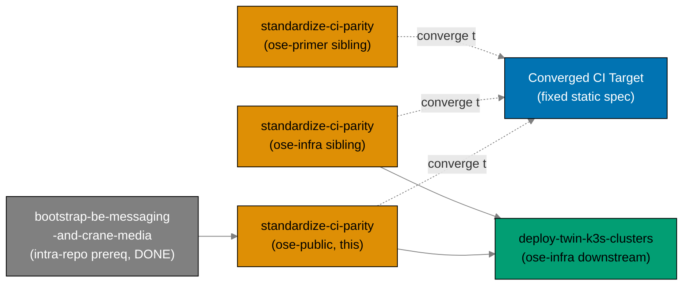

# Standardize CI Parity (ose-public)

> **Status**: In progress — authored 2026-06-11; re-baselined 2026-06-12. Execution not started.

## Context

`ose-public` and its two sibling repos — the private `ose-infra` and the public template
`ose-primer` — all run GitHub Actions CI, but the three pipelines have **drifted apart**. They use
different test-invocation semantics (`nx run-many` vs `nx affected`), different action major
versions, a different validator set, different lint-gate job names, and ose-public has no
concurrency-cancellation while the siblings do. The drift is not a deliberate design — it is the
accumulated residue of each repo evolving its CI independently.

This plan is **one of three sibling plans** (same slug, `standardize-ci-parity`, in each of
`ose-public`, `ose-infra`, `ose-primer`) that bring all three pipelines to a single, shared
**Converged CI Target**. That target is a **fixed, static specification** — best-of-breed union
across the three pipelines as of 2026-06-12 — so there is **no single anchor repo**: each repo
leads on some dimensions and trails on others. The genuine per-repo deviations (runner choice, the
language matrix, the self-hosted Docker prerequisites, the infra-only IaC lint job) are **recorded
in a deviation matrix** ([tech-docs.md § Deviation Matrix](./tech-docs.md#deviation-matrix)) rather
than silently tolerated.

ose-public is **already at target** on several dimensions — current action majors
(`actions/checkout@v6`, `setup-node@v6`, `setup-go@v6`, `setup-dotnet@v5`, `cache@v5`)
[Repo-grounded — `.github/workflows/pr-quality-gate.yml`], reusable workflows, and the
`naming` + `specs-gate` governance jobs — so those are _confirm-only_. Its own gaps (below) are a
focused set of five convergence changes plus governance alignment. The full per-repo convergence
status is in [tech-docs.md § Convergence status per repo](./tech-docs.md#convergence-status-per-repo-baseline-2026-06-12).

### Parallel-Safe Execution

The Converged CI Target is a **fixed spec, not a moving target produced by another plan**, so this
plan **depends on no other repo's plan**. All three sibling plans (`ose-public`, `ose-infra`,
`ose-primer`) may run **in parallel**, each in its own repo, each closing only its own gaps. There
is no inter-sibling-plan ordering.

Two ordering relationships exist but are **intra-repo or downstream-consumer**, NOT
inter-sibling-plan ordering:

- The `bootstrap-be-messaging-and-crane-media` prerequisite is an **intra-repo** (ose-public)
  dependency and is already **DONE** (archived `plans/done/2026-06-12__bootstrap-be-messaging-and-crane-media/`).
- The `deploy-twin-k3s-clusters` (ose-infra) plan is a **downstream consumer** of the converged CI,
  not a sibling of this standardization set.

### What this plan changes in ose-public

1. **PR-gate test semantics** — replace `nx run-many` with `nx affected` for the Go, F#/.NET, and
   Rust per-language jobs in `pr-quality-gate.yml` (the TypeScript job already uses `nx affected`)
   [Repo-grounded — the three per-language `run-many` jobs at lines ~133/149/165].
2. **Concurrency groups** — add the canonical concurrency block (no group exists today anywhere
   in ose-public) [Repo-grounded — `grep -L concurrency: .github/workflows/*`].
3. **Lint-gate job rename** — rename the category-named lint jobs `shell`/`dockerfile`/`actions`
   to the converged **tool-named** scheme `shellcheck`/`hadolint`/`actionlint` (primer's existing
   scheme), updating `quality-gate.needs` and the "CI job" column of
   `cross-language-lint-strictness.md`. Pure rename — same tools, same thresholds.
4. **Validator-set parity** — add a `validate:gherkin-keyword-cardinality` Nx target wrapping the
   already-shipped `rhino-cli repo-governance gherkin-keyword-cardinality` command and wire it into
   `validate-markdown.yml`.
5. **Governance alignment** — bring `repo-governance/development/infra/ci-conventions.md` back into
   sync with the converged standard and add a **CI Parity Checklist** section enumerating the
   parity invariants; assess whether `ci-checker` needs new parity checks.

## Dependency Position

This plan has **no inter-sibling-plan ordering** — it is parallel-safe with its two sibling plans
(see [Parallel-Safe Execution](#parallel-safe-execution)). It does have one **intra-repo** upstream
prerequisite and one **downstream consumer**; Phase 0's gate verifies the upstream prerequisite
landed before any work begins.

### Hard prerequisite (intra-repo, upstream) — must be DONE first

[`plans/done/2026-06-12__bootstrap-be-messaging-and-crane-media/`](../../done/2026-06-12__bootstrap-be-messaging-and-crane-media/README.md)
must be **complete** before this plan executes (now **DONE** — archived 2026-06-12). That plan adds the F#/.NET surface
(`apps/crane-be/` + `libs/fsharp-crane-core/`) and the affected-aware GHCR image-publish workflow
to ose-public CI. This plan standardizes the CI that **includes** that new .NET surface and publish
workflow, so it must come after. Phase 0's gate verifies the prerequisite landed: `apps/crane-be/`
exists, the GHCR publish workflow exists in `.github/workflows/`, and `.NET` language detection is
present in `pr-quality-gate.yml`.

### Downstream consumer

[`ose-infra/plans/in-progress/deploy-twin-k3s-clusters/`](../../../docs/reference/related-repositories.md)
(cited by path — the reader is not assumed to have access to the private `ose-infra` repo)
**depends on the converged CI being in place**. That infra plan deploys real images via the
self-hosted `ose-infra-runner` fleet; standardized, version-current, parity CI must be in place
first so the deployment runs against a known-good, converged pipeline. This is a downstream
consumer, **not** a sibling of this standardization set.

All three sibling plans converge **independently** to the fixed target (dashed arrows) — no arrow
runs between the sibling plans, reflecting that they are parallel-safe with no inter-plan ordering.

## Scope

### In Scope (ose-public delivery)

- **PR-gate `nx affected` convergence** — drop `nx run-many` from the Go, F#/.NET, and Rust jobs in
  `pr-quality-gate.yml`; all per-language PR-gate jobs use `nx affected` with the existing inline
  `NX_BASE`/`NX_HEAD` SHA mechanism.
- **Concurrency groups** — add the canonical concurrency block to the PR gate, the validator
  workflows (`validate-markdown.yml`, `validate-env.yml`), and the scheduled `test-and-deploy-*`
  workflows.
- **Lint-gate job rename** — rename `shell`/`dockerfile`/`actions` to the tool-named
  `shellcheck`/`hadolint`/`actionlint` scheme; update `quality-gate.needs` and the "CI job" column
  of `cross-language-lint-strictness.md`. Pure rename, no behavior change.
- **Validator-set parity** — create the `validate:gherkin-keyword-cardinality` Nx target in
  `apps/rhino-cli/project.json` and add it to `validate-markdown.yml` so ose-public runs the same
  validator set the siblings already run.
- **Governance alignment** — update `ci-conventions.md` to describe the converged standard, add a
  **CI Parity Checklist** section, and evaluate `ci-checker` agent parity-check additions.

### Out of Scope

- **Converging the runner target** — ose-public stays `ubuntu-latest`; ose-infra stays
  `[self-hosted, linux, ose-infra-runner]`. This is a recorded, accepted deviation (see
  [tech-docs.md § Deviation Matrix](./tech-docs.md#deviation-matrix)).
- **The siblings' own changes** — each sibling plan closes its own gaps in its own repo
  (e.g., ose-infra's `@v4` → current action bumps, reusable-workflow extraction, `infra-lint`
  split; ose-primer's `specs-gate` addition). Those belong to the sibling plans, not to this
  delivery checklist.
- **Adding a .NET surface to ose-infra** — ose-infra has no .NET projects; its language matrix
  legitimately differs by portfolio. Recorded, not changed.
- **New CI capabilities** beyond parity (new test levels, new deploy targets, Nx Cloud changes).

### Affected Areas (ose-public)

- `.github/workflows/pr-quality-gate.yml` (run-many → affected; concurrency; lint-job rename + `needs`)
- `.github/workflows/validate-markdown.yml` (gherkin validator; concurrency)
- `.github/workflows/validate-env.yml` (concurrency)
- `.github/workflows/test-and-deploy-*.yml` (concurrency on scheduled workflows)
- `apps/rhino-cli/project.json` (new `validate:gherkin-keyword-cardinality` target)
- `repo-governance/development/quality/cross-language-lint-strictness.md` (CI-job-name column update)
- `repo-governance/development/infra/ci-conventions.md` (converged standard + parity checklist)
- `.claude/agents/ci-checker.md` (parity-check additions, if warranted)

## Sibling Plans

This plan is one of **three** sibling plans applying the same CI standardization across the Open
Sharia Enterprise repository family. The plans converge **independently** to the **same fixed
Converged CI Target** ([tech-docs.md § Converged CI Target](./tech-docs.md#converged-ci-target-shared-across-the-three-repo-sibling-set));
there is **no single anchor**, and the plans are **parallel-safe** (no inter-plan ordering).
Per-repo deviations are recorded in
[tech-docs.md § Deviation Matrix](./tech-docs.md#deviation-matrix). Same slug in each repo:

| Repo                | Plan path                                           | Role in this set                                                                     |
| ------------------- | --------------------------------------------------- | ------------------------------------------------------------------------------------ |
| `ose-public` (this) | `plans/in-progress/standardize-ci-parity/README.md` | Sibling (TS + Rust + Go + F#/.NET; `ubuntu-latest` runners)                          |
| `ose-infra`         | `plans/in-progress/standardize-ci-parity/README.md` | Sibling (TS + Go + Rust; self-hosted `ose-infra-runner`; IaC + coralpolyp)           |
| `ose-primer`        | `plans/in-progress/standardize-ci-parity/README.md` | Sibling (full polyglot template; `ubuntu-latest` runners; reference lint-job scheme) |

## Current-State Divergences (the heart of this plan)

The full convergence-status table and the fixed converged target end-state live in
[tech-docs.md § Converged CI Target](./tech-docs.md#converged-ci-target-shared-across-the-three-repo-sibling-set).
Summary of the dimensions **this plan closes in ose-public** (other dimensions are already _done_
here, or are closed by a sibling plan in its own repo — there is no single anchor):

| Dimension                               | ose-public now                 | Converged target                        | Status in ose-public |
| --------------------------------------- | ------------------------------ | --------------------------------------- | -------------------- |
| Non-TS test invocation                  | `nx run-many`                  | `nx affected`                           | gap — this plan      |
| Concurrency groups                      | none                           | canonical pattern, cancel-in-progress   | gap — this plan      |
| Lint-gate job names                     | `shell`/`dockerfile`/`actions` | `shellcheck`/`hadolint`/`actionlint`    | gap — this plan      |
| `gherkin-keyword-cardinality` validator | absent in CI                   | present in `validate-markdown.yml`      | gap — this plan      |
| `ci-conventions.md` parity              | drifted, no checklist          | converged + CI Parity Checklist section | gap — this plan      |
| Action versions                         | already current (`@v6`)        | `@v6` majors                            | done — confirm only  |
| Runner target                           | `ubuntu-latest`                | `ubuntu-latest` (recorded deviation)    | deviation            |

## Plan Navigation

| Document                       | Contents                                                                                             |
| ------------------------------ | ---------------------------------------------------------------------------------------------------- |
| [README.md](./README.md)       | Context, parallel-safe execution, dependency position, scope, sibling set, navigation (this file)    |
| [brd.md](./brd.md)             | Business goal, rationale, affected roles, success criteria, risks                                    |
| [prd.md](./prd.md)             | Personas, user stories, Gherkin acceptance criteria, product scope                                   |
| [tech-docs.md](./tech-docs.md) | Converged CI target, convergence-status table, deviation matrix, SHA mechanism, action-version table |
| [delivery.md](./delivery.md)   | Phased delivery checklist (Phases 0–6) with `[AI]`/`[HUMAN]` markers and gates                       |

## Delivery Phases at a Glance

| Phase | Title                                                              | Mode |
| ----- | ------------------------------------------------------------------ | ---- |
| 0     | Environment Setup + Baseline + prerequisite verification           | AI   |
| 1     | PR-gate test semantics — `nx run-many` → `nx affected`             | AI   |
| 2     | Concurrency groups — canonical pattern across workflows            | AI   |
| 3     | Lint-gate job rename — `shell`/`dockerfile`/`actions` → tool-named | AI   |
| 4     | Validator-set parity — `validate:gherkin-keyword-cardinality`      | AI   |
| 5     | Governance — `ci-conventions.md` converged + CI Parity Checklist   | AI   |
| 6     | Final quality gate + commit + push + CI verify + archival          | AI   |

Each phase ends with a `### Phase N Gate` (must-pass checks before the next phase) and a **Pause
Safety** note describing the stable resumable state.

## Git Workflow

All work on `main` (Trunk Based Development) inside the declared worktree (see
[delivery.md § Worktree](./delivery.md#worktree)) — **worktree-to-main**, direct push to
`origin main`, **no PR**. Commits land per phase checkpoint, committed thematically (Conventional
Commits) and pushed at each phase gate. See
[Trunk Based Development Convention](../../../repo-governance/development/workflow/trunk-based-development.md).
