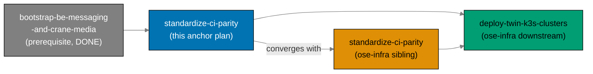

# Standardize CI Parity (ose-public anchor)

> **Status**: In progress — authored 2026-06-11. Execution not started.

## Context

`ose-public` and the private sibling `ose-infra` both run GitHub Actions CI, but the two
pipelines have **drifted apart**. They use different test-invocation semantics (`nx run-many`
vs `nx affected`), different action major versions, a different validator set, and ose-public
has no concurrency-cancellation while ose-infra does. The drift is not a deliberate design — it
is the accumulated residue of each repo evolving its CI independently.

This plan is the **anchor/reference** of a two-plan sibling set (same slug,
`standardize-ci-parity`, in each repo) that brings both pipelines to **full parity EXCEPT the
runner target**. The end-state converges; the genuine per-repo deviations (runner choice, the
.NET surface, the self-hosted Docker prerequisites) are **recorded in a deviation matrix**
([tech-docs.md § Deviation Matrix](./tech-docs.md#deviation-matrix)) rather than silently
tolerated.

ose-public is the reference because its workflows are **already on current action majors**
(`actions/checkout@v6`, `setup-node@v6`, `setup-go@v6`, `setup-dotnet@v5`, `cache@v5`)
[Repo-grounded — `.github/workflows/pr-quality-gate.yml`] and it already covers the richest
language portfolio (TypeScript + Go + F#/.NET + Rust). The version-bump work is therefore almost
entirely the **sibling** ose-infra plan's; this anchor plan's own delivery is a smaller, focused
set of four convergence changes plus governance alignment.

### What this anchor plan actually changes in ose-public

1. **PR-gate test semantics** — replace `nx run-many` with `nx affected` for the Go, .NET, and
   Rust per-language jobs in `pr-quality-gate.yml` (the TypeScript job already uses `nx affected`)
   [Repo-grounded — `pr-quality-gate.yml:93,109,125`].
2. **Concurrency groups** — add the canonical concurrency block (no group exists today anywhere
   in ose-public) [Repo-grounded — `grep -L concurrency: .github/workflows/*`].
3. **Validator-set parity** — add a `validate:gherkin-keyword-cardinality` Nx target wrapping the
   already-shipped `rhino-cli repo-governance gherkin-keyword-cardinality` command and wire it into
   `validate-markdown.yml`.
4. **Governance alignment** — bring `repo-governance/development/infra/ci-conventions.md` back into
   sync with the converged standard and add a **CI Parity Checklist** section enumerating the
   parity invariants; assess whether `ci-checker` needs new parity checks.

## Dependency Position

This plan sits between two other plans — one upstream, one downstream — and Phase 0's gate
verifies the upstream prerequisite landed before any work begins.

### Hard prerequisite (upstream) — must be DONE first

[`plans/in-progress/bootstrap-be-messaging-and-crane-media/`](../bootstrap-be-messaging-and-crane-media/README.md)
must be **complete** before this plan executes. That plan adds the F#/.NET surface
(`apps/crane-be/` + `libs/fsharp-crane-core/`) and the affected-aware GHCR image-publish workflow
to ose-public CI. This plan standardizes the CI that **includes** that new .NET surface and publish
workflow, so it must come after. Phase 0's gate verifies the prerequisite landed: `apps/crane-be/`
exists, the GHCR publish workflow exists in `.github/workflows/`, and `.NET` language detection is
present in `pr-quality-gate.yml`.

### Downstream consumer

[`ose-infra/plans/in-progress/deploy-twin-k3s-clusters/`](../../../docs/reference/related-repositories.md)
(cited by path — the reader is not assumed to have access to the private `ose-infra` repo)
**depends on this plan being done**. That infra plan deploys real images via the self-hosted
`ose-infra-runner` fleet; standardized, version-current, parity CI must be in place first so the
deployment runs against a known-good, converged pipeline.

## Scope

### In Scope (ose-public anchor delivery)

- **PR-gate `nx affected` convergence** — drop `nx run-many` from the Go, .NET, and Rust jobs in
  `pr-quality-gate.yml`; all per-language PR-gate jobs use `nx affected` with the existing inline
  `NX_BASE`/`NX_HEAD` SHA mechanism.
- **Concurrency groups** — add the canonical concurrency block to the PR gate, the validator
  workflows (`validate-markdown.yml`, `validate-env.yml`), and the scheduled `test-and-deploy-*`
  workflows.
- **Validator-set parity** — create the `validate:gherkin-keyword-cardinality` Nx target in
  `apps/rhino-cli/project.json` and add it to `validate-markdown.yml` so ose-public runs the same
  validator set ose-infra already runs.
- **Governance alignment** — update `ci-conventions.md` to describe the converged standard, add a
  **CI Parity Checklist** section, and evaluate `ci-checker` agent parity-check additions.

### Out of Scope

- **Converging the runner target** — ose-public stays `ubuntu-latest`; ose-infra stays
  `[self-hosted, linux, ose-infra-runner]`. This is a recorded, accepted deviation (see
  [tech-docs.md § Deviation Matrix](./tech-docs.md#deviation-matrix)).
- **ose-infra's own changes** — the action-version bumps (`@v4` → current), reusable-workflow
  adoption, concurrency-pattern alignment, and `nx affected` migration on the ose-infra side belong
  to the **sibling plan** in that repo, not to this delivery checklist.
- **Adding a .NET surface to ose-infra** — ose-infra has no .NET projects; its detection matrix
  legitimately differs by portfolio. Recorded, not changed.
- **New CI capabilities** beyond parity (new test levels, new deploy targets, Nx Cloud changes).

### Affected Areas (ose-public)

- `.github/workflows/pr-quality-gate.yml` (run-many → affected; concurrency)
- `.github/workflows/validate-markdown.yml` (gherkin validator; concurrency)
- `.github/workflows/validate-env.yml` (concurrency)
- `.github/workflows/test-and-deploy-*.yml` (concurrency on scheduled workflows)
- `apps/rhino-cli/project.json` (new `validate:gherkin-keyword-cardinality` target)
- `repo-governance/development/infra/ci-conventions.md` (converged standard + parity checklist)
- `.claude/agents/ci-checker.md` (parity-check additions, if warranted)

## Sibling Plans

This plan is one of **two** sibling plans applying the same CI standardization across the Open
Sharia Enterprise repository family. The plans converge to the **same end-state**; per-repo
deviations are recorded in [tech-docs.md § Deviation Matrix](./tech-docs.md#deviation-matrix).
Same slug in each repo:

| Repo                | Plan path                                           | Role in this set                                                           |
| ------------------- | --------------------------------------------------- | -------------------------------------------------------------------------- |
| `ose-public` (this) | `plans/in-progress/standardize-ci-parity/README.md` | Anchor / reference (TS + Rust + Go + F#/.NET; `ubuntu-latest` runners)     |
| `ose-infra`         | `plans/in-progress/standardize-ci-parity/README.md` | Sibling (TS + Go + Rust; self-hosted `ose-infra-runner`; IaC + coralpolyp) |

## Current-State Divergences (the heart of this plan)

The full divergence table with the converged target end-state lives in
[tech-docs.md § Current-State Divergences](./tech-docs.md#current-state-divergences). Summary of
the dimensions reconciled by **this anchor plan's own delivery** (the rest belong to the sibling):

| Dimension                               | ose-public now        | Target                                  | Owner     |
| --------------------------------------- | --------------------- | --------------------------------------- | --------- |
| Non-TS test invocation                  | `nx run-many`         | `nx affected`                           | This plan |
| Concurrency groups                      | none                  | canonical pattern, cancel-in-progress   | This plan |
| `gherkin-keyword-cardinality` validator | absent in CI          | present in `validate-markdown.yml`      | This plan |
| `ci-conventions.md` parity              | drifted, no checklist | converged + CI Parity Checklist section | This plan |
| Action versions                         | already current       | (no change — reference)                 | Sibling   |
| Runner target                           | `ubuntu-latest`       | `ubuntu-latest` (recorded deviation)    | Neither   |

## Plan Navigation

| Document                       | Contents                                                                                    |
| ------------------------------ | ------------------------------------------------------------------------------------------- |
| [README.md](./README.md)       | Context, dependency position, scope, sibling set, navigation (this file)                    |
| [brd.md](./brd.md)             | Business goal, rationale, affected roles, success criteria, risks                           |
| [prd.md](./prd.md)             | Personas, user stories, Gherkin acceptance criteria, product scope                          |
| [tech-docs.md](./tech-docs.md) | Divergence table, converged standard, deviation matrix, SHA mechanism, action-version table |
| [delivery.md](./delivery.md)   | Phased delivery checklist (Phases 0–5) with `[AI]`/`[HUMAN]` markers and gates              |

## Delivery Phases at a Glance

| Phase | Title                                                            | Mode |
| ----- | ---------------------------------------------------------------- | ---- |
| 0     | Environment Setup + Baseline + prerequisite verification         | AI   |
| 1     | PR-gate test semantics — `nx run-many` → `nx affected`           | AI   |
| 2     | Concurrency groups — canonical pattern across workflows          | AI   |
| 3     | Validator-set parity — `validate:gherkin-keyword-cardinality`    | AI   |
| 4     | Governance — `ci-conventions.md` converged + CI Parity Checklist | AI   |
| 5     | Final quality gate + commit + push + CI verify + archival        | AI   |

Each phase ends with a `### Phase N Gate` (must-pass checks before the next phase) and a **Pause
Safety** note describing the stable resumable state.

## Git Workflow

All work on `main` (Trunk Based Development) inside the declared worktree (see
[delivery.md § Worktree](./delivery.md#worktree)) — **worktree-to-main**, direct push to
`origin main`, **no PR**. Commits land per phase checkpoint, committed thematically (Conventional
Commits) and pushed at each phase gate. See
[Trunk Based Development Convention](../../../repo-governance/development/workflow/trunk-based-development.md).
