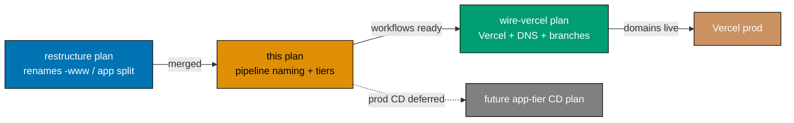

# Standardize GitHub Actions Pipeline Naming + Tiered Deploy + Env/Secret Injection

> **Status**: In progress — authored 2026-06-14. Execution not started.
> **Blocks**: [`wire-vercel-www-app-cutover`](../wire-vercel-www-app-cutover/README.md) — that plan's
> entire `.github/workflows` editing scope moves here; it shrinks to Vercel projects, DNS, GitHub
> Environment creation, branch creation, and non-workflow docs once this plan lands.

## Context

The CI surface under `.github/` grew organically and now mixes three incompatible filename styles:

- `test-and-deploy-{app}.yml` (www callers of the reusable workflow)
- `test-and-deploy-{app}-web-development.yml` + `test-{app}-web-staging.yml` +
  `deploy-{app}-web-to-production.yml` (the app-group trio)
- `pr-quality-gate.yml` / `validate-markdown.yml` / `validate-env.yml` / `publish-images.yml` /
  `test-crane-cli-integration.yml` (cross-cutting, ad-hoc)

Two problems compound the inconsistency:

1. **Stale post-restructure wiring.** The
   [`restructure-fsharp-be-and-web-app-tiers`](../../done/2026-06-14__restructure-fsharp-be-and-web-app-tiers/README.md)
   plan renamed the public-website projects to `-www` (e.g. `ose-web` → `ose-www`) and split
   OrganicLever into `organiclever-www` + `organiclever-app-web`. The www caller workflows were
   **not** updated: they still pass `app-name: ose-web` / `wahidyankf-web` (projects that no longer
   exist) and still push the old `prod-*-web` branches. They are currently broken / no-op.
2. **No legible pipeline model.** Reading a filename does not tell you which app it covers, what it
   tests, where it deploys, or whether it is a direct-to-prod or a gated promotion.

This plan fixes both by adopting one **domain-first** naming convention and restructuring the deploy
workflows into two explicit tiers.

## The naming convention

Every workflow filename reads:

```text
{domain}-{action-chain}.yml
```

- **`{domain}`** — the app or app-group the workflow serves (`organiclever-www`, `organiclever-app`,
  `ose-app`, `ose-www`, `ayokoding-www`, `wahidyankf-www`), **or** a cross-cutting domain keyword
  when the workflow is not tied to one app:
  - `commons-*` — repo-wide (quality gate, env validation, backend image publishing)
  - `markdown-*` — markdown-only, repo-general (mermaid/link/heading validation)
  - `docs-*` — documentation-specific (reserved; none today)
  - `{cli-name}-*` — a specific CLI (`crane-cli-*`)
- **`{action-chain}`** — ordered verbs + environment qualifiers describing what the workflow does, in
  sequence: `test-local-deploy-prod`, `test-local-deploy-stag`, `test-stag-deploy-prod`,
  `quality-gate`, `validate`, `publish-be-images`, `test-local`.
- **Reusable workflows** keep the `_reusable-` prefix (UI sorting) then follow the same scheme:
  `_reusable-{domain}-{action-chain}.yml`.
- **Composite actions** keep `setup-{tool}` — they configure a toolchain, not an app pipeline, and are
  explicitly exempt from the `{domain}-{action-chain}` rule.
- The existing rule that the `name:` field mirrors the filename (kebab-case derivation) is **retained**.

## The two deploy tiers

### www tier — direct deploy (4 sites)

Marketing/content sites deploy straight to production after a full local test pass:

```text
{site}-www-test-local-deploy-prod.yml   (CRON 2×/day → force-push prod-{site}-www)
```

Each is a thin caller of `_reusable-www-test-local-deploy.yml`.

### app tier — gated promotion (2 groups: organiclever-app, ose-app)

App groups (web + be together) promote through staging, with the prod CD step **deferred**:

```text
{group}-app-test-local-deploy-stag.yml   (CRON 2×/day → force-push stag-{group}-app-web + stag-{group}-be)
{group}-app-test-stag-deploy-prod.yml    (CRON 2×/day, +2.5h → e2e vs staging deployment; on pass it STOPS)
```

**"Deploy" means a branch force-push**, not a direct Vercel/cluster call. The local-deploy-stag run
force-pushes two branches: the web `stag-*-app-web` (Vercel builds it) **and** the backend
`stag-*-be`. That be-branch push fires a separate `{product}-be-build-deploy-stag.yml` workflow that
builds the GHCR image; the actual k3s rollout is orchestrated by ose-infra `coralpolyp`. The
test-stag run is offset **2.5 hours** after so Vercel + coralpolyp have finished rolling out.

The `-deploy-prod` suffix names the pipeline's eventual shape, but the prod-promotion step is
intentionally **not** implemented here — continuous delivery to production is a separate plan (see
[Out of scope](#out-of-scope)).

## Scope

### In scope

- **Author the naming convention** in `repo-governance/development/infra/github-actions-workflow-naming.md`
  (domain-first rule, `{domain}-{action-chain}` grammar, cross-cutting keyword list, reusable + action
  exemptions) and align `ci-conventions.md` (File Organisation + Naming tables + Invariant A).
- **Restructure the deploy workflows** into the two tiers above (13 entry-point workflows + 4
  reusables; 15 files today → 17 after), repointing every www caller to its renamed `-www` project and new `prod-*-www` branch,
  and every app-group workflow to the new `stag-*-app-web` / `stag-*-be` branches and renamed GitHub
  Environments. Deploy = branch force-push.
- **Add the backend container-build-deploy workflows** (`{product}-be-build-deploy-stag.yml`),
  refactoring `publish-images.yml` into a `_reusable-be-build-deploy.yml` triggered by the `stag-*-be`
  branch push; GHCR image hand-off to ose-infra `coralpolyp` for the cluster rollout.
- **Rename cross-cutting gate workflows** to the domain-keyword scheme (`commons-*`, `markdown-*`),
  including the full `pr-quality-gate` → `commons-quality-gate` rename **with a coordinated
  branch-protection update** (required status-check binding). The `{cli}-*` keyword stays in the
  convention as a forward-looking slot, but no CLI workflow ships in this PR (see below).
- **Scope = "service" workflows only (BE / FE / Web).** CLI-tool CI is out of scope this PR;
  `test-crane-cli-integration.yml` is **deleted** (crane-cli's pipeline is revisited in a later plan).
  Its removal is also the only thing that was running an integration suite on `pull_request`.
- **Keep heavy tests out of the fast feedback gates** — codify the invariant that
  `test:integration` and `test:e2e` run **only** in the scheduled tiered service pipelines
  (`*-test-local-*`, `*-test-stag-*`), **never** in the PR quality gate (`commons-quality-gate`),
  `.husky/pre-commit`, or `.husky/pre-push`. The PR gate / pre-commit / pre-push already run only
  `typecheck`/`lint`/`test:quick`/`specs:coverage`; deleting the crane-cli integration workflow removes
  the lone `pull_request` integration violation.
- **Create the missing `organiclever-www` pipeline** (caller + its `infra/dev/organiclever-www`
  local-test stack) and **split `organiclever-www-e2e`** into `-be-e2e` + `-fe-e2e` so the www
  reusable stays uniform.
- **Normalize `apps/` + `infra/` to the standard** (cleanup/rename in scope) — align every
  `apps/<app>/.env.example` to the injection variable classes (server vs `NEXT_PUBLIC_*` public vs
  out-of-template CI test-harness keys), keep `env-contract.yaml` in step, and rename the `infra/dev/`
  compose stacks to the `{group}` scheme so a stack folder reads as its pipeline domain (e.g.
  `infra/dev/organiclever` → `infra/dev/organiclever-app`; add `infra/dev/organiclever-www`). Update
  every `compose-dir` workflow input + doc reference to match.
- **Standardize tiered env/secret injection** — define one cross-platform injection standard so each
  app's canonical `apps/<app>/.env.example` key set is injected uniformly into GitHub Actions
  Environments (`vars.`/`secrets.` under `{group}-app-{tier}`), Vercel targets (Production for
  `prod-*`, Preview for `stag-*`), and the backend k3s/coralpolyp path, across **local / staging /
  production**. Add the value-less `env-injection.yaml` manifest (a CI test-harness key registry +
  per-app injection homes) and extend `commons-env-validate` with a static, value-free consistency
  check. This plan writes **references and the manifest only** — real values are wire-vercel /
  ose-infra `[HUMAN]` work. See [tech-docs](./tech-docs.md#tiered-env--secret-injection-standard).
- **Sweep every in-repo reference + all related governance `.md`/rules** — the renamed-file set
  (`.github/**/README.md`, `docs/reference/system-architecture/ci-cd.md`, `repo-governance/**`, the
  `wire-vercel-www-app-cutover` plan, agent definitions naming a workflow file) **and** the
  env-injection governance surface (`secrets-and-env-standards.md`, `env-contract.yaml`,
  `ci-conventions.md`, `reproducible-environments.md`, the `conventions/security/*` stubs +
  `conventions/README.md`). See the full list in
  [tech-docs](./tech-docs.md#docs--rules-this-introduces-or-amends).
- **Reduce `wire-vercel-www-app-cutover`** to Vercel/DNS/Environment/branch-creation + value
  population (working from the `env-injection.yaml` manifest) + non-workflow docs, pointing its
  workflow section at this plan.

### Out of scope

- **Continuous delivery to production for the app tier** — the actual `prod-*-app-web` / `prod-*-be`
  promotion (both web and backend). Deferred to a dedicated CD plan. This plan removes the existing
  dispatch-only `deploy-*-to-production.yml` workflows rather than rename them, because their behavior
  (a working prod push) belongs to that future plan, and the app-web Vercel prod projects do not exist
  yet anyway. The `*-be-build-deploy-prod.yml` variants are likewise deferred.
- **Vercel projects, DNS, GitHub Environment + secret creation, branch creation** — owned by
  `wire-vercel-www-app-cutover` (this plan references the new names; that plan brings them to life).
- **Real env/secret values** — this plan defines the injection standard, the GitHub Environment key
  registry, and the value-less `env-injection.yaml` manifest, but sets **no** values. Populating GitHub
  Environment `vars.`/`secrets.` and Vercel project env is `wire-vercel`'s `[HUMAN]` work; the backend
  k3s secret values are ose-infra `coralpolyp`'s.
- **Backend k8s rollout** — `organiclever-be` / `ose-be` ship as GHCR images built by the
  `*-be-build-deploy-stag` workflows; the actual k3s rollout is orchestrated by ose-infra `coralpolyp`.
  The `publish-images` trigger swap (main-push → branch-push) needs ose-infra coordination — see the
  [Cross-repo coordination](./tech-docs.md#cross-repo-coordination) note.

## Companion files

- [brd.md](./brd.md) — business rationale, impact, risks
- [prd.md](./prd.md) — personas, user stories, Gherkin acceptance criteria
- [tech-docs.md](./tech-docs.md) — full before/after inventory, per-workflow mechanics, deploy model, resolved decisions, rollback
- [delivery.md](./delivery.md) — phased, executor-tagged, TDD-shaped delivery checklist with gates

## Dependency position


