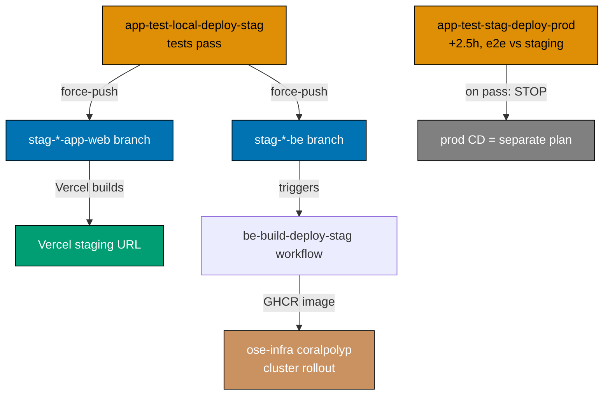

# Technical Documentation

Wiring architecture, the complete before→after inventory, per-workflow mechanics, resolved decisions,
and rollback for the GitHub Actions pipeline-naming + tiered-deploy restructure.

## Naming grammar (authoritative)

```text
[_reusable-]{domain}-{action-chain}.yml
```

| Token            | Allowed values                                                                                                                                                                                                        |
| ---------------- | --------------------------------------------------------------------------------------------------------------------------------------------------------------------------------------------------------------------- |
| `{domain}`       | App/group: `ose-www`, `ayokoding-www`, `organiclever-www`, `wahidyankf-www`, `organiclever-app`, `ose-app`, `organiclever-be`, `ose-be`. Cross-cutting: `commons`, `markdown`, `docs`, `crane-cli` (any `{cli-name}`) |
| `{action-chain}` | Ordered verbs + env qualifiers: `test`, `local`, `stag`, `prod`, `deploy`, `build`, `quality-gate`, `validate`, `env-validate` — joined with `-`                                                                      |
| `_reusable-`     | Prefix for `workflow_call` reusables only                                                                                                                                                                             |

**Verb/qualifier vocabulary** (compose left-to-right in execution order):

- `test-local` — run tests against a locally-spun stack (docker-compose: integration + e2e)
- `test-stag` — run e2e against the deployed **staging** environment (no docker-compose)
- `deploy-stag` / `deploy-prod` — **`git push --force` to the `stag-*` / `prod-*` branch.** That branch
  push is the deploy trigger: Vercel builds from it for web projects; a container-build-deploy workflow
  fires from it for backends (below).
- `build-deploy-stag` / `build-deploy-prod` — for non-Vercel backends: build the container image, push
  it to GHCR, and hand the cluster rollout to ose-infra `coralpolyp`.

Composite actions (`.github/actions/setup-*`) and the `name:`-mirrors-filename rule are unchanged.

## Deploy model (what "deploy" means here)

"Deploy" in every workflow name is a **branch force-push**, never a direct cluster/Vercel call:



- **Web** (Vercel): the branch push is the whole deploy — Vercel listens to `stag-*`/`prod-*` and
  builds. This plan only pushes the branch.
- **Backend** (non-Vercel): the app-tier deploy also force-pushes the `stag-*-be` branch. A separate
  `{product}-be-build-deploy-stag.yml` (triggered **on push** to that be branch) builds + pushes the
  GHCR image. The actual k3s rollout is orchestrated by ose-infra `coralpolyp` — out of this repo.

## Complete before → after inventory

### Reusable workflows

| Before                          | After                                      | Change                                                                                                                     |
| ------------------------------- | ------------------------------------------ | -------------------------------------------------------------------------------------------------------------------------- |
| `_reusable-test-and-deploy.yml` | `_reusable-www-test-local-deploy.yml`      | Rename; uniform `be-e2e`+`fe-e2e` runner pair (see www mechanics)                                                          |
| _(none)_                        | `_reusable-app-test-local-deploy-stag.yml` | **New** — factor the be+fe integration/e2e + dual-branch deploy job graph out of the two app dev workflows                 |
| _(none)_                        | `_reusable-app-test-stag.yml`              | **New** — factor the staging-e2e job out of the two staging workflows                                                      |
| _(none)_                        | `_reusable-be-build-deploy.yml`            | **New** — factor the GHCR build+push logic out of `publish-images.yml` (inputs: `be-project`, `image-name`, `environment`) |

### www tier — direct deploy (callers of `_reusable-www-test-local-deploy.yml`)

| Before                               | After                                         | Branch (after)          | Notes                                                         |
| ------------------------------------ | --------------------------------------------- | ----------------------- | ------------------------------------------------------------- |
| `test-and-deploy-ose-web.yml`        | `ose-www-test-local-deploy-prod.yml`          | `prod-ose-www`          | Fix stale `app-name: ose-web` → `ose-www`                     |
| `test-and-deploy-ayokoding-web.yml`  | `ayokoding-www-test-local-deploy-prod.yml`    | `prod-ayokoding-www`    | `app-name: ayokoding-web` → `ayokoding-www`                   |
| `test-and-deploy-wahidyankf-web.yml` | `wahidyankf-www-test-local-deploy-prod.yml`   | `prod-wahidyankf-www`   | `app-name: wahidyankf-web` → `wahidyankf-www`; fe-e2e only    |
| _(none — missing)_                   | `organiclever-www-test-local-deploy-prod.yml` | `prod-organiclever-www` | **New** caller + new `infra/dev/organiclever-www` local stack |

### app tier — gated promotion (deploy = force-push web **and** be stag branches)

| Before                                             | After                                         | Force-pushes (after)                                 | Notes                                                                          |
| -------------------------------------------------- | --------------------------------------------- | ---------------------------------------------------- | ------------------------------------------------------------------------------ |
| `test-and-deploy-organiclever-web-development.yml` | `organiclever-app-test-local-deploy-stag.yml` | `stag-organiclever-app-web` + `stag-organiclever-be` | Calls `_reusable-app-test-local-deploy-stag.yml`; env `organiclever-app-local` |
| `test-organiclever-web-staging.yml`                | `organiclever-app-test-stag-deploy-prod.yml`  | _(nothing — stops on pass)_                          | Folds the staging-e2e gate; env `organiclever-app-staging`; prod push deferred |
| `deploy-organiclever-web-to-production.yml`        | **removed**                                   | —                                                    | Prod CD deferred to a separate plan                                            |
| `test-and-deploy-ose-app-web-development.yml`      | `ose-app-test-local-deploy-stag.yml`          | `stag-ose-app-web` + `stag-ose-be`                   | Calls `_reusable-app-test-local-deploy-stag.yml`; env `ose-app-local`          |
| `test-ose-app-web-staging.yml`                     | `ose-app-test-stag-deploy-prod.yml`           | _(nothing — stops on pass)_                          | env `ose-app-staging`                                                          |
| `deploy-ose-app-web-to-production.yml`             | **removed**                                   | —                                                    | Prod CD deferred                                                               |

### backend container build+deploy (triggered on push to `stag-*-be`)

| Before               | After                                   | Trigger                     | Notes                                                                  |
| -------------------- | --------------------------------------- | --------------------------- | ---------------------------------------------------------------------- |
| `publish-images.yml` | `organiclever-be-build-deploy-stag.yml` | push `stag-organiclever-be` | Calls `_reusable-be-build-deploy.yml`; GHCR image → coralpolyp rollout |
| `publish-images.yml` | `ose-be-build-deploy-stag.yml`          | push `stag-ose-be`          | Calls `_reusable-be-build-deploy.yml`; GHCR image → coralpolyp rollout |

`publish-images.yml`'s old trigger was **push to `main`** (build affected be images continuously). The
new model is **gated**: images build only when a tested commit reaches a `stag-*-be` branch. This trigger
swap is **cross-repo** — ose-infra `coralpolyp` must watch the new branch-triggered images, not the
old main-push `:latest`. See [Cross-repo coordination](#cross-repo-coordination). Prod be
build-deploy (`*-be-build-deploy-prod.yml`, push `prod-*-be`) is deferred to the app-tier CD plan,
symmetric with web prod.

### Cross-cutting workflows

| Before                           | After                      | Domain      | Notes                                                         |
| -------------------------------- | -------------------------- | ----------- | ------------------------------------------------------------- |
| `pr-quality-gate.yml`            | `commons-quality-gate.yml` | `commons`   | Full rename incl. `name:`; **branch protection updated** (D1) |
| `validate-env.yml`               | `commons-env-validate.yml` | `commons`   | Repo-wide `.env.example` contract validation                  |
| `validate-markdown.yml`          | `markdown-validate.yml`    | `markdown`  | Mermaid + link + heading-hierarchy validation                 |
| `test-crane-cli-integration.yml` | `crane-cli-test-local.yml` | `crane-cli` | OCR integration tests on `apps/crane-cli/**`                  |

Net: **16 files today → 18 after** (4 reusables, 4 www, 4 app, 2 be-build-deploy, 4 cross-cutting),
minus the 2 removed prod-dispatch workflows and the absorbed `publish-images.yml`, plus the new
`infra/dev/organiclever-www/` compose stack and the `organiclever-www-e2e` → `-be-e2e`/`-fe-e2e` split.

## Per-tier mechanics

### www `_reusable-www-test-local-deploy.yml`

Inputs: `app-name`, `prod-branch`, `health-url`, `health-timeout`. Job graph: `lint` → `unit` →
`specs-coverage` → `integration` → `e2e` (docker-compose `infra/dev/{app-name}`, runs
`{app-name}-be-e2e` then `{app-name}-fe-e2e`) → `specs-gate` → `detect-changes` → `deploy`
(force-push `prod-branch` when `apps/{app-name}/` changed).

**Uniform runner pair (Decision 3 — split).** The reusable assumes every www site exposes the
`{app-name}-be-e2e` + `{app-name}-fe-e2e` pair. To keep it uniform, `organiclever-www-e2e` is **split**
into `organiclever-www-be-e2e` + `organiclever-www-fe-e2e` (Nx project split). Sites without a backend
(`wahidyankf-www`) keep only `-fe-e2e`; the reusable's be-e2e step tolerates absence (`|| true`).

| Site               | E2E runners (after)                              | `infra/dev` stack | Action                                                         |
| ------------------ | ------------------------------------------------ | ----------------- | -------------------------------------------------------------- |
| `ose-www`          | `ose-www-be-e2e`, `ose-www-fe-e2e`               | exists            | repoint app-name only                                          |
| `ayokoding-www`    | `ayokoding-www-be-e2e`, `-fe-e2e`                | exists            | repoint app-name only                                          |
| `wahidyankf-www`   | `wahidyankf-www-fe-e2e` (fe only)                | exists            | repoint; be-e2e tolerated absent                               |
| `organiclever-www` | `organiclever-www-be-e2e`, `-fe-e2e` (**split**) | **create**        | split the runner; create `infra/dev/organiclever-www/` compose |

### app `_reusable-app-test-local-deploy-stag.yml`

Inputs: `web-project`, `be-project`, `contracts-project`, `compose-dir`, `stag-web-branch`,
`stag-be-branch`, `be-port`, `web-port`, `environment`. Job graph: `specs-coverage` → `fe-lint` →
`be-integration` (docker-compose) → `fe-integration` → `e2e` (full stack via `compose-dir`, be-e2e +
fe-e2e) → `specs-gate` → `deploy` (force-push **both** `stag-web-branch` and `stag-be-branch`). The
web push triggers Vercel; the be push triggers `{product}-be-build-deploy-stag.yml`.

### app `_reusable-app-test-stag.yml`

Inputs: `fe-e2e-project`, `environment`, `web-base-url-var`. Job `e2e-staging` — run
`{fe-e2e-project}:test:e2e` against `${{ vars.WEB_BASE_URL }}` with the Vercel bypass secret and
`PLAYWRIGHT_GREP_INVERT: "@local-fullstack"`. On pass it **stops**; no promote job (prod CD deferred).

### be `_reusable-be-build-deploy.yml`

Inputs: `be-project`, `image-name` (e.g. `ghcr.io/wahidyankf/organiclever-be`), `environment`. Job:
codegen → docker login → `docker build -f apps/{be-project}/Dockerfile` → push `:latest` + `:${sha}`.
Lifted verbatim from `publish-images.yml`'s per-be job. coralpolyp (ose-infra) consumes the pushed
image; rollout is out of scope here.

## CRON schedule (staggered, 2× WIB daily; 2.5 h staging→prod gap)

The prod-side run depends on the staging deploy from the local-deploy-stag run being **live** (Vercel
build + coralpolyp rollout). A **2.5-hour gap** guarantees both have settled.

| Pipeline                       | WIB           | UTC           | Rationale                                                        |
| ------------------------------ | ------------- | ------------- | ---------------------------------------------------------------- |
| `*-app-test-local-deploy-stag` | 03:00 / 15:00 | 20:00 / 08:00 | Earliest — produces the staging deploy the later run verifies    |
| `*-app-test-stag-deploy-prod`  | 05:30 / 17:30 | 22:30 / 10:30 | **+2.5 h** after staging, so Vercel + coralpolyp have rolled out |
| `*-www-test-local-deploy-prod` | 06:00 / 18:00 | 23:00 / 11:00 | Independent of the app tier (direct to prod)                     |

`*-be-build-deploy-stag` is **not** scheduled — it fires on the `stag-*-be` branch push from the
local-deploy-stag deploy job.

## GitHub Environments + branches (referenced here, created by wire-vercel)

**Three stages only — `local`, `staging`, `production`. There is no `development`.** The old
`*-development` environments are renamed to `*-local` (the local-test phase runs entirely on
docker-compose, so this env carries only local-CI secrets — drop the `environment:` key if it ends up
empty). `production` environments are gone with the removed prod-dispatch workflows (prod CD = separate
plan).

| Before (per workflow)          | After                                 | Holds                                             |
| ------------------------------ | ------------------------------------- | ------------------------------------------------- |
| `organiclever-web-development` | `organiclever-app-local`              | local-CI secrets only (or omit if empty)          |
| `organiclever-web-staging`     | `organiclever-app-staging`            | `WEB_BASE_URL`, `VERCEL_AUTOMATION_BYPASS_SECRET` |
| `organiclever-web-production`  | _(removed with the prod-dispatch wf)_ | —                                                 |
| `ose-app-web-development`      | `ose-app-local`                       | local-CI secrets only (or omit if empty)          |
| `ose-app-web-staging`          | `ose-app-staging`                     | staging vars/secrets                              |

**Branches this plan's workflows push** (created by wire-vercel; until then a push fails loudly):

- Web prod: `prod-ose-www`, `prod-ayokoding-www`, `prod-organiclever-www`, `prod-wahidyankf-www`
- App-web staging: `stag-organiclever-app-web`, `stag-ose-app-web`
- Backend staging: `stag-organiclever-be`, `stag-ose-be`
- Deferred to the CD plan: `prod-*-app-web`, `prod-*-be`

This plan writes only the **references**. Creating Environments/branches and setting secret **values**
is a `wire-vercel-www-app-cutover` `[HUMAN]` step. Staging URLs/secrets are never committed —
placeholder/secret only.

## Resolved decisions

1. **PR quality gate — full rename, branch protection updated.** Rename file **and** `name:` to
   `commons-quality-gate`. Because `main` branch protection requires the status check derived from it,
   delivery includes a `[HUMAN]` step to update the required-status-check binding in the **same** window
   so pushes to `main` stay gated. (User confirmed: "we will update the branch protection.")
2. **App-tier be deploy — force-push the be branch + separate build-deploy.** The deploy job force-pushes
   `stag-*-be`; `{product}-be-build-deploy-stag.yml` builds the image on that push; coralpolyp rolls it
   out. (User confirmed.)
3. **`organiclever-www` e2e — split the runner.** Split `organiclever-www-e2e` into
   `organiclever-www-be-e2e` + `organiclever-www-fe-e2e` so the www reusable stays uniform. (User
   confirmed: "split it. it will make it easier.")

## Cross-repo coordination

The `publish-images` trigger swap (main-push → `stag-*-be` branch push) changes when/what images
appear in GHCR. **ose-infra `coralpolyp` must be updated to watch the branch-triggered images** before
this repo stops the main-push publish, or staging backend rollout will silently stall. Track this as a
hand-off to the ose-infra owner; do **not** remove `publish-images` behavior until coralpolyp confirms
the new source. Until then, a transitional option is to keep both triggers briefly (documented in
delivery Phase 5).

## Rollback

Every change is a file rename + content edit on `main`; git history retains the originals. To roll
back: `git revert` the commit range, or restore individual files via `git checkout <sha>~1 -- <path>`.
No Vercel/branch/Environment wiring is brought live by this plan (only YAML that _references_ names the
cutover plan will create), so reverting cannot break a live deployment — the worst case is the scheduled
workflows resume their pre-plan (already-stale) behavior. The new branches do not exist until wire-vercel
creates them, so a half-applied state simply means a scheduled run fails its `git push` to a missing
branch (loud, non-destructive).
