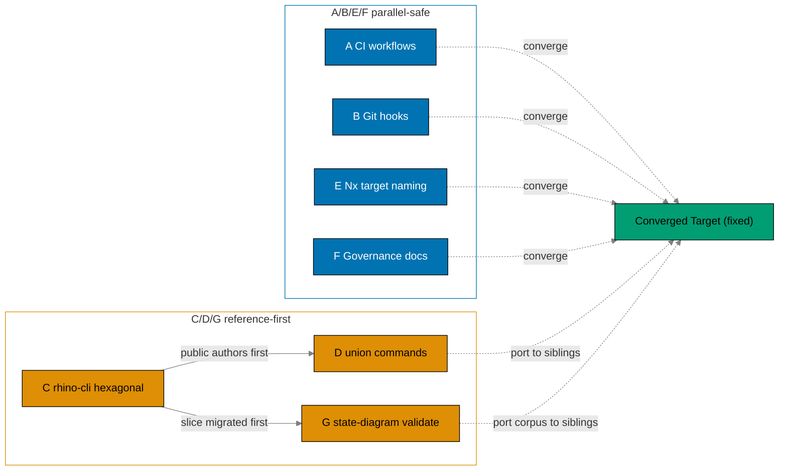
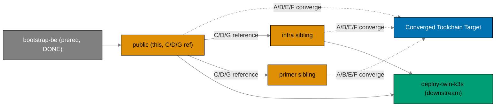

# Standardize Repo Toolchain Parity (ose-public)

> **Status**: In progress — authored 2026-06-11 as `standardize-ci-parity`; rescoped and renamed
> `standardize-repo-toolchain-parity` 2026-06-12. Execution not started.

## Context

`ose-public` and its two sibling repos — the private `ose-infra` and the public template
`ose-primer` — share a **repository toolchain** (GitHub Actions CI, git hooks, the `rhino-cli`
management CLI, and the governing docs) that has **drifted apart**. The three toolchains differ in
CI test semantics, action versions, concurrency, lint-gate naming, validator sets, hook lifecycles,
the rhino-cli architecture, the rhino-cli command surface, and Nx target naming. The drift is not a
deliberate design — it is the accumulated residue of three repos evolving independently.

This plan is **one of three sibling plans** (same slug, `standardize-repo-toolchain-parity`, in each
of `ose-public`, `ose-infra`, `ose-primer`) that bring the **entire toolchain** to a single shared
**Converged Toolchain Target**. The target is a **fixed, static specification** — best-of-breed union
across the three toolchains as of 2026-06-12. **Two** standalone plans have been **folded into this
set**: the primer-only `migrate-rhino-cli-to-hexagonal` plan (its hexagonal-architecture design is
salvaged into this plan's rhino-cli workstream) and the three-repo
`mermaid-state-diagram-validation` plan (its state-diagram parsing + golden corpus design becomes
workstream G, riding the migrated Mermaid hexagonal slice); both standalone plans are deleted as
part of the fold.

The work is organized into **seven workstreams (A–G)**:

| Workstream                           | Scope                                                                                                                                                                                                                         | Anchor model                                        |
| ------------------------------------ | ----------------------------------------------------------------------------------------------------------------------------------------------------------------------------------------------------------------------------- | --------------------------------------------------- |
| A — CI workflows                     | action majors, `nx affected`, Go-strip (ose-public), workflow file/`name:`/job-id naming, concurrency, tool-named lint jobs, gherkin target, full gate on push-to-main, scheduler cadence                                     | No single anchor (parallel-safe)                    |
| B — Git hooks                        | canonical commit-msg / pre-commit / pre-push lifecycle                                                                                                                                                                        | No single anchor (parallel-safe)                    |
| C — rhino-cli architecture           | flat layout → hexagonal (domain/application/infrastructure/commands)                                                                                                                                                          | **`ose-public` is the reference** (authors first)   |
| D — rhino-cli command surface        | union superset + **scope-based regroup** (`docs`→`md`, `agents`→`harness`, `java`→`lang`; fold `spec-coverage`/`ddd`/`contracts`/`gherkin`→`specs`; new `convention` group) + uniform grammar; public ports JVM/contract cmds | **`ose-public` is the reference** for its additions |
| E — Nx target naming                 | `{domain}:{work}` rename + `spec-coverage`→`specs:coverage`                                                                                                                                                                   | No single anchor (parallel-safe)                    |
| F — Governance docs                  | converged conventions + repo-rules quality gate                                                                                                                                                                               | No single anchor (parallel-safe)                    |
| G — Mermaid state-diagram validation | `state.rs` front-end + width/label rules + shared golden corpus + repo-wide cleanup                                                                                                                                           | **`ose-public` is the reference** (depends on C)    |

There is **no single anchor repo** for A/B/E/F — each repo leads on some dimensions and trails on
others, and the genuine per-repo deviations (runner choice, language matrix, self-hosted Docker, the
infra-only IaC surface) are **recorded in a deviation matrix**
([tech-docs.md § Deviation Matrix](./tech-docs.md#deviation-matrix)) rather than silently tolerated.
For **C/D/G the convergence is reference-first**: `ose-public` migrates/authors first, then `ose-infra`
and `ose-primer` port the identical crate structure, command surface, and state-diagram golden corpus.
**G depends on C** — the Mermaid feature is migrated into its hexagonal slice (workstream C, Phase 7)
before state-diagram support is added to it (workstream G, Phase 8).

The diagram below maps the seven workstreams to their anchor model — A/B/E/F converge independently to
the fixed target (parallel-safe), while C/D/G are serialized reference-first (public authors, siblings
port; G follows C):

ose-public is **already at target** on several A/B/F dimensions — current action majors, reusable
workflows, the `naming` + `specs-gate` governance jobs, and `cross-language-lint-strictness.md`
already exists — so those are _confirm-only_. The full per-repo convergence status is in
[tech-docs.md § Convergence status per repo](./tech-docs.md#convergence-status-per-repo-baseline-2026-06-12).

### Parallel-Safe Execution

The Converged Toolchain Target is a **fixed spec, not a moving target produced by another plan**, so
workstreams **A, B, E, F are parallel-safe** across all three sibling plans — each runs in its own
repo, closing only its own gaps, with no inter-sibling-plan ordering.

**The exception is C/D/G (reference-first)**: `ose-public` authors the hexagonal migration (C), its
union-command additions (D), and the state-diagram parser + golden corpus (G) **first**; `ose-infra`
and `ose-primer` port from `ose-public`. So each sibling plan's C/D/G phases depend on `ose-public`'s
C/D/G being done; everything else (A/B/E/F) runs independently and in parallel. **G depends on C**
within every repo — the Mermaid feature is migrated into its hexagonal slice (Phase 7) before
state-diagram support is added (Phase 8). Within `ose-public` itself, C/D/G are the longest-lead
workstreams and gate the siblings — there is no upstream dependency _into_ `ose-public` for them.

Two further ordering relationships are **intra-repo or downstream-consumer**, NOT inter-sibling-plan
ordering:

- The `bootstrap-be-messaging-and-crane-media` prerequisite is an **intra-repo** (ose-public)
  dependency and is already **DONE** (archived
  `plans/done/2026-06-12__bootstrap-be-messaging-and-crane-media/`).
- The `deploy-twin-k3s-clusters` (ose-infra) plan is a **downstream consumer** of the converged
  toolchain, not a sibling of this standardization set.

### What this plan changes in ose-public

1. **CI (A)** — `run-many`→`nx affected` (.NET/Rust jobs); **strip Go** (ose-public has no Go code —
   the `golang` job, `setup-golang`, and `has-golang` detection are removed); workflow file/`name:`/
   job-id naming brought onto the canonical BLOCK 1-A scheme (the `Quality gate` required-check name is
   kept; any required-check rename is paired with a `[HUMAN]` branch-protection update); canonical
   concurrency on every workflow; lint jobs `shell`/`dockerfile`/`actions`→`shellcheck`/`hadolint`/
   `actionlint`; new `specs:gherkin-cardinality-validation` target wired into the `specs-gate` job;
   the **full quality gate also running on `push` to `main`**; scheduler cadence confirm/align 2× WIB.
   ose-public **keeps** its `publish-images.yml` → GHCR workflow (a recorded deviation — ose-primer
   carries none).
2. **Hooks (B)** — converge `commit-msg`/`pre-commit`/`pre-push` to the canonical BLOCK 1-B lifecycle
   and the renamed targets.
3. **rhino-cli architecture (C — REFERENCE)** — migrate the flat `src/commands/` + `src/internal/`
   layout to the hexagonal `domain`/`application`/`infrastructure`/`commands` layout, behavior-frozen
   by a golden-master CLI suite. ose-public authors this in full; siblings port from it.
4. **rhino-cli commands (D — REFERENCE for its additions)** — rationalize + **regroup by scope** (group
   = the scope it operates on: `docs`→`md`, `agents`→`harness`, `java`→`lang`; fold `spec-coverage`/
   `ddd`/`contracts`/`gherkin`→`specs`; new `convention` group; `docs` reserved), apply the **uniform
   grammar** (`<group> [<language>] <verb> [<object>]` — every check `validate`, `audit`=group run-all),
   and port the JVM/contract commands (`lang java validate null-safety-annotations`, `specs clean
java-imports`/`scaffold dart`) so the CLI surface is the regrouped union superset.
5. **Target naming (E)** — rename every governance/validation/lint/check target to `{domain}:{work}`
   and `spec-coverage`→`specs:coverage` repo-wide, updating every caller (hooks, workflows,
   `package.json`).
6. **Governance (F)** — update all related docs, run `repo-rules-maker`, then run the
   `repo-rules-quality-gate` workflow until clean (a hard gate before done).
7. **Mermaid state-diagram validation (G — REFERENCE)** — add the `state.rs` front-end to the
   migrated Mermaid hexagonal slice so `stateDiagram-v2`/`stateDiagram` (v1) obey the width (≤4
   nodes/rank) and label (≤30 chars, state AND transition labels) rules; land the shared golden
   corpus; aggressively clean up every violating state diagram repo-wide (incl. `plans/done/`).
   ose-public authors the corpus; siblings mirror it. Depends on the Phase 7 Mermaid slice.

## Dependency Position

For workstreams **A/B/E/F** this plan has **no inter-sibling-plan ordering**. For **C/D/G** this plan
is the **reference** the siblings depend on — `ose-public` goes first; nothing blocks `ose-public`'s
C/D/G. The plan has one **intra-repo** upstream prerequisite (now DONE) and one **downstream consumer**.
Two formerly-standalone plans are now **folded in**: `migrate-rhino-cli-to-hexagonal` (its hexagonal
design is salvaged into workstream C) and `mermaid-state-diagram-validation` (its state-diagram
parser + golden corpus become workstream G, riding the migrated Mermaid slice); both standalone plans
are deleted as part of the fold.

### Hard prerequisite (intra-repo, upstream) — must be DONE first

[`plans/done/2026-06-12__bootstrap-be-messaging-and-crane-media/`](../../done/2026-06-12__bootstrap-be-messaging-and-crane-media/README.md)
must be **complete** before this plan executes (now **DONE** — archived 2026-06-12). That plan adds
the F#/.NET surface (`apps/crane-be/` + `libs/fsharp-crane-core/`) and the affected-aware GHCR
image-publish workflow to ose-public CI. This plan standardizes the toolchain that **includes** that
new .NET surface, so it must come after. Phase 0's gate verifies the prerequisite landed.

### Downstream consumer

[`ose-infra/plans/in-progress/deploy-twin-k3s-clusters/`](../../../docs/reference/related-repositories.md)
(cited by path — the reader is not assumed to have access to the private `ose-infra` repo) **depends
on the converged toolchain being in place**. That infra plan deploys real images via the self-hosted
`ose-infra-runner` fleet; a standardized, version-current, parity toolchain must be in place first.
This is a downstream consumer, **not** a sibling of this standardization set.

A/B/E/F converge **independently** to the fixed target (dashed arrows); C/D/G flow **from `ose-public`
to the siblings** (solid reference arrows), reflecting the reference-first model.

## Scope

### In Scope (ose-public delivery)

- **A — CI**: `nx affected` convergence; canonical concurrency on every workflow; lint-gate job
  rename; `specs:gherkin-cardinality-validation` target + CI wiring (`specs-gate`); full quality gate
  on `push` to `main`; scheduler cadence confirm/align.
- **B — Hooks**: converge `commit-msg`/`pre-commit`/`pre-push` to BLOCK 1-B canonical (pre-commit
  gains `test:quick` = format+lint+typecheck+test:unit; pre-push = `specs:coverage`+`test-coverage`).
- **H — Test Lifecycle Architecture**: three-level testing (unit/integration/e2e) all sharing the same
  `.feature` files; `test:unit` mocked at pre-commit; **`test:integration`+`test:e2e` CRON-only** (heavy)
  per app-group (2× WIB public+infra); `specs:coverage` enforces all scenarios across all three levels;
  heavy-test workflows `test-and-deploy-{app-group}-development.yml` + `test-{app-group}-staging.yml`;
  prod deploy manual.
- **C — rhino-cli architecture (REFERENCE)**: full hexagonal migration, golden-master-frozen.
- **D — rhino-cli commands (REFERENCE for additions)**: rationalize + scope-based regroup
  (`docs`→`md`, `agents`→`harness`, `java`→`lang`; fold `spec-coverage`/`ddd`/`contracts`/`gherkin`→
  `specs`; new `convention`; `docs` reserved) + uniform grammar; port JVM/contract cmds → `lang` +
  `specs`.
- **E — Target naming**: `{domain}:{work}` rename + `spec-coverage`→`specs:coverage` repo-wide + all
  callers.
- **F — Governance**: update all BLOCK 6 docs; `repo-rules-maker`; `repo-rules-quality-gate` until
  clean.
- **G — Mermaid state-diagram validation (REFERENCE)**: `state.rs` front-end on the migrated Mermaid
  slice; width + label rules for state diagrams; shared golden corpus; aggressive repo-wide cleanup
  (incl. `plans/done/`); `diagrams.md` + `markdown.md`/`repository-validation.md` doc updates.

### Out of Scope

- **Converging the runner target** — ose-public stays `ubuntu-latest`. Recorded deviation.
- **The siblings' own changes** — each sibling plan closes its own gaps in its own repo
  (ose-infra's `@v4`→current bumps, reusable-workflow extraction, `infra-lint` split; ose-primer's
  `specs-gate` + `specs` structural reference additions). The siblings' **C/D/G port** from ose-public's
  reference (crate structure, command surface, state-diagram golden corpus), executed in their own
  repos.
- **Adding a JVM/.NET surface to ose-infra** — language matrix differs by portfolio. Recorded.
- **New toolchain capabilities** beyond parity (new test levels, deploy targets, Nx Cloud changes).

### Affected Areas (ose-public)

- `.github/workflows/pr-quality-gate.yml`, `validate-markdown.yml`, `validate-env.yml`,
  `test-and-deploy-*.yml`
- `.husky/commit-msg`, `.husky/pre-commit`, `.husky/pre-push`
- `apps/rhino-cli/src/{domain,application,infrastructure,commands}/` and `apps/rhino-cli/project.json`
- `apps/rhino-cli/src/domain/mermaid/state.rs` (new) + `apps/rhino-cli/tests/` (state golden corpus)
- every app/lib `project.json` (`spec-coverage`→`specs:coverage`); `package.json` callers
- all governance docs in [tech-docs.md § File Impact](./tech-docs.md#file-impact) (incl.
  `diagrams.md`, `markdown.md`/`repository-validation.md` for the state-diagram rule)
- repo-wide `*.md` violating state diagrams (incl. `plans/done/`, gate-excluded paths) — D-CLEAN
- `.claude/agents/ci-checker.md`, `repo-rules-*` (if warranted)

## Sibling Plans

This plan is one of **three** sibling plans applying the same toolchain standardization across the
Open Sharia Enterprise repository family. A/B/E/F converge **independently** to the same fixed
**Converged Toolchain Target**
([tech-docs.md § Converged Toolchain Target](./tech-docs.md#converged-toolchain-target-shared-across-the-three-repo-sibling-set));
C/D/G are **reference-first** (ose-public leads). Per-repo deviations are recorded in
[tech-docs.md § Deviation Matrix](./tech-docs.md#deviation-matrix). Same slug in each repo:

| Repo                | Plan path                                                       | Role in this set                                                                                    |
| ------------------- | --------------------------------------------------------------- | --------------------------------------------------------------------------------------------------- |
| `ose-public` (this) | `plans/in-progress/standardize-repo-toolchain-parity/README.md` | A/B/E/F sibling + **C/D/G reference** (TS + Rust + F#/.NET, **no Go**; `ubuntu-latest`)             |
| `ose-infra`         | `plans/in-progress/standardize-repo-toolchain-parity/README.md` | Sibling; **ports C/D/G from public** (TS + Go + Rust; self-hosted `ose-infra-runner`; IaC)          |
| `ose-primer`        | `plans/in-progress/standardize-repo-toolchain-parity/README.md` | Sibling; **ports C/D/G from public** (full polyglot template; `ubuntu-latest`; reference lint jobs) |

Two formerly-standalone plans are **folded into this set**: the primer-only
`migrate-rhino-cli-to-hexagonal` plan (its hexagonal design is salvaged into workstream C —
[tech-docs.md § Hexagonal Architecture Design](./tech-docs.md#hexagonal-architecture-design-rhino-cli--reference-migration))
and the three-repo `mermaid-state-diagram-validation` plan (its state-diagram parser + golden corpus
design becomes workstream G —
[tech-docs.md § Mermaid State-Diagram Validation Design](./tech-docs.md#mermaid-state-diagram-validation-design-workstream-g)).
Both standalone plans are deleted as part of the fold.

## Plan Navigation

| Document                       | Contents                                                                                               |
| ------------------------------ | ------------------------------------------------------------------------------------------------------ |
| [README.md](./README.md)       | Context, seven workstreams, parallel-safe + reference-first execution, dependency position, navigation |
| [brd.md](./brd.md)             | Business goal, rationale, affected roles, per-workstream success metrics, risks                        |
| [prd.md](./prd.md)             | Personas, user stories, Gherkin acceptance criteria per workstream, product scope                      |
| [tech-docs.md](./tech-docs.md) | Converged target, deviation matrix, target-rename map, hexagonal design, design decisions, file impact |
| [delivery.md](./delivery.md)   | Phased delivery checklist (Phases 0–12) with `[AI]`/`[HUMAN]` markers and gates                        |

## Delivery Phases at a Glance

| Phase | Title                                                                                                                                 | Workstream    | Mode |
| ----- | ------------------------------------------------------------------------------------------------------------------------------------- | ------------- | ---- |
| 0     | Setup + baseline + prerequisite verify + **golden-master CLI capture** (_repo-setup-manager_)                                         | —             | AI   |
| 1     | CI — `nx affected` (.NET/Rust) + **strip Go** + workflow file/`name:`/job-id naming                                                   | A             | AI   |
| 2     | CI — canonical concurrency on all workflows                                                                                           | A             | AI   |
| 3     | CI — lint jobs → tool-named `shellcheck`/`hadolint`/`actionlint`                                                                      | A             | AI   |
| 4     | CI — `specs:gherkin-cardinality-validation` target + `specs-gate` wiring                                                              | A             | AI   |
| 5     | CI — full quality gate on push-to-main + scheduler cadence; **5b: heavy-test CRON workflows + uniform target surface**                | A, H          | AI   |
| 6     | Git hooks — converge to BLOCK 1-B canonical                                                                                           | B             | AI   |
| 7     | **rhino-cli hexagonal migration (REFERENCE)** — sub-phased, golden-frozen; Mermaid slice migrated here                                | C (+ G slice) | AI   |
| 8     | **Mermaid state-diagram validation (REFERENCE)** — `state.rs` + corpus + D-CLEAN cleanup                                              | G             | AI   |
| 9     | **rhino-cli command surface** — 9a rationalize + scope regroup · 9b uniform rename (BLOCK 11) · 9c port JVM/contract → `lang`+`specs` | D             | AI   |
| 10    | Target rename `{domain}:{work}` + `spec-coverage`→`specs:coverage` + callers                                                          | E             | AI   |
| 11    | Governance docs → `repo-rules-maker` → repo-rules quality gate (hard gate)                                                            | F             | AI   |
| 12    | Final quality gate + push + CI verify + archival                                                                                      | —             | AI   |

**Phase 0 ownership.** Across **all three sibling plans** (`ose-public`, `ose-infra`, `ose-primer`),
Phase 0 (Environment Setup, Baseline, Prerequisite Verify, and Golden-Master Capture) is owned by the
**`repo-setup-manager`** agent — it installs dependencies, runs `npm run doctor -- --fix`, records the
baseline, resolves preexisting failures, and captures the golden-master CLI corpus before any plan work
begins.

Each phase ends with a `### Phase N Gate` (must-pass checks before the next phase) and a **Pause
Safety** note describing the stable resumable state. The diagram below shows the Phase 0–12 flow with
the gate between each phase and the hard governance gate at Phase 11:

## Git Workflow

All work on `main` (Trunk Based Development) inside the declared worktree (see
[delivery.md § Worktree](./delivery.md#worktree)) — **worktree-to-main**, direct push to
`origin main`, **no PR**. Commits land per phase checkpoint, committed thematically (Conventional
Commits) and pushed at each phase gate. See
[Trunk Based Development Convention](../../../repo-governance/development/workflow/trunk-based-development.md).
