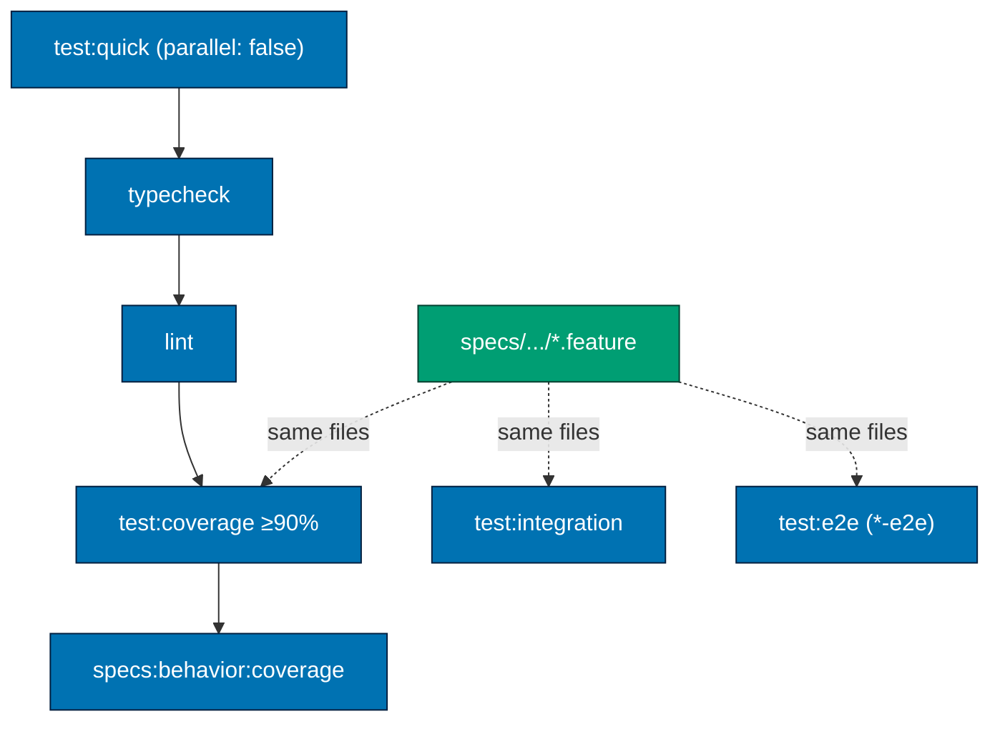
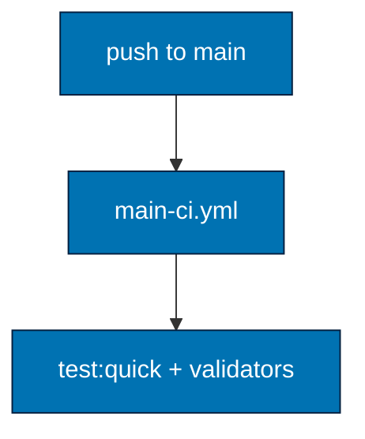
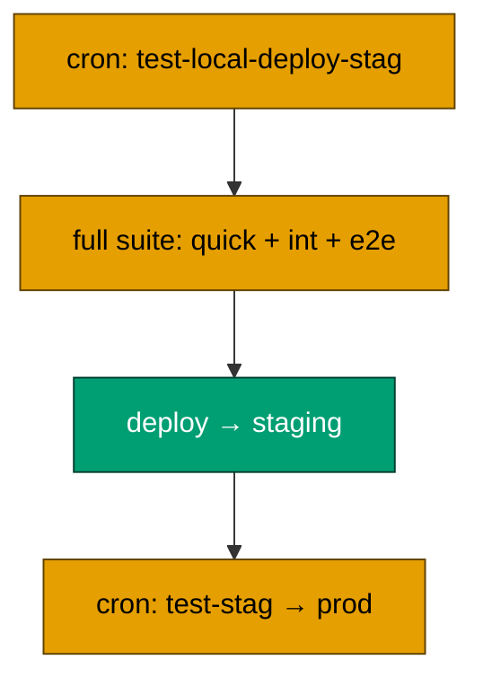
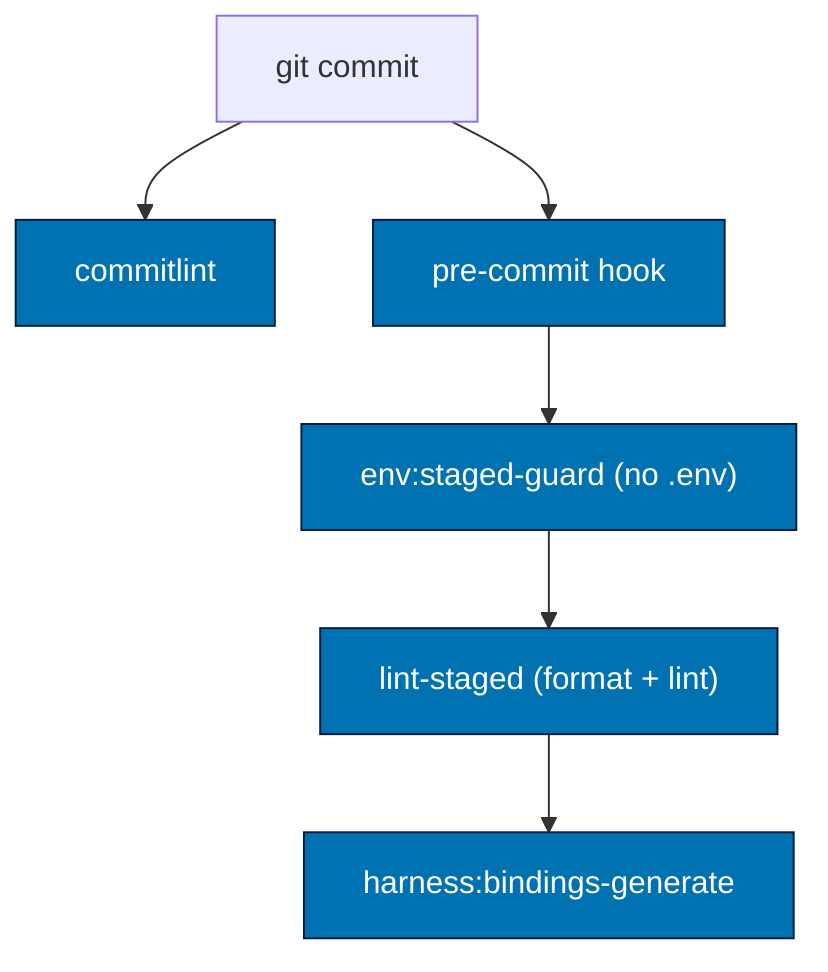
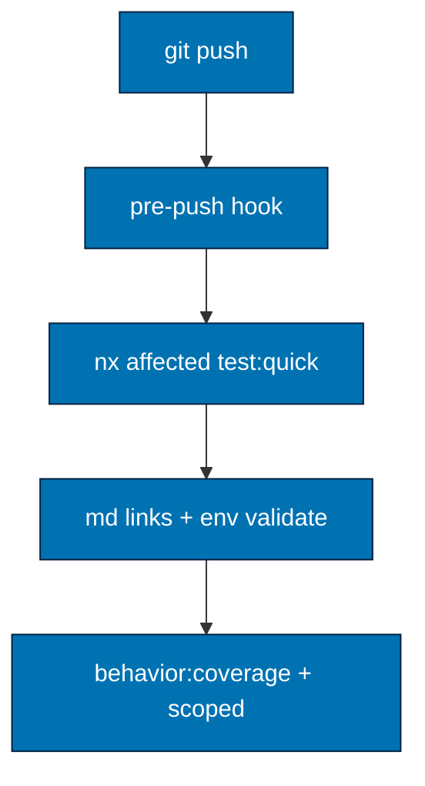
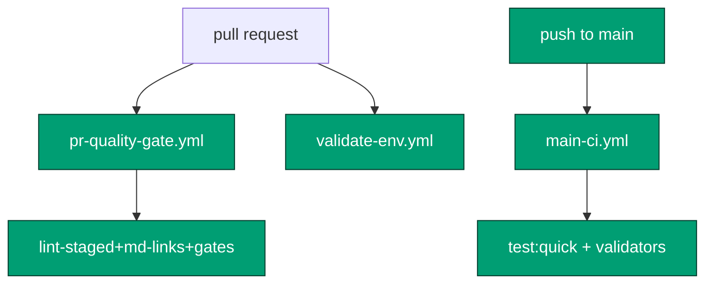
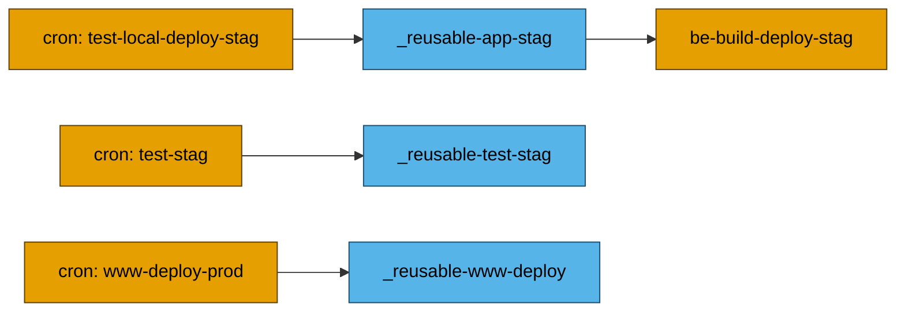
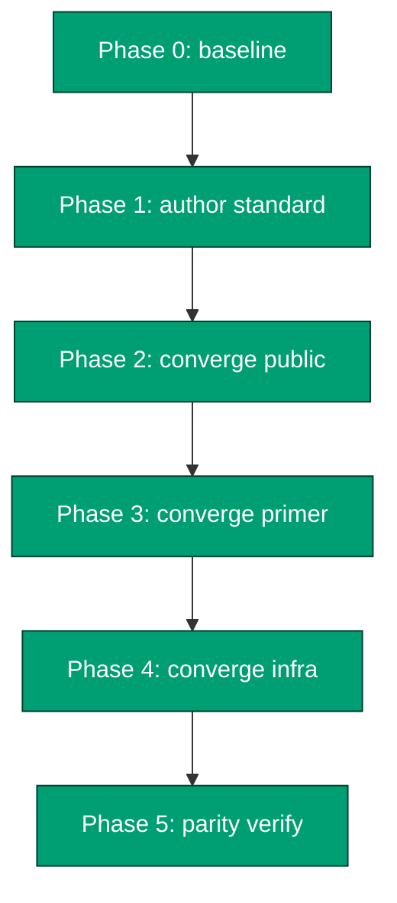

# Tech Docs — Standardize rhino-cli Checks & SDLC Commands

All facts below are grounded in the current commit of each repo (`apps/rhino-cli/src/cli.rs`,
`apps/rhino-cli/project.json`, `.husky/*`, `.github/workflows/*`) unless labelled otherwise. The doc
leads with the concrete **lifecycle commands** ([§1](#1-lifecycle-stage--exact-commands-post-implementation-identical-across-3-repos))
and **per-project target matrices** ([§2](#2-per-project-target-matrices)), then the full **rhino-cli
command set** ([§3](#3-rhino-cli-command-triage-wired-vs-not-wired)); the underlying standards (testing
architecture §4, Nx naming + repo-config §5, post-merge CI §6, the best-of-three synthesis + divergence
policy §7) and per-repo drift (§8) follow.

> **Identical-result invariant (north star).** The end-state of this plan is **identical across all
> three repos for the entire standardization layer** — the rhino-cli command set + verb-last naming,
> the `:`-separated Nx target conventions, `repo-config.yml`'s section schema, the hook/gate
> mechanics + step order, the lint-staged formatter + per-file-md-validator map, and the canonical
> GitHub CI workflow names (`pr-quality-gate.yml`, `validate-env.yml`, `main-ci.yml` — markdown
> validation is folded into the gates, **no** standalone `validate-markdown.yml`). Working across
> `ose-public`, `ose-primer`, and `ose-infra` must feel **identical, logical, and intuitive**: the
> same command does the same thing, the same target name resolves the same way, the same file holds
> the same kind of config. The **only** legitimate divergence is the **project/app set itself** (and
> therefore the per-app deploy/CRON workflows + language-specific gate jobs) — see
> [§7.1 Divergence Policy](#71-divergence-policy-allowed-vs-drift). Everything else is byte-identical
> where the files are not data-bearing, and structurally identical where they are (e.g. `repo-config.yml`
> lists each repo's own surfaces under the same schema).

## 1. Lifecycle Stage → Exact Commands (post-implementation, identical across 3 repos)

This is the single normative reference for **what runs, in what order, at every SDLC stage**. After
this plan the command list below is **byte-identical across `ose-public`, `ose-primer`, and
`ose-infra`** (only the affected **project set** differs, since `nx affected` resolves per repo).
Each stage names the surface file and the exact command sequence; the visual flow is
[§9.1](#91-sdlc-gate-flow-target-standard-shared-mechanics). [Repo-grounded — current hooks/CI;
deltas vs. today are flagged]

| Stage                | Surface                                 | Trigger                       |
| -------------------- | --------------------------------------- | ----------------------------- |
| 1. pre-commit        | `.husky/pre-commit`                     | `git commit` (before message) |
| 2. commit-msg        | `.husky/commit-msg`                     | `git commit` (on the message) |
| 3. pre-push          | `.husky/pre-push`                       | `git push`                    |
| 4. PR quality gate   | `.github/workflows/pr-quality-gate.yml` | pull request (+ branch push)  |
| 5. main quality gate | `.github/workflows/main-ci.yml`         | push to `main` (post-merge)   |

**Command scope** — every command is tagged with exactly one of **five** controlled values, so the
scope axis of the `(pre-commit ∪ pre-push) == PR == main` identity is unambiguous:

- **affected file-type** — files matching a glob, **limited to the changed set** (staged at
  pre-commit; `--diff` at PR). E.g. lint-staged formatters / tool-lint / per-file md validators.
- **all file-type** — files matching a glob, **across the whole repo** regardless of what changed.
  E.g. `md links validate`, `env validate`, and the main-gate lint-staged-equiv pass.
- **affected projects** — the touched Nx project graph (`nx affected`); per affected project only.
  E.g. `test:quick`, structural specs at pre-push / PR.
- **all projects** — every Nx project (`nx run-many --all`). E.g. `test:quick`, structural specs at
  the main gate.
- **other** — not file-type or project scoped: the commit-message text, binding regeneration from the
  whole `.claude/` tree, the path-gated governance validators, the `detect`/`quality-gate` CI plumbing.

The same check moves **only along this axis** between gates (e.g. lint-staged is `affected file-type`
at pre-commit/PR, `all file-type` at main; `test:quick` is `affected projects` at pre-push/PR, `all
projects` at main).

**Gate-composition rule (governs every stage below).** One identity, one carve-out, two exclusions:

1. **`(pre-commit ∪ pre-push) == PR gate == main gate` — the check set is **identical**; only the
   **scope** differs.** Every check that runs at pre-commit or pre-push also runs in the PR gate and in
   `main-ci.yml`, and neither CI gate runs any check the two local hooks don't. The scope axis:
   - **pre-commit** — lint-staged checks over the **staged** files; pre-push's per-project legs over
     the **affected** graph (`nx affected`).
   - **PR gate** — the same set recomputed server-side on the canonical `origin/main...HEAD` diff
     (lint-staged via `--diff`; per-project via `nx affected`).
   - **main gate** — the same set across **_every_** project / **_all_** files (`nx run-many --all`;
     lint-staged-equiv over all files). The one place the whole repo is re-verified green, catching
     main-only / merge-skew breakage the affected graph misses.
2. **Formatting is the sole carve-out.** The lint-staged **formatters** (`prettier`/`rustfmt`/… write
   in place) are a normalization step, not a pass/fail check: they auto-fix at pre-commit and via the
   PR-branch commit-back, and are **_not_** re-run at main (`format:check` is removed plan-wide). Every
   other lint-staged entry — tool-lint and the per-file markdown validators — is a real check and
   appears in all three gates.
3. **Heavy tiers never run in any gate.** No gate — pre-commit, pre-push, PR, or main — runs
   `test:integration` or `test:e2e`; those (and deploy) run **only** in the scheduled CRON pipelines
   ([§6](#6-post-merge-main-ci--per-project-staging-deploy)).

**Parallelism.** Within every stage the independent checks run **in parallel** as far as the surface
allows: the CI gates (PR + main) run their jobs as parallel GitHub Actions jobs and let Nx fan
`test:quick` across projects (`--parallel`); the local hooks let the per-project `nx affected` leg run
concurrently with the repo-wide validators (`md links validate`, `env validate`, governance). Ordering only
matters where a real data dependency exists (e.g. format-then-lint **inside** `test:quick`).

**1. pre-commit** — `.husky/pre-commit`, in this exact order; stops at first failure:

| #   | Command                                            | Scope              | What it does — exact tool + pass/fail criterion                                                                                                                                                                                                                                                                                                                                                                                                                                                                                                                                                                                                                                                                                                                                                                                                           |
| --- | -------------------------------------------------- | ------------------ | --------------------------------------------------------------------------------------------------------------------------------------------------------------------------------------------------------------------------------------------------------------------------------------------------------------------------------------------------------------------------------------------------------------------------------------------------------------------------------------------------------------------------------------------------------------------------------------------------------------------------------------------------------------------------------------------------------------------------------------------------------------------------------------------------------------------------------------------------------- |
| 1   | `cargo run --release -- env staged-guard validate` | affected file-type | Aborts the commit if any real `.env*` file is staged (the one exception is `.env.example`). Δ was inline `./scripts/check-no-env-staged.sh`.                                                                                                                                                                                                                                                                                                                                                                                                                                                                                                                                                                                                                                                                                                              |
| 2   | `lint-staged`                                      | affected file-type | Dispatches by extension over **only the staged files**: **format** (rewrite-in-place, re-stage; never fails on style), **tool-lint** (fail on findings) — `*.sh`→`shellcheck --severity=warning`, `Dockerfile`/`*.Dockerfile`→`hadolint --failure-threshold warning`, `.github/workflows/*.{yml,yaml}`→`actionlint` — and the **per-file markdown validators** (fail on findings): `*.md`→`markdownlint-cli2` (MD-rule content lint — the real `lint:md`) **and** `cargo run --release -- md mermaid validate` **and** `cargo run --release -- md heading-hierarchy validate`; `*.feature`→`cargo run --release -- specs gherkin-cardinality validate` (`.feature` files only). **`md links validate` is **not** here — it is cross-file (pre-push/PR/main, repo-wide).** Full map = SSOT in [§5](#5-nx-target-name-standard-targets-invoked-by-hooksci). |
| 3   | `cargo run --release -- harness bindings generate` | other              | Regenerates the platform-binding artifacts (`.opencode/`, `.amazonq/`) from the `.claude/` source of truth and **auto-stages** them so generated files commit in lockstep. Δ replaces the opaque `rhino-cli git pre-commit` sync slice.                                                                                                                                                                                                                                                                                                                                                                                                                                                                                                                                                                                                                   |

**Pre-commit is the fast stage — it does **not** run `test:quick`.** It guards (step 1), runs the
single file-type stage `lint-staged` — format, the shell/Dockerfile/workflow tool-linters, **and the
per-file markdown validators** (markdownlint-cli2 + mermaid + heading-hierarchy + gherkin-cardinality)
(step 2) — and re-syncs generated bindings (step 3). All of step 2 is changed-files-only and per-file
isolated, so it stays cheap. Per-project `typecheck` / `lint` / `test:unit` run at **pre-push** via
`test:quick` (stage 3 below), never here — committing must stay cheap.

**Why the tool-linters live in `lint-staged`, not in Nx targets.** `shellcheck` / `hadolint` /
`actionlint` are pure **file-type** dispatch (glob → run the tool on the matched files) — exactly
what `lint-staged` already does for formatters — so they are **lint-staged entries**, not `nx run`
targets (no per-project graph, and no whole-repo glob that would trip on stray `local-temp/*.sh`).
They stay **tool-gated** (skip-with-hint when the linter is absent locally — CI is the hard gate).
CI re-runs the **same** `lint-staged` over the PR diff (`lint-staged --diff="origin/main...HEAD"` [Web-cited: https://github.com/lint-staged/lint-staged, accessed 2026-06-28]),
so the mechanism is identical at commit-time and in CI. The previous
`shell:lint` / `dockerfiles:lint` / `actions:lint` Nx targets are **dropped in all three repos**
(including primer, which ships them today). Step 3's regen + auto-stage replaces the old monolithic
`git pre-commit` subcommand with a **direct `cargo run` call** (no Nx wrapper — it writes files, so it is
`cache: false` and gains nothing from Nx; see the gate-invocation rule in [§5](#5-nx-target-name-standard-targets-invoked-by-hooksci)).

**Δ `./scripts/git-identity-check.sh` is removed** (was step 1). It hard-blocked any per-repo git
identity override, which also blocked the legitimate human workflow of committing under different
identities per repo. It is replaced by a **behavioral guardrail, not a mechanical gate** (the **Git Identity Guardrail**
below): humans set per-tree identity via global `includeIf`; **agents must never set a per-repo
identity**. The script and its `.husky/pre-commit` line are deleted in all 3 repos.

**Git Identity Guardrail — no AI agent may set or modify git user identity (`user.name` /
`user.email`) at any scope.**
Concretely, an agent MUST NOT run `git config --local user.name`/`user.email`, MUST NOT run the
**bare** `git config user.name`/`user.email` (which writes to the **local** repo config by default
inside a worktree), MUST NOT set the `--global`/`--system` identity, and MUST NOT edit a `[user]`
section in `.git/config`. Commit identity always comes from the **developer's own global config**
(`~/.gitconfig`, optionally via `includeIf "gitdir:…"` for per-tree identities). This mirrors the
existing [no-real-`.env` agent guardrail](../../../repo-governance/conventions/security/secrets-and-env-standards.md).
**Scope:** this governs interactive agents working in a developer's repo/worktree — it does **_not_**
forbid a CI workflow from configuring a service-account/bot identity in its own YAML (e.g. the
`github-actions[bot]` identity used by the PR-gate format-commit-back). The rule is published in
`AGENTS.md` (agent guardrails) and a governance convention; see the delivery steps.

**2. commit-msg** — `.husky/commit-msg`. Identical in all three (already locked):

| #   | Command                              | Scope | What it does                                                                                                                         |
| --- | ------------------------------------ | ----- | ------------------------------------------------------------------------------------------------------------------------------------ |
| 1   | `npx --no -- commitlint --edit "$1"` | other | validates the commit message against Conventional Commits (`@commitlint/config-conventional`) — scope is the message text, not files |

**3. pre-push** — `.husky/pre-push`, in this exact order; stops at first failure:

| #   | Command                                                                                                                             | Scope              | What it does                                                                                                                                                                                                                                                                                                                                                                                             |
| --- | ----------------------------------------------------------------------------------------------------------------------------------- | ------------------ | -------------------------------------------------------------------------------------------------------------------------------------------------------------------------------------------------------------------------------------------------------------------------------------------------------------------------------------------------------------------------------------------------------- |
| 1   | `nx affected -t test:quick`                                                                                                         | affected projects  | runs typecheck → lint → test:unit → test:coverage (≥90%) → test:specs (all `specs:*` validators) per affected project — the specs gate is folded in here, so there is no separate specs step below                                                                                                                                                                                                       |
| 2   | `cargo run --release -- md links validate --exclude plans/done --exclude apps/ayokoding-www/content --exclude apps/ose-www/content` | all file-type      | the **cross-file** markdown validator — relative paths + `#fragment` anchors resolve repo-wide. Repo-wide (not lint-staged) because adding / deleting / renaming any md file can break links in untouched files. Δ the per-file md validators (markdownlint-cli2 + mermaid + heading-hierarchy + gherkin-cardinality) ran at pre-commit (lint-staged), not here; Δ replaces the opaque `npm run lint:md` |
| 3   | `cargo run --release -- env validate`                                                                                               | all file-type      | validates each app's `.env.example` against the repo env contract                                                                                                                                                                                                                                                                                                                                        |
| 4   | `cargo run --release -- harness naming validate`                                                                                    | other (path-gated) | agent/skill filenames match the harness naming convention (**trigger:** `.claude/agents/` or `.opencode/agent/`)                                                                                                                                                                                                                                                                                         |
| 5   | `cargo run --release -- repo-governance workflows naming validate`                                                                  | other (path-gated) | workflow-doc filenames match the workflow naming convention (**trigger:** `repo-governance/workflows/`)                                                                                                                                                                                                                                                                                                  |
| 6   | `cargo run --release -- repo-governance vendor validate`                                                                            | other (path-gated) | governance docs stay vendor-neutral, no vendor leakage (**trigger:** `repo-governance/**.md`)                                                                                                                                                                                                                                                                                                            |
| 7   | `cargo run --release -- harness parity validate`                                                                                    | other (path-gated) | agent behaviour is consistent across vendor bindings (**trigger:** parity surfaces — agents, `AGENTS.md`, `CLAUDE.md`)                                                                                                                                                                                                                                                                                   |
| 8   | `cargo run --release -- harness bindings validate`                                                                                  | other (path-gated) | generated bindings match source (`.claude/` → `.opencode/`, `.amazonq/`); Δ now a direct `cargo run` call, was `npm run` (**trigger:** binding surfaces)                                                                                                                                                                                                                                                 |
| 9   | `cargo run --release -- harness instruction-size validate`                                                                          | other (path-gated) | auto-loaded instruction files stay within their byte budget (reads `repo-config.yml` `instruction-size:`) (**trigger:** any instruction surface — `AGENTS.md`, `CLAUDE.md`, rules)                                                                                                                                                                                                                       |

Each governance validator (rows 4–9) is **path-gated** — invoked only when its trigger path is in the
changed set. Δ the former separate specs-structural step is **gone** — all `specs:*` validators now run
inside `test:quick` (step 1) via `test:specs`.

**`(pre-commit ∪ pre-push) == PR gate == main gate`** — per the gate-composition rule above: the
**identical check set** (lint-staged per-file checks, `test:quick`, `md links validate`, `env validate`,
structural specs, governance) runs at all three; only the **scope** differs (staged/affected →
`--diff`/affected → all-files/`run-many --all`). **None of the three runs `test:integration` or
`test:e2e`.**

**4. PR quality gate** — `pr-quality-gate.yml` (Δ renamed from `commons-quality-gate.yml`). Job
skeleton, identical across repos (only language-gate jobs and infra-only IaC jobs differ):

Each job's **Exact command(s)** cell is the literal command line CI runs — copy-paste faithful, not a
paraphrase (`$P` = `$(($(nproc)-1))`, the per-runner parallelism):

| Job                                                               | Exact command(s) CI runs                                                                                                                                                                                                                                                                                                                                                                                                                                                                                                                                 | Scope              |
| ----------------------------------------------------------------- | -------------------------------------------------------------------------------------------------------------------------------------------------------------------------------------------------------------------------------------------------------------------------------------------------------------------------------------------------------------------------------------------------------------------------------------------------------------------------------------------------------------------------------------------------------- | ------------------ |
| detect                                                            | `nx show projects --affected --base=origin/main --head=HEAD --json` → derive the affected-language set that drives the `<lang>` matrix. Runs no test.                                                                                                                                                                                                                                                                                                                                                                                                    | other              |
| lint-staged                                                       | `lint-staged --diff="origin/main...HEAD"` — per changed file, in order: **formatters** (auto-fix + commit back to the PR branch, never fail), then fail-on-finding: `shellcheck --severity=warning` (`*.sh`) · `hadolint --failure-threshold warning` (`Dockerfile`/`*.Dockerfile`) · `actionlint` (`.github/workflows/*.{yml,yaml}`) · `markdownlint-cli2` + `cargo run --release -- md mermaid validate` + `cargo run --release -- md heading-hierarchy validate` (`*.md`) · `cargo run --release -- specs gherkin-cardinality validate` (`*.feature`) | affected file-type |
| `<lang>` gate (one job per affected language)                     | `nx affected -t test:quick --base=origin/main --head=HEAD --parallel=$P` — each affected project runs `typecheck` → `lint` → `test:unit` → `test:coverage` (≥90% line) → `test:specs`. **Rust projects also:** `nx affected -t deny:check msrv:check --base=origin/main --head=HEAD --parallel=$P`. No `format:check`, no `test:integration`, no `test:e2e`.                                                                                                                                                                                             | affected projects  |
| md-links                                                          | `cargo run --release -- md links validate --exclude plans/done --exclude apps/ayokoding-www/content --exclude apps/ose-www/content` — repo-wide (NOT `--diff`: a deleted/renamed file breaks links in untouched files)                                                                                                                                                                                                                                                                                                                                   | all file-type      |
| env                                                               | `cargo run --release -- env validate`                                                                                                                                                                                                                                                                                                                                                                                                                                                                                                                    | all file-type      |
| governance (each runs only if its trigger path is in the PR diff) | `cargo run --release -- harness naming validate` · `cargo run --release -- harness parity validate` · `cargo run --release -- harness bindings validate` · `cargo run --release -- harness instruction-size validate` · `cargo run --release -- repo-governance vendor validate` · `cargo run --release -- repo-governance workflows naming validate`                                                                                                                                                                                                    | other (path-gated) |
| quality-gate                                                      | sentinel join — `needs: [detect, lint-staged, <lang>…, md-links, env, governance]`; green only when every required job is green. Runs no command.                                                                                                                                                                                                                                                                                                                                                                                                        | other              |

All jobs above run **in parallel** (matrix + independent jobs); `quality-gate` is the join point.
No `test:integration` / `test:e2e` here — same fast set as pre-push, just recomputed server-side and
widened to cover everything the two local hooks run.

**5. main quality gate** — `main-ci.yml` (new; post-merge on push to `main`). Runs the **same job set
as the PR gate, but across **every** project** (`nx run-many --all`, not `nx affected`) — the one
post-merge place the whole repo is re-verified green. The job list below is spelled out in full (it is
the PR gate's jobs with `affected`→`--all` and the path-gated governance validators run
unconditionally). **No `test:integration`, no `test:e2e`, no deploy.**

| Job                                                   | Exact command(s) CI runs                                                                                                                                                                                                                                                                                                                                                                                                                                                                                                         | Scope         |
| ----------------------------------------------------- | -------------------------------------------------------------------------------------------------------------------------------------------------------------------------------------------------------------------------------------------------------------------------------------------------------------------------------------------------------------------------------------------------------------------------------------------------------------------------------------------------------------------------------- | ------------- |
| lint-staged-equiv                                     | the same checks as PR lint-staged but over **all** files (no `--diff`, **formatters NOT run** — the one carve-out): `shellcheck --severity=warning $(git ls-files '*.sh')` · `hadolint --failure-threshold warning $(git ls-files 'Dockerfile' '*.Dockerfile')` · `actionlint` · `markdownlint-cli2 "**/*.md"` · `cargo run --release -- md mermaid validate` (all `*.md`) · `cargo run --release -- md heading-hierarchy validate` (all `*.md`) · `cargo run --release -- specs gherkin-cardinality validate` (all `*.feature`) | all file-type |
| `<lang>` gate                                         | `nx run-many --all -t test:quick --parallel=$P` — **every** project runs `typecheck` → `lint` → `test:unit` → `test:coverage` (≥90% line) → `test:specs`. **Rust projects also:** `nx run-many --all -t deny:check msrv:check --parallel=$P`. Catches main-only / merge-skew breakage the affected graph misses. No `test:integration`, no `test:e2e`.                                                                                                                                                                           | all projects  |
| md-links                                              | `cargo run --release -- md links validate --exclude plans/done --exclude apps/ayokoding-www/content --exclude apps/ose-www/content` (same as PR)                                                                                                                                                                                                                                                                                                                                                                                 | all file-type |
| env                                                   | `cargo run --release -- env validate`                                                                                                                                                                                                                                                                                                                                                                                                                                                                                            | all file-type |
| governance (all run unconditionally — not path-gated) | `cargo run --release -- harness naming validate` · `cargo run --release -- harness parity validate` · `cargo run --release -- harness bindings validate` · `cargo run --release -- harness instruction-size validate` · `cargo run --release -- repo-governance vendor validate` · `cargo run --release -- repo-governance workflows naming validate`                                                                                                                                                                            | other         |
| quality-gate                                          | sentinel join — `needs: [lint-staged-equiv, <lang>…, md-links, env, governance]`; green only when every required job is green. Runs no command.                                                                                                                                                                                                                                                                                                                                                                                  | other         |

All jobs run **in parallel**; `quality-gate` is the join point. The **check set is identical to the PR
gate** (which is itself `pre-commit ∪ pre-push`); the only deltas are **scope** — `nx run-many --all`
instead of `nx affected`; the lint-staged-equiv set over all files instead of the `--diff`; governance
run unconditionally instead of path-gated. No check runs here that the PR gate does not also run, and
none that pre-commit ∪ pre-push does not run. `test:integration`, `test:e2e`, and deploy run **only**
in the scheduled CRON pipelines ([§6](#6-post-merge-main-ci--per-project-staging-deploy)) — never in
this or any other gate.

## 2. Per-Project Target Matrices

The post-implementation target state per repo. Every project exposes the **mandatory six**; the
extra columns (`test:coverage`, `specs:behavior:coverage`, `specs:domain:coverage`, `build`) are
required-where-applicable. Rules behind real-vs-`echo` live in [§4](#4-testing-architecture--target-contents-standard).

### 2.1 Per-Project Target Matrix (post-implementation, ose-public)

The symmetry goal: after this plan, **_every_** project exposes the **mandatory six** —
`typecheck`, `lint`, `test:unit`, `test:integration`, `test:e2e`, `test:quick` — with a
real command or an `echo` placeholder. The matrix below is the post-implementation target state for
ose-public. (`test:coverage`, `specs:behavior:coverage`, and `test:specs` are shown too — **present on every project** (`echo` where N/A) because `test:quick` composes `test:unit` + `test:coverage` + `test:specs` (and `test:specs` aggregates the `specs:*` validators); `build` is required where
applicable, but not part of the symmetric six; `specs:domain:coverage` is shown for `*-be` only.
**`format` is not a per-project target** — formatting is file-type **lint-staged** (§5), so it has
no matrix column. Type-specific extras like `dev`/`start`/`run`/`install`/`codegen`/
`storybook`/`test:e2e:ui`/`test:e2e:report` and rhino-cli's governance targets are intentionally
**_not_** symmetric and are omitted here.)

**Legend**: ✅ real command · `echo` echo placeholder · — not declared (allowed only for the
non-symmetric `build`; the mandatory six **plus** `test:coverage`, `specs:behavior:coverage`, and `test:specs` (which `test:quick` composes) are NEVER absent, `echo` where N/A). Target presence is
[Repo-grounded] from each `project.json`; the real-vs-echo classification is a [Judgment call]
derived from the [§4 rules](#4-testing-architecture--target-contents-standard) and confirmed per
project during execution.

| Project                    | Type             | typecheck | lint | test:unit | test:coverage |  test:integration  | test:e2e | test:quick | specs:behavior:coverage | specs:domain:coverage | build  |
| -------------------------- | ---------------- | :-------: | :--: | :-------: | :-----------: | :----------------: | :------: | :--------: | :---------------------: | :-------------------: | :----: |
| `ayokoding-cli`            | CLI (Rust)       |    ✅     |  ✅  |    ✅     |     ≥90%      |         ✅         |  `echo`  |     ✅     |           ✅            |           —           |   ✅   |
| `ayokoding-www`            | FE (content)     |    ✅     |  ✅  |    ✅     |     ≥90%      |       `echo`       |  `echo`  |     ✅     |           ✅            |           —           |   ✅   |
| `ayokoding-www-be-e2e`     | E2E runner       |    ✅     |  ✅  |  `echo`   |    `echo`     |       `echo`       |    ✅    |     ✅     |           ✅            |           —           |   —    |
| `ayokoding-www-fe-e2e`     | E2E runner       |    ✅     |  ✅  |  `echo`   |    `echo`     |       `echo`       |    ✅    |     ✅     |           ✅            |           —           |   —    |
| `crane-cli`                | CLI (F#)         |    ✅     |  ✅  |    ✅     |     ≥90%      |         ✅         |  `echo`  |     ✅     |           ✅            |           —           |   ✅   |
| `fsharp-crane-core`        | Lib (F#)         |    ✅     |  ✅  |    ✅     |     ≥90%      |        ✅³         |  `echo`  |     ✅     |           ✅            |           —           |   ✅   |
| `organiclever-app-web`     | FE + DB (PGlite) |    ✅     |  ✅  |    ✅     |     ≥90%      |         ✅         |  `echo`  |     ✅     |           ✅            |           —           |   ✅   |
| `organiclever-app-web-e2e` | E2E runner       |    ✅     |  ✅  |  `echo`   |    `echo`     |       `echo`       |    ✅    |     ✅     |           ✅            |           —           |   —    |
| `organiclever-be`          | BE (F#)          |    ✅     |  ✅  |    ✅     |     ≥90%      | ✅ (service-level) |  `echo`  |     ✅     |           ✅            |          ✅           |   ✅   |
| `organiclever-be-e2e`      | E2E runner       |    ✅     |  ✅  |  `echo`   |    `echo`     |       `echo`       |    ✅    |     ✅     |           ✅            |           —           |   —    |
| `organiclever-www`         | FE (content)     |    ✅     |  ✅  |    ✅     |     ≥90%      |       `echo`       |  `echo`  |     ✅     |           ✅            |           —           |   ✅   |
| `organiclever-www-be-e2e`  | E2E runner       |    ✅     |  ✅  |  `echo`   |    `echo`     |       `echo`       | `echo`²  |     ✅     |           ✅            |           —           |   —    |
| `organiclever-www-fe-e2e`  | E2E runner       |    ✅     |  ✅  |  `echo`   |    `echo`     |       `echo`       |    ✅    |     ✅     |           ✅            |           —           |   —    |
| `ose-app-web`              | FE + DB?         |    ✅     |  ✅  |    ✅     |     ≥90%      |        ✅¹         |  `echo`  |     ✅     |           ✅            |           —           |   ✅   |
| `ose-app-web-e2e`          | E2E runner       |    ✅     |  ✅  |  `echo`   |    `echo`     |       `echo`       |    ✅    |     ✅     |           ✅            |           —           |   —    |
| `ose-be`                   | BE (F#)          |    ✅     |  ✅  |    ✅     |     ≥90%      | ✅ (service-level) |  `echo`  |     ✅     |           ✅            |          ✅           |   ✅   |
| `ose-be-e2e`               | E2E runner       |    ✅     |  ✅  |  `echo`   |    `echo`     |       `echo`       |    ✅    |     ✅     |           ✅            |           —           |   —    |
| `ose-cli`                  | CLI (Rust)       |    ✅     |  ✅  |    ✅     |     ≥90%      |         ✅         |  `echo`  |     ✅     |           ✅            |           —           |   ✅   |
| `ose-www`                  | FE (content)     |    ✅     |  ✅  |    ✅     |     ≥90%      |       `echo`       |  `echo`  |     ✅     |           ✅            |           —           |   ✅   |
| `ose-www-be-e2e`           | E2E runner       |    ✅     |  ✅  |  `echo`   |    `echo`     |       `echo`       |    ✅    |     ✅     |           ✅            |           —           |   —    |
| `ose-www-fe-e2e`           | E2E runner       |    ✅     |  ✅  |  `echo`   |    `echo`     |       `echo`       |    ✅    |     ✅     |           ✅            |           —           |   —    |
| `rhino-cli`                | CLI (Rust)       |    ✅     |  ✅  |    ✅     |     ≥90%      |         ✅         |  `echo`  |     ✅     |           ✅            |           —           |   ✅   |
| `rust-commons`             | Lib (Rust)       |    ✅     |  ✅  |    ✅     |     ≥90%      |        ✅³         |  `echo`  |     ✅     |           ✅            |           —           |   ✅   |
| `wahidyankf-www`           | FE (content)     |    ✅     |  ✅  |    ✅     |     ≥90%      |       `echo`       |  `echo`  |     ✅     |           ✅            |           —           |   ✅   |
| `wahidyankf-www-fe-e2e`    | E2E runner       |    ✅     |  ✅  |  `echo`   |    `echo`     |       `echo`       |    ✅    |     ✅     |           ✅            |           —           |   —    |
| `web-ui`                   | Lib (UI)         |    ✅     |  ✅  |    ✅     |     ≥90%      |        ✅³         |  `echo`  |     ✅     |           ✅            |           —           |  ✅⁴   |
| `web-ui-token`             | Lib (tokens)     |    ✅     |  ✅  |    ✅     |     ≥90%      |       `echo`       |  `echo`  |    ✅⁵     |           ✅            |           —           | `echo` |

Footnotes:

1. `ose-app-web` `test:integration` is real **only if** it is DB-backed/local-first (like `organiclever-app-web`'s PGlite); otherwise `echo`. Confirm its storage during execution.
2. `organiclever-www-be-e2e` is a placeholder slot (no backend API yet — [AGENTS.md](../../../AGENTS.md)); `test:e2e` stays `echo` until a backend exists.
3. Lib `test:integration` is real where the lib actually has integration tests today; otherwise `echo`. Confirm per lib.
4. `web-ui` builds via `build-storybook` (no plain `build`); treated as its build artifact.
5. `web-ui-token` currently **lacks `test:quick`** — this plan adds it (the most visible mandatory-six gap).

### 2.2 Per-Project Target Matrix (post-implementation, ose-primer)

Same legend (✅ real · `echo` placeholder · — not declared). Rows are [Repo-grounded] from each
`project.json`; real/echo is a [Judgment call] per §4, confirmed during execution.

| Project                     | Type          | typecheck | lint | test:unit | test:coverage | test:integration | test:e2e | test:quick | specs:behavior:coverage | specs:domain:coverage | build |
| --------------------------- | ------------- | :-------: | :--: | :-------: | :-----------: | :--------------: | :------: | :--------: | :---------------------: | :-------------------: | :---: |
| `clojure-openapi-codegen`   | Lib (codegen) |  `echo`¹  |  ✅  |    ✅     |     ≥90%      |      `echo`      |  `echo`  |     ✅     |           ✅²           |           —           |  ✅   |
| `crud-be-clojure-pedestal`  | BE (Clojure)  |    ✅     |  ✅  |    ✅     |     ≥90%      |        ✅        |  `echo`  |     ✅     |           ✅            |          ✅           |  ✅   |
| `crud-be-csharp-aspnetcore` | BE (C#)       |    ✅     |  ✅  |    ✅     |     ≥90%      |        ✅        |  `echo`  |     ✅     |           ✅            |          ✅           |  ✅   |
| `crud-be-e2e`               | E2E runner    |    ✅     |  ✅  |  `echo`   |    `echo`     |      `echo`      |    ✅    |     ✅     |           ✅            |           —           |   —   |
| `crud-be-elixir-phoenix`    | BE (Elixir)   |    ✅     |  ✅  |    ✅     |     ≥90%      |        ✅        |  `echo`  |     ✅     |           ✅            |          ✅           |  ✅   |
| `crud-be-fsharp-giraffe`    | BE (F#)       |    ✅     |  ✅  |    ✅     |     ≥90%      |        ✅        |  `echo`  |     ✅     |           ✅            |          ✅           |  ✅   |
| `crud-be-golang-gin`        | BE (Go)       |    ✅     |  ✅  |    ✅     |     ≥90%      |        ✅        |  `echo`  |     ✅     |           ✅            |          ✅           |  ✅   |
| `crud-be-java-springboot`   | BE (Java)     |    ✅     |  ✅  |    ✅     |     ≥90%      |        ✅        |  `echo`  |     ✅     |           ✅            |          ✅           |  ✅   |
| `crud-be-java-vertx`        | BE (Java)     |    ✅     |  ✅  |    ✅     |     ≥90%      |        ✅        |  `echo`  |     ✅     |           ✅            |          ✅           |  ✅   |
| `crud-be-kotlin-ktor`       | BE (Kotlin)   |    ✅     |  ✅  |    ✅     |     ≥90%      |        ✅        |  `echo`  |     ✅     |           ✅            |          ✅           |  ✅   |
| `crud-be-python-fastapi`    | BE (Python)   |    ✅     |  ✅  |    ✅     |     ≥90%      |        ✅        |  `echo`  |     ✅     |           ✅            |          ✅           |  ✅   |
| `crud-be-rust-axum`         | BE (Rust)     |    ✅     |  ✅  |    ✅     |     ≥90%      |        ✅        |  `echo`  |     ✅     |           ✅            |          ✅           |  ✅   |
| `crud-be-ts-effect`         | BE (TS)       |    ✅     |  ✅  |    ✅     |     ≥90%      |        ✅        |  `echo`  |     ✅     |           ✅            |          ✅           |  ✅   |
| `crud-fe-dart-flutterweb`   | FE (Dart)     |    ✅     |  ✅  |    ✅     |     ≥90%      |      `echo`      |  `echo`  |     ✅     |           ✅            |           —           |  ✅   |
| `crud-fe-e2e`               | E2E runner    |    ✅     |  ✅  |  `echo`   |    `echo`     |      `echo`      |    ✅    |     ✅     |           ✅            |           —           |   —   |
| `crud-fe-ts-nextjs`         | FE            |    ✅     |  ✅  |    ✅     |     ≥90%      |      `echo`      |  `echo`  |     ✅     |           ✅            |           —           |  ✅   |
| `crud-fe-ts-tanstack-start` | FE            |    ✅     |  ✅  |    ✅     |     ≥90%      |      `echo`      |  `echo`  |     ✅     |           ✅            |           —           |  ✅   |
| `crud-fs-ts-nextjs`         | Fullstack     |    ✅     |  ✅  |    ✅     |     ≥90%      |        ✅        |  `echo`  |     ✅     |           ✅            |           —           |  ✅   |
| `elixir-cabbage`            | Lib (Elixir)  |    ✅     |  ✅  |    ✅     |     ≥90%      |      `echo`      |  `echo`  |     ✅     |           ✅²           |           —           |   —   |
| `elixir-gherkin`            | Lib (Elixir)  |    ✅     |  ✅  |    ✅     |     ≥90%      |      `echo`      |  `echo`  |     ✅     |           ✅²           |           —           |   —   |
| `elixir-openapi-codegen`    | Lib (Elixir)  |    ✅     |  ✅  |    ✅     |     ≥90%      |      `echo`      |  `echo`  |     ✅     |           ✅²           |           —           |   —   |
| `golang-commons`            | Lib (Go)      |  `echo`¹  |  ✅  |    ✅     |     ≥90%      |        ✅        |  `echo`  |     ✅     |           ✅²           |           —           |   —   |
| `rhino-cli`                 | CLI (Rust)    |    ✅     |  ✅  |    ✅     |     ≥90%      |        ✅        |  `echo`  |     ✅     |           ✅            |           —           |  ✅   |
| `ts-ui`                     | Lib (UI)      |    ✅     |  ✅  |    ✅     |     ≥90%      |      `echo`      |  `echo`  |     ✅     |           ✅²           |           —           |  ✅⁴  |
| `ts-ui-tokens`              | Lib (tokens)  |    ✅     |  ✅  |  `echo`   |    `echo`     |      `echo`      |  `echo`  |    ✅³     |           ✅²           |           —           |   —   |

Footnotes: ¹ dynamic/compile-typed language (Clojure/Go) — `typecheck` is an `echo` placeholder.
² `specs:behavior:coverage` is **added** (not present today) per the all-apps-and-libs rule. ³ `ts-ui-tokens`
today has **only** `lint`+`typecheck` — four of the six are added (`test:unit`/`test:integration`/
`test:e2e` as `echo`, `test:quick`); formatting is lint-staged, not a target. ⁴ `ts-ui` builds via `build-storybook`.

> **Primer gaps (today → after)**: the 11 `crud-be-*`
> backends + `crud-fs-ts-nextjs` lack a `test:e2e` target (add `echo`); the `crud-fe-*` frontends lack
> `test:integration` + `test:e2e` (add `echo`); the support libs (`clojure-openapi-codegen`,
> `elixir-*`, `golang-commons`, `ts-ui*`) lack 2–4 of the six. Formatting is handled by the shared
> lint-staged map (no per-project `format` target). The 11 `crud-be-*` backends each gain
> `specs:domain:coverage`. [Repo-grounded]

### 2.3 Per-Project Target Matrix (post-implementation, ose-infra)

| Project             | Type         | typecheck | lint | test:unit | test:coverage |  test:integration  | test:e2e | test:quick | specs:behavior:coverage | specs:domain:coverage | build |
| ------------------- | ------------ | :-------: | :--: | :-------: | :-----------: | :----------------: | :------: | :--------: | :---------------------: | :-------------------: | :---: |
| `coralpolyp-be`     | BE           |    ✅     |  ✅  |    ✅     |     ≥90%      | ✅ (service-level) |  `echo`  |     ✅     |           ✅            |          ✅           |  ✅   |
| `coralpolyp-be-e2e` | E2E runner   |    ✅     |  ✅  |  `echo`   |    `echo`     |       `echo`       |    ✅    |     ✅     |           ✅            |           —           |   —   |
| `coralpolyp-fe`     | FE + DB?     |    ✅     |  ✅  |    ✅     |     ≥90%      |        ✅¹         |  `echo`  |     ✅     |           ✅            |           —           |  ✅   |
| `coralpolyp-fe-e2e` | E2E runner   |    ✅     |  ✅  |  `echo`   |    `echo`     |       `echo`       |    ✅    |     ✅     |           ✅            |           —           |   —   |
| `rhino-cli`         | CLI (Rust)   |    ✅     |  ✅  |    ✅     |     ≥90%      |         ✅         |  `echo`  |     ✅     |           ✅            |           —           |  ✅   |
| `ts-ui`             | Lib (UI)     |    ✅     |  ✅  |    ✅     |     ≥90%      |       `echo`       |  `echo`  |     ✅     |           ✅²           |           —           |  ✅⁴  |
| `ts-ui-tokens`      | Lib (tokens) |    ✅     |  ✅  |  `echo`   |    `echo`     |       `echo`       |  `echo`  |    ✅³     |           ✅²           |           —           |   —   |

Footnotes as §2.2. ¹ `coralpolyp-fe` `test:integration` is real only if DB-backed; else `echo` —
confirm. **Infra gaps**: formatting moves to the shared lint-staged map (no per-project `format`
target); `ts-ui-tokens` has only `lint`+`typecheck`; `coralpolyp-be` gains `specs:domain:coverage`;
`rhino-cli`'s env/governance/binding validators run as direct `cargo run` calls in the gates (no `harness:bindings-validation`/`harness:bindings-generate` Nx targets), and its shell/Dockerfile/workflow linting folds into lint-staged (no `shell:lint`/`dockerfiles:lint`/`actions:lint` Nx targets) (§8.1).

## 3. rhino-cli Command Triage (Wired vs. Not-Wired)

A command is **wired** when some lifecycle automation (a `.husky` hook step, a `.github/workflows`
job, or an Nx target reachable from a hook/CI gate) invokes it. It is **not wired** when it exists
in the CLI but is only runnable by hand or solely via an aggregate `audit` subcommand that no
automation calls. All leaf subcommands are enumerated from `apps/rhino-cli/src/cli.rs`. [Repo-grounded]

### 3.1 Two Naming Conventions (locked)

This plan standardizes **two distinct surfaces** with **two distinct conventions** — the
**Command (leaf) — target** column applies the first; every Nx target referenced applies the second:

1. **rhino-cli CLI commands** — **noun-hierarchy then verb-last**:
   `{domain} {sub-domain…} {sub-sub-domain…} … {verb}`. The verb (`validate`, `audit`, `sync`,
   `emit`, `generate`, `clean`, `scaffold`, `init`, `backup`, `restore`) is **always the final
   token**; everything before it is the noun path. So `convention validate emoji` →
   `convention emoji validate`; `harness sync opencode` → `harness opencode sync`; the two new
   coverage validators are authored directly verb-last (`specs behavior-coverage validate`,
   `specs domain-coverage validate`).
   Family-level aggregates keep their verb last already (`md audit`, `convention audit`). Pre-existing
   `(alias)` shortcuts are removed in favour of the canonical verb-last form. [Judgment call —
   naming standard]

   **Agent + binding machinery + harness-loaded instruction surfaces all live under the `harness`
   domain.** Every command that touches agent/skill files, the `.claude` ↔ `.opencode` ↔ `.amazonq`
   bindings, cross-vendor binding parity, or the auto-loaded instruction surfaces a harness ingests
   (`AGENTS.md` / `CLAUDE.md` / rules byte budgets) is a `harness` sub-command:
   `harness naming validate`, `harness duplication validate`, `harness claude validate`,
   `harness sync validate`, `harness bindings validate`, `harness bindings generate`,
   `harness opencode sync`, `harness amazonq emit`,
   `harness parity validate` (Δ renamed from the `cross-vendor parity` form),
   `harness instruction-size validate` (Δ moved from the `convention` domain — instruction surfaces
   are harness-loaded, not a documentation convention), and `harness audit`.
   **Anything that validates the `repo-governance/` tree lives under the `repo-governance` domain** —
   including workflow-doc naming, which validates files in `repo-governance/workflows/`:
   `repo-governance vendor validate`, `repo-governance layer-coherence validate`,
   `repo-governance traceability validate`,
   `repo-governance workflows naming validate` (Δ folded in from the standalone `workflows` domain),
   and `repo-governance audit`. The remaining non-governance, non-harness domains keep their own
   names (`convention …` for repo-wide source/file conventions like emoji + license, `specs …`,
   `md …`, `env …`). [Judgment call — domain grouping]

2. **Nx / `project.json` targets** — **`:`-separated** `{domain}:{work}` (validation/governance) or
   lifecycle names: `lint`, `test:unit`, `test:coverage`, `test:integration`, `test:e2e`,
   `test:quick`, `specs:behavior:coverage`, `specs:domain:coverage`, `build`,
   `instruction-size:validation`, `governance:vendor-audit-validation`, … — colon-segmented, never
   space-segmented. The Nx target name and the CLI command it invokes are **independent** (e.g. Nx
   `specs:behavior:coverage` → CLI `specs behavior-coverage validate`). [Repo-grounded — existing `:`
   scheme in `nx-targets.md`]

The **Command (leaf) — target** column is the **proposed** verb-last name each command would
converge to under the conventions above, and is deliberately the **first** command column (before
**Command (leaf) — current**) so the table reads target-first — the end-state name is what matters;
the current form is only the migration source. The per-command **keep / merge / drop / wire** verdicts
(this plan's recommendation, Req 5) live in [§3.3](#33-merge--drop-recommendations) and are keyed by
the row numbers below. The **Decided** column tracks whether a row's fate (final name + wiring
keep/remove) has actually been **ratified** by reviewing it one-by-one: only `test-coverage validate`
(row 1) and `env staged-guard validate` (row 46b) are decided so far; **every other row is ❓**,
pending that review. Proposed targets and Status are working assumptions, not yet locked.

| #   | Command (leaf) — target                      | Command (leaf) — current                     | What it does                                                                                                                                                                                                                             | Status                      | Decided | Invocation site (if wired)                                                                                                                                 |
| --- | -------------------------------------------- | -------------------------------------------- | ---------------------------------------------------------------------------------------------------------------------------------------------------------------------------------------------------------------------------------------- | --------------------------- | :-----: | ---------------------------------------------------------------------------------------------------------------------------------------------------------- |
| 1   | **— (removed)**                              | `test-coverage validate`                     | Check coverage output against a line-based threshold                                                                                                                                                                                     | **wired** → **drop**        |   ✅    | replaced by each project's **native** coverage gate at `test:unit` (≥ 90%); Nx `test-coverage` target deleted in all 3 repos                               |
| 2   | `repo-governance vendor validate`            | `repo-governance validate vendor`            | Scan governance markdown for forbidden vendor-specific terms                                                                                                                                                                             | **wired**                   |   ❓    | Nx `governance:vendor-audit-validation` → pre-push (scoped); **drift: not in primer pre-push**                                                             |
| 3   | `repo-governance layer-coherence validate`   | `repo-governance validate layer-coherence`   | Audit governance docs for layer numbering/naming coherence                                                                                                                                                                               | not wired                   |   ❓    | only via `repo-governance audit` (manual)                                                                                                                  |
| 4   | `repo-governance traceability validate`      | `repo-governance validate traceability`      | Audit governance docs for required traceability sections                                                                                                                                                                                 | not wired                   |   ❓    | only via `repo-governance audit` (manual)                                                                                                                  |
| 5   | `repo-governance audit`                      | `repo-governance audit`                      | Run all deterministic governance audits; emit JSON envelope                                                                                                                                                                              | not wired                   |   ❓    | manual aggregate                                                                                                                                           |
| 6   | `md naming validate`                         | `md validate naming`                         | Validate markdown filenames are lowercase-kebab-case                                                                                                                                                                                     | not wired                   |   ❓    | only via `md audit` (manual)                                                                                                                               |
| 7   | `md frontmatter validate`                    | `md validate frontmatter`                    | Validate doc YAML frontmatter against area-specific schemas                                                                                                                                                                              | not wired                   |   ❓    | only via `md audit` (manual)                                                                                                                               |
| 8   | `md heading-hierarchy validate`              | `md validate heading-hierarchy`              | Validate heading hierarchy (one H1, no skipped levels) — **per-file**                                                                                                                                                                    | **wired**                   |   ❓    | Δ **lint-staged** (`*.md`, changed files; PR via `--diff`; main over all) — direct `cargo run`, was Nx `headings:hierarchy-validation`                     |
| 9   | `md links validate`                          | `md validate links`                          | Validate markdown links (relative paths + `#fragment` anchors resolve) — **cross-file**                                                                                                                                                  | **wired**                   |   ❓    | Δ **repo-wide gate** (pre-push/PR/main) — direct `cargo run`; never lint-staged (delete/rename breaks links in untouched files), was Nx `links:validation` |
| 10  | `md mermaid validate`                        | `md validate mermaid`                        | Validate Mermaid diagrams (label length, width/span, single-diagram) — **per-file**                                                                                                                                                      | **wired**                   |   ❓    | Δ **lint-staged** (`*.md`, changed files; PR via `--diff`; main over all) — direct `cargo run`, was Nx `mermaid:validation`                                |
| 11  | `md frontmatter-dates validate`              | `md validate frontmatter-dates`              | Audit markdown for forbidden manual date metadata                                                                                                                                                                                        | not wired                   |   ❓    | only via `md audit` (manual)                                                                                                                               |
| 12  | `md readme-index validate`                   | `md validate readme-index`                   | Audit directory README indexes against sibling markdown                                                                                                                                                                                  | not wired                   |   ❓    | only via `md audit` (manual)                                                                                                                               |
| 13  | — (removed)                                  | `md frontmatter-dates` (alias)               | Alias of `md frontmatter-dates validate`; removed in favour of canonical verb-last                                                                                                                                                       | not wired → remove          |   ❓    | —                                                                                                                                                          |
| 14  | — (removed)                                  | `md readme-index` (alias)                    | Alias of `md readme-index validate`; removed in favour of canonical verb-last                                                                                                                                                            | not wired → remove          |   ❓    | —                                                                                                                                                          |
| 15  | `md audit`                                   | `md audit`                                   | Run all md validators in sequence; aggregate findings                                                                                                                                                                                    | not wired                   |   ❓    | manual aggregate                                                                                                                                           |
| 16  | `convention emoji validate`                  | `convention validate emoji`                  | Audit forbidden file types for emoji codepoints                                                                                                                                                                                          | not wired                   |   ❓    | only via `convention audit` (manual)                                                                                                                       |
| 17  | `convention license validate`                | `convention validate license`                | Verify per-directory LICENSE files match the licensing convention                                                                                                                                                                        | not wired                   |   ❓    | only via `convention audit` (manual)                                                                                                                       |
| 18  | `harness instruction-size validate`          | `convention validate instruction-size`       | Audit all auto-loaded instruction surfaces against per-surface byte budgets (`repo-config.yml` `instruction-size:`); Δ **domain moved `convention`→`harness`** (instruction surfaces are harness-loaded); legacy alias: `agents-md-size` | **wired**                   |   ❓    | Nx `rhino-cli:instruction-size:validation` (target name unchanged — `:`-scheme) → pre-push (changed-path gate) + PR gate                                   |
| 19  | `convention audit`                           | `convention audit`                           | Run all convention validators; aggregate findings                                                                                                                                                                                        | not wired                   |   ❓    | manual aggregate                                                                                                                                           |
| 20  | `harness naming validate`                    | `harness validate naming`                    | Validate agent filename suffixes + `.claude`↔`.opencode` mirror parity                                                                                                                                                                   | **wired**                   |   ❓    | Nx `naming:harness-validation` → pre-push (scoped) + PR gate                                                                                               |
| 21  | `harness duplication validate`               | `harness validate duplication`               | Detect verbatim duplication across agent + skill files                                                                                                                                                                                   | not wired                   |   ❓    | only via `harness audit` (manual)                                                                                                                          |
| 22  | `harness claude validate`                    | `harness validate claude`                    | Validate Claude Code agent/skill format in `.claude/`                                                                                                                                                                                    | not wired                   |   ❓    | npm `validate:claude` (manual script)                                                                                                                      |
| 23  | `harness sync validate`                      | `harness validate sync`                      | Validate `.claude/` and `.opencode/` are in sync                                                                                                                                                                                         | not wired                   |   ❓    | npm `validate:sync` (manual script)                                                                                                                        |
| 24  | `harness bindings validate`                  | `harness validate bindings`                  | Validate Amazon Q binding bridge files + catalog coverage                                                                                                                                                                                | **wired**                   |   ❓    | npm `harness:bindings-validation` → pre-push (scoped)                                                                                                      |
| 25  | `harness opencode sync`                      | `harness sync opencode`                      | Sync Claude Code agents → OpenCode format                                                                                                                                                                                                | **wired** `[Unverified]`    |   ❓    | pre-commit `git pre-commit` auto-sync (CLAUDE.md claims auto-sync; confirm in Phase 1)                                                                     |
| 26  | `harness amazonq emit`                       | `harness emit amazonq`                       | Emit Amazon Q Developer binding bridge files (idempotent)                                                                                                                                                                                | **wired** `[Unverified]`    |   ❓    | pre-commit `git pre-commit` auto-sync (confirm in Phase 1)                                                                                                 |
| 27  | `harness bindings generate`                  | `harness generate bindings`                  | Generate all platform bindings (sync OpenCode + emit Amazon Q)                                                                                                                                                                           | **wired** `[Unverified]`    |   ❓    | pre-commit auto-sync + npm `generate:bindings` (confirm in Phase 1)                                                                                        |
| 28  | `harness audit`                              | `harness audit`                              | Run all harness validators; aggregate findings                                                                                                                                                                                           | not wired                   |   ❓    | manual aggregate                                                                                                                                           |
| 29  | `repo-governance workflows naming validate`  | `workflows validate naming`                  | Validate workflow filename suffixes + frontmatter name consistency; Δ **domain moved `workflows`→`repo-governance`** (workflow docs live in `repo-governance/workflows/`)                                                                | **wired**                   |   ❓    | Nx `naming:workflows-validation` (target name unchanged — `:`-scheme) → pre-push (scoped) + PR gate                                                        |
| 30  | `specs adoption validate`                    | `specs validate adoption`                    | Verify an app has adopted BDD + DDD practices (no orphan app)                                                                                                                                                                            | **wired**                   |   ❓    | Nx `specs:adoption-validation` → pre-push + PR gate                                                                                                        |
| 31  | `specs counts validate`                      | `specs validate counts`                      | Validate each required spec subfolder has ≥1 spec file                                                                                                                                                                                   | **wired**                   |   ❓    | Nx `specs:counts-validation` → pre-push + PR gate                                                                                                          |
| 32  | `specs links validate`                       | `specs validate links`                       | Check markdown links in spec files resolve                                                                                                                                                                                               | **wired**                   |   ❓    | Nx `specs:links-validation` → pre-push + PR gate                                                                                                           |
| 33  | `specs tree validate`                        | `specs validate tree`                        | Validate canonical C4-aware five-folder spec tree                                                                                                                                                                                        | **wired**                   |   ❓    | Nx `specs:tree-validation` → pre-push + PR gate                                                                                                            |
| 34  | `specs behavior-coverage validate`           | `specs validate coverage`                    | Validate every Gherkin step has a step definition **and** every feature **+ scenario** is exercised by ≥1 eligible unit/integration/e2e test (`--require-consumption`, new — §4)                                                         | **wired**                   |   ❓    | Nx `specs:behavior:coverage` (renamed from `specs:coverage`) → pre-push + PR gate                                                                          |
| 34b | `specs domain-coverage validate`             | **— (new)**                                  | Validate every domain entity in `specs/apps/<domain>/domain/**` (bounded-context/ubiquitous-language registry) is exercised by ≥1 domain unit test                                                                                       | **new** → **wire (`*-be`)** |   ❓    | Nx `specs:domain:coverage` → pre-push + PR gate, **only on `*-be` backend projects**                                                                       |
| 35  | `specs bc validate`                          | `specs validate bc`                          | Validate bounded-context structural parity against the registry                                                                                                                                                                          | not wired                   |   ❓    | no Nx target; manual                                                                                                                                       |
| 36  | `specs ul validate`                          | `specs validate ul`                          | Validate ubiquitous-language glossary parity against the registry                                                                                                                                                                        | not wired                   |   ❓    | no Nx target; manual                                                                                                                                       |
| 37  | `specs gherkin-cardinality validate`         | `specs validate gherkin-cardinality`         | Audit `.feature` scenarios for repeated primary Given/When/Then keywords — **per-file**; `.feature` files only (unchanged — no markdown scanning)                                                                                        | **wired**                   |   ❓    | Δ **lint-staged** (`*.feature`, changed files; PR via `--diff`; main over all) — direct `cargo run`, was Nx `specs:gherkin-cardinality-validation`         |
| 38  | `specs java-imports clean`                   | `specs clean java-imports`                   | Strip unused/same-package imports from generated Java contract files                                                                                                                                                                     | not wired                   |   ❓    | dormant (primer-oriented)                                                                                                                                  |
| 39  | `specs dart scaffold`                        | `specs scaffold dart`                        | Generate Dart package scaffolding around generated contract types                                                                                                                                                                        | not wired                   |   ❓    | dormant (primer-oriented)                                                                                                                                  |
| 40  | `specs audit`                                | `specs audit`                                | Run all specs validators; aggregate findings                                                                                                                                                                                             | not wired                   |   ❓    | manual aggregate                                                                                                                                           |
| 41  | `lang java null-safety-annotations validate` | `lang java validate null-safety-annotations` | Check Java packages carry required null-safety annotations                                                                                                                                                                               | not wired                   |   ❓    | dormant (primer-oriented)                                                                                                                                  |
| 42  | `git pre-commit`                             | `git pre-commit`                             | Run the full pre-commit pipeline (config sync, format, doc validation)                                                                                                                                                                   | **wired**                   |   ❓    | `.husky/pre-commit`                                                                                                                                        |
| 43  | `env init`                                   | `env init`                                   | Create `.env` files from `.env.example` templates                                                                                                                                                                                        | not wired                   |   ❓    | developer convenience                                                                                                                                      |
| 44  | `env backup`                                 | `env backup`                                 | Back up `.env` files from the repository                                                                                                                                                                                                 | not wired                   |   ❓    | developer convenience                                                                                                                                      |
| 45  | `env restore`                                | `env restore`                                | Restore `.env` files from a backup                                                                                                                                                                                                       | not wired                   |   ❓    | developer convenience                                                                                                                                      |
| 46  | `env validate`                               | `env validate`                               | Check code↔config drift for all `env-contract.yaml` surfaces                                                                                                                                                                             | **wired**                   |   ❓    | Nx `env:validation` → pre-push + env workflow                                                                                                              |
| 46b | `env staged-guard validate`                  | **— (shell script today)**                   | Reject staged real `.env*` files (except `.env.example`); replaces `scripts/check-no-env-staged.sh` (inline shell → rhino-cli command)                                                                                                   | **new** → **wire**          |   ✅    | direct `cargo run -- env staged-guard validate` → pre-commit step 1 (no Nx target — staged-set-keyed, `cache: false`); shell script deleted in all 3 repos |
| 47  | `doctor`                                     | `doctor`                                     | Check required tool versions are installed and correct                                                                                                                                                                                   | **wired**                   |   ❓    | `npm install` postinstall + `npm run doctor`                                                                                                               |

**Summary**: ~18 wired, ~29 not-wired. The not-wired set is dominated by (a) per-family `audit`
aggregates and their leaf validators that only `audit` calls, (b) developer-convenience `env`
commands, and (c) dormant primer-oriented `specs clean` / `specs scaffold` / `lang java` commands.
[Repo-grounded — counts approximate pending Phase 1 confirmation of rows 25–27]

> **Phase 1 triage decisions to confirm with maintainer** (not resolved by this plan, recorded as Open Questions):
> whether the `*-audit` aggregates and their leaf validators (emoji, license, agents-md-size, frontmatter, naming, readme-index, layer-coherence, traceability) **should** be wired into a periodic gate, and whether dormant commands should be removed. Triage only — no wiring change here.

### 3.2 Harness Binding Coverage Standard (all supported harnesses)

**The `harness` commands MUST cover every coding-agent harness this repo supports, not just the two
with generated directories.** Today `harness opencode sync`, `harness amazonq emit`, and
`harness bindings generate` handle **only OpenCode + Amazon Q**, and `harness bindings validate`
asserts byte-parity for the **Amazon Q bridge only** (it also checks the binding-dir set
`[.claude, .opencode, .codex, .github, .amazonq]` and that no `.codex/agents/` dir exists). The repo
actually binds **eleven** harnesses across three tiers; the plan's standard is that the harness
command surface accounts for **all eleven**, each at its tier. [Repo-grounded —
`docs/reference/platform-bindings.md`; `apps/rhino-cli/src/application/agents/bindings.rs`]

| Harness                | Tier                | Artifact this repo ships                                   | Covering command (target)                                                                 |
| ---------------------- | ------------------- | ---------------------------------------------------------- | ----------------------------------------------------------------------------------------- |
| Claude Code            | **source**          | `.claude/` (agents, skills, hooks) — source of truth       | read by `harness bindings generate`; format checked by `harness claude validate` (merged) |
| OpenCode               | **generated**       | `.opencode/agents/` (synced from `.claude/`)               | `harness opencode sync` writes · `harness bindings validate` byte-parity                  |
| Amazon Q Developer     | **generated**       | `.amazonq/rules/`, `.amazonq/cli-agents/` (emitted bridge) | `harness amazonq emit` writes · `harness bindings validate` byte-parity                   |
| OpenAI Codex CLI       | **source + config** | `.codex/config.toml` (+ subagent toml); reads `AGENTS.md`  | `harness bindings validate` — config present, **no** `.codex/agents/` dir                 |
| GitHub Copilot         | **native**          | none (reads `AGENTS.md`); `.vscode/mcp.json` only          | `harness bindings validate` — **no-shadowing** + `AGENTS.md` budget                       |
| Cursor                 | **native**          | none (reads `AGENTS.md`); `.cursor/mcp.json` only          | `harness bindings validate` — **no-shadowing** (`.cursor/rules`) + budget                 |
| Windsurf               | **native**          | none (reads `AGENTS.md`)                                   | `harness bindings validate` — **no-shadowing** (`.windsurf/rules`) + budget               |
| JetBrains Junie        | **native**          | none (reads `AGENTS.md`; `.junie/AGENTS.md` ranks above)   | `harness bindings validate` — **no-shadowing** (`.junie/guidelines.md`) + budget          |
| Google Antigravity CLI | **native**          | none (reads `AGENTS.md`; `GEMINI.md` ranks above)          | `harness bindings validate` — **no-shadowing** (`GEMINI.md`) + budget                     |
| Pi                     | **native**          | none (reads `AGENTS.md` + `CLAUDE.md`)                     | `harness bindings validate` — **no-shadowing** + budget                                   |
| Aider                  | **native**          | none (reads `AGENTS.md`; `CONVENTIONS.md` optional)        | `harness bindings validate` — `CONVENTIONS.md`, if present, points to `AGENTS.md`         |

**Coverage rule (the standard):**

1. **Generated tier** (OpenCode, Amazon Q) — `harness bindings generate` regenerates **both**
   artifacts from `.claude/`; `harness bindings validate` asserts **byte-parity** for **both** (today
   it only re-checks Amazon Q — **gap: add OpenCode parity** to the validator).
2. **Source/config tier** (Claude Code, Codex) — `harness bindings validate` asserts the structural
   invariants already coded (`.codex/config.toml` present, no `.codex/agents/` directory) plus
   `.claude/` format via the **merged** `harness claude validate` ([§3.3](#33-merge--drop-recommendations)).
3. **Native tier** (Copilot, Cursor, Windsurf, Junie, Antigravity, Pi, Aider) — `harness bindings validate`
   asserts the **no-shadowing rule** (no per-tool instruction file masks `AGENTS.md`:
   `.github/copilot-instructions.md`, `.cursor/rules`, `.windsurf/rules`, `.junie/guidelines.md`,
   `GEMINI.md`, `CONVENTIONS.md` either **absent** or a thin pointer) **and** that `AGENTS.md` is within
   each native reader's instruction-size budget (the `harness instruction-size validate` surface set).
   **Gap: the native-tier no-shadowing checks beyond `.codex`/`.github` are not in the validator
   today** — this plan adds them.
4. **The harness set is data, not code** — the eleven harnesses + per-tier expectations live in
   `repo-config.yml` under a new `harness:` section (one entry per harness: tier + artifact path +
   shadow-file glob), so adding a twelfth harness is a config edit, identical across all 3 repos. The
   binding-dir constant `KNOWN_BINDING_DIRS` in `bindings.rs` is replaced by this config list.

**Action**: extend `harness bindings generate` / `harness bindings validate` to the full eleven-harness
matrix above (driven by `repo-config.yml` `harness:`); add OpenCode byte-parity to the validator; add
the native-tier no-shadowing assertions; fold `harness claude validate` + `harness sync validate` into
`harness bindings validate` (one command validates **all** harness bindings — see
[§3.3](#33-merge--drop-recommendations)). [Judgment call — coverage standard; current gaps Repo-grounded]

### 3.3 Merge & Drop Recommendations

Thinking hard about the ~47-command surface, the recommendation per row (or row group) below collapses
redundancy and prunes dead weight while preserving the **identical-command-set-across-3-repos**
invariant. Verdicts: **KEEP** (wired core, unchanged) · **MERGE → x** (fold into another command) ·
**DROP** (remove from the CLI) · **WIRE** (not-wired today, worth gating). [Judgment call — surface
rationalization; current wiring Repo-grounded]

| Rows (§3 #)                                          | Command(s)                                                                            | Verdict                                      | Rationale                                                                                                                                                                                                                                                                                        |
| ---------------------------------------------------- | ------------------------------------------------------------------------------------- | -------------------------------------------- | ------------------------------------------------------------------------------------------------------------------------------------------------------------------------------------------------------------------------------------------------------------------------------------------------ |
| 1                                                    | `test-coverage validate`                                                              | **DROP** (decided ✅)                        | native per-project `test:coverage` (≥90%) replaces the central parser; Nx target + command removed in all 3                                                                                                                                                                                      |
| 42                                                   | `git pre-commit`                                                                      | **DROP**                                     | the opaque monolith is decomposed into the three explicit pre-commit steps (`env staged-guard validate` · `lint-staged` · `harness bindings generate`, [§1](#1-lifecycle-stage--exact-commands-post-implementation-identical-across-3-repos)); "no magic" — removing it makes the hook auditable |
| 13, 14                                               | `md frontmatter-dates` / `md readme-index` (domain shortcuts)                         | **DROP**                                     | redundant domain-level duplicates of the canonical verb-last leaves (rows 11, 12); one name per command                                                                                                                                                                                          |
| 22, 23 → 24                                          | `harness claude validate` + `harness sync validate` → `harness bindings validate`     | **MERGE → `harness bindings validate`**      | all three answer "is the binding correct?"; one command validating **every** harness artifact (§3.2) replaces the `.claude`-format + `.claude↔.opencode`-sync split and retires the npm `validate:claude` / `validate:sync` script duplication                                                   |
| 11, 13 → 7                                           | `md frontmatter-dates validate` → `md frontmatter validate`                           | **MERGE → `md frontmatter validate`**        | "no manual date metadata" is a frontmatter-schema rule; folding it into the one frontmatter validator removes a near-duplicate scanner                                                                                                                                                           |
| 35, 36 → 34b                                         | `specs bc validate` + `specs ul validate` → `specs domain-coverage validate`          | **MERGE → `specs domain-coverage validate`** | bounded-context + ubiquitous-language structural parity is the **structural precondition** of domain coverage; one DDD-registry validator (the new `*-be` gate) subsumes both currently-not-wired checks                                                                                         |
| 25, 26, 27                                           | `harness opencode sync` · `harness amazonq emit` · `harness bindings generate`        | **KEEP** (27 = 25 ∘ 26)                      | the two leaves do the per-harness write; the composite orchestrates both — extend all three to the full harness matrix (§3.2), do not split further                                                                                                                                              |
| 6, 16, 17                                            | `md naming validate` · `convention emoji validate` · `convention license validate`    | **WIRE**                                     | cheap, deterministic, per-file: `md naming` + `convention emoji` join the **lint-staged** per-file set (`*.md` / forbidden-type globs); `convention license` joins the **governance** gate. Stop hiding them behind manual `audit` only                                                          |
| 3, 4, 12                                             | `repo-governance layer-coherence` / `traceability` · `md readme-index` validate       | **WIRE (weekly CRON)**                       | cross-file, repo-wide audits too broad for per-commit; wire the five `*-audit` aggregates into one weekly `governance-audit.yml` CRON (resolves the §3 open question) rather than leave them manual-only                                                                                         |
| 5, 15, 19, 28, 40                                    | the five per-domain `audit` aggregates                                                | **KEEP** (as the CRON entrypoint)            | coherent per-domain rollups; keep them as the entrypoint the weekly CRON calls — do **not** add a new top-level mega-audit                                                                                                                                                                       |
| 38, 39, 41                                           | `specs java-imports clean` · `specs dart scaffold` · `lang java null-safety validate` | **DROP from public/infra (primer-only)**     | contract-codegen post-processors used **only** by primer's demo build; they violate the identical-set invariant if kept everywhere yet dead in public/infra. Extract to primer's own build tooling; confirm primer's build dependency in Phase 1 before removal                                  |
| 43, 44, 45                                           | `env init` / `env backup` / `env restore`                                             | **KEEP**                                     | developer convenience, zero wiring cost, no redundancy                                                                                                                                                                                                                                           |
| 2, 8, 9, 10, 18, 20, 24, 29–34, 34b, 37, 46, 46b, 47 | all currently-wired core validators                                                   | **KEEP**                                     | the wired gate surface — unchanged except the renames/moves already in the triage                                                                                                                                                                                                                |

**Net effect**: ~6 commands dropped (`test-coverage validate`, `git pre-commit`, the two md shortcuts,
the two primer-codegen helpers + `lang java`), ~4 merged away (`harness claude`/`harness sync` →
`bindings`; `md frontmatter-dates` → `frontmatter`; `specs bc`/`specs ul` → `domain-coverage`), ~6
not-wired leaves promoted (3 to lint-staged/governance, 3 to a weekly CRON). The wired per-commit gate
set is unchanged in behaviour. Each verdict stays **❓ in the triage Decided column until ratified
one-by-one** with the maintainer — this section is the **recommendation**, not yet the ratified
decision. [Judgment call]

## 4. Testing-Architecture & Target-Contents Standard

This subsection extends the standard from target **names** to target **contents** and the testing
architecture every project follows. It **revises** parts of
[nx-targets.md](../../../repo-governance/development/infra/nx-targets.md) (which today says "expose
only the targets you need" and treats no-op targets as anti-patterns); the revision is deliberate, to
make `nx affected -t <target>` cover every project uniformly with no special-casing. [Judgment call]

**Definition — project**: a **direct child folder of `apps/` or `libs/`** registered with Nx (i.e.
it has a `project.json`). `apps-labs/` is excluded (not in Nx).

**Mandatory six targets on every project** (declared even when the body is a no-op `echo`
placeholder, so the affected-graph always resolves them):

`test:unit`, `test:integration`, `test:e2e`, `test:quick`, `lint`, `typecheck`

Required where applicable (not part of the mandatory-six):

- `build` — per existing nx-targets.md rules, unchanged.
- **`test:coverage`** — wherever `test:unit` is real (native ≥ 90% gate, replacing the removed rhino-cli `test-coverage`).
- **`specs:behavior:coverage`** — on every project (formerly `specs:coverage`: Gherkin step-def + feature-consumption check).
- **`specs:domain:coverage`** — **only on `*-be` backend projects** (DDD domain-model coverage: every bounded-context/ubiquitous-language entity in `specs/apps/<domain>/domain/**` is exercised by a domain unit test).
- **Formatting is not a per-project target** — it runs as file-type **lint-staged** entries in `.husky/pre-commit` (glob → formatter), identical across all 3 repos (see [§5](#5-nx-target-name-standard-targets-invoked-by-hooksci)).

**Target contents**:

| Target             | Content rule                                                                                                                                                                                                                                                                                                                                                                                                                                                                                                                                                                                                                                                      |
| ------------------ | ----------------------------------------------------------------------------------------------------------------------------------------------------------------------------------------------------------------------------------------------------------------------------------------------------------------------------------------------------------------------------------------------------------------------------------------------------------------------------------------------------------------------------------------------------------------------------------------------------------------------------------------------------------------- |
| `typecheck`        | real per language (`tsc --noEmit`, `dotnet build`, `cargo check`); `echo` for languages where compilation already covers it and no separate pass exists                                                                                                                                                                                                                                                                                                                                                                                                                                                                                                           |
| `lint`             | real for every project (language linter; UI projects add `oxlint --jsx-a11y-plugin`)                                                                                                                                                                                                                                                                                                                                                                                                                                                                                                                                                                              |
| `test:unit`        | **BDD step tests + non-BDD unit tests**; mocks all I/O; consumes the project's Gherkin scenarios eligible at the unit level **and** may add non-Gherkin tests for behaviour not expressed as scenarios (the only level that may). Coverage is gated by the sibling **`test:coverage`** target (below). `test:quick` runs **both** `test:unit` (plain/fast smoke) **and** `test:coverage` (the same suite under coverage), in that order — per the user-specified composition                                                                                                                                                                                      |
| `test:coverage`    | the project's **native** test runner in coverage mode, enforcing **≥ 90% line** (`vitest --coverage` thresholds, `cargo llvm-cov`/`tarpaulin`, `dotnet test` coverage gate); `echo` where `test:unit` is `echo`. Local + native per project — no Codecov, no central rhino-cli parser (decision in [§5](#5-nx-target-name-standard-targets-invoked-by-hooksci))                                                                                                                                                                                                                                                                                                   |
| `test:integration` | **BE**: real, **service-level** — calls service/repository functions directly, **never** through the HTTP API (real PostgreSQL via docker-compose). **FE**: `echo` placeholder **unless** the FE has DB-like integration (e.g. `organiclever-app-web`'s PGlite — `vitest --project integration` + `gen-migrations`), in which case it is real and in-process. **libs/CLI**: real where integration tests exist, else `echo`. Consumes the same Gherkin                                                                                                                                                                                                            |
| `test:e2e`         | **real (non-`echo`) ONLY on `*-e2e` projects** — Playwright driving the running app over **HTTP/UI** (this is where the **API** surface is exercised). `echo` on every non-e2e project. Consumes the same Gherkin                                                                                                                                                                                                                                                                                                                                                                                                                                                 |
| `test:specs`       | **aggregate** of every `specs:*` validator for the project — `nx:run-commands` (or `dependsOn`) running `specs:adoption-validation`, `specs:tree-validation`, `specs:counts-validation`, `specs:links-validation`, `specs:behavior:coverage`, and `specs:domain:coverage` (`*-be` only, `echo`/skipped elsewhere). One target name to invoke the whole specs gate; present on every project (`echo` where it has no specs). This **replaces the separate specs-structural gate job** — the specs validators now run **inside `test:quick`** via `test:specs`                                                                                                      |
| `test:quick`       | **sequential** `nx:run-commands` with `"parallel": false` running, in this **exact order**: `nx run <project>:typecheck` → `:lint` → `:test:unit` (plain/fast) → `:test:coverage` (≥ 90% line — the same suite under coverage) → `:test:specs` (all `specs:*` validators). Reuses each sibling target's definition + Nx cache; order guaranteed by `parallel: false`; stops at the first failing step. Because `test:quick` composes `test:unit` + `test:coverage` + `test:specs`, **all three MUST be present on every project** (`echo` where N/A). The whole specs gate is now folded in here — there is no separate specs-structural step at pre-push/PR/main |

**Unit and integration tests live in separate folders.** Every project that declares **both** a real
`test:unit` and a real `test:integration` MUST keep the two suites in **physically separate
directories** — never co-located, never sharing a fixtures/setup folder — so a unit run can never
reach an integration test's real I/O and the `nx run <p>:test:unit` / `:test:integration` globs stay
disjoint. The directory shape is **language-idiomatic but the separation is mandatory**:

- **TypeScript / F#** (backends, content/app frontends) — distinct top-level test folders:
  `tests/unit/**` + `tests/integration/**` (or `test/unit/**` + `test/integration/**`). [Repo-grounded:
  `apps/ose-be/tests/{unit,integration}`, `apps/organiclever-be/tests/{unit,integration}`,
  `apps/ose-www/test/{unit,integration}`]
- **Rust** (CLIs, libs) — Cargo's built-in split **is** the separation: unit tests stay co-located in
  `#[cfg(test)] mod tests` inside `src/**`; integration tests live in the crate's external `tests/`
  directory. `test:unit` runs `cargo test --lib`, `test:integration` runs `cargo test --test '*'`.
  [Repo-grounded: `apps/rhino-cli/src/**` unit + `apps/rhino-cli/tests/` integration]

Where a project currently co-locates the two levels, the convergence work **splits them into the
folders above** (and points each target's runner at its own folder). Acceptance is mechanical: in every
project with both real suites, the `test:unit` and `test:integration` source globs share **no path**.
[Judgment call — folder standard; current layouts Repo-grounded]

**Three test levels consume the same Gherkin** — `test:unit`, `test:integration`, and `test:e2e`
all consume the **same** feature files (driven by the same `@tag`, per
[bdd-spec-test-mapping](../../../repo-governance/development/infra/bdd-spec-test-mapping.md)) from:

- **apps**: `specs/apps/<domain>/behavior/<container>/gherkin/**/*.feature` [Repo-grounded]
- **libs**: `specs/libs/<lib>/gherkin/**/*.feature` (no `behavior/<container>` layer) [Repo-grounded]

**Nx `affected` must see specs changes.** Because these feature files live under the **top-level
`specs/` tree** (outside the project root), a feature-only edit would **_not_** mark the consuming
project `affected` under Nx's default file→project mapping — so `test:specs` (and the
`specs:*` validators it aggregates), and `test:quick` (which composes `test:specs`), would silently
**skip** on a specs-only change. To close this, every project MUST be wired so a change under its
`specs/apps/<domain>/**` (or `specs/libs/<lib>/**`) folder marks it affected. Mechanism (confirm the
exact form via `nx_docs` in Phase 1): map the project's spec folder to the project in the Nx project
graph (`implicitDependencies` / a project-inference rule) **and** add `{workspaceRoot}/specs/...` to
the project's `inputs`/`namedInputs` so the cache key tracks the features too. Acceptance is
**behavioural**: editing only a project's `.feature` file and running `nx affected -t test:quick`
must include that project.

**Full-coverage rule**: across the three levels, **every `.feature` file and every scenario** in the
project's binding `behavior/` (or lib `gherkin/`) spec folder MUST be exercised by at least one
**eligible** level (unit, integration, and/or e2e — eligibility set by the scenario's `@tag` and the
level boundary below). No feature or scenario may be left unbound. `test:unit` MAY **additionally**
carry **non-Gherkin** unit tests — to cover behaviour (pure functions, edge cases, error paths) that
is intentionally not expressed as a Gherkin scenario and therefore not exercised at the integration or
e2e levels. So: Gherkin is fully consumed by the three levels together; non-Gherkin lives only in
`test:unit`.

The level boundary is the I/O depth, not the feature file: unit mocks I/O; BE integration uses real
infra at the service layer (no HTTP); e2e drives HTTP/UI in the `*-e2e` project.

**Feature-consumption enforcement** (rhino-cli) — the `specs behavior-coverage validate` command
(renamed from `specs validate coverage`; Nx `specs:behavior:coverage`) enforces the full-coverage rule:
it asserts (a) every Gherkin **step** has a matching step definition, **and** (b) every **feature file**
**and** every **scenario** in the binding spec folder is consumed by ≥ 1 test at an **eligible** level
(unit / integration / e2e), per the `@tag` mapping — not merely "some test somewhere"
(`--require-consumption`, default on). An unbound feature **or scenario** fails the gate; the message
names it: `uncovered scenario: <feature>:<scenario> not exercised by any eligible unit/integration/e2e test`
(and `orphan feature: <path> not consumed by any test` for a whole unconsumed file). See
[§3 triage row 34](#3-rhino-cli-command-triage-wired-vs-not-wired) and the delivery steps. [Repo-grounded — current command checks step-defs only; feature+scenario consumption is new behaviour to add]

**Domain-coverage enforcement** (`*-be` only) — the new `specs domain-coverage validate` command (Nx
`specs:domain:coverage`, **wired only on `*-be` backend projects**) asserts every domain entity in the
project's bounded-context/ubiquitous-language registry (`specs/apps/<domain>/domain/**`) is exercised
by ≥ 1 domain unit test. It runs in the same pre-push ≡ PR gate set as `specs:behavior:coverage`, but
the affected-graph resolves it only for `*-be` projects (non-`*-be` projects do not declare it).
[Judgment call — new command + target]

**Gate rule (no heavy tests in any gate)** — `test:integration` and `test:e2e` are the **heavy /
non-quick** levels. **None of the four gates — pre-commit, pre-push, PR quality gate, post-merge main
gate — ever runs them.** From **pre-push onward** each gate runs `test:quick` (plus the
governance/spec validators); **pre-commit deliberately does not run `test:quick`** — it stays fast
(format + tool-lint + guards). The heavy levels — and the staging/prod deploy that depends on them —
run **only** in the scheduled CRON pipelines
([§6](#6-post-merge-main-ci--per-project-staging-deploy)). The exact per-stage command sequence for
every gate is [§1](#1-lifecycle-stage--exact-commands-post-implementation-identical-across-3-repos);
the visual flow is [§9.1](#91-sdlc-gate-flow-target-standard-shared-mechanics).

The diagram below shows only what is local to this section — the `test:quick` composition and the
three levels sharing the same Gherkin (gate routing lives in §1/§9.1):



## 5. Nx Target-Name Standard (Targets Invoked by Hooks/CI)

The canonical naming scheme already lives in
[repo-governance/development/infra/nx-targets.md](../../../repo-governance/development/infra/nx-targets.md)
and [nx-target-naming.md](../../../repo-governance/development/infra/nx-target-naming.md): a
**lifecycle scheme** (`build`, `typecheck`, `lint`, `test:unit`, `test:integration`, `test:e2e`,
`test:quick`, `format`, `format:check`, …) and the **`{domain}:{work}` scheme** for
governance/validation targets (`specs:tree-validation`, `links:validation`, `env:validation`, …).
[Repo-grounded]

Every Nx target a hook or CI workflow invokes MUST use a name from that scheme, identical across all
three repos. This plan extends the canonical scheme to close two gaps and converges the rhino-cli
target set. Decisions (locked):

| Decision                                                                     | Standard                                                                                                                                                                                                                                                                                                                                                                                                                                                                                                                                                                                                                                                                                                                                                                                                                                                                                                                                                                                                                                                                                                                                                                                                                                         | Action                                                                                                                                                                                                                                                                                                                                                                                                                                                                                                                                                                                                                                                                                                            |
| ---------------------------------------------------------------------------- | ------------------------------------------------------------------------------------------------------------------------------------------------------------------------------------------------------------------------------------------------------------------------------------------------------------------------------------------------------------------------------------------------------------------------------------------------------------------------------------------------------------------------------------------------------------------------------------------------------------------------------------------------------------------------------------------------------------------------------------------------------------------------------------------------------------------------------------------------------------------------------------------------------------------------------------------------------------------------------------------------------------------------------------------------------------------------------------------------------------------------------------------------------------------------------------------------------------------------------------------------ | ----------------------------------------------------------------------------------------------------------------------------------------------------------------------------------------------------------------------------------------------------------------------------------------------------------------------------------------------------------------------------------------------------------------------------------------------------------------------------------------------------------------------------------------------------------------------------------------------------------------------------------------------------------------------------------------------------------------- |
| **Formatting (file-type, not per-project)** — **SSOT for the formatter map** | file-type **lint-staged** entries in `.husky/pre-commit`, **one entry per shipped file type**, identical across all 3 repos (repos differ only by which types they actually contain); **no** per-project `format`/`format:check`/`fmt` Nx target. Canonical `glob → formatter` map — **direct CLI everywhere except Elixir**: `prettier --write` → `*.{md,json,yml,yaml,css,scss,js,jsx,ts,tsx,mjs,cjs}` · `rustfmt` → `*.rs` · `fantomas` → `*.fs` · `gofmt -w` → `*.go` · `ruff format` → `*.py` · `dart format` → `*.dart` · `cljfmt fix` → `*.clj` · `dotnet csharpier format` → `*.cs` · `scripts/format-elixir.sh` → `*.{ex,exs}` (the language entries exist only where that language ships — primer carries all). **Only Elixir keeps a wrapper**: `mix format` is project-root-bound (resolves `.formatter.exs` + `import_deps` from CWD, so it must `cd` to the nearest `mix.exs`); every other formatter accepts bare file-path args. `cljfmt` is the **native binary** (the Clojure-tool form needs an incompatible `:paths` syntax) [Web-cited: https://github.com/weavejester/cljfmt, accessed 2026-06-28]; CSharpier **v1.0+ requires the `format` subcommand** [Web-cited: https://csharpier.com/docs/CLI, accessed 2026-06-28]. | **remove** the per-project `format`/`format:check` Nx targets **and** the rhino-cli `fmt` target from all 3 repos; **replace the `scripts/format-{csharp,clojure,dart}.sh` wrappers with direct `dotnet csharpier format` / `cljfmt fix` / `dart format`** (keep only `scripts/format-elixir.sh`); add **CSharpier** (local dotnet tool, pinned in `.config/dotnet-tools.json`) and the **cljfmt native binary** to `npm run doctor`; ensure the shared lint-staged config covers every shipped file type (the `*.rs`/`*.fs` entries replace the removed Rust/F# `fmt`/`format:check`); **drop** `format`/`format:check` from the canonical lifecycle list in `nx-targets.md` and document this map there instead |
| **Tool-lint (file-type, not per-project)**                                   | `shellcheck`/`hadolint`/`actionlint` as **lint-staged file-type entries** (not Nx targets) — same lint-staged config as formatting                                                                                                                                                                                                                                                                                                                                                                                                                                                                                                                                                                                                                                                                                                                                                                                                                                                                                                                                                                                                                                                                                                               | fold `*.sh`→`shellcheck --severity=warning`, `Dockerfile`/`*.Dockerfile`→`hadolint --failure-threshold warning`, `.github/workflows/*.{yml,yaml}`→`actionlint` into the shared lint-staged map (all 3); **drop primer's existing `shell:lint`/`dockerfiles:lint`/`actions:lint` Nx targets**; CI runs the same lint-staged over the PR diff (`lint-staged --diff`)                                                                                                                                                                                                                                                                                                                                                |
| **Binding-parity validation**                                                | `harness bindings validate` run via `cargo run` in the pre-push gate (no Nx target — gate-invocation rule)                                                                                                                                                                                                                                                                                                                                                                                                                                                                                                                                                                                                                                                                                                                                                                                                                                                                                                                                                                                                                                                                                                                                       | the gate calls `cargo run --release -- harness bindings validate` directly in all 3 (for now); no Nx target is required — primer's existing `harness:bindings-validation` target becomes optional (not the gate mechanism)                                                                                                                                                                                                                                                                                                                                                                                                                                                                                        |
| **Structural specs targets**                                                 | `specs:adoption-validation`, `specs:counts-validation`, `specs:links-validation`, `specs:tree-validation`, `test:e2e` present on rhino-cli                                                                                                                                                                                                                                                                                                                                                                                                                                                                                                                                                                                                                                                                                                                                                                                                                                                                                                                                                                                                                                                                                                       | primer is **missing** all five as standalone targets — add them so the target set matches public/infra                                                                                                                                                                                                                                                                                                                                                                                                                                                                                                                                                                                                            |
| **Coverage enforcement**                                                     | each project enforces ≥ 90% line coverage at `test:unit` via its **native** test runner (`vitest --coverage` thresholds, `cargo llvm-cov`/`tarpaulin`, `dotnet test` coverage gate) — **no** central rhino-cli coverage parser                                                                                                                                                                                                                                                                                                                                                                                                                                                                                                                                                                                                                                                                                                                                                                                                                                                                                                                                                                                                                   | **remove** the rhino-cli `test-coverage validate` command **and** the `test-coverage` Nx target from all 3 repos; wire each project's native coverage threshold into a dedicated `test:coverage` target (≥ 90% line); add a `test:coverage` column (90% target) to the §2.1 matrices                                                                                                                                                                                                                                                                                                                                                                                                                              |
| **External coverage service**                                                | **no** third-party coverage service (Codecov) in any repo — coverage is a **local, native** gate at `test:unit`, never uploaded                                                                                                                                                                                                                                                                                                                                                                                                                                                                                                                                                                                                                                                                                                                                                                                                                                                                                                                                                                                                                                                                                                                  | **remove all Codecov residue from all 3 repos**: delete `ose-infra/codecov.yml`; scrub the stale `codecov-upload.yml` CRON + `Codecov`/`Codecov-algorithm` references from ose-infra governance docs (`three-level-testing-standard.md`, `ci-conventions.md`, `nx-targets.md`, `apps/rhino-cli/README.md`). public + primer already cleaned (only `ExcludeFromCodeCoverage` attrs remain — not Codecov). Acceptance: `grep -ri codecov` in each repo returns **only** `ExcludeFromCodeCoverage` attribute hits                                                                                                                                                                                                    |

**lint-staged membership rule.** A check belongs in `lint-staged` **iff** it is both (a) **file-type
based** (selected by a path glob) **and** (b) **per-file isolated** — its result for one file does not
depend on the **content** of any other file. Such checks parallelise cleanly over the changed set and
need no project graph; everything else stays an Nx target (project-scoped) or a dedicated hook step.
Applying the rule to the pre-commit surface:

| Check                                                                                    | File-type? | Per-file isolated?                                                                                                                                                                  | Placement                                                                       |
| ---------------------------------------------------------------------------------------- | :--------: | ----------------------------------------------------------------------------------------------------------------------------------------------------------------------------------- | ------------------------------------------------------------------------------- |
| `prettier`/`rustfmt`/`fantomas`/`gofmt`/`ruff format`/`dart format`/`cljfmt`/`csharpier` |    yes     | yes                                                                                                                                                                                 | **lint-staged**                                                                 |
| `mix format` (Elixir)                                                                    |    yes     | content-independent per file (needs project-root config → the one wrapper)                                                                                                          | **lint-staged** (wrapper)                                                       |
| `shellcheck` / `hadolint` / `actionlint`                                                 |    yes     | yes (`shellcheck` does not follow `source` by default [Web-cited: https://www.shellcheck.net/wiki/SC1091, accessed 2026-06-28])                                                     | **lint-staged**                                                                 |
| `markdownlint-cli2` (`*.md` MD001–MD050 style/content)                                   |    yes     | yes — each rule scores a file in isolation                                                                                                                                          | **lint-staged** (the real `lint:md`)                                            |
| `md mermaid validate` (`*.md`)                                                           |    yes     | yes — a diagram's syntax/label-length/width is self-contained                                                                                                                       | **lint-staged** (`--staged-only` / file args)                                   |
| `md heading-hierarchy validate` (`*.md`)                                                 |    yes     | yes — one-H1 / no-skipped-levels is judged within the one file                                                                                                                      | **lint-staged** (`--staged-only` / file args)                                   |
| `specs gherkin-cardinality validate` (`*.feature` only)                                  |    yes     | yes — keyword cardinality is per-scenario, self-contained                                                                                                                           | **lint-staged** (`--staged-only` / file args)                                   |
| `md links validate` (`*.md`)                                                             |    yes     | **NO** — a link resolves against the **target** file/anchor, so adding / deleting / renaming **any** md file can break links in **untouched** files; the staged set is insufficient | **repo-wide gate** — direct `cargo run` at pre-push/PR/main (never lint-staged) |
| `harness:bindings-generate`                                                              |     no     | no — regenerates `.opencode/`+`.amazonq/` from the whole `.claude/` tree                                                                                                            | **direct** `cargo run` (pre-commit step 3)                                      |
| `test:quick` (typecheck→lint→test:unit→test:coverage→test:specs)                         |     no     | no — project-scoped compile/test                                                                                                                                                    | Nx target (pre-push onward)                                                     |
| `env staged-guard` (`.env*`)                                                             |    yes     | yes (reject decided from the path alone)                                                                                                                                            | **dedicated step 1**, direct `cargo run`                                        |

**Exception — the env guard.** `env staged-guard` **satisfies** the rule, but it is a **secrets
backstop** for the repo's hard "never commit secrets" rule. It is kept as the **dedicated first
pre-commit step** (not a lint-staged entry) for defense-in-depth: it runs first, in a fixed order,
independent of the lint-staged config, so a future lint-staged edit can never silently weaken it.
This is the single deliberate carve-out from the membership rule.

**Gate-invocation rule (for now: rhino-cli commands run via `cargo run`, not `nx run`).** Every gate
step that invokes a **rhino-cli command** — the env, governance, and binding validators — runs it
**directly via `cargo run --release -- <command>`**, with **no `nx run rhino-cli:<target>` wrapper**.
Fewer layers, clearer hooks. This covers the always-run pre-commit steps (`env staged-guard validate`,
`harness bindings generate`) and the pre-push/PR/main-ci validators (`env validate`,
**`md links validate`** — the one cross-file markdown validator, repo-wide here because adding /
deleting / renaming any file can break links in untouched files — `harness naming validate`,
`repo-governance workflows naming validate`, `repo-governance vendor validate`,
`harness parity validate`, `harness bindings validate`, `harness instruction-size validate`).
**The opaque `npm run lint:md` aggregator is dropped — no magic.** Markdown validation is decomposed
by the [lint-staged membership rule](#5-nx-target-name-standard-targets-invoked-by-hooksci): the
**per-file** markdown checks — `markdownlint-cli2` (the actual `lint:md` content-linter, a Node tool)
plus `md mermaid validate`, `md heading-hierarchy validate`, and `specs gherkin-cardinality validate`
— move into **lint-staged** (changed files only via `--staged-only` / file args), while the single
**cross-file** check, `md links validate`, runs **repo-wide** as a direct `cargo run` gate step
(above). **Per-project `project.json` targets are left alone** and run via `nx affected -t <target>`
— `test:unit`,
`test:integration`, `test:e2e`, `test:quick`, `test:coverage`, `lint`, `typecheck`, `build`,
`specs:behavior:coverage`, `specs:domain:coverage`, and the structural `specs:*` validators — the
project graph is the right tool there. Wrapping the rhino-cli validators in cacheable Nx targets for
cache reuse is a **deferred optimization**, not adopted now.

After convergence, `jq -r '.targets | keys[]' apps/rhino-cli/project.json` MUST return the **same
sorted key set** in all three repos. [Repo-grounded — current diff in §8.1]

### 5.1 Unified Repo Configuration (`repo-config.yml`)

Today each repo carries several separate root-level config files consumed by rhino-cli — `instruction-size-budget.yaml`, `env-contract.yaml`, `env-injection.yaml` (all `[Repo-grounded]` at repo root). This plan **merges them into a single `repo-config.yml`** at the repo root, with one top-level namespaced section per former file:

Each former file becomes a top-level **section key** (resolving the `surfaces:` root-key collision
between `instruction-size-budget.yaml` and `env-contract.yaml` by nesting each under its section).
The concrete shape — faithful to the current root files [Repo-grounded]:

```yaml
# repo-config.yml — schema: rhino-cli/repo-config/v1
# (root, all 3 repos; structure identical, values reflect each repo's actual surfaces)

instruction-size: # ← was instruction-size-budget.yaml (per-surface byte budgets)
  surfaces:
    - { glob: "AGENTS.md", target: 24000, warn: 27000, fail: 30000 }
    - { glob: "**/AGENTS.md", target: 24000, warn: 27000, fail: 30000 }
    - { glob: "CLAUDE.md", target: 6000, warn: 8000, fail: 10000 }
    - { glob: ".amazonq/rules/*.md", target: 4000, warn: 8000, fail: 12000 }
    # … one entry per auto-loaded instruction surface

env-contract: # ← was env-contract.yaml (code↔config drift surfaces)
  surfaces:
    - root: apps/ose-be
      kind: app # app | terraform | ansible (IaC kinds are forward-scaffold)
      lang: fsharp # rust | typescript | fsharp (app kind only)
      allowlist: # keys exempt from drift detection
        - OSE_BE_PORT
        - OSE_BE_CORS_ORIGINS
    # … one entry per app/lib env surface

env-injection: # ← was env-injection.yaml (value-less injection homes, NAMES ONLY)
  apps:
    - app: ose-www
      keys-from: apps/ose-www/.env.example # source of truth for the key set
      runtime: { local: env-local, local-ci: compose, production: vercel-production }
    # … one entry per deployable app
```

**Rules:**

- The rhino-cli config loaders (`harness instruction-size validate`, `env validate`/`init`/`backup`/`restore`, the env-injection checker) read their `repo-config.<section>.{surfaces,apps}` subtree instead of the standalone file; a missing section is a hard error (no silent default).
- The old standalone files are **deleted**; all Nx-target `inputs` globs and any docs/references repoint to `repo-config.yml`.
- Test fixtures under `apps/rhino-cli/tests/fixtures/**` keep their own standalone fixture files (they exercise the parser directly) — only the **repo-root** configs merge.
- **The section schema is byte-identical across all 3 repos**; only the per-repo **values** differ (each repo lists its own instruction surfaces, env surfaces, and deployable apps). [Judgment call — consolidation; section schemas are Repo-grounded]

## 6. Post-Merge (main) CI & Per-Project Staging Deploy

Two **separate** things live here, and they never mix: the post-merge **main CI gate** (fast) and the
scheduled **heavy-test + deploy** pipeline (CRON). No quality gate ever runs `test:integration` or
`test:e2e`.

**A. Post-merge main CI (`main-ci.yml`)** — trigger: push to `main` (a merged PR). Runs the **same
check set as the PR gate, but across **all** projects** (`nx run-many --all -t test:quick` + the
repo-wide governance/spec validators), not just the affected graph — see the full job table in
[§1 stage 5](#1-lifecycle-stage--exact-commands-post-implementation-identical-across-3-repos).
**No `test:integration`, no `test:e2e`, no deploy.** It exists to catch breakage that only appears on
`main` (semantic merge conflicts, main-only state); the gates run the **same check set** and differ
only in **scope** (PR + the local hooks = `affected`; main = `--all`) and trigger.

**B. Heavy tests + deploy — scheduled CRON only.** `test:integration`, `test:e2e`, and the
staging/prod deploy that gates on them run **exclusively** in the scheduled pipelines (the existing
lifecycle, unchanged in mechanics — only renamed per [§7 CRON shape](#7-target-standard-best-of-three-synthesis)):

| Pipeline (scheduled)            | What it runs                                                                                                | On success                        |
| ------------------------------- | ----------------------------------------------------------------------------------------------------------- | --------------------------------- |
| `*-test-local-deploy-stag.yml`  | stands up the local stack, runs the **full** suite per app (`test:quick` + `test:integration` + `test:e2e`) | deploys that app to **staging**   |
| `*-test-stag.yml` → deploy-prod | re-tests the running **staging** deployment                                                                 | promotes **staging → production** |

These are the **only** place integration/e2e ever run. A failing app never blocks another app's tests
or deploy (per-app isolation).

**Per-repo deployable sets** (the CRON deploy leg differs by what each repo actually ships; the
mechanism is identical):

- **ose-public** — app-tier (`*-app-web`, `*-be`) → existing `stag-*` → Vercel/k8s staging; marketing (`*-www`) → existing `*-test-local-deploy-prod.yml` (direct-to-prod, no staging tier today). [Repo-grounded]
- **ose-infra** — `coralpolyp-be` + `coralpolyp-fe` → existing coralpolyp staging (`test-and-deploy-coralpolyp-development` reusable logic); on the self-hosted runner. [Repo-grounded]
- **ose-primer** — **template repo**: the `crud-*` demo apps have **no real staging environment** (their `test-and-deploy-*-development` workflows are local-stack test harnesses, run-tests-only). The deploy leg is a documented no-op. [Judgment call — confirm primer has no live staging target]





## 7. Target Standard (Best-of-Three Synthesis)

The gate-check standard is synthesized by picking the strongest wiring per surface, even where that
means changing `ose-public`. The named winner per surface:

| Surface                                    | Standard (winner)                                                                                                                                                                                                | Rationale                                                                                                                                                                                                                                                                                                                                                                                                      |
| ------------------------------------------ | ---------------------------------------------------------------------------------------------------------------------------------------------------------------------------------------------------------------- | -------------------------------------------------------------------------------------------------------------------------------------------------------------------------------------------------------------------------------------------------------------------------------------------------------------------------------------------------------------------------------------------------------------- |
| **commit-msg**                             | `npx --no -- commitlint --edit "$1"` + `@commitlint/config-conventional`                                                                                                                                         | already identical in all three — lock it                                                                                                                                                                                                                                                                                                                                                                       |
| **Tool-lint (file-type, via lint-staged)** | shellcheck/hadolint/actionlint as **lint-staged entries** (all 3 repos), run at commit (staged) + CI (`--diff`)                                                                                                  | tool-linting is pure file-type dispatch — lint-staged already does this for formatters, so one mechanism covers both; no per-project Nx graph, and changed-files-only avoids the whole-repo glob tripping on stray `local-temp/*.sh`; primer's `shell:lint`/`dockerfiles:lint`/`actions:lint` Nx targets are dropped                                                                                           |
| **PR quality-gate filename**               | `pr-quality-gate.yml`                                                                                                                                                                                            | 2-of-3 already use it; "pr" is clearer than "commons" for the gate's role                                                                                                                                                                                                                                                                                                                                      |
| **Markdown workflow filename**             | **none — deleted in all 3**                                                                                                                                                                                      | markdown validation is folded into the gates (per-file md validators in the lint-staged job; `md links validate` as the `md-links` gate job) — `validate-markdown.yml` / `markdown-validate.yml` is removed everywhere                                                                                                                                                                                         |
| **Env workflow filename**                  | `validate-env.yml` (standalone)                                                                                                                                                                                  | infra style; the one check that keeps a standalone workflow (secrets-adjacent, parallels the env-staged-guard carve-out); primer must extract its folded-in env job into a standalone file                                                                                                                                                                                                                     |
| **Markdown validator set**                 | per-file (lint-staged): `markdownlint-cli2` + `md mermaid validate` + `md heading-hierarchy validate` + `specs gherkin-cardinality validate` (`.feature` only); cross-file (repo-wide gate): `md links validate` | all repos run the identical set; **public must add gherkin-cardinality** (`.feature` only — no markdown scanning). **Decided:** these live in the lint-staged set (per-file) + the repo-wide `md-links` gate job, per [§1](#1-lifecycle-stage--exact-commands-post-implementation-identical-across-3-repos) — the standalone `validate-markdown.yml` workflow is **deleted** (absorbed into the PR/main gates) |
| **specs-gate validator set (PR gate)**     | adoption + tree + counts + links + behavior:coverage (+ domain:coverage on `*-be`) + gherkin-cardinality (full)                                                                                                  | public's fuller set wins; primer must promote its deferred structural set                                                                                                                                                                                                                                                                                                                                      |
| **pre-push scoped validator set**          | union incl. `governance:vendor-audit-validation`                                                                                                                                                                 | public/infra include it; primer must add it                                                                                                                                                                                                                                                                                                                                                                    |
| **Hook/gate step order**                   | see [§1](#1-lifecycle-stage--exact-commands-post-implementation-identical-across-3-repos)                                                                                                                        | the normative per-stage command sequence (pre-commit, pre-push, PR, main) lives there — locked + identical across repos                                                                                                                                                                                                                                                                                        |
| **CRON pipeline shape**                    | `*-test-local-deploy-{stag,prod}.yml` + paired `*-test-{stag}.yml` calling shared `_reusable-*` workflows                                                                                                        | public's reusable-workflow factoring is cleanest; primer/infra keep their own app set but adopt the naming + reusable-call shape                                                                                                                                                                                                                                                                               |

The standard is published as `docs/reference/sdlc-gate-standard.md` (new) in Phase 1, and the triage
as `docs/reference/rhino-cli-command-triage.md` (new).

### 7.1 Divergence Policy (Allowed vs. Drift)

Per the [identical-result invariant](#7-target-standard-best-of-three-synthesis), the standardization
layer is **identical across all 3 repos**; the **only** sanctioned variation is what each repo
actually **ships** (its project/app set) and the data that follows from it. Everything in "Drift" below
MUST converge to one form.

**Allowed divergence** (NOT flagged, recorded in the standard doc):

- **App set & per-app deploy CRONs** — public ships content/web apps (`ose-www`, `ayokoding-www`, `organiclever-www`, `wahidyankf-www`, `*-app-web`, `*-be`); primer ships polyglot demo backends/frontends; infra ships `coralpolyp`. Each repo keeps only the deploy CRON workflows for apps it actually ships. [Repo-grounded]
- **Language gate jobs** — the PR gate's per-language jobs (golang, jvm, dotnet, python, rust, elixir, clojure, dart, typescript) exist only for languages present in that repo. [Repo-grounded]
- **Infra-only IaC gates** — `terraform fmt`/`validate`/`tflint`, `ansible-lint`, `yamllint` exist only in `ose-infra`, in both hooks and the PR gate. [Repo-grounded]
- **Self-hosted runner labels** — infra runs on `[self-hosted, linux, ose-infra-runner]`. [Repo-grounded]
- **lint-staged formatter entries** — only for languages present (e.g. `*.go`, `*.{ex,exs}` exist where that language ships). The common entries (`*.md`, `*.json`, `*.{yml,yaml}`, `*.{css,scss}`, `*.rs`, `*.fs`) MUST match. [Repo-grounded]

**Drift** (MUST converge — this is the work):

- Workflow **filenames** for the shared gates (PR gate, markdown, env).
- The **validator set** inside the markdown workflow and the specs-gate.
- The **invocation mechanism** for shell/docker/actions lint (inline shell vs. lint-staged file-type entry).
- The **pre-push scoped validator set** (governance vendor audit presence).
- The **job skeleton / names** in the PR gate (detect, markdown, naming, env, specs-gate, quality-gate sentinel; formatting is lint-staged at commit, not a gate job).
- The **placement** of env validation (standalone workflow vs. folded into the PR gate).
- The **Nx target names** invoked by hooks/CI, and the **rhino-cli target set** itself (see [§8.1](#81-nx-target-name-drift-rhino-cli)): `fmt`/`format:check` targets (removed — formatting via lint-staged), shell/docker/actions tool-lint (folded into lint-staged, not Nx targets), the env/governance/binding validators run as direct `cargo run` calls in gates (not `nx run rhino-cli:` targets, for now), primer's missing structural specs targets.

## 8. Drift Catalog (Per Surface)

| Surface                    | ose-public                                                                | ose-primer                                  | ose-infra                                     | Action                                                                                                                      |
| -------------------------- | ------------------------------------------------------------------------- | ------------------------------------------- | --------------------------------------------- | --------------------------------------------------------------------------------------------------------------------------- |
| PR gate file               | `commons-quality-gate.yml`                                                | `pr-quality-gate.yml`                       | `pr-quality-gate.yml`                         | rename public → `pr-quality-gate.yml`                                                                                       |
| Markdown file              | `markdown-validate.yml`                                                   | `validate-markdown.yml`                     | `validate-markdown.yml`                       | **delete in all 3** — markdown folds into the gates (lint-staged + `md-links` job)                                          |
| Env file                   | `commons-env-validate.yml`                                                | folded into PR gate                         | `validate-env.yml`                            | rename public → `validate-env.yml`; primer extract standalone                                                               |
| Markdown validators        | per-file in lint-staged + `md-links` gate job; gherkin on `.feature` only | same                                        | same                                          | public must add gherkin-cardinality (`.feature` only)                                                                       |
| specs-gate set             | full                                                                      | coverage + gherkin only                     | run-many tree/counts/links/adoption + gherkin | primer promote structural set                                                                                               |
| sh/docker/actions lint     | inline shell in hook + jobs                                               | Nx targets `shell/dockerfiles/actions:lint` | inline shell in hook + jobs                   | fold `*.sh`/`Dockerfile*`/workflow lint into lint-staged (all 3); drop primer's `shell/dockerfiles/actions:lint` Nx targets |
| pre-push governance vendor | yes (scoped)                                                              | no                                          | yes (scoped)                                  | primer add                                                                                                                  |
| env validation placement   | standalone wf                                                             | PR-gate job                                 | standalone wf                                 | primer extract to standalone                                                                                                |

All cells above are [Repo-grounded] from the Phase-mapping exploration and the workflow-directory
listings.

### 8.1 Nx Target-Name Drift (rhino-cli)

From `jq -r '.targets | keys[]' apps/rhino-cli/project.json` in each repo (current commit). ✅ = target
present, ❌ = absent. [Repo-grounded]

| rhino-cli target                                                                                             | public | primer  | infra | Action                                                                                                       |
| ------------------------------------------------------------------------------------------------------------ | :----: | :-----: | :---: | ------------------------------------------------------------------------------------------------------------ |
| `fmt` (write)                                                                                                |   ✅   |   ✅    |  ✅   | **remove** in all 3 (formatting → file-type lint-staged)                                                     |
| `format:check`                                                                                               |   ✅   |   ✅    |  ✅   | **remove** in all 3 (no per-project format target)                                                           |
| `shell:lint` / `dockerfiles:lint` / `actions:lint`                                                           |   ❌   | `:lint` |  ❌   | **remove** — fold into lint-staged (all 3); primer drops its `:lint` targets                                 |
| `harness:bindings-validation` (Nx target)                                                                    |   ❌   |   ✅    |  ❌   | **not required** — pre-push calls `cargo run -- harness bindings validate` (gate rule); primer's is optional |
| `harness:bindings-generate` / `env staged-guard` (direct `cargo run`, **_not_** Nx targets)                  |   —    |    —    |   —   | invoked directly from the hook — write/staged-set, `cache: false`, so no Nx wrapper                          |
| `specs:adoption-validation` / `specs:counts-validation` / `specs:links-validation` / `specs:tree-validation` |   ✅   |   ❌    |  ✅   | add all four to primer                                                                                       |
| `test-coverage`                                                                                              |   ✅   |   ❌    |  ✅   | **remove** from public + infra (native coverage at `test:unit`); not added to primer                         |
| `test:e2e`                                                                                                   |   ✅   |   ❌    |  ✅   | add to primer (no-op echo where no e2e)                                                                      |

Target convergence acceptance: the sorted `.targets` key set of `apps/rhino-cli/project.json` is
identical across all three repos after Phases 2–4.

### 8.2 GitHub CI Workflow Inventory (current → target, per repo)

**Plan scope boundary**: this plan is complete when **every project in all three repos is covered by a
standardized GitHub CI**, with workflow **filenames + job structure following the canonical
ose-public convention** (verb-first validators, `pr-quality-gate.yml`, `*-test-*` / `_reusable-*`
deploy shape). The canonical names are the §7 surface-table winners; ose-public adopts them via the
renames below, so post-plan ose-public **is** the convention. [Repo-grounded — workflow lists from
each repo's `.github/workflows/`]

**Canonical (post-plan ose-public) workflow set** — the standardizable, non-app-specific workflows
every repo MUST have, identically named:

| Role                    | Canonical filename      | Trigger                                                                           |
| ----------------------- | ----------------------- | --------------------------------------------------------------------------------- |
| PR quality gate         | `pr-quality-gate.yml`   | `pull_request` (markdown folds in here: lint-staged job + `md-links` job)         |
| Env contract validation | `validate-env.yml`      | `pull_request` + `push:main`                                                      |
| Post-merge fast gate    | `main-ci.yml` (**new**) | `push:main` (`run-many --all test:quick` + repo-wide validators; no heavy/deploy) |

App/demo **deploy + CRON** workflows are **allowed divergence** (each repo keeps only the ones for
what it ships) but MUST adopt the canonical naming shape (`*-test-local-deploy-{stag,prod}.yml`,
`*-test-{stag}.yml`, `_reusable-*.yml`).

**ose-public** (current → target):

| Current workflow                                                                                                                                                   | Target                          | Action                                                                                                                                                                             |
| ------------------------------------------------------------------------------------------------------------------------------------------------------------------ | ------------------------------- | ---------------------------------------------------------------------------------------------------------------------------------------------------------------------------------- |
| `commons-quality-gate.yml`                                                                                                                                         | `pr-quality-gate.yml`           | **rename**                                                                                                                                                                         |
| `markdown-validate.yml`                                                                                                                                            | (deleted)                       | **delete** — markdown folds into the gates (lint-staged per-file md validators + `md-links` job in `pr-quality-gate.yml`/`main-ci.yml`); gherkin-card added to the lint-staged set |
| `commons-env-validate.yml`                                                                                                                                         | `validate-env.yml`              | **rename**                                                                                                                                                                         |
| (none)                                                                                                                                                             | `main-ci.yml`                   | **add** (post-merge fast gate: `test:quick` + validators)                                                                                                                          |
| `*-www-test-local-deploy-prod.yml`, `*-app-test-*-stag.yml`, `*-be-build-deploy-stag.yml`, `_reusable-*.yml`, `web-ui-build-deploy-prod.yml`, `publish-images.yml` | same (naming already canonical) | keep (allowed divergence); add `stag-*-www` staging legs (§6)                                                                                                                      |

**ose-primer** (current → target):

| Current workflow                                                                                                                           | Target                       | Action                                                   |
| ------------------------------------------------------------------------------------------------------------------------------------------ | ---------------------------- | -------------------------------------------------------- |
| `pr-quality-gate.yml`                                                                                                                      | `pr-quality-gate.yml`        | keep; promote full specs-gate + extract env              |
| `validate-markdown.yml`                                                                                                                    | (deleted)                    | **delete** — markdown folds into the gates               |
| (env folded in PR gate)                                                                                                                    | `validate-env.yml`           | **extract** standalone                                   |
| (none)                                                                                                                                     | `main-ci.yml`                | **add** (post-merge fast gate; heavy + deploy CRON-only) |
| `test-and-deploy-{backend,frontend,fullstack}-development.yml`, `test-crud-*.yml`, `_reusable-backend-*.yml`, `_reusable-frontend-e2e.yml` | adopt canonical naming shape | keep (allowed divergence — demo apps)                    |

**ose-infra** (current → target):

| Current workflow                                                                                   | Target                       | Action                                                                  |
| -------------------------------------------------------------------------------------------------- | ---------------------------- | ----------------------------------------------------------------------- |
| `pr-quality-gate.yml`                                                                              | `pr-quality-gate.yml`        | keep (already canonical)                                                |
| `validate-markdown.yml`                                                                            | (deleted)                    | **delete** — markdown folds into the gates                              |
| `validate-env.yml`                                                                                 | `validate-env.yml`           | keep                                                                    |
| (none)                                                                                             | `main-ci.yml`                | **add** (self-hosted; post-merge fast gate: `test:quick` + validators)  |
| `test-and-deploy-coralpolyp-development.yml`, `test-coralpolyp-staging.yml`, `test-coralpolyp.yml` | adopt canonical naming shape | keep (allowed divergence — coralpolyp); retain `[self-hosted, …]` label |

Acceptance: in each repo, the four canonical workflows exist with the canonical names; `main-ci.yml`
covers every project via `nx run-many --all` (total coverage by construction); deploy/CRON workflows
follow the naming shape.

## 9. Diagrams

### 9.1 SDLC gate flow (target standard, shared mechanics)







### 9.2 CRON deploy pipeline shape (allowed-divergent app set, identical shape)



### 9.3 Convergence phase flow



## 10. File Impact

| Path (per repo)                                                                           | Change                                                                                                                                                                                                                                                                                                                                                                                                                                                                                                                                                                                                                                      |
| ----------------------------------------------------------------------------------------- | ------------------------------------------------------------------------------------------------------------------------------------------------------------------------------------------------------------------------------------------------------------------------------------------------------------------------------------------------------------------------------------------------------------------------------------------------------------------------------------------------------------------------------------------------------------------------------------------------------------------------------------------- |
| `docs/reference/sdlc-gate-standard.md`                                                    | **new** — the §7 standard + §7.1 divergence policy                                                                                                                                                                                                                                                                                                                                                                                                                                                                                                                                                                                          |
| `docs/reference/rhino-cli-command-triage.md`                                              | **new** — the §3 triage table                                                                                                                                                                                                                                                                                                                                                                                                                                                                                                                                                                                                               |
| `.github/workflows/commons-quality-gate.yml` → `pr-quality-gate.yml`                      | rename (public only)                                                                                                                                                                                                                                                                                                                                                                                                                                                                                                                                                                                                                        |
| `.github/workflows/markdown-validate.yml`                                                 | **delete** (all 3) — markdown folds into the gates: per-file md validators in the lint-staged job, `md links validate` as the `md-links` job in `pr-quality-gate.yml`/`main-ci.yml`                                                                                                                                                                                                                                                                                                                                                                                                                                                         |
| `.github/workflows/commons-env-validate.yml` → `validate-env.yml`                         | rename (public only)                                                                                                                                                                                                                                                                                                                                                                                                                                                                                                                                                                                                                        |
| lint-staged config + `pr-quality-gate.yml`/`main-ci.yml`                                  | add the per-file md validators (`markdownlint-cli2` + `md mermaid validate` + `md heading-hierarchy validate` + `specs gherkin-cardinality validate` on `.feature` only) to lint-staged; add the `md-links` job (all 3)                                                                                                                                                                                                                                                                                                                                                                                                                     |
| `.github/workflows/pr-quality-gate.yml`                                                   | promote structural specs-gate set (primer); align job skeleton                                                                                                                                                                                                                                                                                                                                                                                                                                                                                                                                                                              |
| `.github/workflows/validate-env.yml`                                                      | extract standalone env workflow (primer)                                                                                                                                                                                                                                                                                                                                                                                                                                                                                                                                                                                                    |
| `.husky/pre-commit`                                                                       | invoke **`cargo run -- env staged-guard validate`** (direct, step 1) + `lint-staged` (format **and** shell/Dockerfile/workflow tool-lint, step 2) + **`cargo run -- harness bindings generate`** (direct, step 3); drop inline `shellcheck`/`hadolint`/`actionlint` (now lint-staged entries), the inline `./scripts/check-no-env-staged.sh` line, and the `nx affected test:quick` line (moves to pre-push); **remove the `./scripts/git-identity-check.sh` line** (all 3); lock step order                                                                                                                                                |
| `scripts/check-no-env-staged.sh`                                                          | **delete** (all 3) — converted to the rhino-cli `env staged-guard validate` command (invoked directly in pre-commit step 1 — no Nx target)                                                                                                                                                                                                                                                                                                                                                                                                                                                                                                  |
| `scripts/git-identity-check.sh`                                                           | **delete** (all 3) — the mechanical per-repo-identity block is replaced by the Git Identity Guardrail (agent rule + `includeIf` for humans)                                                                                                                                                                                                                                                                                                                                                                                                                                                                                                 |
| `AGENTS.md` + a governance convention                                                     | **add** the **Git Identity Guardrail**: no agent sets/modifies `user.name`/`user.email` at any scope (incl. bare `git config`, which writes local); identity from global `~/.gitconfig` / `includeIf`; CI bot-identity in workflow YAML is exempt. Re-sync bindings to `.opencode/`/`.amazonq/` (all 3)                                                                                                                                                                                                                                                                                                                                     |
| `.husky/pre-push`                                                                         | add the `repo-governance vendor validate` scoped step (primer); all rhino-cli validators (env/governance/binding) invoked via `cargo run --release -- <command>` (all 3, gate rule); lock step order                                                                                                                                                                                                                                                                                                                                                                                                                                        |
| `apps/rhino-cli/project.json`                                                             | **remove `fmt` + `format:check` targets** (formatting → lint-staged, all 3); **no `harness:bindings-validation`, `harness:bindings-generate`, or `env:staged-guard` Nx target** — the gates invoke every rhino-cli command via direct `cargo run` (gate-invocation rule, §5); **drop `shell:lint`/`dockerfiles:lint`/`actions:lint` targets** (tool-lint → lint-staged; primer drops its existing ones); add structural specs targets + `test:e2e` (primer); **remove `test-coverage` target (all 3)**; rename `specs:coverage`→`specs:behavior:coverage`                                                                                   |
| `repo-governance/development/infra/nx-targets.md`                                         | **drop `format`/`format:check` from the lifecycle list** + document the file-type lint-staged formatter map instead; add `test:coverage` + `specs:behavior:coverage` (renamed) + `specs:domain:coverage` (`*-be` only) + `test:specs` (aggregate of the `specs:*` validators); document shell/Dockerfile/workflow linting as **lint-staged file-type entries** (not Nx targets); encode the §4 mandatory-six + echo-placeholder rule, the `test:quick` = typecheck→lint→test:unit→test:coverage→test:specs composition, and the FE/BE `test:integration` rules (all 3); **remove the `test-coverage`/Codecov-algorithm references (infra)** |
| `repo-governance/development/infra/nx-target-naming.md`                                   | document that **both formatting and shell/Dockerfile/workflow linting are file-type lint-staged** (no `format` target, no `shell:lint`/`dockerfiles:lint`/`actions:lint` Nx targets) (all 3)                                                                                                                                                                                                                                                                                                                                                                                                                                                |
| lint-staged config (`package.json` `lint-staged` block / `.lintstagedrc`)                 | ensure one identical glob→formatter map (§5 SSOT) covering every shipped file type, incl. `*.rs`→`rustfmt`, `*.fs`→`fantomas`, and the **direct** `*.cs`→`dotnet csharpier format`, `*.clj`→`cljfmt fix`, `*.dart`→`dart format` (all 3); **delete `scripts/format-{csharp,clojure,dart}.sh`** (keep only `scripts/format-elixir.sh`); add **CSharpier** (local dotnet tool) + **cljfmt** (native binary) to `npm run doctor`                                                                                                                                                                                                               |
| **_every_** `apps/*/project.json` and `libs/*/project.json` (all 3 repos)                 | ensure the §4 mandatory-six targets are present (add `echo` placeholders where missing); **no `format` target**; add a `test:specs` target (aggregate of `specs:*`) and set `test:quick` to the sequential typecheck→lint→`test:unit`→`test:coverage`→`test:specs` composition (so `test:unit` + `test:coverage` + `test:specs` are present on **_every_** project, `echo` where N/A); apply the FE/BE/`*-e2e` content rules; add a native `test:coverage` target (≥ 90% line; `echo` where `test:unit` is `echo`); rename `specs:coverage`→`specs:behavior:coverage`; add `specs:domain:coverage` on `*-be` projects                       |
| `apps/rhino-cli/src/` (+ `specs/apps/rhino/`)                                             | extend + rename `specs validate coverage`→`specs behavior-coverage validate` with the `--require-consumption` orphan-feature check; **add `specs domain-coverage validate`** (`*-be` domain-model check); **add `env staged-guard validate`** (reject staged real `.env*`, porting `check-no-env-staged.sh`'s `git diff --cached` basename logic) + specs/tests (invoked directly from the hook via `cargo run`, no Nx target); **remove the `test-coverage validate` command + its specs/tests** (all 3)                                                                                                                                   |
| `ose-infra/codecov.yml`                                                                   | **delete** (infra only — last live Codecov config; public + primer already removed)                                                                                                                                                                                                                                                                                                                                                                                                                                                                                                                                                         |
| ose-infra governance docs + `apps/rhino-cli/README.md`                                    | scrub stale Codecov references (`codecov-upload.yml` CRON, "Codecov algorithm") from `three-level-testing-standard.md`, `ci-conventions.md`, `nx-targets.md`, `apps/rhino-cli/README.md` (infra)                                                                                                                                                                                                                                                                                                                                                                                                                                            |
| `repo-config.yml` (root, all 3)                                                           | **new** — merged config with `instruction-size`/`env-contract`/`env-injection` sections (§5.1)                                                                                                                                                                                                                                                                                                                                                                                                                                                                                                                                              |
| `instruction-size-budget.yaml` + `env-contract.yaml` + `env-injection.yaml` (root, all 3) | **delete** — folded into `repo-config.yml`                                                                                                                                                                                                                                                                                                                                                                                                                                                                                                                                                                                                  |
| `apps/rhino-cli/src/` config loaders + `project.json` inputs                              | repoint the instruction-size loader (`convention validate instruction-size` → renamed `harness instruction-size validate` in §2a-names), `env validate`/`init`/`backup`/`restore`, env-injection checker to read `repo-config.yml` sections; update Nx-target `inputs` globs from the 3 old files → `repo-config.yml` (all 3)                                                                                                                                                                                                                                                                                                               |

Exact per-repo cross-references to the workflow filenames and the `fmt`/`format:check` target removal (READMEs,
`repo-governance/`, CI docs, npm scripts in `package.json`) are updated alongside each change —
enumerated in [delivery.md](./delivery.md).

## 11. Rollback

Each phase is a separate set of commits on `main`. Rollback = `git revert` the phase's commits in
the affected repo. The two new reference docs are additive (safe to keep). Workflow renames are the
only potentially-disruptive change; they are verified by a no-op-change CI run inside the phase gate
before the phase is marked done.

## Open Questions

- Rows 25–27 (`harness` auto-sync): is `generate bindings` / `sync opencode` / `emit amazonq` actually invoked by `rhino-cli git pre-commit`, or only by the manual `npm run generate:bindings`? Confirm by reading the `git pre-commit` Rust source in Phase 1. `[Unverified]`
- Should any not-wired `*-audit` aggregate be wired into a periodic (e.g. weekly CRON) governance gate? Out of scope here; recorded for a follow-up.
