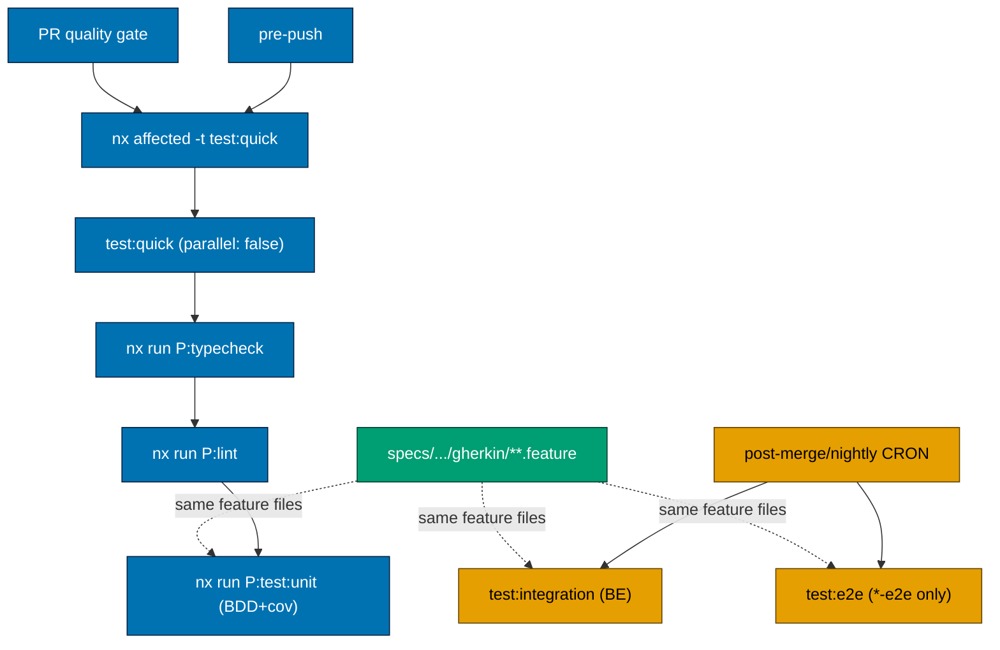
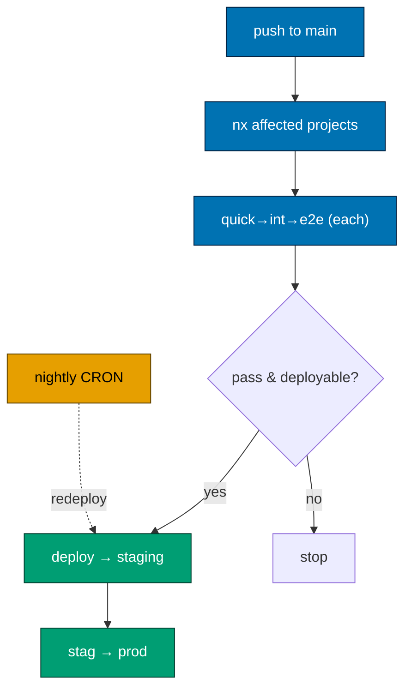
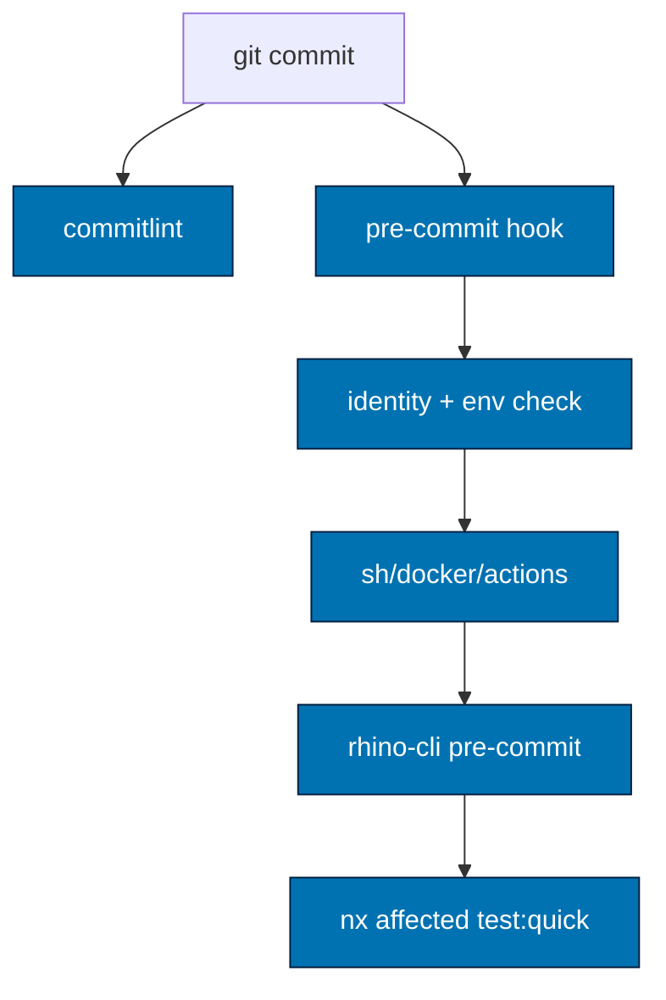
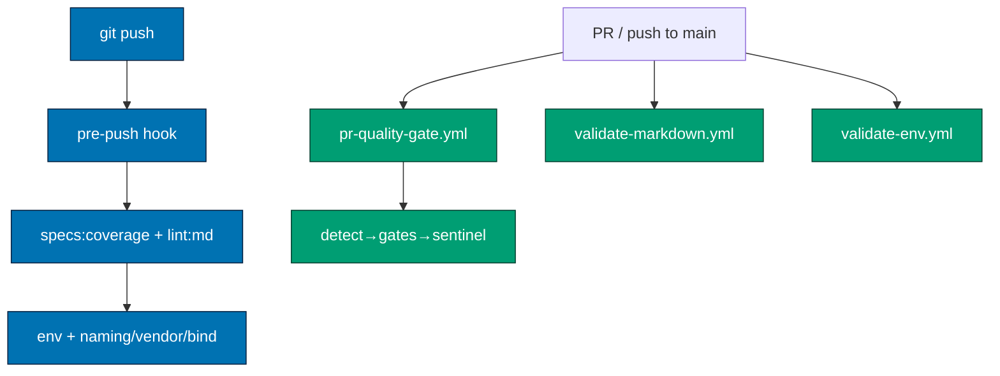
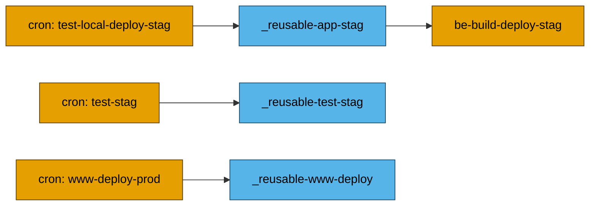
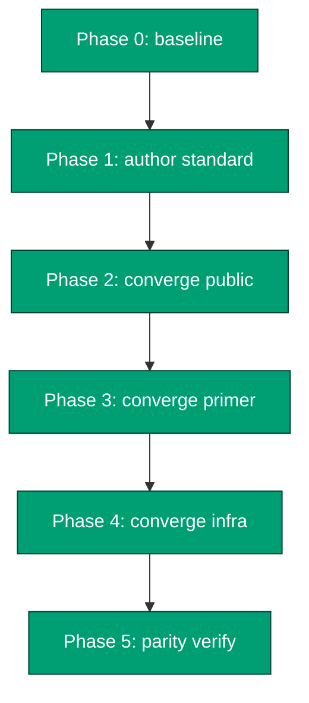

# Tech Docs — Standardize rhino-cli Checks & SDLC Commands

All facts below are grounded in the current commit of each repo (`apps/rhino-cli/src/cli.rs`,
`apps/rhino-cli/project.json`, `.husky/*`, `.github/workflows/*`) unless labelled otherwise.
The gate-check **standard** (§1) comes first; the rhino-cli **command triage** (§2) follows; per-repo
deltas are called out in [§4 Drift Catalog](#4-drift-catalog-per-surface).

## 1. Target Standard (Best-of-Three Synthesis)

The gate-check standard is synthesized by picking the strongest wiring per surface, even where that
means changing `ose-public`. The named winner per surface:

| Surface                                | Standard (winner)                                                                                                              | Rationale                                                                                                                                                                                               |
| -------------------------------------- | ------------------------------------------------------------------------------------------------------------------------------ | ------------------------------------------------------------------------------------------------------------------------------------------------------------------------------------------------------- |
| **commit-msg**                         | `npx --no -- commitlint --edit "$1"` + `@commitlint/config-conventional`                                                       | already identical in all three — lock it                                                                                                                                                                |
| **Lint gates as Nx targets**           | `rhino-cli:shell:check`, `rhino-cli:dockerfiles:check`, `rhino-cli:actions:check` (all 3 repos)                                | wrapping shellcheck/hadolint/actionlint as cacheable Nx targets beats inline shell; `{tool}:check` matches existing `format:check`/`msrv:check`/`deny:check` verb (primer renames its `:lint` variants) |
| **PR quality-gate filename**           | `pr-quality-gate.yml`                                                                                                          | 2-of-3 already use it; "pr" is clearer than "commons" for the gate's role                                                                                                                               |
| **Markdown workflow filename**         | `validate-markdown.yml`                                                                                                        | 2-of-3 already use it; verb-first matches `validate-env.yml`                                                                                                                                            |
| **Env workflow filename**              | `validate-env.yml` (standalone)                                                                                                | infra style; verb-first parity with `validate-markdown.yml`; primer must extract its folded-in env job into a standalone file                                                                           |
| **Markdown validator set**             | mermaid + links + heading-hierarchy + **gherkin-cardinality** (4)                                                              | primer/infra superset; public must add gherkin-cardinality                                                                                                                                              |
| **specs-gate validator set (PR gate)** | adoption + tree + counts + links + coverage + gherkin-cardinality (full)                                                       | public's fuller set wins; primer must promote its deferred structural set                                                                                                                               |
| **pre-push scoped validator set**      | union incl. `governance:vendor-audit-validation`                                                                               | public/infra include it; primer must add it                                                                                                                                                             |
| **pre-commit step order**              | identity → no-env → (sh/docker/actions check, tool-gated) → `git pre-commit` → `nx affected test:quick`                        | already near-identical; lock the order                                                                                                                                                                  |
| **pre-push step order**                | `nx affected -t test:quick` (= typecheck→lint→test:unit) → `lint:md` → `env:validation` → `specs:coverage` → scoped validators | **PR quality gate runs the identical set**; neither gate runs `test:integration`/`test:e2e` (CRON only) — see [§1.2](#12-testing-architecture--target-contents-standard)                                |
| **CRON pipeline shape**                | `*-test-local-deploy-{stag,prod}.yml` + paired `*-test-{stag}.yml` calling shared `_reusable-*` workflows                      | public's reusable-workflow factoring is cleanest; primer/infra keep their own app set but adopt the naming + reusable-call shape                                                                        |

The standard is published as `docs/reference/sdlc-gate-standard.md` (new) in Phase 1, and the triage
as `docs/reference/rhino-cli-command-triage.md` (new).

### 1.1 Nx Target-Name Standard (Targets Invoked by Hooks/CI)

The canonical naming scheme already lives in
[repo-governance/development/infra/nx-targets.md](../../../repo-governance/development/infra/nx-targets.md)
and [nx-target-naming.md](../../../repo-governance/development/infra/nx-target-naming.md): a
**lifecycle scheme** (`build`, `typecheck`, `lint`, `test:unit`, `test:integration`, `test:e2e`,
`test:quick`, `format`, `format:check`, …) and the **`{domain}:{work}` scheme** for
governance/validation targets (`specs:tree-validation`, `links:validation`, `env:validation`, …).
[Repo-grounded]

Every Nx target a hook or CI workflow invokes MUST use a name from that scheme, identical across all
three repos. This plan extends the canonical scheme to close two gaps and converges the rhino-cli
target set. Decisions (locked):

| Decision                      | Standard                                                                                                                                                    | Action                                                                                                                                                                                                |
| ----------------------------- | ----------------------------------------------------------------------------------------------------------------------------------------------------------- | ----------------------------------------------------------------------------------------------------------------------------------------------------------------------------------------------------- |
| **Format/write target**       | `format` (write) paired with `format:check` (verify)                                                                                                        | rename the Rust `fmt` target → `format` in all 3 repos' `apps/rhino-cli/project.json`; add `format` to the canonical lifecycle list in `nx-targets.md` (`fmt` is a non-canonical alias today)         |
| **Tool-lint wrappers**        | `shell:check`, `dockerfiles:check`, `actions:check` as Nx targets                                                                                           | add to public + infra; **rename** primer's existing `shell:lint`/`dockerfiles:lint`/`actions:lint` → `:check`; add the trio to `nx-targets.md` `{domain}:{work}` list (domain = tool, work = `check`) |
| **Binding-parity validation** | `harness:bindings-validation` as an Nx target everywhere                                                                                                    | primer already has it; public + infra invoke it via `npm run harness:bindings-validation` — add the Nx target so the name + mechanism match (canonical name already listed in `nx-targets.md`)        |
| **Structural specs targets**  | `specs:adoption-validation`, `specs:counts-validation`, `specs:links-validation`, `specs:tree-validation`, `test-coverage`, `test:e2e` present on rhino-cli | primer is **missing** all six as standalone targets — add them so the target set matches public/infra                                                                                                 |

After convergence, `jq -r '.targets | keys[]' apps/rhino-cli/project.json` MUST return the **same
sorted key set** in all three repos. [Repo-grounded — current diff in §4.1]

### 1.2 Testing-Architecture & Target-Contents Standard

This subsection extends the standard from target _names_ to target _contents_ and the testing
architecture every project follows. It **revises** parts of
[nx-targets.md](../../../repo-governance/development/infra/nx-targets.md) (which today says "expose
only the targets you need" and treats no-op targets as anti-patterns); the revision is deliberate, to
make `nx affected -t <target>` cover every project uniformly with no special-casing. [Judgment call]

**Definition — project**: a **direct child folder of `apps/` or `libs/`** registered with Nx (i.e.
it has a `project.json`). `apps-labs/` is excluded (not in Nx).

**Mandatory seven targets on every project** (declared even when the body is a no-op `echo`
placeholder, so the affected-graph always resolves them):

`test:unit`, `test:integration`, `test:e2e`, `test:quick`, `lint`, `format`, `typecheck`

(`build` and `specs:coverage` remain required per existing nx-targets.md rules — not part of the
mandatory-seven, but unchanged.)

**Target contents**:

| Target             | Content rule                                                                                                                                                                                                                                                                                                                                                                                                                                           |
| ------------------ | ------------------------------------------------------------------------------------------------------------------------------------------------------------------------------------------------------------------------------------------------------------------------------------------------------------------------------------------------------------------------------------------------------------------------------------------------------ |
| `typecheck`        | real per language (`tsc --noEmit`, `dotnet build`, `cargo check`); `echo` for languages where compilation already covers it and no separate pass exists                                                                                                                                                                                                                                                                                                |
| `lint`             | real for every project (language linter; UI projects add `oxlint --jsx-a11y-plugin`)                                                                                                                                                                                                                                                                                                                                                                   |
| `format`           | real formatter in write mode (`prettier --write`, `rustfmt`, `fantomas`); `echo` only when the project has no formatter                                                                                                                                                                                                                                                                                                                                |
| `test:unit`        | **BDD step tests + non-BDD unit tests**; mocks all I/O; **coverage is measured here** (≥ 90% line); consumes the project's Gherkin feature files                                                                                                                                                                                                                                                                                                       |
| `test:integration` | **BE**: real, **service-level** — calls service/repository functions directly, **never** through the HTTP API (real PostgreSQL via docker-compose). **FE**: `echo` placeholder **unless** the FE has DB-like integration (e.g. `organiclever-app-web`'s PGlite — `vitest --project integration` + `gen-migrations`), in which case it is real and in-process. **libs/CLI**: real where integration tests exist, else `echo`. Consumes the same Gherkin |
| `test:e2e`         | **real (non-`echo`) ONLY on `*-e2e` projects** — Playwright driving the running app over **HTTP/UI** (this is where the **API** surface is exercised). `echo` on every non-e2e project. Consumes the same Gherkin                                                                                                                                                                                                                                      |
| `test:quick`       | **sequential** `nx:run-commands` with `"parallel": false` running, in this exact order: `nx run <project>:typecheck` → `nx run <project>:lint` → `nx run <project>:test:unit`. Reuses each sibling target's definition + Nx cache; the order is guaranteed by `parallel: false`                                                                                                                                                                        |

**Three test levels consume the same Gherkin** — `test:unit`, `test:integration`, and `test:e2e`
all consume the **same** feature files (driven by the same `@tag`, per
[bdd-spec-test-mapping](../../../repo-governance/development/infra/bdd-spec-test-mapping.md)) from:

- **apps**: `specs/apps/<domain>/behavior/<container>/gherkin/**/*.feature` [Repo-grounded]
- **libs**: `specs/libs/<lib>/gherkin/**/*.feature` (no `behavior/<container>` layer) [Repo-grounded]

The level boundary is the I/O depth, not the feature file: unit mocks I/O; BE integration uses real
infra at the service layer (no HTTP); e2e drives HTTP/UI in the `*-e2e` project.

**Feature-consumption enforcement** (rhino-cli) — every `.feature` file under a project's spec dir
MUST be consumed by at least one test in the owning app/lib; an orphan feature fails the gate. This
is folded into the existing `specs validate coverage` command (Nx `specs:coverage`), which today
asserts every Gherkin **step** has a matching step definition; it is extended to **also** assert
every feature **file** is referenced by ≥ 1 test (`--require-consumption`, default on). Failure
message names the orphan: `orphan feature: <path> not consumed by any test`. See
[§2 triage row 34](#2-rhino-cli-command-triage-wired-vs-not-wired) and the delivery steps. [Repo-grounded — current command checks step-defs only; consumption check is new behaviour to add]

**Gate rule (pre-push ≡ PR quality gate)** — both gates run the **exact same** per-project command
for affected projects:

```
nx affected -t test:quick      # = typecheck → lint → test:unit, in order
```

plus the identical governance/spec validator set (`specs:coverage` incl. feature-consumption,
markdown, naming, env). **Neither pre-merge gate runs `test:integration` or `test:e2e`** — those run
**post-merge** (per affected project) plus the nightly CRON fallback (see
[§1.4](#14-post-merge-main-ci--per-project-staging-deploy)). This keeps both pre-merge gates fast and
identical.



### 1.3 Per-Project Target Matrix (post-implementation, ose-public)

The symmetry goal: after this plan, **every** project exposes the **mandatory seven** —
`typecheck`, `lint`, `test:unit`, `test:integration`, `test:e2e`, `test:quick`, `format` — with a
real command or an `echo` placeholder. The matrix below is the post-implementation target state for
ose-public. (`specs:coverage` and `build` are shown too — required where applicable, but not part
of the symmetric seven. Type-specific extras like `dev`/`start`/`run`/`install`/`codegen`/
`storybook`/`test:e2e:ui`/`test:e2e:report` and rhino-cli's governance targets are intentionally
**not** symmetric and are omitted here.)

**Legend**: ✅ real command · `echo` echo placeholder · — not declared (allowed only for the
non-symmetric `build`/`specs:coverage`; the seven are NEVER absent). Target presence is
[Repo-grounded] from each `project.json`; the real-vs-echo classification is a [Judgment call]
derived from the [§1.2 rules](#12-testing-architecture--target-contents-standard) and confirmed per
project during execution.

| Project                    | Type             | typecheck | lint | test:unit |  test:integration  | test:e2e | test:quick | format | specs:coverage | build  |
| -------------------------- | ---------------- | :-------: | :--: | :-------: | :----------------: | :------: | :--------: | :----: | :------------: | :----: |
| `ayokoding-www`            | FE (content)     |    ✅     |  ✅  |    ✅     |       `echo`       |  `echo`  |     ✅     |   ✅   |       ✅       |   ✅   |
| `ose-www`                  | FE (content)     |    ✅     |  ✅  |    ✅     |       `echo`       |  `echo`  |     ✅     |   ✅   |       ✅       |   ✅   |
| `organiclever-www`         | FE (content)     |    ✅     |  ✅  |    ✅     |       `echo`       |  `echo`  |     ✅     |   ✅   |       ✅       |   ✅   |
| `wahidyankf-www`           | FE (content)     |    ✅     |  ✅  |    ✅     |       `echo`       |  `echo`  |     ✅     |   ✅   |       ✅       |   ✅   |
| `organiclever-app-web`     | FE + DB (PGlite) |    ✅     |  ✅  |    ✅     |         ✅         |  `echo`  |     ✅     |   ✅   |       ✅       |   ✅   |
| `ose-app-web`              | FE + DB?         |    ✅     |  ✅  |    ✅     |        ✅¹         |  `echo`  |     ✅     |   ✅   |       ✅       |   ✅   |
| `ose-be`                   | BE (F#)          |    ✅     |  ✅  |    ✅     | ✅ (service-level) |  `echo`  |     ✅     |   ✅   |       ✅       |   ✅   |
| `organiclever-be`          | BE (F#)          |    ✅     |  ✅  |    ✅     | ✅ (service-level) |  `echo`  |     ✅     |   ✅   |       ✅       |   ✅   |
| `ayokoding-cli`            | CLI (Rust)       |    ✅     |  ✅  |    ✅     |         ✅         |  `echo`  |     ✅     |   ✅   |       ✅       |   ✅   |
| `ose-cli`                  | CLI (Rust)       |    ✅     |  ✅  |    ✅     |         ✅         |  `echo`  |     ✅     |   ✅   |       ✅       |   ✅   |
| `rhino-cli`                | CLI (Rust)       |    ✅     |  ✅  |    ✅     |         ✅         |  `echo`  |     ✅     |   ✅   |       ✅       |   ✅   |
| `crane-cli`                | CLI (F#)         |    ✅     |  ✅  |    ✅     |         ✅         |  `echo`  |     ✅     |   ✅   |       ✅       |   ✅   |
| `ayokoding-www-be-e2e`     | E2E runner       |    ✅     |  ✅  |  `echo`   |       `echo`       |    ✅    |     ✅     |   ✅   |       ✅       |   —    |
| `ayokoding-www-fe-e2e`     | E2E runner       |    ✅     |  ✅  |  `echo`   |       `echo`       |    ✅    |     ✅     |   ✅   |       ✅       |   —    |
| `organiclever-www-be-e2e`  | E2E runner       |    ✅     |  ✅  |  `echo`   |       `echo`       | `echo`²  |     ✅     |   ✅   |       ✅       |   —    |
| `organiclever-www-fe-e2e`  | E2E runner       |    ✅     |  ✅  |  `echo`   |       `echo`       |    ✅    |     ✅     |   ✅   |       ✅       |   —    |
| `organiclever-app-web-e2e` | E2E runner       |    ✅     |  ✅  |  `echo`   |       `echo`       |    ✅    |     ✅     |   ✅   |       ✅       |   —    |
| `organiclever-be-e2e`      | E2E runner       |    ✅     |  ✅  |  `echo`   |       `echo`       |    ✅    |     ✅     |   ✅   |       ✅       |   —    |
| `ose-www-be-e2e`           | E2E runner       |    ✅     |  ✅  |  `echo`   |       `echo`       |    ✅    |     ✅     |   ✅   |       ✅       |   —    |
| `ose-www-fe-e2e`           | E2E runner       |    ✅     |  ✅  |  `echo`   |       `echo`       |    ✅    |     ✅     |   ✅   |       ✅       |   —    |
| `ose-app-web-e2e`          | E2E runner       |    ✅     |  ✅  |  `echo`   |       `echo`       |    ✅    |     ✅     |   ✅   |       ✅       |   —    |
| `ose-be-e2e`               | E2E runner       |    ✅     |  ✅  |  `echo`   |       `echo`       |    ✅    |     ✅     |   ✅   |       ✅       |   —    |
| `wahidyankf-www-fe-e2e`    | E2E runner       |    ✅     |  ✅  |  `echo`   |       `echo`       |    ✅    |     ✅     |   ✅   |       ✅       |   —    |
| `rust-commons`             | Lib (Rust)       |    ✅     |  ✅  |    ✅     |        ✅³         |  `echo`  |     ✅     |   ✅   |       ✅       |   ✅   |
| `fsharp-crane-core`        | Lib (F#)         |    ✅     |  ✅  |    ✅     |        ✅³         |  `echo`  |     ✅     |   ✅   |       ✅       |   ✅   |
| `web-ui`                   | Lib (UI)         |    ✅     |  ✅  |    ✅     |        ✅³         |  `echo`  |     ✅     |   ✅   |       ✅       |  ✅⁴   |
| `web-ui-token`             | Lib (tokens)     |    ✅     |  ✅  |    ✅     |       `echo`       |  `echo`  |    ✅⁵     |   ✅   |       ✅       | `echo` |

Footnotes:

1. `ose-app-web` `test:integration` is real **only if** it is DB-backed/local-first (like `organiclever-app-web`'s PGlite); otherwise `echo`. Confirm its storage during execution.
2. `organiclever-www-be-e2e` is a placeholder slot (no backend API yet — [AGENTS.md](../../../AGENTS.md)); `test:e2e` stays `echo` until a backend exists.
3. Lib `test:integration` is real where the lib actually has integration tests today; otherwise `echo`. Confirm per lib.
4. `web-ui` builds via `build-storybook` (no plain `build`); treated as its build artifact.
5. `web-ui-token` currently **lacks `test:quick`** — this plan adds it (the most visible mandatory-seven gap besides `format`).

> **Universal gap — `format`**: **no** ose-public project declares a `format` target today (Rust/F#
> use `fmt`+`format:check`; TS relies on lint-staged). The `format` column is ✅ everywhere above
> **after** this plan adds it (renaming `fmt`→`format` for Rust/F#, adding a `prettier --write`
> `format` for TS/UI). This is the single largest symmetry change. [Repo-grounded]

### 1.3b Per-Project Target Matrix (post-implementation, ose-primer)

Same legend (✅ real · `echo` placeholder · — not declared). Rows are [Repo-grounded] from each
`project.json`; real/echo is a [Judgment call] per §1.2, confirmed during execution.

| Project                     | Type          | typecheck | lint | test:unit | test:integration | test:e2e | test:quick | format | specs:coverage | build |
| --------------------------- | ------------- | :-------: | :--: | :-------: | :--------------: | :------: | :--------: | :----: | :------------: | :---: |
| `crud-be-clojure-pedestal`  | BE (Clojure)  |    ✅     |  ✅  |    ✅     |        ✅        |  `echo`  |     ✅     |   ✅   |       ✅       |  ✅   |
| `crud-be-csharp-aspnetcore` | BE (C#)       |    ✅     |  ✅  |    ✅     |        ✅        |  `echo`  |     ✅     |   ✅   |       ✅       |  ✅   |
| `crud-be-elixir-phoenix`    | BE (Elixir)   |    ✅     |  ✅  |    ✅     |        ✅        |  `echo`  |     ✅     |   ✅   |       ✅       |  ✅   |
| `crud-be-fsharp-giraffe`    | BE (F#)       |    ✅     |  ✅  |    ✅     |        ✅        |  `echo`  |     ✅     |   ✅   |       ✅       |  ✅   |
| `crud-be-golang-gin`        | BE (Go)       |    ✅     |  ✅  |    ✅     |        ✅        |  `echo`  |     ✅     |   ✅   |       ✅       |  ✅   |
| `crud-be-java-springboot`   | BE (Java)     |    ✅     |  ✅  |    ✅     |        ✅        |  `echo`  |     ✅     |   ✅   |       ✅       |  ✅   |
| `crud-be-java-vertx`        | BE (Java)     |    ✅     |  ✅  |    ✅     |        ✅        |  `echo`  |     ✅     |   ✅   |       ✅       |  ✅   |
| `crud-be-kotlin-ktor`       | BE (Kotlin)   |    ✅     |  ✅  |    ✅     |        ✅        |  `echo`  |     ✅     |   ✅   |       ✅       |  ✅   |
| `crud-be-python-fastapi`    | BE (Python)   |    ✅     |  ✅  |    ✅     |        ✅        |  `echo`  |     ✅     |   ✅   |       ✅       |  ✅   |
| `crud-be-rust-axum`         | BE (Rust)     |    ✅     |  ✅  |    ✅     |        ✅        |  `echo`  |     ✅     |   ✅   |       ✅       |  ✅   |
| `crud-be-ts-effect`         | BE (TS)       |    ✅     |  ✅  |    ✅     |        ✅        |  `echo`  |     ✅     |   ✅   |       ✅       |  ✅   |
| `crud-fe-ts-nextjs`         | FE            |    ✅     |  ✅  |    ✅     |      `echo`      |  `echo`  |     ✅     |   ✅   |       ✅       |  ✅   |
| `crud-fe-ts-tanstack-start` | FE            |    ✅     |  ✅  |    ✅     |      `echo`      |  `echo`  |     ✅     |   ✅   |       ✅       |  ✅   |
| `crud-fe-dart-flutterweb`   | FE (Dart)     |    ✅     |  ✅  |    ✅     |      `echo`      |  `echo`  |     ✅     |   ✅   |       ✅       |  ✅   |
| `crud-fs-ts-nextjs`         | Fullstack     |    ✅     |  ✅  |    ✅     |        ✅        |  `echo`  |     ✅     |   ✅   |       ✅       |  ✅   |
| `crud-be-e2e`               | E2E runner    |    ✅     |  ✅  |  `echo`   |      `echo`      |    ✅    |     ✅     |   ✅   |       ✅       |   —   |
| `crud-fe-e2e`               | E2E runner    |    ✅     |  ✅  |  `echo`   |      `echo`      |    ✅    |     ✅     |   ✅   |       ✅       |   —   |
| `rhino-cli`                 | CLI (Rust)    |    ✅     |  ✅  |    ✅     |        ✅        |  `echo`  |     ✅     |   ✅   |       ✅       |  ✅   |
| `clojure-openapi-codegen`   | Lib (codegen) |  `echo`¹  |  ✅  |    ✅     |      `echo`      |  `echo`  |     ✅     |   ✅   |      ✅²       |  ✅   |
| `elixir-cabbage`            | Lib (Elixir)  |    ✅     |  ✅  |    ✅     |      `echo`      |  `echo`  |     ✅     |   ✅   |      ✅²       |   —   |
| `elixir-gherkin`            | Lib (Elixir)  |    ✅     |  ✅  |    ✅     |      `echo`      |  `echo`  |     ✅     |   ✅   |      ✅²       |   —   |
| `elixir-openapi-codegen`    | Lib (Elixir)  |    ✅     |  ✅  |    ✅     |      `echo`      |  `echo`  |     ✅     |   ✅   |      ✅²       |   —   |
| `golang-commons`            | Lib (Go)      |  `echo`¹  |  ✅  |    ✅     |        ✅        |  `echo`  |     ✅     |   ✅   |      ✅²       |   —   |
| `ts-ui-tokens`              | Lib (tokens)  |    ✅     |  ✅  |  `echo`   |      `echo`      |  `echo`  |    ✅³     |   ✅   |      ✅²       |   —   |
| `ts-ui`                     | Lib (UI)      |    ✅     |  ✅  |    ✅     |      `echo`      |  `echo`  |     ✅     |   ✅   |      ✅²       |  ✅⁴  |

Footnotes: ¹ dynamic/compile-typed language (Clojure/Go) — `typecheck` is an `echo` placeholder.
² `specs:coverage` is **added** (not present today) per the all-apps-and-libs rule. ³ `ts-ui-tokens`
today has **only** `lint`+`typecheck` — five of the seven are added (`test:unit`/`test:integration`/
`test:e2e` as `echo`, `test:quick`, `format`). ⁴ `ts-ui` builds via `build-storybook`.

> **Primer gaps (today → after)**: no project has `format` (add everywhere); the 11 `crud-be-*`
> backends + `crud-fs-ts-nextjs` lack a `test:e2e` target (add `echo`); the `crud-fe-*` frontends lack
> `test:integration` + `test:e2e` (add `echo`); the support libs (`clojure-openapi-codegen`,
> `elixir-*`, `golang-commons`, `ts-ui*`) lack 2–5 of the seven. [Repo-grounded]

### 1.3c Per-Project Target Matrix (post-implementation, ose-infra)

| Project             | Type         | typecheck | lint | test:unit |  test:integration  | test:e2e | test:quick | format | specs:coverage | build |
| ------------------- | ------------ | :-------: | :--: | :-------: | :----------------: | :------: | :--------: | :----: | :------------: | :---: |
| `coralpolyp-be`     | BE           |    ✅     |  ✅  |    ✅     | ✅ (service-level) |  `echo`  |     ✅     |   ✅   |       ✅       |  ✅   |
| `coralpolyp-fe`     | FE + DB?     |    ✅     |  ✅  |    ✅     |        ✅¹         |  `echo`  |     ✅     |   ✅   |       ✅       |  ✅   |
| `coralpolyp-be-e2e` | E2E runner   |    ✅     |  ✅  |  `echo`   |       `echo`       |    ✅    |     ✅     |   ✅   |       ✅       |   —   |
| `coralpolyp-fe-e2e` | E2E runner   |    ✅     |  ✅  |  `echo`   |       `echo`       |    ✅    |     ✅     |   ✅   |       ✅       |   —   |
| `rhino-cli`         | CLI (Rust)   |    ✅     |  ✅  |    ✅     |         ✅         |  `echo`  |     ✅     |   ✅   |       ✅       |  ✅   |
| `ts-ui`             | Lib (UI)     |    ✅     |  ✅  |    ✅     |       `echo`       |  `echo`  |     ✅     |   ✅   |      ✅²       |  ✅⁴  |
| `ts-ui-tokens`      | Lib (tokens) |    ✅     |  ✅  |  `echo`   |       `echo`       |  `echo`  |    ✅³     |   ✅   |      ✅²       |   —   |

Footnotes as §1.3b. ¹ `coralpolyp-fe` `test:integration` is real only if DB-backed; else `echo` —
confirm. **Infra gaps**: no `format` anywhere; `ts-ui-tokens` has only `lint`+`typecheck`;
`rhino-cli` lacks the `{tool}:check` + `harness:bindings-validation` Nx targets (§4.1).

### 1.4 Post-Merge (main) CI & Per-Project Staging Deploy

The pre-merge gates (pre-push, PR) run **only** `test:quick` (§1.2). The **heavy** levels and the
deploy happen **post-merge**, on push to `main`:

**Trigger**: push to `main` (a merged PR).

**Per affected project, in isolation** (a matrix job keyed on `nx show projects --affected`, so one
project's failure never blocks another's):

1. `test:quick` (typecheck → lint → test:unit)
2. `test:integration`
3. `test:e2e` (via the project's `*-e2e` runner against a locally stood-up stack)

**Then, if all three pass AND the project is deployable, deploy it to staging — individually**:

| Tier                                 | Deploy-on-merge target                                       | Notes                                                                              |
| ------------------------------------ | ------------------------------------------------------------ | ---------------------------------------------------------------------------------- |
| app-tier (`*-app-web`, `*-be`)       | existing `stag-*` branches → Vercel/k8s staging              | reuses `_reusable-*-test-local-deploy-stag`                                        |
| marketing (`*-www`)                  | **new** `stag-*-www` branch + **new staging Vercel project** | net-new infra (www sites have no staging env today) — provisioning is a setup step |
| non-deployable (libs, CLIs, `*-e2e`) | none                                                         | run tests only                                                                     |

**CRON relationship**: the merge-triggered pipeline is the **primary** staging path. The existing
scheduled `*-test-local-deploy-stag.yml` CRON is **retained at reduced cadence as a nightly
fallback** (re-tests + redeploys to catch dependency drift that lands without a merge).

**Prod**: unchanged — the scheduled **`*-test-stag.yml` → deploy-prod** pipeline promotes staging to
production. Pre-merge never runs integration/e2e; those run post-merge + the CRON fallback only.

**Per-repo deployable sets** (the post-merge **test** matrix runs in all three repos; only the
**deploy** leg differs by what each repo actually ships):

- **ose-public** — app-tier (`*-app-web`, `*-be`) → existing `stag-*`; marketing (`*-www`) → new `stag-*-www` staging. [Repo-grounded]
- **ose-infra** — `coralpolyp-be` + `coralpolyp-fe` → existing coralpolyp staging (`test-and-deploy-coralpolyp-development` reusable logic, now merge-triggered + nightly fallback); on the self-hosted runner. [Repo-grounded]
- **ose-primer** — **template repo**: the `crud-*` demo apps have **no real staging environment** (their `test-and-deploy-*-development` workflows are local-stack test harnesses). Post-merge runs the full per-project **test** matrix; the **deploy leg is a documented no-op** (the demo apps are reference scaffolding, not deployed services). [Judgment call — confirm primer has no live staging target]



> **Infra note**: giving every `*-www` site a staging environment (`stag-*-www` branch + Vercel
> staging project) is net-new. Branch + workflow wiring is `[AI]`; creating the Vercel staging
> projects may need dashboard access (`[HUMAN]` or via the Vercel MCP). Tracked in delivery.

## 2. rhino-cli Command Triage (Wired vs. Not-Wired)

A command is **wired** when some lifecycle automation (a `.husky` hook step, a `.github/workflows`
job, or an Nx target reachable from a hook/CI gate) invokes it. It is **not wired** when it exists
in the CLI but is only runnable by hand or solely via an aggregate `audit` subcommand that no
automation calls. All leaf subcommands are enumerated from `apps/rhino-cli/src/cli.rs`. [Repo-grounded]

| #   | Command (leaf)                               | What it does                                                                                                                                       | Status                   | Invocation site (if wired)                                                                     |
| --- | -------------------------------------------- | -------------------------------------------------------------------------------------------------------------------------------------------------- | ------------------------ | ---------------------------------------------------------------------------------------------- |
| 1   | `test-coverage validate`                     | Check coverage output against a line-based threshold                                                                                               | **wired**                | Nx `test-coverage` target → pre-push parallel set                                              |
| 2   | `repo-governance validate vendor`            | Scan governance markdown for forbidden vendor-specific terms                                                                                       | **wired**                | Nx `governance:vendor-audit-validation` → pre-push (scoped); **drift: not in primer pre-push** |
| 3   | `repo-governance validate layer-coherence`   | Audit governance docs for layer numbering/naming coherence                                                                                         | not wired                | only via `repo-governance audit` (manual)                                                      |
| 4   | `repo-governance validate traceability`      | Audit governance docs for required traceability sections                                                                                           | not wired                | only via `repo-governance audit` (manual)                                                      |
| 5   | `repo-governance audit`                      | Run all deterministic governance audits; emit JSON envelope                                                                                        | not wired                | manual aggregate                                                                               |
| 6   | `md validate naming`                         | Validate markdown filenames are lowercase-kebab-case                                                                                               | not wired                | only via `md audit` (manual)                                                                   |
| 7   | `md validate frontmatter`                    | Validate doc YAML frontmatter against area-specific schemas                                                                                        | not wired                | only via `md audit` (manual)                                                                   |
| 8   | `md validate heading-hierarchy`              | Validate heading hierarchy (one H1, no skipped levels)                                                                                             | **wired**                | Nx `headings:hierarchy-validation` → pre-commit + markdown workflow                            |
| 9   | `md validate links`                          | Validate markdown links (relative paths + `#fragment` anchors resolve)                                                                             | **wired**                | Nx `links:validation` → pre-commit + markdown workflow                                         |
| 10  | `md validate mermaid`                        | Validate Mermaid diagrams (label length, width/span, single-diagram)                                                                               | **wired**                | Nx `mermaid:validation` → pre-commit + markdown workflow                                       |
| 11  | `md validate frontmatter-dates`              | Audit markdown for forbidden manual date metadata                                                                                                  | not wired                | only via `md audit` (manual)                                                                   |
| 12  | `md validate readme-index`                   | Audit directory README indexes against sibling markdown                                                                                            | not wired                | only via `md audit` (manual)                                                                   |
| 13  | `md frontmatter-dates` (alias)               | Alias of `md validate frontmatter-dates`                                                                                                           | not wired                | manual                                                                                         |
| 14  | `md readme-index` (alias)                    | Alias of `md validate readme-index`                                                                                                                | not wired                | manual                                                                                         |
| 15  | `md audit`                                   | Run all md validators in sequence; aggregate findings                                                                                              | not wired                | manual aggregate                                                                               |
| 16  | `convention validate emoji`                  | Audit forbidden file types for emoji codepoints                                                                                                    | not wired                | only via `convention audit` (manual)                                                           |
| 17  | `convention validate license`                | Verify per-directory LICENSE files match the licensing convention                                                                                  | not wired                | only via `convention audit` (manual)                                                           |
| 18  | `convention validate instruction-size`       | Audit all auto-loaded instruction surfaces against per-surface byte budgets (`instruction-size-budget.yaml`); legacy alias: `agents-md-size`       | **wired**                | Nx `rhino-cli:instruction-size:validation` → pre-push (changed-path gate) + PR gate            |
| 19  | `convention audit`                           | Run all convention validators; aggregate findings                                                                                                  | not wired                | manual aggregate                                                                               |
| 20  | `harness validate naming`                    | Validate agent filename suffixes + `.claude`↔`.opencode` mirror parity                                                                             | **wired**                | Nx `naming:harness-validation` → pre-push (scoped) + PR gate                                   |
| 21  | `harness validate duplication`               | Detect verbatim duplication across agent + skill files                                                                                             | not wired                | only via `harness audit` (manual)                                                              |
| 22  | `harness validate claude`                    | Validate Claude Code agent/skill format in `.claude/`                                                                                              | not wired                | npm `validate:claude` (manual script)                                                          |
| 23  | `harness validate sync`                      | Validate `.claude/` and `.opencode/` are in sync                                                                                                   | not wired                | npm `validate:sync` (manual script)                                                            |
| 24  | `harness validate bindings`                  | Validate Amazon Q binding bridge files + catalog coverage                                                                                          | **wired**                | npm `harness:bindings-validation` → pre-push (scoped)                                          |
| 25  | `harness sync opencode`                      | Sync Claude Code agents → OpenCode format                                                                                                          | **wired** `[Unverified]` | pre-commit `git pre-commit` auto-sync (CLAUDE.md claims auto-sync; confirm in Phase 1)         |
| 26  | `harness emit amazonq`                       | Emit Amazon Q Developer binding bridge files (idempotent)                                                                                          | **wired** `[Unverified]` | pre-commit `git pre-commit` auto-sync (confirm in Phase 1)                                     |
| 27  | `harness generate bindings`                  | Generate all platform bindings (sync OpenCode + emit Amazon Q)                                                                                     | **wired** `[Unverified]` | pre-commit auto-sync + npm `generate:bindings` (confirm in Phase 1)                            |
| 28  | `harness audit`                              | Run all harness validators; aggregate findings                                                                                                     | not wired                | manual aggregate                                                                               |
| 29  | `workflows validate naming`                  | Validate workflow filename suffixes + frontmatter name consistency                                                                                 | **wired**                | Nx `naming:workflows-validation` → pre-push (scoped) + PR gate                                 |
| 30  | `specs validate adoption`                    | Verify an app has adopted BDD + DDD practices (no orphan app)                                                                                      | **wired**                | Nx `specs:adoption-validation` → pre-push + PR gate                                            |
| 31  | `specs validate counts`                      | Validate each required spec subfolder has ≥1 spec file                                                                                             | **wired**                | Nx `specs:counts-validation` → pre-push + PR gate                                              |
| 32  | `specs validate links`                       | Check markdown links in spec files resolve                                                                                                         | **wired**                | Nx `specs:links-validation` → pre-push + PR gate                                               |
| 33  | `specs validate tree`                        | Validate canonical C4-aware five-folder spec tree                                                                                                  | **wired**                | Nx `specs:tree-validation` → pre-push + PR gate                                                |
| 34  | `specs validate coverage`                    | Validate every Gherkin step has a matching step definition **and** every feature file is consumed by ≥1 test (`--require-consumption`, new — §1.2) | **wired**                | Nx `specs:coverage` → pre-push + PR gate                                                       |
| 35  | `specs validate bc`                          | Validate bounded-context structural parity against the registry                                                                                    | not wired                | no Nx target; manual                                                                           |
| 36  | `specs validate ul`                          | Validate ubiquitous-language glossary parity against the registry                                                                                  | not wired                | no Nx target; manual                                                                           |
| 37  | `specs validate gherkin-cardinality`         | Audit `.feature` scenarios for repeated primary Given/When/Then keywords                                                                           | **wired**                | Nx `specs:gherkin-cardinality-validation` → PR gate (+ markdown workflow in primer/infra)      |
| 38  | `specs clean java-imports`                   | Strip unused/same-package imports from generated Java contract files                                                                               | not wired                | dormant (primer-oriented)                                                                      |
| 39  | `specs scaffold dart`                        | Generate Dart package scaffolding around generated contract types                                                                                  | not wired                | dormant (primer-oriented)                                                                      |
| 40  | `specs audit`                                | Run all specs validators; aggregate findings                                                                                                       | not wired                | manual aggregate                                                                               |
| 41  | `lang java validate null-safety-annotations` | Check Java packages carry required null-safety annotations                                                                                         | not wired                | dormant (primer-oriented)                                                                      |
| 42  | `git pre-commit`                             | Run the full pre-commit pipeline (config sync, format, doc validation)                                                                             | **wired**                | `.husky/pre-commit`                                                                            |
| 43  | `env init`                                   | Create `.env` files from `.env.example` templates                                                                                                  | not wired                | developer convenience                                                                          |
| 44  | `env backup`                                 | Back up `.env` files from the repository                                                                                                           | not wired                | developer convenience                                                                          |
| 45  | `env restore`                                | Restore `.env` files from a backup                                                                                                                 | not wired                | developer convenience                                                                          |
| 46  | `env validate`                               | Check code↔config drift for all `env-contract.yaml` surfaces                                                                                       | **wired**                | Nx `env:validation` → pre-push + env workflow                                                  |
| 47  | `doctor`                                     | Check required tool versions are installed and correct                                                                                             | **wired**                | `npm install` postinstall + `npm run doctor`                                                   |

**Summary**: ~18 wired, ~29 not-wired. The not-wired set is dominated by (a) per-family `audit`
aggregates and their leaf validators that only `audit` calls, (b) developer-convenience `env`
commands, and (c) dormant primer-oriented `specs clean` / `specs scaffold` / `lang java` commands.
[Repo-grounded — counts approximate pending Phase 1 confirmation of rows 25–27]

> **Phase 1 triage decisions to confirm with maintainer** (not resolved by this plan, recorded as Open Questions):
> whether the `*-audit` aggregates and their leaf validators (emoji, license, agents-md-size, frontmatter, naming, readme-index, layer-coherence, traceability) _should_ be wired into a periodic gate, and whether dormant commands should be removed. Triage only — no wiring change here.

## 3. Divergence Policy (Allowed vs. Drift)

**Allowed divergence** (NOT flagged, recorded in the standard doc):

- **App set & per-app deploy CRONs** — public ships content/web apps (`ose-www`, `ayokoding-www`, `organiclever-www`, `wahidyankf-www`, `*-app-web`, `*-be`); primer ships polyglot demo backends/frontends; infra ships `coralpolyp`. Each repo keeps only the deploy CRON workflows for apps it actually ships. [Repo-grounded]
- **Language gate jobs** — the PR gate's per-language jobs (golang, jvm, dotnet, python, rust, elixir, clojure, dart, typescript) exist only for languages present in that repo. [Repo-grounded]
- **Infra-only IaC gates** — `terraform fmt`/`validate`/`tflint`, `ansible-lint`, `yamllint` exist only in `ose-infra`, in both hooks and the PR gate. [Repo-grounded]
- **Self-hosted runner labels** — infra runs on `[self-hosted, linux, ose-infra-runner]`. [Repo-grounded]
- **lint-staged formatter entries** — only for languages present (e.g. `*.go`, `*.{ex,exs}` exist where that language ships). The common entries (`*.md`, `*.json`, `*.{yml,yaml}`, `*.{css,scss}`, `*.rs`, `*.fs`) MUST match. [Repo-grounded]

**Drift** (MUST converge — this is the work):

- Workflow **filenames** for the shared gates (PR gate, markdown, env).
- The **validator set** inside the markdown workflow and the specs-gate.
- The **invocation mechanism** for shell/docker/actions lint (inline vs. Nx target).
- The **pre-push scoped validator set** (governance vendor audit presence).
- The **job skeleton / names** in the PR gate (detect, format, markdown, naming, env, specs-gate, quality-gate sentinel).
- The **placement** of env validation (standalone workflow vs. folded into the PR gate).
- The **Nx target names** invoked by hooks/CI, and the **rhino-cli target set** itself (see [§4.1](#41-nx-target-name-drift-rhino-cli)): `fmt` vs `format`, missing `{tool}:check` wrappers, `harness:bindings-validation` as Nx target vs npm script, primer's missing structural specs targets.

## 4. Drift Catalog (Per Surface)

| Surface                    | ose-public                  | ose-primer                                  | ose-infra                                     | Action                                                                          |
| -------------------------- | --------------------------- | ------------------------------------------- | --------------------------------------------- | ------------------------------------------------------------------------------- |
| PR gate file               | `commons-quality-gate.yml`  | `pr-quality-gate.yml`                       | `pr-quality-gate.yml`                         | rename public → `pr-quality-gate.yml`                                           |
| Markdown file              | `markdown-validate.yml`     | `validate-markdown.yml`                     | `validate-markdown.yml`                       | rename public → `validate-markdown.yml`                                         |
| Env file                   | `commons-env-validate.yml`  | folded into PR gate                         | `validate-env.yml`                            | rename public → `validate-env.yml`; primer extract standalone                   |
| Markdown validators        | 3 (no gherkin-cardinality)  | 4                                           | 4                                             | public add gherkin-cardinality                                                  |
| specs-gate set             | full                        | coverage + gherkin only                     | run-many tree/counts/links/adoption + gherkin | primer promote structural set                                                   |
| sh/docker/actions lint     | inline shell in hook + jobs | Nx targets `shell/dockerfiles/actions:lint` | inline shell in hook + jobs                   | public + infra add `{tool}:check` Nx targets; primer renames `:lint` → `:check` |
| pre-push governance vendor | yes (scoped)                | no                                          | yes (scoped)                                  | primer add                                                                      |
| env validation placement   | standalone wf               | PR-gate job                                 | standalone wf                                 | primer extract to standalone                                                    |

All cells above are [Repo-grounded] from the Phase-mapping exploration and the workflow-directory
listings.

### 4.1 Nx Target-Name Drift (rhino-cli)

From `jq -r '.targets | keys[]' apps/rhino-cli/project.json` in each repo (current commit). ✅ = target
present, ❌ = absent. [Repo-grounded]

| rhino-cli target                                                                                             | public | primer  | infra | Action                                                |
| ------------------------------------------------------------------------------------------------------------ | :----: | :-----: | :---: | ----------------------------------------------------- |
| `fmt` (write)                                                                                                |   ✅   |   ✅    |  ✅   | rename → `format` in all 3                            |
| `format:check`                                                                                               |   ✅   |   ✅    |  ✅   | keep (already canonical)                              |
| `shell:check` / `dockerfiles:check` / `actions:check`                                                        |   ❌   | `:lint` |  ❌   | add to public + infra; primer rename `:lint`→`:check` |
| `harness:bindings-validation` (Nx target)                                                                    |   ❌   |   ✅    |  ❌   | add Nx target to public + infra (replace npm script)  |
| `specs:adoption-validation` / `specs:counts-validation` / `specs:links-validation` / `specs:tree-validation` |   ✅   |   ❌    |  ✅   | add all four to primer                                |
| `test-coverage`                                                                                              |   ✅   |   ❌    |  ✅   | add to primer                                         |
| `test:e2e`                                                                                                   |   ✅   |   ❌    |  ✅   | add to primer (no-op echo where no e2e)               |

Target convergence acceptance: the sorted `.targets` key set of `apps/rhino-cli/project.json` is
identical across all three repos after Phases 2–4.

## 5. Diagrams

### 5.1 SDLC gate flow (target standard, shared mechanics)





### 5.2 CRON deploy pipeline shape (allowed-divergent app set, identical shape)



### 5.3 Convergence phase flow



## 6. File Impact

| Path (per repo)                                                         | Change                                                                                                                                                                                                                                                                            |
| ----------------------------------------------------------------------- | --------------------------------------------------------------------------------------------------------------------------------------------------------------------------------------------------------------------------------------------------------------------------------- |
| `docs/reference/sdlc-gate-standard.md`                                  | **new** — the §1 standard + §3 divergence policy                                                                                                                                                                                                                                  |
| `docs/reference/rhino-cli-command-triage.md`                            | **new** — the §2 triage table                                                                                                                                                                                                                                                     |
| `.github/workflows/commons-quality-gate.yml` → `pr-quality-gate.yml`    | rename (public only)                                                                                                                                                                                                                                                              |
| `.github/workflows/markdown-validate.yml` → `validate-markdown.yml`     | rename (public only)                                                                                                                                                                                                                                                              |
| `.github/workflows/commons-env-validate.yml` → `validate-env.yml`       | rename (public only)                                                                                                                                                                                                                                                              |
| `.github/workflows/validate-markdown.yml`                               | add gherkin-cardinality validator (public)                                                                                                                                                                                                                                        |
| `.github/workflows/pr-quality-gate.yml`                                 | promote structural specs-gate set (primer); align job skeleton                                                                                                                                                                                                                    |
| `.github/workflows/validate-env.yml`                                    | extract standalone env workflow (primer)                                                                                                                                                                                                                                          |
| `.husky/pre-commit`                                                     | invoke Nx `shell:check`/`dockerfiles:check`/`actions:check` (public); lock step order                                                                                                                                                                                             |
| `.husky/pre-push`                                                       | add `governance:vendor-audit-validation` scoped step (primer); invoke `harness:bindings-validation` Nx target (public+infra); lock step order                                                                                                                                     |
| `apps/rhino-cli/project.json`                                           | rename `fmt`→`format` (all 3); add `shell:check`/`dockerfiles:check`/`actions:check` (public+infra); add `harness:bindings-validation` Nx target (public+infra); add structural specs targets + `test-coverage` + `test:e2e` (primer); primer rename `:lint`→`:check`             |
| `repo-governance/development/infra/nx-targets.md`                       | add `format` to lifecycle list; add `shell:check`/`dockerfiles:check`/`actions:check` to `{domain}:{work}` list; encode the §1.2 mandatory-seven + echo-placeholder rule, the `test:quick` = typecheck→lint→test:unit composition, and the FE/BE `test:integration` rules (all 3) |
| `repo-governance/development/infra/nx-target-naming.md`                 | document the `format` and `{tool}:check` derivations (all 3)                                                                                                                                                                                                                      |
| **every** `apps/*/project.json` and `libs/*/project.json` (all 3 repos) | ensure the §1.2 mandatory-seven targets are present (add `echo` placeholders where missing); set `test:quick` to the sequential typecheck→lint→test:unit composition; apply the FE/BE/`*-e2e` content rules                                                                       |
| `apps/rhino-cli/src/` (+ `specs/apps/rhino/`)                           | extend `specs validate coverage` with the `--require-consumption` orphan-feature check (all 3)                                                                                                                                                                                    |

Exact per-repo cross-references to the workflow filenames and the `fmt`→`format` rename (READMEs,
`repo-governance/`, CI docs, npm scripts in `package.json`) are updated alongside each change —
enumerated in [delivery.md](./delivery.md).

## 7. Rollback

Each phase is a separate set of commits on `main`. Rollback = `git revert` the phase's commits in
the affected repo. The two new reference docs are additive (safe to keep). Workflow renames are the
only potentially-disruptive change; they are verified by a no-op-change CI run inside the phase gate
before the phase is marked done.

## Open Questions

- Rows 25–27 (`harness` auto-sync): is `generate bindings` / `sync opencode` / `emit amazonq` actually invoked by `rhino-cli git pre-commit`, or only by the manual `npm run generate:bindings`? Confirm by reading the `git pre-commit` Rust source in Phase 1. `[Unverified]`
- Should any not-wired `*-audit` aggregate be wired into a periodic (e.g. weekly CRON) governance gate? Out of scope here; recorded for a follow-up.
