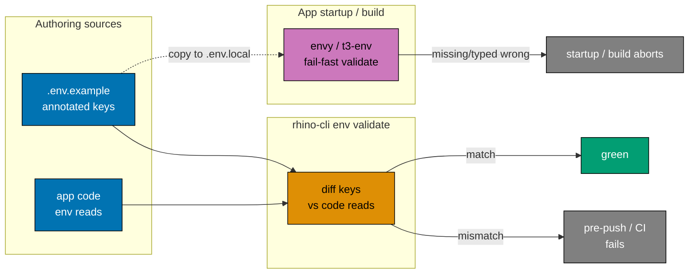

# Standardize Secrets and Environment-Variable Storage

## Context

`ose-public` already enforces a strong **"no secrets in git"** hard iron rule
([no-secrets-in-git.md](../../../repo-governance/conventions/security/no-secrets-in-git.md), renamed
to `no-secrets-in-committed-files.md` by this plan to match the ose-infra canonical name)
[Repo-grounded], the `.env.example` committed / `.env*` gitignored pattern
([`.gitignore:24-31`](../../../.gitignore)) [Repo-grounded], a working `rhino-cli env`
backup/restore/init command family
([2026-04-22\_\_env-backup-restore](../../../plans/done/2026-04-22__env-backup-restore/README.md),
[2026-03-31\_\_env-enhanced-backup-restore](../../../plans/done/2026-03-31__env-enhanced-backup-restore/README.md))
[Repo-grounded], and the `guard-env-file-access` policy that forbids agents from touching real
`.env*` files ([2026-05-24\_\_guard-env-file-access](../../../plans/done/2026-05-24__guard-env-file-access/README.md),
[env-file-access.md](../../../repo-governance/conventions/security/env-file-access.md))
[Repo-grounded]. That foundation is sound and this plan **builds on it — it does not re-implement
it**.

What is **not** standardized is everything around it: how environment variables are **named**,
**where** app env files **live**, whether values are **validated at startup**, how the
`.env.example` files **document** their variables, and whether code and config are **kept in
sync**.

The gaps are concrete in this repo today:

- **Soft-default config, no startup validation.** Both Rust backends load config via
  hand-rolled `unwrap_or_else` defaults that always succeed — a missing or mistyped value silently
  falls back instead of failing fast.
  [`apps/organiclever-be/src/config.rs:22-29`](../../../apps/organiclever-be/src/config.rs) and
  [`apps/ose-app-be/src/config.rs:28-38`](../../../apps/ose-app-be/src/config.rs) [Repo-grounded].
  No Next.js web validates its env at build time.
- **Unprefixed, ad-hoc naming.** Backend vars are bare (`PORT`, `CORS_ORIGINS`, `OPENROUTER_*`),
  while web vars are a mix — `ORGANICLEVER_BE_URL` and `OSE_APP_BE_URL` already carry a per-app
  prefix, but `CONTENT_DIR` and `SHOW_DRAFTS` (read by `ose-web` and `ayokoding-web`) do not
  [Repo-grounded]. There is no rule that says which is correct.
- **Duplicated `.env.example` layout.** Two of the four `infra/dev/<group>/.env.example` files
  duplicate variables that also live in `apps/<app>/.env.example`
  ([`infra/dev/ose-app/.env.example`](../../../infra/dev/ose-app/.env.example) repeats
  `DATABASE_URL`/`OPENROUTER_*` from
  [`apps/ose-app-be/.env.example`](../../../apps/ose-app-be/.env.example)) [Repo-grounded] — a
  contributor must reconcile two sources of truth.
- **Backup misses non-`.env` secrets.** `rhino-cli env backup` both skips every hidden directory
  (so the gitignored `.secrets/` dir is invisible) and matches only basenames starting with `.env`
  (so it silently skips `secrets.json`)
  ([`apps/rhino-cli/src/internal/envbackup.rs:289-299`](../../../apps/rhino-cli/src/internal/envbackup.rs))
  [Repo-grounded].

This plan **consolidates** the three existing governance documents into one hub convention,
**adopts** a per-app naming standard with language-appropriate fail-fast startup validation,
**consolidates** the duplicated env-file layout to `apps/<app>/`, **widens** `rhino-cli env
backup`/`restore` to cover every secret kind (`.env*`, `.secrets/`, `secrets.json`) with a
`--dry-run` preview, and **adds** a `rhino-cli env validate` drift guard wired into the pre-push
hook and CI.

> **No secrets in this plan.** Per the
> [No Secrets in Committed Files](../../../repo-governance/conventions/security/no-secrets-in-git.md)
> (renamed from `no-secrets-in-git.md` to `no-secrets-in-committed-files.md` by this plan) hard
> iron rule, this plan names variables and describes where their values live — never a real value.
> The `.env.example` files this plan touches carry only obviously-dev placeholders.

### How this differs from the ose-infra reference

This plan mirrors the [ose-infra reference plan](#sibling-plans) but is tuned to ose-public's
reality. The output **converges** with the siblings; the divergences are recorded, not silent. The
key tuning points:

- **No IaC today** — ose-public is docker-compose only (no Terraform/Ansible). The Terraform and
  Ansible validators ship as **forward-looking, commented scaffold** in the hub doc and the
  `*.tfvars`/inventory backup patterns ship **commented** — to be activated when IaC is added. The
  reference's live `terraform.tfvars` drift fix and `APP_PORT` drift fix have **no analogue here**
  and are dropped.
- **Builds on prior work** — public already shipped env backup/restore and `guard-env-file-access`.
  This plan extends them (wider backup floor, `--dry-run`, `env validate`) rather than re-creating
  them.
- **Larger naming surface, every app** — full adoption across two Rust backends and five Next.js
  webs, versus the reference's single backend + single frontend.
- **Doc canonicalization (this repo acts)** — public's hard-iron-rule doc is currently
  `no-secrets-in-git.md`; this plan **renames** it to `no-secrets-in-committed-files.md` to match the
  ose-infra canonical name, then folds it (with `env-file-access.md` and
  `reproducible-environments.md`) into the hub, leaving the old paths as stubs and rewriting every
  inbound link.
- **Layout already partly migrated** — backends already have `apps/<app>/.env.example`; this plan
  removes the duplicated `infra/dev/<group>/.env.example` files.

## Scope

### In Scope

- **One hub convention** — `repo-governance/conventions/security/secrets-and-env-standards.md`
  absorbing the substantive content of the three existing docs (naming, layout,
  registry/annotation, validation, storage-tier ladder). `no-secrets-in-git.md` is first **renamed**
  to `no-secrets-in-committed-files.md` (matching the ose-infra canonical name); the three docs then
  become short **stub redirects** preserving inbound links, and **every inbound link is rewritten**
  to the renamed/folded targets; `security/README.md` repoints to the hub.
- **Naming standard** — `SCREAMING_SNAKE_CASE`; per-app prefix (`ORGANICLEVER_BE_*`, `OSE_APP_BE_*`,
  `OSE_WEB_*`, `AYOKODING_WEB_*`, …) for app-defined vars; framework-reserved names (`NEXT_PUBLIC_*`,
  Next.js `PORT`) kept as the framework demands; shared service vars (`DATABASE_URL`) unprefixed; no
  environment tier baked into a name.
- **Full per-app prefix rename across all existing app-defined vars** — backends rename
  `PORT`/`CORS_ORIGINS`/`OPENROUTER_*`; webs rename `CONTENT_DIR`/`SHOW_DRAFTS`; the
  already-prefixed `ORGANICLEVER_BE_URL`/`OSE_APP_BE_URL` are confirmed conforming. `DATABASE_URL`
  stays unprefixed; framework `PORT` and `NEXT_PUBLIC_*` keep their framework names. The rename
  spans `.env.example` files, app code, and every `docker-compose` reference, grep-verified to zero
  residue.
- **Layout consolidation** — remove the duplicated `infra/dev/<group>/.env.example` files; the
  single source of truth for each app's env template is `apps/<app>/.env.example` (Nx-native). Real
  gitignored env-file relocations are **[HUMAN]** (the `guard-env-file-access` guard forbids agents
  touching real `.env*`).
- **Backup/restore tooling — full secret floor, with dry-run** — widen the existing
  `rhino-cli env backup`/`restore` from their current `.env*`-only filter to an explicit secret
  allowlist (`.env*`, every file under `.secrets/`, `secrets.json`) and add a `--dry-run` flag.
  The `*.tfvars`/inventory patterns ship **commented** as forward-scaffold for when IaC is added.
- **Startup validation — full adoption, every app** — Rust backends load config via `dotenvy` +
  `envy` (fail-fast struct deserialize); every Next.js web validates env via `@t3-oss/env-nextjs` +
  `zod` (build-time + `NEXT_PUBLIC_` guarantee). The four new dependencies are introduced under the
  [Dependency Bump Policy](../../../repo-governance/development/workflow/dependency-bump-policy.md)
  Path B — see tech-docs.md § 8.
- **`.env.example` annotation format** — each variable carries a required/optional + type + format
  comment block per the new standard.
- **Drift guard** — new `rhino-cli env validate` subcommand diffing each app's declared
  `.env.example` keys against the env vars the code actually reads, wired into the pre-push hook and
  a CI workflow. Terraform/Ansible validator branches ship as **commented forward-scaffold** (no IaC
  surfaces exist to validate yet).

### Out of Scope

- Adopting SOPS + age / Vault / any secrets manager now (Tier 0 stays; upgrade path only
  documented).
- Re-implementing env backup/restore or the `guard-env-file-access` policy (already shipped — this
  plan extends them).
- Adding any IaC (Terraform/Ansible) — the validators and backup patterns for those surfaces ship
  commented, inactive.
- Re-architecting any web app's config beyond the env-validation boundary.

### Affected Areas

- `apps/organiclever-be/`, `apps/ose-app-be/` (Rust — config loading, Cargo deps, env files)
- `apps/organiclever-web/`, `apps/ose-web/`, `apps/ayokoding-web/`, `apps/ose-app-web/`,
  `apps/wahidyankf-web/` (Next.js — env validation, package deps, env files where present)
- `apps/rhino-cli/` (Rust — widened backup/restore + `--dry-run` + new `env validate` subcommand)
- `infra/dev/organiclever/`, `infra/dev/ose-app/`, `infra/dev/ose-web/`, `infra/dev/ayokoding-web/`
  (compose files; duplicated `.env.example` removed)
- `.gitignore` (verify ignore status; add `!apps/**/.env.example` only if needed)
- `repo-governance/conventions/security/` + `repo-governance/development/workflow/` (hub doc +
  stubs + `security/README.md` repoint)
- `docs/explanation/` (parity-decisions rationale doc)
- `.husky/` (pre-push wiring) and `.github/workflows/` (CI wiring)
- Documentation and convention indexes that reference the three folded docs

## Approach Summary

Two enforcement layers replace the current "documented but unguarded" state: a **build-time** drift
guard (code reads must match declared keys) and a **runtime/build-time** fail-fast validator
(missing or mistyped values abort startup or the build instead of silently defaulting).

## Sibling Plans

This plan is one of three sibling plans applying the same secrets/env standardization across the
Open Sharia Enterprise repository family. The plans converge to the **same end-state output**;
each repo's plan encodes its own deviations (recorded in tech-docs.md § 9). Expected paths (same
slug in each repo):

| Repo                    | Plan path                                                 | Role in this set                                    |
| ----------------------- | --------------------------------------------------------- | --------------------------------------------------- |
| `ose-infra` (reference) | `plans/in-progress/standardize-secrets-and-env/README.md` | Anchor/reference plan (Terraform + Ansible + Rust)  |
| `ose-primer`            | `plans/in-progress/standardize-secrets-and-env/README.md` | Polyglot template; spec-first dual-CLI; 11 backends |
| `ose-public` (this)     | `plans/in-progress/standardize-secrets-and-env/README.md` | Main product monorepo (2 Rust be + 5 Next.js webs)  |

## Plan Navigation

| Document                       | Contents                                                                                                             |
| ------------------------------ | -------------------------------------------------------------------------------------------------------------------- |
| [brd.md](./brd.md)             | Business rationale, goals, success criteria, risks                                                                   |
| [prd.md](./prd.md)             | Personas, user stories, Gherkin acceptance criteria, product scope                                                   |
| [tech-docs.md](./tech-docs.md) | Naming standard, layout, validation, env-subcommand family, drift guard, full deviation matrix, dependency clearance |
| [delivery.md](./delivery.md)   | Phased execution checklist (Phases 0–8) with `[AI]`/`[HUMAN]` markers and per-phase gates                            |

## Delivery Phases at a Glance

| Phase | Title                                                                 | Mode (dominant) |
| ----- | --------------------------------------------------------------------- | --------------- |
| 0     | Environment Setup + Baseline                                          | AI              |
| 1     | Naming Standard — per-app prefix rename (backends + webs + compose)   | AI              |
| 2     | `env backup`/`restore`: full secret floor + `--dry-run`               | AI              |
| 3     | Layout Consolidation — remove duplicated `infra/dev/` env templates   | AI / HUMAN      |
| 4     | Startup Validation (`dotenvy`+`envy`, `@t3-oss/env-nextjs`+`zod`)     | AI              |
| 5     | `.env.example` Annotation Format                                      | AI              |
| 6     | `env validate` Drift Guard (apps; IaC scaffold commented) + CI        | AI              |
| 7     | Hub Convention Doc + Stub Redirects + Rationale Doc + Link Repointing | AI              |
| 8     | Final Quality Gate + Commit + Push                                    | AI              |

Each phase ends with a `### Phase N Gate` (must-pass checks before the next phase) and a **Pause
Safety** note describing the stable resumable state.

## Git Workflow

All work on `main` (Trunk Based Development) inside the declared worktree (see delivery.md,
"Worktree" section) — **worktree-to-main**, direct push to `origin main`, no PR. Commits land **per
phase checkpoint** — each phase's changes committed thematically (Conventional Commits) and pushed
to `origin main` at that phase's gate. The pre-push hook is the live quality gate; CI runs on PRs
and schedule.

## Current Status

In progress — authored 2026-06-09. Execution not started.
