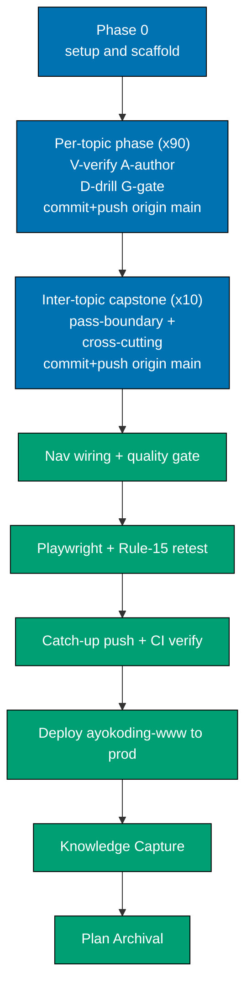

# Delivery Checklist — The Well-Grounded Software Engineer

This checklist is **table-referential**: the canonical topic set, per-topic pass, slug, learning
format, primary language, and weights live in the [prd.md 90-topic table](./prd.md#the-90-topics--canonical-table-spiral-order-identical-in-both-tracks) —
the single source of truth. Each per-topic phase below reads its row from that table and its concrete
items + worked examples + capstone spec from that topic's [syllabus/ file](./syllabus/). When a topic
is added/removed, edit the prd table + its syllabus file, then add or drop the matching phase here.

## Executor Legend

- **[AI]** — an AI agent performs this step autonomously (authoring, web-research, checking,
  git-mechanical steps, committing, and pushing directly to `origin main`).
- **[HUMAN]** — only a human can perform this step (any explicit approval the user chooses to reserve).

Per repo policy, git-mechanical steps (commit, push to `origin main`) are **[AI]** under this delivery
mode. There is no PR and no human-merge gate — work lands directly on `main`.

## Worktree

**Not used.** This plan's delivery mode is `main-to-origin-main`, which works in the **primary
checkout** (no worktree). All work happens on the `main` working tree and is pushed directly to
`origin main`.

See [Plans Organization Convention §Delivery Mode](../../../repo-governance/conventions/structure/plans.md#delivery-mode).

## Delivery Mode: main-to-origin-main

Work in the **primary checkout** on `main` (no worktree, no PR). The AI commits and **pushes directly
to `origin main`**. "Done" = the content is on `origin main` with CI green. Because there is no PR, each
push runs **direct-push + CI post-push verification** instead of the PR-Review Maker→Fixer Cycle.

**Push cadence — commit + push after every completed topic (HARD RULE)**: this plan does **not** batch a
single push at the end. The moment a topic (or inter-topic capstone) phase passes its gate, the AI
**commits and pushes that deliverable to `origin main`** and confirms its `main-ci` run is green before
starting the next phase — so each topic lands green on `main` as it completes. Content is additive and
not yet nav-wired at this stage, so per-topic pushes are safe (nav wiring lands in Phase 101). The
finalization push phase is therefore a **final catch-up + verify** (nav-wiring commit + confirm
`origin/main` fully green), not the sole push.

**Direct-to-main discipline** (per repo memory/policy): stage **explicit paths only** (the new content
files and the two nav `_index.md` edits) — never `git add -A` in this repo. Do not touch git identity.
Commit per domain/concern with Conventional Commit messages.

## Delivery pipeline (per topic, then finalization)

## Weight Scheme (topic-first, DD-26)

`CONTENT = apps/ayokoding-www/content/en/learn/software-engineering/the-well-grounded-software-engineer`.

- **Topic-slug folder** `CONTENT/<slug>/_index.md` → weight `100 + 10 × journey-index` (topic 1 = 110,
  topic 2 = 120, … topic 90 = 1000). The ×10 spacing leaves integer gaps for inter-topic capstones.
- **Learning subfolder** `CONTENT/<slug>/learning/_index.md` → weight = prd **"Learn wt"** (101..190).
- **Drilling subfolder** `CONTENT/<slug>/drilling/_index.md` → weight = prd **"Drill wt"** (201..290),
  with the parity invariant **`Drill wt = Learn wt + 100`**.
- **Intra-topic capstone** `CONTENT/<slug>/learning/capstone/_index.md` → weight **900** (sorts last
  inside `learning/`).
- **Inter-topic capstone** `CONTENT/<capstone-slug>/_index.md` → a weight in the ×10 gap after its
  junction (Pass-0 cap = 135, Pass-1 cap = 275, full-stack-app = 276, Pass-2 cap = 435, Pass-3 cap =
  575, secure-service = 576, data-pipeline = 577, Pass-4 cap = 955, concurrency-showdown = 956, Pass-5
  cap = 1005), each with colocated `code/`.
- **Section root** `CONTENT/_index.md` → weight **1750** (position in the parent SE nav);
  `CONTENT/overview.md` → weight **1** (sorts first inside the section).

## Per-Topic Phase Template

Every topic phase (Phases 1, 2, …, one per canonical topic in journey order) applies these steps with
its row variables `<slug>` / `<idx>` / `<topicWt>=100+10×idx` / `<Lwt>` / `<Dwt>=Lwt+100` / `<lang>` /
`<fmt>` / `<kind>` (subject = full runnable capstone · primer = light consolidation · leadership ‡ =
design/decision artifact, no code). Every step names an explicit path, a verbatim command or agent
invocation, and a concrete acceptance criterion (execution-grade clarity).

1. **[AI] V — Web-verify before authoring (DD-28).** Invoke `web-researcher` for `<slug>`: current
   stable versions, current API/CLI syntax, license status (DD-21), CVE status (DD-23), and current
   best practice for `<lang>`/the subject. Fold the dated findings into the topic's
   `plans/in-progress/the-well-grounded-software-engineer/syllabus/<NN>-<slug>.md` **before** authoring.
   Runs **sequentially, one topic at a time** (token-bounded). **Acceptance**: the syllabus file's
   "Accuracy notes (web-verified)" block is updated with dated findings; no unresolved version/license/CVE
   conflict remains.
2. **[AI] A1 — Author the learning subtree (DD-24, DD-30, DD-31).** Create `CONTENT/<slug>/_index.md`
   (frontmatter `weight: <topicWt>`, links to `learning/` + `drilling/`), `CONTENT/<slug>/learning/_index.md`
   (frontmatter `weight: <Lwt>`), `CONTENT/<slug>/learning/overview.md` (weight 1 — restating the syllabus
   file's **`## Prerequisites`** block verbatim at the top (DD-31: **Prior topics** cross-linked, **Tools &
   environment** tied to the Editor Setup matrix + exact pinned CVE-clean versions, **Assumed knowledge**),
   then the topic's **`Why this exists · the big idea`** opener (DD-33: the problem before the solution, the
   keep-forever mental model, and its Cross-Cutting Big-Idea tags — 2–3 tight lines for primers/Essentials/
   how-to tool topics, richer for judgment topics), then the install command + raw-form run command up
   front, DD-30), and example pages covering **every item
   and worked example in `syllabus/<NN>-<slug>.md`**, with runnable files colocated under
   `CONTENT/<slug>/learning/code/`. **For the ~26 judgment/altitude topics only** (DD-33 list: 9, 18, 20, 21, 22, 23, 27, 30, 31, 32, 33, 36, 38, 42, 43,
   44, 45, 46, 49, 55, 56, 57, 59, 79, 89, 90), the learning content
   additionally carries the **`Tensions & trade-offs`** and **`Lineage`** sections from
   `syllabus/<NN>-<slug>.md`; primers, Essentials, and how-to tool topics **omit** them (padding avoidance).
   `<fmt>` = By Example → invoke `apps-ayokoding-www-by-example-maker`
   (five-part examples in `<lang>`, density 1.0–2.25); `<fmt>` = Annotated-concept → invoke
   `apps-ayokoding-www-general-maker` (annotated worked examples + diagrams); `<fmt>` = Primer → invoke
   `apps-ayokoding-www-by-example-maker` scoped to "just enough". **Acceptance**: files exist with the
   stated weights; `overview.md` carries the three-part Prerequisites block (DD-31); the `Why this exists ·
the big idea` opener is present with ≥1 Cross-Cutting Big-Idea tag drawn from the eight-idea spine
   (DD-33); a judgment/altitude topic carries the Tensions & trade-offs + Lineage sections and a
   non-judgment topic omits them (DD-33); all code in `<lang>`
   (or the documented `†`/`*` exception); every syllabus item/example present; DD-30 follow-along holds
   (versions up front, no elided `...`-only listings, every command shown verbatim with expected output);
   DD-19 (no TODO/TBD/stub/placeholder).
3. **[AI] A2 — Author the intra-topic capstone (DD-27).** Create `CONTENT/<slug>/learning/capstone/_index.md`
   (frontmatter `weight: 900`) and capstone pages built strictly from the capstone spec in
   `syllabus/<NN>-<slug>.md`, with colocated code under `CONTENT/<slug>/learning/capstone/code/`. Scale by
   `<kind>`: **subject** = one cohesive full runnable project; **primer** = a short consolidation program;
   **leadership ‡** = a design/decision capstone producing an artifact (no code). **Acceptance**: the
   capstone states goal/outcome, a concepts-exercised checklist, an ordered step outline (file + code +
   verify command per step), and testable acceptance criteria; it is runnable end-to-end via its stated
   command (or produces the stated artifact for ‡); DD-30 follow-along holds.
4. **[AI] A3 — Check the learning subtree + capstone.** Invoke the matching checker
   (`apps-ayokoding-www-by-example-checker` for By Example/Primer, `apps-ayokoding-www-general-checker` for
   Annotated-concept) across `CONTENT/<slug>/learning/`. **Acceptance**: no unresolved HIGH/CRITICAL
   findings; density/five-part/format floors met.
5. **[AI] D — Author + check the drilling page.** Create `CONTENT/<slug>/drilling/_index.md` (frontmatter
   `weight: <Dwt>`) via `apps-ayokoding-www-general-maker` using the fixed **five-section** anatomy (Recall
   Q&A / Applied problems / Code katas / Self-check checklist / **Elaborative interrogation &
   self-explanation**, DD-33), answers and model explanations hidden in `
`, katas in
   `<lang>` with colocated files under `CONTENT/<slug>/drilling/code/`; then invoke
   `apps-ayokoding-www-general-checker` on the page. The fifth section asks "**why** does this hold, and
   **why not** the alternative?", links back to the topic's Cross-Cutting Big-Idea tags, and — for
   judgment topics — references the topic's Tensions/Lineage material. **Acceptance**: `weight: <Dwt>`
   where `<Dwt> = <Lwt> + 100`; **five** sections present in order (the elaborative section last); every
   answer/explanation inside a `
` block; the elaborative section carries ≥1 why/why-not prompt
   tied to a big-idea tag; checker reports no unresolved HIGH/CRITICAL findings.
6. **[AI] F — Fact-check the topic.** Run `apps-ayokoding-www-facts-checker` (which delegates deep research
   to `web-researcher`) over `CONTENT/<slug>/`. **Acceptance**: no unresolved factual findings
   (commands/versions/APIs/licenses/CVEs verified).
7. **[AI] G — Build + lint gate.** Run `npx nx run ayokoding-www:build` and `npm run lint:md`.
   **Acceptance**: both exit 0 with the new topic subtree in place.

**Cross-cutting per every authored page (DD-32 — Prev/Next navigation).** Steps A1, A2, and D each end
their authored pages with the navigation footer: a horizontal rule followed by
`← Previous: [...] · Next: [...] →` in canonical spiral order (the prior topic's page ← this topic → the
next topic's page). The footer targets mirror the syllabus `NN-<slug>.md` footer chain for the same topic.
**Acceptance (folded into each phase gate)**: the topic's `overview.md`, example/worked-example pages,
capstone page, and drilling page each carry a correctly-ordered Prev/Next footer.

## Inter-Topic Capstone Phase Template

Every inter-topic capstone phase applies these steps with its `<capstone-slug>` / `<capstoneWt>` /
`<junction>` (the topics it integrates) from the [Capstone Policy](./prd.md#capstone-policy-dd-27) and
its full spec in the anchoring `syllabus/<NN>-*.md` file:

1. **[AI] Web-verify the capstone stack (DD-28).** Invoke `web-researcher` for the integrated stack;
   fold findings into the capstone's syllabus spec. **Acceptance**: spec's accuracy notes updated; no
   unresolved version/license/CVE conflict.
2. **[AI] Author the capstone bundle.** Create `CONTENT/<capstone-slug>/_index.md` (frontmatter
   `weight: <capstoneWt>`) + pages from the syllabus spec, with colocated code under
   `CONTENT/<capstone-slug>/code/`, integrating `<junction>` end-to-end. **For the 6 pass-boundary
   capstones only** (`capstone-forge-ready`, `capstone-first-working-software`, `capstone-solid-core`,
   `capstone-real-world-delivery`, `capstone-concurrency-and-systems`, `capstone-lead-at-altitude`),
   append a short **Pass retrospective / synthesis** section (DD-33): which Cross-Cutting Big Ideas
   recurred across the pass, how they compounded, and 2–3 self-explanation prompts asking the reader to
   articulate the pass's throughline in their own words. The 4 cross-cutting capstones omit it (they
   integrate a slice, not a whole pass). **Acceptance**: goal, ordered
   steps (file + code + verify command each), and acceptance criteria present; runnable end-to-end via
   the stated command; a pass-boundary capstone carries the Pass retrospective section naming ≥2 big-idea
   tags and a cross-cutting capstone omits it (DD-33); DD-30 follow-along holds; DD-19 no stubs; each page
   ends with a correctly-ordered Prev/Next footer (DD-32).
3. **[AI] Check + fact-check.** Invoke `apps-ayokoding-www-general-checker` then
   `apps-ayokoding-www-facts-checker` on `CONTENT/<capstone-slug>/`. **Acceptance**: no unresolved
   HIGH/CRITICAL or factual findings.
4. **[AI] Build + lint.** `npx nx run ayokoding-www:build` and `npm run lint:md`. **Acceptance**: both
   exit 0.

---

## Phase 0 — Environment Setup, Baseline, and Section Scaffold

- [ ] **[AI]** Confirm the primary checkout is on `main` and synced: run `git checkout main` then
      `git pull origin main`. **Acceptance**: on branch `main`, up to date with `origin/main`, working
      tree clean.
- [ ] **[AI]** Initialize toolchain: run `npm install` then `npm run doctor -- --fix` in the primary
      checkout. **Acceptance**: both exit 0; no missing-tool warnings.
- [ ] **[AI]** Baseline the target project: run `npx nx run ayokoding-www:build`. **Acceptance**: exits 0
      (clean baseline before any new content).
- [ ] **[AI]** Baseline markdown lint: run `npm run lint:md` (or `npm run lint:md:fix`). **Acceptance**:
      exits 0 on the existing tree, or only auto-fixable issues that fix cleanly.
- [ ] **[AI]** Scaffold the section root: create `CONTENT/_index.md` (frontmatter `weight: 1750`, title
      "The Well-Grounded Software Engineer", intro + link list to the journey map) and `CONTENT/overview.md`
      (weight 1 — read-then-drill workflow, the Pass 0 + five-pass spiral Mermaid map and the 90-node skill
      tree from [prd.md](./prd.md), accessible WCAG palette). **Acceptance**: both files exist;
      `npx nx run ayokoding-www:build` still exits 0.

### Phase 0 Gate

> All checks below must pass before starting Phase 1.

- [ ] [AI] `npx nx run ayokoding-www:build` — exits 0 with the scaffold in place.
- [ ] [AI] `npm run lint:md` — passes.
- [ ] [AI] Section root renders with `weight: 1750`; `overview.md` renders with `weight: 1` and shows the
      journey map + skill tree with the WCAG palette.

> **Pause Safety**: The section is additive scaffold only — no topic content yet, nav not wired into the
> parent SE index. Safe to pause here; the live site is unaffected because the section is not yet linked.

---

## Pass 0 — Editor Foundations (Phases 1-4 + Pass-0 capstone)

## Phase 1 — Topic 01 Just Enough Nvim (`just-enough-nvim`)

Row: Primer · Neovim § · topic wt 110 · Learn 101 / Drill 201 · **primer**. Template →
[`syllabus/01-just-enough-nvim.md`](./syllabus/01-just-enough-nvim.md).

- [ ] **[AI] V** — `web-researcher` for `just-enough-nvim`; resolve every Accuracy-notes "to verify" line in
      [`syllabus/01-just-enough-nvim.md`](./syllabus/01-just-enough-nvim.md) and fold dated findings back into that file.
      **Acceptance**: no unresolved "verify" line remains.
- [ ] **[AI] A1** — Author `CONTENT/just-enough-nvim/learning/` (+ `code/`, runnable sources, DD-20) covering **every**
      Item and all three Worked examples in `syllabus/01-just-enough-nvim.md`, each rendered runnable (DD-20/DD-30).
      **Acceptance**: every syllabus Item + worked example appears with its expected output.
- [ ] **[AI] A2 (capstone)** — Author `CONTENT/just-enough-nvim/learning/capstone/` (`_index.md` weight 900) per the
      syllabus `## Capstone spec`. **Acceptance**: the done bar is met and the concepts-exercised checklist
      is fully hit.
- [ ] **[AI] A3/D/F/G** — `apps-ayokoding-www-by-example-checker` + `apps-ayokoding-www-link-checker` +
      `apps-ayokoding-www-facts-checker` clean (resolve via matching fixer); author
      `CONTENT/just-enough-nvim/drilling/_index.md` (wt 201) covering the same Items with mocked/self-contained
      inputs; `npx nx run ayokoding-www:build` + `npm run lint:md` exit 0.

### Phase 1 Gate

- [ ] [AI] `just-enough-nvim/` complete: `_index.md` wt 110, `learning/_index.md` wt 101,
      `drilling/_index.md` wt 201, capstone wt 900; every Item + 3 worked examples + capstone present;
      checkers + facts-checker clean; build + `lint:md` exit 0.

- [ ] **[AI]** Commit + push this deliverable to `origin main`: stage only this phase's paths (`git add <explicit paths>` — never `git add -A`), commit with a Conventional Commit message (`Co-Authored-By` trailer per repo policy), then `git push origin main`. Observe the `main-ci` workflow on the pushed commit and poll every 2 min (CI-monitoring policy) until it finishes. **Acceptance**: `origin/main` contains this phase's commit and its `main-ci` run has `conclusion = success` **before the next phase begins** — each topic lands green on `main` as it completes.

> **Pause Safety**: Topic self-contained, not yet nav-wired. Safe to pause.

## Phase 2 — Topic 02 Just Enough Lua (`just-enough-lua`)

Row: Primer · Lua † · topic wt 120 · Learn 102 / Drill 202 · **primer**. Template →
[`syllabus/02-just-enough-lua.md`](./syllabus/02-just-enough-lua.md).

- [ ] **[AI] V** — `web-researcher` for `just-enough-lua`; resolve every Accuracy-notes "to verify" line in
      [`syllabus/02-just-enough-lua.md`](./syllabus/02-just-enough-lua.md) and fold dated findings back into that file.
      **Acceptance**: no unresolved "verify" line remains.
- [ ] **[AI] A1** — Author `CONTENT/just-enough-lua/learning/` (+ `code/`, runnable sources, DD-20) covering **every**
      Item and all three Worked examples in `syllabus/02-just-enough-lua.md`, each rendered runnable (DD-20/DD-30).
      **Acceptance**: every syllabus Item + worked example appears with its expected output.
- [ ] **[AI] A2 (capstone)** — Author `CONTENT/just-enough-lua/learning/capstone/` (`_index.md` weight 900) per the
      syllabus `## Capstone spec`. **Acceptance**: the done bar is met and the concepts-exercised checklist
      is fully hit.
- [ ] **[AI] A3/D/F/G** — `apps-ayokoding-www-by-example-checker` + `apps-ayokoding-www-link-checker` +
      `apps-ayokoding-www-facts-checker` clean (resolve via matching fixer); author
      `CONTENT/just-enough-lua/drilling/_index.md` (wt 202) covering the same Items with mocked/self-contained
      inputs; `npx nx run ayokoding-www:build` + `npm run lint:md` exit 0.

### Phase 2 Gate

- [ ] [AI] `just-enough-lua/` complete: `_index.md` wt 120, `learning/_index.md` wt 102,
      `drilling/_index.md` wt 202, capstone wt 900; every Item + 3 worked examples + capstone present;
      checkers + facts-checker clean; build + `lint:md` exit 0.

- [ ] **[AI]** Commit + push this deliverable to `origin main`: stage only this phase's paths (`git add <explicit paths>` — never `git add -A`), commit with a Conventional Commit message (`Co-Authored-By` trailer per repo policy), then `git push origin main`. Observe the `main-ci` workflow on the pushed commit and poll every 2 min (CI-monitoring policy) until it finishes. **Acceptance**: `origin/main` contains this phase's commit and its `main-ci` run has `conclusion = success` **before the next phase begins** — each topic lands green on `main` as it completes.

> **Pause Safety**: Topic self-contained, not yet nav-wired. Safe to pause.

## Phase 3 — Topic 03 Extending Neovim (`extending-neovim`)

Row: By Example · Lua † · topic wt 130 · Learn 103 / Drill 203 · **subject**. Template →
[`syllabus/03-extending-neovim.md`](./syllabus/03-extending-neovim.md).

- [ ] **[AI] V** — `web-researcher` for `extending-neovim`; resolve every Accuracy-notes "to verify" line in
      [`syllabus/03-extending-neovim.md`](./syllabus/03-extending-neovim.md) and fold dated findings back into that file.
      **Acceptance**: no unresolved "verify" line remains.
- [ ] **[AI] A1** — Author `CONTENT/extending-neovim/learning/` (+ `code/`, runnable sources, DD-20) covering **every**
      Item and all three Worked examples in `syllabus/03-extending-neovim.md`, each rendered runnable (DD-20/DD-30).
      **Acceptance**: every syllabus Item + worked example appears with its expected output.
- [ ] **[AI] A2 (capstone)** — Author `CONTENT/extending-neovim/learning/capstone/` (`_index.md` weight 900) per the
      syllabus `## Capstone spec`. **Acceptance**: the done bar is met and the concepts-exercised checklist
      is fully hit.
- [ ] **[AI] A3/D/F/G** — `apps-ayokoding-www-by-example-checker` + `apps-ayokoding-www-link-checker` +
      `apps-ayokoding-www-facts-checker` clean (resolve via matching fixer); author
      `CONTENT/extending-neovim/drilling/_index.md` (wt 203) covering the same Items with mocked/self-contained
      inputs; `npx nx run ayokoding-www:build` + `npm run lint:md` exit 0.

### Phase 3 Gate

- [ ] [AI] `extending-neovim/` complete: `_index.md` wt 130, `learning/_index.md` wt 103,
      `drilling/_index.md` wt 203, capstone wt 900; every Item + 3 worked examples + capstone present;
      checkers + facts-checker clean; build + `lint:md` exit 0.

- [ ] **[AI]** Commit + push this deliverable to `origin main`: stage only this phase's paths (`git add <explicit paths>` — never `git add -A`), commit with a Conventional Commit message (`Co-Authored-By` trailer per repo policy), then `git push origin main`. Observe the `main-ci` workflow on the pushed commit and poll every 2 min (CI-monitoring policy) until it finishes. **Acceptance**: `origin/main` contains this phase's commit and its `main-ci` run has `conclusion = success` **before the next phase begins** — each topic lands green on `main` as it completes.

> **Pause Safety**: Topic self-contained, not yet nav-wired. Safe to pause.

## Phase 4 — Inter-topic: Pass-0 Capstone (`capstone-forge-ready`)

Junction: Topics 01–03 (nvim + lua + extending). Apply the Inter-Topic Capstone Phase Template.
**Detail source**: [`syllabus/03-extending-neovim.md`](./syllabus/03-extending-neovim.md) §"inter-topic:
`capstone-forge-ready`".

- [ ] **[AI] V** — `web-researcher` confirms the pinned Neovim + plugin versions still current/CVE-clean
      at build time (reuse topic-03 findings). **Acceptance**: versions confirmed or updated in the spec.
- [ ] **[AI] A** — Author `CONTENT/capstone-forge-ready/` (`_index.md` `weight: 135`, + `code/`) per the
      spec's ordered steps: (1) `code/nvim-config/` self-contained config repo with a pinned plugin
      lockfile — verify `XDG_CONFIG_HOME=$(mktemp -d) nvim --headless "+checkhealth" "+qa"` bootstraps
      healthy; (2) `code/sample-project/` Python project opened in the forge with working LSP+Treesitter;
      (3) a scripted mouse-free refactor across it (motions+macros+quickfix) with a saved transcript;
      (4) a `:terminal` check beside the source. **Acceptance**: a clean-machine reader reproduces the
      forge, opens the sample with LSP+Treesitter, and replays the transcript to the identical result.
- [ ] **[AI] Check/Fact/Build** — checker + facts-checker clean; `npx nx run ayokoding-www:build` +
      `npm run lint:md` exit 0.

### Phase 4 Gate

- [ ] [AI] `capstone-forge-ready/` complete (wt 135); all four ordered steps present and the
      done bar met (clean-machine reproduction runnable end-to-end + web-verified); checker +
      facts-checker clean; build + `lint:md` exit 0.

- [ ] **[AI]** Commit + push this deliverable to `origin main`: stage only this phase's paths (`git add <explicit paths>` — never `git add -A`), commit with a Conventional Commit message (`Co-Authored-By` trailer per repo policy), then `git push origin main`. Observe the `main-ci` workflow on the pushed commit and poll every 2 min (CI-monitoring policy) until it finishes. **Acceptance**: `origin/main` contains this phase's commit and its `main-ci` run has `conclusion = success` **before the next phase begins** — each topic lands green on `main` as it completes.

> **Pause Safety**: Additive capstone folder, not yet nav-wired. Safe to pause.

---

## Pass 1 — Core Foundations (Phases 5-21 + Pass-1 + full-stack capstones)

## Phase 5 — Topic 04 Just Enough Python (`just-enough-python`)

Row: Primer · Python · topic wt 140 · Learn 104 / Drill 204 · **primer**. Template →
[`syllabus/04-just-enough-python.md`](./syllabus/04-just-enough-python.md).

- [ ] **[AI] V** — `web-researcher` for `just-enough-python`; resolve every Accuracy-notes "to verify" line in
      [`syllabus/04-just-enough-python.md`](./syllabus/04-just-enough-python.md) and fold dated findings back into that file.
      **Acceptance**: no unresolved "verify" line remains.
- [ ] **[AI] A1** — Author `CONTENT/just-enough-python/learning/` (+ `code/`, runnable sources, DD-20) covering **every**
      Item and all three Worked examples in `syllabus/04-just-enough-python.md`, each rendered runnable (DD-20/DD-30).
      **Acceptance**: every syllabus Item + worked example appears with its expected output.
- [ ] **[AI] A2 (capstone)** — Author `CONTENT/just-enough-python/learning/capstone/` (`_index.md` weight 900) per the
      syllabus `## Capstone spec`. **Acceptance**: the done bar is met and the concepts-exercised checklist
      is fully hit.
- [ ] **[AI] A3/D/F/G** — `apps-ayokoding-www-by-example-checker` + `apps-ayokoding-www-link-checker` +
      `apps-ayokoding-www-facts-checker` clean (resolve via matching fixer); author
      `CONTENT/just-enough-python/drilling/_index.md` (wt 204) covering the same Items with mocked/self-contained
      inputs; `npx nx run ayokoding-www:build` + `npm run lint:md` exit 0.

### Phase 5 Gate

- [ ] [AI] `just-enough-python/` complete: `_index.md` wt 140, `learning/_index.md` wt 104,
      `drilling/_index.md` wt 204, capstone wt 900; every Item + 3 worked examples + capstone present;
      checkers + facts-checker clean; build + `lint:md` exit 0.

- [ ] **[AI]** Commit + push this deliverable to `origin main`: stage only this phase's paths (`git add <explicit paths>` — never `git add -A`), commit with a Conventional Commit message (`Co-Authored-By` trailer per repo policy), then `git push origin main`. Observe the `main-ci` workflow on the pushed commit and poll every 2 min (CI-monitoring policy) until it finishes. **Acceptance**: `origin/main` contains this phase's commit and its `main-ci` run has `conclusion = success` **before the next phase begins** — each topic lands green on `main` as it completes.

> **Pause Safety**: Topic self-contained, not yet nav-wired. Safe to pause.

## Phase 6 — Topic 05 Just Enough Bash (`just-enough-bash`)

Row: Primer · Bash/shell † · topic wt 150 · Learn 105 / Drill 205 · **primer**. Template →
[`syllabus/05-just-enough-bash.md`](./syllabus/05-just-enough-bash.md).

- [ ] **[AI] V** — `web-researcher` for `just-enough-bash`; resolve every Accuracy-notes "to verify" line in
      [`syllabus/05-just-enough-bash.md`](./syllabus/05-just-enough-bash.md) and fold dated findings back into that file.
      **Acceptance**: no unresolved "verify" line remains.
- [ ] **[AI] A1** — Author `CONTENT/just-enough-bash/learning/` (+ `code/`, runnable sources, DD-20) covering **every**
      Item and all three Worked examples in `syllabus/05-just-enough-bash.md`, each rendered runnable (DD-20/DD-30).
      **Acceptance**: every syllabus Item + worked example appears with its expected output.
- [ ] **[AI] A2 (capstone)** — Author `CONTENT/just-enough-bash/learning/capstone/` (`_index.md` weight 900) per the
      syllabus `## Capstone spec`. **Acceptance**: the done bar is met and the concepts-exercised checklist
      is fully hit.
- [ ] **[AI] A3/D/F/G** — `apps-ayokoding-www-by-example-checker` + `apps-ayokoding-www-link-checker` +
      `apps-ayokoding-www-facts-checker` clean (resolve via matching fixer); author
      `CONTENT/just-enough-bash/drilling/_index.md` (wt 205) covering the same Items with mocked/self-contained
      inputs; `npx nx run ayokoding-www:build` + `npm run lint:md` exit 0.

### Phase 6 Gate

- [ ] [AI] `just-enough-bash/` complete: `_index.md` wt 150, `learning/_index.md` wt 105,
      `drilling/_index.md` wt 205, capstone wt 900; every Item + 3 worked examples + capstone present;
      checkers + facts-checker clean; build + `lint:md` exit 0.

- [ ] **[AI]** Commit + push this deliverable to `origin main`: stage only this phase's paths (`git add <explicit paths>` — never `git add -A`), commit with a Conventional Commit message (`Co-Authored-By` trailer per repo policy), then `git push origin main`. Observe the `main-ci` workflow on the pushed commit and poll every 2 min (CI-monitoring policy) until it finishes. **Acceptance**: `origin/main` contains this phase's commit and its `main-ci` run has `conclusion = success` **before the next phase begins** — each topic lands green on `main` as it completes.

> **Pause Safety**: Topic self-contained, not yet nav-wired. Safe to pause.

## Phase 7 — Topic 06 Version Control & Git (`version-control-and-git`)

Row: By Example · Git † · topic wt 160 · Learn 106 / Drill 206 · **subject**. Template →
[`syllabus/06-version-control-and-git.md`](./syllabus/06-version-control-and-git.md).

- [ ] **[AI] V** — `web-researcher` for `version-control-and-git`; resolve every Accuracy-notes "to verify" line in
      [`syllabus/06-version-control-and-git.md`](./syllabus/06-version-control-and-git.md) and fold dated findings back into that file.
      **Acceptance**: no unresolved "verify" line remains.
- [ ] **[AI] A1** — Author `CONTENT/version-control-and-git/learning/` (+ `code/`, runnable sources, DD-20) covering **every**
      Item and all three Worked examples in `syllabus/06-version-control-and-git.md`, each rendered runnable (DD-20/DD-30).
      **Acceptance**: every syllabus Item + worked example appears with its expected output.
- [ ] **[AI] A2 (capstone)** — Author `CONTENT/version-control-and-git/learning/capstone/` (`_index.md` weight 900) per the
      syllabus `## Capstone spec`. **Acceptance**: the done bar is met and the concepts-exercised checklist
      is fully hit.
- [ ] **[AI] A3/D/F/G** — `apps-ayokoding-www-by-example-checker` + `apps-ayokoding-www-link-checker` +
      `apps-ayokoding-www-facts-checker` clean (resolve via matching fixer); author
      `CONTENT/version-control-and-git/drilling/_index.md` (wt 206) covering the same Items with mocked/self-contained
      inputs; `npx nx run ayokoding-www:build` + `npm run lint:md` exit 0.

### Phase 7 Gate

- [ ] [AI] `version-control-and-git/` complete: `_index.md` wt 160, `learning/_index.md` wt 106,
      `drilling/_index.md` wt 206, capstone wt 900; every Item + 3 worked examples + capstone present;
      checkers + facts-checker clean; build + `lint:md` exit 0.

- [ ] **[AI]** Commit + push this deliverable to `origin main`: stage only this phase's paths (`git add <explicit paths>` — never `git add -A`), commit with a Conventional Commit message (`Co-Authored-By` trailer per repo policy), then `git push origin main`. Observe the `main-ci` workflow on the pushed commit and poll every 2 min (CI-monitoring policy) until it finishes. **Acceptance**: `origin/main` contains this phase's commit and its `main-ci` run has `conclusion = success` **before the next phase begins** — each topic lands green on `main` as it completes.

> **Pause Safety**: Topic self-contained, not yet nav-wired. Safe to pause.

## Phase 8 — Topic 07 Data Structures & Algorithms Essentials (`data-structures-and-algorithms-essentials`)

Row: By Example · Python · topic wt 170 · Learn 107 / Drill 207 · **subject**. Template →
[`syllabus/07-data-structures-and-algorithms-essentials.md`](./syllabus/07-data-structures-and-algorithms-essentials.md).

- [ ] **[AI] V** — `web-researcher` for `data-structures-and-algorithms-essentials`; resolve every Accuracy-notes "to verify" line in
      [`syllabus/07-data-structures-and-algorithms-essentials.md`](./syllabus/07-data-structures-and-algorithms-essentials.md) and fold dated findings back into that file.
      **Acceptance**: no unresolved "verify" line remains.
- [ ] **[AI] A1** — Author `CONTENT/data-structures-and-algorithms-essentials/learning/` (+ `code/`, runnable sources, DD-20) covering **every**
      Item and all three Worked examples in `syllabus/07-data-structures-and-algorithms-essentials.md`, each rendered runnable (DD-20/DD-30).
      **Acceptance**: every syllabus Item + worked example appears with its expected output.
- [ ] **[AI] A2 (capstone)** — Author `CONTENT/data-structures-and-algorithms-essentials/learning/capstone/` (`_index.md` weight 900) per the
      syllabus `## Capstone spec`. **Acceptance**: the done bar is met and the concepts-exercised checklist
      is fully hit.
- [ ] **[AI] A3/D/F/G** — `apps-ayokoding-www-by-example-checker` + `apps-ayokoding-www-link-checker` +
      `apps-ayokoding-www-facts-checker` clean (resolve via matching fixer); author
      `CONTENT/data-structures-and-algorithms-essentials/drilling/_index.md` (wt 207) covering the same Items with mocked/self-contained
      inputs; `npx nx run ayokoding-www:build` + `npm run lint:md` exit 0.

### Phase 8 Gate

- [ ] [AI] `data-structures-and-algorithms-essentials/` complete: `_index.md` wt 170, `learning/_index.md` wt 107,
      `drilling/_index.md` wt 207, capstone wt 900; every Item + 3 worked examples + capstone present;
      checkers + facts-checker clean; build + `lint:md` exit 0.

- [ ] **[AI]** Commit + push this deliverable to `origin main`: stage only this phase's paths (`git add <explicit paths>` — never `git add -A`), commit with a Conventional Commit message (`Co-Authored-By` trailer per repo policy), then `git push origin main`. Observe the `main-ci` workflow on the pushed commit and poll every 2 min (CI-monitoring policy) until it finishes. **Acceptance**: `origin/main` contains this phase's commit and its `main-ci` run has `conclusion = success` **before the next phase begins** — each topic lands green on `main` as it completes.

> **Pause Safety**: Topic self-contained, not yet nav-wired. Safe to pause.

## Phase 9 — Topic 08 Object-Oriented Programming Essentials (`object-oriented-programming-essentials`)

Row: By Example · Python · topic wt 180 · Learn 108 / Drill 208 · **subject**. Template →
[`syllabus/08-object-oriented-programming-essentials.md`](./syllabus/08-object-oriented-programming-essentials.md).

- [ ] **[AI] V** — `web-researcher` for `object-oriented-programming-essentials`; resolve every Accuracy-notes "to verify" line in
      [`syllabus/08-object-oriented-programming-essentials.md`](./syllabus/08-object-oriented-programming-essentials.md) and fold dated findings back into that file.
      **Acceptance**: no unresolved "verify" line remains.
- [ ] **[AI] A1** — Author `CONTENT/object-oriented-programming-essentials/learning/` (+ `code/`, runnable sources, DD-20) covering **every**
      Item and all three Worked examples in `syllabus/08-object-oriented-programming-essentials.md`, each rendered runnable (DD-20/DD-30).
      **Acceptance**: every syllabus Item + worked example appears with its expected output.
- [ ] **[AI] A2 (capstone)** — Author `CONTENT/object-oriented-programming-essentials/learning/capstone/` (`_index.md` weight 900) per the
      syllabus `## Capstone spec`. **Acceptance**: the done bar is met and the concepts-exercised checklist
      is fully hit.
- [ ] **[AI] A3/D/F/G** — `apps-ayokoding-www-by-example-checker` + `apps-ayokoding-www-link-checker` +
      `apps-ayokoding-www-facts-checker` clean (resolve via matching fixer); author
      `CONTENT/object-oriented-programming-essentials/drilling/_index.md` (wt 208) covering the same Items with mocked/self-contained
      inputs; `npx nx run ayokoding-www:build` + `npm run lint:md` exit 0.

### Phase 9 Gate

- [ ] [AI] `object-oriented-programming-essentials/` complete: `_index.md` wt 180, `learning/_index.md` wt 108,
      `drilling/_index.md` wt 208, capstone wt 900; every Item + 3 worked examples + capstone present;
      checkers + facts-checker clean; build + `lint:md` exit 0.

- [ ] **[AI]** Commit + push this deliverable to `origin main`: stage only this phase's paths (`git add <explicit paths>` — never `git add -A`), commit with a Conventional Commit message (`Co-Authored-By` trailer per repo policy), then `git push origin main`. Observe the `main-ci` workflow on the pushed commit and poll every 2 min (CI-monitoring policy) until it finishes. **Acceptance**: `origin/main` contains this phase's commit and its `main-ci` run has `conclusion = success` **before the next phase begins** — each topic lands green on `main` as it completes.

> **Pause Safety**: Topic self-contained, not yet nav-wired. Safe to pause.

## Phase 10 — Topic 09 Project Management ▲ (`project-management`)

Row: Annotated-concept · — ‡ · topic wt 190 · Learn 109 / Drill 209 · **leadership/design artifact (no code)**. Template →
[`syllabus/09-project-management.md`](./syllabus/09-project-management.md).

- [ ] **[AI] V** — `web-researcher` for `project-management`; resolve every Accuracy-notes "to verify" line in
      [`syllabus/09-project-management.md`](./syllabus/09-project-management.md) and fold dated findings back into that file.
      **Acceptance**: no unresolved "verify" line remains.
- [ ] **[AI] A1** — Author `CONTENT/project-management/learning/` (+ `code/`, runnable sources, DD-20) covering **every**
      Item and all three Worked examples in `syllabus/09-project-management.md`, each rendered runnable (DD-20/DD-30).
      **Acceptance**: every syllabus Item + worked example appears with its expected output.
- [ ] **[AI] A2 (capstone)** — Author `CONTENT/project-management/learning/capstone/` (`_index.md` weight 900) per the
      syllabus `## Capstone spec`. **Acceptance**: the done bar is met and the concepts-exercised checklist
      is fully hit.
- [ ] **[AI] A3/D/F/G** — `apps-ayokoding-www-by-example-checker` + `apps-ayokoding-www-link-checker` +
      `apps-ayokoding-www-facts-checker` clean (resolve via matching fixer); author
      `CONTENT/project-management/drilling/_index.md` (wt 209) covering the same Items with mocked/self-contained
      inputs; `npx nx run ayokoding-www:build` + `npm run lint:md` exit 0.

### Phase 10 Gate

- [ ] [AI] `project-management/` complete: `_index.md` wt 190, `learning/_index.md` wt 109,
      `drilling/_index.md` wt 209, capstone wt 900; every Item + 3 worked examples + capstone present;
      checkers + facts-checker clean; build + `lint:md` exit 0.

- [ ] **[AI]** Commit + push this deliverable to `origin main`: stage only this phase's paths (`git add <explicit paths>` — never `git add -A`), commit with a Conventional Commit message (`Co-Authored-By` trailer per repo policy), then `git push origin main`. Observe the `main-ci` workflow on the pushed commit and poll every 2 min (CI-monitoring policy) until it finishes. **Acceptance**: `origin/main` contains this phase's commit and its `main-ci` run has `conclusion = success` **before the next phase begins** — each topic lands green on `main` as it completes.

> **Pause Safety**: Topic self-contained, not yet nav-wired. Safe to pause.

## Phase 11 — Topic 10 SQL Essentials (`sql-essentials`)

Row: By Example · SQL + Python † (SQLite) · topic wt 200 · Learn 110 / Drill 210 · **subject**. Template →
[`syllabus/10-sql-essentials.md`](./syllabus/10-sql-essentials.md).

- [ ] **[AI] V** — `web-researcher` for `sql-essentials`; resolve every Accuracy-notes "to verify" line in
      [`syllabus/10-sql-essentials.md`](./syllabus/10-sql-essentials.md) and fold dated findings back into that file.
      **Acceptance**: no unresolved "verify" line remains.
- [ ] **[AI] A1** — Author `CONTENT/sql-essentials/learning/` (+ `code/`, runnable sources, DD-20) covering **every**
      Item and all three Worked examples in `syllabus/10-sql-essentials.md`, each rendered runnable (DD-20/DD-30).
      **Acceptance**: every syllabus Item + worked example appears with its expected output.
- [ ] **[AI] A2 (capstone)** — Author `CONTENT/sql-essentials/learning/capstone/` (`_index.md` weight 900) per the
      syllabus `## Capstone spec`. **Acceptance**: the done bar is met and the concepts-exercised checklist
      is fully hit.
- [ ] **[AI] A3/D/F/G** — `apps-ayokoding-www-by-example-checker` + `apps-ayokoding-www-link-checker` +
      `apps-ayokoding-www-facts-checker` clean (resolve via matching fixer); author
      `CONTENT/sql-essentials/drilling/_index.md` (wt 210) covering the same Items with mocked/self-contained
      inputs; `npx nx run ayokoding-www:build` + `npm run lint:md` exit 0.

### Phase 11 Gate

- [ ] [AI] `sql-essentials/` complete: `_index.md` wt 200, `learning/_index.md` wt 110,
      `drilling/_index.md` wt 210, capstone wt 900; every Item + 3 worked examples + capstone present;
      checkers + facts-checker clean; build + `lint:md` exit 0.

- [ ] **[AI]** Commit + push this deliverable to `origin main`: stage only this phase's paths (`git add <explicit paths>` — never `git add -A`), commit with a Conventional Commit message (`Co-Authored-By` trailer per repo policy), then `git push origin main`. Observe the `main-ci` workflow on the pushed commit and poll every 2 min (CI-monitoring policy) until it finishes. **Acceptance**: `origin/main` contains this phase's commit and its `main-ci` run has `conclusion = success` **before the next phase begins** — each topic lands green on `main` as it completes.

> **Pause Safety**: Topic self-contained, not yet nav-wired. Safe to pause.

## Phase 12 — Topic 11 Backend Essentials (`backend-essentials`)

Row: By Example · Python (PostgreSQL) · topic wt 210 · Learn 111 / Drill 211 · **subject**. Template →
[`syllabus/11-backend-essentials.md`](./syllabus/11-backend-essentials.md).

- [ ] **[AI] V** — `web-researcher` for `backend-essentials`; resolve every Accuracy-notes "to verify" line in
      [`syllabus/11-backend-essentials.md`](./syllabus/11-backend-essentials.md) and fold dated findings back into that file.
      **Acceptance**: no unresolved "verify" line remains.
- [ ] **[AI] A1** — Author `CONTENT/backend-essentials/learning/` (+ `code/`, runnable sources, DD-20) covering **every**
      Item and all three Worked examples in `syllabus/11-backend-essentials.md`, each rendered runnable (DD-20/DD-30).
      **Acceptance**: every syllabus Item + worked example appears with its expected output.
- [ ] **[AI] A2 (capstone)** — Author `CONTENT/backend-essentials/learning/capstone/` (`_index.md` weight 900) per the
      syllabus `## Capstone spec`. **Acceptance**: the done bar is met and the concepts-exercised checklist
      is fully hit.
- [ ] **[AI] A3/D/F/G** — `apps-ayokoding-www-by-example-checker` + `apps-ayokoding-www-link-checker` +
      `apps-ayokoding-www-facts-checker` clean (resolve via matching fixer); author
      `CONTENT/backend-essentials/drilling/_index.md` (wt 211) covering the same Items with mocked/self-contained
      inputs; `npx nx run ayokoding-www:build` + `npm run lint:md` exit 0.

### Phase 12 Gate

- [ ] [AI] `backend-essentials/` complete: `_index.md` wt 210, `learning/_index.md` wt 111,
      `drilling/_index.md` wt 211, capstone wt 900; every Item + 3 worked examples + capstone present;
      checkers + facts-checker clean; build + `lint:md` exit 0.

- [ ] **[AI]** Commit + push this deliverable to `origin main`: stage only this phase's paths (`git add <explicit paths>` — never `git add -A`), commit with a Conventional Commit message (`Co-Authored-By` trailer per repo policy), then `git push origin main`. Observe the `main-ci` workflow on the pushed commit and poll every 2 min (CI-monitoring policy) until it finishes. **Acceptance**: `origin/main` contains this phase's commit and its `main-ci` run has `conclusion = success` **before the next phase begins** — each topic lands green on `main` as it completes.

> **Pause Safety**: Topic self-contained, not yet nav-wired. Safe to pause.

## Phase 13 — Topic 12 Networking Essentials (`networking-essentials`)

Row: By Example · Python · topic wt 220 · Learn 112 / Drill 212 · **subject**. Template →
[`syllabus/12-networking-essentials.md`](./syllabus/12-networking-essentials.md).

- [ ] **[AI] V** — `web-researcher` for `networking-essentials`; resolve every Accuracy-notes "to verify" line in
      [`syllabus/12-networking-essentials.md`](./syllabus/12-networking-essentials.md) and fold dated findings back into that file.
      **Acceptance**: no unresolved "verify" line remains.
- [ ] **[AI] A1** — Author `CONTENT/networking-essentials/learning/` (+ `code/`, runnable sources, DD-20) covering **every**
      Item and all three Worked examples in `syllabus/12-networking-essentials.md`, each rendered runnable (DD-20/DD-30).
      **Acceptance**: every syllabus Item + worked example appears with its expected output.
- [ ] **[AI] A2 (capstone)** — Author `CONTENT/networking-essentials/learning/capstone/` (`_index.md` weight 900) per the
      syllabus `## Capstone spec`. **Acceptance**: the done bar is met and the concepts-exercised checklist
      is fully hit.
- [ ] **[AI] A3/D/F/G** — `apps-ayokoding-www-by-example-checker` + `apps-ayokoding-www-link-checker` +
      `apps-ayokoding-www-facts-checker` clean (resolve via matching fixer); author
      `CONTENT/networking-essentials/drilling/_index.md` (wt 212) covering the same Items with mocked/self-contained
      inputs; `npx nx run ayokoding-www:build` + `npm run lint:md` exit 0.

### Phase 13 Gate

- [ ] [AI] `networking-essentials/` complete: `_index.md` wt 220, `learning/_index.md` wt 112,
      `drilling/_index.md` wt 212, capstone wt 900; every Item + 3 worked examples + capstone present;
      checkers + facts-checker clean; build + `lint:md` exit 0.

- [ ] **[AI]** Commit + push this deliverable to `origin main`: stage only this phase's paths (`git add <explicit paths>` — never `git add -A`), commit with a Conventional Commit message (`Co-Authored-By` trailer per repo policy), then `git push origin main`. Observe the `main-ci` workflow on the pushed commit and poll every 2 min (CI-monitoring policy) until it finishes. **Acceptance**: `origin/main` contains this phase's commit and its `main-ci` run has `conclusion = success` **before the next phase begins** — each topic lands green on `main` as it completes.

> **Pause Safety**: Topic self-contained, not yet nav-wired. Safe to pause.

## Phase 14 — Topic 13 Just Enough TypeScript (`just-enough-typescript`)

Row: Primer · TypeScript † · topic wt 230 · Learn 113 / Drill 213 · **primer**. Template →
[`syllabus/13-just-enough-typescript.md`](./syllabus/13-just-enough-typescript.md).

- [ ] **[AI] V** — `web-researcher` for `just-enough-typescript`; resolve every Accuracy-notes "to verify" line in
      [`syllabus/13-just-enough-typescript.md`](./syllabus/13-just-enough-typescript.md) and fold dated findings back into that file.
      **Acceptance**: no unresolved "verify" line remains.
- [ ] **[AI] A1** — Author `CONTENT/just-enough-typescript/learning/` (+ `code/`, runnable sources, DD-20) covering **every**
      Item and all three Worked examples in `syllabus/13-just-enough-typescript.md`, each rendered runnable (DD-20/DD-30).
      **Acceptance**: every syllabus Item + worked example appears with its expected output.
- [ ] **[AI] A2 (capstone)** — Author `CONTENT/just-enough-typescript/learning/capstone/` (`_index.md` weight 900) per the
      syllabus `## Capstone spec`. **Acceptance**: the done bar is met and the concepts-exercised checklist
      is fully hit.
- [ ] **[AI] A3/D/F/G** — `apps-ayokoding-www-by-example-checker` + `apps-ayokoding-www-link-checker` +
      `apps-ayokoding-www-facts-checker` clean (resolve via matching fixer); author
      `CONTENT/just-enough-typescript/drilling/_index.md` (wt 213) covering the same Items with mocked/self-contained
      inputs; `npx nx run ayokoding-www:build` + `npm run lint:md` exit 0.

### Phase 14 Gate

- [ ] [AI] `just-enough-typescript/` complete: `_index.md` wt 230, `learning/_index.md` wt 113,
      `drilling/_index.md` wt 213, capstone wt 900; every Item + 3 worked examples + capstone present;
      checkers + facts-checker clean; build + `lint:md` exit 0.

- [ ] **[AI]** Commit + push this deliverable to `origin main`: stage only this phase's paths (`git add <explicit paths>` — never `git add -A`), commit with a Conventional Commit message (`Co-Authored-By` trailer per repo policy), then `git push origin main`. Observe the `main-ci` workflow on the pushed commit and poll every 2 min (CI-monitoring policy) until it finishes. **Acceptance**: `origin/main` contains this phase's commit and its `main-ci` run has `conclusion = success` **before the next phase begins** — each topic lands green on `main` as it completes.

> **Pause Safety**: Topic self-contained, not yet nav-wired. Safe to pause.

## Phase 15 — Topic 14 Frontend Essentials (`frontend-essentials`)

Row: By Example · TypeScript † · topic wt 240 · Learn 114 / Drill 214 · **subject**. Template →
[`syllabus/14-frontend-essentials.md`](./syllabus/14-frontend-essentials.md).

- [ ] **[AI] V** — `web-researcher` for `frontend-essentials`; resolve every Accuracy-notes "to verify" line in
      [`syllabus/14-frontend-essentials.md`](./syllabus/14-frontend-essentials.md) and fold dated findings back into that file.
      **Acceptance**: no unresolved "verify" line remains.
- [ ] **[AI] A1** — Author `CONTENT/frontend-essentials/learning/` (+ `code/`, runnable sources, DD-20) covering **every**
      Item and all three Worked examples in `syllabus/14-frontend-essentials.md`, each rendered runnable (DD-20/DD-30).
      **Acceptance**: every syllabus Item + worked example appears with its expected output.
- [ ] **[AI] A2 (capstone)** — Author `CONTENT/frontend-essentials/learning/capstone/` (`_index.md` weight 900) per the
      syllabus `## Capstone spec`. **Acceptance**: the done bar is met and the concepts-exercised checklist
      is fully hit.
- [ ] **[AI] A3/D/F/G** — `apps-ayokoding-www-by-example-checker` + `apps-ayokoding-www-link-checker` +
      `apps-ayokoding-www-facts-checker` clean (resolve via matching fixer); author
      `CONTENT/frontend-essentials/drilling/_index.md` (wt 214) covering the same Items with mocked/self-contained
      inputs; `npx nx run ayokoding-www:build` + `npm run lint:md` exit 0.

### Phase 15 Gate

- [ ] [AI] `frontend-essentials/` complete: `_index.md` wt 240, `learning/_index.md` wt 114,
      `drilling/_index.md` wt 214, capstone wt 900; every Item + 3 worked examples + capstone present;
      checkers + facts-checker clean; build + `lint:md` exit 0.

- [ ] **[AI]** Commit + push this deliverable to `origin main`: stage only this phase's paths (`git add <explicit paths>` — never `git add -A`), commit with a Conventional Commit message (`Co-Authored-By` trailer per repo policy), then `git push origin main`. Observe the `main-ci` workflow on the pushed commit and poll every 2 min (CI-monitoring policy) until it finishes. **Acceptance**: `origin/main` contains this phase's commit and its `main-ci` run has `conclusion = success` **before the next phase begins** — each topic lands green on `main` as it completes.

> **Pause Safety**: Topic self-contained, not yet nav-wired. Safe to pause.

## Phase 16 — Topic 15 Software Testing (`software-testing`)

Row: By Example · Python + TS · topic wt 250 · Learn 115 / Drill 215 · **subject**. Template →
[`syllabus/15-software-testing.md`](./syllabus/15-software-testing.md).

- [ ] **[AI] V** — `web-researcher` for `software-testing`; resolve every Accuracy-notes "to verify" line in
      [`syllabus/15-software-testing.md`](./syllabus/15-software-testing.md) and fold dated findings back into that file.
      **Acceptance**: no unresolved "verify" line remains.
- [ ] **[AI] A1** — Author `CONTENT/software-testing/learning/` (+ `code/`, runnable sources, DD-20) covering **every**
      Item and all three Worked examples in `syllabus/15-software-testing.md`, each rendered runnable (DD-20/DD-30).
      **Acceptance**: every syllabus Item + worked example appears with its expected output.
- [ ] **[AI] A2 (capstone)** — Author `CONTENT/software-testing/learning/capstone/` (`_index.md` weight 900) per the
      syllabus `## Capstone spec`. **Acceptance**: the done bar is met and the concepts-exercised checklist
      is fully hit.
- [ ] **[AI] A3/D/F/G** — `apps-ayokoding-www-by-example-checker` + `apps-ayokoding-www-link-checker` +
      `apps-ayokoding-www-facts-checker` clean (resolve via matching fixer); author
      `CONTENT/software-testing/drilling/_index.md` (wt 215) covering the same Items with mocked/self-contained
      inputs; `npx nx run ayokoding-www:build` + `npm run lint:md` exit 0.

### Phase 16 Gate

- [ ] [AI] `software-testing/` complete: `_index.md` wt 250, `learning/_index.md` wt 115,
      `drilling/_index.md` wt 215, capstone wt 900; every Item + 3 worked examples + capstone present;
      checkers + facts-checker clean; build + `lint:md` exit 0.

- [ ] **[AI]** Commit + push this deliverable to `origin main`: stage only this phase's paths (`git add <explicit paths>` — never `git add -A`), commit with a Conventional Commit message (`Co-Authored-By` trailer per repo policy), then `git push origin main`. Observe the `main-ci` workflow on the pushed commit and poll every 2 min (CI-monitoring policy) until it finishes. **Acceptance**: `origin/main` contains this phase's commit and its `main-ci` run has `conclusion = success` **before the next phase begins** — each topic lands green on `main` as it completes.

> **Pause Safety**: Topic self-contained, not yet nav-wired. Safe to pause.

## Phase 17 — Topic 16 Debugging & Profiling (`debugging-and-profiling`)

Row: By Example · Python + native † · topic wt 260 · Learn 116 / Drill 216 · **subject**. Template →
[`syllabus/16-debugging-and-profiling.md`](./syllabus/16-debugging-and-profiling.md).

- [ ] **[AI] V** — `web-researcher` for `debugging-and-profiling`; resolve every Accuracy-notes "to verify" line in
      [`syllabus/16-debugging-and-profiling.md`](./syllabus/16-debugging-and-profiling.md) and fold dated findings back into that file.
      **Acceptance**: no unresolved "verify" line remains.
- [ ] **[AI] A1** — Author `CONTENT/debugging-and-profiling/learning/` (+ `code/`, runnable sources, DD-20) covering **every**
      Item and all three Worked examples in `syllabus/16-debugging-and-profiling.md`, each rendered runnable (DD-20/DD-30).
      **Acceptance**: every syllabus Item + worked example appears with its expected output.
- [ ] **[AI] A2 (capstone)** — Author `CONTENT/debugging-and-profiling/learning/capstone/` (`_index.md` weight 900) per the
      syllabus `## Capstone spec`. **Acceptance**: the done bar is met and the concepts-exercised checklist
      is fully hit.
- [ ] **[AI] A3/D/F/G** — `apps-ayokoding-www-by-example-checker` + `apps-ayokoding-www-link-checker` +
      `apps-ayokoding-www-facts-checker` clean (resolve via matching fixer); author
      `CONTENT/debugging-and-profiling/drilling/_index.md` (wt 216) covering the same Items with mocked/self-contained
      inputs; `npx nx run ayokoding-www:build` + `npm run lint:md` exit 0.

### Phase 17 Gate

- [ ] [AI] `debugging-and-profiling/` complete: `_index.md` wt 260, `learning/_index.md` wt 116,
      `drilling/_index.md` wt 216, capstone wt 900; every Item + 3 worked examples + capstone present;
      checkers + facts-checker clean; build + `lint:md` exit 0.

- [ ] **[AI]** Commit + push this deliverable to `origin main`: stage only this phase's paths (`git add <explicit paths>` — never `git add -A`), commit with a Conventional Commit message (`Co-Authored-By` trailer per repo policy), then `git push origin main`. Observe the `main-ci` workflow on the pushed commit and poll every 2 min (CI-monitoring policy) until it finishes. **Acceptance**: `origin/main` contains this phase's commit and its `main-ci` run has `conclusion = success` **before the next phase begins** — each topic lands green on `main` as it completes.

> **Pause Safety**: Topic self-contained, not yet nav-wired. Safe to pause.

## Phase 18 — Topic 17 Security Essentials (`security-essentials`)

Row: By Example · Python · topic wt 270 · Learn 117 / Drill 217 · **subject**. Template →
[`syllabus/17-security-essentials.md`](./syllabus/17-security-essentials.md).

- [ ] **[AI] V** — `web-researcher` for `security-essentials`; resolve every Accuracy-notes "to verify" line in
      [`syllabus/17-security-essentials.md`](./syllabus/17-security-essentials.md) and fold dated findings back into that file.
      **Acceptance**: no unresolved "verify" line remains.
- [ ] **[AI] A1** — Author `CONTENT/security-essentials/learning/` (+ `code/`, runnable sources, DD-20) covering **every**
      Item and all three Worked examples in `syllabus/17-security-essentials.md`, each rendered runnable (DD-20/DD-30).
      **Acceptance**: every syllabus Item + worked example appears with its expected output.
- [ ] **[AI] A2 (capstone)** — Author `CONTENT/security-essentials/learning/capstone/` (`_index.md` weight 900) per the
      syllabus `## Capstone spec`. **Acceptance**: the done bar is met and the concepts-exercised checklist
      is fully hit.
- [ ] **[AI] A3/D/F/G** — `apps-ayokoding-www-by-example-checker` + `apps-ayokoding-www-link-checker` +
      `apps-ayokoding-www-facts-checker` clean (resolve via matching fixer); author
      `CONTENT/security-essentials/drilling/_index.md` (wt 217) covering the same Items with mocked/self-contained
      inputs; `npx nx run ayokoding-www:build` + `npm run lint:md` exit 0.

### Phase 18 Gate

- [ ] [AI] `security-essentials/` complete: `_index.md` wt 270, `learning/_index.md` wt 117,
      `drilling/_index.md` wt 217, capstone wt 900; every Item + 3 worked examples + capstone present;
      checkers + facts-checker clean; build + `lint:md` exit 0.

- [ ] **[AI]** Commit + push this deliverable to `origin main`: stage only this phase's paths (`git add <explicit paths>` — never `git add -A`), commit with a Conventional Commit message (`Co-Authored-By` trailer per repo policy), then `git push origin main`. Observe the `main-ci` workflow on the pushed commit and poll every 2 min (CI-monitoring policy) until it finishes. **Acceptance**: `origin/main` contains this phase's commit and its `main-ci` run has `conclusion = success` **before the next phase begins** — each topic lands green on `main` as it completes.

> **Pause Safety**: Topic self-contained, not yet nav-wired. Safe to pause.

## Phase 19 — Inter-topic: Pass-1 Capstone (`capstone-first-working-software`)

Junction: Topics 04–17 (build → store → test → secure). Inter-Topic Capstone Phase Template; spec in
`syllabus/17-security-essentials.md` (Pass-1 capstone section).

- [ ] **[AI] V** — `web-researcher` confirms any versions/APIs this capstone reuses are still current and
      CVE-clean at build time; fold any updates into the spec. **Acceptance**: versions confirmed or updated
      in the spec.
- [ ] **[AI] A** — Author `CONTENT/capstone-first-working-software/` (`_index.md` `weight: 275`, + `code/`) per the cited capstone
      spec's ordered steps (detail source: [`syllabus/17-security-essentials.md`](./syllabus/17-security-essentials.md)). **Acceptance**: the
      spec's done bar is met — a clean-machine reader reproduces it end-to-end.
- [ ] **[AI] Check/Fact/Build** — the matching format checker + `apps-ayokoding-www-facts-checker` +
      `apps-ayokoding-www-link-checker` clean (resolve via the fixers); `npx nx run ayokoding-www:build` +
      `npm run lint:md` exit 0. **Acceptance**: zero unresolved HIGH/CRITICAL, zero factual findings, both
      commands exit 0.

### Phase 19 Gate

- [ ] [AI] `capstone-first-working-software/` complete (wt 275, runnable end-to-end + web-verified); checker +
      facts-checker clean; build + `lint:md` exit 0.

- [ ] **[AI]** Commit + push this deliverable to `origin main`: stage only this phase's paths (`git add <explicit paths>` — never `git add -A`), commit with a Conventional Commit message (`Co-Authored-By` trailer per repo policy), then `git push origin main`. Observe the `main-ci` workflow on the pushed commit and poll every 2 min (CI-monitoring policy) until it finishes. **Acceptance**: `origin/main` contains this phase's commit and its `main-ci` run has `conclusion = success` **before the next phase begins** — each topic lands green on `main` as it completes.

> **Pause Safety**: Additive capstone folder, not yet nav-wired. Safe to pause.

## Phase 20 — Inter-topic: Full-Stack App Capstone (`capstone-full-stack-app`)

Junction: Frontend Essentials (14) + Backend Essentials (11) + SQL Essentials (10). Inter-Topic Capstone Phase Template; spec in
`syllabus/17-security-essentials.md` (full-stack cross-cutting section).

- [ ] **[AI] V** — `web-researcher` confirms any versions/APIs this capstone reuses are still current and
      CVE-clean at build time; fold any updates into the spec. **Acceptance**: versions confirmed or updated
      in the spec.
- [ ] **[AI] A** — Author `CONTENT/capstone-full-stack-app/` (`_index.md` `weight: 276`, + `code/`) per the cited capstone
      spec's ordered steps (detail source: [`syllabus/17-security-essentials.md`](./syllabus/17-security-essentials.md)). **Acceptance**: the
      spec's done bar is met — a clean-machine reader reproduces it end-to-end.
- [ ] **[AI] Check/Fact/Build** — the matching format checker + `apps-ayokoding-www-facts-checker` +
      `apps-ayokoding-www-link-checker` clean (resolve via the fixers); `npx nx run ayokoding-www:build` +
      `npm run lint:md` exit 0. **Acceptance**: zero unresolved HIGH/CRITICAL, zero factual findings, both
      commands exit 0.

### Phase 20 Gate

- [ ] [AI] `capstone-full-stack-app/` complete (wt 276, runnable end-to-end + web-verified); checker +
      facts-checker clean; build + `lint:md` exit 0.

- [ ] **[AI]** Commit + push this deliverable to `origin main`: stage only this phase's paths (`git add <explicit paths>` — never `git add -A`), commit with a Conventional Commit message (`Co-Authored-By` trailer per repo policy), then `git push origin main`. Observe the `main-ci` workflow on the pushed commit and poll every 2 min (CI-monitoring policy) until it finishes. **Acceptance**: `origin/main` contains this phase's commit and its `main-ci` run has `conclusion = success` **before the next phase begins** — each topic lands green on `main` as it completes.

> **Pause Safety**: Additive capstone folder, not yet nav-wired. Safe to pause.

## Phase 21 — Topic 18 Technical Communication (`technical-communication`)

Row: Annotated-concept · ‡ no-code · topic wt 280 · Learn 118 / Drill 218 · **leadership/design artifact (no code)**. Template →
[`syllabus/18-technical-communication.md`](./syllabus/18-technical-communication.md).

- [ ] **[AI] V** — `web-researcher` for `technical-communication`; resolve every Accuracy-notes "to verify" line in
      [`syllabus/18-technical-communication.md`](./syllabus/18-technical-communication.md) and fold dated findings back into that file.
      **Acceptance**: no unresolved "verify" line remains.
- [ ] **[AI] A1** — Author `CONTENT/technical-communication/learning/` (+ `code/`, runnable sources, DD-20) covering **every**
      Item and all three Worked examples in `syllabus/18-technical-communication.md`, each rendered runnable (DD-20/DD-30).
      **Acceptance**: every syllabus Item + worked example appears with its expected output.
- [ ] **[AI] A2 (capstone)** — Author `CONTENT/technical-communication/learning/capstone/` (`_index.md` weight 900) per the
      syllabus `## Capstone spec`. **Acceptance**: the done bar is met and the concepts-exercised checklist
      is fully hit.
- [ ] **[AI] A3/D/F/G** — `apps-ayokoding-www-by-example-checker` + `apps-ayokoding-www-link-checker` +
      `apps-ayokoding-www-facts-checker` clean (resolve via matching fixer); author
      `CONTENT/technical-communication/drilling/_index.md` (wt 218) covering the same Items with mocked/self-contained
      inputs; `npx nx run ayokoding-www:build` + `npm run lint:md` exit 0.

### Phase 21 Gate

- [ ] [AI] `technical-communication/` complete: `_index.md` wt 280, `learning/_index.md` wt 118,
      `drilling/_index.md` wt 218, capstone wt 900; every Item + 3 worked examples + capstone present;
      checkers + facts-checker clean; build + `lint:md` exit 0.

- [ ] **[AI]** Commit + push this deliverable to `origin main`: stage only this phase's paths (`git add <explicit paths>` — never `git add -A`), commit with a Conventional Commit message (`Co-Authored-By` trailer per repo policy), then `git push origin main`. Observe the `main-ci` workflow on the pushed commit and poll every 2 min (CI-monitoring policy) until it finishes. **Acceptance**: `origin/main` contains this phase's commit and its `main-ci` run has `conclusion = success` **before the next phase begins** — each topic lands green on `main` as it completes.

> **Pause Safety**: Topic self-contained, not yet nav-wired. Safe to pause.

---

## Pass 2 — Depth, Design & Craft (Phases 22-37 + Pass-2 capstone)

## Phase 22 — Topic 19 Computer Science Foundations (`computer-science-foundations`)

Row: Annotated-concept · Python \* · topic wt 290 · Learn 119 / Drill 219 · **subject**. Template →
[`syllabus/19-computer-science-foundations.md`](./syllabus/19-computer-science-foundations.md).

- [ ] **[AI] V** — `web-researcher` for `computer-science-foundations`; resolve every Accuracy-notes "to verify" line in
      [`syllabus/19-computer-science-foundations.md`](./syllabus/19-computer-science-foundations.md) and fold dated findings back into that file.
      **Acceptance**: no unresolved "verify" line remains.
- [ ] **[AI] A1** — Author `CONTENT/computer-science-foundations/learning/` (+ `code/`, runnable sources, DD-20) covering **every**
      Item and all three Worked examples in `syllabus/19-computer-science-foundations.md`, each rendered runnable (DD-20/DD-30).
      **Acceptance**: every syllabus Item + worked example appears with its expected output.
- [ ] **[AI] A2 (capstone)** — Author `CONTENT/computer-science-foundations/learning/capstone/` (`_index.md` weight 900) per the
      syllabus `## Capstone spec`. **Acceptance**: the done bar is met and the concepts-exercised checklist
      is fully hit.
- [ ] **[AI] A3/D/F/G** — `apps-ayokoding-www-by-example-checker` + `apps-ayokoding-www-link-checker` +
      `apps-ayokoding-www-facts-checker` clean (resolve via matching fixer); author
      `CONTENT/computer-science-foundations/drilling/_index.md` (wt 219) covering the same Items with mocked/self-contained
      inputs; `npx nx run ayokoding-www:build` + `npm run lint:md` exit 0.

### Phase 22 Gate

- [ ] [AI] `computer-science-foundations/` complete: `_index.md` wt 290, `learning/_index.md` wt 119,
      `drilling/_index.md` wt 219, capstone wt 900; every Item + 3 worked examples + capstone present;
      checkers + facts-checker clean; build + `lint:md` exit 0.

- [ ] **[AI]** Commit + push this deliverable to `origin main`: stage only this phase's paths (`git add <explicit paths>` — never `git add -A`), commit with a Conventional Commit message (`Co-Authored-By` trailer per repo policy), then `git push origin main`. Observe the `main-ci` workflow on the pushed commit and poll every 2 min (CI-monitoring policy) until it finishes. **Acceptance**: `origin/main` contains this phase's commit and its `main-ci` run has `conclusion = success` **before the next phase begins** — each topic lands green on `main` as it completes.

> **Pause Safety**: Topic self-contained, not yet nav-wired. Safe to pause.

## Phase 23 — Topic 20 Computer Architecture (`computer-architecture`)

Row: By Example · C † · topic wt 300 · Learn 120 / Drill 220 · **subject**. Template →
[`syllabus/20-computer-architecture.md`](./syllabus/20-computer-architecture.md).

- [ ] **[AI] V** — `web-researcher` for `computer-architecture`; resolve every Accuracy-notes "to verify" line in
      [`syllabus/20-computer-architecture.md`](./syllabus/20-computer-architecture.md) and fold dated findings back into that file.
      **Acceptance**: no unresolved "verify" line remains.
- [ ] **[AI] A1** — Author `CONTENT/computer-architecture/learning/` (+ `code/`, runnable sources, DD-20) covering **every**
      Item and all three Worked examples in `syllabus/20-computer-architecture.md`, each rendered runnable (DD-20/DD-30).
      **Acceptance**: every syllabus Item + worked example appears with its expected output.
- [ ] **[AI] A2 (capstone)** — Author `CONTENT/computer-architecture/learning/capstone/` (`_index.md` weight 900) per the
      syllabus `## Capstone spec`. **Acceptance**: the done bar is met and the concepts-exercised checklist
      is fully hit.
- [ ] **[AI] A3/D/F/G** — `apps-ayokoding-www-by-example-checker` + `apps-ayokoding-www-link-checker` +
      `apps-ayokoding-www-facts-checker` clean (resolve via matching fixer); author
      `CONTENT/computer-architecture/drilling/_index.md` (wt 220) covering the same Items with mocked/self-contained
      inputs; `npx nx run ayokoding-www:build` + `npm run lint:md` exit 0.

### Phase 23 Gate

- [ ] [AI] `computer-architecture/` complete: `_index.md` wt 300, `learning/_index.md` wt 120,
      `drilling/_index.md` wt 220, capstone wt 900; every Item + 3 worked examples + capstone present;
      checkers + facts-checker clean; build + `lint:md` exit 0.

- [ ] **[AI]** Commit + push this deliverable to `origin main`: stage only this phase's paths (`git add <explicit paths>` — never `git add -A`), commit with a Conventional Commit message (`Co-Authored-By` trailer per repo policy), then `git push origin main`. Observe the `main-ci` workflow on the pushed commit and poll every 2 min (CI-monitoring policy) until it finishes. **Acceptance**: `origin/main` contains this phase's commit and its `main-ci` run has `conclusion = success` **before the next phase begins** — each topic lands green on `main` as it completes.

> **Pause Safety**: Topic self-contained, not yet nav-wired. Safe to pause.

## Phase 24 — Topic 21 Object-Oriented Design & Patterns (`object-oriented-design-and-patterns`)

Row: By Example · Python · topic wt 310 · Learn 121 / Drill 221 · **subject**. Template →
[`syllabus/21-object-oriented-design-and-patterns.md`](./syllabus/21-object-oriented-design-and-patterns.md).

- [ ] **[AI] V** — `web-researcher` for `object-oriented-design-and-patterns`; resolve every Accuracy-notes "to verify" line in
      [`syllabus/21-object-oriented-design-and-patterns.md`](./syllabus/21-object-oriented-design-and-patterns.md) and fold dated findings back into that file.
      **Acceptance**: no unresolved "verify" line remains.
- [ ] **[AI] A1** — Author `CONTENT/object-oriented-design-and-patterns/learning/` (+ `code/`, runnable sources, DD-20) covering **every**
      Item and all three Worked examples in `syllabus/21-object-oriented-design-and-patterns.md`, each rendered runnable (DD-20/DD-30).
      **Acceptance**: every syllabus Item + worked example appears with its expected output.
- [ ] **[AI] A2 (capstone)** — Author `CONTENT/object-oriented-design-and-patterns/learning/capstone/` (`_index.md` weight 900) per the
      syllabus `## Capstone spec`. **Acceptance**: the done bar is met and the concepts-exercised checklist
      is fully hit.
- [ ] **[AI] A3/D/F/G** — `apps-ayokoding-www-by-example-checker` + `apps-ayokoding-www-link-checker` +
      `apps-ayokoding-www-facts-checker` clean (resolve via matching fixer); author
      `CONTENT/object-oriented-design-and-patterns/drilling/_index.md` (wt 221) covering the same Items with mocked/self-contained
      inputs; `npx nx run ayokoding-www:build` + `npm run lint:md` exit 0.

### Phase 24 Gate

- [ ] [AI] `object-oriented-design-and-patterns/` complete: `_index.md` wt 310, `learning/_index.md` wt 121,
      `drilling/_index.md` wt 221, capstone wt 900; every Item + 3 worked examples + capstone present;
      checkers + facts-checker clean; build + `lint:md` exit 0.

- [ ] **[AI]** Commit + push this deliverable to `origin main`: stage only this phase's paths (`git add <explicit paths>` — never `git add -A`), commit with a Conventional Commit message (`Co-Authored-By` trailer per repo policy), then `git push origin main`. Observe the `main-ci` workflow on the pushed commit and poll every 2 min (CI-monitoring policy) until it finishes. **Acceptance**: `origin/main` contains this phase's commit and its `main-ci` run has `conclusion = success` **before the next phase begins** — each topic lands green on `main` as it completes.

> **Pause Safety**: Topic self-contained, not yet nav-wired. Safe to pause.

## Phase 25 — Topic 22 Programming Paradigms (`programming-paradigms`)

Row: By Example · Python \*\* · topic wt 320 · Learn 122 / Drill 222 · **subject**. Template →
[`syllabus/22-programming-paradigms.md`](./syllabus/22-programming-paradigms.md).

- [ ] **[AI] V** — `web-researcher` for `programming-paradigms`; resolve every Accuracy-notes "to verify" line in
      [`syllabus/22-programming-paradigms.md`](./syllabus/22-programming-paradigms.md) and fold dated findings back into that file.
      **Acceptance**: no unresolved "verify" line remains.
- [ ] **[AI] A1** — Author `CONTENT/programming-paradigms/learning/` (+ `code/`, runnable sources, DD-20) covering **every**
      Item and all three Worked examples in `syllabus/22-programming-paradigms.md`, each rendered runnable (DD-20/DD-30).
      **Acceptance**: every syllabus Item + worked example appears with its expected output.
- [ ] **[AI] A2 (capstone)** — Author `CONTENT/programming-paradigms/learning/capstone/` (`_index.md` weight 900) per the
      syllabus `## Capstone spec`. **Acceptance**: the done bar is met and the concepts-exercised checklist
      is fully hit.
- [ ] **[AI] A3/D/F/G** — `apps-ayokoding-www-by-example-checker` + `apps-ayokoding-www-link-checker` +
      `apps-ayokoding-www-facts-checker` clean (resolve via matching fixer); author
      `CONTENT/programming-paradigms/drilling/_index.md` (wt 222) covering the same Items with mocked/self-contained
      inputs; `npx nx run ayokoding-www:build` + `npm run lint:md` exit 0.

### Phase 25 Gate

- [ ] [AI] `programming-paradigms/` complete: `_index.md` wt 320, `learning/_index.md` wt 122,
      `drilling/_index.md` wt 222, capstone wt 900; every Item + 3 worked examples + capstone present;
      checkers + facts-checker clean; build + `lint:md` exit 0.

- [ ] **[AI]** Commit + push this deliverable to `origin main`: stage only this phase's paths (`git add <explicit paths>` — never `git add -A`), commit with a Conventional Commit message (`Co-Authored-By` trailer per repo policy), then `git push origin main`. Observe the `main-ci` workflow on the pushed commit and poll every 2 min (CI-monitoring policy) until it finishes. **Acceptance**: `origin/main` contains this phase's commit and its `main-ci` run has `conclusion = success` **before the next phase begins** — each topic lands green on `main` as it completes.

> **Pause Safety**: Topic self-contained, not yet nav-wired. Safe to pause.

## Phase 26 — Topic 23 Functional Programming (`functional-programming`)

Row: By Example · Python · topic wt 330 · Learn 123 / Drill 223 · **subject**. Template →
[`syllabus/23-functional-programming.md`](./syllabus/23-functional-programming.md).

- [ ] **[AI] V** — `web-researcher` for `functional-programming`; resolve every Accuracy-notes "to verify" line in
      [`syllabus/23-functional-programming.md`](./syllabus/23-functional-programming.md) and fold dated findings back into that file.
      **Acceptance**: no unresolved "verify" line remains.
- [ ] **[AI] A1** — Author `CONTENT/functional-programming/learning/` (+ `code/`, runnable sources, DD-20) covering **every**
      Item and all three Worked examples in `syllabus/23-functional-programming.md`, each rendered runnable (DD-20/DD-30).
      **Acceptance**: every syllabus Item + worked example appears with its expected output.
- [ ] **[AI] A2 (capstone)** — Author `CONTENT/functional-programming/learning/capstone/` (`_index.md` weight 900) per the
      syllabus `## Capstone spec`. **Acceptance**: the done bar is met and the concepts-exercised checklist
      is fully hit.
- [ ] **[AI] A3/D/F/G** — `apps-ayokoding-www-by-example-checker` + `apps-ayokoding-www-link-checker` +
      `apps-ayokoding-www-facts-checker` clean (resolve via matching fixer); author
      `CONTENT/functional-programming/drilling/_index.md` (wt 223) covering the same Items with mocked/self-contained
      inputs; `npx nx run ayokoding-www:build` + `npm run lint:md` exit 0.

### Phase 26 Gate

- [ ] [AI] `functional-programming/` complete: `_index.md` wt 330, `learning/_index.md` wt 123,
      `drilling/_index.md` wt 223, capstone wt 900; every Item + 3 worked examples + capstone present;
      checkers + facts-checker clean; build + `lint:md` exit 0.

- [ ] **[AI]** Commit + push this deliverable to `origin main`: stage only this phase's paths (`git add <explicit paths>` — never `git add -A`), commit with a Conventional Commit message (`Co-Authored-By` trailer per repo policy), then `git push origin main`. Observe the `main-ci` workflow on the pushed commit and poll every 2 min (CI-monitoring policy) until it finishes. **Acceptance**: `origin/main` contains this phase's commit and its `main-ci` run has `conclusion = success` **before the next phase begins** — each topic lands green on `main` as it completes.

> **Pause Safety**: Topic self-contained, not yet nav-wired. Safe to pause.

## Phase 27 — Topic 24 Concurrency & Parallelism (`concurrency-and-parallelism`)

Row: By Example · Python · topic wt 340 · Learn 124 / Drill 224 · **subject**. Template →
[`syllabus/24-concurrency-and-parallelism.md`](./syllabus/24-concurrency-and-parallelism.md).

- [ ] **[AI] V** — `web-researcher` for `concurrency-and-parallelism`; resolve every Accuracy-notes "to verify" line in
      [`syllabus/24-concurrency-and-parallelism.md`](./syllabus/24-concurrency-and-parallelism.md) and fold dated findings back into that file.
      **Acceptance**: no unresolved "verify" line remains.
- [ ] **[AI] A1** — Author `CONTENT/concurrency-and-parallelism/learning/` (+ `code/`, runnable sources, DD-20) covering **every**
      Item and all three Worked examples in `syllabus/24-concurrency-and-parallelism.md`, each rendered runnable (DD-20/DD-30).
      **Acceptance**: every syllabus Item + worked example appears with its expected output.
- [ ] **[AI] A2 (capstone)** — Author `CONTENT/concurrency-and-parallelism/learning/capstone/` (`_index.md` weight 900) per the
      syllabus `## Capstone spec`. **Acceptance**: the done bar is met and the concepts-exercised checklist
      is fully hit.
- [ ] **[AI] A3/D/F/G** — `apps-ayokoding-www-by-example-checker` + `apps-ayokoding-www-link-checker` +
      `apps-ayokoding-www-facts-checker` clean (resolve via matching fixer); author
      `CONTENT/concurrency-and-parallelism/drilling/_index.md` (wt 224) covering the same Items with mocked/self-contained
      inputs; `npx nx run ayokoding-www:build` + `npm run lint:md` exit 0.

### Phase 27 Gate

- [ ] [AI] `concurrency-and-parallelism/` complete: `_index.md` wt 340, `learning/_index.md` wt 124,
      `drilling/_index.md` wt 224, capstone wt 900; every Item + 3 worked examples + capstone present;
      checkers + facts-checker clean; build + `lint:md` exit 0.

- [ ] **[AI]** Commit + push this deliverable to `origin main`: stage only this phase's paths (`git add <explicit paths>` — never `git add -A`), commit with a Conventional Commit message (`Co-Authored-By` trailer per repo policy), then `git push origin main`. Observe the `main-ci` workflow on the pushed commit and poll every 2 min (CI-monitoring policy) until it finishes. **Acceptance**: `origin/main` contains this phase's commit and its `main-ci` run has `conclusion = success` **before the next phase begins** — each topic lands green on `main` as it completes.

> **Pause Safety**: Topic self-contained, not yet nav-wired. Safe to pause.

## Phase 28 — Topic 25 Advanced Algorithms (`advanced-algorithms`)

Row: By Example · Python · topic wt 350 · Learn 125 / Drill 225 · **subject**. Template →
[`syllabus/25-advanced-algorithms.md`](./syllabus/25-advanced-algorithms.md).

- [ ] **[AI] V** — `web-researcher` for `advanced-algorithms`; resolve every Accuracy-notes "to verify" line in
      [`syllabus/25-advanced-algorithms.md`](./syllabus/25-advanced-algorithms.md) and fold dated findings back into that file.
      **Acceptance**: no unresolved "verify" line remains.
- [ ] **[AI] A1** — Author `CONTENT/advanced-algorithms/learning/` (+ `code/`, runnable sources, DD-20) covering **every**
      Item and all three Worked examples in `syllabus/25-advanced-algorithms.md`, each rendered runnable (DD-20/DD-30).
      **Acceptance**: every syllabus Item + worked example appears with its expected output.
- [ ] **[AI] A2 (capstone)** — Author `CONTENT/advanced-algorithms/learning/capstone/` (`_index.md` weight 900) per the
      syllabus `## Capstone spec`. **Acceptance**: the done bar is met and the concepts-exercised checklist
      is fully hit.
- [ ] **[AI] A3/D/F/G** — `apps-ayokoding-www-by-example-checker` + `apps-ayokoding-www-link-checker` +
      `apps-ayokoding-www-facts-checker` clean (resolve via matching fixer); author
      `CONTENT/advanced-algorithms/drilling/_index.md` (wt 225) covering the same Items with mocked/self-contained
      inputs; `npx nx run ayokoding-www:build` + `npm run lint:md` exit 0.

### Phase 28 Gate

- [ ] [AI] `advanced-algorithms/` complete: `_index.md` wt 350, `learning/_index.md` wt 125,
      `drilling/_index.md` wt 225, capstone wt 900; every Item + 3 worked examples + capstone present;
      checkers + facts-checker clean; build + `lint:md` exit 0.

- [ ] **[AI]** Commit + push this deliverable to `origin main`: stage only this phase's paths (`git add <explicit paths>` — never `git add -A`), commit with a Conventional Commit message (`Co-Authored-By` trailer per repo policy), then `git push origin main`. Observe the `main-ci` workflow on the pushed commit and poll every 2 min (CI-monitoring policy) until it finishes. **Acceptance**: `origin/main` contains this phase's commit and its `main-ci` run has `conclusion = success` **before the next phase begins** — each topic lands green on `main` as it completes.

> **Pause Safety**: Topic self-contained, not yet nav-wired. Safe to pause.

## Phase 29 — Topic 26 Advanced SQL & Query Performance (`advanced-sql-and-query-performance`)

Row: By Example · SQL + Python † (PostgreSQL) · topic wt 360 · Learn 126 / Drill 226 · **subject**. Template →
[`syllabus/26-advanced-sql-and-query-performance.md`](./syllabus/26-advanced-sql-and-query-performance.md).

- [ ] **[AI] V** — `web-researcher` for `advanced-sql-and-query-performance`; resolve every Accuracy-notes "to verify" line in
      [`syllabus/26-advanced-sql-and-query-performance.md`](./syllabus/26-advanced-sql-and-query-performance.md) and fold dated findings back into that file.
      **Acceptance**: no unresolved "verify" line remains.
- [ ] **[AI] A1** — Author `CONTENT/advanced-sql-and-query-performance/learning/` (+ `code/`, runnable sources, DD-20) covering **every**
      Item and all three Worked examples in `syllabus/26-advanced-sql-and-query-performance.md`, each rendered runnable (DD-20/DD-30).
      **Acceptance**: every syllabus Item + worked example appears with its expected output.
- [ ] **[AI] A2 (capstone)** — Author `CONTENT/advanced-sql-and-query-performance/learning/capstone/` (`_index.md` weight 900) per the
      syllabus `## Capstone spec`. **Acceptance**: the done bar is met and the concepts-exercised checklist
      is fully hit.
- [ ] **[AI] A3/D/F/G** — `apps-ayokoding-www-by-example-checker` + `apps-ayokoding-www-link-checker` +
      `apps-ayokoding-www-facts-checker` clean (resolve via matching fixer); author
      `CONTENT/advanced-sql-and-query-performance/drilling/_index.md` (wt 226) covering the same Items with mocked/self-contained
      inputs; `npx nx run ayokoding-www:build` + `npm run lint:md` exit 0.

### Phase 29 Gate

- [ ] [AI] `advanced-sql-and-query-performance/` complete: `_index.md` wt 360, `learning/_index.md` wt 126,
      `drilling/_index.md` wt 226, capstone wt 900; every Item + 3 worked examples + capstone present;
      checkers + facts-checker clean; build + `lint:md` exit 0.

- [ ] **[AI]** Commit + push this deliverable to `origin main`: stage only this phase's paths (`git add <explicit paths>` — never `git add -A`), commit with a Conventional Commit message (`Co-Authored-By` trailer per repo policy), then `git push origin main`. Observe the `main-ci` workflow on the pushed commit and poll every 2 min (CI-monitoring policy) until it finishes. **Acceptance**: `origin/main` contains this phase's commit and its `main-ci` run has `conclusion = success` **before the next phase begins** — each topic lands green on `main` as it completes.

> **Pause Safety**: Topic self-contained, not yet nav-wired. Safe to pause.

## Phase 30 — Topic 27 Data Access: ORMs & Query Builders (`data-access-orms-and-query-builders`)

Row: By Example · Python † · topic wt 370 · Learn 127 / Drill 227 · **subject**. Template →
[`syllabus/27-data-access-orms-and-query-builders.md`](./syllabus/27-data-access-orms-and-query-builders.md).

- [ ] **[AI] V** — `web-researcher` for `data-access-orms-and-query-builders`; resolve every Accuracy-notes "to verify" line in
      [`syllabus/27-data-access-orms-and-query-builders.md`](./syllabus/27-data-access-orms-and-query-builders.md) and fold dated findings back into that file.
      **Acceptance**: no unresolved "verify" line remains.
- [ ] **[AI] A1** — Author `CONTENT/data-access-orms-and-query-builders/learning/` (+ `code/`, runnable sources, DD-20) covering **every**
      Item and all three Worked examples in `syllabus/27-data-access-orms-and-query-builders.md`, each rendered runnable (DD-20/DD-30).
      **Acceptance**: every syllabus Item + worked example appears with its expected output.
- [ ] **[AI] A2 (capstone)** — Author `CONTENT/data-access-orms-and-query-builders/learning/capstone/` (`_index.md` weight 900) per the
      syllabus `## Capstone spec`. **Acceptance**: the done bar is met and the concepts-exercised checklist
      is fully hit.
- [ ] **[AI] A3/D/F/G** — `apps-ayokoding-www-by-example-checker` + `apps-ayokoding-www-link-checker` +
      `apps-ayokoding-www-facts-checker` clean (resolve via matching fixer); author
      `CONTENT/data-access-orms-and-query-builders/drilling/_index.md` (wt 227) covering the same Items with mocked/self-contained
      inputs; `npx nx run ayokoding-www:build` + `npm run lint:md` exit 0.

### Phase 30 Gate

- [ ] [AI] `data-access-orms-and-query-builders/` complete: `_index.md` wt 370, `learning/_index.md` wt 127,
      `drilling/_index.md` wt 227, capstone wt 900; every Item + 3 worked examples + capstone present;
      checkers + facts-checker clean; build + `lint:md` exit 0.

- [ ] **[AI]** Commit + push this deliverable to `origin main`: stage only this phase's paths (`git add <explicit paths>` — never `git add -A`), commit with a Conventional Commit message (`Co-Authored-By` trailer per repo policy), then `git push origin main`. Observe the `main-ci` workflow on the pushed commit and poll every 2 min (CI-monitoring policy) until it finishes. **Acceptance**: `origin/main` contains this phase's commit and its `main-ci` run has `conclusion = success` **before the next phase begins** — each topic lands green on `main` as it completes.

> **Pause Safety**: Topic self-contained, not yet nav-wired. Safe to pause.

## Phase 31 — Topic 28 Build Your Own ORM & Query Builder (`build-your-own-orm-and-query-builder`)

Row: By Example · Python † · topic wt 380 · Learn 128 / Drill 228 · **subject**. Template →
[`syllabus/28-build-your-own-orm-and-query-builder.md`](./syllabus/28-build-your-own-orm-and-query-builder.md).

- [ ] **[AI] V** — `web-researcher` for `build-your-own-orm-and-query-builder`; resolve every Accuracy-notes "to verify" line in
      [`syllabus/28-build-your-own-orm-and-query-builder.md`](./syllabus/28-build-your-own-orm-and-query-builder.md) and fold dated findings back into that file.
      **Acceptance**: no unresolved "verify" line remains.
- [ ] **[AI] A1** — Author `CONTENT/build-your-own-orm-and-query-builder/learning/` (+ `code/`, runnable sources, DD-20) covering **every**
      Item and all three Worked examples in `syllabus/28-build-your-own-orm-and-query-builder.md`, each rendered runnable (DD-20/DD-30).
      **Acceptance**: every syllabus Item + worked example appears with its expected output.
- [ ] **[AI] A2 (capstone)** — Author `CONTENT/build-your-own-orm-and-query-builder/learning/capstone/` (`_index.md` weight 900) per the
      syllabus `## Capstone spec`. **Acceptance**: the done bar is met and the concepts-exercised checklist
      is fully hit.
- [ ] **[AI] A3/D/F/G** — `apps-ayokoding-www-by-example-checker` + `apps-ayokoding-www-link-checker` +
      `apps-ayokoding-www-facts-checker` clean (resolve via matching fixer); author
      `CONTENT/build-your-own-orm-and-query-builder/drilling/_index.md` (wt 228) covering the same Items with mocked/self-contained
      inputs; `npx nx run ayokoding-www:build` + `npm run lint:md` exit 0.

### Phase 31 Gate

- [ ] [AI] `build-your-own-orm-and-query-builder/` complete: `_index.md` wt 380, `learning/_index.md` wt 128,
      `drilling/_index.md` wt 228, capstone wt 900; every Item + 3 worked examples + capstone present;
      checkers + facts-checker clean; build + `lint:md` exit 0.

- [ ] **[AI]** Commit + push this deliverable to `origin main`: stage only this phase's paths (`git add <explicit paths>` — never `git add -A`), commit with a Conventional Commit message (`Co-Authored-By` trailer per repo policy), then `git push origin main`. Observe the `main-ci` workflow on the pushed commit and poll every 2 min (CI-monitoring policy) until it finishes. **Acceptance**: `origin/main` contains this phase's commit and its `main-ci` run has `conclusion = success` **before the next phase begins** — each topic lands green on `main` as it completes.

> **Pause Safety**: Topic self-contained, not yet nav-wired. Safe to pause.

## Phase 32 — Topic 29 Advanced Networking (`advanced-networking`)

Row: Annotated-concept · Python \* · topic wt 390 · Learn 129 / Drill 229 · **subject**. Template →
[`syllabus/29-advanced-networking.md`](./syllabus/29-advanced-networking.md).

- [ ] **[AI] V** — `web-researcher` for `advanced-networking`; resolve every Accuracy-notes "to verify" line in
      [`syllabus/29-advanced-networking.md`](./syllabus/29-advanced-networking.md) and fold dated findings back into that file.
      **Acceptance**: no unresolved "verify" line remains.
- [ ] **[AI] A1** — Author `CONTENT/advanced-networking/learning/` (+ `code/`, runnable sources, DD-20) covering **every**
      Item and all three Worked examples in `syllabus/29-advanced-networking.md`, each rendered runnable (DD-20/DD-30).
      **Acceptance**: every syllabus Item + worked example appears with its expected output.
- [ ] **[AI] A2 (capstone)** — Author `CONTENT/advanced-networking/learning/capstone/` (`_index.md` weight 900) per the
      syllabus `## Capstone spec`. **Acceptance**: the done bar is met and the concepts-exercised checklist
      is fully hit.
- [ ] **[AI] A3/D/F/G** — `apps-ayokoding-www-by-example-checker` + `apps-ayokoding-www-link-checker` +
      `apps-ayokoding-www-facts-checker` clean (resolve via matching fixer); author
      `CONTENT/advanced-networking/drilling/_index.md` (wt 229) covering the same Items with mocked/self-contained
      inputs; `npx nx run ayokoding-www:build` + `npm run lint:md` exit 0.

### Phase 32 Gate

- [ ] [AI] `advanced-networking/` complete: `_index.md` wt 390, `learning/_index.md` wt 129,
      `drilling/_index.md` wt 229, capstone wt 900; every Item + 3 worked examples + capstone present;
      checkers + facts-checker clean; build + `lint:md` exit 0.

- [ ] **[AI]** Commit + push this deliverable to `origin main`: stage only this phase's paths (`git add <explicit paths>` — never `git add -A`), commit with a Conventional Commit message (`Co-Authored-By` trailer per repo policy), then `git push origin main`. Observe the `main-ci` workflow on the pushed commit and poll every 2 min (CI-monitoring policy) until it finishes. **Acceptance**: `origin/main` contains this phase's commit and its `main-ci` run has `conclusion = success` **before the next phase begins** — each topic lands green on `main` as it completes.

> **Pause Safety**: Topic self-contained, not yet nav-wired. Safe to pause.

## Phase 33 — Topic 30 Software Engineering Practices (`software-engineering-practices`)

Row: Annotated-concept · Python \* · topic wt 400 · Learn 130 / Drill 230 · **subject**. Template →
[`syllabus/30-software-engineering-practices.md`](./syllabus/30-software-engineering-practices.md).

- [ ] **[AI] V** — `web-researcher` for `software-engineering-practices`; resolve every Accuracy-notes "to verify" line in
      [`syllabus/30-software-engineering-practices.md`](./syllabus/30-software-engineering-practices.md) and fold dated findings back into that file.
      **Acceptance**: no unresolved "verify" line remains.
- [ ] **[AI] A1** — Author `CONTENT/software-engineering-practices/learning/` (+ `code/`, runnable sources, DD-20) covering **every**
      Item and all three Worked examples in `syllabus/30-software-engineering-practices.md`, each rendered runnable (DD-20/DD-30).
      **Acceptance**: every syllabus Item + worked example appears with its expected output.
- [ ] **[AI] A2 (capstone)** — Author `CONTENT/software-engineering-practices/learning/capstone/` (`_index.md` weight 900) per the
      syllabus `## Capstone spec`. **Acceptance**: the done bar is met and the concepts-exercised checklist
      is fully hit.
- [ ] **[AI] A3/D/F/G** — `apps-ayokoding-www-by-example-checker` + `apps-ayokoding-www-link-checker` +
      `apps-ayokoding-www-facts-checker` clean (resolve via matching fixer); author
      `CONTENT/software-engineering-practices/drilling/_index.md` (wt 230) covering the same Items with mocked/self-contained
      inputs; `npx nx run ayokoding-www:build` + `npm run lint:md` exit 0.

### Phase 33 Gate

- [ ] [AI] `software-engineering-practices/` complete: `_index.md` wt 400, `learning/_index.md` wt 130,
      `drilling/_index.md` wt 230, capstone wt 900; every Item + 3 worked examples + capstone present;
      checkers + facts-checker clean; build + `lint:md` exit 0.

- [ ] **[AI]** Commit + push this deliverable to `origin main`: stage only this phase's paths (`git add <explicit paths>` — never `git add -A`), commit with a Conventional Commit message (`Co-Authored-By` trailer per repo policy), then `git push origin main`. Observe the `main-ci` workflow on the pushed commit and poll every 2 min (CI-monitoring policy) until it finishes. **Acceptance**: `origin/main` contains this phase's commit and its `main-ci` run has `conclusion = success` **before the next phase begins** — each topic lands green on `main` as it completes.

> **Pause Safety**: Topic self-contained, not yet nav-wired. Safe to pause.

## Phase 34 — Topic 31 Agentic Coding (`agentic-coding`)

Row: Annotated-concept · ‡ polyglot · topic wt 410 · Learn 131 / Drill 231 · **subject**. Template →
[`syllabus/31-agentic-coding.md`](./syllabus/31-agentic-coding.md).

- [ ] **[AI] V** — `web-researcher` for `agentic-coding`; resolve every Accuracy-notes "to verify" line in
      [`syllabus/31-agentic-coding.md`](./syllabus/31-agentic-coding.md) and fold dated findings back into that file.
      **Acceptance**: no unresolved "verify" line remains.
- [ ] **[AI] A1** — Author `CONTENT/agentic-coding/learning/` (+ `code/`, runnable sources, DD-20) covering **every**
      Item and all three Worked examples in `syllabus/31-agentic-coding.md`, each rendered runnable (DD-20/DD-30).
      **Acceptance**: every syllabus Item + worked example appears with its expected output.
- [ ] **[AI] A2 (capstone)** — Author `CONTENT/agentic-coding/learning/capstone/` (`_index.md` weight 900) per the
      syllabus `## Capstone spec`. **Acceptance**: the done bar is met and the concepts-exercised checklist
      is fully hit.
- [ ] **[AI] A3/D/F/G** — `apps-ayokoding-www-by-example-checker` + `apps-ayokoding-www-link-checker` +
      `apps-ayokoding-www-facts-checker` clean (resolve via matching fixer); author
      `CONTENT/agentic-coding/drilling/_index.md` (wt 231) covering the same Items with mocked/self-contained
      inputs; `npx nx run ayokoding-www:build` + `npm run lint:md` exit 0.

### Phase 34 Gate

- [ ] [AI] `agentic-coding/` complete: `_index.md` wt 410, `learning/_index.md` wt 131,
      `drilling/_index.md` wt 231, capstone wt 900; every Item + 3 worked examples + capstone present;
      checkers + facts-checker clean; build + `lint:md` exit 0.

- [ ] **[AI]** Commit + push this deliverable to `origin main`: stage only this phase's paths (`git add <explicit paths>` — never `git add -A`), commit with a Conventional Commit message (`Co-Authored-By` trailer per repo policy), then `git push origin main`. Observe the `main-ci` workflow on the pushed commit and poll every 2 min (CI-monitoring policy) until it finishes. **Acceptance**: `origin/main` contains this phase's commit and its `main-ci` run has `conclusion = success` **before the next phase begins** — each topic lands green on `main` as it completes.

> **Pause Safety**: Topic self-contained, not yet nav-wired. Safe to pause.

## Phase 35 — Topic 32 Software Product Engineering ▲ (`software-product-engineering`)

Row: Annotated-concept · — ‡ · topic wt 420 · Learn 132 / Drill 232 · **leadership/design artifact (no code)**. Template →
[`syllabus/32-software-product-engineering.md`](./syllabus/32-software-product-engineering.md).

- [ ] **[AI] V** — `web-researcher` for `software-product-engineering`; resolve every Accuracy-notes "to verify" line in
      [`syllabus/32-software-product-engineering.md`](./syllabus/32-software-product-engineering.md) and fold dated findings back into that file.
      **Acceptance**: no unresolved "verify" line remains.
- [ ] **[AI] A1** — Author `CONTENT/software-product-engineering/learning/` (+ `code/`, runnable sources, DD-20) covering **every**
      Item and all three Worked examples in `syllabus/32-software-product-engineering.md`, each rendered runnable (DD-20/DD-30).
      **Acceptance**: every syllabus Item + worked example appears with its expected output.
- [ ] **[AI] A2 (capstone)** — Author `CONTENT/software-product-engineering/learning/capstone/` (`_index.md` weight 900) per the
      syllabus `## Capstone spec`. **Acceptance**: the done bar is met and the concepts-exercised checklist
      is fully hit.
- [ ] **[AI] A3/D/F/G** — `apps-ayokoding-www-by-example-checker` + `apps-ayokoding-www-link-checker` +
      `apps-ayokoding-www-facts-checker` clean (resolve via matching fixer); author
      `CONTENT/software-product-engineering/drilling/_index.md` (wt 232) covering the same Items with mocked/self-contained
      inputs; `npx nx run ayokoding-www:build` + `npm run lint:md` exit 0.

### Phase 35 Gate

- [ ] [AI] `software-product-engineering/` complete: `_index.md` wt 420, `learning/_index.md` wt 132,
      `drilling/_index.md` wt 232, capstone wt 900; every Item + 3 worked examples + capstone present;
      checkers + facts-checker clean; build + `lint:md` exit 0.

- [ ] **[AI]** Commit + push this deliverable to `origin main`: stage only this phase's paths (`git add <explicit paths>` — never `git add -A`), commit with a Conventional Commit message (`Co-Authored-By` trailer per repo policy), then `git push origin main`. Observe the `main-ci` workflow on the pushed commit and poll every 2 min (CI-monitoring policy) until it finishes. **Acceptance**: `origin/main` contains this phase's commit and its `main-ci` run has `conclusion = success` **before the next phase begins** — each topic lands green on `main` as it completes.

> **Pause Safety**: Topic self-contained, not yet nav-wired. Safe to pause.

## Phase 36 — Topic 33 Engineering Management (`engineering-management`)

Row: Annotated-concept · ‡ no-code · topic wt 430 · Learn 133 / Drill 233 · **leadership/design artifact (no code)**. Template →
[`syllabus/33-engineering-management.md`](./syllabus/33-engineering-management.md).

- [ ] **[AI] V** — `web-researcher` for `engineering-management`; resolve every Accuracy-notes "to verify" line in
      [`syllabus/33-engineering-management.md`](./syllabus/33-engineering-management.md) and fold dated findings back into that file.
      **Acceptance**: no unresolved "verify" line remains.
- [ ] **[AI] A1** — Author `CONTENT/engineering-management/learning/` (+ `code/`, runnable sources, DD-20) covering **every**
      Item and all three Worked examples in `syllabus/33-engineering-management.md`, each rendered runnable (DD-20/DD-30).
      **Acceptance**: every syllabus Item + worked example appears with its expected output.
- [ ] **[AI] A2 (capstone)** — Author `CONTENT/engineering-management/learning/capstone/` (`_index.md` weight 900) per the
      syllabus `## Capstone spec`. **Acceptance**: the done bar is met and the concepts-exercised checklist
      is fully hit.
- [ ] **[AI] A3/D/F/G** — `apps-ayokoding-www-by-example-checker` + `apps-ayokoding-www-link-checker` +
      `apps-ayokoding-www-facts-checker` clean (resolve via matching fixer); author
      `CONTENT/engineering-management/drilling/_index.md` (wt 233) covering the same Items with mocked/self-contained
      inputs; `npx nx run ayokoding-www:build` + `npm run lint:md` exit 0.

### Phase 36 Gate

- [ ] [AI] `engineering-management/` complete: `_index.md` wt 430, `learning/_index.md` wt 133,
      `drilling/_index.md` wt 233, capstone wt 900; every Item + 3 worked examples + capstone present;
      checkers + facts-checker clean; build + `lint:md` exit 0.

- [ ] **[AI]** Commit + push this deliverable to `origin main`: stage only this phase's paths (`git add <explicit paths>` — never `git add -A`), commit with a Conventional Commit message (`Co-Authored-By` trailer per repo policy), then `git push origin main`. Observe the `main-ci` workflow on the pushed commit and poll every 2 min (CI-monitoring policy) until it finishes. **Acceptance**: `origin/main` contains this phase's commit and its `main-ci` run has `conclusion = success` **before the next phase begins** — each topic lands green on `main` as it completes.

> **Pause Safety**: Topic self-contained, not yet nav-wired. Safe to pause.

## Phase 37 — Inter-topic: Pass-2 Capstone (`capstone-solid-core`)

Junction: Topics 19–33 (CS depth + OO design + FP + concurrency + advanced SQL + practices + management). Inter-Topic Capstone Phase Template; spec in
`syllabus/33-engineering-management.md` (Pass-2 capstone section).

- [ ] **[AI] V** — `web-researcher` confirms any versions/APIs this capstone reuses are still current and
      CVE-clean at build time; fold any updates into the spec. **Acceptance**: versions confirmed or updated
      in the spec.
- [ ] **[AI] A** — Author `CONTENT/capstone-solid-core/` (`_index.md` `weight: 435`, + `code/`) per the cited capstone
      spec's ordered steps (detail source: [`syllabus/33-engineering-management.md`](./syllabus/33-engineering-management.md)). **Acceptance**: the
      spec's done bar is met — a clean-machine reader reproduces it end-to-end.
- [ ] **[AI] Check/Fact/Build** — the matching format checker + `apps-ayokoding-www-facts-checker` +
      `apps-ayokoding-www-link-checker` clean (resolve via the fixers); `npx nx run ayokoding-www:build` +
      `npm run lint:md` exit 0. **Acceptance**: zero unresolved HIGH/CRITICAL, zero factual findings, both
      commands exit 0.

### Phase 37 Gate

- [ ] [AI] `capstone-solid-core/` complete (wt 435, runnable end-to-end + web-verified); checker +
      facts-checker clean; build + `lint:md` exit 0.

- [ ] **[AI]** Commit + push this deliverable to `origin main`: stage only this phase's paths (`git add <explicit paths>` — never `git add -A`), commit with a Conventional Commit message (`Co-Authored-By` trailer per repo policy), then `git push origin main`. Observe the `main-ci` workflow on the pushed commit and poll every 2 min (CI-monitoring policy) until it finishes. **Acceptance**: `origin/main` contains this phase's commit and its `main-ci` run has `conclusion = success` **before the next phase begins** — each topic lands green on `main` as it completes.

> **Pause Safety**: Additive capstone folder, not yet nav-wired. Safe to pause.

---

## Pass 3 — Build for the Real World (Phases 38-66 + Pass-3 + secure-service + data-pipeline capstones)

## Phase 38 — Topic 34 NoSQL Databases (`nosql-databases`)

Row: By Example · Python † · topic wt 440 · Learn 134 / Drill 234 · **subject**. Template →
[`syllabus/34-nosql-databases.md`](./syllabus/34-nosql-databases.md).

- [ ] **[AI] V** — `web-researcher` for `nosql-databases`; resolve every Accuracy-notes "to verify" line in
      [`syllabus/34-nosql-databases.md`](./syllabus/34-nosql-databases.md) and fold dated findings back into that file.
      **Acceptance**: no unresolved "verify" line remains.
- [ ] **[AI] A1** — Author `CONTENT/nosql-databases/learning/` (+ `code/`, runnable sources, DD-20) covering **every**
      Item and all three Worked examples in `syllabus/34-nosql-databases.md`, each rendered runnable (DD-20/DD-30).
      **Acceptance**: every syllabus Item + worked example appears with its expected output.
- [ ] **[AI] A2 (capstone)** — Author `CONTENT/nosql-databases/learning/capstone/` (`_index.md` weight 900) per the
      syllabus `## Capstone spec`. **Acceptance**: the done bar is met and the concepts-exercised checklist
      is fully hit.
- [ ] **[AI] A3/D/F/G** — `apps-ayokoding-www-by-example-checker` + `apps-ayokoding-www-link-checker` +
      `apps-ayokoding-www-facts-checker` clean (resolve via matching fixer); author
      `CONTENT/nosql-databases/drilling/_index.md` (wt 234) covering the same Items with mocked/self-contained
      inputs; `npx nx run ayokoding-www:build` + `npm run lint:md` exit 0.

### Phase 38 Gate

- [ ] [AI] `nosql-databases/` complete: `_index.md` wt 440, `learning/_index.md` wt 134,
      `drilling/_index.md` wt 234, capstone wt 900; every Item + 3 worked examples + capstone present;
      checkers + facts-checker clean; build + `lint:md` exit 0.

- [ ] **[AI]** Commit + push this deliverable to `origin main`: stage only this phase's paths (`git add <explicit paths>` — never `git add -A`), commit with a Conventional Commit message (`Co-Authored-By` trailer per repo policy), then `git push origin main`. Observe the `main-ci` workflow on the pushed commit and poll every 2 min (CI-monitoring policy) until it finishes. **Acceptance**: `origin/main` contains this phase's commit and its `main-ci` run has `conclusion = success` **before the next phase begins** — each topic lands green on `main` as it completes.

> **Pause Safety**: Topic self-contained, not yet nav-wired. Safe to pause.

## Phase 39 — Topic 35 Graph Databases (`graph-databases`)

Row: By Example · Cypher + Python † · topic wt 450 · Learn 135 / Drill 235 · **subject**. Template →
[`syllabus/35-graph-databases.md`](./syllabus/35-graph-databases.md).

- [ ] **[AI] V** — `web-researcher` for `graph-databases`; resolve every Accuracy-notes "to verify" line in
      [`syllabus/35-graph-databases.md`](./syllabus/35-graph-databases.md) and fold dated findings back into that file.
      **Acceptance**: no unresolved "verify" line remains.
- [ ] **[AI] A1** — Author `CONTENT/graph-databases/learning/` (+ `code/`, runnable sources, DD-20) covering **every**
      Item and all three Worked examples in `syllabus/35-graph-databases.md`, each rendered runnable (DD-20/DD-30).
      **Acceptance**: every syllabus Item + worked example appears with its expected output.
- [ ] **[AI] A2 (capstone)** — Author `CONTENT/graph-databases/learning/capstone/` (`_index.md` weight 900) per the
      syllabus `## Capstone spec`. **Acceptance**: the done bar is met and the concepts-exercised checklist
      is fully hit.
- [ ] **[AI] A3/D/F/G** — `apps-ayokoding-www-by-example-checker` + `apps-ayokoding-www-link-checker` +
      `apps-ayokoding-www-facts-checker` clean (resolve via matching fixer); author
      `CONTENT/graph-databases/drilling/_index.md` (wt 235) covering the same Items with mocked/self-contained
      inputs; `npx nx run ayokoding-www:build` + `npm run lint:md` exit 0.

### Phase 39 Gate

- [ ] [AI] `graph-databases/` complete: `_index.md` wt 450, `learning/_index.md` wt 135,
      `drilling/_index.md` wt 235, capstone wt 900; every Item + 3 worked examples + capstone present;
      checkers + facts-checker clean; build + `lint:md` exit 0.

- [ ] **[AI]** Commit + push this deliverable to `origin main`: stage only this phase's paths (`git add <explicit paths>` — never `git add -A`), commit with a Conventional Commit message (`Co-Authored-By` trailer per repo policy), then `git push origin main`. Observe the `main-ci` workflow on the pushed commit and poll every 2 min (CI-monitoring policy) until it finishes. **Acceptance**: `origin/main` contains this phase's commit and its `main-ci` run has `conclusion = success` **before the next phase begins** — each topic lands green on `main` as it completes.

> **Pause Safety**: Topic self-contained, not yet nav-wired. Safe to pause.

## Phase 40 — Topic 36 Database Internals & Storage Engines (`database-internals-and-storage-engines`)

Row: By Example · Python † · topic wt 460 · Learn 136 / Drill 236 · **subject**. Template →
[`syllabus/36-database-internals-and-storage-engines.md`](./syllabus/36-database-internals-and-storage-engines.md).

- [ ] **[AI] V** — `web-researcher` for `database-internals-and-storage-engines`; resolve every Accuracy-notes "to verify" line in
      [`syllabus/36-database-internals-and-storage-engines.md`](./syllabus/36-database-internals-and-storage-engines.md) and fold dated findings back into that file.
      **Acceptance**: no unresolved "verify" line remains.
- [ ] **[AI] A1** — Author `CONTENT/database-internals-and-storage-engines/learning/` (+ `code/`, runnable sources, DD-20) covering **every**
      Item and all three Worked examples in `syllabus/36-database-internals-and-storage-engines.md`, each rendered runnable (DD-20/DD-30).
      **Acceptance**: every syllabus Item + worked example appears with its expected output.
- [ ] **[AI] A2 (capstone)** — Author `CONTENT/database-internals-and-storage-engines/learning/capstone/` (`_index.md` weight 900) per the
      syllabus `## Capstone spec`. **Acceptance**: the done bar is met and the concepts-exercised checklist
      is fully hit.
- [ ] **[AI] A3/D/F/G** — `apps-ayokoding-www-by-example-checker` + `apps-ayokoding-www-link-checker` +
      `apps-ayokoding-www-facts-checker` clean (resolve via matching fixer); author
      `CONTENT/database-internals-and-storage-engines/drilling/_index.md` (wt 236) covering the same Items with mocked/self-contained
      inputs; `npx nx run ayokoding-www:build` + `npm run lint:md` exit 0.

### Phase 40 Gate

- [ ] [AI] `database-internals-and-storage-engines/` complete: `_index.md` wt 460, `learning/_index.md` wt 136,
      `drilling/_index.md` wt 236, capstone wt 900; every Item + 3 worked examples + capstone present;
      checkers + facts-checker clean; build + `lint:md` exit 0.

- [ ] **[AI]** Commit + push this deliverable to `origin main`: stage only this phase's paths (`git add <explicit paths>` — never `git add -A`), commit with a Conventional Commit message (`Co-Authored-By` trailer per repo policy), then `git push origin main`. Observe the `main-ci` workflow on the pushed commit and poll every 2 min (CI-monitoring policy) until it finishes. **Acceptance**: `origin/main` contains this phase's commit and its `main-ci` run has `conclusion = success` **before the next phase begins** — each topic lands green on `main` as it completes.

> **Pause Safety**: Topic self-contained, not yet nav-wired. Safe to pause.

## Phase 41 — Topic 37 Data Engineering (`data-engineering`)

Row: Annotated-concept · Python · topic wt 470 · Learn 137 / Drill 237 · **subject**. Template →
[`syllabus/37-data-engineering.md`](./syllabus/37-data-engineering.md).

- [ ] **[AI] V** — `web-researcher` for `data-engineering`; resolve every Accuracy-notes "to verify" line in
      [`syllabus/37-data-engineering.md`](./syllabus/37-data-engineering.md) and fold dated findings back into that file.
      **Acceptance**: no unresolved "verify" line remains.
- [ ] **[AI] A1** — Author `CONTENT/data-engineering/learning/` (+ `code/`, runnable sources, DD-20) covering **every**
      Item and all three Worked examples in `syllabus/37-data-engineering.md`, each rendered runnable (DD-20/DD-30).
      **Acceptance**: every syllabus Item + worked example appears with its expected output.
- [ ] **[AI] A2 (capstone)** — Author `CONTENT/data-engineering/learning/capstone/` (`_index.md` weight 900) per the
      syllabus `## Capstone spec`. **Acceptance**: the done bar is met and the concepts-exercised checklist
      is fully hit.
- [ ] **[AI] A3/D/F/G** — `apps-ayokoding-www-by-example-checker` + `apps-ayokoding-www-link-checker` +
      `apps-ayokoding-www-facts-checker` clean (resolve via matching fixer); author
      `CONTENT/data-engineering/drilling/_index.md` (wt 237) covering the same Items with mocked/self-contained
      inputs; `npx nx run ayokoding-www:build` + `npm run lint:md` exit 0.

### Phase 41 Gate

- [ ] [AI] `data-engineering/` complete: `_index.md` wt 470, `learning/_index.md` wt 137,
      `drilling/_index.md` wt 237, capstone wt 900; every Item + 3 worked examples + capstone present;
      checkers + facts-checker clean; build + `lint:md` exit 0.

- [ ] **[AI]** Commit + push this deliverable to `origin main`: stage only this phase's paths (`git add <explicit paths>` — never `git add -A`), commit with a Conventional Commit message (`Co-Authored-By` trailer per repo policy), then `git push origin main`. Observe the `main-ci` workflow on the pushed commit and poll every 2 min (CI-monitoring policy) until it finishes. **Acceptance**: `origin/main` contains this phase's commit and its `main-ci` run has `conclusion = success` **before the next phase begins** — each topic lands green on `main` as it completes.

> **Pause Safety**: Topic self-contained, not yet nav-wired. Safe to pause.

## Phase 42 — Topic 38 Search & Information Retrieval (`search-and-information-retrieval`)

Row: By Example · Python † · topic wt 480 · Learn 138 / Drill 238 · **subject**. Template →
[`syllabus/38-search-and-information-retrieval.md`](./syllabus/38-search-and-information-retrieval.md).

- [ ] **[AI] V** — `web-researcher` for `search-and-information-retrieval`; resolve every Accuracy-notes "to verify" line in
      [`syllabus/38-search-and-information-retrieval.md`](./syllabus/38-search-and-information-retrieval.md) and fold dated findings back into that file.
      **Acceptance**: no unresolved "verify" line remains.
- [ ] **[AI] A1** — Author `CONTENT/search-and-information-retrieval/learning/` (+ `code/`, runnable sources, DD-20) covering **every**
      Item and all three Worked examples in `syllabus/38-search-and-information-retrieval.md`, each rendered runnable (DD-20/DD-30).
      **Acceptance**: every syllabus Item + worked example appears with its expected output.
- [ ] **[AI] A2 (capstone)** — Author `CONTENT/search-and-information-retrieval/learning/capstone/` (`_index.md` weight 900) per the
      syllabus `## Capstone spec`. **Acceptance**: the done bar is met and the concepts-exercised checklist
      is fully hit.
- [ ] **[AI] A3/D/F/G** — `apps-ayokoding-www-by-example-checker` + `apps-ayokoding-www-link-checker` +
      `apps-ayokoding-www-facts-checker` clean (resolve via matching fixer); author
      `CONTENT/search-and-information-retrieval/drilling/_index.md` (wt 238) covering the same Items with mocked/self-contained
      inputs; `npx nx run ayokoding-www:build` + `npm run lint:md` exit 0.

### Phase 42 Gate

- [ ] [AI] `search-and-information-retrieval/` complete: `_index.md` wt 480, `learning/_index.md` wt 138,
      `drilling/_index.md` wt 238, capstone wt 900; every Item + 3 worked examples + capstone present;
      checkers + facts-checker clean; build + `lint:md` exit 0.

- [ ] **[AI]** Commit + push this deliverable to `origin main`: stage only this phase's paths (`git add <explicit paths>` — never `git add -A`), commit with a Conventional Commit message (`Co-Authored-By` trailer per repo policy), then `git push origin main`. Observe the `main-ci` workflow on the pushed commit and poll every 2 min (CI-monitoring policy) until it finishes. **Acceptance**: `origin/main` contains this phase's commit and its `main-ci` run has `conclusion = success` **before the next phase begins** — each topic lands green on `main` as it completes.

> **Pause Safety**: Topic self-contained, not yet nav-wired. Safe to pause.

## Phase 43 — Topic 39 Backend at Scale (`backend-at-scale`)

Row: By Example · Python · topic wt 490 · Learn 139 / Drill 239 · **subject**. Template →
[`syllabus/39-backend-at-scale.md`](./syllabus/39-backend-at-scale.md).

- [ ] **[AI] V** — `web-researcher` for `backend-at-scale`; resolve every Accuracy-notes "to verify" line in
      [`syllabus/39-backend-at-scale.md`](./syllabus/39-backend-at-scale.md) and fold dated findings back into that file.
      **Acceptance**: no unresolved "verify" line remains.
- [ ] **[AI] A1** — Author `CONTENT/backend-at-scale/learning/` (+ `code/`, runnable sources, DD-20) covering **every**
      Item and all three Worked examples in `syllabus/39-backend-at-scale.md`, each rendered runnable (DD-20/DD-30).
      **Acceptance**: every syllabus Item + worked example appears with its expected output.
- [ ] **[AI] A2 (capstone)** — Author `CONTENT/backend-at-scale/learning/capstone/` (`_index.md` weight 900) per the
      syllabus `## Capstone spec`. **Acceptance**: the done bar is met and the concepts-exercised checklist
      is fully hit.
- [ ] **[AI] A3/D/F/G** — `apps-ayokoding-www-by-example-checker` + `apps-ayokoding-www-link-checker` +
      `apps-ayokoding-www-facts-checker` clean (resolve via matching fixer); author
      `CONTENT/backend-at-scale/drilling/_index.md` (wt 239) covering the same Items with mocked/self-contained
      inputs; `npx nx run ayokoding-www:build` + `npm run lint:md` exit 0.

### Phase 43 Gate

- [ ] [AI] `backend-at-scale/` complete: `_index.md` wt 490, `learning/_index.md` wt 139,
      `drilling/_index.md` wt 239, capstone wt 900; every Item + 3 worked examples + capstone present;
      checkers + facts-checker clean; build + `lint:md` exit 0.

- [ ] **[AI]** Commit + push this deliverable to `origin main`: stage only this phase's paths (`git add <explicit paths>` — never `git add -A`), commit with a Conventional Commit message (`Co-Authored-By` trailer per repo policy), then `git push origin main`. Observe the `main-ci` workflow on the pushed commit and poll every 2 min (CI-monitoring policy) until it finishes. **Acceptance**: `origin/main` contains this phase's commit and its `main-ci` run has `conclusion = success` **before the next phase begins** — each topic lands green on `main` as it completes.

> **Pause Safety**: Topic self-contained, not yet nav-wired. Safe to pause.

## Phase 44 — Topic 40 Build Your Own Web Framework (`build-your-own-web-framework`)

Row: By Example · Python † · topic wt 500 · Learn 140 / Drill 240 · **subject**. Template →
[`syllabus/40-build-your-own-web-framework.md`](./syllabus/40-build-your-own-web-framework.md).

- [ ] **[AI] V** — `web-researcher` for `build-your-own-web-framework`; resolve every Accuracy-notes "to verify" line in
      [`syllabus/40-build-your-own-web-framework.md`](./syllabus/40-build-your-own-web-framework.md) and fold dated findings back into that file.
      **Acceptance**: no unresolved "verify" line remains.
- [ ] **[AI] A1** — Author `CONTENT/build-your-own-web-framework/learning/` (+ `code/`, runnable sources, DD-20) covering **every**
      Item and all three Worked examples in `syllabus/40-build-your-own-web-framework.md`, each rendered runnable (DD-20/DD-30).
      **Acceptance**: every syllabus Item + worked example appears with its expected output.
- [ ] **[AI] A2 (capstone)** — Author `CONTENT/build-your-own-web-framework/learning/capstone/` (`_index.md` weight 900) per the
      syllabus `## Capstone spec`. **Acceptance**: the done bar is met and the concepts-exercised checklist
      is fully hit.
- [ ] **[AI] A3/D/F/G** — `apps-ayokoding-www-by-example-checker` + `apps-ayokoding-www-link-checker` +
      `apps-ayokoding-www-facts-checker` clean (resolve via matching fixer); author
      `CONTENT/build-your-own-web-framework/drilling/_index.md` (wt 240) covering the same Items with mocked/self-contained
      inputs; `npx nx run ayokoding-www:build` + `npm run lint:md` exit 0.

### Phase 44 Gate

- [ ] [AI] `build-your-own-web-framework/` complete: `_index.md` wt 500, `learning/_index.md` wt 140,
      `drilling/_index.md` wt 240, capstone wt 900; every Item + 3 worked examples + capstone present;
      checkers + facts-checker clean; build + `lint:md` exit 0.

- [ ] **[AI]** Commit + push this deliverable to `origin main`: stage only this phase's paths (`git add <explicit paths>` — never `git add -A`), commit with a Conventional Commit message (`Co-Authored-By` trailer per repo policy), then `git push origin main`. Observe the `main-ci` workflow on the pushed commit and poll every 2 min (CI-monitoring policy) until it finishes. **Acceptance**: `origin/main` contains this phase's commit and its `main-ci` run has `conclusion = success` **before the next phase begins** — each topic lands green on `main` as it completes.

> **Pause Safety**: Topic self-contained, not yet nav-wired. Safe to pause.

## Phase 45 — Topic 41 API Design (`api-design`)

Row: By Example · Python † · topic wt 510 · Learn 141 / Drill 241 · **subject**. Template →
[`syllabus/41-api-design.md`](./syllabus/41-api-design.md).

- [ ] **[AI] V** — `web-researcher` for `api-design`; resolve every Accuracy-notes "to verify" line in
      [`syllabus/41-api-design.md`](./syllabus/41-api-design.md) and fold dated findings back into that file.
      **Acceptance**: no unresolved "verify" line remains.
- [ ] **[AI] A1** — Author `CONTENT/api-design/learning/` (+ `code/`, runnable sources, DD-20) covering **every**
      Item and all three Worked examples in `syllabus/41-api-design.md`, each rendered runnable (DD-20/DD-30).
      **Acceptance**: every syllabus Item + worked example appears with its expected output.
- [ ] **[AI] A2 (capstone)** — Author `CONTENT/api-design/learning/capstone/` (`_index.md` weight 900) per the
      syllabus `## Capstone spec`. **Acceptance**: the done bar is met and the concepts-exercised checklist
      is fully hit.
- [ ] **[AI] A3/D/F/G** — `apps-ayokoding-www-by-example-checker` + `apps-ayokoding-www-link-checker` +
      `apps-ayokoding-www-facts-checker` clean (resolve via matching fixer); author
      `CONTENT/api-design/drilling/_index.md` (wt 241) covering the same Items with mocked/self-contained
      inputs; `npx nx run ayokoding-www:build` + `npm run lint:md` exit 0.

### Phase 45 Gate

- [ ] [AI] `api-design/` complete: `_index.md` wt 510, `learning/_index.md` wt 141,
      `drilling/_index.md` wt 241, capstone wt 900; every Item + 3 worked examples + capstone present;
      checkers + facts-checker clean; build + `lint:md` exit 0.

- [ ] **[AI]** Commit + push this deliverable to `origin main`: stage only this phase's paths (`git add <explicit paths>` — never `git add -A`), commit with a Conventional Commit message (`Co-Authored-By` trailer per repo policy), then `git push origin main`. Observe the `main-ci` workflow on the pushed commit and poll every 2 min (CI-monitoring policy) until it finishes. **Acceptance**: `origin/main` contains this phase's commit and its `main-ci` run has `conclusion = success` **before the next phase begins** — each topic lands green on `main` as it completes.

> **Pause Safety**: Topic self-contained, not yet nav-wired. Safe to pause.

## Phase 46 — Topic 42 Software Architecture (`software-architecture`)

Row: Annotated-concept · Python \* · topic wt 520 · Learn 142 / Drill 242 · **subject**. Template →
[`syllabus/42-software-architecture.md`](./syllabus/42-software-architecture.md).

- [ ] **[AI] V** — `web-researcher` for `software-architecture`; resolve every Accuracy-notes "to verify" line in
      [`syllabus/42-software-architecture.md`](./syllabus/42-software-architecture.md) and fold dated findings back into that file.
      **Acceptance**: no unresolved "verify" line remains.
- [ ] **[AI] A1** — Author `CONTENT/software-architecture/learning/` (+ `code/`, runnable sources, DD-20) covering **every**
      Item and all three Worked examples in `syllabus/42-software-architecture.md`, each rendered runnable (DD-20/DD-30).
      **Acceptance**: every syllabus Item + worked example appears with its expected output.
- [ ] **[AI] A2 (capstone)** — Author `CONTENT/software-architecture/learning/capstone/` (`_index.md` weight 900) per the
      syllabus `## Capstone spec`. **Acceptance**: the done bar is met and the concepts-exercised checklist
      is fully hit.
- [ ] **[AI] A3/D/F/G** — `apps-ayokoding-www-by-example-checker` + `apps-ayokoding-www-link-checker` +
      `apps-ayokoding-www-facts-checker` clean (resolve via matching fixer); author
      `CONTENT/software-architecture/drilling/_index.md` (wt 242) covering the same Items with mocked/self-contained
      inputs; `npx nx run ayokoding-www:build` + `npm run lint:md` exit 0.

### Phase 46 Gate

- [ ] [AI] `software-architecture/` complete: `_index.md` wt 520, `learning/_index.md` wt 142,
      `drilling/_index.md` wt 242, capstone wt 900; every Item + 3 worked examples + capstone present;
      checkers + facts-checker clean; build + `lint:md` exit 0.

- [ ] **[AI]** Commit + push this deliverable to `origin main`: stage only this phase's paths (`git add <explicit paths>` — never `git add -A`), commit with a Conventional Commit message (`Co-Authored-By` trailer per repo policy), then `git push origin main`. Observe the `main-ci` workflow on the pushed commit and poll every 2 min (CI-monitoring policy) until it finishes. **Acceptance**: `origin/main` contains this phase's commit and its `main-ci` run has `conclusion = success` **before the next phase begins** — each topic lands green on `main` as it completes.

> **Pause Safety**: Topic self-contained, not yet nav-wired. Safe to pause.

## Phase 47 — Topic 43 Domain-Driven Design (`domain-driven-design`)

Row: By Example · Python · topic wt 530 · Learn 143 / Drill 243 · **subject**. Template →
[`syllabus/43-domain-driven-design.md`](./syllabus/43-domain-driven-design.md).

- [ ] **[AI] V** — `web-researcher` for `domain-driven-design`; resolve every Accuracy-notes "to verify" line in
      [`syllabus/43-domain-driven-design.md`](./syllabus/43-domain-driven-design.md) and fold dated findings back into that file.
      **Acceptance**: no unresolved "verify" line remains.
- [ ] **[AI] A1** — Author `CONTENT/domain-driven-design/learning/` (+ `code/`, runnable sources, DD-20) covering **every**
      Item and all three Worked examples in `syllabus/43-domain-driven-design.md`, each rendered runnable (DD-20/DD-30).
      **Acceptance**: every syllabus Item + worked example appears with its expected output.
- [ ] **[AI] A2 (capstone)** — Author `CONTENT/domain-driven-design/learning/capstone/` (`_index.md` weight 900) per the
      syllabus `## Capstone spec`. **Acceptance**: the done bar is met and the concepts-exercised checklist
      is fully hit.
- [ ] **[AI] A3/D/F/G** — `apps-ayokoding-www-by-example-checker` + `apps-ayokoding-www-link-checker` +
      `apps-ayokoding-www-facts-checker` clean (resolve via matching fixer); author
      `CONTENT/domain-driven-design/drilling/_index.md` (wt 243) covering the same Items with mocked/self-contained
      inputs; `npx nx run ayokoding-www:build` + `npm run lint:md` exit 0.

### Phase 47 Gate

- [ ] [AI] `domain-driven-design/` complete: `_index.md` wt 530, `learning/_index.md` wt 143,
      `drilling/_index.md` wt 243, capstone wt 900; every Item + 3 worked examples + capstone present;
      checkers + facts-checker clean; build + `lint:md` exit 0.

- [ ] **[AI]** Commit + push this deliverable to `origin main`: stage only this phase's paths (`git add <explicit paths>` — never `git add -A`), commit with a Conventional Commit message (`Co-Authored-By` trailer per repo policy), then `git push origin main`. Observe the `main-ci` workflow on the pushed commit and poll every 2 min (CI-monitoring policy) until it finishes. **Acceptance**: `origin/main` contains this phase's commit and its `main-ci` run has `conclusion = success` **before the next phase begins** — each topic lands green on `main` as it completes.

> **Pause Safety**: Topic self-contained, not yet nav-wired. Safe to pause.

## Phase 48 — Topic 44 System Design (`system-design`)

Row: Annotated-concept · Python \* · topic wt 540 · Learn 144 / Drill 244 · **subject**. Template →
[`syllabus/44-system-design.md`](./syllabus/44-system-design.md).

- [ ] **[AI] V** — `web-researcher` for `system-design`; resolve every Accuracy-notes "to verify" line in
      [`syllabus/44-system-design.md`](./syllabus/44-system-design.md) and fold dated findings back into that file.
      **Acceptance**: no unresolved "verify" line remains.
- [ ] **[AI] A1** — Author `CONTENT/system-design/learning/` (+ `code/`, runnable sources, DD-20) covering **every**
      Item and all three Worked examples in `syllabus/44-system-design.md`, each rendered runnable (DD-20/DD-30).
      **Acceptance**: every syllabus Item + worked example appears with its expected output.
- [ ] **[AI] A2 (capstone)** — Author `CONTENT/system-design/learning/capstone/` (`_index.md` weight 900) per the
      syllabus `## Capstone spec`. **Acceptance**: the done bar is met and the concepts-exercised checklist
      is fully hit.
- [ ] **[AI] A3/D/F/G** — `apps-ayokoding-www-by-example-checker` + `apps-ayokoding-www-link-checker` +
      `apps-ayokoding-www-facts-checker` clean (resolve via matching fixer); author
      `CONTENT/system-design/drilling/_index.md` (wt 244) covering the same Items with mocked/self-contained
      inputs; `npx nx run ayokoding-www:build` + `npm run lint:md` exit 0.

### Phase 48 Gate

- [ ] [AI] `system-design/` complete: `_index.md` wt 540, `learning/_index.md` wt 144,
      `drilling/_index.md` wt 244, capstone wt 900; every Item + 3 worked examples + capstone present;
      checkers + facts-checker clean; build + `lint:md` exit 0.

- [ ] **[AI]** Commit + push this deliverable to `origin main`: stage only this phase's paths (`git add <explicit paths>` — never `git add -A`), commit with a Conventional Commit message (`Co-Authored-By` trailer per repo policy), then `git push origin main`. Observe the `main-ci` workflow on the pushed commit and poll every 2 min (CI-monitoring policy) until it finishes. **Acceptance**: `origin/main` contains this phase's commit and its `main-ci` run has `conclusion = success` **before the next phase begins** — each topic lands green on `main` as it completes.

> **Pause Safety**: Topic self-contained, not yet nav-wired. Safe to pause.

## Phase 49 — Topic 45 Event-Driven Architecture (`event-driven-architecture`)

Row: By Example · Python · topic wt 550 · Learn 145 / Drill 245 · **subject**. Template →
[`syllabus/45-event-driven-architecture.md`](./syllabus/45-event-driven-architecture.md).

- [ ] **[AI] V** — `web-researcher` for `event-driven-architecture`; resolve every Accuracy-notes "to verify" line in
      [`syllabus/45-event-driven-architecture.md`](./syllabus/45-event-driven-architecture.md) and fold dated findings back into that file.
      **Acceptance**: no unresolved "verify" line remains.
- [ ] **[AI] A1** — Author `CONTENT/event-driven-architecture/learning/` (+ `code/`, runnable sources, DD-20) covering **every**
      Item and all three Worked examples in `syllabus/45-event-driven-architecture.md`, each rendered runnable (DD-20/DD-30).
      **Acceptance**: every syllabus Item + worked example appears with its expected output.
- [ ] **[AI] A2 (capstone)** — Author `CONTENT/event-driven-architecture/learning/capstone/` (`_index.md` weight 900) per the
      syllabus `## Capstone spec`. **Acceptance**: the done bar is met and the concepts-exercised checklist
      is fully hit.
- [ ] **[AI] A3/D/F/G** — `apps-ayokoding-www-by-example-checker` + `apps-ayokoding-www-link-checker` +
      `apps-ayokoding-www-facts-checker` clean (resolve via matching fixer); author
      `CONTENT/event-driven-architecture/drilling/_index.md` (wt 245) covering the same Items with mocked/self-contained
      inputs; `npx nx run ayokoding-www:build` + `npm run lint:md` exit 0.

### Phase 49 Gate

- [ ] [AI] `event-driven-architecture/` complete: `_index.md` wt 550, `learning/_index.md` wt 145,
      `drilling/_index.md` wt 245, capstone wt 900; every Item + 3 worked examples + capstone present;
      checkers + facts-checker clean; build + `lint:md` exit 0.

- [ ] **[AI]** Commit + push this deliverable to `origin main`: stage only this phase's paths (`git add <explicit paths>` — never `git add -A`), commit with a Conventional Commit message (`Co-Authored-By` trailer per repo policy), then `git push origin main`. Observe the `main-ci` workflow on the pushed commit and poll every 2 min (CI-monitoring policy) until it finishes. **Acceptance**: `origin/main` contains this phase's commit and its `main-ci` run has `conclusion = success` **before the next phase begins** — each topic lands green on `main` as it completes.

> **Pause Safety**: Topic self-contained, not yet nav-wired. Safe to pause.

## Phase 50 — Topic 46 Distributed Systems (`distributed-systems`)

Row: By Example · Python † · topic wt 560 · Learn 146 / Drill 246 · **subject**. Template →
[`syllabus/46-distributed-systems.md`](./syllabus/46-distributed-systems.md).

- [ ] **[AI] V** — `web-researcher` for `distributed-systems`; resolve every Accuracy-notes "to verify" line in
      [`syllabus/46-distributed-systems.md`](./syllabus/46-distributed-systems.md) and fold dated findings back into that file.
      **Acceptance**: no unresolved "verify" line remains.
- [ ] **[AI] A1** — Author `CONTENT/distributed-systems/learning/` (+ `code/`, runnable sources, DD-20) covering **every**
      Item and all three Worked examples in `syllabus/46-distributed-systems.md`, each rendered runnable (DD-20/DD-30).
      **Acceptance**: every syllabus Item + worked example appears with its expected output.
- [ ] **[AI] A2 (capstone)** — Author `CONTENT/distributed-systems/learning/capstone/` (`_index.md` weight 900) per the
      syllabus `## Capstone spec`. **Acceptance**: the done bar is met and the concepts-exercised checklist
      is fully hit.
- [ ] **[AI] A3/D/F/G** — `apps-ayokoding-www-by-example-checker` + `apps-ayokoding-www-link-checker` +
      `apps-ayokoding-www-facts-checker` clean (resolve via matching fixer); author
      `CONTENT/distributed-systems/drilling/_index.md` (wt 246) covering the same Items with mocked/self-contained
      inputs; `npx nx run ayokoding-www:build` + `npm run lint:md` exit 0.

### Phase 50 Gate

- [ ] [AI] `distributed-systems/` complete: `_index.md` wt 560, `learning/_index.md` wt 146,
      `drilling/_index.md` wt 246, capstone wt 900; every Item + 3 worked examples + capstone present;
      checkers + facts-checker clean; build + `lint:md` exit 0.

- [ ] **[AI]** Commit + push this deliverable to `origin main`: stage only this phase's paths (`git add <explicit paths>` — never `git add -A`), commit with a Conventional Commit message (`Co-Authored-By` trailer per repo policy), then `git push origin main`. Observe the `main-ci` workflow on the pushed commit and poll every 2 min (CI-monitoring policy) until it finishes. **Acceptance**: `origin/main` contains this phase's commit and its `main-ci` run has `conclusion = success` **before the next phase begins** — each topic lands green on `main` as it completes.

> **Pause Safety**: Topic self-contained, not yet nav-wired. Safe to pause.

## Phase 51 — Topic 47 Advanced Frontend (`advanced-frontend`)

Row: By Example · TypeScript † · topic wt 570 · Learn 147 / Drill 247 · **subject**. Template →
[`syllabus/47-advanced-frontend.md`](./syllabus/47-advanced-frontend.md).

- [ ] **[AI] V** — `web-researcher` for `advanced-frontend`; resolve every Accuracy-notes "to verify" line in
      [`syllabus/47-advanced-frontend.md`](./syllabus/47-advanced-frontend.md) and fold dated findings back into that file.
      **Acceptance**: no unresolved "verify" line remains.
- [ ] **[AI] A1** — Author `CONTENT/advanced-frontend/learning/` (+ `code/`, runnable sources, DD-20) covering **every**
      Item and all three Worked examples in `syllabus/47-advanced-frontend.md`, each rendered runnable (DD-20/DD-30).
      **Acceptance**: every syllabus Item + worked example appears with its expected output.
- [ ] **[AI] A2 (capstone)** — Author `CONTENT/advanced-frontend/learning/capstone/` (`_index.md` weight 900) per the
      syllabus `## Capstone spec`. **Acceptance**: the done bar is met and the concepts-exercised checklist
      is fully hit.
- [ ] **[AI] A3/D/F/G** — `apps-ayokoding-www-by-example-checker` + `apps-ayokoding-www-link-checker` +
      `apps-ayokoding-www-facts-checker` clean (resolve via matching fixer); author
      `CONTENT/advanced-frontend/drilling/_index.md` (wt 247) covering the same Items with mocked/self-contained
      inputs; `npx nx run ayokoding-www:build` + `npm run lint:md` exit 0.

### Phase 51 Gate

- [ ] [AI] `advanced-frontend/` complete: `_index.md` wt 570, `learning/_index.md` wt 147,
      `drilling/_index.md` wt 247, capstone wt 900; every Item + 3 worked examples + capstone present;
      checkers + facts-checker clean; build + `lint:md` exit 0.

- [ ] **[AI]** Commit + push this deliverable to `origin main`: stage only this phase's paths (`git add <explicit paths>` — never `git add -A`), commit with a Conventional Commit message (`Co-Authored-By` trailer per repo policy), then `git push origin main`. Observe the `main-ci` workflow on the pushed commit and poll every 2 min (CI-monitoring policy) until it finishes. **Acceptance**: `origin/main` contains this phase's commit and its `main-ci` run has `conclusion = success` **before the next phase begins** — each topic lands green on `main` as it completes.

> **Pause Safety**: Topic self-contained, not yet nav-wired. Safe to pause.

## Phase 52 — Topic 48 Build Your Own Reactive UI (`build-your-own-reactive-ui`)

Row: By Example · TypeScript † · topic wt 580 · Learn 148 / Drill 248 · **subject**. Template →
[`syllabus/48-build-your-own-reactive-ui.md`](./syllabus/48-build-your-own-reactive-ui.md).

- [ ] **[AI] V** — `web-researcher` for `build-your-own-reactive-ui`; resolve every Accuracy-notes "to verify" line in
      [`syllabus/48-build-your-own-reactive-ui.md`](./syllabus/48-build-your-own-reactive-ui.md) and fold dated findings back into that file.
      **Acceptance**: no unresolved "verify" line remains.
- [ ] **[AI] A1** — Author `CONTENT/build-your-own-reactive-ui/learning/` (+ `code/`, runnable sources, DD-20) covering **every**
      Item and all three Worked examples in `syllabus/48-build-your-own-reactive-ui.md`, each rendered runnable (DD-20/DD-30).
      **Acceptance**: every syllabus Item + worked example appears with its expected output.
- [ ] **[AI] A2 (capstone)** — Author `CONTENT/build-your-own-reactive-ui/learning/capstone/` (`_index.md` weight 900) per the
      syllabus `## Capstone spec`. **Acceptance**: the done bar is met and the concepts-exercised checklist
      is fully hit.
- [ ] **[AI] A3/D/F/G** — `apps-ayokoding-www-by-example-checker` + `apps-ayokoding-www-link-checker` +
      `apps-ayokoding-www-facts-checker` clean (resolve via matching fixer); author
      `CONTENT/build-your-own-reactive-ui/drilling/_index.md` (wt 248) covering the same Items with mocked/self-contained
      inputs; `npx nx run ayokoding-www:build` + `npm run lint:md` exit 0.

### Phase 52 Gate

- [ ] [AI] `build-your-own-reactive-ui/` complete: `_index.md` wt 580, `learning/_index.md` wt 148,
      `drilling/_index.md` wt 248, capstone wt 900; every Item + 3 worked examples + capstone present;
      checkers + facts-checker clean; build + `lint:md` exit 0.

- [ ] **[AI]** Commit + push this deliverable to `origin main`: stage only this phase's paths (`git add <explicit paths>` — never `git add -A`), commit with a Conventional Commit message (`Co-Authored-By` trailer per repo policy), then `git push origin main`. Observe the `main-ci` workflow on the pushed commit and poll every 2 min (CI-monitoring policy) until it finishes. **Acceptance**: `origin/main` contains this phase's commit and its `main-ci` run has `conclusion = success` **before the next phase begins** — each topic lands green on `main` as it completes.

> **Pause Safety**: Topic self-contained, not yet nav-wired. Safe to pause.

## Phase 53 — Topic 49 Information Architecture & SEO (`information-architecture-and-seo`)

Row: Annotated-concept · ‡ HTML † · topic wt 590 · Learn 149 / Drill 249 · **subject**. Template →
[`syllabus/49-information-architecture-and-seo.md`](./syllabus/49-information-architecture-and-seo.md).

- [ ] **[AI] V** — `web-researcher` for `information-architecture-and-seo`; resolve every Accuracy-notes "to verify" line in
      [`syllabus/49-information-architecture-and-seo.md`](./syllabus/49-information-architecture-and-seo.md) and fold dated findings back into that file.
      **Acceptance**: no unresolved "verify" line remains.
- [ ] **[AI] A1** — Author `CONTENT/information-architecture-and-seo/learning/` (+ `code/`, runnable sources, DD-20) covering **every**
      Item and all three Worked examples in `syllabus/49-information-architecture-and-seo.md`, each rendered runnable (DD-20/DD-30).
      **Acceptance**: every syllabus Item + worked example appears with its expected output.
- [ ] **[AI] A2 (capstone)** — Author `CONTENT/information-architecture-and-seo/learning/capstone/` (`_index.md` weight 900) per the
      syllabus `## Capstone spec`. **Acceptance**: the done bar is met and the concepts-exercised checklist
      is fully hit.
- [ ] **[AI] A3/D/F/G** — `apps-ayokoding-www-by-example-checker` + `apps-ayokoding-www-link-checker` +
      `apps-ayokoding-www-facts-checker` clean (resolve via matching fixer); author
      `CONTENT/information-architecture-and-seo/drilling/_index.md` (wt 249) covering the same Items with mocked/self-contained
      inputs; `npx nx run ayokoding-www:build` + `npm run lint:md` exit 0.

### Phase 53 Gate

- [ ] [AI] `information-architecture-and-seo/` complete: `_index.md` wt 590, `learning/_index.md` wt 149,
      `drilling/_index.md` wt 249, capstone wt 900; every Item + 3 worked examples + capstone present;
      checkers + facts-checker clean; build + `lint:md` exit 0.

- [ ] **[AI]** Commit + push this deliverable to `origin main`: stage only this phase's paths (`git add <explicit paths>` — never `git add -A`), commit with a Conventional Commit message (`Co-Authored-By` trailer per repo policy), then `git push origin main`. Observe the `main-ci` workflow on the pushed commit and poll every 2 min (CI-monitoring policy) until it finishes. **Acceptance**: `origin/main` contains this phase's commit and its `main-ci` run has `conclusion = success` **before the next phase begins** — each topic lands green on `main` as it completes.

> **Pause Safety**: Topic self-contained, not yet nav-wired. Safe to pause.

## Phase 54 — Topic 50 Containers & Orchestration (`containers-and-orchestration`)

Row: By Example · YAML/CLI † · topic wt 600 · Learn 150 / Drill 250 · **subject**. Template →
[`syllabus/50-containers-and-orchestration.md`](./syllabus/50-containers-and-orchestration.md).

- [ ] **[AI] V** — `web-researcher` for `containers-and-orchestration`; resolve every Accuracy-notes "to verify" line in
      [`syllabus/50-containers-and-orchestration.md`](./syllabus/50-containers-and-orchestration.md) and fold dated findings back into that file.
      **Acceptance**: no unresolved "verify" line remains.
- [ ] **[AI] A1** — Author `CONTENT/containers-and-orchestration/learning/` (+ `code/`, runnable sources, DD-20) covering **every**
      Item and all three Worked examples in `syllabus/50-containers-and-orchestration.md`, each rendered runnable (DD-20/DD-30).
      **Acceptance**: every syllabus Item + worked example appears with its expected output.
- [ ] **[AI] A2 (capstone)** — Author `CONTENT/containers-and-orchestration/learning/capstone/` (`_index.md` weight 900) per the
      syllabus `## Capstone spec`. **Acceptance**: the done bar is met and the concepts-exercised checklist
      is fully hit.
- [ ] **[AI] A3/D/F/G** — `apps-ayokoding-www-by-example-checker` + `apps-ayokoding-www-link-checker` +
      `apps-ayokoding-www-facts-checker` clean (resolve via matching fixer); author
      `CONTENT/containers-and-orchestration/drilling/_index.md` (wt 250) covering the same Items with mocked/self-contained
      inputs; `npx nx run ayokoding-www:build` + `npm run lint:md` exit 0.

### Phase 54 Gate

- [ ] [AI] `containers-and-orchestration/` complete: `_index.md` wt 600, `learning/_index.md` wt 150,
      `drilling/_index.md` wt 250, capstone wt 900; every Item + 3 worked examples + capstone present;
      checkers + facts-checker clean; build + `lint:md` exit 0.

- [ ] **[AI]** Commit + push this deliverable to `origin main`: stage only this phase's paths (`git add <explicit paths>` — never `git add -A`), commit with a Conventional Commit message (`Co-Authored-By` trailer per repo policy), then `git push origin main`. Observe the `main-ci` workflow on the pushed commit and poll every 2 min (CI-monitoring policy) until it finishes. **Acceptance**: `origin/main` contains this phase's commit and its `main-ci` run has `conclusion = success` **before the next phase begins** — each topic lands green on `main` as it completes.

> **Pause Safety**: Topic self-contained, not yet nav-wired. Safe to pause.

## Phase 55 — Topic 51 Cloud & IaC (`cloud-and-iac`)

Row: Annotated-concept · HCL/YAML † · topic wt 610 · Learn 151 / Drill 251 · **subject**. Template →
[`syllabus/51-cloud-and-iac.md`](./syllabus/51-cloud-and-iac.md).

- [ ] **[AI] V** — `web-researcher` for `cloud-and-iac`; resolve every Accuracy-notes "to verify" line in
      [`syllabus/51-cloud-and-iac.md`](./syllabus/51-cloud-and-iac.md) and fold dated findings back into that file.
      **Acceptance**: no unresolved "verify" line remains.
- [ ] **[AI] A1** — Author `CONTENT/cloud-and-iac/learning/` (+ `code/`, runnable sources, DD-20) covering **every**
      Item and all three Worked examples in `syllabus/51-cloud-and-iac.md`, each rendered runnable (DD-20/DD-30).
      **Acceptance**: every syllabus Item + worked example appears with its expected output.
- [ ] **[AI] A2 (capstone)** — Author `CONTENT/cloud-and-iac/learning/capstone/` (`_index.md` weight 900) per the
      syllabus `## Capstone spec`. **Acceptance**: the done bar is met and the concepts-exercised checklist
      is fully hit.
- [ ] **[AI] A3/D/F/G** — `apps-ayokoding-www-by-example-checker` + `apps-ayokoding-www-link-checker` +
      `apps-ayokoding-www-facts-checker` clean (resolve via matching fixer); author
      `CONTENT/cloud-and-iac/drilling/_index.md` (wt 251) covering the same Items with mocked/self-contained
      inputs; `npx nx run ayokoding-www:build` + `npm run lint:md` exit 0.

### Phase 55 Gate

- [ ] [AI] `cloud-and-iac/` complete: `_index.md` wt 610, `learning/_index.md` wt 151,
      `drilling/_index.md` wt 251, capstone wt 900; every Item + 3 worked examples + capstone present;
      checkers + facts-checker clean; build + `lint:md` exit 0.

- [ ] **[AI]** Commit + push this deliverable to `origin main`: stage only this phase's paths (`git add <explicit paths>` — never `git add -A`), commit with a Conventional Commit message (`Co-Authored-By` trailer per repo policy), then `git push origin main`. Observe the `main-ci` workflow on the pushed commit and poll every 2 min (CI-monitoring policy) until it finishes. **Acceptance**: `origin/main` contains this phase's commit and its `main-ci` run has `conclusion = success` **before the next phase begins** — each topic lands green on `main` as it completes.

> **Pause Safety**: Topic self-contained, not yet nav-wired. Safe to pause.

## Phase 56 — Topic 52 CI/CD & Release Engineering (`cicd-and-release-engineering`)

Row: By Example · YAML + Python † · topic wt 620 · Learn 152 / Drill 252 · **subject**. Template →
[`syllabus/52-cicd-and-release-engineering.md`](./syllabus/52-cicd-and-release-engineering.md).

- [ ] **[AI] V** — `web-researcher` for `cicd-and-release-engineering`; resolve every Accuracy-notes "to verify" line in
      [`syllabus/52-cicd-and-release-engineering.md`](./syllabus/52-cicd-and-release-engineering.md) and fold dated findings back into that file.
      **Acceptance**: no unresolved "verify" line remains.
- [ ] **[AI] A1** — Author `CONTENT/cicd-and-release-engineering/learning/` (+ `code/`, runnable sources, DD-20) covering **every**
      Item and all three Worked examples in `syllabus/52-cicd-and-release-engineering.md`, each rendered runnable (DD-20/DD-30).
      **Acceptance**: every syllabus Item + worked example appears with its expected output.
- [ ] **[AI] A2 (capstone)** — Author `CONTENT/cicd-and-release-engineering/learning/capstone/` (`_index.md` weight 900) per the
      syllabus `## Capstone spec`. **Acceptance**: the done bar is met and the concepts-exercised checklist
      is fully hit.
- [ ] **[AI] A3/D/F/G** — `apps-ayokoding-www-by-example-checker` + `apps-ayokoding-www-link-checker` +
      `apps-ayokoding-www-facts-checker` clean (resolve via matching fixer); author
      `CONTENT/cicd-and-release-engineering/drilling/_index.md` (wt 252) covering the same Items with mocked/self-contained
      inputs; `npx nx run ayokoding-www:build` + `npm run lint:md` exit 0.

### Phase 56 Gate

- [ ] [AI] `cicd-and-release-engineering/` complete: `_index.md` wt 620, `learning/_index.md` wt 152,
      `drilling/_index.md` wt 252, capstone wt 900; every Item + 3 worked examples + capstone present;
      checkers + facts-checker clean; build + `lint:md` exit 0.

- [ ] **[AI]** Commit + push this deliverable to `origin main`: stage only this phase's paths (`git add <explicit paths>` — never `git add -A`), commit with a Conventional Commit message (`Co-Authored-By` trailer per repo policy), then `git push origin main`. Observe the `main-ci` workflow on the pushed commit and poll every 2 min (CI-monitoring policy) until it finishes. **Acceptance**: `origin/main` contains this phase's commit and its `main-ci` run has `conclusion = success` **before the next phase begins** — each topic lands green on `main` as it completes.

> **Pause Safety**: Topic self-contained, not yet nav-wired. Safe to pause.

## Phase 57 — Topic 53 Creating AI-Powered Apps (`creating-ai-powered-apps`)

Row: By Example · Python · topic wt 630 · Learn 153 / Drill 253 · **subject**. Template →
[`syllabus/53-creating-ai-powered-apps.md`](./syllabus/53-creating-ai-powered-apps.md).

- [ ] **[AI] V** — `web-researcher` for `creating-ai-powered-apps`; resolve every Accuracy-notes "to verify" line in
      [`syllabus/53-creating-ai-powered-apps.md`](./syllabus/53-creating-ai-powered-apps.md) and fold dated findings back into that file.
      **Acceptance**: no unresolved "verify" line remains.
- [ ] **[AI] A1** — Author `CONTENT/creating-ai-powered-apps/learning/` (+ `code/`, runnable sources, DD-20) covering **every**
      Item and all three Worked examples in `syllabus/53-creating-ai-powered-apps.md`, each rendered runnable (DD-20/DD-30).
      **Acceptance**: every syllabus Item + worked example appears with its expected output.
- [ ] **[AI] A2 (capstone)** — Author `CONTENT/creating-ai-powered-apps/learning/capstone/` (`_index.md` weight 900) per the
      syllabus `## Capstone spec`. **Acceptance**: the done bar is met and the concepts-exercised checklist
      is fully hit.
- [ ] **[AI] A3/D/F/G** — `apps-ayokoding-www-by-example-checker` + `apps-ayokoding-www-link-checker` +
      `apps-ayokoding-www-facts-checker` clean (resolve via matching fixer); author
      `CONTENT/creating-ai-powered-apps/drilling/_index.md` (wt 253) covering the same Items with mocked/self-contained
      inputs; `npx nx run ayokoding-www:build` + `npm run lint:md` exit 0.

### Phase 57 Gate

- [ ] [AI] `creating-ai-powered-apps/` complete: `_index.md` wt 630, `learning/_index.md` wt 153,
      `drilling/_index.md` wt 253, capstone wt 900; every Item + 3 worked examples + capstone present;
      checkers + facts-checker clean; build + `lint:md` exit 0.

- [ ] **[AI]** Commit + push this deliverable to `origin main`: stage only this phase's paths (`git add <explicit paths>` — never `git add -A`), commit with a Conventional Commit message (`Co-Authored-By` trailer per repo policy), then `git push origin main`. Observe the `main-ci` workflow on the pushed commit and poll every 2 min (CI-monitoring policy) until it finishes. **Acceptance**: `origin/main` contains this phase's commit and its `main-ci` run has `conclusion = success` **before the next phase begins** — each topic lands green on `main` as it completes.

> **Pause Safety**: Topic self-contained, not yet nav-wired. Safe to pause.

## Phase 58 — Topic 54 Agentic AI (`agentic-ai`)

Row: By Example · Python † · topic wt 640 · Learn 154 / Drill 254 · **subject**. Template →
[`syllabus/54-agentic-ai.md`](./syllabus/54-agentic-ai.md).

- [ ] **[AI] V** — `web-researcher` for `agentic-ai`; resolve every Accuracy-notes "to verify" line in
      [`syllabus/54-agentic-ai.md`](./syllabus/54-agentic-ai.md) and fold dated findings back into that file.
      **Acceptance**: no unresolved "verify" line remains.
- [ ] **[AI] A1** — Author `CONTENT/agentic-ai/learning/` (+ `code/`, runnable sources, DD-20) covering **every**
      Item and all three Worked examples in `syllabus/54-agentic-ai.md`, each rendered runnable (DD-20/DD-30).
      **Acceptance**: every syllabus Item + worked example appears with its expected output.
- [ ] **[AI] A2 (capstone)** — Author `CONTENT/agentic-ai/learning/capstone/` (`_index.md` weight 900) per the
      syllabus `## Capstone spec`. **Acceptance**: the done bar is met and the concepts-exercised checklist
      is fully hit.
- [ ] **[AI] A3/D/F/G** — `apps-ayokoding-www-by-example-checker` + `apps-ayokoding-www-link-checker` +
      `apps-ayokoding-www-facts-checker` clean (resolve via matching fixer); author
      `CONTENT/agentic-ai/drilling/_index.md` (wt 254) covering the same Items with mocked/self-contained
      inputs; `npx nx run ayokoding-www:build` + `npm run lint:md` exit 0.

### Phase 58 Gate

- [ ] [AI] `agentic-ai/` complete: `_index.md` wt 640, `learning/_index.md` wt 154,
      `drilling/_index.md` wt 254, capstone wt 900; every Item + 3 worked examples + capstone present;
      checkers + facts-checker clean; build + `lint:md` exit 0.

- [ ] **[AI]** Commit + push this deliverable to `origin main`: stage only this phase's paths (`git add <explicit paths>` — never `git add -A`), commit with a Conventional Commit message (`Co-Authored-By` trailer per repo policy), then `git push origin main`. Observe the `main-ci` workflow on the pushed commit and poll every 2 min (CI-monitoring policy) until it finishes. **Acceptance**: `origin/main` contains this phase's commit and its `main-ci` run has `conclusion = success` **before the next phase begins** — each topic lands green on `main` as it completes.

> **Pause Safety**: Topic self-contained, not yet nav-wired. Safe to pause.

## Phase 59 — Topic 55 IT / Application Security (`it-and-application-security`)

Row: Annotated-concept · Python \* · topic wt 650 · Learn 155 / Drill 255 · **subject**. Template →
[`syllabus/55-it-and-application-security.md`](./syllabus/55-it-and-application-security.md).

- [ ] **[AI] V** — `web-researcher` for `it-and-application-security`; resolve every Accuracy-notes "to verify" line in
      [`syllabus/55-it-and-application-security.md`](./syllabus/55-it-and-application-security.md) and fold dated findings back into that file.
      **Acceptance**: no unresolved "verify" line remains.
- [ ] **[AI] A1** — Author `CONTENT/it-and-application-security/learning/` (+ `code/`, runnable sources, DD-20) covering **every**
      Item and all three Worked examples in `syllabus/55-it-and-application-security.md`, each rendered runnable (DD-20/DD-30).
      **Acceptance**: every syllabus Item + worked example appears with its expected output.
- [ ] **[AI] A2 (capstone)** — Author `CONTENT/it-and-application-security/learning/capstone/` (`_index.md` weight 900) per the
      syllabus `## Capstone spec`. **Acceptance**: the done bar is met and the concepts-exercised checklist
      is fully hit.
- [ ] **[AI] A3/D/F/G** — `apps-ayokoding-www-by-example-checker` + `apps-ayokoding-www-link-checker` +
      `apps-ayokoding-www-facts-checker` clean (resolve via matching fixer); author
      `CONTENT/it-and-application-security/drilling/_index.md` (wt 255) covering the same Items with mocked/self-contained
      inputs; `npx nx run ayokoding-www:build` + `npm run lint:md` exit 0.

### Phase 59 Gate

- [ ] [AI] `it-and-application-security/` complete: `_index.md` wt 650, `learning/_index.md` wt 155,
      `drilling/_index.md` wt 255, capstone wt 900; every Item + 3 worked examples + capstone present;
      checkers + facts-checker clean; build + `lint:md` exit 0.

- [ ] **[AI]** Commit + push this deliverable to `origin main`: stage only this phase's paths (`git add <explicit paths>` — never `git add -A`), commit with a Conventional Commit message (`Co-Authored-By` trailer per repo policy), then `git push origin main`. Observe the `main-ci` workflow on the pushed commit and poll every 2 min (CI-monitoring policy) until it finishes. **Acceptance**: `origin/main` contains this phase's commit and its `main-ci` run has `conclusion = success` **before the next phase begins** — each topic lands green on `main` as it completes.

> **Pause Safety**: Topic self-contained, not yet nav-wired. Safe to pause.

## Phase 60 — Topic 56 Offensive Security (`offensive-security`)

Row: By Example · Python + shell † · topic wt 660 · Learn 156 / Drill 256 · **subject**. Template →
[`syllabus/56-offensive-security.md`](./syllabus/56-offensive-security.md).

- [ ] **[AI] V** — `web-researcher` for `offensive-security`; resolve every Accuracy-notes "to verify" line in
      [`syllabus/56-offensive-security.md`](./syllabus/56-offensive-security.md) and fold dated findings back into that file.
      **Acceptance**: no unresolved "verify" line remains.
- [ ] **[AI] A1** — Author `CONTENT/offensive-security/learning/` (+ `code/`, runnable sources, DD-20) covering **every**
      Item and all three Worked examples in `syllabus/56-offensive-security.md`, each rendered runnable (DD-20/DD-30).
      **Acceptance**: every syllabus Item + worked example appears with its expected output.
- [ ] **[AI] A2 (capstone)** — Author `CONTENT/offensive-security/learning/capstone/` (`_index.md` weight 900) per the
      syllabus `## Capstone spec`. **Acceptance**: the done bar is met and the concepts-exercised checklist
      is fully hit.
- [ ] **[AI] A3/D/F/G** — `apps-ayokoding-www-by-example-checker` + `apps-ayokoding-www-link-checker` +
      `apps-ayokoding-www-facts-checker` clean (resolve via matching fixer); author
      `CONTENT/offensive-security/drilling/_index.md` (wt 256) covering the same Items with mocked/self-contained
      inputs; `npx nx run ayokoding-www:build` + `npm run lint:md` exit 0.

### Phase 60 Gate

- [ ] [AI] `offensive-security/` complete: `_index.md` wt 660, `learning/_index.md` wt 156,
      `drilling/_index.md` wt 256, capstone wt 900; every Item + 3 worked examples + capstone present;
      checkers + facts-checker clean; build + `lint:md` exit 0.

- [ ] **[AI]** Commit + push this deliverable to `origin main`: stage only this phase's paths (`git add <explicit paths>` — never `git add -A`), commit with a Conventional Commit message (`Co-Authored-By` trailer per repo policy), then `git push origin main`. Observe the `main-ci` workflow on the pushed commit and poll every 2 min (CI-monitoring policy) until it finishes. **Acceptance**: `origin/main` contains this phase's commit and its `main-ci` run has `conclusion = success` **before the next phase begins** — each topic lands green on `main` as it completes.

> **Pause Safety**: Topic self-contained, not yet nav-wired. Safe to pause.

## Phase 61 — Topic 57 Defensive Security (`defensive-security`)

Row: By Example · Python + shell † · topic wt 670 · Learn 157 / Drill 257 · **subject**. Template →
[`syllabus/57-defensive-security.md`](./syllabus/57-defensive-security.md).

- [ ] **[AI] V** — `web-researcher` for `defensive-security`; resolve every Accuracy-notes "to verify" line in
      [`syllabus/57-defensive-security.md`](./syllabus/57-defensive-security.md) and fold dated findings back into that file.
      **Acceptance**: no unresolved "verify" line remains.
- [ ] **[AI] A1** — Author `CONTENT/defensive-security/learning/` (+ `code/`, runnable sources, DD-20) covering **every**
      Item and all three Worked examples in `syllabus/57-defensive-security.md`, each rendered runnable (DD-20/DD-30).
      **Acceptance**: every syllabus Item + worked example appears with its expected output.
- [ ] **[AI] A2 (capstone)** — Author `CONTENT/defensive-security/learning/capstone/` (`_index.md` weight 900) per the
      syllabus `## Capstone spec`. **Acceptance**: the done bar is met and the concepts-exercised checklist
      is fully hit.
- [ ] **[AI] A3/D/F/G** — `apps-ayokoding-www-by-example-checker` + `apps-ayokoding-www-link-checker` +
      `apps-ayokoding-www-facts-checker` clean (resolve via matching fixer); author
      `CONTENT/defensive-security/drilling/_index.md` (wt 257) covering the same Items with mocked/self-contained
      inputs; `npx nx run ayokoding-www:build` + `npm run lint:md` exit 0.

### Phase 61 Gate

- [ ] [AI] `defensive-security/` complete: `_index.md` wt 670, `learning/_index.md` wt 157,
      `drilling/_index.md` wt 257, capstone wt 900; every Item + 3 worked examples + capstone present;
      checkers + facts-checker clean; build + `lint:md` exit 0.

- [ ] **[AI]** Commit + push this deliverable to `origin main`: stage only this phase's paths (`git add <explicit paths>` — never `git add -A`), commit with a Conventional Commit message (`Co-Authored-By` trailer per repo policy), then `git push origin main`. Observe the `main-ci` workflow on the pushed commit and poll every 2 min (CI-monitoring policy) until it finishes. **Acceptance**: `origin/main` contains this phase's commit and its `main-ci` run has `conclusion = success` **before the next phase begins** — each topic lands green on `main` as it completes.

> **Pause Safety**: Topic self-contained, not yet nav-wired. Safe to pause.

## Phase 62 — Inter-topic: Pass-3 Capstone (`capstone-real-world-delivery`)

Junction: Topics 34–57 (data stores + scale + architecture + cloud + security). Inter-Topic Capstone Phase Template; spec in
`syllabus/57-defensive-security.md` (Pass-3 capstone section).

- [ ] **[AI] V** — `web-researcher` confirms any versions/APIs this capstone reuses are still current and
      CVE-clean at build time; fold any updates into the spec. **Acceptance**: versions confirmed or updated
      in the spec.
- [ ] **[AI] A** — Author `CONTENT/capstone-real-world-delivery/` (`_index.md` `weight: 575`, + `code/`) per the cited capstone
      spec's ordered steps (detail source: [`syllabus/57-defensive-security.md`](./syllabus/57-defensive-security.md)). **Acceptance**: the
      spec's done bar is met — a clean-machine reader reproduces it end-to-end.
- [ ] **[AI] Check/Fact/Build** — the matching format checker + `apps-ayokoding-www-facts-checker` +
      `apps-ayokoding-www-link-checker` clean (resolve via the fixers); `npx nx run ayokoding-www:build` +
      `npm run lint:md` exit 0. **Acceptance**: zero unresolved HIGH/CRITICAL, zero factual findings, both
      commands exit 0.

### Phase 62 Gate

- [ ] [AI] `capstone-real-world-delivery/` complete (wt 575, runnable end-to-end + web-verified); checker +
      facts-checker clean; build + `lint:md` exit 0.

- [ ] **[AI]** Commit + push this deliverable to `origin main`: stage only this phase's paths (`git add <explicit paths>` — never `git add -A`), commit with a Conventional Commit message (`Co-Authored-By` trailer per repo policy), then `git push origin main`. Observe the `main-ci` workflow on the pushed commit and poll every 2 min (CI-monitoring policy) until it finishes. **Acceptance**: `origin/main` contains this phase's commit and its `main-ci` run has `conclusion = success` **before the next phase begins** — each topic lands green on `main` as it completes.

> **Pause Safety**: Additive capstone folder, not yet nav-wired. Safe to pause.

## Phase 63 — Inter-topic: Secure-Service Capstone (`capstone-secure-service`)

Junction: Backend Essentials (11) + Security Essentials (17) + IT / Application Security (55). Inter-Topic Capstone Phase Template; spec in
`syllabus/57-defensive-security.md` (secure-service cross-cutting section).

- [ ] **[AI] V** — `web-researcher` confirms any versions/APIs this capstone reuses are still current and
      CVE-clean at build time; fold any updates into the spec. **Acceptance**: versions confirmed or updated
      in the spec.
- [ ] **[AI] A** — Author `CONTENT/capstone-secure-service/` (`_index.md` `weight: 576`, + `code/`) per the cited capstone
      spec's ordered steps (detail source: [`syllabus/57-defensive-security.md`](./syllabus/57-defensive-security.md)). **Acceptance**: the
      spec's done bar is met — a clean-machine reader reproduces it end-to-end.
- [ ] **[AI] Check/Fact/Build** — the matching format checker + `apps-ayokoding-www-facts-checker` +
      `apps-ayokoding-www-link-checker` clean (resolve via the fixers); `npx nx run ayokoding-www:build` +
      `npm run lint:md` exit 0. **Acceptance**: zero unresolved HIGH/CRITICAL, zero factual findings, both
      commands exit 0.

### Phase 63 Gate

- [ ] [AI] `capstone-secure-service/` complete (wt 576, runnable end-to-end + web-verified); checker +
      facts-checker clean; build + `lint:md` exit 0.

- [ ] **[AI]** Commit + push this deliverable to `origin main`: stage only this phase's paths (`git add <explicit paths>` — never `git add -A`), commit with a Conventional Commit message (`Co-Authored-By` trailer per repo policy), then `git push origin main`. Observe the `main-ci` workflow on the pushed commit and poll every 2 min (CI-monitoring policy) until it finishes. **Acceptance**: `origin/main` contains this phase's commit and its `main-ci` run has `conclusion = success` **before the next phase begins** — each topic lands green on `main` as it completes.

> **Pause Safety**: Additive capstone folder, not yet nav-wired. Safe to pause.

## Phase 64 — Inter-topic: Data-Pipeline Capstone (`capstone-data-pipeline`)

Junction: Data Engineering (37) + SQL/NoSQL (10/34) + a queue. Inter-Topic Capstone Phase Template; spec in
`syllabus/57-defensive-security.md` (data-pipeline cross-cutting section).

- [ ] **[AI] V** — `web-researcher` confirms any versions/APIs this capstone reuses are still current and
      CVE-clean at build time; fold any updates into the spec. **Acceptance**: versions confirmed or updated
      in the spec.
- [ ] **[AI] A** — Author `CONTENT/capstone-data-pipeline/` (`_index.md` `weight: 577`, + `code/`) per the cited capstone
      spec's ordered steps (detail source: [`syllabus/57-defensive-security.md`](./syllabus/57-defensive-security.md)). **Acceptance**: the
      spec's done bar is met — a clean-machine reader reproduces it end-to-end.
- [ ] **[AI] Check/Fact/Build** — the matching format checker + `apps-ayokoding-www-facts-checker` +
      `apps-ayokoding-www-link-checker` clean (resolve via the fixers); `npx nx run ayokoding-www:build` +
      `npm run lint:md` exit 0. **Acceptance**: zero unresolved HIGH/CRITICAL, zero factual findings, both
      commands exit 0.

### Phase 64 Gate

- [ ] [AI] `capstone-data-pipeline/` complete (wt 577, runnable end-to-end + web-verified); checker +
      facts-checker clean; build + `lint:md` exit 0.

- [ ] **[AI]** Commit + push this deliverable to `origin main`: stage only this phase's paths (`git add <explicit paths>` — never `git add -A`), commit with a Conventional Commit message (`Co-Authored-By` trailer per repo policy), then `git push origin main`. Observe the `main-ci` workflow on the pushed commit and poll every 2 min (CI-monitoring policy) until it finishes. **Acceptance**: `origin/main` contains this phase's commit and its `main-ci` run has `conclusion = success` **before the next phase begins** — each topic lands green on `main` as it completes.

> **Pause Safety**: Additive capstone folder, not yet nav-wired. Safe to pause.

## Phase 65 — Topic 58 IT Governance, Risk & Compliance (`it-governance-grc`)

Row: Annotated-concept · ‡ no-code · topic wt 680 · Learn 158 / Drill 258 · **leadership/design artifact (no code)**. Template →
[`syllabus/58-it-governance-grc.md`](./syllabus/58-it-governance-grc.md).

- [ ] **[AI] V** — `web-researcher` for `it-governance-grc`; resolve every Accuracy-notes "to verify" line in
      [`syllabus/58-it-governance-grc.md`](./syllabus/58-it-governance-grc.md) and fold dated findings back into that file.
      **Acceptance**: no unresolved "verify" line remains.
- [ ] **[AI] A1** — Author `CONTENT/it-governance-grc/learning/` (+ `code/`, runnable sources, DD-20) covering **every**
      Item and all three Worked examples in `syllabus/58-it-governance-grc.md`, each rendered runnable (DD-20/DD-30).
      **Acceptance**: every syllabus Item + worked example appears with its expected output.
- [ ] **[AI] A2 (capstone)** — Author `CONTENT/it-governance-grc/learning/capstone/` (`_index.md` weight 900) per the
      syllabus `## Capstone spec`. **Acceptance**: the done bar is met and the concepts-exercised checklist
      is fully hit.
- [ ] **[AI] A3/D/F/G** — `apps-ayokoding-www-by-example-checker` + `apps-ayokoding-www-link-checker` +
      `apps-ayokoding-www-facts-checker` clean (resolve via matching fixer); author
      `CONTENT/it-governance-grc/drilling/_index.md` (wt 258) covering the same Items with mocked/self-contained
      inputs; `npx nx run ayokoding-www:build` + `npm run lint:md` exit 0.

### Phase 65 Gate

- [ ] [AI] `it-governance-grc/` complete: `_index.md` wt 680, `learning/_index.md` wt 158,
      `drilling/_index.md` wt 258, capstone wt 900; every Item + 3 worked examples + capstone present;
      checkers + facts-checker clean; build + `lint:md` exit 0.

- [ ] **[AI]** Commit + push this deliverable to `origin main`: stage only this phase's paths (`git add <explicit paths>` — never `git add -A`), commit with a Conventional Commit message (`Co-Authored-By` trailer per repo policy), then `git push origin main`. Observe the `main-ci` workflow on the pushed commit and poll every 2 min (CI-monitoring policy) until it finishes. **Acceptance**: `origin/main` contains this phase's commit and its `main-ci` run has `conclusion = success` **before the next phase begins** — each topic lands green on `main` as it completes.

> **Pause Safety**: Topic self-contained, not yet nav-wired. Safe to pause.

## Phase 66 — Topic 59 Analytics & Experimentation (`analytics-and-experimentation`)

Row: By Example · Python † · topic wt 690 · Learn 159 / Drill 259 · **subject**. Template →
[`syllabus/59-analytics-and-experimentation.md`](./syllabus/59-analytics-and-experimentation.md).

- [ ] **[AI] V** — `web-researcher` for `analytics-and-experimentation`; resolve every Accuracy-notes "to verify" line in
      [`syllabus/59-analytics-and-experimentation.md`](./syllabus/59-analytics-and-experimentation.md) and fold dated findings back into that file.
      **Acceptance**: no unresolved "verify" line remains.
- [ ] **[AI] A1** — Author `CONTENT/analytics-and-experimentation/learning/` (+ `code/`, runnable sources, DD-20) covering **every**
      Item and all three Worked examples in `syllabus/59-analytics-and-experimentation.md`, each rendered runnable (DD-20/DD-30).
      **Acceptance**: every syllabus Item + worked example appears with its expected output.
- [ ] **[AI] A2 (capstone)** — Author `CONTENT/analytics-and-experimentation/learning/capstone/` (`_index.md` weight 900) per the
      syllabus `## Capstone spec`. **Acceptance**: the done bar is met and the concepts-exercised checklist
      is fully hit.
- [ ] **[AI] A3/D/F/G** — `apps-ayokoding-www-by-example-checker` + `apps-ayokoding-www-link-checker` +
      `apps-ayokoding-www-facts-checker` clean (resolve via matching fixer); author
      `CONTENT/analytics-and-experimentation/drilling/_index.md` (wt 259) covering the same Items with mocked/self-contained
      inputs; `npx nx run ayokoding-www:build` + `npm run lint:md` exit 0.

### Phase 66 Gate

- [ ] [AI] `analytics-and-experimentation/` complete: `_index.md` wt 690, `learning/_index.md` wt 159,
      `drilling/_index.md` wt 259, capstone wt 900; every Item + 3 worked examples + capstone present;
      checkers + facts-checker clean; build + `lint:md` exit 0.

- [ ] **[AI]** Commit + push this deliverable to `origin main`: stage only this phase's paths (`git add <explicit paths>` — never `git add -A`), commit with a Conventional Commit message (`Co-Authored-By` trailer per repo policy), then `git push origin main`. Observe the `main-ci` workflow on the pushed commit and poll every 2 min (CI-monitoring policy) until it finishes. **Acceptance**: `origin/main` contains this phase's commit and its `main-ci` run has `conclusion = success` **before the next phase begins** — each topic lands green on `main` as it completes.

> **Pause Safety**: Topic self-contained, not yet nav-wired. Safe to pause.

---

## Pass 4 — Concurrency & Systems (Phases 67-94 + Pass-4 + concurrency-showdown capstones)

## Phase 67 — Topic 60 Just Enough Go (`just-enough-go`)

Row: Primer § · Go † · topic wt 700 · Learn 160 / Drill 260 · **primer**. Template →
[`syllabus/60-just-enough-go.md`](./syllabus/60-just-enough-go.md).

- [ ] **[AI] V** — `web-researcher` for `just-enough-go`; resolve every Accuracy-notes "to verify" line in
      [`syllabus/60-just-enough-go.md`](./syllabus/60-just-enough-go.md) and fold dated findings back into that file.
      **Acceptance**: no unresolved "verify" line remains.
- [ ] **[AI] A1** — Author `CONTENT/just-enough-go/learning/` (+ `code/`, runnable sources, DD-20) covering **every**
      Item and all three Worked examples in `syllabus/60-just-enough-go.md`, each rendered runnable (DD-20/DD-30).
      **Acceptance**: every syllabus Item + worked example appears with its expected output.
- [ ] **[AI] A2 (capstone)** — Author `CONTENT/just-enough-go/learning/capstone/` (`_index.md` weight 900) per the
      syllabus `## Capstone spec`. **Acceptance**: the done bar is met and the concepts-exercised checklist
      is fully hit.
- [ ] **[AI] A3/D/F/G** — `apps-ayokoding-www-by-example-checker` + `apps-ayokoding-www-link-checker` +
      `apps-ayokoding-www-facts-checker` clean (resolve via matching fixer); author
      `CONTENT/just-enough-go/drilling/_index.md` (wt 260) covering the same Items with mocked/self-contained
      inputs; `npx nx run ayokoding-www:build` + `npm run lint:md` exit 0.

### Phase 67 Gate

- [ ] [AI] `just-enough-go/` complete: `_index.md` wt 700, `learning/_index.md` wt 160,
      `drilling/_index.md` wt 260, capstone wt 900; every Item + 3 worked examples + capstone present;
      checkers + facts-checker clean; build + `lint:md` exit 0.

- [ ] **[AI]** Commit + push this deliverable to `origin main`: stage only this phase's paths (`git add <explicit paths>` — never `git add -A`), commit with a Conventional Commit message (`Co-Authored-By` trailer per repo policy), then `git push origin main`. Observe the `main-ci` workflow on the pushed commit and poll every 2 min (CI-monitoring policy) until it finishes. **Acceptance**: `origin/main` contains this phase's commit and its `main-ci` run has `conclusion = success` **before the next phase begins** — each topic lands green on `main` as it completes.

> **Pause Safety**: Topic self-contained, not yet nav-wired. Safe to pause.

## Phase 68 — Topic 61 CSP-Style Concurrency (`csp-style-concurrency`)

Row: By Example · Go † · topic wt 710 · Learn 161 / Drill 261 · **subject**. Template →
[`syllabus/61-csp-style-concurrency.md`](./syllabus/61-csp-style-concurrency.md).

- [ ] **[AI] V** — `web-researcher` for `csp-style-concurrency`; resolve every Accuracy-notes "to verify" line in
      [`syllabus/61-csp-style-concurrency.md`](./syllabus/61-csp-style-concurrency.md) and fold dated findings back into that file.
      **Acceptance**: no unresolved "verify" line remains.
- [ ] **[AI] A1** — Author `CONTENT/csp-style-concurrency/learning/` (+ `code/`, runnable sources, DD-20) covering **every**
      Item and all three Worked examples in `syllabus/61-csp-style-concurrency.md`, each rendered runnable (DD-20/DD-30).
      **Acceptance**: every syllabus Item + worked example appears with its expected output.
- [ ] **[AI] A2 (capstone)** — Author `CONTENT/csp-style-concurrency/learning/capstone/` (`_index.md` weight 900) per the
      syllabus `## Capstone spec`. **Acceptance**: the done bar is met and the concepts-exercised checklist
      is fully hit.
- [ ] **[AI] A3/D/F/G** — `apps-ayokoding-www-by-example-checker` + `apps-ayokoding-www-link-checker` +
      `apps-ayokoding-www-facts-checker` clean (resolve via matching fixer); author
      `CONTENT/csp-style-concurrency/drilling/_index.md` (wt 261) covering the same Items with mocked/self-contained
      inputs; `npx nx run ayokoding-www:build` + `npm run lint:md` exit 0.

### Phase 68 Gate

- [ ] [AI] `csp-style-concurrency/` complete: `_index.md` wt 710, `learning/_index.md` wt 161,
      `drilling/_index.md` wt 261, capstone wt 900; every Item + 3 worked examples + capstone present;
      checkers + facts-checker clean; build + `lint:md` exit 0.

- [ ] **[AI]** Commit + push this deliverable to `origin main`: stage only this phase's paths (`git add <explicit paths>` — never `git add -A`), commit with a Conventional Commit message (`Co-Authored-By` trailer per repo policy), then `git push origin main`. Observe the `main-ci` workflow on the pushed commit and poll every 2 min (CI-monitoring policy) until it finishes. **Acceptance**: `origin/main` contains this phase's commit and its `main-ci` run has `conclusion = success` **before the next phase begins** — each topic lands green on `main` as it completes.

> **Pause Safety**: Topic self-contained, not yet nav-wired. Safe to pause.

## Phase 69 — Topic 62 Just Enough Elixir (`just-enough-elixir`)

Row: Primer § · Elixir † · topic wt 720 · Learn 162 / Drill 262 · **primer**. Template →
[`syllabus/62-just-enough-elixir.md`](./syllabus/62-just-enough-elixir.md).

- [ ] **[AI] V** — `web-researcher` for `just-enough-elixir`; resolve every Accuracy-notes "to verify" line in
      [`syllabus/62-just-enough-elixir.md`](./syllabus/62-just-enough-elixir.md) and fold dated findings back into that file.
      **Acceptance**: no unresolved "verify" line remains.
- [ ] **[AI] A1** — Author `CONTENT/just-enough-elixir/learning/` (+ `code/`, runnable sources, DD-20) covering **every**
      Item and all three Worked examples in `syllabus/62-just-enough-elixir.md`, each rendered runnable (DD-20/DD-30).
      **Acceptance**: every syllabus Item + worked example appears with its expected output.
- [ ] **[AI] A2 (capstone)** — Author `CONTENT/just-enough-elixir/learning/capstone/` (`_index.md` weight 900) per the
      syllabus `## Capstone spec`. **Acceptance**: the done bar is met and the concepts-exercised checklist
      is fully hit.
- [ ] **[AI] A3/D/F/G** — `apps-ayokoding-www-by-example-checker` + `apps-ayokoding-www-link-checker` +
      `apps-ayokoding-www-facts-checker` clean (resolve via matching fixer); author
      `CONTENT/just-enough-elixir/drilling/_index.md` (wt 262) covering the same Items with mocked/self-contained
      inputs; `npx nx run ayokoding-www:build` + `npm run lint:md` exit 0.

### Phase 69 Gate

- [ ] [AI] `just-enough-elixir/` complete: `_index.md` wt 720, `learning/_index.md` wt 162,
      `drilling/_index.md` wt 262, capstone wt 900; every Item + 3 worked examples + capstone present;
      checkers + facts-checker clean; build + `lint:md` exit 0.

- [ ] **[AI]** Commit + push this deliverable to `origin main`: stage only this phase's paths (`git add <explicit paths>` — never `git add -A`), commit with a Conventional Commit message (`Co-Authored-By` trailer per repo policy), then `git push origin main`. Observe the `main-ci` workflow on the pushed commit and poll every 2 min (CI-monitoring policy) until it finishes. **Acceptance**: `origin/main` contains this phase's commit and its `main-ci` run has `conclusion = success` **before the next phase begins** — each topic lands green on `main` as it completes.

> **Pause Safety**: Topic self-contained, not yet nav-wired. Safe to pause.

## Phase 70 — Topic 63 Actor-Model Concurrency (`actor-model-concurrency`)

Row: By Example · Elixir † · topic wt 730 · Learn 163 / Drill 263 · **subject**. Template →
[`syllabus/63-actor-model-concurrency.md`](./syllabus/63-actor-model-concurrency.md).

- [ ] **[AI] V** — `web-researcher` for `actor-model-concurrency`; resolve every Accuracy-notes "to verify" line in
      [`syllabus/63-actor-model-concurrency.md`](./syllabus/63-actor-model-concurrency.md) and fold dated findings back into that file.
      **Acceptance**: no unresolved "verify" line remains.
- [ ] **[AI] A1** — Author `CONTENT/actor-model-concurrency/learning/` (+ `code/`, runnable sources, DD-20) covering **every**
      Item and all three Worked examples in `syllabus/63-actor-model-concurrency.md`, each rendered runnable (DD-20/DD-30).
      **Acceptance**: every syllabus Item + worked example appears with its expected output.
- [ ] **[AI] A2 (capstone)** — Author `CONTENT/actor-model-concurrency/learning/capstone/` (`_index.md` weight 900) per the
      syllabus `## Capstone spec`. **Acceptance**: the done bar is met and the concepts-exercised checklist
      is fully hit.
- [ ] **[AI] A3/D/F/G** — `apps-ayokoding-www-by-example-checker` + `apps-ayokoding-www-link-checker` +
      `apps-ayokoding-www-facts-checker` clean (resolve via matching fixer); author
      `CONTENT/actor-model-concurrency/drilling/_index.md` (wt 263) covering the same Items with mocked/self-contained
      inputs; `npx nx run ayokoding-www:build` + `npm run lint:md` exit 0.

### Phase 70 Gate

- [ ] [AI] `actor-model-concurrency/` complete: `_index.md` wt 730, `learning/_index.md` wt 163,
      `drilling/_index.md` wt 263, capstone wt 900; every Item + 3 worked examples + capstone present;
      checkers + facts-checker clean; build + `lint:md` exit 0.

- [ ] **[AI]** Commit + push this deliverable to `origin main`: stage only this phase's paths (`git add <explicit paths>` — never `git add -A`), commit with a Conventional Commit message (`Co-Authored-By` trailer per repo policy), then `git push origin main`. Observe the `main-ci` workflow on the pushed commit and poll every 2 min (CI-monitoring policy) until it finishes. **Acceptance**: `origin/main` contains this phase's commit and its `main-ci` run has `conclusion = success` **before the next phase begins** — each topic lands green on `main` as it completes.

> **Pause Safety**: Topic self-contained, not yet nav-wired. Safe to pause.

## Phase 71 — Topic 64 Just Enough Kotlin (`just-enough-kotlin`)

Row: Primer § · Kotlin † · topic wt 740 · Learn 164 / Drill 264 · **primer**. Template →
[`syllabus/64-just-enough-kotlin.md`](./syllabus/64-just-enough-kotlin.md).

- [ ] **[AI] V** — `web-researcher` for `just-enough-kotlin`; resolve every Accuracy-notes "to verify" line in
      [`syllabus/64-just-enough-kotlin.md`](./syllabus/64-just-enough-kotlin.md) and fold dated findings back into that file.
      **Acceptance**: no unresolved "verify" line remains.
- [ ] **[AI] A1** — Author `CONTENT/just-enough-kotlin/learning/` (+ `code/`, runnable sources, DD-20) covering **every**
      Item and all three Worked examples in `syllabus/64-just-enough-kotlin.md`, each rendered runnable (DD-20/DD-30).
      **Acceptance**: every syllabus Item + worked example appears with its expected output.
- [ ] **[AI] A2 (capstone)** — Author `CONTENT/just-enough-kotlin/learning/capstone/` (`_index.md` weight 900) per the
      syllabus `## Capstone spec`. **Acceptance**: the done bar is met and the concepts-exercised checklist
      is fully hit.
- [ ] **[AI] A3/D/F/G** — `apps-ayokoding-www-by-example-checker` + `apps-ayokoding-www-link-checker` +
      `apps-ayokoding-www-facts-checker` clean (resolve via matching fixer); author
      `CONTENT/just-enough-kotlin/drilling/_index.md` (wt 264) covering the same Items with mocked/self-contained
      inputs; `npx nx run ayokoding-www:build` + `npm run lint:md` exit 0.

### Phase 71 Gate

- [ ] [AI] `just-enough-kotlin/` complete: `_index.md` wt 740, `learning/_index.md` wt 164,
      `drilling/_index.md` wt 264, capstone wt 900; every Item + 3 worked examples + capstone present;
      checkers + facts-checker clean; build + `lint:md` exit 0.

- [ ] **[AI]** Commit + push this deliverable to `origin main`: stage only this phase's paths (`git add <explicit paths>` — never `git add -A`), commit with a Conventional Commit message (`Co-Authored-By` trailer per repo policy), then `git push origin main`. Observe the `main-ci` workflow on the pushed commit and poll every 2 min (CI-monitoring policy) until it finishes. **Acceptance**: `origin/main` contains this phase's commit and its `main-ci` run has `conclusion = success` **before the next phase begins** — each topic lands green on `main` as it completes.

> **Pause Safety**: Topic self-contained, not yet nav-wired. Safe to pause.

## Phase 72 — Topic 65 Android App Development (`android-app-development`)

Row: By Example · Kotlin † ◆ · topic wt 750 · Learn 165 / Drill 265 · **subject**. Template →
[`syllabus/65-android-app-development.md`](./syllabus/65-android-app-development.md).

- [ ] **[AI] V** — `web-researcher` for `android-app-development`; resolve every Accuracy-notes "to verify" line in
      [`syllabus/65-android-app-development.md`](./syllabus/65-android-app-development.md) and fold dated findings back into that file.
      **Acceptance**: no unresolved "verify" line remains.
- [ ] **[AI] A1** — Author `CONTENT/android-app-development/learning/` (+ `code/`, runnable sources, DD-20) covering **every**
      Item and all three Worked examples in `syllabus/65-android-app-development.md`, each rendered runnable (DD-20/DD-30).
      **Acceptance**: every syllabus Item + worked example appears with its expected output.
- [ ] **[AI] A2 (capstone)** — Author `CONTENT/android-app-development/learning/capstone/` (`_index.md` weight 900) per the
      syllabus `## Capstone spec`. **Acceptance**: the done bar is met and the concepts-exercised checklist
      is fully hit.
- [ ] **[AI] A3/D/F/G** — `apps-ayokoding-www-by-example-checker` + `apps-ayokoding-www-link-checker` +
      `apps-ayokoding-www-facts-checker` clean (resolve via matching fixer); author
      `CONTENT/android-app-development/drilling/_index.md` (wt 265) covering the same Items with mocked/self-contained
      inputs; `npx nx run ayokoding-www:build` + `npm run lint:md` exit 0.

### Phase 72 Gate

- [ ] [AI] `android-app-development/` complete: `_index.md` wt 750, `learning/_index.md` wt 165,
      `drilling/_index.md` wt 265, capstone wt 900; every Item + 3 worked examples + capstone present;
      checkers + facts-checker clean; build + `lint:md` exit 0.

- [ ] **[AI]** Commit + push this deliverable to `origin main`: stage only this phase's paths (`git add <explicit paths>` — never `git add -A`), commit with a Conventional Commit message (`Co-Authored-By` trailer per repo policy), then `git push origin main`. Observe the `main-ci` workflow on the pushed commit and poll every 2 min (CI-monitoring policy) until it finishes. **Acceptance**: `origin/main` contains this phase's commit and its `main-ci` run has `conclusion = success` **before the next phase begins** — each topic lands green on `main` as it completes.

> **Pause Safety**: Topic self-contained, not yet nav-wired. Safe to pause.

## Phase 73 — Topic 66 Just Enough Swift (`just-enough-swift`)

Row: Primer § · Swift † · topic wt 760 · Learn 166 / Drill 266 · **primer**. Template →
[`syllabus/66-just-enough-swift.md`](./syllabus/66-just-enough-swift.md).

- [ ] **[AI] V** — `web-researcher` for `just-enough-swift`; resolve every Accuracy-notes "to verify" line in
      [`syllabus/66-just-enough-swift.md`](./syllabus/66-just-enough-swift.md) and fold dated findings back into that file.
      **Acceptance**: no unresolved "verify" line remains.
- [ ] **[AI] A1** — Author `CONTENT/just-enough-swift/learning/` (+ `code/`, runnable sources, DD-20) covering **every**
      Item and all three Worked examples in `syllabus/66-just-enough-swift.md`, each rendered runnable (DD-20/DD-30).
      **Acceptance**: every syllabus Item + worked example appears with its expected output.
- [ ] **[AI] A2 (capstone)** — Author `CONTENT/just-enough-swift/learning/capstone/` (`_index.md` weight 900) per the
      syllabus `## Capstone spec`. **Acceptance**: the done bar is met and the concepts-exercised checklist
      is fully hit.
- [ ] **[AI] A3/D/F/G** — `apps-ayokoding-www-by-example-checker` + `apps-ayokoding-www-link-checker` +
      `apps-ayokoding-www-facts-checker` clean (resolve via matching fixer); author
      `CONTENT/just-enough-swift/drilling/_index.md` (wt 266) covering the same Items with mocked/self-contained
      inputs; `npx nx run ayokoding-www:build` + `npm run lint:md` exit 0.

### Phase 73 Gate

- [ ] [AI] `just-enough-swift/` complete: `_index.md` wt 760, `learning/_index.md` wt 166,
      `drilling/_index.md` wt 266, capstone wt 900; every Item + 3 worked examples + capstone present;
      checkers + facts-checker clean; build + `lint:md` exit 0.

- [ ] **[AI]** Commit + push this deliverable to `origin main`: stage only this phase's paths (`git add <explicit paths>` — never `git add -A`), commit with a Conventional Commit message (`Co-Authored-By` trailer per repo policy), then `git push origin main`. Observe the `main-ci` workflow on the pushed commit and poll every 2 min (CI-monitoring policy) until it finishes. **Acceptance**: `origin/main` contains this phase's commit and its `main-ci` run has `conclusion = success` **before the next phase begins** — each topic lands green on `main` as it completes.

> **Pause Safety**: Topic self-contained, not yet nav-wired. Safe to pause.

## Phase 74 — Topic 67 iOS App Development (`ios-app-development`)

Row: By Example · Swift † ◆ · topic wt 770 · Learn 167 / Drill 267 · **subject**. Template →
[`syllabus/67-ios-app-development.md`](./syllabus/67-ios-app-development.md).

- [ ] **[AI] V** — `web-researcher` for `ios-app-development`; resolve every Accuracy-notes "to verify" line in
      [`syllabus/67-ios-app-development.md`](./syllabus/67-ios-app-development.md) and fold dated findings back into that file.
      **Acceptance**: no unresolved "verify" line remains.
- [ ] **[AI] A1** — Author `CONTENT/ios-app-development/learning/` (+ `code/`, runnable sources, DD-20) covering **every**
      Item and all three Worked examples in `syllabus/67-ios-app-development.md`, each rendered runnable (DD-20/DD-30).
      **Acceptance**: every syllabus Item + worked example appears with its expected output.
- [ ] **[AI] A2 (capstone)** — Author `CONTENT/ios-app-development/learning/capstone/` (`_index.md` weight 900) per the
      syllabus `## Capstone spec`. **Acceptance**: the done bar is met and the concepts-exercised checklist
      is fully hit.
- [ ] **[AI] A3/D/F/G** — `apps-ayokoding-www-by-example-checker` + `apps-ayokoding-www-link-checker` +
      `apps-ayokoding-www-facts-checker` clean (resolve via matching fixer); author
      `CONTENT/ios-app-development/drilling/_index.md` (wt 267) covering the same Items with mocked/self-contained
      inputs; `npx nx run ayokoding-www:build` + `npm run lint:md` exit 0.

### Phase 74 Gate

- [ ] [AI] `ios-app-development/` complete: `_index.md` wt 770, `learning/_index.md` wt 167,
      `drilling/_index.md` wt 267, capstone wt 900; every Item + 3 worked examples + capstone present;
      checkers + facts-checker clean; build + `lint:md` exit 0.

- [ ] **[AI]** Commit + push this deliverable to `origin main`: stage only this phase's paths (`git add <explicit paths>` — never `git add -A`), commit with a Conventional Commit message (`Co-Authored-By` trailer per repo policy), then `git push origin main`. Observe the `main-ci` workflow on the pushed commit and poll every 2 min (CI-monitoring policy) until it finishes. **Acceptance**: `origin/main` contains this phase's commit and its `main-ci` run has `conclusion = success` **before the next phase begins** — each topic lands green on `main` as it completes.

> **Pause Safety**: Topic self-contained, not yet nav-wired. Safe to pause.

## Phase 75 — Topic 68 Just Enough Dart (`just-enough-dart`)

Row: Primer § · Dart † · topic wt 780 · Learn 168 / Drill 268 · **primer**. Template →
[`syllabus/68-just-enough-dart.md`](./syllabus/68-just-enough-dart.md).

- [ ] **[AI] V** — `web-researcher` for `just-enough-dart`; resolve every Accuracy-notes "to verify" line in
      [`syllabus/68-just-enough-dart.md`](./syllabus/68-just-enough-dart.md) and fold dated findings back into that file.
      **Acceptance**: no unresolved "verify" line remains.
- [ ] **[AI] A1** — Author `CONTENT/just-enough-dart/learning/` (+ `code/`, runnable sources, DD-20) covering **every**
      Item and all three Worked examples in `syllabus/68-just-enough-dart.md`, each rendered runnable (DD-20/DD-30).
      **Acceptance**: every syllabus Item + worked example appears with its expected output.
- [ ] **[AI] A2 (capstone)** — Author `CONTENT/just-enough-dart/learning/capstone/` (`_index.md` weight 900) per the
      syllabus `## Capstone spec`. **Acceptance**: the done bar is met and the concepts-exercised checklist
      is fully hit.
- [ ] **[AI] A3/D/F/G** — `apps-ayokoding-www-by-example-checker` + `apps-ayokoding-www-link-checker` +
      `apps-ayokoding-www-facts-checker` clean (resolve via matching fixer); author
      `CONTENT/just-enough-dart/drilling/_index.md` (wt 268) covering the same Items with mocked/self-contained
      inputs; `npx nx run ayokoding-www:build` + `npm run lint:md` exit 0.

### Phase 75 Gate

- [ ] [AI] `just-enough-dart/` complete: `_index.md` wt 780, `learning/_index.md` wt 168,
      `drilling/_index.md` wt 268, capstone wt 900; every Item + 3 worked examples + capstone present;
      checkers + facts-checker clean; build + `lint:md` exit 0.

- [ ] **[AI]** Commit + push this deliverable to `origin main`: stage only this phase's paths (`git add <explicit paths>` — never `git add -A`), commit with a Conventional Commit message (`Co-Authored-By` trailer per repo policy), then `git push origin main`. Observe the `main-ci` workflow on the pushed commit and poll every 2 min (CI-monitoring policy) until it finishes. **Acceptance**: `origin/main` contains this phase's commit and its `main-ci` run has `conclusion = success` **before the next phase begins** — each topic lands green on `main` as it completes.

> **Pause Safety**: Topic self-contained, not yet nav-wired. Safe to pause.

## Phase 76 — Topic 69 Hybrid App Development (`hybrid-app-development`)

Row: By Example · Dart † · topic wt 790 · Learn 169 / Drill 269 · **subject**. Template →
[`syllabus/69-hybrid-app-development.md`](./syllabus/69-hybrid-app-development.md).

- [ ] **[AI] V** — `web-researcher` for `hybrid-app-development`; resolve every Accuracy-notes "to verify" line in
      [`syllabus/69-hybrid-app-development.md`](./syllabus/69-hybrid-app-development.md) and fold dated findings back into that file.
      **Acceptance**: no unresolved "verify" line remains.
- [ ] **[AI] A1** — Author `CONTENT/hybrid-app-development/learning/` (+ `code/`, runnable sources, DD-20) covering **every**
      Item and all three Worked examples in `syllabus/69-hybrid-app-development.md`, each rendered runnable (DD-20/DD-30).
      **Acceptance**: every syllabus Item + worked example appears with its expected output.
- [ ] **[AI] A2 (capstone)** — Author `CONTENT/hybrid-app-development/learning/capstone/` (`_index.md` weight 900) per the
      syllabus `## Capstone spec`. **Acceptance**: the done bar is met and the concepts-exercised checklist
      is fully hit.
- [ ] **[AI] A3/D/F/G** — `apps-ayokoding-www-by-example-checker` + `apps-ayokoding-www-link-checker` +
      `apps-ayokoding-www-facts-checker` clean (resolve via matching fixer); author
      `CONTENT/hybrid-app-development/drilling/_index.md` (wt 269) covering the same Items with mocked/self-contained
      inputs; `npx nx run ayokoding-www:build` + `npm run lint:md` exit 0.

### Phase 76 Gate

- [ ] [AI] `hybrid-app-development/` complete: `_index.md` wt 790, `learning/_index.md` wt 169,
      `drilling/_index.md` wt 269, capstone wt 900; every Item + 3 worked examples + capstone present;
      checkers + facts-checker clean; build + `lint:md` exit 0.

- [ ] **[AI]** Commit + push this deliverable to `origin main`: stage only this phase's paths (`git add <explicit paths>` — never `git add -A`), commit with a Conventional Commit message (`Co-Authored-By` trailer per repo policy), then `git push origin main`. Observe the `main-ci` workflow on the pushed commit and poll every 2 min (CI-monitoring policy) until it finishes. **Acceptance**: `origin/main` contains this phase's commit and its `main-ci` run has `conclusion = success` **before the next phase begins** — each topic lands green on `main` as it completes.

> **Pause Safety**: Topic self-contained, not yet nav-wired. Safe to pause.

## Phase 77 — Topic 70 Just Enough C# (`just-enough-csharp`)

Row: Primer § · C# † · topic wt 800 · Learn 170 / Drill 270 · **primer**. Template →
[`syllabus/70-just-enough-csharp.md`](./syllabus/70-just-enough-csharp.md).

- [ ] **[AI] V** — `web-researcher` for `just-enough-csharp`; resolve every Accuracy-notes "to verify" line in
      [`syllabus/70-just-enough-csharp.md`](./syllabus/70-just-enough-csharp.md) and fold dated findings back into that file.
      **Acceptance**: no unresolved "verify" line remains.
- [ ] **[AI] A1** — Author `CONTENT/just-enough-csharp/learning/` (+ `code/`, runnable sources, DD-20) covering **every**
      Item and all three Worked examples in `syllabus/70-just-enough-csharp.md`, each rendered runnable (DD-20/DD-30).
      **Acceptance**: every syllabus Item + worked example appears with its expected output.
- [ ] **[AI] A2 (capstone)** — Author `CONTENT/just-enough-csharp/learning/capstone/` (`_index.md` weight 900) per the
      syllabus `## Capstone spec`. **Acceptance**: the done bar is met and the concepts-exercised checklist
      is fully hit.
- [ ] **[AI] A3/D/F/G** — `apps-ayokoding-www-by-example-checker` + `apps-ayokoding-www-link-checker` +
      `apps-ayokoding-www-facts-checker` clean (resolve via matching fixer); author
      `CONTENT/just-enough-csharp/drilling/_index.md` (wt 270) covering the same Items with mocked/self-contained
      inputs; `npx nx run ayokoding-www:build` + `npm run lint:md` exit 0.

### Phase 77 Gate

- [ ] [AI] `just-enough-csharp/` complete: `_index.md` wt 800, `learning/_index.md` wt 170,
      `drilling/_index.md` wt 270, capstone wt 900; every Item + 3 worked examples + capstone present;
      checkers + facts-checker clean; build + `lint:md` exit 0.

- [ ] **[AI]** Commit + push this deliverable to `origin main`: stage only this phase's paths (`git add <explicit paths>` — never `git add -A`), commit with a Conventional Commit message (`Co-Authored-By` trailer per repo policy), then `git push origin main`. Observe the `main-ci` workflow on the pushed commit and poll every 2 min (CI-monitoring policy) until it finishes. **Acceptance**: `origin/main` contains this phase's commit and its `main-ci` run has `conclusion = success` **before the next phase begins** — each topic lands green on `main` as it completes.

> **Pause Safety**: Topic self-contained, not yet nav-wired. Safe to pause.

## Phase 78 — Topic 71 Windows App Development (`windows-app-development`)

Row: By Example · C# † ◆ · topic wt 810 · Learn 171 / Drill 271 · **subject**. Template →
[`syllabus/71-windows-app-development.md`](./syllabus/71-windows-app-development.md).

- [ ] **[AI] V** — `web-researcher` for `windows-app-development`; resolve every Accuracy-notes "to verify" line in
      [`syllabus/71-windows-app-development.md`](./syllabus/71-windows-app-development.md) and fold dated findings back into that file.
      **Acceptance**: no unresolved "verify" line remains.
- [ ] **[AI] A1** — Author `CONTENT/windows-app-development/learning/` (+ `code/`, runnable sources, DD-20) covering **every**
      Item and all three Worked examples in `syllabus/71-windows-app-development.md`, each rendered runnable (DD-20/DD-30).
      **Acceptance**: every syllabus Item + worked example appears with its expected output.
- [ ] **[AI] A2 (capstone)** — Author `CONTENT/windows-app-development/learning/capstone/` (`_index.md` weight 900) per the
      syllabus `## Capstone spec`. **Acceptance**: the done bar is met and the concepts-exercised checklist
      is fully hit.
- [ ] **[AI] A3/D/F/G** — `apps-ayokoding-www-by-example-checker` + `apps-ayokoding-www-link-checker` +
      `apps-ayokoding-www-facts-checker` clean (resolve via matching fixer); author
      `CONTENT/windows-app-development/drilling/_index.md` (wt 271) covering the same Items with mocked/self-contained
      inputs; `npx nx run ayokoding-www:build` + `npm run lint:md` exit 0.

### Phase 78 Gate

- [ ] [AI] `windows-app-development/` complete: `_index.md` wt 810, `learning/_index.md` wt 171,
      `drilling/_index.md` wt 271, capstone wt 900; every Item + 3 worked examples + capstone present;
      checkers + facts-checker clean; build + `lint:md` exit 0.

- [ ] **[AI]** Commit + push this deliverable to `origin main`: stage only this phase's paths (`git add <explicit paths>` — never `git add -A`), commit with a Conventional Commit message (`Co-Authored-By` trailer per repo policy), then `git push origin main`. Observe the `main-ci` workflow on the pushed commit and poll every 2 min (CI-monitoring policy) until it finishes. **Acceptance**: `origin/main` contains this phase's commit and its `main-ci` run has `conclusion = success` **before the next phase begins** — each topic lands green on `main` as it completes.

> **Pause Safety**: Topic self-contained, not yet nav-wired. Safe to pause.

## Phase 79 — Topic 72 Linux App Development (`linux-app-development`)

Row: By Example · Python ◆ · topic wt 820 · Learn 172 / Drill 272 · **subject**. Template →
[`syllabus/72-linux-app-development.md`](./syllabus/72-linux-app-development.md).

- [ ] **[AI] V** — `web-researcher` for `linux-app-development`; resolve every Accuracy-notes "to verify" line in
      [`syllabus/72-linux-app-development.md`](./syllabus/72-linux-app-development.md) and fold dated findings back into that file.
      **Acceptance**: no unresolved "verify" line remains.
- [ ] **[AI] A1** — Author `CONTENT/linux-app-development/learning/` (+ `code/`, runnable sources, DD-20) covering **every**
      Item and all three Worked examples in `syllabus/72-linux-app-development.md`, each rendered runnable (DD-20/DD-30).
      **Acceptance**: every syllabus Item + worked example appears with its expected output.
- [ ] **[AI] A2 (capstone)** — Author `CONTENT/linux-app-development/learning/capstone/` (`_index.md` weight 900) per the
      syllabus `## Capstone spec`. **Acceptance**: the done bar is met and the concepts-exercised checklist
      is fully hit.
- [ ] **[AI] A3/D/F/G** — `apps-ayokoding-www-by-example-checker` + `apps-ayokoding-www-link-checker` +
      `apps-ayokoding-www-facts-checker` clean (resolve via matching fixer); author
      `CONTENT/linux-app-development/drilling/_index.md` (wt 272) covering the same Items with mocked/self-contained
      inputs; `npx nx run ayokoding-www:build` + `npm run lint:md` exit 0.

### Phase 79 Gate

- [ ] [AI] `linux-app-development/` complete: `_index.md` wt 820, `learning/_index.md` wt 172,
      `drilling/_index.md` wt 272, capstone wt 900; every Item + 3 worked examples + capstone present;
      checkers + facts-checker clean; build + `lint:md` exit 0.

- [ ] **[AI]** Commit + push this deliverable to `origin main`: stage only this phase's paths (`git add <explicit paths>` — never `git add -A`), commit with a Conventional Commit message (`Co-Authored-By` trailer per repo policy), then `git push origin main`. Observe the `main-ci` workflow on the pushed commit and poll every 2 min (CI-monitoring policy) until it finishes. **Acceptance**: `origin/main` contains this phase's commit and its `main-ci` run has `conclusion = success` **before the next phase begins** — each topic lands green on `main` as it completes.

> **Pause Safety**: Topic self-contained, not yet nav-wired. Safe to pause.

## Phase 80 — Topic 73 Building Production CLI Tools (`building-production-cli-tools`)

Row: By Example · Go + Rust † · topic wt 830 · Learn 173 / Drill 273 · **subject**. Template →
[`syllabus/73-building-production-cli-tools.md`](./syllabus/73-building-production-cli-tools.md).

- [ ] **[AI] V** — `web-researcher` for `building-production-cli-tools`; resolve every Accuracy-notes "to verify" line in
      [`syllabus/73-building-production-cli-tools.md`](./syllabus/73-building-production-cli-tools.md) and fold dated findings back into that file.
      **Acceptance**: no unresolved "verify" line remains.
- [ ] **[AI] A1** — Author `CONTENT/building-production-cli-tools/learning/` (+ `code/`, runnable sources, DD-20) covering **every**
      Item and all three Worked examples in `syllabus/73-building-production-cli-tools.md`, each rendered runnable (DD-20/DD-30).
      **Acceptance**: every syllabus Item + worked example appears with its expected output.
- [ ] **[AI] A2 (capstone)** — Author `CONTENT/building-production-cli-tools/learning/capstone/` (`_index.md` weight 900) per the
      syllabus `## Capstone spec`. **Acceptance**: the done bar is met and the concepts-exercised checklist
      is fully hit.
- [ ] **[AI] A3/D/F/G** — `apps-ayokoding-www-by-example-checker` + `apps-ayokoding-www-link-checker` +
      `apps-ayokoding-www-facts-checker` clean (resolve via matching fixer); author
      `CONTENT/building-production-cli-tools/drilling/_index.md` (wt 273) covering the same Items with mocked/self-contained
      inputs; `npx nx run ayokoding-www:build` + `npm run lint:md` exit 0.

### Phase 80 Gate

- [ ] [AI] `building-production-cli-tools/` complete: `_index.md` wt 830, `learning/_index.md` wt 173,
      `drilling/_index.md` wt 273, capstone wt 900; every Item + 3 worked examples + capstone present;
      checkers + facts-checker clean; build + `lint:md` exit 0.

- [ ] **[AI]** Commit + push this deliverable to `origin main`: stage only this phase's paths (`git add <explicit paths>` — never `git add -A`), commit with a Conventional Commit message (`Co-Authored-By` trailer per repo policy), then `git push origin main`. Observe the `main-ci` workflow on the pushed commit and poll every 2 min (CI-monitoring policy) until it finishes. **Acceptance**: `origin/main` contains this phase's commit and its `main-ci` run has `conclusion = success` **before the next phase begins** — each topic lands green on `main` as it completes.

> **Pause Safety**: Topic self-contained, not yet nav-wired. Safe to pause.

## Phase 81 — Topic 74 Just Enough C (`just-enough-c`)

Row: Primer § · C † · topic wt 840 · Learn 174 / Drill 274 · **primer**. Template →
[`syllabus/74-just-enough-c.md`](./syllabus/74-just-enough-c.md).

- [ ] **[AI] V** — `web-researcher` for `just-enough-c`; resolve every Accuracy-notes "to verify" line in
      [`syllabus/74-just-enough-c.md`](./syllabus/74-just-enough-c.md) and fold dated findings back into that file.
      **Acceptance**: no unresolved "verify" line remains.
- [ ] **[AI] A1** — Author `CONTENT/just-enough-c/learning/` (+ `code/`, runnable sources, DD-20) covering **every**
      Item and all three Worked examples in `syllabus/74-just-enough-c.md`, each rendered runnable (DD-20/DD-30).
      **Acceptance**: every syllabus Item + worked example appears with its expected output.
- [ ] **[AI] A2 (capstone)** — Author `CONTENT/just-enough-c/learning/capstone/` (`_index.md` weight 900) per the
      syllabus `## Capstone spec`. **Acceptance**: the done bar is met and the concepts-exercised checklist
      is fully hit.
- [ ] **[AI] A3/D/F/G** — `apps-ayokoding-www-by-example-checker` + `apps-ayokoding-www-link-checker` +
      `apps-ayokoding-www-facts-checker` clean (resolve via matching fixer); author
      `CONTENT/just-enough-c/drilling/_index.md` (wt 274) covering the same Items with mocked/self-contained
      inputs; `npx nx run ayokoding-www:build` + `npm run lint:md` exit 0.

### Phase 81 Gate

- [ ] [AI] `just-enough-c/` complete: `_index.md` wt 840, `learning/_index.md` wt 174,
      `drilling/_index.md` wt 274, capstone wt 900; every Item + 3 worked examples + capstone present;
      checkers + facts-checker clean; build + `lint:md` exit 0.

- [ ] **[AI]** Commit + push this deliverable to `origin main`: stage only this phase's paths (`git add <explicit paths>` — never `git add -A`), commit with a Conventional Commit message (`Co-Authored-By` trailer per repo policy), then `git push origin main`. Observe the `main-ci` workflow on the pushed commit and poll every 2 min (CI-monitoring policy) until it finishes. **Acceptance**: `origin/main` contains this phase's commit and its `main-ci` run has `conclusion = success` **before the next phase begins** — each topic lands green on `main` as it completes.

> **Pause Safety**: Topic self-contained, not yet nav-wired. Safe to pause.

## Phase 82 — Topic 75 Linux OS (`linux-os`)

Row: By Example · C + shell † · topic wt 850 · Learn 175 / Drill 275 · **subject**. Template →
[`syllabus/75-linux-os.md`](./syllabus/75-linux-os.md).

- [ ] **[AI] V** — `web-researcher` for `linux-os`; resolve every Accuracy-notes "to verify" line in
      [`syllabus/75-linux-os.md`](./syllabus/75-linux-os.md) and fold dated findings back into that file.
      **Acceptance**: no unresolved "verify" line remains.
- [ ] **[AI] A1** — Author `CONTENT/linux-os/learning/` (+ `code/`, runnable sources, DD-20) covering **every**
      Item and all three Worked examples in `syllabus/75-linux-os.md`, each rendered runnable (DD-20/DD-30).
      **Acceptance**: every syllabus Item + worked example appears with its expected output.
- [ ] **[AI] A2 (capstone)** — Author `CONTENT/linux-os/learning/capstone/` (`_index.md` weight 900) per the
      syllabus `## Capstone spec`. **Acceptance**: the done bar is met and the concepts-exercised checklist
      is fully hit.
- [ ] **[AI] A3/D/F/G** — `apps-ayokoding-www-by-example-checker` + `apps-ayokoding-www-link-checker` +
      `apps-ayokoding-www-facts-checker` clean (resolve via matching fixer); author
      `CONTENT/linux-os/drilling/_index.md` (wt 275) covering the same Items with mocked/self-contained
      inputs; `npx nx run ayokoding-www:build` + `npm run lint:md` exit 0.

### Phase 82 Gate

- [ ] [AI] `linux-os/` complete: `_index.md` wt 850, `learning/_index.md` wt 175,
      `drilling/_index.md` wt 275, capstone wt 900; every Item + 3 worked examples + capstone present;
      checkers + facts-checker clean; build + `lint:md` exit 0.

- [ ] **[AI]** Commit + push this deliverable to `origin main`: stage only this phase's paths (`git add <explicit paths>` — never `git add -A`), commit with a Conventional Commit message (`Co-Authored-By` trailer per repo policy), then `git push origin main`. Observe the `main-ci` workflow on the pushed commit and poll every 2 min (CI-monitoring policy) until it finishes. **Acceptance**: `origin/main` contains this phase's commit and its `main-ci` run has `conclusion = success` **before the next phase begins** — each topic lands green on `main` as it completes.

> **Pause Safety**: Topic self-contained, not yet nav-wired. Safe to pause.

## Phase 83 — Topic 76 Windows OS (`windows-os`)

Row: By Example · C + PowerShell † · topic wt 860 · Learn 176 / Drill 276 · **subject**. Template →
[`syllabus/76-windows-os.md`](./syllabus/76-windows-os.md).

- [ ] **[AI] V** — `web-researcher` for `windows-os`; resolve every Accuracy-notes "to verify" line in
      [`syllabus/76-windows-os.md`](./syllabus/76-windows-os.md) and fold dated findings back into that file.
      **Acceptance**: no unresolved "verify" line remains.
- [ ] **[AI] A1** — Author `CONTENT/windows-os/learning/` (+ `code/`, runnable sources, DD-20) covering **every**
      Item and all three Worked examples in `syllabus/76-windows-os.md`, each rendered runnable (DD-20/DD-30).
      **Acceptance**: every syllabus Item + worked example appears with its expected output.
- [ ] **[AI] A2 (capstone)** — Author `CONTENT/windows-os/learning/capstone/` (`_index.md` weight 900) per the
      syllabus `## Capstone spec`. **Acceptance**: the done bar is met and the concepts-exercised checklist
      is fully hit.
- [ ] **[AI] A3/D/F/G** — `apps-ayokoding-www-by-example-checker` + `apps-ayokoding-www-link-checker` +
      `apps-ayokoding-www-facts-checker` clean (resolve via matching fixer); author
      `CONTENT/windows-os/drilling/_index.md` (wt 276) covering the same Items with mocked/self-contained
      inputs; `npx nx run ayokoding-www:build` + `npm run lint:md` exit 0.

### Phase 83 Gate

- [ ] [AI] `windows-os/` complete: `_index.md` wt 860, `learning/_index.md` wt 176,
      `drilling/_index.md` wt 276, capstone wt 900; every Item + 3 worked examples + capstone present;
      checkers + facts-checker clean; build + `lint:md` exit 0.

- [ ] **[AI]** Commit + push this deliverable to `origin main`: stage only this phase's paths (`git add <explicit paths>` — never `git add -A`), commit with a Conventional Commit message (`Co-Authored-By` trailer per repo policy), then `git push origin main`. Observe the `main-ci` workflow on the pushed commit and poll every 2 min (CI-monitoring policy) until it finishes. **Acceptance**: `origin/main` contains this phase's commit and its `main-ci` run has `conclusion = success` **before the next phase begins** — each topic lands green on `main` as it completes.

> **Pause Safety**: Topic self-contained, not yet nav-wired. Safe to pause.

## Phase 84 — Topic 77 System Programming (`system-programming`)

Row: By Example · C † · topic wt 870 · Learn 177 / Drill 277 · **subject**. Template →
[`syllabus/77-system-programming.md`](./syllabus/77-system-programming.md).

- [ ] **[AI] V** — `web-researcher` for `system-programming`; resolve every Accuracy-notes "to verify" line in
      [`syllabus/77-system-programming.md`](./syllabus/77-system-programming.md) and fold dated findings back into that file.
      **Acceptance**: no unresolved "verify" line remains.
- [ ] **[AI] A1** — Author `CONTENT/system-programming/learning/` (+ `code/`, runnable sources, DD-20) covering **every**
      Item and all three Worked examples in `syllabus/77-system-programming.md`, each rendered runnable (DD-20/DD-30).
      **Acceptance**: every syllabus Item + worked example appears with its expected output.
- [ ] **[AI] A2 (capstone)** — Author `CONTENT/system-programming/learning/capstone/` (`_index.md` weight 900) per the
      syllabus `## Capstone spec`. **Acceptance**: the done bar is met and the concepts-exercised checklist
      is fully hit.
- [ ] **[AI] A3/D/F/G** — `apps-ayokoding-www-by-example-checker` + `apps-ayokoding-www-link-checker` +
      `apps-ayokoding-www-facts-checker` clean (resolve via matching fixer); author
      `CONTENT/system-programming/drilling/_index.md` (wt 277) covering the same Items with mocked/self-contained
      inputs; `npx nx run ayokoding-www:build` + `npm run lint:md` exit 0.

### Phase 84 Gate

- [ ] [AI] `system-programming/` complete: `_index.md` wt 870, `learning/_index.md` wt 177,
      `drilling/_index.md` wt 277, capstone wt 900; every Item + 3 worked examples + capstone present;
      checkers + facts-checker clean; build + `lint:md` exit 0.

- [ ] **[AI]** Commit + push this deliverable to `origin main`: stage only this phase's paths (`git add <explicit paths>` — never `git add -A`), commit with a Conventional Commit message (`Co-Authored-By` trailer per repo policy), then `git push origin main`. Observe the `main-ci` workflow on the pushed commit and poll every 2 min (CI-monitoring policy) until it finishes. **Acceptance**: `origin/main` contains this phase's commit and its `main-ci` run has `conclusion = success` **before the next phase begins** — each topic lands green on `main` as it completes.

> **Pause Safety**: Topic self-contained, not yet nav-wired. Safe to pause.

## Phase 85 — Topic 78 Just Enough Rust (`just-enough-rust`)

Row: Primer § · Rust † · topic wt 880 · Learn 178 / Drill 278 · **primer**. Template →
[`syllabus/78-just-enough-rust.md`](./syllabus/78-just-enough-rust.md).

- [ ] **[AI] V** — `web-researcher` for `just-enough-rust`; resolve every Accuracy-notes "to verify" line in
      [`syllabus/78-just-enough-rust.md`](./syllabus/78-just-enough-rust.md) and fold dated findings back into that file.
      **Acceptance**: no unresolved "verify" line remains.
- [ ] **[AI] A1** — Author `CONTENT/just-enough-rust/learning/` (+ `code/`, runnable sources, DD-20) covering **every**
      Item and all three Worked examples in `syllabus/78-just-enough-rust.md`, each rendered runnable (DD-20/DD-30).
      **Acceptance**: every syllabus Item + worked example appears with its expected output.
- [ ] **[AI] A2 (capstone)** — Author `CONTENT/just-enough-rust/learning/capstone/` (`_index.md` weight 900) per the
      syllabus `## Capstone spec`. **Acceptance**: the done bar is met and the concepts-exercised checklist
      is fully hit.
- [ ] **[AI] A3/D/F/G** — `apps-ayokoding-www-by-example-checker` + `apps-ayokoding-www-link-checker` +
      `apps-ayokoding-www-facts-checker` clean (resolve via matching fixer); author
      `CONTENT/just-enough-rust/drilling/_index.md` (wt 278) covering the same Items with mocked/self-contained
      inputs; `npx nx run ayokoding-www:build` + `npm run lint:md` exit 0.

### Phase 85 Gate

- [ ] [AI] `just-enough-rust/` complete: `_index.md` wt 880, `learning/_index.md` wt 178,
      `drilling/_index.md` wt 278, capstone wt 900; every Item + 3 worked examples + capstone present;
      checkers + facts-checker clean; build + `lint:md` exit 0.

- [ ] **[AI]** Commit + push this deliverable to `origin main`: stage only this phase's paths (`git add <explicit paths>` — never `git add -A`), commit with a Conventional Commit message (`Co-Authored-By` trailer per repo policy), then `git push origin main`. Observe the `main-ci` workflow on the pushed commit and poll every 2 min (CI-monitoring policy) until it finishes. **Acceptance**: `origin/main` contains this phase's commit and its `main-ci` run has `conclusion = success` **before the next phase begins** — each topic lands green on `main` as it completes.

> **Pause Safety**: Topic self-contained, not yet nav-wired. Safe to pause.

## Phase 86 — Topic 79 Modern System Programming (`modern-system-programming`)

Row: By Example · Rust † · topic wt 890 · Learn 179 / Drill 279 · **subject**. Template →
[`syllabus/79-modern-system-programming.md`](./syllabus/79-modern-system-programming.md).

- [ ] **[AI] V** — `web-researcher` for `modern-system-programming`; resolve every Accuracy-notes "to verify" line in
      [`syllabus/79-modern-system-programming.md`](./syllabus/79-modern-system-programming.md) and fold dated findings back into that file.
      **Acceptance**: no unresolved "verify" line remains.
- [ ] **[AI] A1** — Author `CONTENT/modern-system-programming/learning/` (+ `code/`, runnable sources, DD-20) covering **every**
      Item and all three Worked examples in `syllabus/79-modern-system-programming.md`, each rendered runnable (DD-20/DD-30).
      **Acceptance**: every syllabus Item + worked example appears with its expected output.
- [ ] **[AI] A2 (capstone)** — Author `CONTENT/modern-system-programming/learning/capstone/` (`_index.md` weight 900) per the
      syllabus `## Capstone spec`. **Acceptance**: the done bar is met and the concepts-exercised checklist
      is fully hit.
- [ ] **[AI] A3/D/F/G** — `apps-ayokoding-www-by-example-checker` + `apps-ayokoding-www-link-checker` +
      `apps-ayokoding-www-facts-checker` clean (resolve via matching fixer); author
      `CONTENT/modern-system-programming/drilling/_index.md` (wt 279) covering the same Items with mocked/self-contained
      inputs; `npx nx run ayokoding-www:build` + `npm run lint:md` exit 0.

### Phase 86 Gate

- [ ] [AI] `modern-system-programming/` complete: `_index.md` wt 890, `learning/_index.md` wt 179,
      `drilling/_index.md` wt 279, capstone wt 900; every Item + 3 worked examples + capstone present;
      checkers + facts-checker clean; build + `lint:md` exit 0.

- [ ] **[AI]** Commit + push this deliverable to `origin main`: stage only this phase's paths (`git add <explicit paths>` — never `git add -A`), commit with a Conventional Commit message (`Co-Authored-By` trailer per repo policy), then `git push origin main`. Observe the `main-ci` workflow on the pushed commit and poll every 2 min (CI-monitoring policy) until it finishes. **Acceptance**: `origin/main` contains this phase's commit and its `main-ci` run has `conclusion = success` **before the next phase begins** — each topic lands green on `main` as it completes.

> **Pause Safety**: Topic self-contained, not yet nav-wired. Safe to pause.

## Phase 87 — Topic 80 Just Enough Java (`just-enough-java`)

Row: Primer § · Java † · topic wt 900 · Learn 180 / Drill 280 · **primer**. Template →
[`syllabus/80-just-enough-java.md`](./syllabus/80-just-enough-java.md).

- [ ] **[AI] V** — `web-researcher` for `just-enough-java`; resolve every Accuracy-notes "to verify" line in
      [`syllabus/80-just-enough-java.md`](./syllabus/80-just-enough-java.md) and fold dated findings back into that file.
      **Acceptance**: no unresolved "verify" line remains.
- [ ] **[AI] A1** — Author `CONTENT/just-enough-java/learning/` (+ `code/`, runnable sources, DD-20) covering **every**
      Item and all three Worked examples in `syllabus/80-just-enough-java.md`, each rendered runnable (DD-20/DD-30).
      **Acceptance**: every syllabus Item + worked example appears with its expected output.
- [ ] **[AI] A2 (capstone)** — Author `CONTENT/just-enough-java/learning/capstone/` (`_index.md` weight 900) per the
      syllabus `## Capstone spec`. **Acceptance**: the done bar is met and the concepts-exercised checklist
      is fully hit.
- [ ] **[AI] A3/D/F/G** — `apps-ayokoding-www-by-example-checker` + `apps-ayokoding-www-link-checker` +
      `apps-ayokoding-www-facts-checker` clean (resolve via matching fixer); author
      `CONTENT/just-enough-java/drilling/_index.md` (wt 280) covering the same Items with mocked/self-contained
      inputs; `npx nx run ayokoding-www:build` + `npm run lint:md` exit 0.

### Phase 87 Gate

- [ ] [AI] `just-enough-java/` complete: `_index.md` wt 900, `learning/_index.md` wt 180,
      `drilling/_index.md` wt 280, capstone wt 900; every Item + 3 worked examples + capstone present;
      checkers + facts-checker clean; build + `lint:md` exit 0.

- [ ] **[AI]** Commit + push this deliverable to `origin main`: stage only this phase's paths (`git add <explicit paths>` — never `git add -A`), commit with a Conventional Commit message (`Co-Authored-By` trailer per repo policy), then `git push origin main`. Observe the `main-ci` workflow on the pushed commit and poll every 2 min (CI-monitoring policy) until it finishes. **Acceptance**: `origin/main` contains this phase's commit and its `main-ci` run has `conclusion = success` **before the next phase begins** — each topic lands green on `main` as it completes.

> **Pause Safety**: Topic self-contained, not yet nav-wired. Safe to pause.

## Phase 88 — Topic 81 Enterprise Java & the JVM (`enterprise-java-and-the-jvm`)

Row: By Example · Java † · topic wt 910 · Learn 181 / Drill 281 · **subject**. Template →
[`syllabus/81-enterprise-java-and-the-jvm.md`](./syllabus/81-enterprise-java-and-the-jvm.md).

- [ ] **[AI] V** — `web-researcher` for `enterprise-java-and-the-jvm`; resolve every Accuracy-notes "to verify" line in
      [`syllabus/81-enterprise-java-and-the-jvm.md`](./syllabus/81-enterprise-java-and-the-jvm.md) and fold dated findings back into that file.
      **Acceptance**: no unresolved "verify" line remains.
- [ ] **[AI] A1** — Author `CONTENT/enterprise-java-and-the-jvm/learning/` (+ `code/`, runnable sources, DD-20) covering **every**
      Item and all three Worked examples in `syllabus/81-enterprise-java-and-the-jvm.md`, each rendered runnable (DD-20/DD-30).
      **Acceptance**: every syllabus Item + worked example appears with its expected output.
- [ ] **[AI] A2 (capstone)** — Author `CONTENT/enterprise-java-and-the-jvm/learning/capstone/` (`_index.md` weight 900) per the
      syllabus `## Capstone spec`. **Acceptance**: the done bar is met and the concepts-exercised checklist
      is fully hit.
- [ ] **[AI] A3/D/F/G** — `apps-ayokoding-www-by-example-checker` + `apps-ayokoding-www-link-checker` +
      `apps-ayokoding-www-facts-checker` clean (resolve via matching fixer); author
      `CONTENT/enterprise-java-and-the-jvm/drilling/_index.md` (wt 281) covering the same Items with mocked/self-contained
      inputs; `npx nx run ayokoding-www:build` + `npm run lint:md` exit 0.

### Phase 88 Gate

- [ ] [AI] `enterprise-java-and-the-jvm/` complete: `_index.md` wt 910, `learning/_index.md` wt 181,
      `drilling/_index.md` wt 281, capstone wt 900; every Item + 3 worked examples + capstone present;
      checkers + facts-checker clean; build + `lint:md` exit 0.

- [ ] **[AI]** Commit + push this deliverable to `origin main`: stage only this phase's paths (`git add <explicit paths>` — never `git add -A`), commit with a Conventional Commit message (`Co-Authored-By` trailer per repo policy), then `git push origin main`. Observe the `main-ci` workflow on the pushed commit and poll every 2 min (CI-monitoring policy) until it finishes. **Acceptance**: `origin/main` contains this phase's commit and its `main-ci` run has `conclusion = success` **before the next phase begins** — each topic lands green on `main` as it completes.

> **Pause Safety**: Topic self-contained, not yet nav-wired. Safe to pause.

## Phase 89 — Topic 82 Lisp (`lisp`)

Row: By Example · Scheme + Clojure † · topic wt 920 · Learn 182 / Drill 282 · **subject**. Template →
[`syllabus/82-lisp.md`](./syllabus/82-lisp.md).

- [ ] **[AI] V** — `web-researcher` for `lisp`; resolve every Accuracy-notes "to verify" line in
      [`syllabus/82-lisp.md`](./syllabus/82-lisp.md) and fold dated findings back into that file.
      **Acceptance**: no unresolved "verify" line remains.
- [ ] **[AI] A1** — Author `CONTENT/lisp/learning/` (+ `code/`, runnable sources, DD-20) covering **every**
      Item and all three Worked examples in `syllabus/82-lisp.md`, each rendered runnable (DD-20/DD-30).
      **Acceptance**: every syllabus Item + worked example appears with its expected output.
- [ ] **[AI] A2 (capstone)** — Author `CONTENT/lisp/learning/capstone/` (`_index.md` weight 900) per the
      syllabus `## Capstone spec`. **Acceptance**: the done bar is met and the concepts-exercised checklist
      is fully hit.
- [ ] **[AI] A3/D/F/G** — `apps-ayokoding-www-by-example-checker` + `apps-ayokoding-www-link-checker` +
      `apps-ayokoding-www-facts-checker` clean (resolve via matching fixer); author
      `CONTENT/lisp/drilling/_index.md` (wt 282) covering the same Items with mocked/self-contained
      inputs; `npx nx run ayokoding-www:build` + `npm run lint:md` exit 0.

### Phase 89 Gate

- [ ] [AI] `lisp/` complete: `_index.md` wt 920, `learning/_index.md` wt 182,
      `drilling/_index.md` wt 282, capstone wt 900; every Item + 3 worked examples + capstone present;
      checkers + facts-checker clean; build + `lint:md` exit 0.

- [ ] **[AI]** Commit + push this deliverable to `origin main`: stage only this phase's paths (`git add <explicit paths>` — never `git add -A`), commit with a Conventional Commit message (`Co-Authored-By` trailer per repo policy), then `git push origin main`. Observe the `main-ci` workflow on the pushed commit and poll every 2 min (CI-monitoring policy) until it finishes. **Acceptance**: `origin/main` contains this phase's commit and its `main-ci` run has `conclusion = success` **before the next phase begins** — each topic lands green on `main` as it completes.

> **Pause Safety**: Topic self-contained, not yet nav-wired. Safe to pause.

## Phase 90 — Topic 83 Just Enough F# (`just-enough-fsharp`)

Row: Primer § · F# † · topic wt 930 · Learn 183 / Drill 283 · **primer**. Template →
[`syllabus/83-just-enough-fsharp.md`](./syllabus/83-just-enough-fsharp.md).

- [ ] **[AI] V** — `web-researcher` for `just-enough-fsharp`; resolve every Accuracy-notes "to verify" line in
      [`syllabus/83-just-enough-fsharp.md`](./syllabus/83-just-enough-fsharp.md) and fold dated findings back into that file.
      **Acceptance**: no unresolved "verify" line remains.
- [ ] **[AI] A1** — Author `CONTENT/just-enough-fsharp/learning/` (+ `code/`, runnable sources, DD-20) covering **every**
      Item and all three Worked examples in `syllabus/83-just-enough-fsharp.md`, each rendered runnable (DD-20/DD-30).
      **Acceptance**: every syllabus Item + worked example appears with its expected output.
- [ ] **[AI] A2 (capstone)** — Author `CONTENT/just-enough-fsharp/learning/capstone/` (`_index.md` weight 900) per the
      syllabus `## Capstone spec`. **Acceptance**: the done bar is met and the concepts-exercised checklist
      is fully hit.
- [ ] **[AI] A3/D/F/G** — `apps-ayokoding-www-by-example-checker` + `apps-ayokoding-www-link-checker` +
      `apps-ayokoding-www-facts-checker` clean (resolve via matching fixer); author
      `CONTENT/just-enough-fsharp/drilling/_index.md` (wt 283) covering the same Items with mocked/self-contained
      inputs; `npx nx run ayokoding-www:build` + `npm run lint:md` exit 0.

### Phase 90 Gate

- [ ] [AI] `just-enough-fsharp/` complete: `_index.md` wt 930, `learning/_index.md` wt 183,
      `drilling/_index.md` wt 283, capstone wt 900; every Item + 3 worked examples + capstone present;
      checkers + facts-checker clean; build + `lint:md` exit 0.

- [ ] **[AI]** Commit + push this deliverable to `origin main`: stage only this phase's paths (`git add <explicit paths>` — never `git add -A`), commit with a Conventional Commit message (`Co-Authored-By` trailer per repo policy), then `git push origin main`. Observe the `main-ci` workflow on the pushed commit and poll every 2 min (CI-monitoring policy) until it finishes. **Acceptance**: `origin/main` contains this phase's commit and its `main-ci` run has `conclusion = success` **before the next phase begins** — each topic lands green on `main` as it completes.

> **Pause Safety**: Topic self-contained, not yet nav-wired. Safe to pause.

## Phase 91 — Topic 84 Type Systems (`type-systems`)

Row: By Example · OCaml + Haskell + F# † · topic wt 940 · Learn 184 / Drill 284 · **subject**. Template →
[`syllabus/84-type-systems.md`](./syllabus/84-type-systems.md).

- [ ] **[AI] V** — `web-researcher` for `type-systems`; resolve every Accuracy-notes "to verify" line in
      [`syllabus/84-type-systems.md`](./syllabus/84-type-systems.md) and fold dated findings back into that file.
      **Acceptance**: no unresolved "verify" line remains.
- [ ] **[AI] A1** — Author `CONTENT/type-systems/learning/` (+ `code/`, runnable sources, DD-20) covering **every**
      Item and all three Worked examples in `syllabus/84-type-systems.md`, each rendered runnable (DD-20/DD-30).
      **Acceptance**: every syllabus Item + worked example appears with its expected output.
- [ ] **[AI] A2 (capstone)** — Author `CONTENT/type-systems/learning/capstone/` (`_index.md` weight 900) per the
      syllabus `## Capstone spec`. **Acceptance**: the done bar is met and the concepts-exercised checklist
      is fully hit.
- [ ] **[AI] A3/D/F/G** — `apps-ayokoding-www-by-example-checker` + `apps-ayokoding-www-link-checker` +
      `apps-ayokoding-www-facts-checker` clean (resolve via matching fixer); author
      `CONTENT/type-systems/drilling/_index.md` (wt 284) covering the same Items with mocked/self-contained
      inputs; `npx nx run ayokoding-www:build` + `npm run lint:md` exit 0.

### Phase 91 Gate

- [ ] [AI] `type-systems/` complete: `_index.md` wt 940, `learning/_index.md` wt 184,
      `drilling/_index.md` wt 284, capstone wt 900; every Item + 3 worked examples + capstone present;
      checkers + facts-checker clean; build + `lint:md` exit 0.

- [ ] **[AI]** Commit + push this deliverable to `origin main`: stage only this phase's paths (`git add <explicit paths>` — never `git add -A`), commit with a Conventional Commit message (`Co-Authored-By` trailer per repo policy), then `git push origin main`. Observe the `main-ci` workflow on the pushed commit and poll every 2 min (CI-monitoring policy) until it finishes. **Acceptance**: `origin/main` contains this phase's commit and its `main-ci` run has `conclusion = success` **before the next phase begins** — each topic lands green on `main` as it completes.

> **Pause Safety**: Topic self-contained, not yet nav-wired. Safe to pause.

## Phase 92 — Topic 85 Compilers, Parsers & Transpilers (`compilers-parsers-and-transpilers`)

Row: By Example · F# † · topic wt 950 · Learn 185 / Drill 285 · **subject**. Template →
[`syllabus/85-compilers-parsers-and-transpilers.md`](./syllabus/85-compilers-parsers-and-transpilers.md).

- [ ] **[AI] V** — `web-researcher` for `compilers-parsers-and-transpilers`; resolve every Accuracy-notes "to verify" line in
      [`syllabus/85-compilers-parsers-and-transpilers.md`](./syllabus/85-compilers-parsers-and-transpilers.md) and fold dated findings back into that file.
      **Acceptance**: no unresolved "verify" line remains.
- [ ] **[AI] A1** — Author `CONTENT/compilers-parsers-and-transpilers/learning/` (+ `code/`, runnable sources, DD-20) covering **every**
      Item and all three Worked examples in `syllabus/85-compilers-parsers-and-transpilers.md`, each rendered runnable (DD-20/DD-30).
      **Acceptance**: every syllabus Item + worked example appears with its expected output.
- [ ] **[AI] A2 (capstone)** — Author `CONTENT/compilers-parsers-and-transpilers/learning/capstone/` (`_index.md` weight 900) per the
      syllabus `## Capstone spec`. **Acceptance**: the done bar is met and the concepts-exercised checklist
      is fully hit.
- [ ] **[AI] A3/D/F/G** — `apps-ayokoding-www-by-example-checker` + `apps-ayokoding-www-link-checker` +
      `apps-ayokoding-www-facts-checker` clean (resolve via matching fixer); author
      `CONTENT/compilers-parsers-and-transpilers/drilling/_index.md` (wt 285) covering the same Items with mocked/self-contained
      inputs; `npx nx run ayokoding-www:build` + `npm run lint:md` exit 0.

### Phase 92 Gate

- [ ] [AI] `compilers-parsers-and-transpilers/` complete: `_index.md` wt 950, `learning/_index.md` wt 185,
      `drilling/_index.md` wt 285, capstone wt 900; every Item + 3 worked examples + capstone present;
      checkers + facts-checker clean; build + `lint:md` exit 0.

- [ ] **[AI]** Commit + push this deliverable to `origin main`: stage only this phase's paths (`git add <explicit paths>` — never `git add -A`), commit with a Conventional Commit message (`Co-Authored-By` trailer per repo policy), then `git push origin main`. Observe the `main-ci` workflow on the pushed commit and poll every 2 min (CI-monitoring policy) until it finishes. **Acceptance**: `origin/main` contains this phase's commit and its `main-ci` run has `conclusion = success` **before the next phase begins** — each topic lands green on `main` as it completes.

> **Pause Safety**: Topic self-contained, not yet nav-wired. Safe to pause.

## Phase 93 — Inter-topic: Pass-4 Capstone (`capstone-concurrency-and-systems`)

Junction: Topics 60–85 (Go/Elixir concurrency + native app domains + C/OS/systems + language theory). Inter-Topic Capstone Phase Template; spec in
`syllabus/85-compilers-parsers-and-transpilers.md` (Pass-4 capstone section).

- [ ] **[AI] V** — `web-researcher` confirms any versions/APIs this capstone reuses are still current and
      CVE-clean at build time; fold any updates into the spec. **Acceptance**: versions confirmed or updated
      in the spec.
- [ ] **[AI] A** — Author `CONTENT/capstone-concurrency-and-systems/` (`_index.md` `weight: 955`, + `code/`) per the cited capstone
      spec's ordered steps (detail source: [`syllabus/85-compilers-parsers-and-transpilers.md`](./syllabus/85-compilers-parsers-and-transpilers.md)). **Acceptance**: the
      spec's done bar is met — a clean-machine reader reproduces it end-to-end.
- [ ] **[AI] Check/Fact/Build** — the matching format checker + `apps-ayokoding-www-facts-checker` +
      `apps-ayokoding-www-link-checker` clean (resolve via the fixers); `npx nx run ayokoding-www:build` +
      `npm run lint:md` exit 0. **Acceptance**: zero unresolved HIGH/CRITICAL, zero factual findings, both
      commands exit 0.

### Phase 93 Gate

- [ ] [AI] `capstone-concurrency-and-systems/` complete (wt 955, runnable end-to-end + web-verified); checker +
      facts-checker clean; build + `lint:md` exit 0.

- [ ] **[AI]** Commit + push this deliverable to `origin main`: stage only this phase's paths (`git add <explicit paths>` — never `git add -A`), commit with a Conventional Commit message (`Co-Authored-By` trailer per repo policy), then `git push origin main`. Observe the `main-ci` workflow on the pushed commit and poll every 2 min (CI-monitoring policy) until it finishes. **Acceptance**: `origin/main` contains this phase's commit and its `main-ci` run has `conclusion = success` **before the next phase begins** — each topic lands green on `main` as it completes.

> **Pause Safety**: Additive capstone folder, not yet nav-wired. Safe to pause.

## Phase 94 — Inter-topic: Concurrency-Showdown Capstone (`capstone-concurrency-showdown`)

Junction: Concurrency & Parallelism (24) + CSP/Go (61) + Actor/Elixir (63) — the same problem solved three ways. Inter-Topic Capstone Phase Template; spec in
`syllabus/85-compilers-parsers-and-transpilers.md` (concurrency-showdown cross-cutting section).

- [ ] **[AI] V** — `web-researcher` confirms any versions/APIs this capstone reuses are still current and
      CVE-clean at build time; fold any updates into the spec. **Acceptance**: versions confirmed or updated
      in the spec.
- [ ] **[AI] A** — Author `CONTENT/capstone-concurrency-showdown/` (`_index.md` `weight: 956`, + `code/`) per the cited capstone
      spec's ordered steps (detail source: [`syllabus/85-compilers-parsers-and-transpilers.md`](./syllabus/85-compilers-parsers-and-transpilers.md)). **Acceptance**: the
      spec's done bar is met — a clean-machine reader reproduces it end-to-end.
- [ ] **[AI] Check/Fact/Build** — the matching format checker + `apps-ayokoding-www-facts-checker` +
      `apps-ayokoding-www-link-checker` clean (resolve via the fixers); `npx nx run ayokoding-www:build` +
      `npm run lint:md` exit 0. **Acceptance**: zero unresolved HIGH/CRITICAL, zero factual findings, both
      commands exit 0.

### Phase 94 Gate

- [ ] [AI] `capstone-concurrency-showdown/` complete (wt 956, runnable end-to-end + web-verified); checker +
      facts-checker clean; build + `lint:md` exit 0.

- [ ] **[AI]** Commit + push this deliverable to `origin main`: stage only this phase's paths (`git add <explicit paths>` — never `git add -A`), commit with a Conventional Commit message (`Co-Authored-By` trailer per repo policy), then `git push origin main`. Observe the `main-ci` workflow on the pushed commit and poll every 2 min (CI-monitoring policy) until it finishes. **Acceptance**: `origin/main` contains this phase's commit and its `main-ci` run has `conclusion = success` **before the next phase begins** — each topic lands green on `main` as it completes.

> **Pause Safety**: Additive capstone folder, not yet nav-wired. Safe to pause.

---

## Pass 5 — Internals & Lead at Altitude (Phases 95-100 + Pass-5 capstone)

## Phase 95 — Topic 86 Build Your Own Git (`build-your-own-git`)

Row: By Example · Python † · topic wt 960 · Learn 186 / Drill 286 · **subject**. Template →
[`syllabus/86-build-your-own-git.md`](./syllabus/86-build-your-own-git.md).

- [ ] **[AI] V** — `web-researcher` for `build-your-own-git`; resolve every Accuracy-notes "to verify" line in
      [`syllabus/86-build-your-own-git.md`](./syllabus/86-build-your-own-git.md) and fold dated findings back into that file.
      **Acceptance**: no unresolved "verify" line remains.
- [ ] **[AI] A1** — Author `CONTENT/build-your-own-git/learning/` (+ `code/`, runnable sources, DD-20) covering **every**
      Item and all three Worked examples in `syllabus/86-build-your-own-git.md`, each rendered runnable (DD-20/DD-30).
      **Acceptance**: every syllabus Item + worked example appears with its expected output.
- [ ] **[AI] A2 (capstone)** — Author `CONTENT/build-your-own-git/learning/capstone/` (`_index.md` weight 900) per the
      syllabus `## Capstone spec`. **Acceptance**: the done bar is met and the concepts-exercised checklist
      is fully hit.
- [ ] **[AI] A3/D/F/G** — `apps-ayokoding-www-by-example-checker` + `apps-ayokoding-www-link-checker` +
      `apps-ayokoding-www-facts-checker` clean (resolve via matching fixer); author
      `CONTENT/build-your-own-git/drilling/_index.md` (wt 286) covering the same Items with mocked/self-contained
      inputs; `npx nx run ayokoding-www:build` + `npm run lint:md` exit 0.

### Phase 95 Gate

- [ ] [AI] `build-your-own-git/` complete: `_index.md` wt 960, `learning/_index.md` wt 186,
      `drilling/_index.md` wt 286, capstone wt 900; every Item + 3 worked examples + capstone present;
      checkers + facts-checker clean; build + `lint:md` exit 0.

- [ ] **[AI]** Commit + push this deliverable to `origin main`: stage only this phase's paths (`git add <explicit paths>` — never `git add -A`), commit with a Conventional Commit message (`Co-Authored-By` trailer per repo policy), then `git push origin main`. Observe the `main-ci` workflow on the pushed commit and poll every 2 min (CI-monitoring policy) until it finishes. **Acceptance**: `origin/main` contains this phase's commit and its `main-ci` run has `conclusion = success` **before the next phase begins** — each topic lands green on `main` as it completes.

> **Pause Safety**: Topic self-contained, not yet nav-wired. Safe to pause.

## Phase 96 — Topic 87 Build Your Own Database (`build-your-own-database`)

Row: By Example · Python † · topic wt 970 · Learn 187 / Drill 287 · **subject**. Template →
[`syllabus/87-build-your-own-database.md`](./syllabus/87-build-your-own-database.md).

- [ ] **[AI] V** — `web-researcher` for `build-your-own-database`; resolve every Accuracy-notes "to verify" line in
      [`syllabus/87-build-your-own-database.md`](./syllabus/87-build-your-own-database.md) and fold dated findings back into that file.
      **Acceptance**: no unresolved "verify" line remains.
- [ ] **[AI] A1** — Author `CONTENT/build-your-own-database/learning/` (+ `code/`, runnable sources, DD-20) covering **every**
      Item and all three Worked examples in `syllabus/87-build-your-own-database.md`, each rendered runnable (DD-20/DD-30).
      **Acceptance**: every syllabus Item + worked example appears with its expected output.
- [ ] **[AI] A2 (capstone)** — Author `CONTENT/build-your-own-database/learning/capstone/` (`_index.md` weight 900) per the
      syllabus `## Capstone spec`. **Acceptance**: the done bar is met and the concepts-exercised checklist
      is fully hit.
- [ ] **[AI] A3/D/F/G** — `apps-ayokoding-www-by-example-checker` + `apps-ayokoding-www-link-checker` +
      `apps-ayokoding-www-facts-checker` clean (resolve via matching fixer); author
      `CONTENT/build-your-own-database/drilling/_index.md` (wt 287) covering the same Items with mocked/self-contained
      inputs; `npx nx run ayokoding-www:build` + `npm run lint:md` exit 0.

### Phase 96 Gate

- [ ] [AI] `build-your-own-database/` complete: `_index.md` wt 970, `learning/_index.md` wt 187,
      `drilling/_index.md` wt 287, capstone wt 900; every Item + 3 worked examples + capstone present;
      checkers + facts-checker clean; build + `lint:md` exit 0.

- [ ] **[AI]** Commit + push this deliverable to `origin main`: stage only this phase's paths (`git add <explicit paths>` — never `git add -A`), commit with a Conventional Commit message (`Co-Authored-By` trailer per repo policy), then `git push origin main`. Observe the `main-ci` workflow on the pushed commit and poll every 2 min (CI-monitoring policy) until it finishes. **Acceptance**: `origin/main` contains this phase's commit and its `main-ci` run has `conclusion = success` **before the next phase begins** — each topic lands green on `main` as it completes.

> **Pause Safety**: Topic self-contained, not yet nav-wired. Safe to pause.

## Phase 97 — Topic 88 Build Your Own Raft / Replicated KV (`build-your-own-raft`)

Row: By Example · Go † · topic wt 980 · Learn 188 / Drill 288 · **subject**. Template →
[`syllabus/88-build-your-own-raft.md`](./syllabus/88-build-your-own-raft.md).

- [ ] **[AI] V** — `web-researcher` for `build-your-own-raft`; resolve every Accuracy-notes "to verify" line in
      [`syllabus/88-build-your-own-raft.md`](./syllabus/88-build-your-own-raft.md) and fold dated findings back into that file.
      **Acceptance**: no unresolved "verify" line remains.
- [ ] **[AI] A1** — Author `CONTENT/build-your-own-raft/learning/` (+ `code/`, runnable sources, DD-20) covering **every**
      Item and all three Worked examples in `syllabus/88-build-your-own-raft.md`, each rendered runnable (DD-20/DD-30).
      **Acceptance**: every syllabus Item + worked example appears with its expected output.
- [ ] **[AI] A2 (capstone)** — Author `CONTENT/build-your-own-raft/learning/capstone/` (`_index.md` weight 900) per the
      syllabus `## Capstone spec`. **Acceptance**: the done bar is met and the concepts-exercised checklist
      is fully hit.
- [ ] **[AI] A3/D/F/G** — `apps-ayokoding-www-by-example-checker` + `apps-ayokoding-www-link-checker` +
      `apps-ayokoding-www-facts-checker` clean (resolve via matching fixer); author
      `CONTENT/build-your-own-raft/drilling/_index.md` (wt 288) covering the same Items with mocked/self-contained
      inputs; `npx nx run ayokoding-www:build` + `npm run lint:md` exit 0.

### Phase 97 Gate

- [ ] [AI] `build-your-own-raft/` complete: `_index.md` wt 980, `learning/_index.md` wt 188,
      `drilling/_index.md` wt 288, capstone wt 900; every Item + 3 worked examples + capstone present;
      checkers + facts-checker clean; build + `lint:md` exit 0.

- [ ] **[AI]** Commit + push this deliverable to `origin main`: stage only this phase's paths (`git add <explicit paths>` — never `git add -A`), commit with a Conventional Commit message (`Co-Authored-By` trailer per repo policy), then `git push origin main`. Observe the `main-ci` workflow on the pushed commit and poll every 2 min (CI-monitoring policy) until it finishes. **Acceptance**: `origin/main` contains this phase's commit and its `main-ci` run has `conclusion = success` **before the next phase begins** — each topic lands green on `main` as it completes.

> **Pause Safety**: Topic self-contained, not yet nav-wired. Safe to pause.

## Phase 98 — Topic 89 Platform Engineering & Developer Experience (`platform-engineering-and-devex`)

Row: Annotated-concept · ‡ no-code · topic wt 990 · Learn 189 / Drill 289 · **leadership/design artifact (no code)**. Template →
[`syllabus/89-platform-engineering-and-devex.md`](./syllabus/89-platform-engineering-and-devex.md).

- [ ] **[AI] V** — `web-researcher` for `platform-engineering-and-devex`; resolve every Accuracy-notes "to verify" line in
      [`syllabus/89-platform-engineering-and-devex.md`](./syllabus/89-platform-engineering-and-devex.md) and fold dated findings back into that file.
      **Acceptance**: no unresolved "verify" line remains.
- [ ] **[AI] A1** — Author `CONTENT/platform-engineering-and-devex/learning/` (+ `code/`, runnable sources, DD-20) covering **every**
      Item and all three Worked examples in `syllabus/89-platform-engineering-and-devex.md`, each rendered runnable (DD-20/DD-30).
      **Acceptance**: every syllabus Item + worked example appears with its expected output.
- [ ] **[AI] A2 (capstone)** — Author `CONTENT/platform-engineering-and-devex/learning/capstone/` (`_index.md` weight 900) per the
      syllabus `## Capstone spec`. **Acceptance**: the done bar is met and the concepts-exercised checklist
      is fully hit.
- [ ] **[AI] A3/D/F/G** — `apps-ayokoding-www-by-example-checker` + `apps-ayokoding-www-link-checker` +
      `apps-ayokoding-www-facts-checker` clean (resolve via matching fixer); author
      `CONTENT/platform-engineering-and-devex/drilling/_index.md` (wt 289) covering the same Items with mocked/self-contained
      inputs; `npx nx run ayokoding-www:build` + `npm run lint:md` exit 0.

### Phase 98 Gate

- [ ] [AI] `platform-engineering-and-devex/` complete: `_index.md` wt 990, `learning/_index.md` wt 189,
      `drilling/_index.md` wt 289, capstone wt 900; every Item + 3 worked examples + capstone present;
      checkers + facts-checker clean; build + `lint:md` exit 0.

- [ ] **[AI]** Commit + push this deliverable to `origin main`: stage only this phase's paths (`git add <explicit paths>` — never `git add -A`), commit with a Conventional Commit message (`Co-Authored-By` trailer per repo policy), then `git push origin main`. Observe the `main-ci` workflow on the pushed commit and poll every 2 min (CI-monitoring policy) until it finishes. **Acceptance**: `origin/main` contains this phase's commit and its `main-ci` run has `conclusion = success` **before the next phase begins** — each topic lands green on `main` as it completes.

> **Pause Safety**: Topic self-contained, not yet nav-wired. Safe to pause.

## Phase 99 — Topic 90 Site Reliability Engineering (`site-reliability-engineering`)

Row: Annotated-concept · Python \* · topic wt 1000 · Learn 190 / Drill 290 · **subject**. Template →
[`syllabus/90-site-reliability-engineering.md`](./syllabus/90-site-reliability-engineering.md).

- [ ] **[AI] V** — `web-researcher` for `site-reliability-engineering`; resolve every Accuracy-notes "to verify" line in
      [`syllabus/90-site-reliability-engineering.md`](./syllabus/90-site-reliability-engineering.md) and fold dated findings back into that file.
      **Acceptance**: no unresolved "verify" line remains.
- [ ] **[AI] A1** — Author `CONTENT/site-reliability-engineering/learning/` (+ `code/`, runnable sources, DD-20) covering **every**
      Item and all three Worked examples in `syllabus/90-site-reliability-engineering.md`, each rendered runnable (DD-20/DD-30).
      **Acceptance**: every syllabus Item + worked example appears with its expected output.
- [ ] **[AI] A2 (capstone)** — Author `CONTENT/site-reliability-engineering/learning/capstone/` (`_index.md` weight 900) per the
      syllabus `## Capstone spec`. **Acceptance**: the done bar is met and the concepts-exercised checklist
      is fully hit.
- [ ] **[AI] A3/D/F/G** — `apps-ayokoding-www-by-example-checker` + `apps-ayokoding-www-link-checker` +
      `apps-ayokoding-www-facts-checker` clean (resolve via matching fixer); author
      `CONTENT/site-reliability-engineering/drilling/_index.md` (wt 290) covering the same Items with mocked/self-contained
      inputs; `npx nx run ayokoding-www:build` + `npm run lint:md` exit 0.

### Phase 99 Gate

- [ ] [AI] `site-reliability-engineering/` complete: `_index.md` wt 1000, `learning/_index.md` wt 190,
      `drilling/_index.md` wt 290, capstone wt 900; every Item + 3 worked examples + capstone present;
      checkers + facts-checker clean; build + `lint:md` exit 0.

- [ ] **[AI]** Commit + push this deliverable to `origin main`: stage only this phase's paths (`git add <explicit paths>` — never `git add -A`), commit with a Conventional Commit message (`Co-Authored-By` trailer per repo policy), then `git push origin main`. Observe the `main-ci` workflow on the pushed commit and poll every 2 min (CI-monitoring policy) until it finishes. **Acceptance**: `origin/main` contains this phase's commit and its `main-ci` run has `conclusion = success` **before the next phase begins** — each topic lands green on `main` as it completes.

> **Pause Safety**: Topic self-contained, not yet nav-wired. Safe to pause.

## Phase 100 — Inter-topic: Pass-5 Capstone (`capstone-lead-at-altitude`)

Junction: whole journey — Topics 86–90 (internals build-your-own + platform + SRE) synthesized against every prior pass. Inter-Topic Capstone Phase Template; spec in
`syllabus/90-site-reliability-engineering.md` (whole-journey capstone section).

- [ ] **[AI] V** — `web-researcher` confirms any versions/APIs this capstone reuses are still current and
      CVE-clean at build time; fold any updates into the spec. **Acceptance**: versions confirmed or updated
      in the spec.
- [ ] **[AI] A** — Author `CONTENT/capstone-lead-at-altitude/` (`_index.md` `weight: 1005`, artifacts only (no `code/`,
      leadership `‡`)) per this phase's cited capstone spec's ordered steps (detail source:
      [`syllabus/90-site-reliability-engineering.md`](./syllabus/90-site-reliability-engineering.md)). **Acceptance**: the spec's done bar is met — a clean-machine
      reader reproduces it end-to-end.
- [ ] **[AI] Check/Fact/Build** — the matching format checker + `apps-ayokoding-www-facts-checker` +
      `apps-ayokoding-www-link-checker` clean (resolve via the fixers); `npx nx run ayokoding-www:build` +
      `npm run lint:md` exit 0. **Acceptance**: zero unresolved HIGH/CRITICAL, zero factual findings, both
      commands exit 0.

### Phase 100 Gate

- [ ] [AI] `capstone-lead-at-altitude/` complete (wt 1005, produces the stated artifact + web-verified); checker +
      facts-checker clean; build + `lint:md` exit 0.
- [ ] [AI] All 10 inter-topic capstones authored — 6 pass-boundary (Pass 0–5) + 4 cross-cutting
      (full-stack-app, secure-service, data-pipeline, concurrency-showdown).

- [ ] **[AI]** Commit + push this deliverable to `origin main`: stage only this phase's paths (`git add <explicit paths>` — never `git add -A`), commit with a Conventional Commit message (`Co-Authored-By` trailer per repo policy), then `git push origin main`. Observe the `main-ci` workflow on the pushed commit and poll every 2 min (CI-monitoring policy) until it finishes. **Acceptance**: `origin/main` contains this phase's commit and its `main-ci` run has `conclusion = success` **before the next phase begins** — each topic lands green on `main` as it completes.

> **Pause Safety**: Additive capstone folder, not yet nav-wired. Safe to pause.

---

## Phase 101 — Nav wiring, parity, and full quality gate

- [ ] **[AI]** Wire the section into the SE nav: edit
      `apps/ayokoding-www/content/en/learn/software-engineering/_index.md`, adding a
      "The Well-Grounded Software Engineer" link (route
      `/en/c/learn/software-engineering/the-well-grounded-software-engineer`) in weight order.
      **Acceptance**: link present; `npx nx run ayokoding-www:build` exits 0.
- [ ] **[AI]** Wire the sub-entry into the learn index: edit
      `apps/ayokoding-www/content/en/learn/_index.md`, adding the section as a sub-entry under Software
      Engineering. **Acceptance**: entry present; build exits 0.
- [ ] **[AI]** Topic-first parity check: verify every one of the 90 topics has
      `CONTENT/<slug>/learning/_index.md`, `CONTENT/<slug>/learning/capstone/_index.md`, and
      `CONTENT/<slug>/drilling/_index.md`, that the topic-folder weight = `100 + 10 × index`, and that
      `drilling weight = learning weight + 100` for every topic. **Acceptance**: 90/90 topics complete; all
      10 inter-topic capstone folders present; no orphaned or mismatched weights.
- [ ] **[AI]** Link check: run `apps-ayokoding-www-link-checker` across the new section. **Acceptance**: no
      broken internal/external links.
- [ ] **[AI]** Full lint + build: `npm run lint:md` and `npx nx run ayokoding-www:build`. **Acceptance**:
      both exit 0.
- [ ] **[AI]** Affected quality gate: `nx affected -t typecheck lint test:quick specs:behavior:coverage`
      (or the ayokoding-www-scoped equivalents: `npx nx run ayokoding-www:typecheck`,
      `npx nx run ayokoding-www:lint`, `npx nx run ayokoding-www:test:quick`,
      `npx nx run ayokoding-www:specs:behavior:coverage`). **Acceptance**: all targets exit 0.
- [ ] **[AI]** Fix ALL issues surfaced by the quality gates above — including pre-existing/unrelated
      failures (Root Cause Orientation: proactively fix preexisting errors; do not defer or
      mention-and-skip). **Acceptance**: a re-run of every gate above exits 0 with zero remaining failures.

### Phase 101 Gate

> All checks below must pass before starting Phase 102.

- [ ] [AI] Section is nav-reachable in ≤2 clicks from `learn/software-engineering/`.
- [ ] [AI] Topic-first parity 90/90 (each topic has `learning/`, `learning/capstone/`, `drilling/`;
      topic wt `100 + 10 × index`; drill wt = learn wt + 100) and all 10 inter-topic capstones present.
- [ ] [AI] Link-checker, markdown lint, and build all green.
- [ ] [AI] Affected quality gate (`typecheck`, `lint`, `test:quick`, `specs:behavior:coverage`) exits 0
      with zero remaining failures (including any pre-existing ones fixed).

> **Pause Safety**: Section is now live in nav but purely additive — no existing content changed. Safe to
> pause; if paused mid-verify, the nav links already resolve to valid pages.

---

## Phase 102 — Manual verification: Playwright smoke + Rule-15 three-tester retest

- [ ] **[AI]** Playwright smoke (per repo manual-behavioral-verification): start `npx nx dev ayokoding-www`,
      then use `browser_navigate` to open the section landing + one learning page + one intra-topic capstone + one drilling page, `browser_snapshot` to inspect each page's DOM, `browser_click` to expand a
      `
` block and follow a nav link, and `browser_console_messages` to confirm zero errors.
      Capture one `browser_take_screenshot` per page verified, save each to
      `evidence/phase-102-<page-slug>-en-1280px.png` (per the
      [Evidence Capture Convention](../../../repo-governance/development/quality/evidence-capture.md)), and
      reference each screenshot inline here. **Acceptance**: four pages render; `
` toggles; nav
      resolves; zero console errors; four screenshots exist under `evidence/` and are referenced here.
- [ ] **[AI]** Rule-15 three-tester retest (per
      [User-Facing Delivery Hardening Convention](../../../repo-governance/development/quality/user-facing-delivery-hardening.md)
      Rule 15 — a large set of new browser-rendered pages + 2 nav entries is a user-facing feature change,
      not exempt): with the app running, invoke `web-exploratory-tester`, `web-usability-tester`, and
      `web-design-tester`, each with `output-mode: delivery` and this plan's `plan-path`, against the
      section landing, at least one learning page, one intra-topic capstone, one inter-topic capstone, and
      one drilling page. Append every finding into the "Rule-15 three-tester retest follow-ups" section
      below as `EWT-###`/`UWT-###`/`DWT-###` checkboxes. **Acceptance**: all three testers run; every
      reported defect finding is fixed and ticked before archival (deferral requires explicit user
      permission, only when genuinely impossible).

### Rule-15 three-tester retest follow-ups

_(populated by `web-exploratory-tester` / `web-usability-tester` / `web-design-tester` when the Phase 102
retest step above runs; every `EWT-###`/`UWT-###`/`DWT-###` defect must be fixed and ticked before Plan
Archival)_

### Phase 102 Gate

> All checks below must pass before starting Phase 103.

- [ ] [AI] Playwright smoke passes with zero console errors; screenshots committed under `evidence/`.
- [ ] [AI] Rule-15 three-tester retest follow-ups: every `EWT-###`/`UWT-###`/`DWT-###` defect finding is
      fixed and ticked (no open defect findings remain).

> **Pause Safety**: Verification-only phase; content already live and additive. Safe to pause.

---

## Phase 103 — Final catch-up push to origin main + CI post-push verification (main-to-origin-main)

> Each topic/capstone phase already committed + pushed its own deliverable to `origin main` as it
> completed (per the per-topic push HARD RULE in the Delivery Mode section). This phase is the **final
> catch-up + verify**: it lands the nav-wiring commit and confirms `origin/main` is fully green — it is
> **not** the sole push.

- [ ] **[AI]** Stage **explicit paths only** — anything not yet pushed by a per-topic phase: the two nav
      `_index.md` edits and the `evidence/` screenshots (the topic content subtrees are already on `main`)
      — never `git add -A`. Commit per domain/concern with Conventional Commit messages (e.g.
      `docs(ayokoding-www): wire well-grounded-software-engineer nav`). **Acceptance**: `git status`
      shows only intended paths staged; commit(s) created.
- [ ] **[AI]** Push directly to `origin main`: `git push origin main`. **Acceptance**: push succeeds; local
      `main` and `origin/main` at the same commit.
- [ ] **[AI]** CI post-push verification: observe the `main-ci` workflow
      (`.github/workflows/main-ci.yml`, triggered automatically by the push to `main`) and poll every 2 min
      per ci-monitoring policy: `gh run list --workflow=main-ci.yml --branch=main --limit=1` to find the
      run, then `gh run view <run-id> --json status,conclusion`; never `gh run watch`; on HTTP 403 wait
      ~35 min. **Acceptance**: the latest `main-ci` run on the pushed commit has `conclusion = success`.

### Phase 103 Gate

> All checks below must pass before starting Phase 104.

- [ ] [AI] Content is on `origin main` (local `main` and `origin/main` at the same commit).
- [ ] [AI] The `main-ci` workflow run on the pushed commit is green (`conclusion = success`).

> **Pause Safety**: Changes are additive content only; if paused after a partial push, `main` still builds
> because every pushed commit passed its phase gate before the push.

---

## Phase 104 — Deploy ayokoding-www to production

The section content lives in `apps/ayokoding-www`; deployment ships it to the live site
([ayokoding.com](https://ayokoding.com)) by force-pushing `main` → the `prod-ayokoding-www` environment
branch, which Vercel watches for automatic production builds. Runs only after Phase 103 (content on
`origin main`, `main-ci` green).

- [ ] **[AI]** Invoke the `apps-ayokoding-www-deployer` agent to deploy `apps/ayokoding-www` to
      production: it validates the build, then force-pushes the current `origin/main` to the
      `prod-ayokoding-www` environment branch (Vercel auto-builds on that branch — never commit to it
      directly). **Acceptance**: the deployer reports a successful validation and a successful
      force-push of `origin/main` → `prod-ayokoding-www`; the deploy is triggered.
- [ ] **[AI]** Verify the Vercel production build for `prod-ayokoding-www` completes successfully and the
      new section renders live. Load `https://ayokoding.com/en/learn/software-engineering/the-well-grounded-software-engineer/`
      (section root) and one topic page (e.g. `.../just-enough-nvim/learning/`) and confirm HTTP 200 +
      the section title renders. **Acceptance**: both URLs return 200 and show the newly published
      content (not a 404 or a stale page).

### Phase 104 Gate

> All checks below must pass before starting Phase 105.

- [ ] [AI] `origin/main` has been force-pushed to `prod-ayokoding-www` by the deployer.
- [ ] [AI] The Vercel production build succeeded and the live section root + one topic page return 200
      with the new content.

> **Pause Safety**: Deployment is a promotion of already-pushed, CI-green `main` content to the prod
> branch; if paused before the deploy, the live site is simply unchanged (last known-good), and the
> deploy can be re-run idempotently (force-push of the same `main`).

---

## Phase 105 — Knowledge Capture

- [ ] **[AI]** Triage [learnings.md](./learnings.md) per the
      [Knowledge Capture Convention](../../../repo-governance/development/quality/knowledge-capture.md):
      apply the secret/sensitivity gate (sanitize or discard anything containing a secret, credential,
      token, or private hostname) and the repo-relevance gate (infra-private content never routes into this
      public repo) to every surviving entry, then route each to a durable home (convention, agent, skill,
      or docs) or explicitly discard it with a one-line reason. Any learning whose home is `apps/`, `libs/`,
      or tests is **always** filed as a separate `plans/backlog/YYYY-MM-DD__<slug>/` plan — **never** landed
      inline in this plan's own commits (the only carve-out is a genuine blocker required to finish this
      plan's own scope, per Root Cause Orientation). If no generalizable learning surfaced, record
      `No generalizable learnings — <reason>` instead. **Acceptance**: every `learnings.md` entry is
      routed-inline (non-code only), filed as a backlog plan (mandatory for code), or discarded with a
      reason — or the explicit "none" escape is recorded; no code-homed learning landed inline.

### Phase 105 Gate

> All checks below must pass before Plan Archival.

- [ ] [AI] `learnings.md` fully triaged — every entry is routed-inline, filed-as-backlog, or
      discarded-with-reason, or the explicit "none" escape is recorded.
- [ ] [AI] No code-homed learning landed inline in this plan's own commits.

> **Pause Safety**: Documentation-only step; safe to pause at any point.

---

## Plan Archival

- [ ] **[AI]** After the section is on `origin main` with CI green, move the plan folder to `done/` with
      today's completion date:
      `git mv plans/in-progress/the-well-grounded-software-engineer plans/done/YYYY-MM-DD__the-well-grounded-software-engineer`
      and update `plans/in-progress/README.md` (remove the active entry). **Acceptance**: plan under `done/`
      with date prefix; in-progress index no longer lists it.
- [ ] **[AI]** Commit the archival move (explicit paths) and push directly to `origin main`.
      **Acceptance**: `git mv` committed; `git push origin main` succeeds; `origin/main` reflects the move.

No worktree is used under `main-to-origin-main`, so there is no worktree-removal step.
