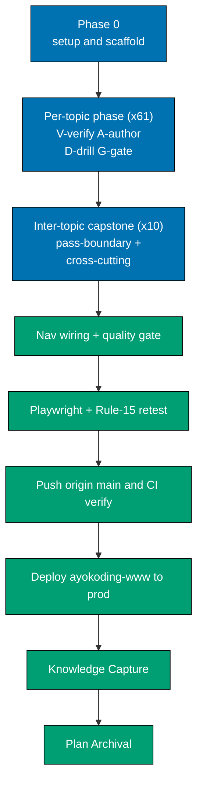

# Delivery Checklist — The Well-Grounded Software Engineer

This checklist is **table-referential**: the canonical topic set, per-topic pass, slug, learning
format, primary language, and weights live in the [prd.md 61-topic table](./prd.md#the-61-topics--canonical-table-spiral-order-identical-in-both-tracks) —
the single source of truth. Each per-topic phase below reads its row from that table and its concrete
items + worked examples + capstone spec from that topic's [syllabus/ file](./syllabus/). When a topic
is added/removed, edit the prd table + its syllabus file, then add or drop the matching phase here.

## Executor Legend

- **[AI]** — an AI agent performs this step autonomously (authoring, web-research, checking,
  git-mechanical steps, committing, and pushing directly to `origin main`).
- **[HUMAN]** — only a human can perform this step (any explicit approval the user chooses to reserve).

Per repo policy, git-mechanical steps (commit, push to `origin main`) are **[AI]** under this delivery
mode. There is no PR and no human-merge gate — work lands directly on `main`.

## Worktree

**Not used.** This plan's delivery mode is `main-to-origin-main`, which works in the **primary
checkout** (no worktree). All work happens on the `main` working tree and is pushed directly to
`origin main`.

See [Plans Organization Convention §Delivery Mode](../../../repo-governance/conventions/structure/plans.md#delivery-mode).

## Delivery Mode: main-to-origin-main

Work in the **primary checkout** on `main` (no worktree, no PR). The AI commits and **pushes directly
to `origin main`** after the finalization phase gates pass. "Done" = the content is on `origin main`
with CI green. Because there is no PR, the finalization phase runs **direct-push + CI post-push
verification** instead of the PR-Review Maker→Fixer Cycle.

**Direct-to-main discipline** (per repo memory/policy): stage **explicit paths only** (the new content
files and the two nav `_index.md` edits) — never `git add -A` in this repo. Do not touch git identity.
Commit per domain/concern with Conventional Commit messages.

## Delivery pipeline (per topic, then finalization)

## Weight Scheme (topic-first, DD-26)

`CONTENT = apps/ayokoding-www/content/en/learn/software-engineering/the-well-grounded-software-engineer`.

- **Topic-slug folder** `CONTENT/<slug>/_index.md` → weight `100 + 10 × journey-index` (topic 1 = 110,
  topic 2 = 120, … topic 61 = 710). The ×10 spacing leaves integer gaps for inter-topic capstones.
- **Learning subfolder** `CONTENT/<slug>/learning/_index.md` → weight = prd **"Learn wt"** (101..161).
- **Drilling subfolder** `CONTENT/<slug>/drilling/_index.md` → weight = prd **"Drill wt"** (201..261),
  with the parity invariant **`Drill wt = Learn wt + 100`**.
- **Intra-topic capstone** `CONTENT/<slug>/learning/capstone/_index.md` → weight **900** (sorts last
  inside `learning/`).
- **Inter-topic capstone** `CONTENT/<capstone-slug>/_index.md` → a weight in the ×10 gap after its
  junction (Pass-0 cap = 135, Pass-1 cap = 245, full-stack-app = 246, Pass-2 cap = 355, Pass-3 cap =
  505, secure-service = 506, data-pipeline = 507, Pass-4 cap = 695, concurrency-showdown = 696, Pass-5
  cap = 715), each with colocated `code/`.
- **Section root** `CONTENT/_index.md` → weight **1750** (position in the parent SE nav);
  `CONTENT/overview.md` → weight **1** (sorts first inside the section).

## Per-Topic Phase Template

Every topic phase (Phases 1, 2, …, one per canonical topic in journey order) applies these steps with
its row variables `<slug>` / `<idx>` / `<topicWt>=100+10×idx` / `<Lwt>` / `<Dwt>=Lwt+100` / `<lang>` /
`<fmt>` / `<kind>` (subject = full runnable capstone · primer = light consolidation · leadership ‡ =
design/decision artifact, no code). Every step names an explicit path, a verbatim command or agent
invocation, and a concrete acceptance criterion (execution-grade clarity).

1. **[AI] V — Web-verify before authoring (DD-28).** Invoke `web-researcher` for `<slug>`: current
   stable versions, current API/CLI syntax, license status (DD-21), CVE status (DD-23), and current
   best practice for `<lang>`/the subject. Fold the dated findings into the topic's
   `plans/in-progress/the-well-grounded-software-engineer/syllabus/<NN>-<slug>.md` **before** authoring.
   Runs **sequentially, one topic at a time** (token-bounded). **Acceptance**: the syllabus file's
   "Accuracy notes (web-verified)" block is updated with dated findings; no unresolved version/license/CVE
   conflict remains.
2. **[AI] A1 — Author the learning subtree (DD-24, DD-30, DD-31).** Create `CONTENT/<slug>/_index.md`
   (frontmatter `weight: <topicWt>`, links to `learning/` + `drilling/`), `CONTENT/<slug>/learning/_index.md`
   (frontmatter `weight: <Lwt>`), `CONTENT/<slug>/learning/overview.md` (weight 1 — restating the syllabus
   file's **`## Prerequisites`** block verbatim at the top (DD-31: **Prior topics** cross-linked, **Tools &
   environment** tied to the Editor Setup matrix + exact pinned CVE-clean versions, **Assumed knowledge**),
   then the install command + raw-form run command up front, DD-30), and example pages covering **every item
   and worked example in `syllabus/<NN>-<slug>.md`**, with runnable files colocated under
   `CONTENT/<slug>/learning/code/`. `<fmt>` = By Example → invoke `apps-ayokoding-www-by-example-maker`
   (five-part examples in `<lang>`, density 1.0–2.25); `<fmt>` = Annotated-concept → invoke
   `apps-ayokoding-www-general-maker` (annotated worked examples + diagrams); `<fmt>` = Primer → invoke
   `apps-ayokoding-www-by-example-maker` scoped to "just enough". **Acceptance**: files exist with the
   stated weights; `overview.md` carries the three-part Prerequisites block (DD-31); all code in `<lang>`
   (or the documented `†`/`*` exception); every syllabus item/example present; DD-30 follow-along holds
   (versions up front, no elided `...`-only listings, every command shown verbatim with expected output);
   DD-19 (no TODO/TBD/stub/placeholder).
3. **[AI] A2 — Author the intra-topic capstone (DD-27).** Create `CONTENT/<slug>/learning/capstone/_index.md`
   (frontmatter `weight: 900`) and capstone pages built strictly from the capstone spec in
   `syllabus/<NN>-<slug>.md`, with colocated code under `CONTENT/<slug>/learning/capstone/code/`. Scale by
   `<kind>`: **subject** = one cohesive full runnable project; **primer** = a short consolidation program;
   **leadership ‡** = a design/decision capstone producing an artifact (no code). **Acceptance**: the
   capstone states goal/outcome, a concepts-exercised checklist, an ordered step outline (file + code +
   verify command per step), and testable acceptance criteria; it is runnable end-to-end via its stated
   command (or produces the stated artifact for ‡); DD-30 follow-along holds.
4. **[AI] A3 — Check the learning subtree + capstone.** Invoke the matching checker
   (`apps-ayokoding-www-by-example-checker` for By Example/Primer, `apps-ayokoding-www-general-checker` for
   Annotated-concept) across `CONTENT/<slug>/learning/`. **Acceptance**: no unresolved HIGH/CRITICAL
   findings; density/five-part/format floors met.
5. **[AI] D — Author + check the drilling page.** Create `CONTENT/<slug>/drilling/_index.md` (frontmatter
   `weight: <Dwt>`) via `apps-ayokoding-www-general-maker` using the fixed four-section anatomy (Recall
   Q&A / Applied problems / Code katas / Self-check checklist), answers hidden in `
`, katas in
   `<lang>` with colocated files under `CONTENT/<slug>/drilling/code/`; then invoke
   `apps-ayokoding-www-general-checker` on the page. **Acceptance**: `weight: <Dwt>` where `<Dwt> = <Lwt> +
100`; four sections present in order; every answer inside a `
` block; checker reports no
   unresolved HIGH/CRITICAL findings.
6. **[AI] F — Fact-check the topic.** Run `apps-ayokoding-www-facts-checker` (which delegates deep research
   to `web-researcher`) over `CONTENT/<slug>/`. **Acceptance**: no unresolved factual findings
   (commands/versions/APIs/licenses/CVEs verified).
7. **[AI] G — Build + lint gate.** Run `npx nx run ayokoding-www:build` and `npm run lint:md`.
   **Acceptance**: both exit 0 with the new topic subtree in place.

**Cross-cutting per every authored page (DD-32 — Prev/Next navigation).** Steps A1, A2, and D each end
their authored pages with the navigation footer: a horizontal rule followed by
`← Previous: [...] · Next: [...] →` in canonical spiral order (the prior topic's page ← this topic → the
next topic's page). The footer targets mirror the syllabus `NN-<slug>.md` footer chain for the same topic.
**Acceptance (folded into each phase gate)**: the topic's `overview.md`, example/worked-example pages,
capstone page, and drilling page each carry a correctly-ordered Prev/Next footer.

## Inter-Topic Capstone Phase Template

Every inter-topic capstone phase applies these steps with its `<capstone-slug>` / `<capstoneWt>` /
`<junction>` (the topics it integrates) from the [Capstone Policy](./prd.md#capstone-policy-dd-27) and
its full spec in the anchoring `syllabus/<NN>-*.md` file:

1. **[AI] Web-verify the capstone stack (DD-28).** Invoke `web-researcher` for the integrated stack;
   fold findings into the capstone's syllabus spec. **Acceptance**: spec's accuracy notes updated; no
   unresolved version/license/CVE conflict.
2. **[AI] Author the capstone bundle.** Create `CONTENT/<capstone-slug>/_index.md` (frontmatter
   `weight: <capstoneWt>`) + pages from the syllabus spec, with colocated code under
   `CONTENT/<capstone-slug>/code/`, integrating `<junction>` end-to-end. **Acceptance**: goal, ordered
   steps (file + code + verify command each), and acceptance criteria present; runnable end-to-end via
   the stated command; DD-30 follow-along holds; DD-19 no stubs; each page ends with a correctly-ordered
   Prev/Next footer (DD-32).
3. **[AI] Check + fact-check.** Invoke `apps-ayokoding-www-general-checker` then
   `apps-ayokoding-www-facts-checker` on `CONTENT/<capstone-slug>/`. **Acceptance**: no unresolved
   HIGH/CRITICAL or factual findings.
4. **[AI] Build + lint.** `npx nx run ayokoding-www:build` and `npm run lint:md`. **Acceptance**: both
   exit 0.

---

## Phase 0 — Environment Setup, Baseline, and Section Scaffold

- [ ] **[AI]** Confirm the primary checkout is on `main` and synced: run `git checkout main` then
      `git pull origin main`. **Acceptance**: on branch `main`, up to date with `origin/main`, working
      tree clean.
- [ ] **[AI]** Initialize toolchain: run `npm install` then `npm run doctor -- --fix` in the primary
      checkout. **Acceptance**: both exit 0; no missing-tool warnings.
- [ ] **[AI]** Baseline the target project: run `npx nx run ayokoding-www:build`. **Acceptance**: exits 0
      (clean baseline before any new content).
- [ ] **[AI]** Baseline markdown lint: run `npm run lint:md` (or `npm run lint:md:fix`). **Acceptance**:
      exits 0 on the existing tree, or only auto-fixable issues that fix cleanly.
- [ ] **[AI]** Scaffold the section root: create `CONTENT/_index.md` (frontmatter `weight: 1750`, title
      "The Well-Grounded Software Engineer", intro + link list to the journey map) and `CONTENT/overview.md`
      (weight 1 — read-then-drill workflow, the Pass 0 + five-pass spiral Mermaid map and the 61-node skill
      tree from [prd.md](./prd.md), accessible WCAG palette). **Acceptance**: both files exist;
      `npx nx run ayokoding-www:build` still exits 0.

### Phase 0 Gate

> All checks below must pass before starting Phase 1.

- [ ] [AI] `npx nx run ayokoding-www:build` — exits 0 with the scaffold in place.
- [ ] [AI] `npm run lint:md` — passes.
- [ ] [AI] Section root renders with `weight: 1750`; `overview.md` renders with `weight: 1` and shows the
      journey map + skill tree with the WCAG palette.

> **Pause Safety**: The section is additive scaffold only — no topic content yet, nav not wired into the
> parent SE index. Safe to pause here; the live site is unaffected because the section is not yet linked.

---

## Pass 0 — Set Up Your Forge (Phases 1–3 + Pass-0 capstone)

## Phase 1 — Topic 01 Just Enough Nvim (`just-enough-nvim`)

Row: Primer · Neovim § · topic wt 110 · Learn 101 / Drill 201 · capstone kind **primer**. Apply the
Per-Topic Phase Template (steps V, A1, A2, A3, D, F, G). **Detail source**:
[`syllabus/01-just-enough-nvim.md`](./syllabus/01-just-enough-nvim.md) — the checkboxes below enumerate
its Items, Worked examples, and Capstone spec (DD-8 floor: cover every one).

- [ ] **[AI] V** — Invoke `web-researcher` for `just-enough-nvim` and resolve every "to verify" line in
      the syllabus **Accuracy notes** (current Neovim stable version; vanilla ships `:checkhealth` +
      `:terminal` + `:help`; Apache-2.0/Tier-1; default keymaps `<C-v>`/`<C-w>`/`gt` unchanged). Fold
      dated findings into `syllabus/01-just-enough-nvim.md`. **Acceptance**: no "to verify" line remains.
- [ ] **[AI] A1** — Author `CONTENT/just-enough-nvim/learning/` (+ `code/`), a By-Example-style progression
      covering **every** syllabus Item: install & launch (`:help`, `:checkhealth`); modes
      (normal/insert/visual charwise+`V`+`<C-v>`/command-line/replace); motions & operators (grammar +
      text objects + counts); editing (`i/a/o/O`, `p/P`, `.`, `u/<C-r>`, `J`, `>>`/`<<`); buffers/windows/
      tabs; ex-commands (ranges, `:%s///`, `:g//`, `:normal`, `:!`); search & replace (`\zs`/`\ze`, capture
      groups); registers; marks & jumps; macros; quickfix/location lists + `:terminal`. **Acceptance**:
      each Item appears in the rendered learning subtree with a runnable/reproducible demonstration.
- [ ] **[AI] A1 (worked examples)** — Author the three colocated worked examples under `learning/code/`
      (before/after + keystroke transcript, DD-30): **beginner** (motions-only edit + `:%s///g` refactor +
      undo/redo); **intermediate** (counted macro replay + `:g/…/normal` + split-window two-buffer edit);
      **advanced** (`:vimgrep`→quickfix→`:cnext` multi-file edit + register-composed edit + `:terminal`
      build/run loop). **Acceptance**: each transcript reproduces its `after/` from its `before/`.
- [ ] **[AI] A2 (capstone)** — Author `CONTENT/just-enough-nvim/learning/capstone/` (primer consolidation)
      per the syllabus Capstone spec: a mouse-free, plugin-free multi-file refactor driving
      `:vimgrep`→`:copen`→`:cdo`, a counted macro, and a `:terminal` check, with the full keystroke
      transcript at `capstone/code/transcript.md`. **Acceptance**: following the transcript reproduces the
      identical `after/` tree; the concepts-exercised checklist is fully hit.
- [ ] **[AI] A3** — Run `apps-ayokoding-www-by-example-checker` (+ general/link) on the topic; resolve
      findings via the matching fixer. **Acceptance**: checkers report zero unresolved HIGH/CRITICAL.
- [ ] **[AI] D** — Author `CONTENT/just-enough-nvim/drilling/` (`_index.md` weight 201) — drills covering
      the same Items with mocked/self-contained inputs (integration-tier is app-tier-only; this is
      unit+e2e content). **Acceptance**: drilling subtree renders; parity `Drill 201 = Learn 101 + 100`.
- [ ] **[AI] F** — Run `apps-ayokoding-www-facts-checker` on the topic. **Acceptance**: all commands/
      versions/keymaps verified; zero unresolved factual findings.
- [ ] **[AI] G** — `npx nx run ayokoding-www:build` and `npm run lint:md`. **Acceptance**: both exit 0.

### Phase 1 Gate

- [ ] [AI] `just-enough-nvim/` complete: `_index.md` wt 110, `learning/_index.md` wt 101,
      `drilling/_index.md` wt 201, `learning/capstone/_index.md` wt 900; every syllabus Item + all 3 worked
      examples + the capstone present; all checkers + facts-checker clean; build + `lint:md` exit 0;
      DD-19/DD-20/DD-30 satisfied.

> **Pause Safety**: Topic self-contained, not yet nav-wired. Safe to pause.

## Phase 2 — Topic 02 Just Enough Lua (`just-enough-lua`)

Row: Primer · Lua † · topic wt 120 · Learn 102 / Drill 202 · **primer**. **Detail source**:
[`syllabus/02-just-enough-lua.md`](./syllabus/02-just-enough-lua.md).

- [ ] **[AI] V** — `web-researcher` for `just-enough-lua`; resolve the Accuracy-notes "to verify" lines
      (current PUC-Lua stable + LuaJIT version Neovim embeds; Lua MIT/Tier-1; `vim` global + `require`
      semantics). Fold into the syllabus file. **Acceptance**: no "to verify" line remains.
- [ ] **[AI] A1** — Author `CONTENT/just-enough-lua/learning/` (+ `code/`, runnable `lua <file>` scripts,
      DD-20) covering **every** Item: running Lua raw (`lua` REPL/script, LuaJIT-vs-PUC note, embedded
      `vim` global); core syntax (`nil`/bool/number/string, operators, string lib); tables (arrays/maps/
      nested, `ipairs`/`pairs`, `#`); functions (first-class, closures, multiple returns, varargs, `:`
      sugar); control flow (`if`/`for`/`while`/`repeat`); modules (`require`, table-as-module, metatables
      & `__index`); errors (`pcall`/`error`, `nil, err`). **Acceptance**: each Item rendered with a
      complete runnable listing + expected output.
- [ ] **[AI] A1 (worked examples)** — **beginner** (tables + `for` script; REPL metatable exploration);
      **intermediate** (module returning a function table; closures as counters/config); **advanced**
      (metatable `__index` "class" + `pcall` handling). **Acceptance**: each runs with `lua <file>` and
      matches its documented output.
- [ ] **[AI] A2 (capstone)** — Author `learning/capstone/` per the syllabus Capstone spec: a ~60–120-line
      config-value store using tables + closures + a `require`d module + `__index` defaults + `pcall`;
      `store.lua` + `main.lua`, run via `lua main.lua`. **Acceptance**: `lua main.lua` exits 0, prints the
      expected block, failing path caught by `pcall`.
- [ ] **[AI] A3/D/F/G** — checkers (by-example/general/link) + facts-checker clean; author
      `drilling/_index.md` (wt 202); `npx nx run ayokoding-www:build` + `npm run lint:md` exit 0.

### Phase 2 Gate

- [ ] [AI] `just-enough-lua/` complete: `_index.md` wt 120, `learning/_index.md` wt 102,
      `drilling/_index.md` wt 202, capstone wt 900; every Item + 3 worked examples + capstone present;
      checkers + facts-checker clean; build + `lint:md` exit 0.

> **Pause Safety**: Topic self-contained, not yet nav-wired. Safe to pause.

## Phase 3 — Topic 03 Extending Neovim (`extending-neovim`)

Row: By Example · Lua † · topic wt 130 · Learn 103 / Drill 203 · **subject** (full runnable capstone).
**Detail source**: [`syllabus/03-extending-neovim.md`](./syllabus/03-extending-neovim.md).

- [ ] **[AI] V** — `web-researcher` for `extending-neovim`; resolve the Accuracy-notes "to verify" lines
      — **critically** whether **Neovim 0.11+ native `vim.lsp.config()`/`vim.lsp.enable()`** is the
      recommended path vs `nvim-lspconfig`, and pin CVE-clean versions of the plugin manager,
      `nvim-lspconfig`, `nvim-treesitter`, one language server; confirm `vim.opt`/`vim.keymap.set`/
      `nvim_create_autocmd`/`nvim_create_user_command` signatures + XDG layout. Fold into the syllabus
      file. **Acceptance**: no "to verify" line remains; the LSP path is decided and pinned.
- [ ] **[AI] A1** — Author `CONTENT/extending-neovim/learning/` (+ `code/`) covering **every** Item, each
      ending in a complete runnable config listing (DD-20) + launch command + observable result (DD-30):
      `init.lua` + `vim.opt`/`vim.g`/`vim.keymap` + `runtimepath`/XDG; a `lua/` module tree; plugin
      management; LSP attach + diagnostics + code actions (native path per V); Treesitter highlight/text
      objects; autocommands + user commands; a tiny self-authored plugin; DAP intro. **Acceptance**: each
      Item rendered with a runnable config fragment assembled into a complete listing.
- [ ] **[AI] A1 (worked examples)** — **beginner** (from-scratch `init.lua`, `nvim -u init.lua`);
      **intermediate** (LSP+Treesitter for one language + a custom user command); **advanced**
      (self-authored Lua plugin with autocommand+command on `runtimepath`, complete config listing).
      **Acceptance**: each launches and behaves as documented.
- [ ] **[AI] A2 (capstone)** — Author `learning/capstone/` per the syllabus Capstone spec: a from-scratch
      IDE-grade Neovim config for Python (plugin manager bootstrap → `lua/` modules → LSP+Treesitter →
      self-authored `:Greet` command + `BufWritePost` autocommand), reproducible from an empty
      `~/.config/nvim`. **Acceptance**: `nvim --headless "+checkhealth" "+qa"` reports no missing required
      dep; LSP diagnostics + Treesitter + `:Greet` all function.
- [ ] **[AI] A3/D/F/G** — checkers + facts-checker clean; author `drilling/_index.md` (wt 203);
      `npx nx run ayokoding-www:build` + `npm run lint:md` exit 0.

### Phase 3 Gate

- [ ] [AI] `extending-neovim/` complete: `_index.md` wt 130, `learning/_index.md` wt 103,
      `drilling/_index.md` wt 203, capstone wt 900; every Item + 3 worked examples + full-runnable capstone
      present; native-LSP path pinned; checkers + facts-checker clean; build + `lint:md` exit 0.

> **Pause Safety**: Topic self-contained, not yet nav-wired. Safe to pause.

## Phase 4 — Inter-topic: Pass-0 Capstone (`capstone-forge-ready`)

Junction: Topics 01–03 (nvim + lua + extending). Apply the Inter-Topic Capstone Phase Template.
**Detail source**: [`syllabus/03-extending-neovim.md`](./syllabus/03-extending-neovim.md) §"inter-topic:
`capstone-forge-ready`".

- [ ] **[AI] V** — `web-researcher` confirms the pinned Neovim + plugin versions still current/CVE-clean
      at build time (reuse topic-03 findings). **Acceptance**: versions confirmed or updated in the spec.
- [ ] **[AI] A** — Author `CONTENT/capstone-forge-ready/` (`_index.md` `weight: 135`, + `code/`) per the
      spec's ordered steps: (1) `code/nvim-config/` self-contained config repo with a pinned plugin
      lockfile — verify `XDG_CONFIG_HOME=$(mktemp -d) nvim --headless "+checkhealth" "+qa"` bootstraps
      healthy; (2) `code/sample-project/` Python project opened in the forge with working LSP+Treesitter;
      (3) a scripted mouse-free refactor across it (motions+macros+quickfix) with a saved transcript;
      (4) a `:terminal` check beside the source. **Acceptance**: a clean-machine reader reproduces the
      forge, opens the sample with LSP+Treesitter, and replays the transcript to the identical result.
- [ ] **[AI] Check/Fact/Build** — checker + facts-checker clean; `npx nx run ayokoding-www:build` +
      `npm run lint:md` exit 0.

### Phase 4 Gate

- [ ] [AI] `capstone-forge-ready/` complete (wt 135); all four ordered steps present and the
      done bar met (clean-machine reproduction runnable end-to-end + web-verified); checker +
      facts-checker clean; build + `lint:md` exit 0.

> **Pause Safety**: Additive capstone folder, not yet nav-wired. Safe to pause.

---

## Pass 1 — First Working Software (Phases 5–15 + Pass-1 + full-stack capstones)

## Phase 5 — Topic 04 Just Enough Python (`just-enough-python`)

Row: Primer · Python · topic wt 140 · Learn 104 / Drill 204 · **primer**. Template →
`syllabus/04-just-enough-python.md`.

- [ ] **[AI] V** — `web-researcher` for `just-enough-python`; resolve every Accuracy-notes "to verify" line
      in [`syllabus/04-just-enough-python.md`](./syllabus/04-just-enough-python.md) and fold dated findings
      back into that file. **Acceptance**: no unresolved "verify" line remains in the syllabus file.
- [ ] **[AI] A1** — Author `CONTENT/just-enough-python/learning/` (+ `code/`, runnable sources (DD-20))
      covering **every** Item in [`syllabus/04-just-enough-python.md`](./syllabus/04-just-enough-python.md)
      `## Items`, each rendered as a runnable/reproducible demonstration (DD-20/DD-30). **Acceptance**:
      every syllabus Item appears in the rendered learning subtree with its expected output.
- [ ] **[AI] A1 (worked examples)** — Author the three colocated worked examples
      (beginner/intermediate/advanced), each runnable per
      [`syllabus/04-just-enough-python.md`](./syllabus/04-just-enough-python.md) `## Worked examples`.
      **Acceptance**: each reproduces its documented output/result.
- [ ] **[AI] A2 (capstone)** — Author `CONTENT/just-enough-python/learning/capstone/` (`_index.md` weight 900) per [`syllabus/04-just-enough-python.md`](./syllabus/04-just-enough-python.md) `## Capstone
    spec`. **Acceptance**: the capstone's done bar is met and its concepts-exercised checklist is fully
      hit.
- [ ] **[AI] A3/D/F/G** — `apps-ayokoding-www-by-example-checker` + `apps-ayokoding-www-link-checker` +
      `apps-ayokoding-www-facts-checker` clean (resolve via the matching fixer); author
      `CONTENT/just-enough-python/drilling/_index.md` (wt 204) covering the same Items with
      mocked/self-contained inputs; `npx nx run ayokoding-www:build` + `npm run lint:md` exit 0.
      **Acceptance**: checkers clean, `Drill 204 = Learn 104 + 100`, both commands exit 0.

### Phase 5 Gate

- [ ] [AI] `just-enough-python/` complete: `_index.md` wt 140, learning wt 104, drilling wt 204, capstone
      wt 900; checkers + facts-checker clean; build + `lint:md` exit 0.

> **Pause Safety**: Topic self-contained, not yet nav-wired. Safe to pause.

## Phase 6 — Topic 05 Just Enough Bash (`just-enough-bash`)

Row: Primer · Bash/shell † · topic wt 150 · Learn 105 / Drill 205 · **primer**. Template →
`syllabus/05-just-enough-bash.md`.

- [ ] **[AI] V** — `web-researcher` for `just-enough-bash`; resolve every Accuracy-notes "to verify" line in
      [`syllabus/05-just-enough-bash.md`](./syllabus/05-just-enough-bash.md) and fold dated findings back
      into that file. **Acceptance**: no unresolved "verify" line remains in the syllabus file.
- [ ] **[AI] A1** — Author `CONTENT/just-enough-bash/learning/` (+ `code/`, runnable sources (DD-20))
      covering **every** Item in [`syllabus/05-just-enough-bash.md`](./syllabus/05-just-enough-bash.md) `##
    Items`, each rendered as a runnable/reproducible demonstration (DD-20/DD-30). **Acceptance**: every
      syllabus Item appears in the rendered learning subtree with its expected output.
- [ ] **[AI] A1 (worked examples)** — Author the three colocated worked examples
      (beginner/intermediate/advanced), each runnable per
      [`syllabus/05-just-enough-bash.md`](./syllabus/05-just-enough-bash.md) `## Worked examples`.
      **Acceptance**: each reproduces its documented output/result.
- [ ] **[AI] A2 (capstone)** — Author `CONTENT/just-enough-bash/learning/capstone/` (`_index.md` weight 900)
      per [`syllabus/05-just-enough-bash.md`](./syllabus/05-just-enough-bash.md) `## Capstone spec`.
      **Acceptance**: the capstone's done bar is met and its concepts-exercised checklist is fully hit.
- [ ] **[AI] A3/D/F/G** — `apps-ayokoding-www-by-example-checker` + `apps-ayokoding-www-link-checker` +
      `apps-ayokoding-www-facts-checker` clean (resolve via the matching fixer); author
      `CONTENT/just-enough-bash/drilling/_index.md` (wt 205) covering the same Items with
      mocked/self-contained inputs; `npx nx run ayokoding-www:build` + `npm run lint:md` exit 0.
      **Acceptance**: checkers clean, `Drill 205 = Learn 105 + 100`, both commands exit 0.

### Phase 6 Gate

- [ ] [AI] `just-enough-bash/` complete: `_index.md` wt 150, learning wt 105, drilling wt 205, capstone wt
      900; checkers + facts-checker clean; build + `lint:md` exit 0.

> **Pause Safety**: Topic self-contained, not yet nav-wired. Safe to pause.

## Phase 7 — Topic 06 Data Structures & Algorithms Essentials (`data-structures-and-algorithms-essentials`)

Row: By Example · Python · topic wt 160 · Learn 106 / Drill 206 · **subject**. Template →
`syllabus/06-data-structures-and-algorithms-essentials.md`.

- [ ] **[AI] V** — `web-researcher` for `data-structures-and-algorithms-essentials`; resolve every
      Accuracy-notes "to verify" line in
      [`syllabus/06-data-structures-and-algorithms-essentials.md`](./syllabus/06-data-structures-and-algorithms-essentials.md)
      and fold dated findings back into that file. **Acceptance**: no unresolved "verify" line remains in
      the syllabus file.
- [ ] **[AI] A1** — Author `CONTENT/data-structures-and-algorithms-essentials/learning/` (+ `code/`,
      runnable sources (DD-20)) covering **every** Item in
      [`syllabus/06-data-structures-and-algorithms-essentials.md`](./syllabus/06-data-structures-and-algorithms-essentials.md)
      `## Items`, each rendered as a runnable/reproducible demonstration (DD-20/DD-30). **Acceptance**:
      every syllabus Item appears in the rendered learning subtree with its expected output.
- [ ] **[AI] A1 (worked examples)** — Author the three colocated worked examples
      (beginner/intermediate/advanced), each runnable per
      [`syllabus/06-data-structures-and-algorithms-essentials.md`](./syllabus/06-data-structures-and-algorithms-essentials.md)
      `## Worked examples`. **Acceptance**: each reproduces its documented output/result.
- [ ] **[AI] A2 (capstone)** — Author `CONTENT/data-structures-and-algorithms-essentials/learning/capstone/`
      (`_index.md` weight 900) per
      [`syllabus/06-data-structures-and-algorithms-essentials.md`](./syllabus/06-data-structures-and-algorithms-essentials.md)
      `## Capstone spec`. **Acceptance**: the capstone's done bar is met and its concepts-exercised
      checklist is fully hit.
- [ ] **[AI] A3/D/F/G** — `apps-ayokoding-www-by-example-checker` + `apps-ayokoding-www-link-checker` +
      `apps-ayokoding-www-facts-checker` clean (resolve via the matching fixer); author
      `CONTENT/data-structures-and-algorithms-essentials/drilling/_index.md` (wt 206) covering the same
      Items with mocked/self-contained inputs; `npx nx run ayokoding-www:build` + `npm run lint:md` exit 0.
      **Acceptance**: checkers clean, `Drill 206 = Learn 106 + 100`, both commands exit 0.

### Phase 7 Gate

- [ ] [AI] `data-structures-and-algorithms-essentials/` complete: `_index.md` wt 160, learning wt 106,
      drilling wt 206, capstone wt 900; checkers + facts-checker clean; build + `lint:md` exit 0.

> **Pause Safety**: Topic self-contained, not yet nav-wired. Safe to pause.

## Phase 8 — Topic 07 Object-Oriented Programming Essentials (`object-oriented-programming-essentials`)

Row: By Example · Python · topic wt 170 · Learn 107 / Drill 207 · **subject**. Template →
`syllabus/07-object-oriented-programming-essentials.md`.

- [ ] **[AI] V** — `web-researcher` for `object-oriented-programming-essentials`; resolve every
      Accuracy-notes "to verify" line in
      [`syllabus/07-object-oriented-programming-essentials.md`](./syllabus/07-object-oriented-programming-essentials.md)
      and fold dated findings back into that file. **Acceptance**: no unresolved "verify" line remains in
      the syllabus file.
- [ ] **[AI] A1** — Author `CONTENT/object-oriented-programming-essentials/learning/` (+ `code/`, runnable
      sources (DD-20)) covering **every** Item in
      [`syllabus/07-object-oriented-programming-essentials.md`](./syllabus/07-object-oriented-programming-essentials.md)
      `## Items`, each rendered as a runnable/reproducible demonstration (DD-20/DD-30). **Acceptance**:
      every syllabus Item appears in the rendered learning subtree with its expected output.
- [ ] **[AI] A1 (worked examples)** — Author the three colocated worked examples
      (beginner/intermediate/advanced), each runnable per
      [`syllabus/07-object-oriented-programming-essentials.md`](./syllabus/07-object-oriented-programming-essentials.md)
      `## Worked examples`. **Acceptance**: each reproduces its documented output/result.
- [ ] **[AI] A2 (capstone)** — Author `CONTENT/object-oriented-programming-essentials/learning/capstone/`
      (`_index.md` weight 900) per
      [`syllabus/07-object-oriented-programming-essentials.md`](./syllabus/07-object-oriented-programming-essentials.md)
      `## Capstone spec`. **Acceptance**: the capstone's done bar is met and its concepts-exercised
      checklist is fully hit.
- [ ] **[AI] A3/D/F/G** — `apps-ayokoding-www-by-example-checker` + `apps-ayokoding-www-link-checker` +
      `apps-ayokoding-www-facts-checker` clean (resolve via the matching fixer); author
      `CONTENT/object-oriented-programming-essentials/drilling/_index.md` (wt 207) covering the same Items
      with mocked/self-contained inputs; `npx nx run ayokoding-www:build` + `npm run lint:md` exit 0.
      **Acceptance**: checkers clean, `Drill 207 = Learn 107 + 100`, both commands exit 0.

### Phase 8 Gate

- [ ] [AI] `object-oriented-programming-essentials/` complete: `_index.md` wt 170, learning wt 107,
      drilling wt 207, capstone wt 900; checkers + facts-checker clean; build + `lint:md` exit 0.

> **Pause Safety**: Topic self-contained, not yet nav-wired. Safe to pause.

## Phase 9 — Topic 08 SQL Essentials (`sql-essentials`)

Row: By Example · SQL + Python † (SQLite) · topic wt 180 · Learn 108 / Drill 208 · **subject**. Template
→ `syllabus/08-sql-essentials.md`.

- [ ] **[AI] V** — `web-researcher` for `sql-essentials`; resolve every Accuracy-notes "to verify" line in
      [`syllabus/08-sql-essentials.md`](./syllabus/08-sql-essentials.md) and fold dated findings back into
      that file. **Acceptance**: no unresolved "verify" line remains in the syllabus file.
- [ ] **[AI] A1** — Author `CONTENT/sql-essentials/learning/` (+ `code/`, runnable sources (DD-20)) covering
      **every** Item in [`syllabus/08-sql-essentials.md`](./syllabus/08-sql-essentials.md) `## Items`, each
      rendered as a runnable/reproducible demonstration (DD-20/DD-30). **Acceptance**: every syllabus Item
      appears in the rendered learning subtree with its expected output.
- [ ] **[AI] A1 (worked examples)** — Author the three colocated worked examples
      (beginner/intermediate/advanced), each runnable per
      [`syllabus/08-sql-essentials.md`](./syllabus/08-sql-essentials.md) `## Worked examples`.
      **Acceptance**: each reproduces its documented output/result.
- [ ] **[AI] A2 (capstone)** — Author `CONTENT/sql-essentials/learning/capstone/` (`_index.md` weight 900)
      per [`syllabus/08-sql-essentials.md`](./syllabus/08-sql-essentials.md) `## Capstone spec`.
      **Acceptance**: the capstone's done bar is met and its concepts-exercised checklist is fully hit.
- [ ] **[AI] A3/D/F/G** — `apps-ayokoding-www-by-example-checker` + `apps-ayokoding-www-link-checker` +
      `apps-ayokoding-www-facts-checker` clean (resolve via the matching fixer); author
      `CONTENT/sql-essentials/drilling/_index.md` (wt 208) covering the same Items with
      mocked/self-contained inputs; `npx nx run ayokoding-www:build` + `npm run lint:md` exit 0.
      **Acceptance**: checkers clean, `Drill 208 = Learn 108 + 100`, both commands exit 0.

### Phase 9 Gate

- [ ] [AI] `sql-essentials/` complete: `_index.md` wt 180, learning wt 108, drilling wt 208, capstone wt
      900; checkers + facts-checker clean; build + `lint:md` exit 0.

> **Pause Safety**: Topic self-contained, not yet nav-wired. Safe to pause.

## Phase 10 — Topic 09 Backend Essentials (`backend-essentials`)

Row: By Example · Python (PostgreSQL) · topic wt 190 · Learn 109 / Drill 209 · **subject**. Template →
`syllabus/09-backend-essentials.md`.

- [ ] **[AI] V** — `web-researcher` for `backend-essentials`; resolve every Accuracy-notes "to verify" line
      in [`syllabus/09-backend-essentials.md`](./syllabus/09-backend-essentials.md) and fold dated findings
      back into that file. **Acceptance**: no unresolved "verify" line remains in the syllabus file.
- [ ] **[AI] A1** — Author `CONTENT/backend-essentials/learning/` (+ `code/`, runnable sources (DD-20))
      covering **every** Item in [`syllabus/09-backend-essentials.md`](./syllabus/09-backend-essentials.md)
      `## Items`, each rendered as a runnable/reproducible demonstration (DD-20/DD-30). **Acceptance**:
      every syllabus Item appears in the rendered learning subtree with its expected output.
- [ ] **[AI] A1 (worked examples)** — Author the three colocated worked examples
      (beginner/intermediate/advanced), each runnable per
      [`syllabus/09-backend-essentials.md`](./syllabus/09-backend-essentials.md) `## Worked examples`.
      **Acceptance**: each reproduces its documented output/result.
- [ ] **[AI] A2 (capstone)** — Author `CONTENT/backend-essentials/learning/capstone/` (`_index.md` weight 900) per [`syllabus/09-backend-essentials.md`](./syllabus/09-backend-essentials.md) `## Capstone
    spec`. **Acceptance**: the capstone's done bar is met and its concepts-exercised checklist is fully
      hit.
- [ ] **[AI] A3/D/F/G** — `apps-ayokoding-www-by-example-checker` + `apps-ayokoding-www-link-checker` +
      `apps-ayokoding-www-facts-checker` clean (resolve via the matching fixer); author
      `CONTENT/backend-essentials/drilling/_index.md` (wt 209) covering the same Items with
      mocked/self-contained inputs; `npx nx run ayokoding-www:build` + `npm run lint:md` exit 0.
      **Acceptance**: checkers clean, `Drill 209 = Learn 109 + 100`, both commands exit 0.

### Phase 10 Gate

- [ ] [AI] `backend-essentials/` complete: `_index.md` wt 190, learning wt 109, drilling wt 209, capstone
      wt 900; checkers + facts-checker clean; build + `lint:md` exit 0.

> **Pause Safety**: Topic self-contained, not yet nav-wired. Safe to pause.

## Phase 11 — Topic 10 Networking Essentials (`networking-essentials`)

Row: By Example · Python · topic wt 200 · Learn 110 / Drill 210 · **subject**. Template →
`syllabus/10-networking-essentials.md`.

- [ ] **[AI] V** — `web-researcher` for `networking-essentials`; resolve every Accuracy-notes "to verify"
      line in [`syllabus/10-networking-essentials.md`](./syllabus/10-networking-essentials.md) and fold
      dated findings back into that file. **Acceptance**: no unresolved "verify" line remains in the
      syllabus file.
- [ ] **[AI] A1** — Author `CONTENT/networking-essentials/learning/` (+ `code/`, runnable sources (DD-20))
      covering **every** Item in
      [`syllabus/10-networking-essentials.md`](./syllabus/10-networking-essentials.md) `## Items`, each
      rendered as a runnable/reproducible demonstration (DD-20/DD-30). **Acceptance**: every syllabus Item
      appears in the rendered learning subtree with its expected output.
- [ ] **[AI] A1 (worked examples)** — Author the three colocated worked examples
      (beginner/intermediate/advanced), each runnable per
      [`syllabus/10-networking-essentials.md`](./syllabus/10-networking-essentials.md) `## Worked examples`.
      **Acceptance**: each reproduces its documented output/result.
- [ ] **[AI] A2 (capstone)** — Author `CONTENT/networking-essentials/learning/capstone/` (`_index.md` weight 900) per [`syllabus/10-networking-essentials.md`](./syllabus/10-networking-essentials.md) `## Capstone
    spec`. **Acceptance**: the capstone's done bar is met and its concepts-exercised checklist is fully
      hit.
- [ ] **[AI] A3/D/F/G** — `apps-ayokoding-www-by-example-checker` + `apps-ayokoding-www-link-checker` +
      `apps-ayokoding-www-facts-checker` clean (resolve via the matching fixer); author
      `CONTENT/networking-essentials/drilling/_index.md` (wt 210) covering the same Items with
      mocked/self-contained inputs; `npx nx run ayokoding-www:build` + `npm run lint:md` exit 0.
      **Acceptance**: checkers clean, `Drill 210 = Learn 110 + 100`, both commands exit 0.

### Phase 11 Gate

- [ ] [AI] `networking-essentials/` complete: `_index.md` wt 200, learning wt 110, drilling wt 210,
      capstone wt 900; checkers + facts-checker clean; build + `lint:md` exit 0.

> **Pause Safety**: Topic self-contained, not yet nav-wired. Safe to pause.

## Phase 12 — Topic 11 Just Enough TypeScript (`just-enough-typescript`)

Row: Primer · TypeScript † · topic wt 210 · Learn 111 / Drill 211 · **primer**. Template →
`syllabus/11-just-enough-typescript.md`.

- [ ] **[AI] V** — `web-researcher` for `just-enough-typescript`; resolve every Accuracy-notes "to verify"
      line in [`syllabus/11-just-enough-typescript.md`](./syllabus/11-just-enough-typescript.md) and fold
      dated findings back into that file. **Acceptance**: no unresolved "verify" line remains in the
      syllabus file.
- [ ] **[AI] A1** — Author `CONTENT/just-enough-typescript/learning/` (+ `code/`, runnable sources (DD-20))
      covering **every** Item in
      [`syllabus/11-just-enough-typescript.md`](./syllabus/11-just-enough-typescript.md) `## Items`, each
      rendered as a runnable/reproducible demonstration (DD-20/DD-30). **Acceptance**: every syllabus Item
      appears in the rendered learning subtree with its expected output.
- [ ] **[AI] A1 (worked examples)** — Author the three colocated worked examples
      (beginner/intermediate/advanced), each runnable per
      [`syllabus/11-just-enough-typescript.md`](./syllabus/11-just-enough-typescript.md) `## Worked
    examples`. **Acceptance**: each reproduces its documented output/result.
- [ ] **[AI] A2 (capstone)** — Author `CONTENT/just-enough-typescript/learning/capstone/` (`_index.md`
      weight 900) per [`syllabus/11-just-enough-typescript.md`](./syllabus/11-just-enough-typescript.md) `##
    Capstone spec`. **Acceptance**: the capstone's done bar is met and its concepts-exercised checklist is
      fully hit.
- [ ] **[AI] A3/D/F/G** — `apps-ayokoding-www-by-example-checker` + `apps-ayokoding-www-link-checker` +
      `apps-ayokoding-www-facts-checker` clean (resolve via the matching fixer); author
      `CONTENT/just-enough-typescript/drilling/_index.md` (wt 211) covering the same Items with
      mocked/self-contained inputs; `npx nx run ayokoding-www:build` + `npm run lint:md` exit 0.
      **Acceptance**: checkers clean, `Drill 211 = Learn 111 + 100`, both commands exit 0.

### Phase 12 Gate

- [ ] [AI] `just-enough-typescript/` complete: `_index.md` wt 210, learning wt 111, drilling wt 211,
      capstone wt 900; checkers + facts-checker clean; build + `lint:md` exit 0.

> **Pause Safety**: Topic self-contained, not yet nav-wired. Safe to pause.

## Phase 13 — Topic 12 Frontend Essentials (`frontend-essentials`)

Row: By Example · TypeScript † · topic wt 220 · Learn 112 / Drill 212 · **subject**. Template →
`syllabus/12-frontend-essentials.md`.

- [ ] **[AI] V** — `web-researcher` for `frontend-essentials`; resolve every Accuracy-notes "to verify" line
      in [`syllabus/12-frontend-essentials.md`](./syllabus/12-frontend-essentials.md) and fold dated
      findings back into that file. **Acceptance**: no unresolved "verify" line remains in the syllabus
      file.
- [ ] **[AI] A1** — Author `CONTENT/frontend-essentials/learning/` (+ `code/`, runnable sources (DD-20))
      covering **every** Item in
      [`syllabus/12-frontend-essentials.md`](./syllabus/12-frontend-essentials.md) `## Items`, each rendered
      as a runnable/reproducible demonstration (DD-20/DD-30). **Acceptance**: every syllabus Item appears in
      the rendered learning subtree with its expected output.
- [ ] **[AI] A1 (worked examples)** — Author the three colocated worked examples
      (beginner/intermediate/advanced), each runnable per
      [`syllabus/12-frontend-essentials.md`](./syllabus/12-frontend-essentials.md) `## Worked examples`.
      **Acceptance**: each reproduces its documented output/result.
- [ ] **[AI] A2 (capstone)** — Author `CONTENT/frontend-essentials/learning/capstone/` (`_index.md` weight 900) per [`syllabus/12-frontend-essentials.md`](./syllabus/12-frontend-essentials.md) `## Capstone
    spec`. **Acceptance**: the capstone's done bar is met and its concepts-exercised checklist is fully
      hit.
- [ ] **[AI] A3/D/F/G** — `apps-ayokoding-www-by-example-checker` + `apps-ayokoding-www-link-checker` +
      `apps-ayokoding-www-facts-checker` clean (resolve via the matching fixer); author
      `CONTENT/frontend-essentials/drilling/_index.md` (wt 212) covering the same Items with
      mocked/self-contained inputs; `npx nx run ayokoding-www:build` + `npm run lint:md` exit 0.
      **Acceptance**: checkers clean, `Drill 212 = Learn 112 + 100`, both commands exit 0.

### Phase 13 Gate

- [ ] [AI] `frontend-essentials/` complete: `_index.md` wt 220, learning wt 112, drilling wt 212, capstone
      wt 900; checkers + facts-checker clean; build + `lint:md` exit 0.

> **Pause Safety**: Topic self-contained, not yet nav-wired. Safe to pause.

## Phase 14 — Topic 13 Software Testing (`software-testing`)

Row: By Example · Python + TS · topic wt 230 · Learn 113 / Drill 213 · **subject** (incl. TDD +
property-based). Template → `syllabus/13-software-testing.md`.

- [ ] **[AI] V** — `web-researcher` for `software-testing`; resolve every Accuracy-notes "to verify" line in
      [`syllabus/13-software-testing.md`](./syllabus/13-software-testing.md) and fold dated findings back
      into that file. **Acceptance**: no unresolved "verify" line remains in the syllabus file.
- [ ] **[AI] A1** — Author `CONTENT/software-testing/learning/` (+ `code/`, runnable sources (DD-20))
      covering **every** Item in [`syllabus/13-software-testing.md`](./syllabus/13-software-testing.md) `##
    Items`, each rendered as a runnable/reproducible demonstration (DD-20/DD-30). **Acceptance**: every
      syllabus Item appears in the rendered learning subtree with its expected output.
- [ ] **[AI] A1 (worked examples)** — Author the three colocated worked examples
      (beginner/intermediate/advanced), each runnable per
      [`syllabus/13-software-testing.md`](./syllabus/13-software-testing.md) `## Worked examples`.
      **Acceptance**: each reproduces its documented output/result.
- [ ] **[AI] A2 (capstone)** — Author `CONTENT/software-testing/learning/capstone/` (`_index.md` weight 900)
      per [`syllabus/13-software-testing.md`](./syllabus/13-software-testing.md) `## Capstone spec`.
      **Acceptance**: the capstone's done bar is met and its concepts-exercised checklist is fully hit.
- [ ] **[AI] A3/D/F/G** — `apps-ayokoding-www-by-example-checker` + `apps-ayokoding-www-link-checker` +
      `apps-ayokoding-www-facts-checker` clean (resolve via the matching fixer); author
      `CONTENT/software-testing/drilling/_index.md` (wt 213) covering the same Items with
      mocked/self-contained inputs; `npx nx run ayokoding-www:build` + `npm run lint:md` exit 0.
      **Acceptance**: checkers clean, `Drill 213 = Learn 113 + 100`, both commands exit 0.

### Phase 14 Gate

- [ ] [AI] `software-testing/` complete: `_index.md` wt 230, learning wt 113, drilling wt 213, capstone wt
      900; checkers + facts-checker clean; build + `lint:md` exit 0.

> **Pause Safety**: Topic self-contained, not yet nav-wired. Safe to pause.

## Phase 15 — Topic 14 Security Essentials (`security-essentials`)

Row: By Example · Python · topic wt 240 · Learn 114 / Drill 214 · **subject**. Template →
`syllabus/14-security-essentials.md`.

- [ ] **[AI] V** — `web-researcher` for `security-essentials`; resolve every Accuracy-notes "to verify" line
      in [`syllabus/14-security-essentials.md`](./syllabus/14-security-essentials.md) and fold dated
      findings back into that file. **Acceptance**: no unresolved "verify" line remains in the syllabus
      file.
- [ ] **[AI] A1** — Author `CONTENT/security-essentials/learning/` (+ `code/`, runnable sources (DD-20))
      covering **every** Item in
      [`syllabus/14-security-essentials.md`](./syllabus/14-security-essentials.md) `## Items`, each rendered
      as a runnable/reproducible demonstration (DD-20/DD-30). **Acceptance**: every syllabus Item appears in
      the rendered learning subtree with its expected output.
- [ ] **[AI] A1 (worked examples)** — Author the three colocated worked examples
      (beginner/intermediate/advanced), each runnable per
      [`syllabus/14-security-essentials.md`](./syllabus/14-security-essentials.md) `## Worked examples`.
      **Acceptance**: each reproduces its documented output/result.
- [ ] **[AI] A2 (capstone)** — Author `CONTENT/security-essentials/learning/capstone/` (`_index.md` weight 900) per [`syllabus/14-security-essentials.md`](./syllabus/14-security-essentials.md) `## Capstone
    spec`. **Acceptance**: the capstone's done bar is met and its concepts-exercised checklist is fully
      hit.
- [ ] **[AI] A3/D/F/G** — `apps-ayokoding-www-by-example-checker` + `apps-ayokoding-www-link-checker` +
      `apps-ayokoding-www-facts-checker` clean (resolve via the matching fixer); author
      `CONTENT/security-essentials/drilling/_index.md` (wt 214) covering the same Items with
      mocked/self-contained inputs; `npx nx run ayokoding-www:build` + `npm run lint:md` exit 0.
      **Acceptance**: checkers clean, `Drill 214 = Learn 114 + 100`, both commands exit 0.

### Phase 15 Gate

- [ ] [AI] `security-essentials/` complete: `_index.md` wt 240, learning wt 114, drilling wt 214, capstone
      wt 900; checkers + facts-checker clean; build + `lint:md` exit 0.

> **Pause Safety**: Topic self-contained, not yet nav-wired. Safe to pause.

## Phase 16 — Inter-topic: Pass-1 Capstone (`capstone-first-working-software`)

Junction: Topics 04–14 (build → store → test → secure). Inter-Topic Capstone Phase Template; spec in
`syllabus/14-security-essentials.md` (Pass-1 capstone section).

- [ ] **[AI] V** — `web-researcher` confirms any versions/APIs this capstone reuses are still current and
      CVE-clean at build time; fold any updates into the spec. **Acceptance**: versions confirmed or updated
      in the spec.
- [ ] **[AI] A** — Author `CONTENT/capstone-first-working-software/` (`_index.md` `weight: 245`, + `code/`)
      per the cited capstone spec's ordered steps. **Acceptance**: the spec's done bar is met — a
      clean-machine reader reproduces it end-to-end.
- [ ] **[AI] Check/Fact/Build** — the matching format checker + `apps-ayokoding-www-facts-checker` +
      `apps-ayokoding-www-link-checker` clean (resolve via the fixers); `npx nx run ayokoding-www:build` +
      `npm run lint:md` exit 0. **Acceptance**: zero unresolved HIGH/CRITICAL, zero factual findings, both
      commands exit 0.

### Phase 16 Gate

- [ ] [AI] `capstone-first-working-software/` complete (wt 245, runnable end-to-end + web-verified);
      checker + facts-checker clean; build + `lint:md` exit 0.

> **Pause Safety**: Additive capstone folder, not yet nav-wired. Safe to pause.

## Phase 17 — Inter-topic: Full-Stack App Capstone (`capstone-full-stack-app`)

Junction: Frontend Essentials (12) + Backend Essentials (09) + SQL Essentials (08). Inter-Topic Capstone
Phase Template; spec in `syllabus/14-security-essentials.md` (full-stack cross-cutting section).

- [ ] **[AI] V** — `web-researcher` confirms any versions/APIs this capstone reuses are still current and
      CVE-clean at build time; fold any updates into the spec. **Acceptance**: versions confirmed or updated
      in the spec.
- [ ] **[AI] A** — Author `CONTENT/capstone-full-stack-app/` (`_index.md` `weight: 246`, + `code/`) per the
      cited capstone spec's ordered steps (detail source:
      [`syllabus/14-security-essentials.md`](./syllabus/14-security-essentials.md)). **Acceptance**: the
      spec's done bar is met — a clean-machine reader reproduces it end-to-end.
- [ ] **[AI] Check/Fact/Build** — the matching format checker + `apps-ayokoding-www-facts-checker` +
      `apps-ayokoding-www-link-checker` clean (resolve via the fixers); `npx nx run ayokoding-www:build` +
      `npm run lint:md` exit 0. **Acceptance**: zero unresolved HIGH/CRITICAL, zero factual findings, both
      commands exit 0.

### Phase 17 Gate

- [ ] [AI] `capstone-full-stack-app/` complete (wt 246, runnable end-to-end + web-verified); checker +
      facts-checker clean; build + `lint:md` exit 0.

> **Pause Safety**: Additive capstone folder, not yet nav-wired. Safe to pause.

---

## Pass 2 — Solidify the Core (Phases 18–28 + Pass-2 capstone)

## Phase 18 — Topic 15 Computer Science Foundations (`computer-science-foundations`)

Row: Annotated-concept · Python \* · topic wt 250 · Learn 115 / Drill 215 · **subject**. Template →
`syllabus/15-computer-science-foundations.md`.

- [ ] **[AI] V** — `web-researcher` for `computer-science-foundations`; resolve every Accuracy-notes "to
      verify" line in
      [`syllabus/15-computer-science-foundations.md`](./syllabus/15-computer-science-foundations.md) and
      fold dated findings back into that file. **Acceptance**: no unresolved "verify" line remains in the
      syllabus file.
- [ ] **[AI] A1** — Author `CONTENT/computer-science-foundations/learning/` (+ `code/`, runnable sources
      (DD-20)) covering **every** Item in
      [`syllabus/15-computer-science-foundations.md`](./syllabus/15-computer-science-foundations.md) `##
    Items`, each rendered as a runnable/reproducible demonstration (DD-20/DD-30). **Acceptance**: every
      syllabus Item appears in the rendered learning subtree with its expected output.
- [ ] **[AI] A1 (worked examples)** — Author the three colocated worked examples
      (beginner/intermediate/advanced), each runnable per
      [`syllabus/15-computer-science-foundations.md`](./syllabus/15-computer-science-foundations.md) `##
    Worked examples`. **Acceptance**: each reproduces its documented output/result.
- [ ] **[AI] A2 (capstone)** — Author `CONTENT/computer-science-foundations/learning/capstone/` (`_index.md`
      weight 900) per
      [`syllabus/15-computer-science-foundations.md`](./syllabus/15-computer-science-foundations.md) `##
    Capstone spec`. **Acceptance**: the capstone's done bar is met and its concepts-exercised checklist is
      fully hit.
- [ ] **[AI] A3/D/F/G** — `apps-ayokoding-www-general-checker` + `apps-ayokoding-www-link-checker` +
      `apps-ayokoding-www-facts-checker` clean (resolve via the matching fixer); author
      `CONTENT/computer-science-foundations/drilling/_index.md` (wt 215) covering the same Items with
      mocked/self-contained inputs; `npx nx run ayokoding-www:build` + `npm run lint:md` exit 0.
      **Acceptance**: checkers clean, `Drill 215 = Learn 115 + 100`, both commands exit 0.

### Phase 18 Gate

- [ ] [AI] `computer-science-foundations/` complete: `_index.md` wt 250, learning wt 115, drilling wt 215,
      capstone wt 900; checkers + facts-checker clean; build + `lint:md` exit 0.

> **Pause Safety**: Topic self-contained, not yet nav-wired. Safe to pause.

## Phase 19 — Topic 16 Object-Oriented Design & Patterns (`object-oriented-design-and-patterns`)

Row: By Example · Python · topic wt 260 · Learn 116 / Drill 216 · **subject**. Template →
`syllabus/16-object-oriented-design-and-patterns.md`.

- [ ] **[AI] V** — `web-researcher` for `object-oriented-design-and-patterns`; resolve every Accuracy-notes
      "to verify" line in
      [`syllabus/16-object-oriented-design-and-patterns.md`](./syllabus/16-object-oriented-design-and-patterns.md)
      and fold dated findings back into that file. **Acceptance**: no unresolved "verify" line remains in
      the syllabus file.
- [ ] **[AI] A1** — Author `CONTENT/object-oriented-design-and-patterns/learning/` (+ `code/`, runnable
      sources (DD-20)) covering **every** Item in
      [`syllabus/16-object-oriented-design-and-patterns.md`](./syllabus/16-object-oriented-design-and-patterns.md)
      `## Items`, each rendered as a runnable/reproducible demonstration (DD-20/DD-30). **Acceptance**:
      every syllabus Item appears in the rendered learning subtree with its expected output.
- [ ] **[AI] A1 (worked examples)** — Author the three colocated worked examples
      (beginner/intermediate/advanced), each runnable per
      [`syllabus/16-object-oriented-design-and-patterns.md`](./syllabus/16-object-oriented-design-and-patterns.md)
      `## Worked examples`. **Acceptance**: each reproduces its documented output/result.
- [ ] **[AI] A2 (capstone)** — Author `CONTENT/object-oriented-design-and-patterns/learning/capstone/`
      (`_index.md` weight 900) per
      [`syllabus/16-object-oriented-design-and-patterns.md`](./syllabus/16-object-oriented-design-and-patterns.md)
      `## Capstone spec`. **Acceptance**: the capstone's done bar is met and its concepts-exercised
      checklist is fully hit.
- [ ] **[AI] A3/D/F/G** — `apps-ayokoding-www-by-example-checker` + `apps-ayokoding-www-link-checker` +
      `apps-ayokoding-www-facts-checker` clean (resolve via the matching fixer); author
      `CONTENT/object-oriented-design-and-patterns/drilling/_index.md` (wt 216) covering the same Items with
      mocked/self-contained inputs; `npx nx run ayokoding-www:build` + `npm run lint:md` exit 0.
      **Acceptance**: checkers clean, `Drill 216 = Learn 116 + 100`, both commands exit 0.

### Phase 19 Gate

- [ ] [AI] `object-oriented-design-and-patterns/` complete: `_index.md` wt 260, learning wt 116, drilling
      wt 216, capstone wt 900; checkers + facts-checker clean; build + `lint:md` exit 0.

> **Pause Safety**: Topic self-contained, not yet nav-wired. Safe to pause.

## Phase 20 — Topic 17 Programming Paradigms (`programming-paradigms`)

Row: By Example · Python \*\* (survey) · topic wt 270 · Learn 117 / Drill 217 · **subject**. Template →
`syllabus/17-programming-paradigms.md`.

- [ ] **[AI] V** — `web-researcher` for `programming-paradigms`; resolve every Accuracy-notes "to verify"
      line in [`syllabus/17-programming-paradigms.md`](./syllabus/17-programming-paradigms.md) and fold
      dated findings back into that file. **Acceptance**: no unresolved "verify" line remains in the
      syllabus file.
- [ ] **[AI] A1** — Author `CONTENT/programming-paradigms/learning/` (+ `code/`, runnable sources (DD-20))
      covering **every** Item in
      [`syllabus/17-programming-paradigms.md`](./syllabus/17-programming-paradigms.md) `## Items`, each
      rendered as a runnable/reproducible demonstration (DD-20/DD-30). **Acceptance**: every syllabus Item
      appears in the rendered learning subtree with its expected output.
- [ ] **[AI] A1 (worked examples)** — Author the three colocated worked examples
      (beginner/intermediate/advanced), each runnable per
      [`syllabus/17-programming-paradigms.md`](./syllabus/17-programming-paradigms.md) `## Worked examples`.
      **Acceptance**: each reproduces its documented output/result.
- [ ] **[AI] A2 (capstone)** — Author `CONTENT/programming-paradigms/learning/capstone/` (`_index.md` weight 900) per [`syllabus/17-programming-paradigms.md`](./syllabus/17-programming-paradigms.md) `## Capstone
    spec`. **Acceptance**: the capstone's done bar is met and its concepts-exercised checklist is fully
      hit.
- [ ] **[AI] A3/D/F/G** — `apps-ayokoding-www-by-example-checker` + `apps-ayokoding-www-link-checker` +
      `apps-ayokoding-www-facts-checker` clean (resolve via the matching fixer); author
      `CONTENT/programming-paradigms/drilling/_index.md` (wt 217) covering the same Items with
      mocked/self-contained inputs; `npx nx run ayokoding-www:build` + `npm run lint:md` exit 0.
      **Acceptance**: checkers clean, `Drill 217 = Learn 117 + 100`, both commands exit 0.

### Phase 20 Gate

- [ ] [AI] `programming-paradigms/` complete: `_index.md` wt 270, learning wt 117, drilling wt 217,
      capstone wt 900; checkers + facts-checker clean; build + `lint:md` exit 0.

> **Pause Safety**: Topic self-contained, not yet nav-wired. Safe to pause.

## Phase 21 — Topic 18 Functional Programming (`functional-programming`)

Row: By Example · Python · topic wt 280 · Learn 118 / Drill 218 · **subject** (incl. applied CT).
Template → `syllabus/18-functional-programming.md`.

- [ ] **[AI] V** — `web-researcher` for `functional-programming`; resolve every Accuracy-notes "to verify"
      line in [`syllabus/18-functional-programming.md`](./syllabus/18-functional-programming.md) and fold
      dated findings back into that file. **Acceptance**: no unresolved "verify" line remains in the
      syllabus file.
- [ ] **[AI] A1** — Author `CONTENT/functional-programming/learning/` (+ `code/`, runnable sources (DD-20))
      covering **every** Item in
      [`syllabus/18-functional-programming.md`](./syllabus/18-functional-programming.md) `## Items`, each
      rendered as a runnable/reproducible demonstration (DD-20/DD-30). **Acceptance**: every syllabus Item
      appears in the rendered learning subtree with its expected output.
- [ ] **[AI] A1 (worked examples)** — Author the three colocated worked examples
      (beginner/intermediate/advanced), each runnable per
      [`syllabus/18-functional-programming.md`](./syllabus/18-functional-programming.md) `## Worked
    examples`. **Acceptance**: each reproduces its documented output/result.
- [ ] **[AI] A2 (capstone)** — Author `CONTENT/functional-programming/learning/capstone/` (`_index.md`
      weight 900) per [`syllabus/18-functional-programming.md`](./syllabus/18-functional-programming.md) `##
    Capstone spec`. **Acceptance**: the capstone's done bar is met and its concepts-exercised checklist is
      fully hit.
- [ ] **[AI] A3/D/F/G** — `apps-ayokoding-www-by-example-checker` + `apps-ayokoding-www-link-checker` +
      `apps-ayokoding-www-facts-checker` clean (resolve via the matching fixer); author
      `CONTENT/functional-programming/drilling/_index.md` (wt 218) covering the same Items with
      mocked/self-contained inputs; `npx nx run ayokoding-www:build` + `npm run lint:md` exit 0.
      **Acceptance**: checkers clean, `Drill 218 = Learn 118 + 100`, both commands exit 0.

### Phase 21 Gate

- [ ] [AI] `functional-programming/` complete: `_index.md` wt 280, learning wt 118, drilling wt 218,
      capstone wt 900; checkers + facts-checker clean; build + `lint:md` exit 0.

> **Pause Safety**: Topic self-contained, not yet nav-wired. Safe to pause.

## Phase 22 — Topic 19 Concurrency & Parallelism Core (`concurrency-and-parallelism`)

Row: By Example · Python · topic wt 290 · Learn 119 / Drill 219 · **subject**. Template →
`syllabus/19-concurrency-and-parallelism.md`.

- [ ] **[AI] V** — `web-researcher` for `concurrency-and-parallelism`; resolve every Accuracy-notes "to
      verify" line in
      [`syllabus/19-concurrency-and-parallelism.md`](./syllabus/19-concurrency-and-parallelism.md) and fold
      dated findings back into that file. **Acceptance**: no unresolved "verify" line remains in the
      syllabus file.
- [ ] **[AI] A1** — Author `CONTENT/concurrency-and-parallelism/learning/` (+ `code/`, runnable sources
      (DD-20)) covering **every** Item in
      [`syllabus/19-concurrency-and-parallelism.md`](./syllabus/19-concurrency-and-parallelism.md) `##
    Items`, each rendered as a runnable/reproducible demonstration (DD-20/DD-30). **Acceptance**: every
      syllabus Item appears in the rendered learning subtree with its expected output.
- [ ] **[AI] A1 (worked examples)** — Author the three colocated worked examples
      (beginner/intermediate/advanced), each runnable per
      [`syllabus/19-concurrency-and-parallelism.md`](./syllabus/19-concurrency-and-parallelism.md) `##
    Worked examples`. **Acceptance**: each reproduces its documented output/result.
- [ ] **[AI] A2 (capstone)** — Author `CONTENT/concurrency-and-parallelism/learning/capstone/` (`_index.md`
      weight 900) per
      [`syllabus/19-concurrency-and-parallelism.md`](./syllabus/19-concurrency-and-parallelism.md) `##
    Capstone spec`. **Acceptance**: the capstone's done bar is met and its concepts-exercised checklist is
      fully hit.
- [ ] **[AI] A3/D/F/G** — `apps-ayokoding-www-by-example-checker` + `apps-ayokoding-www-link-checker` +
      `apps-ayokoding-www-facts-checker` clean (resolve via the matching fixer); author
      `CONTENT/concurrency-and-parallelism/drilling/_index.md` (wt 219) covering the same Items with
      mocked/self-contained inputs; `npx nx run ayokoding-www:build` + `npm run lint:md` exit 0.
      **Acceptance**: checkers clean, `Drill 219 = Learn 119 + 100`, both commands exit 0.

### Phase 22 Gate

- [ ] [AI] `concurrency-and-parallelism/` complete: `_index.md` wt 290, learning wt 119, drilling wt 219,
      capstone wt 900; checkers + facts-checker clean; build + `lint:md` exit 0.

> **Pause Safety**: Topic self-contained, not yet nav-wired. Safe to pause.

## Phase 23 — Topic 20 Advanced Algorithms (`advanced-algorithms`)

Row: By Example · Python · topic wt 300 · Learn 120 / Drill 220 · **subject**. Template →
`syllabus/20-advanced-algorithms.md`.

- [ ] **[AI] V** — `web-researcher` for `advanced-algorithms`; resolve every Accuracy-notes "to verify" line
      in [`syllabus/20-advanced-algorithms.md`](./syllabus/20-advanced-algorithms.md) and fold dated
      findings back into that file. **Acceptance**: no unresolved "verify" line remains in the syllabus
      file.
- [ ] **[AI] A1** — Author `CONTENT/advanced-algorithms/learning/` (+ `code/`, runnable sources (DD-20))
      covering **every** Item in
      [`syllabus/20-advanced-algorithms.md`](./syllabus/20-advanced-algorithms.md) `## Items`, each rendered
      as a runnable/reproducible demonstration (DD-20/DD-30). **Acceptance**: every syllabus Item appears in
      the rendered learning subtree with its expected output.
- [ ] **[AI] A1 (worked examples)** — Author the three colocated worked examples
      (beginner/intermediate/advanced), each runnable per
      [`syllabus/20-advanced-algorithms.md`](./syllabus/20-advanced-algorithms.md) `## Worked examples`.
      **Acceptance**: each reproduces its documented output/result.
- [ ] **[AI] A2 (capstone)** — Author `CONTENT/advanced-algorithms/learning/capstone/` (`_index.md` weight 900) per [`syllabus/20-advanced-algorithms.md`](./syllabus/20-advanced-algorithms.md) `## Capstone
    spec`. **Acceptance**: the capstone's done bar is met and its concepts-exercised checklist is fully
      hit.
- [ ] **[AI] A3/D/F/G** — `apps-ayokoding-www-by-example-checker` + `apps-ayokoding-www-link-checker` +
      `apps-ayokoding-www-facts-checker` clean (resolve via the matching fixer); author
      `CONTENT/advanced-algorithms/drilling/_index.md` (wt 220) covering the same Items with
      mocked/self-contained inputs; `npx nx run ayokoding-www:build` + `npm run lint:md` exit 0.
      **Acceptance**: checkers clean, `Drill 220 = Learn 120 + 100`, both commands exit 0.

### Phase 23 Gate

- [ ] [AI] `advanced-algorithms/` complete: `_index.md` wt 300, learning wt 120, drilling wt 220, capstone
      wt 900; checkers + facts-checker clean; build + `lint:md` exit 0.

> **Pause Safety**: Topic self-contained, not yet nav-wired. Safe to pause.

## Phase 24 — Topic 21 Advanced Networking (`advanced-networking`)

Row: Annotated-concept · Python \* · topic wt 310 · Learn 121 / Drill 221 · **subject**. Template →
`syllabus/21-advanced-networking.md`.

- [ ] **[AI] V** — `web-researcher` for `advanced-networking`; resolve every Accuracy-notes "to verify" line
      in [`syllabus/21-advanced-networking.md`](./syllabus/21-advanced-networking.md) and fold dated
      findings back into that file. **Acceptance**: no unresolved "verify" line remains in the syllabus
      file.
- [ ] **[AI] A1** — Author `CONTENT/advanced-networking/learning/` (+ `code/`, runnable sources (DD-20))
      covering **every** Item in
      [`syllabus/21-advanced-networking.md`](./syllabus/21-advanced-networking.md) `## Items`, each rendered
      as a runnable/reproducible demonstration (DD-20/DD-30). **Acceptance**: every syllabus Item appears in
      the rendered learning subtree with its expected output.
- [ ] **[AI] A1 (worked examples)** — Author the three colocated worked examples
      (beginner/intermediate/advanced), each runnable per
      [`syllabus/21-advanced-networking.md`](./syllabus/21-advanced-networking.md) `## Worked examples`.
      **Acceptance**: each reproduces its documented output/result.
- [ ] **[AI] A2 (capstone)** — Author `CONTENT/advanced-networking/learning/capstone/` (`_index.md` weight 900) per [`syllabus/21-advanced-networking.md`](./syllabus/21-advanced-networking.md) `## Capstone
    spec`. **Acceptance**: the capstone's done bar is met and its concepts-exercised checklist is fully
      hit.
- [ ] **[AI] A3/D/F/G** — `apps-ayokoding-www-general-checker` + `apps-ayokoding-www-link-checker` +
      `apps-ayokoding-www-facts-checker` clean (resolve via the matching fixer); author
      `CONTENT/advanced-networking/drilling/_index.md` (wt 221) covering the same Items with
      mocked/self-contained inputs; `npx nx run ayokoding-www:build` + `npm run lint:md` exit 0.
      **Acceptance**: checkers clean, `Drill 221 = Learn 121 + 100`, both commands exit 0.

### Phase 24 Gate

- [ ] [AI] `advanced-networking/` complete: `_index.md` wt 310, learning wt 121, drilling wt 221, capstone
      wt 900; checkers + facts-checker clean; build + `lint:md` exit 0.

> **Pause Safety**: Topic self-contained, not yet nav-wired. Safe to pause.

## Phase 25 — Topic 22 Software Engineering Practices (`software-engineering-practices`)

Row: Annotated-concept · Python \* · topic wt 320 · Learn 122 / Drill 222 · **subject**. Template →
`syllabus/22-software-engineering-practices.md`.

- [ ] **[AI] V** — `web-researcher` for `software-engineering-practices`; resolve every Accuracy-notes "to
      verify" line in
      [`syllabus/22-software-engineering-practices.md`](./syllabus/22-software-engineering-practices.md) and
      fold dated findings back into that file. **Acceptance**: no unresolved "verify" line remains in the
      syllabus file.
- [ ] **[AI] A1** — Author `CONTENT/software-engineering-practices/learning/` (+ `code/`, runnable sources
      (DD-20)) covering **every** Item in
      [`syllabus/22-software-engineering-practices.md`](./syllabus/22-software-engineering-practices.md) `##
    Items`, each rendered as a runnable/reproducible demonstration (DD-20/DD-30). **Acceptance**: every
      syllabus Item appears in the rendered learning subtree with its expected output.
- [ ] **[AI] A1 (worked examples)** — Author the three colocated worked examples
      (beginner/intermediate/advanced), each runnable per
      [`syllabus/22-software-engineering-practices.md`](./syllabus/22-software-engineering-practices.md) `##
    Worked examples`. **Acceptance**: each reproduces its documented output/result.
- [ ] **[AI] A2 (capstone)** — Author `CONTENT/software-engineering-practices/learning/capstone/`
      (`_index.md` weight 900) per
      [`syllabus/22-software-engineering-practices.md`](./syllabus/22-software-engineering-practices.md) `##
    Capstone spec`. **Acceptance**: the capstone's done bar is met and its concepts-exercised checklist is
      fully hit.
- [ ] **[AI] A3/D/F/G** — `apps-ayokoding-www-general-checker` + `apps-ayokoding-www-link-checker` +
      `apps-ayokoding-www-facts-checker` clean (resolve via the matching fixer); author
      `CONTENT/software-engineering-practices/drilling/_index.md` (wt 222) covering the same Items with
      mocked/self-contained inputs; `npx nx run ayokoding-www:build` + `npm run lint:md` exit 0.
      **Acceptance**: checkers clean, `Drill 222 = Learn 122 + 100`, both commands exit 0.

### Phase 25 Gate

- [ ] [AI] `software-engineering-practices/` complete: `_index.md` wt 320, learning wt 122, drilling wt
      222, capstone wt 900; checkers + facts-checker clean; build + `lint:md` exit 0.

> **Pause Safety**: Topic self-contained, not yet nav-wired. Safe to pause.

## Phase 26 — Topic 23 Advanced SQL & Query Performance (`advanced-sql-and-query-performance`)

Row: By Example · SQL + Python † (PostgreSQL) · topic wt 330 · Learn 123 / Drill 223 · **subject**.
Template → `syllabus/23-advanced-sql-and-query-performance.md`.

- [ ] **[AI] V** — `web-researcher` for `advanced-sql-and-query-performance`; resolve every Accuracy-notes
      "to verify" line in
      [`syllabus/23-advanced-sql-and-query-performance.md`](./syllabus/23-advanced-sql-and-query-performance.md)
      and fold dated findings back into that file. **Acceptance**: no unresolved "verify" line remains in
      the syllabus file.
- [ ] **[AI] A1** — Author `CONTENT/advanced-sql-and-query-performance/learning/` (+ `code/`, runnable
      sources (DD-20)) covering **every** Item in
      [`syllabus/23-advanced-sql-and-query-performance.md`](./syllabus/23-advanced-sql-and-query-performance.md)
      `## Items`, each rendered as a runnable/reproducible demonstration (DD-20/DD-30). **Acceptance**:
      every syllabus Item appears in the rendered learning subtree with its expected output.
- [ ] **[AI] A1 (worked examples)** — Author the three colocated worked examples
      (beginner/intermediate/advanced), each runnable per
      [`syllabus/23-advanced-sql-and-query-performance.md`](./syllabus/23-advanced-sql-and-query-performance.md)
      `## Worked examples`. **Acceptance**: each reproduces its documented output/result.
- [ ] **[AI] A2 (capstone)** — Author `CONTENT/advanced-sql-and-query-performance/learning/capstone/`
      (`_index.md` weight 900) per
      [`syllabus/23-advanced-sql-and-query-performance.md`](./syllabus/23-advanced-sql-and-query-performance.md)
      `## Capstone spec`. **Acceptance**: the capstone's done bar is met and its concepts-exercised
      checklist is fully hit.
- [ ] **[AI] A3/D/F/G** — `apps-ayokoding-www-by-example-checker` + `apps-ayokoding-www-link-checker` +
      `apps-ayokoding-www-facts-checker` clean (resolve via the matching fixer); author
      `CONTENT/advanced-sql-and-query-performance/drilling/_index.md` (wt 223) covering the same Items with
      mocked/self-contained inputs; `npx nx run ayokoding-www:build` + `npm run lint:md` exit 0.
      **Acceptance**: checkers clean, `Drill 223 = Learn 123 + 100`, both commands exit 0.

### Phase 26 Gate

- [ ] [AI] `advanced-sql-and-query-performance/` complete: `_index.md` wt 330, learning wt 123, drilling
      wt 223, capstone wt 900; checkers + facts-checker clean; build + `lint:md` exit 0.

> **Pause Safety**: Topic self-contained, not yet nav-wired. Safe to pause.

## Phase 27 — Topic 24 Software Product Engineering ▲ (`software-product-engineering`)

Row: Annotated-concept · — ‡ · topic wt 340 · Learn 124 / Drill 224 · **leadership** (design/decision
capstone, no code). Template → `syllabus/24-software-product-engineering.md`.

- [ ] **[AI] V** — `web-researcher` for `software-product-engineering`; resolve every Accuracy-notes "to
      verify" line in
      [`syllabus/24-software-product-engineering.md`](./syllabus/24-software-product-engineering.md) and
      fold dated findings back into that file. **Acceptance**: no unresolved "verify" line remains in the
      syllabus file.
- [ ] **[AI] A1** — Author `CONTENT/software-product-engineering/learning/` (artifacts under `learning/` —
      no `code/`, leadership `‡` decision/governance deliverables (DD-27)) covering **every** Item in
      [`syllabus/24-software-product-engineering.md`](./syllabus/24-software-product-engineering.md) `##
    Items`, each rendered as a reproducible decision/governance artifact (DD-27/DD-30). **Acceptance**:
      every syllabus Item appears in the rendered learning subtree with its expected output.
- [ ] **[AI] A1 (worked examples)** — Author the three colocated governance/decision artifacts
      (beginner/intermediate/advanced depth) per
      [`syllabus/24-software-product-engineering.md`](./syllabus/24-software-product-engineering.md) `##
    Worked examples`. **Acceptance**: each artifact is concrete and reproducible.
- [ ] **[AI] A2 (capstone)** — Author `CONTENT/software-product-engineering/learning/capstone/` (`_index.md`
      weight 900) per
      [`syllabus/24-software-product-engineering.md`](./syllabus/24-software-product-engineering.md) `##
    Capstone spec`. **Acceptance**: the capstone's done bar is met and its concepts-exercised checklist is
      fully hit.
- [ ] **[AI] A3/D/F/G** — `apps-ayokoding-www-general-checker` + `apps-ayokoding-www-link-checker` +
      `apps-ayokoding-www-facts-checker` clean (resolve via the matching fixer); author
      `CONTENT/software-product-engineering/drilling/_index.md` (wt 224) covering the same Items with
      mocked/self-contained inputs; `npx nx run ayokoding-www:build` + `npm run lint:md` exit 0.
      **Acceptance**: checkers clean, `Drill 224 = Learn 124 + 100`, both commands exit 0.

### Phase 27 Gate

- [ ] [AI] `software-product-engineering/` complete: `_index.md` wt 340, learning wt 124, drilling wt 224,
      capstone wt 900 (design artifact); checkers + facts-checker clean; build + `lint:md` exit 0.

> **Pause Safety**: Topic self-contained, not yet nav-wired. Safe to pause.

## Phase 28 — Topic 25 Project Management ▲ (`project-management`)

Row: Annotated-concept · — ‡ · topic wt 350 · Learn 125 / Drill 225 · **leadership**. Template →
`syllabus/25-project-management.md`.

- [ ] **[AI] V** — `web-researcher` for `project-management`; resolve every Accuracy-notes "to verify" line
      in [`syllabus/25-project-management.md`](./syllabus/25-project-management.md) and fold dated findings
      back into that file. **Acceptance**: no unresolved "verify" line remains in the syllabus file.
- [ ] **[AI] A1** — Author `CONTENT/project-management/learning/` (artifacts under `learning/` — no `code/`,
      leadership `‡` decision/governance deliverables (DD-27)) covering **every** Item in
      [`syllabus/25-project-management.md`](./syllabus/25-project-management.md) `## Items`, each rendered
      as a reproducible decision/governance artifact (DD-27/DD-30). **Acceptance**: every syllabus Item
      appears in the rendered learning subtree with its expected output.
- [ ] **[AI] A1 (worked examples)** — Author the three colocated governance/decision artifacts
      (beginner/intermediate/advanced depth) per
      [`syllabus/25-project-management.md`](./syllabus/25-project-management.md) `## Worked examples`.
      **Acceptance**: each artifact is concrete and reproducible.
- [ ] **[AI] A2 (capstone)** — Author `CONTENT/project-management/learning/capstone/` (`_index.md` weight 900) per [`syllabus/25-project-management.md`](./syllabus/25-project-management.md) `## Capstone
    spec`. **Acceptance**: the capstone's done bar is met and its concepts-exercised checklist is fully
      hit.
- [ ] **[AI] A3/D/F/G** — `apps-ayokoding-www-general-checker` + `apps-ayokoding-www-link-checker` +
      `apps-ayokoding-www-facts-checker` clean (resolve via the matching fixer); author
      `CONTENT/project-management/drilling/_index.md` (wt 225) covering the same Items with
      mocked/self-contained inputs; `npx nx run ayokoding-www:build` + `npm run lint:md` exit 0.
      **Acceptance**: checkers clean, `Drill 225 = Learn 125 + 100`, both commands exit 0.

### Phase 28 Gate

- [ ] [AI] `project-management/` complete: `_index.md` wt 350, learning wt 125, drilling wt 225, capstone
      wt 900 (design artifact); checkers + facts-checker clean; build + `lint:md` exit 0.

> **Pause Safety**: Topic self-contained, not yet nav-wired. Safe to pause.

## Phase 29 — Inter-topic: Pass-2 Capstone (`capstone-solid-core`)

Junction: Topics 15–25 (CS depth + OO design + FP + concurrency + advanced SQL + practices). Inter-Topic
Capstone Phase Template; spec in `syllabus/25-project-management.md` (Pass-2 capstone section).

- [ ] **[AI] V** — `web-researcher` confirms any versions/APIs this capstone reuses are still current and
      CVE-clean at build time; fold any updates into the spec. **Acceptance**: versions confirmed or updated
      in the spec.
- [ ] **[AI] A** — Author `CONTENT/capstone-solid-core/` (`_index.md` `weight: 355`, + `code/`) per the
      cited capstone spec's ordered steps (detail source:
      [`syllabus/25-project-management.md`](./syllabus/25-project-management.md)). **Acceptance**: the
      spec's done bar is met — a clean-machine reader reproduces it end-to-end.
- [ ] **[AI] Check/Fact/Build** — the matching format checker + `apps-ayokoding-www-facts-checker` +
      `apps-ayokoding-www-link-checker` clean (resolve via the fixers); `npx nx run ayokoding-www:build` +
      `npm run lint:md` exit 0. **Acceptance**: zero unresolved HIGH/CRITICAL, zero factual findings, both
      commands exit 0.

### Phase 29 Gate

- [ ] [AI] `capstone-solid-core/` complete (wt 355, runnable end-to-end + web-verified); checker +
      facts-checker clean; build + `lint:md` exit 0.

> **Pause Safety**: Additive capstone folder, not yet nav-wired. Safe to pause.

---

## Pass 3 — Build for the Real World (Phases 30–44 + Pass-3 + secure-service + data-pipeline capstones)

## Phase 30 — Topic 26 NoSQL Databases (`nosql-databases`)

Row: By Example · Python † (Valkey) · topic wt 360 · Learn 126 / Drill 226 · **subject**. Template →
`syllabus/26-nosql-databases.md`.

- [ ] **[AI] V** — `web-researcher` for `nosql-databases`; resolve every Accuracy-notes "to verify" line in
      [`syllabus/26-nosql-databases.md`](./syllabus/26-nosql-databases.md) and fold dated findings back into
      that file. **Acceptance**: no unresolved "verify" line remains in the syllabus file.
- [ ] **[AI] A1** — Author `CONTENT/nosql-databases/learning/` (+ `code/`, runnable sources (DD-20))
      covering **every** Item in [`syllabus/26-nosql-databases.md`](./syllabus/26-nosql-databases.md) `##
    Items`, each rendered as a runnable/reproducible demonstration (DD-20/DD-30). **Acceptance**: every
      syllabus Item appears in the rendered learning subtree with its expected output.
- [ ] **[AI] A1 (worked examples)** — Author the three colocated worked examples
      (beginner/intermediate/advanced), each runnable per
      [`syllabus/26-nosql-databases.md`](./syllabus/26-nosql-databases.md) `## Worked examples`.
      **Acceptance**: each reproduces its documented output/result.
- [ ] **[AI] A2 (capstone)** — Author `CONTENT/nosql-databases/learning/capstone/` (`_index.md` weight 900)
      per [`syllabus/26-nosql-databases.md`](./syllabus/26-nosql-databases.md) `## Capstone spec`.
      **Acceptance**: the capstone's done bar is met and its concepts-exercised checklist is fully hit.
- [ ] **[AI] A3/D/F/G** — `apps-ayokoding-www-by-example-checker` + `apps-ayokoding-www-link-checker` +
      `apps-ayokoding-www-facts-checker` clean (resolve via the matching fixer); author
      `CONTENT/nosql-databases/drilling/_index.md` (wt 226) covering the same Items with
      mocked/self-contained inputs; `npx nx run ayokoding-www:build` + `npm run lint:md` exit 0.
      **Acceptance**: checkers clean, `Drill 226 = Learn 126 + 100`, both commands exit 0.

### Phase 30 Gate

- [ ] [AI] `nosql-databases/` complete: `_index.md` wt 360, learning wt 126, drilling wt 226, capstone wt
      900; checkers + facts-checker clean; build + `lint:md` exit 0.

> **Pause Safety**: Topic self-contained, not yet nav-wired. Safe to pause.

## Phase 31 — Topic 27 Graph Databases (`graph-databases`)

Row: By Example · Cypher + Python † · topic wt 370 · Learn 127 / Drill 227 · **subject**. Template →
`syllabus/27-graph-databases.md`.

- [ ] **[AI] V** — `web-researcher` for `graph-databases`; resolve every Accuracy-notes "to verify" line in
      [`syllabus/27-graph-databases.md`](./syllabus/27-graph-databases.md) and fold dated findings back into
      that file. **Acceptance**: no unresolved "verify" line remains in the syllabus file.
- [ ] **[AI] A1** — Author `CONTENT/graph-databases/learning/` (+ `code/`, runnable sources (DD-20))
      covering **every** Item in [`syllabus/27-graph-databases.md`](./syllabus/27-graph-databases.md) `##
    Items`, each rendered as a runnable/reproducible demonstration (DD-20/DD-30). **Acceptance**: every
      syllabus Item appears in the rendered learning subtree with its expected output.
- [ ] **[AI] A1 (worked examples)** — Author the three colocated worked examples
      (beginner/intermediate/advanced), each runnable per
      [`syllabus/27-graph-databases.md`](./syllabus/27-graph-databases.md) `## Worked examples`.
      **Acceptance**: each reproduces its documented output/result.
- [ ] **[AI] A2 (capstone)** — Author `CONTENT/graph-databases/learning/capstone/` (`_index.md` weight 900)
      per [`syllabus/27-graph-databases.md`](./syllabus/27-graph-databases.md) `## Capstone spec`.
      **Acceptance**: the capstone's done bar is met and its concepts-exercised checklist is fully hit.
- [ ] **[AI] A3/D/F/G** — `apps-ayokoding-www-by-example-checker` + `apps-ayokoding-www-link-checker` +
      `apps-ayokoding-www-facts-checker` clean (resolve via the matching fixer); author
      `CONTENT/graph-databases/drilling/_index.md` (wt 227) covering the same Items with
      mocked/self-contained inputs; `npx nx run ayokoding-www:build` + `npm run lint:md` exit 0.
      **Acceptance**: checkers clean, `Drill 227 = Learn 127 + 100`, both commands exit 0.

### Phase 31 Gate

- [ ] [AI] `graph-databases/` complete: `_index.md` wt 370, learning wt 127, drilling wt 227, capstone wt
      900; checkers + facts-checker clean; build + `lint:md` exit 0.

> **Pause Safety**: Topic self-contained, not yet nav-wired. Safe to pause.

## Phase 32 — Topic 28 Backend at Scale (`backend-at-scale`)

Row: By Example · Python · topic wt 380 · Learn 128 / Drill 228 · **subject** (incl. Valkey caching).
Template → `syllabus/28-backend-at-scale.md`.

- [ ] **[AI] V** — `web-researcher` for `backend-at-scale`; resolve every Accuracy-notes "to verify" line in
      [`syllabus/28-backend-at-scale.md`](./syllabus/28-backend-at-scale.md) and fold dated findings back
      into that file. **Acceptance**: no unresolved "verify" line remains in the syllabus file.
- [ ] **[AI] A1** — Author `CONTENT/backend-at-scale/learning/` (+ `code/`, runnable sources (DD-20))
      covering **every** Item in [`syllabus/28-backend-at-scale.md`](./syllabus/28-backend-at-scale.md) `##
    Items`, each rendered as a runnable/reproducible demonstration (DD-20/DD-30). **Acceptance**: every
      syllabus Item appears in the rendered learning subtree with its expected output.
- [ ] **[AI] A1 (worked examples)** — Author the three colocated worked examples
      (beginner/intermediate/advanced), each runnable per
      [`syllabus/28-backend-at-scale.md`](./syllabus/28-backend-at-scale.md) `## Worked examples`.
      **Acceptance**: each reproduces its documented output/result.
- [ ] **[AI] A2 (capstone)** — Author `CONTENT/backend-at-scale/learning/capstone/` (`_index.md` weight 900)
      per [`syllabus/28-backend-at-scale.md`](./syllabus/28-backend-at-scale.md) `## Capstone spec`.
      **Acceptance**: the capstone's done bar is met and its concepts-exercised checklist is fully hit.
- [ ] **[AI] A3/D/F/G** — `apps-ayokoding-www-by-example-checker` + `apps-ayokoding-www-link-checker` +
      `apps-ayokoding-www-facts-checker` clean (resolve via the matching fixer); author
      `CONTENT/backend-at-scale/drilling/_index.md` (wt 228) covering the same Items with
      mocked/self-contained inputs; `npx nx run ayokoding-www:build` + `npm run lint:md` exit 0.
      **Acceptance**: checkers clean, `Drill 228 = Learn 128 + 100`, both commands exit 0.

### Phase 32 Gate

- [ ] [AI] `backend-at-scale/` complete: `_index.md` wt 380, learning wt 128, drilling wt 228, capstone wt
      900; checkers + facts-checker clean; build + `lint:md` exit 0.

> **Pause Safety**: Topic self-contained, not yet nav-wired. Safe to pause.

## Phase 33 — Topic 29 Advanced Frontend (`advanced-frontend`)

Row: By Example · TypeScript † · topic wt 390 · Learn 129 / Drill 229 · **subject**. Template →
`syllabus/29-advanced-frontend.md`.

- [ ] **[AI] V** — `web-researcher` for `advanced-frontend`; resolve every Accuracy-notes "to verify" line
      in [`syllabus/29-advanced-frontend.md`](./syllabus/29-advanced-frontend.md) and fold dated findings
      back into that file. **Acceptance**: no unresolved "verify" line remains in the syllabus file.
- [ ] **[AI] A1** — Author `CONTENT/advanced-frontend/learning/` (+ `code/`, runnable sources (DD-20))
      covering **every** Item in [`syllabus/29-advanced-frontend.md`](./syllabus/29-advanced-frontend.md)
      `## Items`, each rendered as a runnable/reproducible demonstration (DD-20/DD-30). **Acceptance**:
      every syllabus Item appears in the rendered learning subtree with its expected output.
- [ ] **[AI] A1 (worked examples)** — Author the three colocated worked examples
      (beginner/intermediate/advanced), each runnable per
      [`syllabus/29-advanced-frontend.md`](./syllabus/29-advanced-frontend.md) `## Worked examples`.
      **Acceptance**: each reproduces its documented output/result.
- [ ] **[AI] A2 (capstone)** — Author `CONTENT/advanced-frontend/learning/capstone/` (`_index.md` weight 900) per [`syllabus/29-advanced-frontend.md`](./syllabus/29-advanced-frontend.md) `## Capstone spec`.
      **Acceptance**: the capstone's done bar is met and its concepts-exercised checklist is fully hit.
- [ ] **[AI] A3/D/F/G** — `apps-ayokoding-www-by-example-checker` + `apps-ayokoding-www-link-checker` +
      `apps-ayokoding-www-facts-checker` clean (resolve via the matching fixer); author
      `CONTENT/advanced-frontend/drilling/_index.md` (wt 229) covering the same Items with
      mocked/self-contained inputs; `npx nx run ayokoding-www:build` + `npm run lint:md` exit 0.
      **Acceptance**: checkers clean, `Drill 229 = Learn 129 + 100`, both commands exit 0.

### Phase 33 Gate

- [ ] [AI] `advanced-frontend/` complete: `_index.md` wt 390, learning wt 129, drilling wt 229, capstone
      wt 900; checkers + facts-checker clean; build + `lint:md` exit 0.

> **Pause Safety**: Topic self-contained, not yet nav-wired. Safe to pause.

## Phase 34 — Topic 30 Software Architecture (`software-architecture`)

Row: Annotated-concept · Python \* · topic wt 400 · Learn 130 / Drill 230 · **subject** (incl.
hexagonal). Template → `syllabus/30-software-architecture.md`.

- [ ] **[AI] V** — `web-researcher` for `software-architecture`; resolve every Accuracy-notes "to verify"
      line in [`syllabus/30-software-architecture.md`](./syllabus/30-software-architecture.md) and fold
      dated findings back into that file. **Acceptance**: no unresolved "verify" line remains in the
      syllabus file.
- [ ] **[AI] A1** — Author `CONTENT/software-architecture/learning/` (+ `code/`, runnable sources (DD-20))
      covering **every** Item in
      [`syllabus/30-software-architecture.md`](./syllabus/30-software-architecture.md) `## Items`, each
      rendered as a runnable/reproducible demonstration (DD-20/DD-30). **Acceptance**: every syllabus Item
      appears in the rendered learning subtree with its expected output.
- [ ] **[AI] A1 (worked examples)** — Author the three colocated worked examples
      (beginner/intermediate/advanced), each runnable per
      [`syllabus/30-software-architecture.md`](./syllabus/30-software-architecture.md) `## Worked examples`.
      **Acceptance**: each reproduces its documented output/result.
- [ ] **[AI] A2 (capstone)** — Author `CONTENT/software-architecture/learning/capstone/` (`_index.md` weight 900) per [`syllabus/30-software-architecture.md`](./syllabus/30-software-architecture.md) `## Capstone
    spec`. **Acceptance**: the capstone's done bar is met and its concepts-exercised checklist is fully
      hit.
- [ ] **[AI] A3/D/F/G** — `apps-ayokoding-www-general-checker` + `apps-ayokoding-www-link-checker` +
      `apps-ayokoding-www-facts-checker` clean (resolve via the matching fixer); author
      `CONTENT/software-architecture/drilling/_index.md` (wt 230) covering the same Items with
      mocked/self-contained inputs; `npx nx run ayokoding-www:build` + `npm run lint:md` exit 0.
      **Acceptance**: checkers clean, `Drill 230 = Learn 130 + 100`, both commands exit 0.

### Phase 34 Gate

- [ ] [AI] `software-architecture/` complete: `_index.md` wt 400, learning wt 130, drilling wt 230,
      capstone wt 900; checkers + facts-checker clean; build + `lint:md` exit 0.

> **Pause Safety**: Topic self-contained, not yet nav-wired. Safe to pause.

## Phase 35 — Topic 31 Domain-Driven Design (`domain-driven-design`)

Row: By Example · Python · topic wt 410 · Learn 131 / Drill 231 · **subject**. Template →
`syllabus/31-domain-driven-design.md`.

- [ ] **[AI] V** — `web-researcher` for `domain-driven-design`; resolve every Accuracy-notes "to verify"
      line in [`syllabus/31-domain-driven-design.md`](./syllabus/31-domain-driven-design.md) and fold dated
      findings back into that file. **Acceptance**: no unresolved "verify" line remains in the syllabus
      file.
- [ ] **[AI] A1** — Author `CONTENT/domain-driven-design/learning/` (+ `code/`, runnable sources (DD-20))
      covering **every** Item in
      [`syllabus/31-domain-driven-design.md`](./syllabus/31-domain-driven-design.md) `## Items`, each
      rendered as a runnable/reproducible demonstration (DD-20/DD-30). **Acceptance**: every syllabus Item
      appears in the rendered learning subtree with its expected output.
- [ ] **[AI] A1 (worked examples)** — Author the three colocated worked examples
      (beginner/intermediate/advanced), each runnable per
      [`syllabus/31-domain-driven-design.md`](./syllabus/31-domain-driven-design.md) `## Worked examples`.
      **Acceptance**: each reproduces its documented output/result.
- [ ] **[AI] A2 (capstone)** — Author `CONTENT/domain-driven-design/learning/capstone/` (`_index.md` weight 900) per [`syllabus/31-domain-driven-design.md`](./syllabus/31-domain-driven-design.md) `## Capstone
    spec`. **Acceptance**: the capstone's done bar is met and its concepts-exercised checklist is fully
      hit.
- [ ] **[AI] A3/D/F/G** — `apps-ayokoding-www-by-example-checker` + `apps-ayokoding-www-link-checker` +
      `apps-ayokoding-www-facts-checker` clean (resolve via the matching fixer); author
      `CONTENT/domain-driven-design/drilling/_index.md` (wt 231) covering the same Items with
      mocked/self-contained inputs; `npx nx run ayokoding-www:build` + `npm run lint:md` exit 0.
      **Acceptance**: checkers clean, `Drill 231 = Learn 131 + 100`, both commands exit 0.

### Phase 35 Gate

- [ ] [AI] `domain-driven-design/` complete: `_index.md` wt 410, learning wt 131, drilling wt 231,
      capstone wt 900; checkers + facts-checker clean; build + `lint:md` exit 0.

> **Pause Safety**: Topic self-contained, not yet nav-wired. Safe to pause.

## Phase 36 — Topic 32 System Design (`system-design`)

Row: Annotated-concept · Python \* · topic wt 420 · Learn 132 / Drill 232 · **subject**. Template →
`syllabus/32-system-design.md`.

- [ ] **[AI] V** — `web-researcher` for `system-design`; resolve every Accuracy-notes "to verify" line in
      [`syllabus/32-system-design.md`](./syllabus/32-system-design.md) and fold dated findings back into
      that file. **Acceptance**: no unresolved "verify" line remains in the syllabus file.
- [ ] **[AI] A1** — Author `CONTENT/system-design/learning/` (+ `code/`, runnable sources (DD-20)) covering
      **every** Item in [`syllabus/32-system-design.md`](./syllabus/32-system-design.md) `## Items`, each
      rendered as a runnable/reproducible demonstration (DD-20/DD-30). **Acceptance**: every syllabus Item
      appears in the rendered learning subtree with its expected output.
- [ ] **[AI] A1 (worked examples)** — Author the three colocated worked examples
      (beginner/intermediate/advanced), each runnable per
      [`syllabus/32-system-design.md`](./syllabus/32-system-design.md) `## Worked examples`. **Acceptance**:
      each reproduces its documented output/result.
- [ ] **[AI] A2 (capstone)** — Author `CONTENT/system-design/learning/capstone/` (`_index.md` weight 900)
      per [`syllabus/32-system-design.md`](./syllabus/32-system-design.md) `## Capstone spec`.
      **Acceptance**: the capstone's done bar is met and its concepts-exercised checklist is fully hit.
- [ ] **[AI] A3/D/F/G** — `apps-ayokoding-www-general-checker` + `apps-ayokoding-www-link-checker` +
      `apps-ayokoding-www-facts-checker` clean (resolve via the matching fixer); author
      `CONTENT/system-design/drilling/_index.md` (wt 232) covering the same Items with mocked/self-contained
      inputs; `npx nx run ayokoding-www:build` + `npm run lint:md` exit 0. **Acceptance**: checkers clean,
      `Drill 232 = Learn 132 + 100`, both commands exit 0.

### Phase 36 Gate

- [ ] [AI] `system-design/` complete: `_index.md` wt 420, learning wt 132, drilling wt 232, capstone wt
      900; checkers + facts-checker clean; build + `lint:md` exit 0.

> **Pause Safety**: Topic self-contained, not yet nav-wired. Safe to pause.

## Phase 37 — Topic 33 Event-Driven Architecture (`event-driven-architecture`)

Row: By Example · Python · topic wt 430 · Learn 133 / Drill 233 · **subject**. Template →
`syllabus/33-event-driven-architecture.md`.

- [ ] **[AI] V** — `web-researcher` for `event-driven-architecture`; resolve every Accuracy-notes "to
      verify" line in
      [`syllabus/33-event-driven-architecture.md`](./syllabus/33-event-driven-architecture.md) and fold
      dated findings back into that file. **Acceptance**: no unresolved "verify" line remains in the
      syllabus file.
- [ ] **[AI] A1** — Author `CONTENT/event-driven-architecture/learning/` (+ `code/`, runnable sources
      (DD-20)) covering **every** Item in
      [`syllabus/33-event-driven-architecture.md`](./syllabus/33-event-driven-architecture.md) `## Items`,
      each rendered as a runnable/reproducible demonstration (DD-20/DD-30). **Acceptance**: every syllabus
      Item appears in the rendered learning subtree with its expected output.
- [ ] **[AI] A1 (worked examples)** — Author the three colocated worked examples
      (beginner/intermediate/advanced), each runnable per
      [`syllabus/33-event-driven-architecture.md`](./syllabus/33-event-driven-architecture.md) `## Worked
    examples`. **Acceptance**: each reproduces its documented output/result.
- [ ] **[AI] A2 (capstone)** — Author `CONTENT/event-driven-architecture/learning/capstone/` (`_index.md`
      weight 900) per
      [`syllabus/33-event-driven-architecture.md`](./syllabus/33-event-driven-architecture.md) `## Capstone
    spec`. **Acceptance**: the capstone's done bar is met and its concepts-exercised checklist is fully
      hit.
- [ ] **[AI] A3/D/F/G** — `apps-ayokoding-www-by-example-checker` + `apps-ayokoding-www-link-checker` +
      `apps-ayokoding-www-facts-checker` clean (resolve via the matching fixer); author
      `CONTENT/event-driven-architecture/drilling/_index.md` (wt 233) covering the same Items with
      mocked/self-contained inputs; `npx nx run ayokoding-www:build` + `npm run lint:md` exit 0.
      **Acceptance**: checkers clean, `Drill 233 = Learn 133 + 100`, both commands exit 0.

### Phase 37 Gate

- [ ] [AI] `event-driven-architecture/` complete: `_index.md` wt 430, learning wt 133, drilling wt 233,
      capstone wt 900; checkers + facts-checker clean; build + `lint:md` exit 0.

> **Pause Safety**: Topic self-contained, not yet nav-wired. Safe to pause.

## Phase 38 — Topic 34 Containers & Orchestration (`containers-and-orchestration`)

Row: By Example · YAML/CLI † · topic wt 440 · Learn 134 / Drill 234 · **subject**. Template →
`syllabus/34-containers-and-orchestration.md`.

- [ ] **[AI] V** — `web-researcher` for `containers-and-orchestration`; resolve every Accuracy-notes "to
      verify" line in
      [`syllabus/34-containers-and-orchestration.md`](./syllabus/34-containers-and-orchestration.md) and
      fold dated findings back into that file. **Acceptance**: no unresolved "verify" line remains in the
      syllabus file.
- [ ] **[AI] A1** — Author `CONTENT/containers-and-orchestration/learning/` (+ `code/`, runnable sources
      (DD-20)) covering **every** Item in
      [`syllabus/34-containers-and-orchestration.md`](./syllabus/34-containers-and-orchestration.md) `##
    Items`, each rendered as a runnable/reproducible demonstration (DD-20/DD-30). **Acceptance**: every
      syllabus Item appears in the rendered learning subtree with its expected output.
- [ ] **[AI] A1 (worked examples)** — Author the three colocated worked examples
      (beginner/intermediate/advanced), each runnable per
      [`syllabus/34-containers-and-orchestration.md`](./syllabus/34-containers-and-orchestration.md) `##
    Worked examples`. **Acceptance**: each reproduces its documented output/result.
- [ ] **[AI] A2 (capstone)** — Author `CONTENT/containers-and-orchestration/learning/capstone/` (`_index.md`
      weight 900) per
      [`syllabus/34-containers-and-orchestration.md`](./syllabus/34-containers-and-orchestration.md) `##
    Capstone spec`. **Acceptance**: the capstone's done bar is met and its concepts-exercised checklist is
      fully hit.
- [ ] **[AI] A3/D/F/G** — `apps-ayokoding-www-by-example-checker` + `apps-ayokoding-www-link-checker` +
      `apps-ayokoding-www-facts-checker` clean (resolve via the matching fixer); author
      `CONTENT/containers-and-orchestration/drilling/_index.md` (wt 234) covering the same Items with
      mocked/self-contained inputs; `npx nx run ayokoding-www:build` + `npm run lint:md` exit 0.
      **Acceptance**: checkers clean, `Drill 234 = Learn 134 + 100`, both commands exit 0.

### Phase 38 Gate

- [ ] [AI] `containers-and-orchestration/` complete: `_index.md` wt 440, learning wt 134, drilling wt 234,
      capstone wt 900; checkers + facts-checker clean; build + `lint:md` exit 0.

> **Pause Safety**: Topic self-contained, not yet nav-wired. Safe to pause.

## Phase 39 — Topic 35 Cloud & IaC (`cloud-and-iac`)

Row: Annotated-concept · HCL/YAML † · topic wt 450 · Learn 135 / Drill 235 · **subject**. Template →
`syllabus/35-cloud-and-iac.md`.

- [ ] **[AI] V** — `web-researcher` for `cloud-and-iac`; resolve every Accuracy-notes "to verify" line in
      [`syllabus/35-cloud-and-iac.md`](./syllabus/35-cloud-and-iac.md) and fold dated findings back into
      that file. **Acceptance**: no unresolved "verify" line remains in the syllabus file.
- [ ] **[AI] A1** — Author `CONTENT/cloud-and-iac/learning/` (+ `code/`, runnable sources (DD-20)) covering
      **every** Item in [`syllabus/35-cloud-and-iac.md`](./syllabus/35-cloud-and-iac.md) `## Items`, each
      rendered as a runnable/reproducible demonstration (DD-20/DD-30). **Acceptance**: every syllabus Item
      appears in the rendered learning subtree with its expected output.
- [ ] **[AI] A1 (worked examples)** — Author the three colocated worked examples
      (beginner/intermediate/advanced), each runnable per
      [`syllabus/35-cloud-and-iac.md`](./syllabus/35-cloud-and-iac.md) `## Worked examples`. **Acceptance**:
      each reproduces its documented output/result.
- [ ] **[AI] A2 (capstone)** — Author `CONTENT/cloud-and-iac/learning/capstone/` (`_index.md` weight 900)
      per [`syllabus/35-cloud-and-iac.md`](./syllabus/35-cloud-and-iac.md) `## Capstone spec`.
      **Acceptance**: the capstone's done bar is met and its concepts-exercised checklist is fully hit.
- [ ] **[AI] A3/D/F/G** — `apps-ayokoding-www-general-checker` + `apps-ayokoding-www-link-checker` +
      `apps-ayokoding-www-facts-checker` clean (resolve via the matching fixer); author
      `CONTENT/cloud-and-iac/drilling/_index.md` (wt 235) covering the same Items with mocked/self-contained
      inputs; `npx nx run ayokoding-www:build` + `npm run lint:md` exit 0. **Acceptance**: checkers clean,
      `Drill 235 = Learn 135 + 100`, both commands exit 0.

### Phase 39 Gate

- [ ] [AI] `cloud-and-iac/` complete: `_index.md` wt 450, learning wt 135, drilling wt 235, capstone wt
      900; checkers + facts-checker clean; build + `lint:md` exit 0.

> **Pause Safety**: Topic self-contained, not yet nav-wired. Safe to pause.

## Phase 40 — Topic 36 Data Engineering (`data-engineering`)

Row: Annotated-concept · Python · topic wt 460 · Learn 136 / Drill 236 · **subject**. Template →
`syllabus/36-data-engineering.md`.

- [ ] **[AI] V** — `web-researcher` for `data-engineering`; resolve every Accuracy-notes "to verify" line in
      [`syllabus/36-data-engineering.md`](./syllabus/36-data-engineering.md) and fold dated findings back
      into that file. **Acceptance**: no unresolved "verify" line remains in the syllabus file.
- [ ] **[AI] A1** — Author `CONTENT/data-engineering/learning/` (+ `code/`, runnable sources (DD-20))
      covering **every** Item in [`syllabus/36-data-engineering.md`](./syllabus/36-data-engineering.md) `##
    Items`, each rendered as a runnable/reproducible demonstration (DD-20/DD-30). **Acceptance**: every
      syllabus Item appears in the rendered learning subtree with its expected output.
- [ ] **[AI] A1 (worked examples)** — Author the three colocated worked examples
      (beginner/intermediate/advanced), each runnable per
      [`syllabus/36-data-engineering.md`](./syllabus/36-data-engineering.md) `## Worked examples`.
      **Acceptance**: each reproduces its documented output/result.
- [ ] **[AI] A2 (capstone)** — Author `CONTENT/data-engineering/learning/capstone/` (`_index.md` weight 900)
      per [`syllabus/36-data-engineering.md`](./syllabus/36-data-engineering.md) `## Capstone spec`.
      **Acceptance**: the capstone's done bar is met and its concepts-exercised checklist is fully hit.
- [ ] **[AI] A3/D/F/G** — `apps-ayokoding-www-general-checker` + `apps-ayokoding-www-link-checker` +
      `apps-ayokoding-www-facts-checker` clean (resolve via the matching fixer); author
      `CONTENT/data-engineering/drilling/_index.md` (wt 236) covering the same Items with
      mocked/self-contained inputs; `npx nx run ayokoding-www:build` + `npm run lint:md` exit 0.
      **Acceptance**: checkers clean, `Drill 236 = Learn 136 + 100`, both commands exit 0.

### Phase 40 Gate

- [ ] [AI] `data-engineering/` complete: `_index.md` wt 460, learning wt 136, drilling wt 236, capstone wt
      900; checkers + facts-checker clean; build + `lint:md` exit 0.

> **Pause Safety**: Topic self-contained, not yet nav-wired. Safe to pause.

## Phase 41 — Topic 37 Creating AI-Powered Apps (`creating-ai-powered-apps`)

Row: By Example · Python · topic wt 470 · Learn 137 / Drill 237 · **subject**. Template →
`syllabus/37-creating-ai-powered-apps.md`.

- [ ] **[AI] V** — `web-researcher` for `creating-ai-powered-apps`; resolve every Accuracy-notes "to verify"
      line in [`syllabus/37-creating-ai-powered-apps.md`](./syllabus/37-creating-ai-powered-apps.md) and
      fold dated findings back into that file. **Acceptance**: no unresolved "verify" line remains in the
      syllabus file.
- [ ] **[AI] A1** — Author `CONTENT/creating-ai-powered-apps/learning/` (+ `code/`, runnable sources
      (DD-20)) covering **every** Item in
      [`syllabus/37-creating-ai-powered-apps.md`](./syllabus/37-creating-ai-powered-apps.md) `## Items`,
      each rendered as a runnable/reproducible demonstration (DD-20/DD-30). **Acceptance**: every syllabus
      Item appears in the rendered learning subtree with its expected output.
- [ ] **[AI] A1 (worked examples)** — Author the three colocated worked examples
      (beginner/intermediate/advanced), each runnable per
      [`syllabus/37-creating-ai-powered-apps.md`](./syllabus/37-creating-ai-powered-apps.md) `## Worked
    examples`. **Acceptance**: each reproduces its documented output/result.
- [ ] **[AI] A2 (capstone)** — Author `CONTENT/creating-ai-powered-apps/learning/capstone/` (`_index.md`
      weight 900) per [`syllabus/37-creating-ai-powered-apps.md`](./syllabus/37-creating-ai-powered-apps.md)
      `## Capstone spec`. **Acceptance**: the capstone's done bar is met and its concepts-exercised
      checklist is fully hit.
- [ ] **[AI] A3/D/F/G** — `apps-ayokoding-www-by-example-checker` + `apps-ayokoding-www-link-checker` +
      `apps-ayokoding-www-facts-checker` clean (resolve via the matching fixer); author
      `CONTENT/creating-ai-powered-apps/drilling/_index.md` (wt 237) covering the same Items with
      mocked/self-contained inputs; `npx nx run ayokoding-www:build` + `npm run lint:md` exit 0.
      **Acceptance**: checkers clean, `Drill 237 = Learn 137 + 100`, both commands exit 0.

### Phase 41 Gate

- [ ] [AI] `creating-ai-powered-apps/` complete: `_index.md` wt 470, learning wt 137, drilling wt 237,
      capstone wt 900; checkers + facts-checker clean; build + `lint:md` exit 0.

> **Pause Safety**: Topic self-contained, not yet nav-wired. Safe to pause.

## Phase 42 — Topic 38 IT Security (`it-security`)

Row: Annotated-concept · Python \* · topic wt 480 · Learn 138 / Drill 238 · **subject**
(risk/asset/network). Template → `syllabus/38-it-security.md`.

- [ ] **[AI] V** — `web-researcher` for `it-security`; resolve every Accuracy-notes "to verify" line in
      [`syllabus/38-it-security.md`](./syllabus/38-it-security.md) and fold dated findings back into that
      file. **Acceptance**: no unresolved "verify" line remains in the syllabus file.
- [ ] **[AI] A1** — Author `CONTENT/it-security/learning/` (+ `code/`, runnable sources (DD-20)) covering
      **every** Item in [`syllabus/38-it-security.md`](./syllabus/38-it-security.md) `## Items`, each
      rendered as a runnable/reproducible demonstration (DD-20/DD-30). **Acceptance**: every syllabus Item
      appears in the rendered learning subtree with its expected output.
- [ ] **[AI] A1 (worked examples)** — Author the three colocated worked examples
      (beginner/intermediate/advanced), each runnable per
      [`syllabus/38-it-security.md`](./syllabus/38-it-security.md) `## Worked examples`. **Acceptance**:
      each reproduces its documented output/result.
- [ ] **[AI] A2 (capstone)** — Author `CONTENT/it-security/learning/capstone/` (`_index.md` weight 900) per
      [`syllabus/38-it-security.md`](./syllabus/38-it-security.md) `## Capstone spec`. **Acceptance**: the
      capstone's done bar is met and its concepts-exercised checklist is fully hit.
- [ ] **[AI] A3/D/F/G** — `apps-ayokoding-www-general-checker` + `apps-ayokoding-www-link-checker` +
      `apps-ayokoding-www-facts-checker` clean (resolve via the matching fixer); author
      `CONTENT/it-security/drilling/_index.md` (wt 238) covering the same Items with mocked/self-contained
      inputs; `npx nx run ayokoding-www:build` + `npm run lint:md` exit 0. **Acceptance**: checkers clean,
      `Drill 238 = Learn 138 + 100`, both commands exit 0.

### Phase 42 Gate

- [ ] [AI] `it-security/` complete: `_index.md` wt 480, learning wt 138, drilling wt 238, capstone wt 900;
      checkers + facts-checker clean; build + `lint:md` exit 0.

> **Pause Safety**: Topic self-contained, not yet nav-wired. Safe to pause.

## Phase 43 — Topic 39 Offensive Security (`offensive-security`)

Row: By Example · Python + shell † · topic wt 490 · Learn 139 / Drill 239 · **subject** (red team,
Kali; OSS/local-VM targets only). Template → `syllabus/39-offensive-security.md`.

- [ ] **[AI] V** — `web-researcher` for `offensive-security`; resolve every Accuracy-notes "to verify" line
      in [`syllabus/39-offensive-security.md`](./syllabus/39-offensive-security.md) and fold dated findings
      back into that file. **Acceptance**: no unresolved "verify" line remains in the syllabus file.
- [ ] **[AI] A1** — Author `CONTENT/offensive-security/learning/` (+ `code/`, runnable sources (DD-20))
      covering **every** Item in [`syllabus/39-offensive-security.md`](./syllabus/39-offensive-security.md)
      `## Items`, each rendered as a runnable/reproducible demonstration (DD-20/DD-30). **Acceptance**:
      every syllabus Item appears in the rendered learning subtree with its expected output.
- [ ] **[AI] A1 (worked examples)** — Author the three colocated worked examples
      (beginner/intermediate/advanced), each runnable per
      [`syllabus/39-offensive-security.md`](./syllabus/39-offensive-security.md) `## Worked examples`.
      **Acceptance**: each reproduces its documented output/result.
- [ ] **[AI] A2 (capstone)** — Author `CONTENT/offensive-security/learning/capstone/` (`_index.md` weight 900) per [`syllabus/39-offensive-security.md`](./syllabus/39-offensive-security.md) `## Capstone
    spec`. **Acceptance**: the capstone's done bar is met and its concepts-exercised checklist is fully
      hit.
- [ ] **[AI] A3/D/F/G** — `apps-ayokoding-www-by-example-checker` + `apps-ayokoding-www-link-checker` +
      `apps-ayokoding-www-facts-checker` clean (resolve via the matching fixer); author
      `CONTENT/offensive-security/drilling/_index.md` (wt 239) covering the same Items with
      mocked/self-contained inputs; `npx nx run ayokoding-www:build` + `npm run lint:md` exit 0.
      **Acceptance**: checkers clean, `Drill 239 = Learn 139 + 100`, both commands exit 0.

### Phase 43 Gate

- [ ] [AI] `offensive-security/` complete: `_index.md` wt 490, learning wt 139, drilling wt 239, capstone
      wt 900; checkers + facts-checker clean; build + `lint:md` exit 0.

> **Pause Safety**: Topic self-contained, not yet nav-wired. Safe to pause.

## Phase 44 — Topic 40 Defensive Security (`defensive-security`)

Row: By Example · Python + shell † · topic wt 500 · Learn 140 / Drill 240 · **subject** (blue team,
SOC/IR). Template → `syllabus/40-defensive-security.md`.

- [ ] **[AI] V** — `web-researcher` for `defensive-security`; resolve every Accuracy-notes "to verify" line
      in [`syllabus/40-defensive-security.md`](./syllabus/40-defensive-security.md) and fold dated findings
      back into that file. **Acceptance**: no unresolved "verify" line remains in the syllabus file.
- [ ] **[AI] A1** — Author `CONTENT/defensive-security/learning/` (+ `code/`, runnable sources (DD-20))
      covering **every** Item in [`syllabus/40-defensive-security.md`](./syllabus/40-defensive-security.md)
      `## Items`, each rendered as a runnable/reproducible demonstration (DD-20/DD-30). **Acceptance**:
      every syllabus Item appears in the rendered learning subtree with its expected output.
- [ ] **[AI] A1 (worked examples)** — Author the three colocated worked examples
      (beginner/intermediate/advanced), each runnable per
      [`syllabus/40-defensive-security.md`](./syllabus/40-defensive-security.md) `## Worked examples`.
      **Acceptance**: each reproduces its documented output/result.
- [ ] **[AI] A2 (capstone)** — Author `CONTENT/defensive-security/learning/capstone/` (`_index.md` weight 900) per [`syllabus/40-defensive-security.md`](./syllabus/40-defensive-security.md) `## Capstone
    spec`. **Acceptance**: the capstone's done bar is met and its concepts-exercised checklist is fully
      hit.
- [ ] **[AI] A3/D/F/G** — `apps-ayokoding-www-by-example-checker` + `apps-ayokoding-www-link-checker` +
      `apps-ayokoding-www-facts-checker` clean (resolve via the matching fixer); author
      `CONTENT/defensive-security/drilling/_index.md` (wt 240) covering the same Items with
      mocked/self-contained inputs; `npx nx run ayokoding-www:build` + `npm run lint:md` exit 0.
      **Acceptance**: checkers clean, `Drill 240 = Learn 140 + 100`, both commands exit 0.

### Phase 44 Gate

- [ ] [AI] `defensive-security/` complete: `_index.md` wt 500, learning wt 140, drilling wt 240, capstone
      wt 900; checkers + facts-checker clean; build + `lint:md` exit 0.

> **Pause Safety**: Topic self-contained, not yet nav-wired. Safe to pause.

## Phase 45 — Inter-topic: Pass-3 Capstone (`capstone-real-world-delivery`)

Junction: Topics 26–40 (data stores + scale + architecture + cloud + security). Inter-Topic Capstone
Phase Template; spec in `syllabus/40-defensive-security.md` (Pass-3 capstone section).

- [ ] **[AI] V** — `web-researcher` confirms any versions/APIs this capstone reuses are still current and
      CVE-clean at build time; fold any updates into the spec. **Acceptance**: versions confirmed or updated
      in the spec.
- [ ] **[AI] A** — Author `CONTENT/capstone-real-world-delivery/` (`_index.md` `weight: 505`, + `code/`) per
      the cited capstone spec's ordered steps (detail source:
      [`syllabus/40-defensive-security.md`](./syllabus/40-defensive-security.md)). **Acceptance**: the
      spec's done bar is met — a clean-machine reader reproduces it end-to-end.
- [ ] **[AI] Check/Fact/Build** — the matching format checker + `apps-ayokoding-www-facts-checker` +
      `apps-ayokoding-www-link-checker` clean (resolve via the fixers); `npx nx run ayokoding-www:build` +
      `npm run lint:md` exit 0. **Acceptance**: zero unresolved HIGH/CRITICAL, zero factual findings, both
      commands exit 0.

### Phase 45 Gate

- [ ] [AI] `capstone-real-world-delivery/` complete (wt 505, runnable end-to-end + web-verified); checker +
      facts-checker clean; build + `lint:md` exit 0.

> **Pause Safety**: Additive capstone folder, not yet nav-wired. Safe to pause.

## Phase 46 — Inter-topic: Secure-Service Capstone (`capstone-secure-service`)

Junction: Backend Essentials (09) + Security Essentials (14) + IT Security (38). Inter-Topic Capstone
Phase Template; spec in `syllabus/40-defensive-security.md` (secure-service cross-cutting section).

- [ ] **[AI] V** — `web-researcher` confirms any versions/APIs this capstone reuses are still current and
      CVE-clean at build time; fold any updates into the spec. **Acceptance**: versions confirmed or updated
      in the spec.
- [ ] **[AI] A** — Author `CONTENT/capstone-secure-service/` (`_index.md` `weight: 506`, + `code/`) per the
      cited capstone spec's ordered steps (detail source:
      [`syllabus/40-defensive-security.md`](./syllabus/40-defensive-security.md)). **Acceptance**: the
      spec's done bar is met — a clean-machine reader reproduces it end-to-end.
- [ ] **[AI] Check/Fact/Build** — the matching format checker + `apps-ayokoding-www-facts-checker` +
      `apps-ayokoding-www-link-checker` clean (resolve via the fixers); `npx nx run ayokoding-www:build` +
      `npm run lint:md` exit 0. **Acceptance**: zero unresolved HIGH/CRITICAL, zero factual findings, both
      commands exit 0.

### Phase 46 Gate

- [ ] [AI] `capstone-secure-service/` complete (wt 506, runnable end-to-end + web-verified); checker +
      facts-checker clean; build + `lint:md` exit 0.

> **Pause Safety**: Additive capstone folder, not yet nav-wired. Safe to pause.

## Phase 47 — Inter-topic: Data-Pipeline Capstone (`capstone-data-pipeline`)

Junction: Data Engineering (36) + SQL/NoSQL (08/26) + a queue. Inter-Topic Capstone Phase Template; spec
in `syllabus/40-defensive-security.md` (data-pipeline cross-cutting section).

- [ ] **[AI] V** — `web-researcher` confirms any versions/APIs this capstone reuses are still current and
      CVE-clean at build time; fold any updates into the spec. **Acceptance**: versions confirmed or updated
      in the spec.
- [ ] **[AI] A** — Author `CONTENT/capstone-data-pipeline/` (`_index.md` `weight: 507`, + `code/`) per the
      cited capstone spec's ordered steps. **Acceptance**: the spec's done bar is met — a clean-machine
      reader reproduces it end-to-end.
- [ ] **[AI] Check/Fact/Build** — the matching format checker + `apps-ayokoding-www-facts-checker` +
      `apps-ayokoding-www-link-checker` clean (resolve via the fixers); `npx nx run ayokoding-www:build` +
      `npm run lint:md` exit 0. **Acceptance**: zero unresolved HIGH/CRITICAL, zero factual findings, both
      commands exit 0.

### Phase 47 Gate

- [ ] [AI] `capstone-data-pipeline/` complete (wt 507, runnable end-to-end + web-verified); checker +
      facts-checker clean; build + `lint:md` exit 0.

> **Pause Safety**: Additive capstone folder, not yet nav-wired. Safe to pause.

---

## Pass 4 — Concurrency & Systems (Phases 48–66 + Pass-4 + concurrency-showdown capstones)

## Phase 48 — Topic 41 Just Enough Go (`just-enough-go`)

Row: Primer · Go † · topic wt 510 · Learn 141 / Drill 241 · **primer**. Template →
`syllabus/41-just-enough-go.md`.

- [ ] **[AI] V** — `web-researcher` for `just-enough-go`; resolve every Accuracy-notes "to verify" line in
      [`syllabus/41-just-enough-go.md`](./syllabus/41-just-enough-go.md) and fold dated findings back into
      that file. **Acceptance**: no unresolved "verify" line remains in the syllabus file.
- [ ] **[AI] A1** — Author `CONTENT/just-enough-go/learning/` (+ `code/`, runnable sources (DD-20)) covering
      **every** Item in [`syllabus/41-just-enough-go.md`](./syllabus/41-just-enough-go.md) `## Items`, each
      rendered as a runnable/reproducible demonstration (DD-20/DD-30). **Acceptance**: every syllabus Item
      appears in the rendered learning subtree with its expected output.
- [ ] **[AI] A1 (worked examples)** — Author the three colocated worked examples
      (beginner/intermediate/advanced), each runnable per
      [`syllabus/41-just-enough-go.md`](./syllabus/41-just-enough-go.md) `## Worked examples`.
      **Acceptance**: each reproduces its documented output/result.
- [ ] **[AI] A2 (capstone)** — Author `CONTENT/just-enough-go/learning/capstone/` (`_index.md` weight 900)
      per [`syllabus/41-just-enough-go.md`](./syllabus/41-just-enough-go.md) `## Capstone spec`.
      **Acceptance**: the capstone's done bar is met and its concepts-exercised checklist is fully hit.
- [ ] **[AI] A3/D/F/G** — `apps-ayokoding-www-by-example-checker` + `apps-ayokoding-www-link-checker` +
      `apps-ayokoding-www-facts-checker` clean (resolve via the matching fixer); author
      `CONTENT/just-enough-go/drilling/_index.md` (wt 241) covering the same Items with
      mocked/self-contained inputs; `npx nx run ayokoding-www:build` + `npm run lint:md` exit 0.
      **Acceptance**: checkers clean, `Drill 241 = Learn 141 + 100`, both commands exit 0.

### Phase 48 Gate

- [ ] [AI] `just-enough-go/` complete: `_index.md` wt 510, learning wt 141, drilling wt 241, capstone wt
      900; checkers + facts-checker clean; build + `lint:md` exit 0.

> **Pause Safety**: Topic self-contained, not yet nav-wired. Safe to pause.

## Phase 49 — Topic 42 CSP-Style Concurrency (`csp-style-concurrency`)

Row: By Example · Go † · topic wt 520 · Learn 142 / Drill 242 · **subject**. Template →
`syllabus/42-csp-style-concurrency.md`.

- [ ] **[AI] V** — `web-researcher` for `csp-style-concurrency`; resolve every Accuracy-notes "to verify"
      line in [`syllabus/42-csp-style-concurrency.md`](./syllabus/42-csp-style-concurrency.md) and fold
      dated findings back into that file. **Acceptance**: no unresolved "verify" line remains in the
      syllabus file.
- [ ] **[AI] A1** — Author `CONTENT/csp-style-concurrency/learning/` (+ `code/`, runnable sources (DD-20))
      covering **every** Item in
      [`syllabus/42-csp-style-concurrency.md`](./syllabus/42-csp-style-concurrency.md) `## Items`, each
      rendered as a runnable/reproducible demonstration (DD-20/DD-30). **Acceptance**: every syllabus Item
      appears in the rendered learning subtree with its expected output.
- [ ] **[AI] A1 (worked examples)** — Author the three colocated worked examples
      (beginner/intermediate/advanced), each runnable per
      [`syllabus/42-csp-style-concurrency.md`](./syllabus/42-csp-style-concurrency.md) `## Worked examples`.
      **Acceptance**: each reproduces its documented output/result.
- [ ] **[AI] A2 (capstone)** — Author `CONTENT/csp-style-concurrency/learning/capstone/` (`_index.md` weight 900) per [`syllabus/42-csp-style-concurrency.md`](./syllabus/42-csp-style-concurrency.md) `## Capstone
    spec`. **Acceptance**: the capstone's done bar is met and its concepts-exercised checklist is fully
      hit.
- [ ] **[AI] A3/D/F/G** — `apps-ayokoding-www-by-example-checker` + `apps-ayokoding-www-link-checker` +
      `apps-ayokoding-www-facts-checker` clean (resolve via the matching fixer); author
      `CONTENT/csp-style-concurrency/drilling/_index.md` (wt 242) covering the same Items with
      mocked/self-contained inputs; `npx nx run ayokoding-www:build` + `npm run lint:md` exit 0.
      **Acceptance**: checkers clean, `Drill 242 = Learn 142 + 100`, both commands exit 0.

### Phase 49 Gate

- [ ] [AI] `csp-style-concurrency/` complete: `_index.md` wt 520, learning wt 142, drilling wt 242,
      capstone wt 900; checkers + facts-checker clean; build + `lint:md` exit 0.

> **Pause Safety**: Topic self-contained, not yet nav-wired. Safe to pause.

## Phase 50 — Topic 43 Just Enough Elixir (`just-enough-elixir`)

Row: Primer · Elixir † · topic wt 530 · Learn 143 / Drill 243 · **primer**. Template →
`syllabus/43-just-enough-elixir.md`.

- [ ] **[AI] V** — `web-researcher` for `just-enough-elixir`; resolve every Accuracy-notes "to verify" line
      in [`syllabus/43-just-enough-elixir.md`](./syllabus/43-just-enough-elixir.md) and fold dated findings
      back into that file. **Acceptance**: no unresolved "verify" line remains in the syllabus file.
- [ ] **[AI] A1** — Author `CONTENT/just-enough-elixir/learning/` (+ `code/`, runnable sources (DD-20))
      covering **every** Item in [`syllabus/43-just-enough-elixir.md`](./syllabus/43-just-enough-elixir.md)
      `## Items`, each rendered as a runnable/reproducible demonstration (DD-20/DD-30). **Acceptance**:
      every syllabus Item appears in the rendered learning subtree with its expected output.
- [ ] **[AI] A1 (worked examples)** — Author the three colocated worked examples
      (beginner/intermediate/advanced), each runnable per
      [`syllabus/43-just-enough-elixir.md`](./syllabus/43-just-enough-elixir.md) `## Worked examples`.
      **Acceptance**: each reproduces its documented output/result.
- [ ] **[AI] A2 (capstone)** — Author `CONTENT/just-enough-elixir/learning/capstone/` (`_index.md` weight 900) per [`syllabus/43-just-enough-elixir.md`](./syllabus/43-just-enough-elixir.md) `## Capstone
    spec`. **Acceptance**: the capstone's done bar is met and its concepts-exercised checklist is fully
      hit.
- [ ] **[AI] A3/D/F/G** — `apps-ayokoding-www-by-example-checker` + `apps-ayokoding-www-link-checker` +
      `apps-ayokoding-www-facts-checker` clean (resolve via the matching fixer); author
      `CONTENT/just-enough-elixir/drilling/_index.md` (wt 243) covering the same Items with
      mocked/self-contained inputs; `npx nx run ayokoding-www:build` + `npm run lint:md` exit 0.
      **Acceptance**: checkers clean, `Drill 243 = Learn 143 + 100`, both commands exit 0.

### Phase 50 Gate

- [ ] [AI] `just-enough-elixir/` complete: `_index.md` wt 530, learning wt 143, drilling wt 243, capstone
      wt 900; checkers + facts-checker clean; build + `lint:md` exit 0.

> **Pause Safety**: Topic self-contained, not yet nav-wired. Safe to pause.

## Phase 51 — Topic 44 Actor-Model Concurrency (`actor-model-concurrency`)

Row: By Example · Elixir † · topic wt 540 · Learn 144 / Drill 244 · **subject**. Template →
`syllabus/44-actor-model-concurrency.md`.

- [ ] **[AI] V** — `web-researcher` for `actor-model-concurrency`; resolve every Accuracy-notes "to verify"
      line in [`syllabus/44-actor-model-concurrency.md`](./syllabus/44-actor-model-concurrency.md) and fold
      dated findings back into that file. **Acceptance**: no unresolved "verify" line remains in the
      syllabus file.
- [ ] **[AI] A1** — Author `CONTENT/actor-model-concurrency/learning/` (+ `code/`, runnable sources (DD-20))
      covering **every** Item in
      [`syllabus/44-actor-model-concurrency.md`](./syllabus/44-actor-model-concurrency.md) `## Items`, each
      rendered as a runnable/reproducible demonstration (DD-20/DD-30). **Acceptance**: every syllabus Item
      appears in the rendered learning subtree with its expected output.
- [ ] **[AI] A1 (worked examples)** — Author the three colocated worked examples
      (beginner/intermediate/advanced), each runnable per
      [`syllabus/44-actor-model-concurrency.md`](./syllabus/44-actor-model-concurrency.md) `## Worked
    examples`. **Acceptance**: each reproduces its documented output/result.
- [ ] **[AI] A2 (capstone)** — Author `CONTENT/actor-model-concurrency/learning/capstone/` (`_index.md`
      weight 900) per [`syllabus/44-actor-model-concurrency.md`](./syllabus/44-actor-model-concurrency.md)
      `## Capstone spec`. **Acceptance**: the capstone's done bar is met and its concepts-exercised
      checklist is fully hit.
- [ ] **[AI] A3/D/F/G** — `apps-ayokoding-www-by-example-checker` + `apps-ayokoding-www-link-checker` +
      `apps-ayokoding-www-facts-checker` clean (resolve via the matching fixer); author
      `CONTENT/actor-model-concurrency/drilling/_index.md` (wt 244) covering the same Items with
      mocked/self-contained inputs; `npx nx run ayokoding-www:build` + `npm run lint:md` exit 0.
      **Acceptance**: checkers clean, `Drill 244 = Learn 144 + 100`, both commands exit 0.

### Phase 51 Gate

- [ ] [AI] `actor-model-concurrency/` complete: `_index.md` wt 540, learning wt 144, drilling wt 244,
      capstone wt 900; checkers + facts-checker clean; build + `lint:md` exit 0.

> **Pause Safety**: Topic self-contained, not yet nav-wired. Safe to pause.

## Phase 52 — Topic 45 Just Enough Kotlin (`just-enough-kotlin`)

Row: Primer · Kotlin † · topic wt 550 · Learn 145 / Drill 245 · **primer**. Template →
`syllabus/45-just-enough-kotlin.md`.

- [ ] **[AI] V** — `web-researcher` for `just-enough-kotlin`; resolve every Accuracy-notes "to verify" line
      in [`syllabus/45-just-enough-kotlin.md`](./syllabus/45-just-enough-kotlin.md) and fold dated findings
      back into that file. **Acceptance**: no unresolved "verify" line remains in the syllabus file.
- [ ] **[AI] A1** — Author `CONTENT/just-enough-kotlin/learning/` (+ `code/`, runnable sources (DD-20))
      covering **every** Item in [`syllabus/45-just-enough-kotlin.md`](./syllabus/45-just-enough-kotlin.md)
      `## Items`, each rendered as a runnable/reproducible demonstration (DD-20/DD-30). **Acceptance**:
      every syllabus Item appears in the rendered learning subtree with its expected output.
- [ ] **[AI] A1 (worked examples)** — Author the three colocated worked examples
      (beginner/intermediate/advanced), each runnable per
      [`syllabus/45-just-enough-kotlin.md`](./syllabus/45-just-enough-kotlin.md) `## Worked examples`.
      **Acceptance**: each reproduces its documented output/result.
- [ ] **[AI] A2 (capstone)** — Author `CONTENT/just-enough-kotlin/learning/capstone/` (`_index.md` weight 900) per [`syllabus/45-just-enough-kotlin.md`](./syllabus/45-just-enough-kotlin.md) `## Capstone
    spec`. **Acceptance**: the capstone's done bar is met and its concepts-exercised checklist is fully
      hit.
- [ ] **[AI] A3/D/F/G** — `apps-ayokoding-www-by-example-checker` + `apps-ayokoding-www-link-checker` +
      `apps-ayokoding-www-facts-checker` clean (resolve via the matching fixer); author
      `CONTENT/just-enough-kotlin/drilling/_index.md` (wt 245) covering the same Items with
      mocked/self-contained inputs; `npx nx run ayokoding-www:build` + `npm run lint:md` exit 0.
      **Acceptance**: checkers clean, `Drill 245 = Learn 145 + 100`, both commands exit 0.

### Phase 52 Gate

- [ ] [AI] `just-enough-kotlin/` complete: `_index.md` wt 550, learning wt 145, drilling wt 245, capstone
      wt 900; checkers + facts-checker clean; build + `lint:md` exit 0.

> **Pause Safety**: Topic self-contained, not yet nav-wired. Safe to pause.

## Phase 53 — Topic 46 Android App Development ◆ (`android-app-development`)

Row: By Example · Kotlin † · topic wt 560 · Learn 146 / Drill 246 · **subject** (Partial: Android
SDK/emulator). Template → `syllabus/46-android-app-development.md`.

- [ ] **[AI] V** — `web-researcher` for `android-app-development`; resolve every Accuracy-notes "to verify"
      line in [`syllabus/46-android-app-development.md`](./syllabus/46-android-app-development.md) and fold
      dated findings back into that file. **Acceptance**: no unresolved "verify" line remains in the
      syllabus file.
- [ ] **[AI] A1** — Author `CONTENT/android-app-development/learning/` (+ `code/`, runnable sources (DD-20))
      covering **every** Item in
      [`syllabus/46-android-app-development.md`](./syllabus/46-android-app-development.md) `## Items`, each
      rendered as a runnable/reproducible demonstration (DD-20/DD-30). **Acceptance**: every syllabus Item
      appears in the rendered learning subtree with its expected output.
- [ ] **[AI] A1 (worked examples)** — Author the three colocated worked examples
      (beginner/intermediate/advanced), each runnable per
      [`syllabus/46-android-app-development.md`](./syllabus/46-android-app-development.md) `## Worked
    examples`. **Acceptance**: each reproduces its documented output/result.
- [ ] **[AI] A2 (capstone)** — Author `CONTENT/android-app-development/learning/capstone/` (`_index.md`
      weight 900) per [`syllabus/46-android-app-development.md`](./syllabus/46-android-app-development.md)
      `## Capstone spec`. **Acceptance**: the capstone's done bar is met and its concepts-exercised
      checklist is fully hit.
- [ ] **[AI] A3/D/F/G** — `apps-ayokoding-www-by-example-checker` + `apps-ayokoding-www-link-checker` +
      `apps-ayokoding-www-facts-checker` clean (resolve via the matching fixer); author
      `CONTENT/android-app-development/drilling/_index.md` (wt 246) covering the same Items with
      mocked/self-contained inputs; `npx nx run ayokoding-www:build` + `npm run lint:md` exit 0.
      **Acceptance**: checkers clean, `Drill 246 = Learn 146 + 100`, both commands exit 0.

### Phase 53 Gate

- [ ] [AI] `android-app-development/` complete: `_index.md` wt 560, learning wt 146, drilling wt 246,
      capstone wt 900; checkers + facts-checker clean; build + `lint:md` exit 0.

> **Pause Safety**: Topic self-contained, not yet nav-wired. Safe to pause.

## Phase 54 — Topic 47 Just Enough Swift (`just-enough-swift`)

Row: Primer · Swift † · topic wt 570 · Learn 147 / Drill 247 · **primer** (Partial: macOS/Xcode).
Template → `syllabus/47-just-enough-swift.md`.

- [ ] **[AI] V** — `web-researcher` for `just-enough-swift`; resolve every Accuracy-notes "to verify" line
      in [`syllabus/47-just-enough-swift.md`](./syllabus/47-just-enough-swift.md) and fold dated findings
      back into that file. **Acceptance**: no unresolved "verify" line remains in the syllabus file.
- [ ] **[AI] A1** — Author `CONTENT/just-enough-swift/learning/` (+ `code/`, runnable sources (DD-20))
      covering **every** Item in [`syllabus/47-just-enough-swift.md`](./syllabus/47-just-enough-swift.md)
      `## Items`, each rendered as a runnable/reproducible demonstration (DD-20/DD-30). **Acceptance**:
      every syllabus Item appears in the rendered learning subtree with its expected output.
- [ ] **[AI] A1 (worked examples)** — Author the three colocated worked examples
      (beginner/intermediate/advanced), each runnable per
      [`syllabus/47-just-enough-swift.md`](./syllabus/47-just-enough-swift.md) `## Worked examples`.
      **Acceptance**: each reproduces its documented output/result.
- [ ] **[AI] A2 (capstone)** — Author `CONTENT/just-enough-swift/learning/capstone/` (`_index.md` weight 900) per [`syllabus/47-just-enough-swift.md`](./syllabus/47-just-enough-swift.md) `## Capstone spec`.
      **Acceptance**: the capstone's done bar is met and its concepts-exercised checklist is fully hit.
- [ ] **[AI] A3/D/F/G** — `apps-ayokoding-www-by-example-checker` + `apps-ayokoding-www-link-checker` +
      `apps-ayokoding-www-facts-checker` clean (resolve via the matching fixer); author
      `CONTENT/just-enough-swift/drilling/_index.md` (wt 247) covering the same Items with
      mocked/self-contained inputs; `npx nx run ayokoding-www:build` + `npm run lint:md` exit 0.
      **Acceptance**: checkers clean, `Drill 247 = Learn 147 + 100`, both commands exit 0.

### Phase 54 Gate

- [ ] [AI] `just-enough-swift/` complete: `_index.md` wt 570, learning wt 147, drilling wt 247, capstone
      wt 900; checkers + facts-checker clean; build + `lint:md` exit 0.

> **Pause Safety**: Topic self-contained, not yet nav-wired. Safe to pause.

## Phase 55 — Topic 48 iOS App Development ◆ (`ios-app-development`)

Row: By Example · Swift † · topic wt 580 · Learn 148 / Drill 248 · **subject** (Partial: macOS/Xcode).
Template → `syllabus/48-ios-app-development.md`.

- [ ] **[AI] V** — `web-researcher` for `ios-app-development`; resolve every Accuracy-notes "to verify" line
      in [`syllabus/48-ios-app-development.md`](./syllabus/48-ios-app-development.md) and fold dated
      findings back into that file. **Acceptance**: no unresolved "verify" line remains in the syllabus
      file.
- [ ] **[AI] A1** — Author `CONTENT/ios-app-development/learning/` (+ `code/`, runnable sources (DD-20))
      covering **every** Item in
      [`syllabus/48-ios-app-development.md`](./syllabus/48-ios-app-development.md) `## Items`, each rendered
      as a runnable/reproducible demonstration (DD-20/DD-30). **Acceptance**: every syllabus Item appears in
      the rendered learning subtree with its expected output.
- [ ] **[AI] A1 (worked examples)** — Author the three colocated worked examples
      (beginner/intermediate/advanced), each runnable per
      [`syllabus/48-ios-app-development.md`](./syllabus/48-ios-app-development.md) `## Worked examples`.
      **Acceptance**: each reproduces its documented output/result.
- [ ] **[AI] A2 (capstone)** — Author `CONTENT/ios-app-development/learning/capstone/` (`_index.md` weight 900) per [`syllabus/48-ios-app-development.md`](./syllabus/48-ios-app-development.md) `## Capstone
    spec`. **Acceptance**: the capstone's done bar is met and its concepts-exercised checklist is fully
      hit.
- [ ] **[AI] A3/D/F/G** — `apps-ayokoding-www-by-example-checker` + `apps-ayokoding-www-link-checker` +
      `apps-ayokoding-www-facts-checker` clean (resolve via the matching fixer); author
      `CONTENT/ios-app-development/drilling/_index.md` (wt 248) covering the same Items with
      mocked/self-contained inputs; `npx nx run ayokoding-www:build` + `npm run lint:md` exit 0.
      **Acceptance**: checkers clean, `Drill 248 = Learn 148 + 100`, both commands exit 0.

### Phase 55 Gate

- [ ] [AI] `ios-app-development/` complete: `_index.md` wt 580, learning wt 148, drilling wt 248, capstone
      wt 900; checkers + facts-checker clean; build + `lint:md` exit 0.

> **Pause Safety**: Topic self-contained, not yet nav-wired. Safe to pause.

## Phase 56 — Topic 49 Just Enough C# (`just-enough-csharp`)

Row: Primer · C# † · topic wt 590 · Learn 149 / Drill 249 · **primer**. Template →
`syllabus/49-just-enough-csharp.md`.

- [ ] **[AI] V** — `web-researcher` for `just-enough-csharp`; resolve every Accuracy-notes "to verify" line
      in [`syllabus/49-just-enough-csharp.md`](./syllabus/49-just-enough-csharp.md) and fold dated findings
      back into that file. **Acceptance**: no unresolved "verify" line remains in the syllabus file.
- [ ] **[AI] A1** — Author `CONTENT/just-enough-csharp/learning/` (+ `code/`, runnable sources (DD-20))
      covering **every** Item in [`syllabus/49-just-enough-csharp.md`](./syllabus/49-just-enough-csharp.md)
      `## Items`, each rendered as a runnable/reproducible demonstration (DD-20/DD-30). **Acceptance**:
      every syllabus Item appears in the rendered learning subtree with its expected output.
- [ ] **[AI] A1 (worked examples)** — Author the three colocated worked examples
      (beginner/intermediate/advanced), each runnable per
      [`syllabus/49-just-enough-csharp.md`](./syllabus/49-just-enough-csharp.md) `## Worked examples`.
      **Acceptance**: each reproduces its documented output/result.
- [ ] **[AI] A2 (capstone)** — Author `CONTENT/just-enough-csharp/learning/capstone/` (`_index.md` weight 900) per [`syllabus/49-just-enough-csharp.md`](./syllabus/49-just-enough-csharp.md) `## Capstone
    spec`. **Acceptance**: the capstone's done bar is met and its concepts-exercised checklist is fully
      hit.
- [ ] **[AI] A3/D/F/G** — `apps-ayokoding-www-by-example-checker` + `apps-ayokoding-www-link-checker` +
      `apps-ayokoding-www-facts-checker` clean (resolve via the matching fixer); author
      `CONTENT/just-enough-csharp/drilling/_index.md` (wt 249) covering the same Items with
      mocked/self-contained inputs; `npx nx run ayokoding-www:build` + `npm run lint:md` exit 0.
      **Acceptance**: checkers clean, `Drill 249 = Learn 149 + 100`, both commands exit 0.

### Phase 56 Gate

- [ ] [AI] `just-enough-csharp/` complete: `_index.md` wt 590, learning wt 149, drilling wt 249, capstone
      wt 900; checkers + facts-checker clean; build + `lint:md` exit 0.

> **Pause Safety**: Topic self-contained, not yet nav-wired. Safe to pause.

## Phase 57 — Topic 50 Windows App Development ◆ (`windows-app-development`)

Row: By Example · C# † · topic wt 600 · Learn 150 / Drill 250 · **subject** (Partial: Windows host).
Template → `syllabus/50-windows-app-development.md`.

- [ ] **[AI] V** — `web-researcher` for `windows-app-development`; resolve every Accuracy-notes "to verify"
      line in [`syllabus/50-windows-app-development.md`](./syllabus/50-windows-app-development.md) and fold
      dated findings back into that file. **Acceptance**: no unresolved "verify" line remains in the
      syllabus file.
- [ ] **[AI] A1** — Author `CONTENT/windows-app-development/learning/` (+ `code/`, runnable sources (DD-20))
      covering **every** Item in
      [`syllabus/50-windows-app-development.md`](./syllabus/50-windows-app-development.md) `## Items`, each
      rendered as a runnable/reproducible demonstration (DD-20/DD-30). **Acceptance**: every syllabus Item
      appears in the rendered learning subtree with its expected output.
- [ ] **[AI] A1 (worked examples)** — Author the three colocated worked examples
      (beginner/intermediate/advanced), each runnable per
      [`syllabus/50-windows-app-development.md`](./syllabus/50-windows-app-development.md) `## Worked
    examples`. **Acceptance**: each reproduces its documented output/result.
- [ ] **[AI] A2 (capstone)** — Author `CONTENT/windows-app-development/learning/capstone/` (`_index.md`
      weight 900) per [`syllabus/50-windows-app-development.md`](./syllabus/50-windows-app-development.md)
      `## Capstone spec`. **Acceptance**: the capstone's done bar is met and its concepts-exercised
      checklist is fully hit.
- [ ] **[AI] A3/D/F/G** — `apps-ayokoding-www-by-example-checker` + `apps-ayokoding-www-link-checker` +
      `apps-ayokoding-www-facts-checker` clean (resolve via the matching fixer); author
      `CONTENT/windows-app-development/drilling/_index.md` (wt 250) covering the same Items with
      mocked/self-contained inputs; `npx nx run ayokoding-www:build` + `npm run lint:md` exit 0.
      **Acceptance**: checkers clean, `Drill 250 = Learn 150 + 100`, both commands exit 0.

### Phase 57 Gate

- [ ] [AI] `windows-app-development/` complete: `_index.md` wt 600, learning wt 150, drilling wt 250,
      capstone wt 900; checkers + facts-checker clean; build + `lint:md` exit 0.

> **Pause Safety**: Topic self-contained, not yet nav-wired. Safe to pause.

## Phase 58 — Topic 51 Linux App Development ◆ (`linux-app-development`)

Row: By Example · Python · topic wt 610 · Learn 151 / Drill 251 · **subject**. Template →
`syllabus/51-linux-app-development.md`.

- [ ] **[AI] V** — `web-researcher` for `linux-app-development`; resolve every Accuracy-notes "to verify"
      line in [`syllabus/51-linux-app-development.md`](./syllabus/51-linux-app-development.md) and fold
      dated findings back into that file. **Acceptance**: no unresolved "verify" line remains in the
      syllabus file.
- [ ] **[AI] A1** — Author `CONTENT/linux-app-development/learning/` (+ `code/`, runnable sources (DD-20))
      covering **every** Item in
      [`syllabus/51-linux-app-development.md`](./syllabus/51-linux-app-development.md) `## Items`, each
      rendered as a runnable/reproducible demonstration (DD-20/DD-30). **Acceptance**: every syllabus Item
      appears in the rendered learning subtree with its expected output.
- [ ] **[AI] A1 (worked examples)** — Author the three colocated worked examples
      (beginner/intermediate/advanced), each runnable per
      [`syllabus/51-linux-app-development.md`](./syllabus/51-linux-app-development.md) `## Worked examples`.
      **Acceptance**: each reproduces its documented output/result.
- [ ] **[AI] A2 (capstone)** — Author `CONTENT/linux-app-development/learning/capstone/` (`_index.md` weight 900) per [`syllabus/51-linux-app-development.md`](./syllabus/51-linux-app-development.md) `## Capstone
    spec`. **Acceptance**: the capstone's done bar is met and its concepts-exercised checklist is fully
      hit.
- [ ] **[AI] A3/D/F/G** — `apps-ayokoding-www-by-example-checker` + `apps-ayokoding-www-link-checker` +
      `apps-ayokoding-www-facts-checker` clean (resolve via the matching fixer); author
      `CONTENT/linux-app-development/drilling/_index.md` (wt 251) covering the same Items with
      mocked/self-contained inputs; `npx nx run ayokoding-www:build` + `npm run lint:md` exit 0.
      **Acceptance**: checkers clean, `Drill 251 = Learn 151 + 100`, both commands exit 0.

### Phase 58 Gate

- [ ] [AI] `linux-app-development/` complete: `_index.md` wt 610, learning wt 151, drilling wt 251,
      capstone wt 900; checkers + facts-checker clean; build + `lint:md` exit 0.

> **Pause Safety**: Topic self-contained, not yet nav-wired. Safe to pause.

## Phase 59 — Topic 52 Just Enough C (`just-enough-c`)

Row: Primer · C † · topic wt 620 · Learn 152 / Drill 252 · **primer**. Template →
`syllabus/52-just-enough-c.md`.

- [ ] **[AI] V** — `web-researcher` for `just-enough-c`; resolve every Accuracy-notes "to verify" line in
      [`syllabus/52-just-enough-c.md`](./syllabus/52-just-enough-c.md) and fold dated findings back into
      that file. **Acceptance**: no unresolved "verify" line remains in the syllabus file.
- [ ] **[AI] A1** — Author `CONTENT/just-enough-c/learning/` (+ `code/`, runnable sources (DD-20)) covering
      **every** Item in [`syllabus/52-just-enough-c.md`](./syllabus/52-just-enough-c.md) `## Items`, each
      rendered as a runnable/reproducible demonstration (DD-20/DD-30). **Acceptance**: every syllabus Item
      appears in the rendered learning subtree with its expected output.
- [ ] **[AI] A1 (worked examples)** — Author the three colocated worked examples
      (beginner/intermediate/advanced), each runnable per
      [`syllabus/52-just-enough-c.md`](./syllabus/52-just-enough-c.md) `## Worked examples`. **Acceptance**:
      each reproduces its documented output/result.
- [ ] **[AI] A2 (capstone)** — Author `CONTENT/just-enough-c/learning/capstone/` (`_index.md` weight 900)
      per [`syllabus/52-just-enough-c.md`](./syllabus/52-just-enough-c.md) `## Capstone spec`.
      **Acceptance**: the capstone's done bar is met and its concepts-exercised checklist is fully hit.
- [ ] **[AI] A3/D/F/G** — `apps-ayokoding-www-by-example-checker` + `apps-ayokoding-www-link-checker` +
      `apps-ayokoding-www-facts-checker` clean (resolve via the matching fixer); author
      `CONTENT/just-enough-c/drilling/_index.md` (wt 252) covering the same Items with mocked/self-contained
      inputs; `npx nx run ayokoding-www:build` + `npm run lint:md` exit 0. **Acceptance**: checkers clean,
      `Drill 252 = Learn 152 + 100`, both commands exit 0.

### Phase 59 Gate

- [ ] [AI] `just-enough-c/` complete: `_index.md` wt 620, learning wt 152, drilling wt 252, capstone wt
      900; checkers + facts-checker clean; build + `lint:md` exit 0.

> **Pause Safety**: Topic self-contained, not yet nav-wired. Safe to pause.

## Phase 60 — Topic 53 Linux OS (`linux-os`)

Row: By Example · C + shell † · topic wt 630 · Learn 153 / Drill 253 · **subject**. Template →
`syllabus/53-linux-os.md`.

- [ ] **[AI] V** — `web-researcher` for `linux-os`; resolve every Accuracy-notes "to verify" line in
      [`syllabus/53-linux-os.md`](./syllabus/53-linux-os.md) and fold dated findings back into that file.
      **Acceptance**: no unresolved "verify" line remains in the syllabus file.
- [ ] **[AI] A1** — Author `CONTENT/linux-os/learning/` (+ `code/`, runnable sources (DD-20)) covering
      **every** Item in [`syllabus/53-linux-os.md`](./syllabus/53-linux-os.md) `## Items`, each rendered as
      a runnable/reproducible demonstration (DD-20/DD-30). **Acceptance**: every syllabus Item appears in
      the rendered learning subtree with its expected output.
- [ ] **[AI] A1 (worked examples)** — Author the three colocated worked examples
      (beginner/intermediate/advanced), each runnable per
      [`syllabus/53-linux-os.md`](./syllabus/53-linux-os.md) `## Worked examples`. **Acceptance**: each
      reproduces its documented output/result.
- [ ] **[AI] A2 (capstone)** — Author `CONTENT/linux-os/learning/capstone/` (`_index.md` weight 900) per
      [`syllabus/53-linux-os.md`](./syllabus/53-linux-os.md) `## Capstone spec`. **Acceptance**: the
      capstone's done bar is met and its concepts-exercised checklist is fully hit.
- [ ] **[AI] A3/D/F/G** — `apps-ayokoding-www-by-example-checker` + `apps-ayokoding-www-link-checker` +
      `apps-ayokoding-www-facts-checker` clean (resolve via the matching fixer); author
      `CONTENT/linux-os/drilling/_index.md` (wt 253) covering the same Items with mocked/self-contained
      inputs; `npx nx run ayokoding-www:build` + `npm run lint:md` exit 0. **Acceptance**: checkers clean,
      `Drill 253 = Learn 153 + 100`, both commands exit 0.

### Phase 60 Gate

- [ ] [AI] `linux-os/` complete: `_index.md` wt 630, learning wt 153, drilling wt 253, capstone wt 900;
      checkers + facts-checker clean; build + `lint:md` exit 0.

> **Pause Safety**: Topic self-contained, not yet nav-wired. Safe to pause.

## Phase 61 — Topic 54 Windows OS (`windows-os`)

Row: By Example · C + PowerShell † · topic wt 640 · Learn 154 / Drill 254 · **subject** (Partial: Windows
host). Template → `syllabus/54-windows-os.md`.

- [ ] **[AI] V** — `web-researcher` for `windows-os`; resolve every Accuracy-notes "to verify" line in
      [`syllabus/54-windows-os.md`](./syllabus/54-windows-os.md) and fold dated findings back into that
      file. **Acceptance**: no unresolved "verify" line remains in the syllabus file.
- [ ] **[AI] A1** — Author `CONTENT/windows-os/learning/` (+ `code/`, runnable sources (DD-20)) covering
      **every** Item in [`syllabus/54-windows-os.md`](./syllabus/54-windows-os.md) `## Items`, each rendered
      as a runnable/reproducible demonstration (DD-20/DD-30). **Acceptance**: every syllabus Item appears in
      the rendered learning subtree with its expected output.
- [ ] **[AI] A1 (worked examples)** — Author the three colocated worked examples
      (beginner/intermediate/advanced), each runnable per
      [`syllabus/54-windows-os.md`](./syllabus/54-windows-os.md) `## Worked examples`. **Acceptance**: each
      reproduces its documented output/result.
- [ ] **[AI] A2 (capstone)** — Author `CONTENT/windows-os/learning/capstone/` (`_index.md` weight 900) per
      [`syllabus/54-windows-os.md`](./syllabus/54-windows-os.md) `## Capstone spec`. **Acceptance**: the
      capstone's done bar is met and its concepts-exercised checklist is fully hit.
- [ ] **[AI] A3/D/F/G** — `apps-ayokoding-www-by-example-checker` + `apps-ayokoding-www-link-checker` +
      `apps-ayokoding-www-facts-checker` clean (resolve via the matching fixer); author
      `CONTENT/windows-os/drilling/_index.md` (wt 254) covering the same Items with mocked/self-contained
      inputs; `npx nx run ayokoding-www:build` + `npm run lint:md` exit 0. **Acceptance**: checkers clean,
      `Drill 254 = Learn 154 + 100`, both commands exit 0.

### Phase 61 Gate

- [ ] [AI] `windows-os/` complete: `_index.md` wt 640, learning wt 154, drilling wt 254, capstone wt 900;
      checkers + facts-checker clean; build + `lint:md` exit 0.

> **Pause Safety**: Topic self-contained, not yet nav-wired. Safe to pause.

## Phase 62 — Topic 55 System Programming (`system-programming`)

Row: By Example · C † · topic wt 650 · Learn 155 / Drill 255 · **subject**. Template →
`syllabus/55-system-programming.md`.

- [ ] **[AI] V** — `web-researcher` for `system-programming`; resolve every Accuracy-notes "to verify" line
      in [`syllabus/55-system-programming.md`](./syllabus/55-system-programming.md) and fold dated findings
      back into that file. **Acceptance**: no unresolved "verify" line remains in the syllabus file.
- [ ] **[AI] A1** — Author `CONTENT/system-programming/learning/` (+ `code/`, runnable sources (DD-20))
      covering **every** Item in [`syllabus/55-system-programming.md`](./syllabus/55-system-programming.md)
      `## Items`, each rendered as a runnable/reproducible demonstration (DD-20/DD-30). **Acceptance**:
      every syllabus Item appears in the rendered learning subtree with its expected output.
- [ ] **[AI] A1 (worked examples)** — Author the three colocated worked examples
      (beginner/intermediate/advanced), each runnable per
      [`syllabus/55-system-programming.md`](./syllabus/55-system-programming.md) `## Worked examples`.
      **Acceptance**: each reproduces its documented output/result.
- [ ] **[AI] A2 (capstone)** — Author `CONTENT/system-programming/learning/capstone/` (`_index.md` weight 900) per [`syllabus/55-system-programming.md`](./syllabus/55-system-programming.md) `## Capstone
    spec`. **Acceptance**: the capstone's done bar is met and its concepts-exercised checklist is fully
      hit.
- [ ] **[AI] A3/D/F/G** — `apps-ayokoding-www-by-example-checker` + `apps-ayokoding-www-link-checker` +
      `apps-ayokoding-www-facts-checker` clean (resolve via the matching fixer); author
      `CONTENT/system-programming/drilling/_index.md` (wt 255) covering the same Items with
      mocked/self-contained inputs; `npx nx run ayokoding-www:build` + `npm run lint:md` exit 0.
      **Acceptance**: checkers clean, `Drill 255 = Learn 155 + 100`, both commands exit 0.

### Phase 62 Gate

- [ ] [AI] `system-programming/` complete: `_index.md` wt 650, learning wt 155, drilling wt 255, capstone
      wt 900; checkers + facts-checker clean; build + `lint:md` exit 0.

> **Pause Safety**: Topic self-contained, not yet nav-wired. Safe to pause.

## Phase 63 — Topic 56 Lisp (`lisp`)

Row: By Example · Scheme + Clojure † · topic wt 660 · Learn 156 / Drill 256 · **subject** (Scheme core +
Clojure sidebar). Template → `syllabus/56-lisp.md`.

- [ ] **[AI] V** — `web-researcher` for `lisp`; resolve every Accuracy-notes "to verify" line in
      [`syllabus/56-lisp.md`](./syllabus/56-lisp.md) and fold dated findings back into that file.
      **Acceptance**: no unresolved "verify" line remains in the syllabus file.
- [ ] **[AI] A1** — Author `CONTENT/lisp/learning/` (+ `code/`, runnable sources (DD-20)) covering **every**
      Item in [`syllabus/56-lisp.md`](./syllabus/56-lisp.md) `## Items`, each rendered as a
      runnable/reproducible demonstration (DD-20/DD-30). **Acceptance**: every syllabus Item appears in the
      rendered learning subtree with its expected output.
- [ ] **[AI] A1 (worked examples)** — Author the three colocated worked examples
      (beginner/intermediate/advanced), each runnable per [`syllabus/56-lisp.md`](./syllabus/56-lisp.md) `##
    Worked examples`. **Acceptance**: each reproduces its documented output/result.
- [ ] **[AI] A2 (capstone)** — Author `CONTENT/lisp/learning/capstone/` (`_index.md` weight 900) per
      [`syllabus/56-lisp.md`](./syllabus/56-lisp.md) `## Capstone spec`. **Acceptance**: the capstone's done
      bar is met and its concepts-exercised checklist is fully hit.
- [ ] **[AI] A3/D/F/G** — `apps-ayokoding-www-by-example-checker` + `apps-ayokoding-www-link-checker` +
      `apps-ayokoding-www-facts-checker` clean (resolve via the matching fixer); author
      `CONTENT/lisp/drilling/_index.md` (wt 256) covering the same Items with mocked/self-contained inputs;
      `npx nx run ayokoding-www:build` + `npm run lint:md` exit 0. **Acceptance**: checkers clean, `Drill
    256 = Learn 156 + 100`, both commands exit 0.

### Phase 63 Gate

- [ ] [AI] `lisp/` complete: `_index.md` wt 660, learning wt 156, drilling wt 256, capstone wt 900;
      checkers + facts-checker clean; build + `lint:md` exit 0.

> **Pause Safety**: Topic self-contained, not yet nav-wired. Safe to pause.

## Phase 64 — Topic 57 Type Systems (`type-systems`)

Row: By Example · OCaml-Haskell + F# † · topic wt 670 · Learn 157 / Drill 257 · **subject** (Hindley–Milner;
F# sidebar). Template → `syllabus/57-type-systems.md`.

- [ ] **[AI] V** — `web-researcher` for `type-systems`; resolve every Accuracy-notes "to verify" line in
      [`syllabus/57-type-systems.md`](./syllabus/57-type-systems.md) and fold dated findings back into that
      file. **Acceptance**: no unresolved "verify" line remains in the syllabus file.
- [ ] **[AI] A1** — Author `CONTENT/type-systems/learning/` (+ `code/`, runnable sources (DD-20)) covering
      **every** Item in [`syllabus/57-type-systems.md`](./syllabus/57-type-systems.md) `## Items`, each
      rendered as a runnable/reproducible demonstration (DD-20/DD-30). **Acceptance**: every syllabus Item
      appears in the rendered learning subtree with its expected output.
- [ ] **[AI] A1 (worked examples)** — Author the three colocated worked examples
      (beginner/intermediate/advanced), each runnable per
      [`syllabus/57-type-systems.md`](./syllabus/57-type-systems.md) `## Worked examples`. **Acceptance**:
      each reproduces its documented output/result.
- [ ] **[AI] A2 (capstone)** — Author `CONTENT/type-systems/learning/capstone/` (`_index.md` weight 900) per
      [`syllabus/57-type-systems.md`](./syllabus/57-type-systems.md) `## Capstone spec`. **Acceptance**: the
      capstone's done bar is met and its concepts-exercised checklist is fully hit.
- [ ] **[AI] A3/D/F/G** — `apps-ayokoding-www-by-example-checker` + `apps-ayokoding-www-link-checker` +
      `apps-ayokoding-www-facts-checker` clean (resolve via the matching fixer); author
      `CONTENT/type-systems/drilling/_index.md` (wt 257) covering the same Items with mocked/self-contained
      inputs; `npx nx run ayokoding-www:build` + `npm run lint:md` exit 0. **Acceptance**: checkers clean,
      `Drill 257 = Learn 157 + 100`, both commands exit 0.

### Phase 64 Gate

- [ ] [AI] `type-systems/` complete: `_index.md` wt 670, learning wt 157, drilling wt 257, capstone wt
      900; checkers + facts-checker clean; build + `lint:md` exit 0.

> **Pause Safety**: Topic self-contained, not yet nav-wired. Safe to pause.

## Phase 65 — Topic 58 Compilers, Parsers & Transpilers (`compilers-parsers-and-transpilers`)

Row: By Example · Python · topic wt 680 · Learn 158 / Drill 258 · **subject**. Template →
`syllabus/58-compilers-parsers-and-transpilers.md`.

- [ ] **[AI] V** — `web-researcher` for `compilers-parsers-and-transpilers`; resolve every Accuracy-notes
      "to verify" line in
      [`syllabus/58-compilers-parsers-and-transpilers.md`](./syllabus/58-compilers-parsers-and-transpilers.md)
      and fold dated findings back into that file. **Acceptance**: no unresolved "verify" line remains in
      the syllabus file.
- [ ] **[AI] A1** — Author `CONTENT/compilers-parsers-and-transpilers/learning/` (+ `code/`, runnable
      sources (DD-20)) covering **every** Item in
      [`syllabus/58-compilers-parsers-and-transpilers.md`](./syllabus/58-compilers-parsers-and-transpilers.md)
      `## Items`, each rendered as a runnable/reproducible demonstration (DD-20/DD-30). **Acceptance**:
      every syllabus Item appears in the rendered learning subtree with its expected output.
- [ ] **[AI] A1 (worked examples)** — Author the three colocated worked examples
      (beginner/intermediate/advanced), each runnable per
      [`syllabus/58-compilers-parsers-and-transpilers.md`](./syllabus/58-compilers-parsers-and-transpilers.md)
      `## Worked examples`. **Acceptance**: each reproduces its documented output/result.
- [ ] **[AI] A2 (capstone)** — Author `CONTENT/compilers-parsers-and-transpilers/learning/capstone/`
      (`_index.md` weight 900) per
      [`syllabus/58-compilers-parsers-and-transpilers.md`](./syllabus/58-compilers-parsers-and-transpilers.md)
      `## Capstone spec`. **Acceptance**: the capstone's done bar is met and its concepts-exercised
      checklist is fully hit.
- [ ] **[AI] A3/D/F/G** — `apps-ayokoding-www-by-example-checker` + `apps-ayokoding-www-link-checker` +
      `apps-ayokoding-www-facts-checker` clean (resolve via the matching fixer); author
      `CONTENT/compilers-parsers-and-transpilers/drilling/_index.md` (wt 258) covering the same Items with
      mocked/self-contained inputs; `npx nx run ayokoding-www:build` + `npm run lint:md` exit 0.
      **Acceptance**: checkers clean, `Drill 258 = Learn 158 + 100`, both commands exit 0.

### Phase 65 Gate

- [ ] [AI] `compilers-parsers-and-transpilers/` complete: `_index.md` wt 680, learning wt 158, drilling wt
      258, capstone wt 900; checkers + facts-checker clean; build + `lint:md` exit 0.

> **Pause Safety**: Topic self-contained, not yet nav-wired. Safe to pause.

## Phase 66 — Topic 59 Site Reliability Engineering (`site-reliability-engineering`)

Row: Annotated-concept · Python \* · topic wt 690 · Learn 159 / Drill 259 · **subject**. Template →
`syllabus/59-site-reliability-engineering.md`.

- [ ] **[AI] V** — `web-researcher` for `site-reliability-engineering`; resolve every Accuracy-notes "to
      verify" line in
      [`syllabus/59-site-reliability-engineering.md`](./syllabus/59-site-reliability-engineering.md) and
      fold dated findings back into that file. **Acceptance**: no unresolved "verify" line remains in the
      syllabus file.
- [ ] **[AI] A1** — Author `CONTENT/site-reliability-engineering/learning/` (+ `code/`, runnable sources
      (DD-20)) covering **every** Item in
      [`syllabus/59-site-reliability-engineering.md`](./syllabus/59-site-reliability-engineering.md) `##
    Items`, each rendered as a runnable/reproducible demonstration (DD-20/DD-30). **Acceptance**: every
      syllabus Item appears in the rendered learning subtree with its expected output.
- [ ] **[AI] A1 (worked examples)** — Author the three colocated worked examples
      (beginner/intermediate/advanced), each runnable per
      [`syllabus/59-site-reliability-engineering.md`](./syllabus/59-site-reliability-engineering.md) `##
    Worked examples`. **Acceptance**: each reproduces its documented output/result.
- [ ] **[AI] A2 (capstone)** — Author `CONTENT/site-reliability-engineering/learning/capstone/` (`_index.md`
      weight 900) per
      [`syllabus/59-site-reliability-engineering.md`](./syllabus/59-site-reliability-engineering.md) `##
    Capstone spec`. **Acceptance**: the capstone's done bar is met and its concepts-exercised checklist is
      fully hit.
- [ ] **[AI] A3/D/F/G** — `apps-ayokoding-www-general-checker` + `apps-ayokoding-www-link-checker` +
      `apps-ayokoding-www-facts-checker` clean (resolve via the matching fixer); author
      `CONTENT/site-reliability-engineering/drilling/_index.md` (wt 259) covering the same Items with
      mocked/self-contained inputs; `npx nx run ayokoding-www:build` + `npm run lint:md` exit 0.
      **Acceptance**: checkers clean, `Drill 259 = Learn 159 + 100`, both commands exit 0.

### Phase 66 Gate

- [ ] [AI] `site-reliability-engineering/` complete: `_index.md` wt 690, learning wt 159, drilling wt 259,
      capstone wt 900; checkers + facts-checker clean; build + `lint:md` exit 0.

> **Pause Safety**: Topic self-contained, not yet nav-wired. Safe to pause.

## Phase 67 — Inter-topic: Pass-4 Capstone (`capstone-concurrency-and-systems`)

Junction: Topics 41–59 (Go/Elixir concurrency + native app domains + C/OS/systems + language theory).
Inter-Topic Capstone Phase Template; spec in `syllabus/59-site-reliability-engineering.md` (Pass-4
capstone section).

- [ ] **[AI] V** — `web-researcher` confirms any versions/APIs this capstone reuses are still current and
      CVE-clean at build time; fold any updates into the spec. **Acceptance**: versions confirmed or updated
      in the spec.
- [ ] **[AI] A** — Author `CONTENT/capstone-concurrency-and-systems/` (`_index.md` `weight: 695`, + `code/`)
      per the cited capstone spec's ordered steps (detail source:
      [`syllabus/59-site-reliability-engineering.md`](./syllabus/59-site-reliability-engineering.md)).
      **Acceptance**: the spec's done bar is met — a clean-machine reader reproduces it end-to-end.
- [ ] **[AI] Check/Fact/Build** — the matching format checker + `apps-ayokoding-www-facts-checker` +
      `apps-ayokoding-www-link-checker` clean (resolve via the fixers); `npx nx run ayokoding-www:build` +
      `npm run lint:md` exit 0. **Acceptance**: zero unresolved HIGH/CRITICAL, zero factual findings, both
      commands exit 0.

### Phase 67 Gate

- [ ] [AI] `capstone-concurrency-and-systems/` complete (wt 695, runnable end-to-end + web-verified);
      checker + facts-checker clean; build + `lint:md` exit 0.

> **Pause Safety**: Additive capstone folder, not yet nav-wired. Safe to pause.

## Phase 68 — Inter-topic: Concurrency-Showdown Capstone (`capstone-concurrency-showdown`)

Junction: Concurrency Core (19) + CSP/Go (42) + Actor/Elixir (44) — the same problem solved three ways.
Inter-Topic Capstone Phase Template; spec in `syllabus/59-site-reliability-engineering.md`
(concurrency-showdown cross-cutting section).

- [ ] **[AI] V** — `web-researcher` confirms any versions/APIs this capstone reuses are still current and
      CVE-clean at build time; fold any updates into the spec. **Acceptance**: versions confirmed or updated
      in the spec.
- [ ] **[AI] A** — Author `CONTENT/capstone-concurrency-showdown/` (`_index.md` `weight: 696`, + `code/`)
      per the cited capstone spec's ordered steps (detail source:
      [`syllabus/59-site-reliability-engineering.md`](./syllabus/59-site-reliability-engineering.md)).
      **Acceptance**: the spec's done bar is met — a clean-machine reader reproduces it end-to-end.
- [ ] **[AI] Check/Fact/Build** — the matching format checker + `apps-ayokoding-www-facts-checker` +
      `apps-ayokoding-www-link-checker` clean (resolve via the fixers); `npx nx run ayokoding-www:build` +
      `npm run lint:md` exit 0. **Acceptance**: zero unresolved HIGH/CRITICAL, zero factual findings, both
      commands exit 0.

### Phase 68 Gate

- [ ] [AI] `capstone-concurrency-showdown/` complete (wt 696, runnable end-to-end + web-verified); checker + facts-checker clean; build + `lint:md` exit 0.

> **Pause Safety**: Additive capstone folder, not yet nav-wired. Safe to pause.

---

## Pass 5 — Lead at Altitude (Phases 69–70 + Pass-5 capstone)

## Phase 69 — Topic 60 IT Governance & GRC (`it-governance-grc`)

Row: Annotated-concept · — ‡ · topic wt 700 · Learn 160 / Drill 260 · **leadership** (GDPR + NIST;
design/decision capstone, no code). Template → `syllabus/60-it-governance-grc.md`.

- [ ] **[AI] V** — `web-researcher` for `it-governance-grc`; resolve every Accuracy-notes "to verify" line
      in [`syllabus/60-it-governance-grc.md`](./syllabus/60-it-governance-grc.md) and fold dated findings
      back into that file. **Acceptance**: no unresolved "verify" line remains in the syllabus file.
- [ ] **[AI] A1** — Author `CONTENT/it-governance-grc/learning/` (artifacts under `learning/` — no `code/`,
      leadership `‡` decision/governance deliverables (DD-27)) covering **every** Item in
      [`syllabus/60-it-governance-grc.md`](./syllabus/60-it-governance-grc.md) `## Items`, each rendered as
      a reproducible decision/governance artifact (DD-27/DD-30). **Acceptance**: every syllabus Item appears
      in the rendered learning subtree with its expected output.
- [ ] **[AI] A1 (worked examples)** — Author the three colocated governance/decision artifacts
      (beginner/intermediate/advanced depth) per
      [`syllabus/60-it-governance-grc.md`](./syllabus/60-it-governance-grc.md) `## Worked examples`.
      **Acceptance**: each artifact is concrete and reproducible.
- [ ] **[AI] A2 (capstone)** — Author `CONTENT/it-governance-grc/learning/capstone/` (`_index.md` weight 900) per [`syllabus/60-it-governance-grc.md`](./syllabus/60-it-governance-grc.md) `## Capstone spec`.
      **Acceptance**: the capstone's done bar is met and its concepts-exercised checklist is fully hit.
- [ ] **[AI] A3/D/F/G** — `apps-ayokoding-www-general-checker` + `apps-ayokoding-www-link-checker` +
      `apps-ayokoding-www-facts-checker` clean (resolve via the matching fixer); author
      `CONTENT/it-governance-grc/drilling/_index.md` (wt 260) covering the same Items with
      mocked/self-contained inputs; `npx nx run ayokoding-www:build` + `npm run lint:md` exit 0.
      **Acceptance**: checkers clean, `Drill 260 = Learn 160 + 100`, both commands exit 0.

### Phase 69 Gate

- [ ] [AI] `it-governance-grc/` complete: `_index.md` wt 700, learning wt 160, drilling wt 260, capstone
      wt 900 (governance artifact); checkers + facts-checker clean; build + `lint:md` exit 0.

> **Pause Safety**: Topic self-contained, not yet nav-wired. Safe to pause.

## Phase 70 — Topic 61 Engineering Management (`engineering-management`)

Row: Annotated-concept · — ‡ · topic wt 710 · Learn 161 / Drill 261 · **leadership**. Template →
`syllabus/61-engineering-management.md`.

- [ ] **[AI] V** — `web-researcher` for `engineering-management`; resolve every Accuracy-notes "to verify"
      line in [`syllabus/61-engineering-management.md`](./syllabus/61-engineering-management.md) and fold
      dated findings back into that file. **Acceptance**: no unresolved "verify" line remains in the
      syllabus file.
- [ ] **[AI] A1** — Author `CONTENT/engineering-management/learning/` (artifacts under `learning/` — no
      `code/`, leadership `‡` decision/governance deliverables (DD-27)) covering **every** Item in
      [`syllabus/61-engineering-management.md`](./syllabus/61-engineering-management.md) `## Items`, each
      rendered as a reproducible decision/governance artifact (DD-27/DD-30). **Acceptance**: every syllabus
      Item appears in the rendered learning subtree with its expected output.
- [ ] **[AI] A1 (worked examples)** — Author the three colocated governance/decision artifacts
      (beginner/intermediate/advanced depth) per
      [`syllabus/61-engineering-management.md`](./syllabus/61-engineering-management.md) `## Worked
    examples`. **Acceptance**: each artifact is concrete and reproducible.
- [ ] **[AI] A2 (capstone)** — Author `CONTENT/engineering-management/learning/capstone/` (`_index.md`
      weight 900) per [`syllabus/61-engineering-management.md`](./syllabus/61-engineering-management.md) `##
    Capstone spec`. **Acceptance**: the capstone's done bar is met and its concepts-exercised checklist is
      fully hit.
- [ ] **[AI] A3/D/F/G** — `apps-ayokoding-www-general-checker` + `apps-ayokoding-www-link-checker` +
      `apps-ayokoding-www-facts-checker` clean (resolve via the matching fixer); author
      `CONTENT/engineering-management/drilling/_index.md` (wt 261) covering the same Items with
      mocked/self-contained inputs; `npx nx run ayokoding-www:build` + `npm run lint:md` exit 0.
      **Acceptance**: checkers clean, `Drill 261 = Learn 161 + 100`, both commands exit 0.

### Phase 70 Gate

- [ ] [AI] `engineering-management/` complete: `_index.md` wt 710, learning wt 161, drilling wt 261,
      capstone wt 900 (design artifact); checkers + facts-checker clean; build + `lint:md` exit 0.
- [ ] [AI] All 61 topics now authored topic-first (each `<slug>/` has `learning/`, `learning/capstone/`,
      and `drilling/`).

> **Pause Safety**: Topic self-contained, not yet nav-wired. Safe to pause; the whole section is nearly
> content-complete but still invisible to readers (nav wiring is Phase 72).

## Phase 71 — Inter-topic: Pass-5 Capstone (`capstone-lead-at-altitude`)

Junction: Topics 60–61 (governance + engineering management). Inter-Topic Capstone Phase Template; spec
in `syllabus/61-engineering-management.md` (Pass-5 capstone section). Leadership ‡ → design/decision
artifact, no code.

- [ ] **[AI] V** — Invoke `web-researcher` to confirm any versions/APIs this capstone reuses are still
      current and CVE-clean at build time; fold any updates into the spec. **Acceptance**: versions
      confirmed or updated in the spec.
- [ ] **[AI] A** — Author `CONTENT/capstone-lead-at-altitude/` (`_index.md` `weight: 715`, artifacts only
      (no `code/`, leadership `‡`)) per this phase's cited capstone spec's ordered steps (detail source:
      [`syllabus/61-engineering-management.md`](./syllabus/61-engineering-management.md)). **Acceptance**:
      the spec's done bar is met — a clean-machine reader reproduces it end-to-end.
- [ ] **[AI] Check + Fact** — Run the matching format checker + `apps-ayokoding-www-facts-checker` (+
      `apps-ayokoding-www-link-checker`) on the capstone folder; resolve via the fixers. **Acceptance**:
      zero unresolved HIGH/CRITICAL and zero factual findings.
- [ ] **[AI] Build** — `npx nx run ayokoding-www:build` and `npm run lint:md`. **Acceptance**: both exit 0.

### Phase 71 Gate

- [ ] [AI] `capstone-lead-at-altitude/` complete (wt 715, produces the stated artifact + web-verified);
      checker + facts-checker clean; build + `lint:md` exit 0.
- [ ] [AI] All 10 inter-topic capstones authored — 6 pass-boundary (Pass 0–5) + 4 cross-cutting
      (full-stack-app, secure-service, data-pipeline, concurrency-showdown).

> **Pause Safety**: Additive capstone folder, not yet nav-wired. Safe to pause.

---

## Phase 72 — Nav wiring, parity, and full quality gate

- [ ] **[AI]** Wire the section into the SE nav: edit
      `apps/ayokoding-www/content/en/learn/software-engineering/_index.md`, adding a
      "The Well-Grounded Software Engineer" link (route
      `/en/c/learn/software-engineering/the-well-grounded-software-engineer`) in weight order.
      **Acceptance**: link present; `npx nx run ayokoding-www:build` exits 0.
- [ ] **[AI]** Wire the sub-entry into the learn index: edit
      `apps/ayokoding-www/content/en/learn/_index.md`, adding the section as a sub-entry under Software
      Engineering. **Acceptance**: entry present; build exits 0.
- [ ] **[AI]** Topic-first parity check: verify every one of the 61 topics has
      `CONTENT/<slug>/learning/_index.md`, `CONTENT/<slug>/learning/capstone/_index.md`, and
      `CONTENT/<slug>/drilling/_index.md`, that the topic-folder weight = `100 + 10 × index`, and that
      `drilling weight = learning weight + 100` for every topic. **Acceptance**: 61/61 topics complete; all
      10 inter-topic capstone folders present; no orphaned or mismatched weights.
- [ ] **[AI]** Link check: run `apps-ayokoding-www-link-checker` across the new section. **Acceptance**: no
      broken internal/external links.
- [ ] **[AI]** Full lint + build: `npm run lint:md` and `npx nx run ayokoding-www:build`. **Acceptance**:
      both exit 0.
- [ ] **[AI]** Affected quality gate: `nx affected -t typecheck lint test:quick specs:behavior:coverage`
      (or the ayokoding-www-scoped equivalents: `npx nx run ayokoding-www:typecheck`,
      `npx nx run ayokoding-www:lint`, `npx nx run ayokoding-www:test:quick`,
      `npx nx run ayokoding-www:specs:behavior:coverage`). **Acceptance**: all targets exit 0.
- [ ] **[AI]** Fix ALL issues surfaced by the quality gates above — including pre-existing/unrelated
      failures (Root Cause Orientation: proactively fix preexisting errors; do not defer or
      mention-and-skip). **Acceptance**: a re-run of every gate above exits 0 with zero remaining failures.

### Phase 72 Gate

> All checks below must pass before starting Phase 73.

- [ ] [AI] Section is nav-reachable in ≤2 clicks from `learn/software-engineering/`.
- [ ] [AI] Topic-first parity 61/61 (each topic has `learning/`, `learning/capstone/`, `drilling/`;
      topic wt `100 + 10 × index`; drill wt = learn wt + 100) and all 10 inter-topic capstones present.
- [ ] [AI] Link-checker, markdown lint, and build all green.
- [ ] [AI] Affected quality gate (`typecheck`, `lint`, `test:quick`, `specs:behavior:coverage`) exits 0
      with zero remaining failures (including any pre-existing ones fixed).

> **Pause Safety**: Section is now live in nav but purely additive — no existing content changed. Safe to
> pause; if paused mid-verify, the nav links already resolve to valid pages.

---

## Phase 73 — Manual verification: Playwright smoke + Rule-15 three-tester retest

- [ ] **[AI]** Playwright smoke (per repo manual-behavioral-verification): start `npx nx dev ayokoding-www`,
      then use `browser_navigate` to open the section landing + one learning page + one intra-topic capstone + one drilling page, `browser_snapshot` to inspect each page's DOM, `browser_click` to expand a
      `
` block and follow a nav link, and `browser_console_messages` to confirm zero errors.
      Capture one `browser_take_screenshot` per page verified, save each to
      `evidence/phase-73-<page-slug>-en-1280px.png` (per the
      [Evidence Capture Convention](../../../repo-governance/development/quality/evidence-capture.md)), and
      reference each screenshot inline here. **Acceptance**: four pages render; `
` toggles; nav
      resolves; zero console errors; four screenshots exist under `evidence/` and are referenced here.
- [ ] **[AI]** Rule-15 three-tester retest (per
      [User-Facing Delivery Hardening Convention](../../../repo-governance/development/quality/user-facing-delivery-hardening.md)
      Rule 15 — a large set of new browser-rendered pages + 2 nav entries is a user-facing feature change,
      not exempt): with the app running, invoke `web-exploratory-tester`, `web-usability-tester`, and
      `web-design-tester`, each with `output-mode: delivery` and this plan's `plan-path`, against the
      section landing, at least one learning page, one intra-topic capstone, one inter-topic capstone, and
      one drilling page. Append every finding into the "Rule-15 three-tester retest follow-ups" section
      below as `EWT-###`/`UWT-###`/`DWT-###` checkboxes. **Acceptance**: all three testers run; every
      reported defect finding is fixed and ticked before archival (deferral requires explicit user
      permission, only when genuinely impossible).

### Rule-15 three-tester retest follow-ups

_(populated by `web-exploratory-tester` / `web-usability-tester` / `web-design-tester` when the Phase 73
retest step above runs; every `EWT-###`/`UWT-###`/`DWT-###` defect must be fixed and ticked before Plan
Archival)_

### Phase 73 Gate

> All checks below must pass before starting Phase 74.

- [ ] [AI] Playwright smoke passes with zero console errors; screenshots committed under `evidence/`.
- [ ] [AI] Rule-15 three-tester retest follow-ups: every `EWT-###`/`UWT-###`/`DWT-###` defect finding is
      fixed and ticked (no open defect findings remain).

> **Pause Safety**: Verification-only phase; content already live and additive. Safe to pause.

---

## Phase 74 — Direct push to origin main + CI post-push verification (main-to-origin-main)

- [ ] **[AI]** Stage **explicit paths only** (the new section under
      `apps/ayokoding-www/content/en/learn/software-engineering/the-well-grounded-software-engineer/` plus
      the two nav `_index.md` edits and the `evidence/` screenshots) — never `git add -A`. Commit per
      domain/concern with Conventional Commit messages (e.g.
      `docs(ayokoding-www): add well-grounded-software-engineer section`). **Acceptance**: `git status`
      shows only intended paths staged; commit(s) created.
- [ ] **[AI]** Push directly to `origin main`: `git push origin main`. **Acceptance**: push succeeds; local
      `main` and `origin/main` at the same commit.
- [ ] **[AI]** CI post-push verification: observe the `main-ci` workflow
      (`.github/workflows/main-ci.yml`, triggered automatically by the push to `main`) and poll every 2 min
      per ci-monitoring policy: `gh run list --workflow=main-ci.yml --branch=main --limit=1` to find the
      run, then `gh run view <run-id> --json status,conclusion`; never `gh run watch`; on HTTP 403 wait
      ~35 min. **Acceptance**: the latest `main-ci` run on the pushed commit has `conclusion = success`.

### Phase 74 Gate

> All checks below must pass before starting Phase 75.

- [ ] [AI] Content is on `origin main` (local `main` and `origin/main` at the same commit).
- [ ] [AI] The `main-ci` workflow run on the pushed commit is green (`conclusion = success`).

> **Pause Safety**: Changes are additive content only; if paused after a partial push, `main` still builds
> because every pushed commit passed its phase gate before the push.

---

## Phase 75 — Deploy ayokoding-www to production

The section content lives in `apps/ayokoding-www`; deployment ships it to the live site
([ayokoding.com](https://ayokoding.com)) by force-pushing `main` → the `prod-ayokoding-www` environment
branch, which Vercel watches for automatic production builds. Runs only after Phase 74 (content on
`origin main`, `main-ci` green).

- [ ] **[AI]** Invoke the `apps-ayokoding-www-deployer` agent to deploy `apps/ayokoding-www` to
      production: it validates the build, then force-pushes the current `origin/main` to the
      `prod-ayokoding-www` environment branch (Vercel auto-builds on that branch — never commit to it
      directly). **Acceptance**: the deployer reports a successful validation and a successful
      force-push of `origin/main` → `prod-ayokoding-www`; the deploy is triggered.
- [ ] **[AI]** Verify the Vercel production build for `prod-ayokoding-www` completes successfully and the
      new section renders live. Load `https://ayokoding.com/en/learn/software-engineering/the-well-grounded-software-engineer/`
      (section root) and one topic page (e.g. `.../just-enough-nvim/learning/`) and confirm HTTP 200 +
      the section title renders. **Acceptance**: both URLs return 200 and show the newly published
      content (not a 404 or a stale page).

### Phase 75 Gate

> All checks below must pass before starting Phase 76.

- [ ] [AI] `origin/main` has been force-pushed to `prod-ayokoding-www` by the deployer.
- [ ] [AI] The Vercel production build succeeded and the live section root + one topic page return 200
      with the new content.

> **Pause Safety**: Deployment is a promotion of already-pushed, CI-green `main` content to the prod
> branch; if paused before the deploy, the live site is simply unchanged (last known-good), and the
> deploy can be re-run idempotently (force-push of the same `main`).

---

## Phase 76 — Knowledge Capture

- [ ] **[AI]** Triage [learnings.md](./learnings.md) per the
      [Knowledge Capture Convention](../../../repo-governance/development/quality/knowledge-capture.md):
      apply the secret/sensitivity gate (sanitize or discard anything containing a secret, credential,
      token, or private hostname) and the repo-relevance gate (infra-private content never routes into this
      public repo) to every surviving entry, then route each to a durable home (convention, agent, skill,
      or docs) or explicitly discard it with a one-line reason. Any learning whose home is `apps/`, `libs/`,
      or tests is **always** filed as a separate `plans/backlog/YYYY-MM-DD__<slug>/` plan — **never** landed
      inline in this plan's own commits (the only carve-out is a genuine blocker required to finish this
      plan's own scope, per Root Cause Orientation). If no generalizable learning surfaced, record
      `No generalizable learnings — <reason>` instead. **Acceptance**: every `learnings.md` entry is
      routed-inline (non-code only), filed as a backlog plan (mandatory for code), or discarded with a
      reason — or the explicit "none" escape is recorded; no code-homed learning landed inline.

### Phase 76 Gate

> All checks below must pass before Plan Archival.

- [ ] [AI] `learnings.md` fully triaged — every entry is routed-inline, filed-as-backlog, or
      discarded-with-reason, or the explicit "none" escape is recorded.
- [ ] [AI] No code-homed learning landed inline in this plan's own commits.

> **Pause Safety**: Documentation-only step; safe to pause at any point.

---

## Plan Archival

- [ ] **[AI]** After the section is on `origin main` with CI green, move the plan folder to `done/` with
      today's completion date:
      `git mv plans/in-progress/the-well-grounded-software-engineer plans/done/YYYY-MM-DD__the-well-grounded-software-engineer`
      and update `plans/in-progress/README.md` (remove the active entry). **Acceptance**: plan under `done/`
      with date prefix; in-progress index no longer lists it.
- [ ] **[AI]** Commit the archival move (explicit paths) and push directly to `origin main`.
      **Acceptance**: `git mv` committed; `git push origin main` succeeds; `origin/main` reflects the move.

No worktree is used under `main-to-origin-main`, so there is no worktree-removal step.
