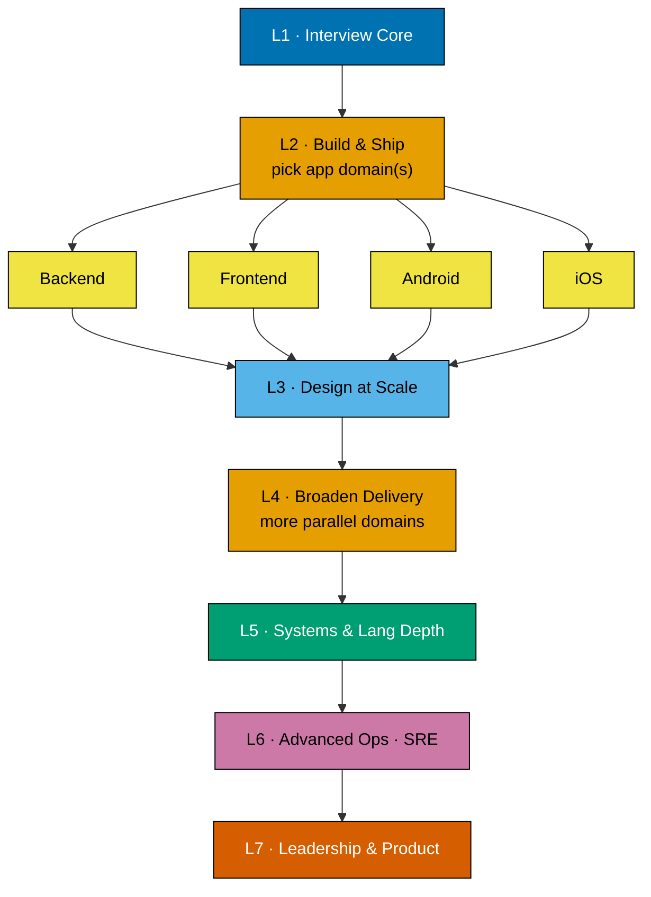

# Product Requirements — The Well-Grounded Software Engineer

## Product Overview

A new self-contained section under `learn/software-engineering/` on ayokoding-www, built for
**breadth-across-the-field with by-example depth per topic**, sequenced as a **progressive learning
journey**: most-fundamental / most-interview-relevant first, then deeper and more specialized. Two
parallel tracks — **learning** and **drilling** — cover the same 32 topics in the same order. English
only. Static markdown; no app code.

**The goal is an outcome, not a page count**: a reader who works this section becomes a
**well-grounded software engineer** — grounded enough to operate at **any company size, at any level
of complexity, and at any career altitude from individual contributor up to CTO**. Topic and tutorial
length are explicitly not a concern (per the user); depth-to-grounding of each topic's core is.

**Pace target (per user):** each topic's learning content is authored at a pace **comparable to an
ayokoding By Example tutorial** — heavily annotated, incremental, code-first where code fits, with
annotation density **1.0–2.25 comments per code line per example**. [Repo-grounded —
`docs-creating-by-example-tutorials` skill / `apps-ayokoding-www-by-example-checker`]

**Hybrid by topic nature:** code-centric topics use the ayokoding **By Example** format; concept-centric
topics use an **annotated-concept** format (equal-density worked examples + accessible Mermaid
diagrams) so the pace stays comparable even where a strict 75–85-code-example format would be
awkward.

This is **content-only** (markdown under `apps/ayokoding-www/content/`). It is not a UI/component
change, so the UI-design-funnel requirement does not apply.

## Learning Journey (ordering rationale + parallel tracks)

The 32 topics are sequenced into **seven progressive levels** under an **interview/job-relevance-first**
principle (per user): the earliest levels are what a software-engineering **job interview** is most
likely to test and what you must master to be productive on the job; niche and academic material is
pushed deeper. Concretely, **app-building (backend / frontend / mobile) comes before OS-level depth**
so a reader becomes "immediately dangerous" — job-ready — as fast as possible, then goes deep on
systems/language internals afterward. **Levels 2 and 4 are parallel specialization tracks** — a reader
picks the app domain(s) matching their path rather than doing all serially. Levels 5–7 are
systems/language depth, advanced operations, and leadership, reached once the core is solid.

The seven-level journey (level titles only; the canonical table below lists every topic per level,
and the two L2/L4 "pick your app domain(s)" fan-outs are shown once, at L2, for readability):



Both the learning and drilling tracks follow this exact same level order and topic order; the
"parallel tracks" are a **reading-path affordance** (the L2 app domains and the L4 broaden-delivery
domains are independent of each other), not a second content layout.

## Personas

- **Mid/senior engineer, periodic refresher** — reloads a topic in depth and self-tests it stuck.
- **Interview candidate** — sweeps L1 for the interview core, then their L2 app domain (backend /
  frontend / mobile), then L3 design.
- **Career-switcher / bootcamp grad consolidating** — follows the journey top-to-bottom to build a
  coherent breadth map, picking one L4 track.
- **Engineer working AI-assisted** — wants fundamentals sharp enough to judge and correct
  LLM-generated output rather than defer to it.
- **Engineer levelling up across altitudes** — wants grounding broad and deep enough to move between
  company sizes and complexity levels, and up the ladder from IC toward CTO, without a blind spot
  becoming a ceiling.

## The 32 Topics — canonical table (journey order; identical in both tracks)

This table is the **single source of truth** for topics, level, slug, format, primary language, and
weights. Other docs reference it rather than re-enumerating. Weights encode the journey order.

**Topic set is still OPEN** — the user may add more topics before the plan is locked; the delivery
checklist and full tech-docs tree are authored only after the list is frozen.

| #   | Level                         | Topic                            | Slug                                | Learning format   | Primary language | Learn wt | Drill wt |
| --- | ----------------------------- | -------------------------------- | ----------------------------------- | ----------------- | ---------------- | -------- | -------- |
| 1   | L1 · Interview Core           | Data Structures & Algorithms     | `data-structures-and-algorithms`    | By Example        | Python           | 101      | 201      |
| 2   | L1 · Interview Core           | Computer Science Foundations     | `computer-science-foundations`      | Annotated-concept | Python \*        | 102      | 202      |
| 3   | L1 · Interview Core           | Computer Networking              | `computer-networking`               | Annotated-concept | Python \*        | 103      | 203      |
| 4   | L1 · Interview Core           | Object-Oriented Programming      | `object-oriented-programming`       | By Example        | Python           | 104      | 204      |
| 5   | L1 · Interview Core           | Programming Paradigms            | `programming-paradigms`             | By Example        | Python \*\*      | 105      | 205      |
| 6   | L1 · Interview Core           | Functional Programming           | `functional-programming`            | By Example        | Python           | 106      | 206      |
| 7   | L1 · Interview Core           | Concurrency & Parallelism        | `concurrency-and-parallelism`       | By Example        | Python           | 107      | 207      |
| 8   | L2 · Build & Ship             | Software Engineering Practices   | `software-engineering-practices`    | Annotated-concept | Python \*        | 108      | 208      |
| 9   | L2 · Build & Ship             | Data Storage (Databases)         | `data-storage`                      | By Example        | SQL + Python †   | 109      | 209      |
| 10  | L2 · Build & Ship             | Backend Development              | `backend-development`               | By Example        | Python           | 110      | 210      |
| 11  | L2 · Build & Ship             | Frontend Development             | `frontend-development`              | By Example        | TypeScript †     | 111      | 211      |
| 12  | L2 · Build & Ship             | Android App Development          | `android-app-development`           | By Example        | Kotlin †         | 112      | 212      |
| 13  | L2 · Build & Ship             | iOS App Development              | `ios-app-development`               | By Example        | Swift †          | 113      | 213      |
| 14  | L3 · Design at Scale          | Software Architecture            | `software-architecture`             | Annotated-concept | Python \*        | 114      | 214      |
| 15  | L3 · Design at Scale          | System Design                    | `system-design`                     | Annotated-concept | Python \*        | 115      | 215      |
| 16  | L4 · Broaden Delivery         | Windows App Development          | `windows-app-development`           | By Example        | C# †             | 116      | 216      |
| 17  | L4 · Broaden Delivery         | Linux App Development            | `linux-app-development`             | By Example        | Python           | 117      | 217      |
| 18  | L4 · Broaden Delivery         | Cloud, Containers & IaC          | `cloud-containers-and-iac`          | Annotated-concept | YAML/HCL †       | 118      | 218      |
| 19  | L4 · Broaden Delivery         | Data Engineering                 | `data-engineering`                  | Annotated-concept | Python           | 119      | 219      |
| 20  | L4 · Broaden Delivery         | Creating AI-Powered Apps         | `creating-ai-powered-apps`          | By Example        | Python           | 120      | 220      |
| 21  | L4 · Broaden Delivery         | IT Security                      | `it-security`                       | Annotated-concept | Python \*        | 121      | 221      |
| 22  | L5 · Systems & Language Depth | Linux OS                         | `linux-os`                          | By Example        | C + shell †      | 122      | 222      |
| 23  | L5 · Systems & Language Depth | Windows OS                       | `windows-os`                        | By Example        | C + PowerShell † | 123      | 223      |
| 24  | L5 · Systems & Language Depth | System Programming               | `system-programming`                | By Example        | C †              | 124      | 224      |
| 25  | L5 · Systems & Language Depth | Lisp                             | `lisp`                              | By Example        | Scheme †         | 125      | 225      |
| 26  | L5 · Systems & Language Depth | Type Systems (Hindley–Milner)    | `type-systems`                      | By Example        | OCaml/Haskell †  | 126      | 226      |
| 27  | L5 · Systems & Language Depth | Compilers, Parsers & Transpilers | `compilers-parsers-and-transpilers` | By Example        | Python           | 127      | 227      |
| 28  | L6 · Advanced Ops             | Site Reliability Engineering     | `site-reliability-engineering`      | Annotated-concept | Python \*        | 128      | 228      |
| 29  | L7 · Leadership & Product     | IT Governance (IT GRC)           | `it-governance-grc`                 | Annotated-concept | — ‡              | 129      | 229      |
| 30  | L7 · Leadership & Product     | Project Management               | `project-management`                | Annotated-concept | — ‡              | 130      | 230      |
| 31  | L7 · Leadership & Product     | Software Product Engineering     | `software-product-engineering`      | Annotated-concept | — ‡              | 131      | 231      |
| 32  | L7 · Leadership & Product     | Engineering Management           | `engineering-management`            | Annotated-concept | — ‡              | 132      | 232      |

**Primary-language legend**:

- **Python is the primary language** — used across every topic where it is honest to do so, for
  cross-topic consistency (DD-7).
- `*` — concept-centric topic; **Python** is used wherever code appears, otherwise prose + diagrams.
- `**` — **Programming Paradigms** survey is anchored in Python but shows other languages
  illustratively where a paradigm demands it.
- `†` — **platform- or subject-mandated exception** to the Python primary: the topic's subject _is_
  that language/platform (Lisp, the ML-family Hindley–Milner type system, C for the low-level
  memory/syscall boundary, TypeScript for the browser, Kotlin/Swift/C# for native mobile/desktop,
  **SQL as the query language of relational storage** — accessed from Python drivers; **YAML/HCL**
  as the declarative language of container manifests and infrastructure-as-code).
- `‡` — leadership/governance topic with minimal-to-no code; taught via prose, worked scenarios, and
  diagrams.

**Format split**: 19 By-Example topics, 13 Annotated-concept topics. Topic slugs are identical across
both tracks (only parent folder + weight differ), so the two tracks stay in the same order. The
ordering requirement is satisfied at the **topic** level; the learning track's per-topic pages are
richer (a By-Example-scale subtree) while the drilling track is one page per topic.

**Paradigm topics split-out** (per user decision): **Object-Oriented Programming** (3), **Functional
Programming** (5), **Lisp** (22), and **Type Systems / Hindley–Milner** (23) are now **standalone
journey topics**, no longer folded inside Programming Paradigms (4). Programming Paradigms (4) remains
as the survey/overview that frames how these paradigms relate; the four dedicated topics go deep on
each. Under the interview-first ordering, OOP, Programming Paradigms, and Functional Programming stay
in L1 (commonly interviewed), while Lisp and Hindley–Milner move down to **L5 · Systems & Language
Depth** (deep mastery, rarely interviewed directly).

**Per-topic detail lives in [syllabus.md](./syllabus.md)** — the companion doc enumerating, for every
one of the 32 topics, the concrete **items** (subtopics) and the specific **worked examples** each
track authors. The delivery checklist points each per-topic step at its syllabus section.

## Depth Targets — outcome over length (per topic)

**The measure of done is the reader outcome, not page length or example count.** Per the user: length
of any topic or of the whole tutorial does not matter — what matters is that a reader who works a
topic comes away **well-grounded** in it: able to operate at any company size, at any level of
complexity, from individual contributor up to CTO. Each topic is authored to whatever depth achieves
that grounding of its core surface, no more and no less.

The by-example _pace_ still holds (heavily annotated, incremental, real-code, **1.0–2.25** comments
per code line per example) — that governs how densely each example is explained, not how many pages
the topic runs to. The checker density/format bands
(`apps-ayokoding-www-by-example-checker` / `apps-ayokoding-www-general-checker`) are applied as
**quality floors**, not as length caps: a topic is done when its core is covered to mastery depth and
clears the checker, however long that turns out to be.

## Learning-track anatomy — By Example topics

Each By-Example learning topic is a subtree following the ayokoding By Example content type:

- `_index.md` — topic nav.
- `overview.md` — what/why, prerequisites, how the examples progress.
- Example page(s) (e.g. `beginner.md` / `intermediate.md` / `advanced.md`) whose examples each use the
  **five-part example structure** and hit the **1.0–2.25** density.
  [Repo-grounded — `docs-creating-by-example-tutorials`]

## Learning-track anatomy — Annotated-concept topics

Each annotated-concept learning topic is a subtree at equal density:

- `_index.md` — topic nav.
- `overview.md` — mental model + how the worked examples/diagrams progress.
- Worked-example page(s): each concept introduced via an **annotated worked example** (code,
  pseudocode, config, or a captioned accessible Mermaid diagram) at the same 1.0–2.25 density on every
  code/pseudocode block, incremental simple → real-world.

Mermaid diagrams use the verified WCAG-compliant palette. [Repo-grounded — `docs-creating-accessible-diagrams`]

## Drilling-track anatomy (unchanged — all four drill forms)

Each drilling topic is a **single page** using this exact section order:

1. **Recall Q&A (flashcards)** — question + collapsible answer via `<details>` (active recall).
2. **Applied problems / scenarios** — "design X" / "what breaks here?" prompts with worked solutions
   in `<details>`.
3. **Code katas / exercises** — small hands-on tasks with reference solutions in `<details>`
   (concept-centric topics substitute a short design exercise where code doesn't fit).
4. **Self-check mastery checklist** — "Can you explain X without notes?" checkboxes to surface gaps.

`<details>` collapsibles are already used in existing ayokoding-www content, so no new tooling is
needed. [Repo-grounded — `apps/ayokoding-www/content/en/learn/business/corporate-finance.md`]

## User Stories

- **US-1** — As a refreshing engineer, I want by-example-depth learning per topic so I actually
  relearn it, not just skim a summary.
- **US-2** — As a self-tester, I want a matching drilling page per topic so I can verify recall.
- **US-3** — As a candidate, I want the topics ordered interview/job-relevance-first (interview core,
  then app-building, then depth) so I study in the most useful sequence and become job-ready fast.
- **US-4** — As a specializing engineer, I want the L2 app domains (and the L4 broaden-delivery
  domains) to be parallel tracks so I pick my path (e.g. backend or mobile) instead of reading all
  domains.
- **US-5** — As a reader, I want every topic reachable from the section landing and from the
  `learn/software-engineering/` nav.
- **US-6** — As a gap-finder, I want a self-check checklist per topic to surface what I don't know.
- **US-7** — As an AI-assisted engineer, I want fundamentals deep enough to judge and correct
  generated output rather than trust it blindly.

## Acceptance Criteria (Gherkin)

```gherkin
Feature: The Well-Grounded Software Engineer section

  Background:
    Given the ayokoding-www content tree
    And the section root "learn/software-engineering/the-well-grounded-software-engineer"

  Scenario: Section landing, overview, and journey map exist
    Given the section root
    When a reader opens the section
    Then an "_index.md" landing page lists both the learning and drilling tracks
    And an "overview.md" explains the read-then-drill workflow and shows the seven-level journey Mermaid map

  Scenario: Journey ordering is interview/job-relevance-first and consistent across tracks
    Given the 32 defined topics
    When the learning and drilling tracks are compared
    Then each track covers exactly the same 32 topics in the same weight order
    And the order runs from Level 1 (interview core) through Level 7 (leadership and product)
    And app-building topics (backend, frontend, mobile) precede OS-level depth topics
    And no topic is present in one track but missing from the other

  Scenario: By-Example learning topic meets by-example pace
    Given a By-Example learning topic
    When its example pages are reviewed
    Then examples use the five-part example structure
    And every example holds an annotation density between 1.0 and 2.25 comments per code line
    And the topic clears apps-ayokoding-www-by-example-checker with no unresolved findings

  Scenario: Annotated-concept learning topic meets comparable density
    Given an annotated-concept learning topic
    When its worked-example pages are reviewed
    Then each concept is introduced via an annotated worked example or captioned accessible diagram
    And every code or pseudocode block holds a 1.0 to 2.25 annotation density
    And it clears apps-ayokoding-www-general-checker with no unresolved findings

  Scenario: Drilling page follows the fixed anatomy with all four drill forms
    Given any drilling-track topic page
    When the page is read
    Then it contains, in order, Recall Q&A, Applied problems, Code katas, and a Self-check checklist
    And every question or exercise hides its answer in a collapsible "<details>" block

  Scenario: Navigation wiring
    Given the "learn/software-engineering/_index.md" navigation
    When a reader browses software-engineering
    Then "The Well-Grounded Software Engineer" appears in the list
    And it links to the new section landing

  Scenario: Content passes quality gates
    Given all new content pages
    When the ayokoding content checkers and markdown lint run
    Then the applicable maker's checker, facts-checker, and link-checker report no unresolved findings
    And markdownlint, mermaid validation, and the repo link/heading validators pass

  Scenario: Every topic is detailed to item and example before authoring
    Given the companion syllabus.md
    When any of the 32 topics is inspected
    Then syllabus.md lists that topic's concrete items (subtopics) and its named worked examples
    And the authored learning subtree covers every listed item
    And each listed worked example appears in the learning or drilling content

  Scenario: English-only in this plan
    Given the deferred Indonesian mirror
    When the content tree is inspected
    Then only "content/en/..." pages are added
    And no "content/id/..." pages are created by this plan
```

## Product Scope

**In scope**: `_index.md` + `overview.md` (with the journey Mermaid map); a `learning/` subtree with a
By-Example-scale learning topic for each of the 32 topics (hybrid format per the canonical table),
covering every item/example enumerated in [syllabus.md](./syllabus.md); a `drilling/` subtree with one
drill page per topic; nav wiring in `learn/software-engineering/_index.md` and `learn/_index.md`.

**Out of scope**: Indonesian mirror; interactive/JS flashcards; scoring/progress state; edits to
existing deep subtrees; any `apps/ayokoding-www/src/` code.

## Product Risks

| Risk                                                                     | Mitigation                                                                                                                                           |
| ------------------------------------------------------------------------ | ---------------------------------------------------------------------------------------------------------------------------------------------------- |
| Breadth (32 topics) risks shallow, "well-grounded"-in-name-only coverage | Depth-to-mastery per topic is the done-bar (not length); by-example pace + checker quality floors; level-phased, one topic finished before the next. |
| Concept topics can't hit strict by-example format                        | Annotated-concept format defined with equal density + diagrams.                                                                                      |
| Factual drift across 32 wide topics                                      | facts-checker pass on all pages; standard-library-first, cited claims.                                                                               |
| `<details>` renders poorly in the Next.js content pipeline               | Verify rendering in a Playwright smoke check before archival.                                                                                        |
| Two tracks drift in topic set/order                                      | Weight scheme (learn 101..132 / drill 201..232) + explicit parity gate.                                                                              |
| Multi-language exceptions dilute the "one primary language" goal         | Python is the default everywhere it's honest; every non-Python topic is a documented platform/subject exception in the canonical table.              |
| Journey Mermaid not color-blind safe                                     | Use verified WCAG palette; mermaid-validation gate in delivery.                                                                                      |
