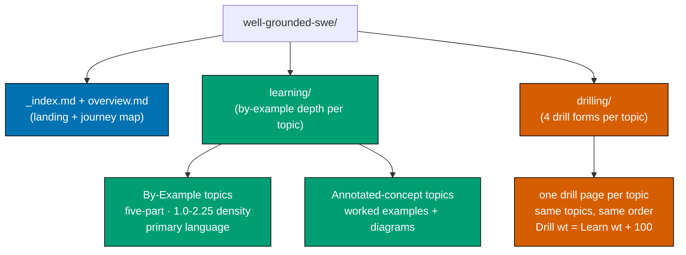
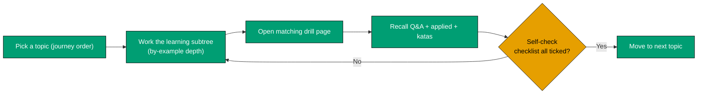
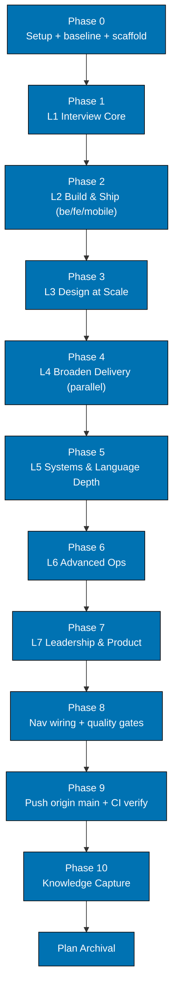

# Technical Docs — The Well-Grounded Software Engineer

## Summary

Content-only addition to ayokoding-www: a new self-contained section under
`apps/ayokoding-www/content/en/learn/software-engineering/the-well-grounded-software-engineer/`, with
two sibling tracks (`learning/`, `drilling/`) covering the **same topic set in identical order**. The
canonical topic set, per-topic level, learning format, primary language, and weights live in
[prd.md](./prd.md) — **the single source of truth**. This file is deliberately **table-referential**:
it describes the _shape_ of each artifact per-topic rather than hard-coding topic slugs, so adding or
removing a topic is a one-row edit in prd.md plus the mechanical per-row work described here. No
`apps/ayokoding-www/src/` code changes. English only. [Repo-grounded — nx project `ayokoding-www`,
`apps/ayokoding-www/project.json`]

At authoring time the canonical table holds **32 topics** across **seven journey levels** (L1 Interview
Core → L7 Leadership & Product), ordered **interview/job-relevance-first** (app-building before
OS-level depth); L2 (app domains) and L4 (broaden-delivery domains) are parallel specialization sets.
See prd.md for the authoritative list; all counts below are derived from it, not independently
maintained. Every topic's concrete items and worked examples are enumerated in
[syllabus.md](./syllabus.md).

## Content-Tree Layout (per-topic shape, not a hard-coded slug list)

For **N** canonical topics (currently 32), the section is:

```text
apps/ayokoding-www/content/en/learn/software-engineering/
└── the-well-grounded-software-engineer/
    ├── _index.md                     # section landing (weight 1750; nav to both tracks + journey map)
    ├── overview.md                   # what this is + read-then-drill workflow + seven-level journey Mermaid map
    ├── learning/
    │   ├── _index.md                 # learning-track landing (weight 100; lists every topic in journey order)
    │   └── <topic-slug>/             # one subtree PER canonical topic, folder = table "Slug", weight = table "Learn wt"
    │       ├── _index.md             # topic nav (frontmatter weight = "Learn wt")
    │       ├── overview.md           # what/why, prerequisites, primary language, how examples progress
    │       └── <example pages>       # By-Example topics: by-example/{overview,beginner,intermediate,advanced}
    │                                 # Annotated-concept topics: worked-example pages by theme
    └── drilling/
        ├── _index.md                 # drilling-track landing (weight 200; same topic order as learning/)
        └── <topic-slug>.md           # one page PER canonical topic, weight = table "Drill wt"
```

**Asymmetry is intentional**: each `learning/<topic-slug>/` is a subtree (By-Example-scale content),
while each `drilling/<topic-slug>.md` is a single page. The user's ordering requirement is satisfied
at the **topic** level — both tracks list the same topic slugs in the same weight order.

The By-Example topic subtree mirrors the existing `system-design/by-example/` layout
(`overview` → `beginner` → `intermediate` → `advanced`, optional `cases`). [Repo-grounded —
`apps/ayokoding-www/content/en/learn/software-engineering/system-design/_index.md`]

`_index.md` files are Hugo/Next-content section indexes; the section `weight: 1750` places the new
section immediately after `system-design` (weight 1700) in the software-engineering nav.
[Repo-grounded — `system-design/_index.md` uses `weight: 1700`]

## Weight Scheme (encodes journey order + track identity)

- Section landing: **1750**. Overview: **1** (first child).
- Learning track landing: **100**; each learning topic: **101 + (journey index − 1)** → currently
  101..132, exactly the "Learn wt" column in prd.md.
- Drilling track landing: **200**; each drilling topic: **201 + (journey index − 1)** → currently
  201..232, exactly the "Drill wt" column in prd.md.
- **Parity invariant**: for every topic, `Drill wt = Learn wt + 100`. This is the mechanical parity
  gate that keeps the two tracks in the same order (verified in delivery.md).

## Frontmatter Convention

All pages use the existing ayokoding content frontmatter shape. [Repo-grounded —
`system-design/_index.md`]

```yaml
---
title: "Data Structures & Algorithms"
weight: 101
date: 2026-07-11T00:00:00+07:00
draft: false
description: "Relearn core data structures and algorithms by example, then drill for recall"
---
```

- `title` — the topic's "Topic" cell from the prd table (human title, not the slug).
- `weight` — the topic's "Learn wt" (learning subtree) or "Drill wt" (drilling page) from the table.
- `description` — one line; states the topic and the relearn-then-drill intent.

Route pattern for cross-links: `/en/c/learn/software-engineering/the-well-grounded-software-engineer/...`.
[Repo-grounded — existing content links use `/en/c/learn/...`]

## Primary-Language Rule (DD-7)

Every topic that uses code uses a **real programming language, never pseudocode**, and **Python is the
primary language** used across as many topics as possible for cross-topic consistency. A topic uses a
non-Python language only when the prd table's **Primary language** column marks it as a platform- or
subject-mandated exception (`†`). The authoring agent MUST read the language cell for the topic before
writing any code and use exactly that language:

- **Python** — DS&A, Concurrency & Parallelism, Backend, Linux App Dev, Data Engineering, AI-Powered
  Apps, Compilers/Parsers/Transpilers, OOP, Functional Programming, and (where code appears) every
  concept-centric topic (`*`).
- **Exceptions (`†`)** — system-programming & OS-internals → **C**; Lisp → **Scheme**; Type Systems
  (Hindley–Milner) → **OCaml/Haskell**; Frontend → **TypeScript**; Android → **Kotlin**; iOS →
  **Swift**; Windows App → **C#**; Cloud, Containers & IaC → **YAML/HCL** (container manifests +
  Terraform); Data Storage → **SQL + Python**.
- **Leadership/governance (`‡`)** — minimal-to-no code; prose + worked scenarios + diagrams.

Each topic's `overview.md` states its primary language up front so the reader knows what to expect.

## Depth-to-Mastery Rule — outcome over length (DD-8)

**The done-bar is the reader outcome, not page length or example count.** Per the user, length of any
topic or of the whole tutorial does not matter; what matters is that a reader who works a topic comes
away **well-grounded** — able to operate at any company size, any complexity level, from IC to CTO.
The by-example _pace_ (annotation density **1.0–2.25** comments per code line per example, incremental
real-code) governs how densely each example is explained, not how many pages a topic runs to. The
per-agent checker density/format bands are applied as **quality floors**, never as length caps: a
topic is done when its core surface is covered to mastery depth and it clears the checker, however
long that turns out to be.

## Learning-track format detail

### By-Example topics (prd "Learning format" = By Example)

Authored via `apps-ayokoding-www-by-example-maker` following the `docs-creating-by-example-tutorials`
skill, in the topic's prd-designated primary language:

- **Five-part example structure** per example.
- **Annotation density 1.0–2.25** comments per code line, per example.
- **Standard-library-first**, incremental beginner → advanced.
- Subtree shape: `overview.md` + `by-example/{overview,beginner,intermediate,advanced}` (optional
  `cases`), mirroring `system-design/by-example/`.

Validated via `apps-ayokoding-www-by-example-checker` (density, five-part structure, progression).
[Repo-grounded — agent + skill exist]

### Annotated-concept topics (prd "Learning format" = Annotated-concept)

Authored via `apps-ayokoding-www-general-maker`:

- Each concept introduced via an **annotated worked example** (code in the primary language,
  pseudocode only where code genuinely does not fit, config, or a captioned accessible Mermaid
  diagram) at the same **1.0–2.25** density on every code block.
- **Accessible Mermaid** diagrams use the verified WCAG palette. [Repo-grounded —
  `docs-creating-accessible-diagrams`]
- Incremental simple → real-world; covered to mastery depth (DD-8), not to a fixed count.

Validated via `apps-ayokoding-www-general-checker`.

## Drilling-track markup

Each drilling page is a single markdown file using native `<details>` collapsibles for hidden
answers — already used in existing ayokoding-www content, so the Next.js content pipeline renders
them. [Repo-grounded — `apps/ayokoding-www/content/en/learn/business/corporate-finance.md` contains
`<details>`]

Every drilling page follows the **same four-section anatomy in this order** (per prd):

```markdown
### Recall Q&A (flashcards)

**Q:** What does the CAP theorem force you to trade off during a network partition?

<details>
<summary>Answer</summary>

Under a partition you must choose **Consistency** (reject/stall to avoid stale reads) **or**
**Availability** (serve possibly-stale data). Partition tolerance is not optional in a distributed
system.

</details>

### Applied problems / scenarios

**Scenario:** A single Postgres primary is at 100% CPU on writes at 10k writes/sec...

<details>
<summary>Worked solution</summary>

... reference reasoning ...

</details>

### Code katas / exercises

**Kata:** Implement an LRU cache with O(1) get/put (in the topic's primary language).

<details>
<summary>Reference solution</summary>

... annotated solution in the primary language ...

</details>

### Self-check mastery checklist

- [ ] I can explain sharding vs partitioning without notes
- [ ] I can derive the average-case complexity of quicksort
```

For leadership/governance topics (`‡`) the "Code katas" section becomes a **short design/decision
exercise** where code does not fit.

## Diagrams

### Section structure



### Reader workflow (learn → drill loop)



### Delivery phase flow (level-phased)



## File Impact (derived from the prd table; N = current topic count)

| Path                                                                 | Change | Notes                                                      |
| -------------------------------------------------------------------- | ------ | ---------------------------------------------------------- |
| `.../the-well-grounded-software-engineer/_index.md`                  | New    | Section landing, weight 1750                               |
| `.../the-well-grounded-software-engineer/overview.md`                | New    | Read-then-drill workflow + seven-level journey Mermaid map |
| `.../the-well-grounded-software-engineer/learning/_index.md`         | New    | Learning-track landing, weight 100                         |
| `.../learning/<topic-slug>/…` × N                                    | New    | One By-Example / Annotated-concept subtree per prd row     |
| `.../the-well-grounded-software-engineer/drilling/_index.md`         | New    | Drilling-track landing, weight 200                         |
| `.../drilling/<topic-slug>.md` × N                                   | New    | One four-section drill page per prd row                    |
| `apps/ayokoding-www/content/en/learn/software-engineering/_index.md` | Edit   | Add section link to the SE nav list                        |
| `apps/ayokoding-www/content/en/learn/_index.md`                      | Edit   | Add sub-entry under Software Engineering                   |

No `apps/ayokoding-www/src/` files, no `project.json`, no new npm packages.

## Design Decisions

- **DD-1: Nested under `software-engineering/`, not a new top-level section.** Chosen by the user;
  keeps it beside the deep SE content it complements. [User decision]
- **DD-2: Self-contained, no links into existing subtrees.** Chosen by the user; each topic stands
  alone so a reader is never bounced elsewhere. [User decision]
- **DD-3: By-example pace per topic, hybrid by nature.** Code topics use the By Example content type;
  concept topics use an equal-density annotated-concept format so pace stays comparable where a strict
  code-example format is awkward. [User decision]
- **DD-4: Two tracks, symmetric at the topic level.** `learning/` (rich subtree per topic) +
  `drilling/` (one page per topic), same slugs, same weight order; parity enforced by
  `Drill wt = Learn wt + 100`. [User decision]
- **DD-5: English only this plan.** Indonesian mirror deferred. [User decision]
- **DD-6: `<details>` for hidden drill answers.** Reuses an existing, already-rendering markup
  pattern; no new tooling. [Repo-grounded]
- **DD-7: Single primary language = Python, with documented exceptions.** Any code uses a real
  language; Python is used everywhere it is honest; every non-Python topic is a platform/subject
  exception recorded in the prd "Primary language" column. [User decision]
- **DD-8: Outcome over length.** Depth-to-mastery of each topic's core is the done-bar; checker bands
  are quality floors, not length caps; the target reader outcome is "well-grounded from IC to CTO,
  any company size, any complexity." [User decision]
- **DD-9: Journey ordering into seven levels, interview/job-relevance-first; L2 & L4 parallel.**
  Topics sequenced by what a SWE job interview most tests + what makes a reader job-ready first, then
  deeper/niche — concretely, **app-building (backend/frontend/mobile) precedes OS-level depth** so the
  reader becomes "immediately dangerous" fast; Lisp and Hindley–Milner move to L5 depth. The L2 app
  domains and the L4 broaden-delivery domains are independent parallel tracks a reader chooses among.
  [User decision]
- **DD-10: Table-referential plan.** tech-docs/delivery describe per-topic shape and loop over the
  prd table rather than hard-coding slugs, so topic additions stay cheap. [Judgment call]
- **DD-11: Per-topic syllabus in a companion doc.** Every topic's concrete items (subtopics) and named
  worked examples are enumerated in [syllabus.md](./syllabus.md); each delivery per-topic step authors
  exactly its syllabus section, so "detail every item and example" is specified once and not scattered
  across the checklist. [User decision]
- **DD-12: the `specs` Gherkin-_authoring_ requirement does not apply to this plan.** Per the
  [Feature Change Completeness Convention](../../../repo-governance/development/quality/feature-change-completeness.md),
  the Gherkin-companion requirement binds code changes under `apps/`/`libs/`; this plan touches zero
  files under `apps/ayokoding-www/src/` and adds no `project.json` targets — it is pure markdown
  content under `apps/ayokoding-www/content/`, so no new `.feature` files are authored. The
  `specs:behavior:coverage` target is still _run_ in Phase 8's affected quality gate (it passes
  trivially, since no new uncovered code exists) — the plan is exempt from writing new Gherkin, not
  from executing the gate. [Repo-grounded — Feature Change Completeness Convention]

## Dependencies

- Content-authoring agents: `apps-ayokoding-www-by-example-maker`, `apps-ayokoding-www-general-maker`.
- Validators: `apps-ayokoding-www-by-example-checker`, `apps-ayokoding-www-general-checker`,
  `apps-ayokoding-www-facts-checker`, `apps-ayokoding-www-link-checker`.
- Skills: `docs-creating-by-example-tutorials`, `docs-creating-accessible-diagrams`,
  `apps-ayokoding-www-developing-content`.
- No new npm packages, no `project.json` target changes.

## Rollback

Pure additive content. Rollback = delete the `the-well-grounded-software-engineer/` folder and revert
the two `_index.md` nav edits. No data migration, no build-config change, no runtime state.

## Testing & Verification

- Markdown lint + repo link/heading validators (pre-commit + CI). [Repo-grounded — AGENTS.md
  Markdown Quality]
- `nx run ayokoding-www:build` succeeds with the new content. [Repo-grounded — `build` target exists
  in `apps/ayokoding-www/project.json`]
- Content checkers (by-example / general / facts / link) report no unresolved findings.
- Playwright smoke: section landing + one learning page + one drilling page render; `<details>`
  expands; nav link resolves; zero console errors.
- **Not** a UI/component change: the UI-design-funnel does not apply (no new UI components; pure
  markdown content). The **rule-15 three-tester retest DOES apply**: this plan adds ~64 new
  browser-rendered pages plus 2 nav entries to the live ayokoding-www site, which is a user-facing
  feature change under [User-Facing Delivery Hardening Convention](../../../repo-governance/development/quality/user-facing-delivery-hardening.md)
  Rule 15 — content-only is not itself an exemption from Rule 15. See the Phase 8 retest step in
  [delivery.md](./delivery.md).
