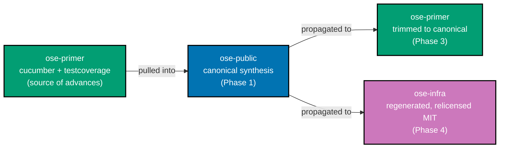
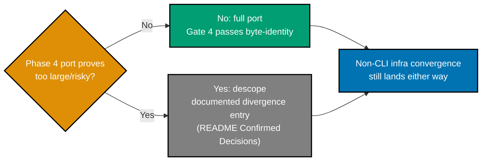
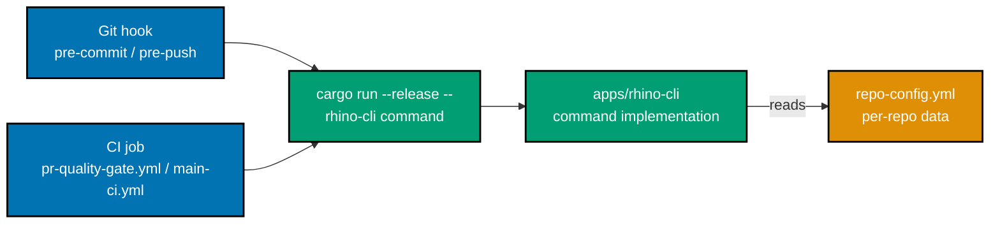

# Tech Docs — Unify rhino-cli, SDLC & Repo Structure (Second Pass)

## 1. Relationship to the First Plan

This plan **inherits the entire target standard** of the first plan
([tech-docs](../../done/2026-07-01__standardize-rhino-cli-sdlc-parity/tech-docs.md)) — the SDLC gate
mechanics (§1 lifecycle), the Nx target-name standard (§5), the testing-architecture standard (§4),
the harness coverage standard (§3.2), the target-standard synthesis (§7), and the divergence policy
(§7.1). Those are **not re-derived here**; they remain authoritative.

What this plan adds is a **second, stricter target** the first plan did not achieve: the standardized
layer must be **byte-identical**, including `apps/rhino-cli`'s own source, and every `⚠️`
"functionally-equivalent mechanism divergence" must converge. This document records the **verified
current state** (§2), the delta to close (§3), the **rhino-cli source-identity standard** (§4), the
canonical decisions (§5), the phase design (§6), and the divergence policy (§7).

## 2. Current State (Verified 2026-07-02)

A fresh three-repo read-only sweep (superseding all stale delivery.md "done" notes). ✅ = at target,
⚠️ = functionally-equivalent but mechanism-divergent, ❌ = divergent/incomplete.

### 2.1 rhino-cli source

| Aspect                     | public                                                                                                                                      | primer                            | infra                                                                                                                                                                                                                                                                                                               | Verdict |
| -------------------------- | ------------------------------------------------------------------------------------------------------------------------------------------- | --------------------------------- | ------------------------------------------------------------------------------------------------------------------------------------------------------------------------------------------------------------------------------------------------------------------------------------------------------------------- | :-----: |
| `src/*.rs` file count      | 155                                                                                                                                         | 231                               | 235                                                                                                                                                                                                                                                                                                                 |   ❌    |
| `src` diff vs public       | —                                                                                                                                           | 5 differ, 15 only-in-one          | **100 differ, 51 only-in-one** (diff module naming)                                                                                                                                                                                                                                                                 |   ❌    |
| `cli.rs`                   | canonical (1193 ln)                                                                                                                         | **byte-identical to public**      | differs (1325 ln, +132)                                                                                                                                                                                                                                                                                             |   ❌    |
| `Cargo.toml` cucumber      | `0.23.0` (dep, **unwired**)                                                                                                                 | `0.22.1` (**fully wired**)        | `0.23.0` (dep, **unwired**)                                                                                                                                                                                                                                                                                         |   ❌    |
| `Cargo.lock`               | distinct sha                                                                                                                                | distinct sha                      | distinct sha                                                                                                                                                                                                                                                                                                        |   ❌    |
| `license` field            | MIT                                                                                                                                         | MIT                               | **LicenseRef-Proprietary** → relicense to MIT (D3)                                                                                                                                                                                                                                                                  |   ❌    |
| lint policy                | strict (`deny` docs)                                                                                                                        | deferred `allow`                  | deferred `allow`                                                                                                                                                                                                                                                                                                    |   ❌    |
| `project.json` target KEYS | 21                                                                                                                                          | 21                                | 21                                                                                                                                                                                                                                                                                                                  |   ✅    |
| `project.json` COMMANDS    | canonical                                                                                                                                   | minor differ                      | differ (deps:audit tool, env globs, coverage regex)                                                                                                                                                                                                                                                                 |   ❌    |
| cucumber BDD harness       | **unwired**                                                                                                                                 | **wired** (11 `[[test]]` + feats) | **unwired**                                                                                                                                                                                                                                                                                                         |   ❌    |
| `env/validate.rs` IaC kind | **stub** (`kind: String`, `.as_str()` match on `"app"` only; any other kind `eprintln!`s "unknown surface kind ... skipped", zero findings) | **stub** (identical to public)    | **REAL** — typed `SurfaceKind::{App,Terraform,Ansible}` enum; `validate_terraform`/`validate_ansible` implemented + unit-tested (~90 ln each); two live surfaces declared in infra's own `repo-config.yml` (`kind: terraform`, `kind: ansible`); wired into `.husky/pre-push` + `validate-env.yml` on every push/PR |   ❌    |

**Interpretation**: public↔primer `cli.rs` is already byte-identical and the src delta is small (5
files + primer's extra testcoverage/cucumber). infra is a different refactor generation. primer is
_ahead_ on cucumber + testcoverage. **infra is ahead on IaC env-drift validation** — its
`validate_terraform`/`validate_ansible` are real, tested, actively-gated logic, while public/primer
carry only a doc-comment "forward-scaffold" stub. Canonical synthesis therefore pulls primer's
advances **and infra's real IaC validators** into public, then propagates
public→primer(trim to canonical)→infra(regenerate) — the canonical form is **best-of-three**, not
best-of-two, or Phase 4's regeneration would silently delete infra's only real Terraform/Ansible
drift-detection capability (see [§11 Technical Risks](#11-technical-risks)).

### 2.2 SDLC wiring

| Surface                        | public                       | primer                       | infra                                                                                                                  | Verdict |
| ------------------------------ | ---------------------------- | ---------------------------- | ---------------------------------------------------------------------------------------------------------------------- | :-----: |
| `.husky/commit-msg`            | canonical                    | identical                    | identical                                                                                                              |   ✅    |
| `.husky/pre-commit`            | canonical                    | **byte-identical to public** | no shebang/`set -e`/Step comments; **inline tool-lint**                                                                |   ❌    |
| `.husky/pre-push`              | canonical                    | identical (modulo excludes)  | **`npx nx`/`npm run` wrappers** replace every `cargo run`                                                              |   ❌    |
| lint-staged `*.cs/.clj/.dart`  | native tools                 | `scripts/format-*.sh`        | `scripts/format-*.sh`                                                                                                  |   ⚠️    |
| lint-staged sh/Docker/actions  | present                      | present                      | **absent** (handled inline in pre-commit)                                                                              |   ❌    |
| canonical workflow filenames   | present                      | present                      | present                                                                                                                |   ✅    |
| `validate-markdown.yml` absent | ✅                           | ✅                           | ✅                                                                                                                     |   ✅    |
| `pr-quality-gate.yml` jobs     | **missing gherkin-card**     | canonical                    | Title-Case `name:`, **6 duplicated per-job `env:` NX_BASE/HEAD blocks** (public: 1 workflow-level block), extra md job |   ❌    |
| `main-ci.yml` jobs             | canonical                    | canonical                    | no standalone `compat-min-version`/`env-validate`; extra md                                                            |   ❌    |
| Codecov removed                | ✅                           | ✅                           | ✅                                                                                                                     |   ✅    |
| naming trigger path            | **`.opencode/agent/` (bug)** | **`.opencode/agent/` (bug)** | `.opencode/agents/`                                                                                                    |   ❌    |

### 2.3 config / targets / specs

| Surface                       | public                            | primer                     | infra                                                | Verdict |
| ----------------------------- | --------------------------------- | -------------------------- | ---------------------------------------------------- | :-----: |
| `repo-config.yml` body/schema | canonical                         | identical                  | identical                                            |   ✅    |
| `repo-config.yml` header cmt  | canonical                         | drops `env-injection` line | reworded coverage/specs/size cmts                    |   ❌    |
| mandatory-six + extras        | 29/29 clean                       | 26/26 clean                | **6 projects missing** deps:audit/compat:min-version |   ❌    |
| `namedInputs.specs` rollout   | **16/29**                         | **20/26**                  | **6/8**                                              |   ❌    |
| specs C4 structure            | 1 stale orphan (`golang-commons`) | complete                   | complete                                             |   ❌    |
| `coverage.projects` registry  | **omits 4 real projects**         | complete                   | complete                                             |   ❌    |
| old 3 config files absent     | ✅                                | ✅                         | ✅                                                   |   ✅    |

> **Denominator note**: the mandatory-six and `namedInputs.specs` rows are counted against the full
> Nx project graph (public 29, primer 26, infra 8), not a directory-only scan of `apps/` and `libs/`
> (public 27, primer 25, infra 7). The directory-only scan structurally cannot see the `*-contracts`
> OpenAPI-spec projects — under `specs/apps/*/containers/contracts/` — that Nx registers outside
> `apps/`/`libs/` (`organiclever-contracts`/`ose-contracts` in public, `crud-contracts` in primer,
> `coralpolyp-contracts` in infra). All delivery items and gates in [§6](#6-phase-design) and
> `delivery.md` enumerate the full Nx project graph for exactly this reason.

Infra's 6 gap projects: `coralpolyp-contracts`, `coralpolyp-be-e2e`, `coralpolyp-fe-e2e` (all three
miss `deps:audit` + `compat:min-version`), `coralpolyp-fe` (miss `compat:min-version`), `libs/ts-ui`,
`libs/ts-ui-tokens` (both miss `deps:audit` + `compat:min-version`).

public's `namedInputs.specs` gaps: 13 projects (most `*-cli` except crane/rhino, most e2e — yet
`organiclever-be-e2e`/`ose-be-e2e` DO have it → internally inconsistent — plus the 2 contracts
projects `organiclever-contracts`/`ose-contracts`). primer gaps: 6 (`clojure-openapi-codegen`,
`elixir-cabbage`, `elixir-gherkin`, `elixir-openapi-codegen`, `ts-ui-tokens`, plus the contracts
project `crud-contracts`). infra gaps: 2 (`ts-ui-tokens`, plus the contracts project
`coralpolyp-contracts`).

public `coverage.projects` omits: `fsharp-crane-core`, `web-ui-token`, `organiclever-contracts`,
`ose-contracts` (registry lists 25; `nx show projects` = 29).

## 3. The Delta to Close

Everything with an ❌ or ⚠️ above. Grouped by owning phase:

- **Canonical synthesis (Phase 1, public)**: pull primer's cucumber harness + testcoverage **and
  infra's real `validate_terraform`/`validate_ansible` env-drift validators (+ their tests)** into
  public; unify lint policy; drive repo-specific behaviour from `repo-config.yml`; fix the
  `.opencode/agent/` bug; canonicalize `repo-config.yml` header comment.
- **public closeout (Phase 2)**: full `namedInputs.specs`; complete `coverage.projects`; delete the
  `golang-commons` orphan; add `gherkin-cardinality` to the PR gate.
- **primer propagation (Phase 3)**: align rhino-cli 5-file delta + cucumber `0.22.1`→canonical;
  full `namedInputs.specs`; fix `.opencode/agent/` bug; agree `*.cs/.clj/.dart` mechanism.
- **infra propagation (Phase 4)**: regenerate rhino-cli to canonical; `npx nx`/`npm run` → direct
  `cargo run`; inline tool-lint → lint-staged; pre-commit shebang/Step comments; add
  `compat-min-version`/`env-validate` jobs; verify/align `gherkin-cardinality` invocation style
  (already wired); lower-kebab workflow `name:`; add missing targets to 6 projects; full
  `namedInputs.specs`; wire cucumber.

## 4. rhino-cli Source-Identity Standard

The end-state: `apps/rhino-cli` is **100% byte-identical** across all three repos — **zero
carve-outs** (per Decisions 3 + 5). Achieved by:

1. **One canonical generation — best-of-THREE.** Synthesize in ose-public the best-of-**three**:
   public's strict lint policy + primer's cucumber harness + primer's testcoverage module +
   **infra's real `validate_terraform`/`validate_ansible` env-drift validators (and their
   `#[cfg(test)]` unit-test modules)** + the richest internal module tree. This becomes the canonical
   `src/`, `Cargo.toml`, `Cargo.lock`, `project.json`. Skipping infra's contribution would make this a
   best-of-two synthesis that silently deletes infra's only real Terraform/Ansible env-drift
   capability during Phase 4's regeneration — see [§11 Technical Risks](#11-technical-risks).
2. **Data-drive ALL repo-specific behaviour.** Everything that legitimately differs per repo —
   env-validation scan paths, domain-areas, ddd-areas — moves into `repo-config.yml` (the per-repo
   data file), so the Rust source **and** every `project.json` command string are identical.
   `application/repo_config/mod.rs` must read these rather than hard-code them; the `env:validation`
   target reads its scan paths from `repo-config.yml` (Decision 5) so infra's IaC globs are data,
   not a divergent command. The canonical `env::validate` dispatcher generalizes `SurfaceKind`
   handling from public/primer's hard-coded `"app"`-only match to infra's typed
   `App`/`Terraform`/`Ansible` dispatch, activated purely by which surfaces a repo **declares** in its
   own `repo-config.yml` — public and primer declare zero `terraform`/`ansible` surfaces, so the real
   validator code no-ops for them **by data, not by stub**, consistent with byte-identical source.
3. **No carve-outs.** infra's rhino-cli is relicensed to MIT (Decision 3), so the `Cargo.toml`
   `license` field matches too. The self-hosted runner label lives in CI-workflow YAML, **not** in
   `apps/rhino-cli`, so it does not affect CLI byte-identity.
4. **cucumber harness is canonical.** primer's `tests/*.rs` (11 `[[test]]` harness=false suites),
   `tests/fixtures`, `tests/golden-master`, and `specs/apps/rhino/behavior/rhino-cli/gherkin/**` are
   the canonical BDD surface, copied identically into public and infra. Canonical cucumber version =
   `0.23.0` (public/infra's current pin; primer's harness code is adapted from `0.22.1` if needed).

**Byte-identity acceptance** (Phase 5): `diff -rq apps/rhino-cli/src` empty pairwise; `diff` of
`Cargo.toml`/`Cargo.lock`/`project.json` **shows no differences** (zero carve-out lines); `cargo test`
cucumber suites pass in all three; `cargo test -p rhino-cli terraform_validator::` and `cargo test -p
rhino-cli ansible_validator::` pass in all three, confirming infra's real IaC env-drift validators
survived the synthesis and regeneration (not merely that the aggregate `cargo test` run is green).

**Dependency position — the canonical-source flow**:

public is the upstream source of truth: primer's already-wired advances flow _into_ public first
(Phase 1), and public's canonical result then flows _out_ to both siblings (Phases 3–4) — never
primer→infra directly.

## 5. Canonical Decisions (user-ratified 2026-07-02)

| #   | Decision                | Ratified choice                                                                                                                             |
| --- | ----------------------- | ------------------------------------------------------------------------------------------------------------------------------------------- |
| 1   | Canonical rhino-cli     | **synthesize in ose-public**, then propagate public→primer→infra                                                                            |
| 2   | Infra rhino-cli scope   | **full port**, isolated as gated Phase 4 (descopable without unwinding Phases 1–3)                                                          |
| 3   | Infra rhino-cli license | **relicense to MIT** — no license carve-out                                                                                                 |
| 4   | `*.cs/.clj/.dart` fmt   | **native tools inline** (`dotnet csharpier format`/`cljfmt fix`/`dart format`); primer+infra converge to public, drop `scripts/format-*.sh` |
| 5   | env-validation paths    | **data-driven from `repo-config.yml`** → `project.json` byte-identical → **zero rhino-cli carve-outs**                                      |
| —   | cucumber direction      | **level up** — adopt primer's wired harness everywhere (not strip); canonical version `0.23.0`                                              |

Net effect of 3 + 5: `apps/rhino-cli` is 100% byte-identical across all three repos, no exceptions.

## 6. Phase Design

**Phase/delivery flow** (gated — a phase does not start until the prior phase's gate passes):

**Phase 4 descope decision branch** (the plan's one conditional branch):

- **Phase 0 — Baseline & re-audit (public).** Install/doctor; run each repo's affected pre-push on a
  no-op to confirm a green starting point; commit the §2 matrices as evidence; resolve any preexisting
  failure before work begins.
- **Phase 1 — Canonical synthesis (public).** Build the canonical rhino-cli (cucumber + testcoverage +
  strict lints + data-driven repo-config), fix latent bugs, finalize canonical docs. RED/GREEN/REFACTOR
  for every rhino-cli source change with companion `.feature` specs.
- **Phase 2 — public closeout.** `namedInputs.specs` on all 29 projects; complete `coverage.projects`;
  delete orphan spec; add PR-gate `gherkin-cardinality`; canonicalize `repo-config.yml` header.
- **Phase 3 — primer propagation.** Copy canonical rhino-cli into primer (align its 5-file delta +
  bump cucumber `0.22.1`→`0.23.0`); full `namedInputs.specs`; fix `.opencode/agent/` bug; converge
  `*.cs/.clj/.dart` to native-tool formatters (drop `scripts/format-*.sh`).
- **Phase 4 — infra propagation (largest; gated).** Regenerate rhino-cli to canonical; **relicense to
  MIT**; **data-drive env-validation paths via `repo-config.yml`** (no project.json carve-out);
  converge `*.cs/.clj/.dart` to native-tool formatters; convert hooks to direct `cargo run`; move
  tool-lint to lint-staged; add pre-commit shebang/Step comments; add missing CI jobs; verify/align
  `gherkin-cardinality` (already wired); lower-kebab workflow `name:`; add missing targets to 6
  projects; full `namedInputs.specs`; wire cucumber. Result: `apps/rhino-cli` byte-identical to
  public, zero carve-outs.
- **Phase 5 — cross-repo byte-identity verification + archival.** The `diff -rq` matrix, `jq` key +
  command comparison, hook diffs, cucumber pass in all three, parity table with zero `⚠️`.

Phases 3 and 4 copy this plan folder into the sibling repo at the start of the phase (per the
[multi-repo parity workflow](../../../repo-governance/workflows/plan/plan-multi-repo-parity-planning.md)),
so the same checklist drives execution there.

## 7. Divergence Policy (Allowed vs. Drift)

**Allowed divergence** (recorded, not flagged):

- App set & per-app deploy CRONs; language gate jobs; infra-only IaC gates
  (terraform/ansible/yamllint); self-hosted runner label; lint-staged formatter entries for languages
  present only in that repo. (All carried forward from the first plan.)
- **`apps/rhino-cli` has NO carve-outs** (Decisions 3 + 5) — `src/`, `Cargo.toml`, `Cargo.lock`, and
  `project.json` are 100% byte-identical across all three repos. The self-hosted runner label is a
  CI-workflow-YAML concern, not part of `apps/rhino-cli`.
- `repo-config.yml` per-repo **data values** (domain-areas, ddd-areas, env-validation scan paths)
  differ; the **schema, header comment, and harness list** are identical.

**Drift** (MUST converge — the work): everything with ❌/⚠️ in §2 — rhino-cli source/Cargo/commands,
cucumber wiring, hook/CI mechanism, workflow `name:` casing + jobs, `namedInputs.specs`, missing
targets, `coverage.projects`, orphan spec, header comment, the two latent bugs.

## 8. Evidence Sources

All §2 cells are Repo-grounded from the 2026-07-02 read-only sweep (three parallel per-surface
audits: rhino-cli identity, SDLC wiring, config/targets/specs). Phase 0 re-runs the sweep and commits
its output so the plan record is reproducible rather than resting on this document alone.

## 9. Architecture

At a system level, every SDLC gate check in any of the three repos resolves to the same invocation
chain: a **git hook** (`.husky/pre-commit` / `pre-push`) or a **CI job**
(`.github/workflows/pr-quality-gate.yml` / `main-ci.yml`) invokes **`cargo run --release --
<rhino-cli-command>`** directly (pre-this-plan, ose-infra instead wraps the same binary via `npx nx
run rhino-cli:*` / `npm run` — the mechanism drift Phase 4 removes) → the invocation reaches an
**`apps/rhino-cli` command implementation** → which reads **`repo-config.yml`** for any
repo-specific input (env-validation scan paths, domain-areas, ddd-areas, `coverage.projects`,
`specs.domain-areas`).

Because `repo-config.yml` is the single per-repo data file rhino-cli reads at runtime, keeping
`apps/rhino-cli`'s Rust source, `Cargo.toml`/`Cargo.lock`, and `project.json` byte-identical does
**not** require the tool's behavior to be identical — the data feeding it differs by design
(env-validation scan paths point at different repo layouts; domain-areas name different apps). This
is what makes "byte-identical source, repo-appropriate behavior" possible: identity lives in the
code, divergence lives in the data (§4, §7).

## 10. File-Impact Analysis

Files created, modified, or deleted per repo. "Modified" on a directory means a subset of its files
change, not every file in it.

**ose-public** (Phases 0–2):

- Modified: `apps/rhino-cli/src/**` (data-drive repo-specific behaviour; fix `.opencode/agent/` bug;
  unify lint policy; merge primer's testcoverage module)
- Modified: `apps/rhino-cli/Cargo.toml`, `Cargo.lock` (cucumber wiring, lock regeneration)
- New: `apps/rhino-cli/tests/*.rs`, `tests/fixtures/**`, `tests/golden-master/**` (vendored from
  ose-primer)
- New: `specs/apps/rhino/behavior/rhino-cli/gherkin/**` (vendored from ose-primer)
- Deleted: `specs/libs/golang-commons/gherkin/**` (stale orphan)
- Modified: `repo-config.yml` (header-comment canonicalization; `coverage.projects` completion;
  env-validation data-driving)
- Modified: `.github/workflows/pr-quality-gate.yml` (add `gherkin-cardinality` step)
- Modified: 13 other projects' `project.json` (add `namedInputs.specs`): `ayokoding-cli`, `ose-cli`,
  9 `*-fe-e2e`/`*-www-be-e2e`/`*-app-web-e2e` runners, plus the 2 contracts projects
  `organiclever-contracts` (`specs/apps/organiclever/containers/contracts/project.json`) and
  `ose-contracts` (`specs/apps/ose/containers/contracts/project.json`)
- Modified: `docs/reference/sdlc-gate-standard.md` (byte-identity standard + divergence policy update)
- Modified: `repo-governance/development/infra/nx-targets.md` (new "Cross-Repo rhino-cli
  Byte-Identity Standard" subsection — see delivery.md Phase 1's governance-docs item)
- Modified: `AGENTS.md` (Related Repositories pointer to the byte-identity standard — see
  delivery.md Phase 1's governance-docs item)

**ose-primer** (Phase 3):

- New: this plan folder, copied into `plans/in-progress/`
- Modified: `apps/rhino-cli/src/**` (align the 5-file delta to canonical)
- Modified: `apps/rhino-cli/Cargo.toml` (cucumber `0.22.1`→`0.23.0`), `Cargo.lock`
- Modified: `repo-config.yml` (primer's own data values)
- Modified: naming-validator trigger-path source/hook references (`.opencode/agent/`→
  `.opencode/agents/`)
- Modified: 6 projects' `project.json` (add `namedInputs.specs`): `clojure-openapi-codegen`,
  `elixir-cabbage`, `elixir-gherkin`, `elixir-openapi-codegen`, `ts-ui-tokens`, plus the contracts
  project `crud-contracts` (`specs/apps/crud/containers/contracts/project.json`)
- Modified: lint-staged config (converge `*.cs/.clj/.dart` to native formatters)
- Modified: `repo-governance/development/infra/nx-targets.md`, `AGENTS.md` (copy the canonicalized
  byte-identity standard subsection from public — see delivery.md Phase 3)
- Deleted: `scripts/format-*.sh`

**ose-infra** (Phase 4, gated/descopable):

- New: this plan folder, copied into `plans/in-progress/`
- Modified/regenerated: `apps/rhino-cli/src/**` (full regeneration to the canonical form)
- Modified: `apps/rhino-cli/Cargo.toml` (license field → MIT), `Cargo.lock`, `project.json`
- Modified: `repo-config.yml` (infra's IaC scan paths + domain/ddd areas as data)
- Modified: `.husky/pre-commit`, `.husky/pre-push` (convert to direct `cargo run`; move tool-lint to
  lint-staged; add shebang/`set -e`/Step comments)
- Modified: `.github/workflows/pr-quality-gate.yml`, `main-ci.yml` (add jobs, lower-kebab `name:`,
  remove the extra markdown job)
- Modified: 6 projects' `project.json` (add missing mandatory targets): `coralpolyp-contracts`
  (`specs/apps/coralpolyp/containers/contracts/project.json`), `coralpolyp-be-e2e`,
  `coralpolyp-fe-e2e`, `coralpolyp-fe`, `libs/ts-ui`, `libs/ts-ui-tokens`
- Modified: `ts-ui-tokens/project.json`, `coralpolyp-contracts/project.json` (add `namedInputs.specs`)
- Modified: `repo-governance/development/infra/nx-targets.md`, `AGENTS.md` (copy the canonicalized
  byte-identity standard subsection from public — see delivery.md Phase 4)
- Deleted: any remaining infra-only inline tool-lint blocks in `.husky/pre-commit`

**All three repos** (Phase 5): `plans/done/README.md` (add entry), `plans/in-progress/README.md`
(remove entry), `docs/reference/sdlc-gate-standard.md` (Parity Status table update).

## 11. Technical Risks

Distinct from `brd.md`'s Business Risks and `prd.md`'s Product Risks — these are implementation-level
risks specific to this document's technical approach:

- **Risk (identified, not theoretical): a best-of-two synthesis would silently delete infra's only
  real Terraform/Ansible env-drift validator.** `application/env/validate.rs` diverges in substance,
  not just naming — public/primer ship only a doc-comment "forward-scaffold" stub (`eprintln!`s and
  skips any surface `kind` other than `"app"`), while infra ships real, tested, actively-gated
  `validate_terraform`/`validate_ansible` implementations wired into every push/PR today. Because the
  stub no-ops instead of erroring, none of the plan's existing acceptance criteria (`diff -rq` empty,
  `cargo test` aggregate-green, `sh .husky/pre-push` exit 0) would detect the loss if Phase 4's
  regeneration replaced infra's file with the stubbed canonical. Mitigation: §4 point 1 makes the
  synthesis explicitly best-of-**three** (Phase 1 delivery item ports infra's validators + tests into
  the canonical `application/env/validate.rs`, generalizing `SurfaceKind` to a data-driven
  `app`/`terraform`/`ansible` dispatch); Phase 4's regeneration acceptance and Phase 4 Gate assert the
  ported `terraform_validator::`/`ansible_validator::` test modules pass in infra post-regeneration,
  not just an aggregate `cargo test` green.
- **Risk: regenerating infra's `cli.rs` from a different module-naming generation silently changes
  behaviour the golden-master test doesn't cover.** infra's `cli.rs` is 132 lines longer than
  public's canonical form (§2.1) — some of that delta may encode infra-specific dispatch logic, not
  just naming. Mitigation: the cucumber suite + golden-master run in the infra worktree before Phase
  4's gate passes (§4 byte-identity acceptance); any behavioural delta the golden-master doesn't
  catch is a known residual risk this plan cannot eliminate mechanically.
- **Risk: data-driving `application/repo_config/mod.rs` reads breaks a code path not covered by the
  new `.feature` scenario.** The Phase 1 RED/GREEN/REFACTOR cycle adds one scenario for the
  config-driven read; it does not enumerate every call site that currently hard-codes a
  repo-specific literal. Mitigation: `cargo clippy -p rhino-cli -- -D warnings` plus the full
  `cargo test -p rhino-cli` suite run at every phase gate, which would fail on an
  unreachable/orphaned hard-coded branch.
- **Risk: `Cargo.lock` regeneration (Phase 1) shifts transitive dependency versions.** Freezing a new
  canonical `Cargo.lock` from a merged `Cargo.toml` (public's deps + primer's
  cucumber/tokio/thiserror) can resolve different transitive versions than any of the three repos
  currently have. Mitigation: `cargo test -p rhino-cli` + golden-master must pass on the
  newly-resolved lock before it is frozen as canonical (§4 "Freeze canonical artifacts").
- **Risk: the naming-validator trigger-path bug has been live since the first plan without being
  caught.** The validator did not fire during the first plan's own execution, so no regression it
  would have caught was actually checked. Mitigation: the Phase 1 regression scenario asserts
  red-before/green-after in the same commit, closing this specific gap; broader latent bugs of this
  class remain an accepted residual risk of the byte-identity approach (see `brd.md` Business Risks).

## 12. Rollback

Each phase is a git-mechanical checkpoint; reverting is a `git revert` of that phase's commit range
(per repo), applied inside each repo's `worktrees/<name>/` worktree.

- **Phase 0 (baseline/audit)**: no source changes beyond the committed `audit/` evidence; revert with
  `git revert <audit-commit-sha>` if the audit itself needs correcting.
- **Phase 1 (public canonical synthesis)**: revert the synthesis commits (`git revert
<phase-1-commit-range>`) to restore public's pre-synthesis rhino-cli. Because Phases 3–4 propagate
  **from** Phase 1's output, if Phase 1 is reverted after Phase 3/4 have already landed, prefer (a)
  re-running Phase 1 to a corrected canonical form and re-propagating, over (b) reverting Phase 4
  then Phase 3 in that order to unwind the propagation first.
- **Phase 2 (public closeout)**: independently revertible (`git revert <phase-2-commit-range>`)
  without touching Phase 1's synthesis — `namedInputs.specs`, `coverage.projects`, the orphan-spec
  deletion, and the `gherkin-cardinality` step do not feed Phase 3/4.
- **Phase 3 (primer propagation)**: revert primer's propagation commit(s) in the primer repo; this
  does not affect public or infra.
- **Phase 4 (infra propagation — gated, descopable)**: if the full port proves too large/risky
  mid-phase, stop and record the **documented-divergence fallback** in the README's Confirmed
  Decisions (infra's rhino-cli stays at its current divergent-but-working generation) — do **not**
  unwind Phases 1–3, which stand on their own. If a partial regeneration is uncommitted in the infra
  worktree: `git reset --hard` (standard, same mechanism as public/primer); if commits already
  landed: `git revert <phase-4-commit-range>`.
- **Phase 5 (verification/archival)**: revert the archival `git mv` commit in each repo (`git revert
<archival-commit-sha>`) to restore the plan to `plans/in-progress/` if a post-archival regression is
  found before the next work session.

**General rule**: `ose-infra` is a normal, non-bare repository — rollback there uses the same
`git reset --hard` (uncommitted work) / `git revert` (landed commits) mechanics as `ose-public` and
`ose-primer`, no bare-repo-specific handling required. Every revert command above operates within one
repo's own worktree/checkout; this plan never issues a cross-repo revert.
