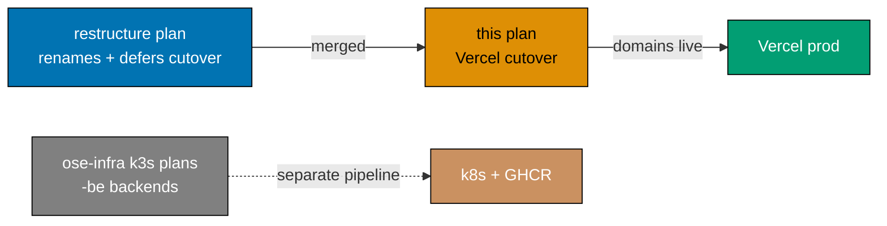

# Wire the www + app-web Tiers to the Vercel Pipeline (Prod Cutover)

> **Status**: In progress — authored 2026-06-13. Execution not started.
> **Depends on**: [`restructure-fsharp-be-and-web-app-tiers`](../../done/2026-06-14__restructure-fsharp-be-and-web-app-tiers/README.md)
> must land first (it performs the app-directory renames and the marketing/app split but
> **explicitly defers** the Vercel/DNS/prod-branch cutover to this plan).

## Context

The [`restructure-fsharp-be-and-web-app-tiers`](../../done/2026-06-14__restructure-fsharp-be-and-web-app-tiers/README.md)
plan renames every public-website app to the `-www` suffix, splits OrganicLever into a marketing site
(`organiclever-www`) plus a CSR app (`organiclever-app-web`), and renames `ose-app-be → ose-be`. It
**deliberately does not touch production wiring** — its README records: _"No production cutover. Vercel
project creation, `app.organiclever.com` DNS, the new `prod-organiclever-www` / `prod-organiclever-app-web`
branches, and the prod-branch renames for the renamed public-website sites … are **deferred downstream**."_

This plan **is** that downstream cutover. After the restructure merges, the apps are renamed in the repo
but production still deploys from the **old** `prod-*-web` branches and the old Vercel projects, and the
new app-web tier has no Vercel project or DNS at all. This plan closes that gap: it rewires every Vercel
project to its new production branch, creates the two new app-web projects + DNS, enumerates the complete
set of branches Vercel must listen to, retires the obsolete branches, and updates all in-repo wiring
references so the documented topology matches the live topology.

The two backends (`organiclever-be`, `ose-be`) are **out of scope for Vercel** — they are generic,
self-hosted-k8s services shipped as GHCR images and deployed by the
[ose-infra `deploy-k3s-cluster-staging` / `deploy-k3s-cluster-prod`](https://github.com/wahidyankf/ose-infra)
plans. This plan covers only the Vercel-served `-www` and `-app-web` tiers.

## Scope

### In scope

- **Rewire 4 existing Vercel projects** to new `prod-*-www` production branches: `ose-www`,
  `ayokoding-www`, `organiclever-www`, `wahidyankf-www`.
- **Create 2 new Vercel projects** for the app-web tier: `organiclever-app-web`
  (`app.organiclever.com`) and `ose-app-web` (`app.oseplatform.com`), including DNS.
- **Define and create the branch set** Vercel listens to (production + staging-gate branches).
- **Retire obsolete branches** after cutover (`prod-ose-web`, `prod-ayokoding-web`,
  `prod-organiclever-web`, `prod-wahidyankf-web`, `stag-organiclever-web`).
- **Update in-repo wiring artifacts**: each app's `vercel.json` `ignoreCommand`, the four
  `apps-*-deployer` agent definitions (+ binding resync), the `.github/workflows/test-and-deploy-*`
  and `deploy-organiclever-web-to-production` workflows, the `AGENTS.md` prod-branch list, the affected
  app `README.md`s, and `docs/reference/system-architecture/{applications,ci-cd,deployment}.md`.

### Out of scope

- **Backend deployment** (`organiclever-be`, `ose-be`) — owned by the ose-infra k3s plans (GHCR + k8s,
  not Vercel).
- **The app/code/spec renames themselves** — owned by `restructure-fsharp-be-and-web-app-tiers`. This
  plan assumes the renamed apps already exist in the repo.
- **Application feature work** inside the new app-web apps.

### Affected apps / projects

| Tier      | App (post-restructure) | Domain                             | Vercel action            |
| --------- | ---------------------- | ---------------------------------- | ------------------------ |
| `www`     | `ose-www`              | oseplatform.com                    | repoint + rename project |
| `www`     | `ayokoding-www`        | ayokoding.com                      | repoint + rename project |
| `www`     | `organiclever-www`     | www.organiclever.com               | repoint + rename project |
| `www`     | `wahidyankf-www`       | www.wahidyankf.com                 | repoint + rename project |
| `app-web` | `organiclever-app-web` | app.organiclever.com (**new DNS**) | **new project**          |
| `app-web` | `ose-app-web`          | app.oseplatform.com (**new DNS**)  | **new project**          |
| `be`      | `organiclever-be`      | (self-hosted k8s)                  | **none — not Vercel**    |
| `be`      | `ose-be`               | (self-hosted k8s)                  | **none — not Vercel**    |

## Branches to wire to Vercel

**Production branches** (each is a Vercel project's configured "Production Branch"):

- `prod-ose-www`
- `prod-ayokoding-www`
- `prod-organiclever-www`
- `prod-wahidyankf-www`
- `prod-organiclever-app-web` (new)
- `prod-ose-app-web` (new)

**Staging-gate branches** (preview deployments; promotion source for the app-web tier — see
[tech-docs](./tech-docs.md) for the gated-promotion rationale):

- `stag-organiclever-app-web` (new; replaces `stag-organiclever-web`)
- `stag-ose-app-web` (new)

**Branches retired after cutover**: `prod-ose-web`, `prod-ayokoding-web`, `prod-organiclever-web`,
`prod-wahidyankf-web`, `stag-organiclever-web`.

## Approach summary

1. **Prepare in-repo wiring** ([AI]) — update `vercel.json`, deployer agents, workflows, and docs to
   reference the new branch names, behind the still-old live wiring. Nothing deploys yet.
2. **Create branches** ([AI]) — cut the new `prod-*-www`, `prod-*-app-web`, and `stag-*-app-web`
   branches from `main`.
3. **Rewire + create Vercel projects + DNS** ([HUMAN]) — dashboard work: repoint production branches,
   rename projects, create the two app-web projects, point DNS. Requires Vercel/DNS credentials.
4. **Verify + retire** ([AI+HUMAN]) — confirm each domain serves from the new branch, then delete the
   obsolete branches and the obsolete Vercel project settings.

See the four companion files:

- [brd.md](./brd.md) — business rationale, impact, risks
- [prd.md](./prd.md) — personas, user stories, Gherkin acceptance criteria
- [tech-docs.md](./tech-docs.md) — wiring architecture, per-project mechanics, rollback
- [delivery.md](./delivery.md) — phased, executor-tagged delivery checklist with gates

## Dependency position

