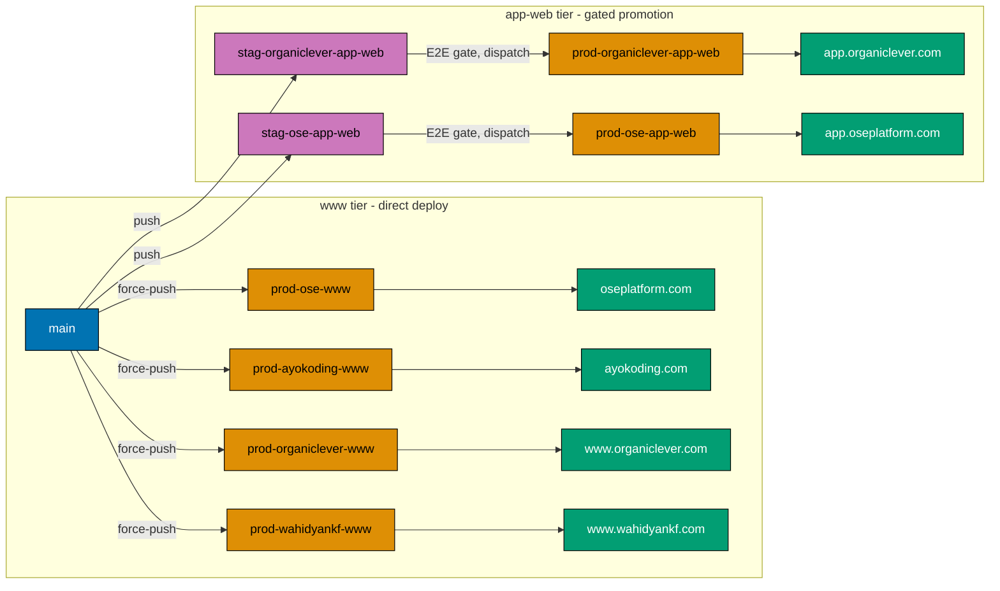

# Technical Documentation — Vercel www + app-web Cutover

## Current state (pre-cutover, grounded)

`[Repo-grounded: apps/*/vercel.json, .claude/agents/apps-*-deployer.md, AGENTS.md]`

- Four public sites deploy via **force-push `main` → `prod-*-web`**, Vercel auto-builds:
  `prod-ose-web`, `prod-ayokoding-web`, `prod-wahidyankf-web`. Each `apps/<app>/vercel.json` carries an
  `ignoreCommand` of the form `[ "$VERCEL_GIT_COMMIT_REF" != "prod-<app>-web" ]` so Vercel only builds
  the production branch.
- OrganicLever uses a **gated promotion**: FE E2E runs against `stag-organiclever-web`, then a
  dispatch-only workflow force-pushes `stag-organiclever-web → prod-organiclever-web`
  `[Repo-grounded: docs/reference/system-architecture/ci-cd.md]`.
- `ose-app-web` exists post-restructure but has **no Vercel project, no branch, no domain**
  `[Repo-grounded: AGENTS.md "prod-ose-app-web (TBD)"]`.
- Backends (`organiclever-be`, `ose-be`) are **not** on Vercel.

## Target state (post-cutover)

## Design decisions

### D1 — www tier keeps direct deploy; app-web tier uses a staging gate

The `-www` sites are content/marketing and already deploy directly (`main → prod-*-www`). The
`-app-web` apps are real CSR clients that call a backend; they get a staging gate
(`stag-*-app-web → prod-*-app-web`) mirroring today's OrganicLever promotion. This preserves the
existing OrganicLever safety pattern and extends it to `ose-app-web`, while keeping the simple sites
simple. _Judgment call:_ a staging gate for app clients reduces blast radius of a bad app build; no
incident baseline measured.

### D2 — Repoint by add-then-verify-then-delete (zero-downtime ordering)

For each renamed site: create the new `prod-*-www` branch, set the Vercel project's production branch to
it, deploy, verify the domain is 200 from the new build, and only **then** delete the old `prod-*-web`
branch. The old branch is the rollback handle until the new one is proven.

### D3 — OrganicLever project reuse vs new project

`organiclever-www` **reuses** today's OrganicLever marketing Vercel project (repoint its production
branch + root directory to `apps/organiclever-www`). `organiclever-app-web` is a **brand-new** project.
This matches the restructure plan's "Reuse www project for marketing; new app project + DNS" decision
`[Repo-grounded: restructure README row 10]`.

### D4 — Backends excluded

`organiclever-be` and `ose-be` are deployed by the ose-infra k3s plans as GHCR images. They never get a
Vercel project. This plan's verification explicitly asserts their **absence** from Vercel scope.

## Per-project mechanics

| Project              | Vercel action                                       | Production branch           | Root directory              | Domain               |
| -------------------- | --------------------------------------------------- | --------------------------- | --------------------------- | -------------------- |
| ose-www              | Repoint prod branch + rename + root dir             | `prod-ose-www`              | `apps/ose-www`              | oseplatform.com      |
| ayokoding-www        | Repoint prod branch + rename + root dir             | `prod-ayokoding-www`        | `apps/ayokoding-www`        | ayokoding.com        |
| organiclever-www     | Reuse OL marketing project; repoint + rename + root | `prod-organiclever-www`     | `apps/organiclever-www`     | www.organiclever.com |
| wahidyankf-www       | Repoint prod branch + rename + root dir             | `prod-wahidyankf-www`       | `apps/wahidyankf-www`       | www.wahidyankf.com   |
| organiclever-app-web | **Create new project** + DNS                        | `prod-organiclever-app-web` | `apps/organiclever-app-web` | app.organiclever.com |
| ose-app-web          | **Create new project** + DNS                        | `prod-ose-app-web`          | `apps/ose-app-web`          | app.oseplatform.com  |

## File-impact analysis (in-repo `[AI]` edits)

- `apps/ose-www/vercel.json`, `apps/ayokoding-www/vercel.json`, `apps/wahidyankf-www/vercel.json` —
  `ignoreCommand` branch string `prod-*-web` → `prod-*-www`. (`organiclever-www` and the two app-web
  apps need a `vercel.json` created if the restructure did not carry one; model on
  `apps/wahidyankf-www/vercel.json`.)
- `.claude/agents/apps-ose-web-deployer.md` → rename to `apps-ose-www-deployer.md`; update `name`,
  `description`, and the push target `prod-ose-web` → `prod-ose-www`. Same for `apps-ayokoding-web-deployer`,
  `apps-organiclever-web-deployer`, `apps-wahidyankf-web-deployer`. Add new `apps-ose-app-web-deployer`
  (model on an existing deployer). Run `npm run generate:bindings` to resync `.opencode/agents/`.
- `.github/workflows/test-and-deploy-ose-web.yml`, `test-and-deploy-ayokoding-web.yml`,
  `test-and-deploy-wahidyankf-web.yml`, and the OrganicLever
  `deploy-organiclever-web-to-production.yml` — branch names + affected-path filters
  `apps/<old>` → `apps/<new>`; add app-web deploy workflows.
- `AGENTS.md` — the prod-branch list (lines ~231–234) and the per-site "Production branch" rows
  (~459, 471, 483, 495, 507).
- `apps/ose-www/README.md`, `apps/ayokoding-www/README.md`, `apps/wahidyankf-www/README.md`,
  `apps/organiclever-www/README.md`, and the two app-web READMEs — deploy-branch references.
- `docs/reference/system-architecture/applications.md`, `ci-cd.md`, `deployment.md` — branch names,
  the deployment mermaid nodes, and the workflow tables.

> **Boundary with the restructure plan:** the restructure plan renames the app **directories** and
> updates prose that names the **apps**; this plan owns every reference to the **deploy branch names**
> and the **Vercel/workflow wiring**. If the restructure already renamed a branch reference, this plan
> verifies it; the two must not double-edit the same line — Phase 0 diffs against `main` to confirm the
> starting state.

## Dependencies

- **Hard upstream dependency:** `restructure-fsharp-be-and-web-app-tiers` merged to `main`. Phase 0
  gate verifies the renamed app directories exist before any wiring edit.
- **Credentials (operator-held, never committed):** Vercel account access; DNS provider access for
  `organiclever.com` and `oseplatform.com`.

## Rollback

- **In-repo edits:** revert the wiring commit; branch names return to `prod-*-web`.
- **Vercel project repoint:** set the project's production branch back to `prod-*-web` (the old branch
  is retained until D2's verify step passes, so it is always available as the rollback target).
- **New app-web projects:** if a new project misbehaves, unpoint DNS and pause the project; no existing
  site is affected because the app-web tier is additive.
- **Branch deletion is the point of no easy return** — it is the **last** step and is gated on all six
  domains verified green.
