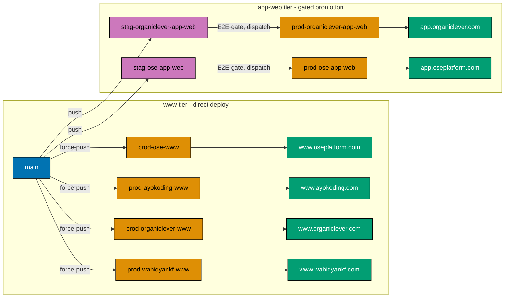

# Technical Documentation — Vercel www + app-web Cutover

## Current state (pre-cutover, grounded)

`[Repo-grounded: apps/*/vercel.json, .claude/agents/apps-*-deployer.md, AGENTS.md]`

- Four public sites deploy via **force-push `main` → `prod-*-web`**, Vercel auto-builds:
  `prod-ose-web`, `prod-ayokoding-web`, `prod-wahidyankf-web`. Each `apps/<app>/vercel.json` carries an
  `ignoreCommand` of the form `[ "$VERCEL_GIT_COMMIT_REF" != "prod-<app>-web" ]` so Vercel only builds
  the production branch.
- OrganicLever uses a **gated promotion**: FE E2E runs against `stag-organiclever-web`, then a
  dispatch-only workflow force-pushes `stag-organiclever-web → prod-organiclever-web`
  `[Repo-grounded: docs/reference/system-architecture/ci-cd.md]`.
- `ose-app-web` exists post-restructure but has **no Vercel project, no branch, no domain**
  `[Repo-grounded: AGENTS.md "prod-ose-app-web (TBD)"]`.
- Backends (`organiclever-be`, `ose-be`) are **not** on Vercel.

## Target state (post-cutover)

## Design decisions

### D1 — www tier keeps direct deploy; app-web tier uses a staging gate

The `-www` sites are content/marketing and already deploy directly (`main → prod-*-www`). The
`-app-web` apps are real CSR clients that call a backend; they get a staging gate
(`stag-*-app-web → prod-*-app-web`) mirroring today's OrganicLever promotion. This preserves the
existing OrganicLever safety pattern and extends it to `ose-app-web`, while keeping the simple sites
simple. _Judgment call:_ a staging gate for app clients reduces blast radius of a bad app build; no
incident baseline measured.

**Staging URL (private).** Each `-app-web` Vercel project also listens on its `stag-*-app-web` branch and
serves it as a persistent staging deployment at a dedicated staging URL, so the app can be exercised before
the gated promotion to prod. That staging URL is environment-private and **must never be committed** to the
repo (per [Secrets and Env Standards](../../../repo-governance/conventions/security/secrets-and-env-standards.md)):
every committed artifact — deployer agents, app READMEs, architecture docs, workflows — refers to it only via
a placeholder (e.g. `<staging-url:ose-app-web>`). Per the standardize plan's injection standard, the staging
base URL lives in the `{group}-app-staging` GitHub Environment as the **`WEB_BASE_URL`** var (kept private,
not committed), and the staging E2E gate reads it from `vars.WEB_BASE_URL` — never from a literal in the
workflow. Reaching that protected URL also requires the `VERCEL_AUTOMATION_BYPASS_SECRET` secret (see the
[bypass section](#vercel-deployment-protection--the-bypass-secret-load-bearing)).

### D2 — Repoint by add-then-verify-then-delete (zero-downtime ordering)

For each renamed site: create the new `prod-*-www` branch, set the Vercel project's production branch to
it, deploy, verify the domain is 200 from the new build, and only **then** delete the old `prod-*-web`
branch. The old branch is the rollback handle until the new one is proven.

### D3 — OrganicLever project reuse vs new project

`organiclever-www` **reuses** today's OrganicLever marketing Vercel project (repoint its production
branch + root directory to `apps/organiclever-www`). `organiclever-app-web` is a **brand-new** project.
This matches the restructure plan's "Reuse www project for marketing; new app project + DNS" decision
`[Repo-grounded: restructure README row 10]`.

### D4 — Backends excluded

`organiclever-be` and `ose-be` are deployed by the ose-infra k3s plans as GHCR images. They never get a
Vercel project. This plan's verification explicitly asserts their **absence** from Vercel scope.

## Per-project mechanics

| Project              | Vercel action                                       | Production branch           | Root directory              | Domain               |
| -------------------- | --------------------------------------------------- | --------------------------- | --------------------------- | -------------------- |
| ose-www              | Repoint prod branch + rename + root dir             | `prod-ose-www`              | `apps/ose-www`              | www.oseplatform.com  |
| ayokoding-www        | Repoint prod branch + rename + root dir             | `prod-ayokoding-www`        | `apps/ayokoding-www`        | www.ayokoding.com    |
| organiclever-www     | Reuse OL marketing project; repoint + rename + root | `prod-organiclever-www`     | `apps/organiclever-www`     | www.organiclever.com |
| wahidyankf-www       | Repoint prod branch + rename + root dir             | `prod-wahidyankf-www`       | `apps/wahidyankf-www`       | www.wahidyankf.com   |
| organiclever-app-web | **Create new project** + DNS                        | `prod-organiclever-app-web` | `apps/organiclever-app-web` | app.organiclever.com |
| ose-app-web          | **Create new project** + DNS                        | `prod-ose-app-web`          | `apps/ose-app-web`          | app.oseplatform.com  |

## GitHub Actions workflows — owned by the standardize plan (verify only)

`[Prerequisite: standardize-github-actions-pipeline-naming is DONE]`

All `.github/workflows/` restructuring — the `_reusable-www-test-local-deploy` callers, the
`*-app-test-local-deploy-stag` / `*-app-test-stag-deploy-prod` app pipelines, the
`*-be-build-deploy-stag` backend workflows, and the `commons-*` / `markdown-*` cross-cutting renames —
is performed by [`standardize-github-actions-pipeline-naming`](../../done/2026-06-15__standardize-github-actions-pipeline-naming/README.md)
and lands **before** this plan runs. This plan **does not edit any workflow file**. Its only workflow
interaction is a read-only **verification** that the already-standardized workflows reference the
branches and Environments this plan creates:

| Standardized workflow (after the prerequisite) | References this plan must satisfy                                         |
| ---------------------------------------------- | ------------------------------------------------------------------------- |
| `{site}-www-test-local-deploy-prod.yml`        | force-pushes `prod-{site}-www` (branch created here)                      |
| `{group}-app-test-local-deploy-stag.yml`       | force-pushes `stag-{group}-app-web` + `stag-{group}-be` (created here)    |
| `{group}-app-test-stag-deploy-prod.yml`        | env `{group}-app-staging` holds `WEB_BASE_URL` + bypass secret (set here) |
| `{group}-be-build-deploy-stag.yml`             | triggered by the `stag-{group}-be` push (branch created here)             |

## Env/secret value population (from the injection manifest)

`[Prerequisite: env-injection.yaml + the tiered injection standard exist]`

The standardize plan defines **where** every key is injected (the value-less `env-injection.yaml`); this
plan sets the **real values** in those homes. Names follow the
[Secrets and Env Standards](../../../repo-governance/conventions/security/secrets-and-env-standards.md) —
no tier qualifier in a key, identical key names across platforms, never committed.

### GitHub Environments (repo Settings → Environments, HUMAN)

Per the standardize model there are **only `local` and `staging`** app Environments — no `development`,
and no `production` (app-tier prod CD is deferred to a later plan):

| Environment                | `vars.`        | `secrets.`                        | Why                                            |
| -------------------------- | -------------- | --------------------------------- | ---------------------------------------------- |
| `organiclever-app-local`   | _(none)_       | local-CI secrets, if any          | compose-only; omit the env if it ends up empty |
| `organiclever-app-staging` | `WEB_BASE_URL` | `VERCEL_AUTOMATION_BYPASS_SECRET` | staging E2E gate hits the protected Vercel URL |
| `ose-app-local`            | _(none)_       | local-CI secrets, if any          | compose-only; omit if empty                    |
| `ose-app-staging`          | `WEB_BASE_URL` | `VERCEL_AUTOMATION_BYPASS_SECRET` | staging E2E gate hits the protected Vercel URL |

`WEB_BASE_URL` is the staging deployment URL (kept private — set as an Environment **var**, not
committed). The www tier has **no** GitHub Environment (its e2e runs on local docker-compose, never
against a deployed URL).

### Vercel Deployment Protection + the bypass secret (load-bearing)

Each app-web Vercel project ships with **Deployment Protection** enabled, which returns `401` to any
unauthenticated request to a preview/staging URL. The standardized `_reusable-app-test-stag` job runs
Playwright **against that protected staging URL**, so it must present a **Protection Bypass for
Automation** token. Operationally, this plan:

1. Enables **Protection Bypass for Automation** on each app-web Vercel project (Settings → Deployment
   Protection), which mints a bypass token.
2. Stores that token as the `VERCEL_AUTOMATION_BYPASS_SECRET` **secret** on each `{group}-app-staging`
   GitHub Environment (never committed).
3. Relies on the standardized workflow already sending it (the existing
   `test-organiclever-web-staging.yml` reads `secrets.VERCEL_AUTOMATION_BYPASS_SECRET` + sets
   `WEB_BASE_URL` — the standardized reusable preserves this).

Without the bypass token every staging E2E run `401`s on the first request — this is the single most
common cause of a green deploy but red gate, so it is called out explicitly here and in delivery.

### Vercel project env (per target, HUMAN)

App-runtime keys from each app's `apps/<app>/.env.example` are set in the Vercel project env, scoped by
target: **Production** target for the `prod-*` branch, **Preview** target for the `stag-*-app-web`
branch. `NEXT_PUBLIC_*` keys are build-time/public; server keys are encrypted. Backend (`-be`) runtime
secrets are **not** on Vercel — they are k3s secrets owned by ose-infra `coralpolyp`.

### Out of scope (no cutover branch/app)

The `commons-*` / `markdown-*` cross-cutting workflows reference no cutover branch, environment, or web
app. `publish-images.yml` is absorbed into the standardized `*-be-build-deploy-stag` workflows by the
prerequisite plan; the GHCR image rollout remains ose-infra `coralpolyp`'s.

## File-impact analysis (in-repo `[AI]` edits)

- `apps/ose-www/vercel.json`, `apps/ayokoding-www/vercel.json`, `apps/wahidyankf-www/vercel.json` —
  `ignoreCommand` branch string `prod-*-web` → `prod-*-www`. (`organiclever-www` and the two app-web
  apps need a `vercel.json` created if the restructure did not carry one; model on
  `apps/wahidyankf-www/vercel.json`.)
- `.claude/agents/apps-ose-web-deployer.md` → rename to `apps-ose-www-deployer.md`; update `name`,
  `description`, and the push target `prod-ose-web` → `prod-ose-www`. Same for `apps-ayokoding-web-deployer`,
  `apps-organiclever-web-deployer`, `apps-wahidyankf-web-deployer`. Add new `apps-ose-app-web-deployer`
  (model on an existing deployer). Run `npm run generate:bindings` to resync `.opencode/agents/`.
- `.github/workflows/` — **not edited here.** Owned by `standardize-github-actions-pipeline-naming`
  (already landed). This plan only verifies the standardized workflows reference the branches +
  Environments it creates (see [Workflows — owned by the standardize plan](#github-actions-workflows--owned-by-the-standardize-plan-verify-only)).
- `AGENTS.md` — the prod-branch list (lines ~231–234) and the per-site "Production branch" rows
  (~459, 471, 483, 495, 507).
- `apps/ose-www/README.md`, `apps/ayokoding-www/README.md`, `apps/wahidyankf-www/README.md`,
  `apps/organiclever-www/README.md`, and the two app-web READMEs — deploy-branch references.
- `docs/reference/system-architecture/applications.md`, `ci-cd.md`, `deployment.md` — branch names and
  the deployment mermaid nodes (the **branch references** in the workflow tables; the workflow
  **filenames** in those tables are updated by the standardize plan's sweep — coordinate to avoid
  double-editing a row).

> **Boundary with the upstream plans:** the restructure plan renames the app **directories** and prose
> that names the **apps**; `standardize-github-actions-pipeline-naming` owns the **workflow files** and
> the env/secret **injection standard**; this plan owns the **Vercel/DNS wiring**, the **deploy-branch
> creation**, and the **real env/secret values**. It edits no workflow. If an upstream plan already
> renamed a branch reference, this plan verifies it; no two plans double-edit the same line — Phase 0
> diffs against `main` to confirm the starting state.

## Dependencies

- **Hard upstream dependency:** `restructure-fsharp-be-and-web-app-tiers` merged to `main`. Phase 0
  gate verifies the renamed app directories exist before any wiring edit.
- **Credentials (operator-held, never committed):** Vercel account access; DNS provider access for
  `organiclever.com` and `oseplatform.com`.

## Rollback

- **In-repo edits:** revert the wiring commit; branch names return to `prod-*-web`.
- **Vercel project repoint:** set the project's production branch back to `prod-*-web` (the old branch
  is retained until D2's verify step passes, so it is always available as the rollback target).
- **New app-web projects:** if a new project misbehaves, unpoint DNS and pause the project; no existing
  site is affected because the app-web tier is additive.
- **Branch deletion is the point of no easy return** — it is the **last** step and is gated on all six
  domains verified green.
