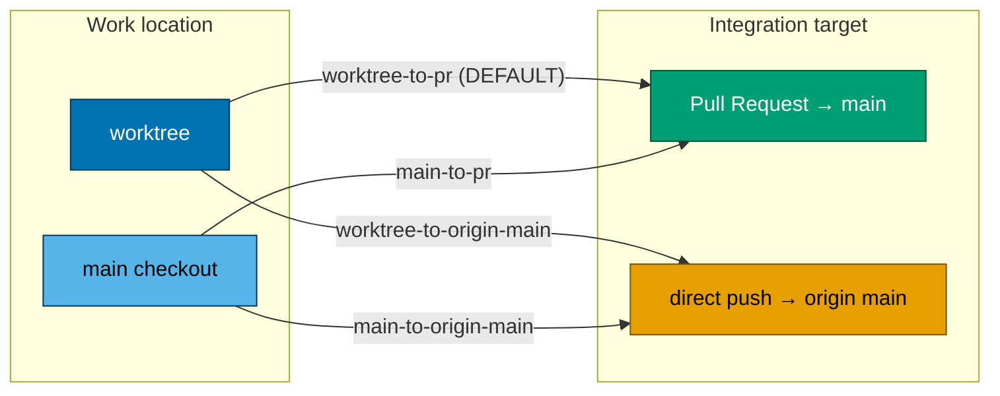
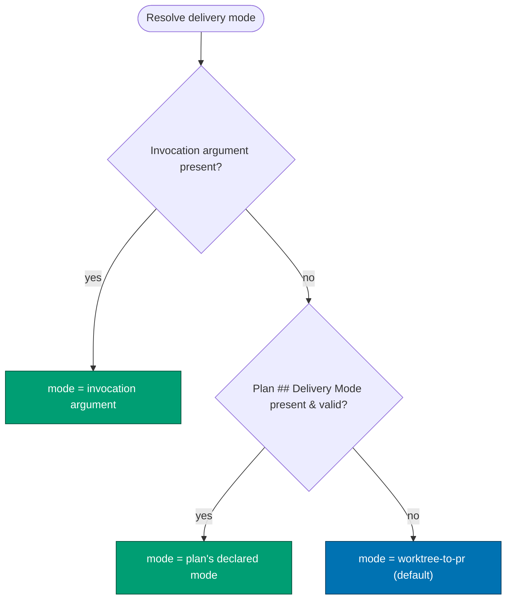
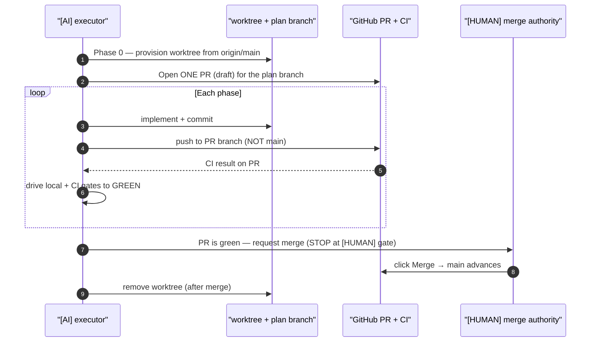

# Product Requirements — Worktree-to-PR Default Delivery Mode

This document defines **WHAT** gets built: the four-mode delivery vocabulary, the selection
precedence, acceptance criteria, and scope. See [`brd.md`](./brd.md) for WHY and
[`tech-docs.md`](./tech-docs.md) for HOW.

## Product Overview

Introduce a closed vocabulary of **four named delivery modes** that describe how a plan's work
reaches `origin main`, plus a three-tier precedence for selecting the active mode. The new default is
`worktree-to-pr`. Each mode is fully defined by three attributes: **work location**, **integration
target**, and **merge authority**. The vocabulary and precedence are documented in the conventions,
the plan-execution workflow, the plan agent definitions, the plan-authoring skill, and the root
instruction files, and applied identically across all three repos.

## Personas

Solo-maintainer repo — personas are the maintainer's hats and the consuming agents.

- **Plan author** (maintainer + `plan-maker`) — declares the plan's `## Delivery Mode`.
- **Plan executor** (the plan-execution workflow) — resolves the active mode by precedence and drives
  the delivery accordingly.
- **Merge authority** (maintainer, `[HUMAN]`) — performs the terminal PR merge for PR modes.
- **Plan validators** (`plan-checker`, `plan-execution-checker`, `plan-fixer`) — validate/scaffold the
  field and verify delivery matched the declared mode.

## The Four Delivery Modes (closed enum)

| Mode                      | Work location                 | Integration target           | Merge authority                             | Default? |
| ------------------------- | ----------------------------- | ---------------------------- | ------------------------------------------- | -------- |
| `worktree-to-pr`          | git worktree                  | Pull Request to `main`       | `[HUMAN]` merges; `[AI]` drives gates green | **Yes**  |
| `worktree-to-origin-main` | git worktree                  | direct push to `origin main` | `[AI]` (push is the integration)            | No       |
| `main-to-origin-main`     | `main` checkout               | direct push to `origin main` | `[AI]` (push is the integration)            | No       |
| `main-to-pr`              | `main` checkout (no worktree) | Pull Request to `main`       | `[HUMAN]` merges; `[AI]` drives gates green | No       |

Naming grammar: `<work-location>-to-<integration-target>`, where work-location ∈ {`worktree`, `main`}
and integration-target ∈ {`pr`, `origin-main`}.



### `worktree-to-pr` (DEFAULT) — PR mechanics

- **One PR per plan per repo**, opened at Phase 0 (execution start).
- Every phase's commits push to **that PR branch**, never to `main`.
- CI runs on the PR throughout execution; `[AI]` drives all gates (local + CI) to GREEN.
- The plan is delivered by **merging that PR** at the end — a `[HUMAN]` step (the human clicks merge).
- Worktree cleanup happens **after** the PR is merged.
- For a three-repo sweep this means **3 worktrees + 3 PRs** (one per repo), each driven green by
  `[AI]` and merged by the human.

## Selection Precedence

The active mode is chosen by the same three-tier precedence model as work-branch selection in
plan-execution Step 0 [Repo-grounded]:

1. **Invocation argument** — a mode the user specifies at invocation wins.
2. **Plan's `## Delivery Mode` field** — used when the invocation says nothing.
3. **Default** — `worktree-to-pr`, used when neither of the above is present.

Reuse the existing precedence language: _user-at-invocation > plan docs > default_.



## worktree-to-pr Delivery Sequence



## User Stories

- **As a plan author**, I want to declare a delivery mode on a plan, so that the executor delivers the
  work through the posture I intend without re-explaining it in prose.
- **As the plan executor**, I want a documented precedence, so that I deterministically resolve which
  mode is active when an invocation argument, a plan field, and the default all could apply.
- **As the merge authority**, I want the irreversible trunk write to be a single explicit human merge,
  so that broken or unfinished work never reaches `main` automatically.
- **As a plan validator**, I want the `## Delivery Mode` field to be present and drawn from the closed
  vocabulary, so that I can flag missing or invalid modes.

## Acceptance Criteria

> These are prose/Gherkin acceptance criteria for a **docs/governance** change; there is no
> application code under test. They describe observable states of the governance files and agent
> behavior after the change lands.

```gherkin
Scenario: A newly authored plan declares a valid delivery mode
  Given a plan is authored by plan-maker
  When the plan's delivery specification is written
  Then it contains a "## Delivery Mode" field
  And the field value is one of "worktree-to-pr", "worktree-to-origin-main", "main-to-origin-main", or "main-to-pr"
```

```gherkin
Scenario: The default mode applies when nothing else is specified
  Given a plan with no "## Delivery Mode" field
  And an invocation that specifies no mode
  When plan-execution resolves the active delivery mode
  Then the resolved mode is "worktree-to-pr"
```

```gherkin
Scenario: Invocation argument overrides the plan's declared mode
  Given a plan that declares "## Delivery Mode: worktree-to-origin-main"
  When the plan is invoked with an explicit "main-to-origin-main" argument
  Then the resolved mode is "main-to-origin-main"
  And the plan's declared mode is not used
```

```gherkin
Scenario: worktree-to-pr delivers through one PR with a human merge
  Given a plan whose resolved mode is "worktree-to-pr"
  When the executor delivers every phase
  Then all phase commits push to the PR branch and never directly to main
  And the AI drives all local and CI gates on the PR to green
  And the terminal merge of the PR to main is a "[HUMAN]" step
```

```gherkin
Scenario: plan-checker flags a missing or invalid delivery mode
  Given a plan that omits the "## Delivery Mode" field or uses a value outside the closed vocabulary
  When plan-checker validates the plan
  Then it reports a finding for the missing or invalid delivery mode
```

```gherkin
Scenario: Trunk-Based-Development language keeps its spirit
  Given the reconciled trunk-based-development documentation
  When a reader reviews the default delivery posture
  Then worktree-to-pr via short-lived plan branches is described as a valid TBD flavor
  And the TBD spirit of short-lived branches and frequent integration is preserved
```

```gherkin
Scenario: The same vocabulary exists in all three repos
  Given the change has landed in ose-public, ose-primer, and ose-infra
  When the delivery-mode vocabulary is inspected in each repo
  Then each repo documents the identical four modes and the identical precedence
```

## Product Scope

### In scope

- The four-mode closed vocabulary and its three-tier selection precedence.
- Editing the governance surfaces enumerated in [`tech-docs.md`](./tech-docs.md#surface-inventory)
  across all three repos.
- Reconciling Trunk-Based-Development language (decision 6).
- Re-syncing `.opencode/` and `.amazonq/` bindings after `.claude/**` edits.
- Delivering this plan itself via `worktree-to-pr` (dogfooding) with three worktrees + three PRs.

### Out of scope

- Any application or library source code, and any UI.
- A new `rhino-cli` structural validator for the delivery-mode field (enforcement stays prose-driven
  via agent checkers — flagged as an open question in `tech-docs.md` if revisited).
- Changes to environment/deploy branches (`prod-*`, `stag-*`) or their push rules.
- Retroactive rewriting of already-archived plans in `plans/done/`.
- Changing the merge-approval rule itself (the human already approves merges per
  `pr-merge-protocol.md`); this plan only makes the human merge the default terminal step.

## Exemption Notes (read by plan-checker)

- **Specs/Gherkin two-path completeness — EXEMPT.** This plan changes only documentation and
  governance prose; it creates, modifies, or deletes **no** observable behavior in `apps/`, `libs/`,
  or `specs/`. Per [Feature Change Completeness Convention §Two Paths](../../../repo-governance/development/quality/feature-change-completeness.md),
  docs/governance-only changes are exempt from the companion-`specs/` requirement. Enforcement of the
  new vocabulary is via agent-checker prose, **not** new `rhino-cli` code, so no `.feature` Gherkin is
  required. The Gherkin blocks above are plan acceptance criteria, not `specs/` feature files.
- **UI-design-funnel — EXEMPT.** This plan adds/changes no user-facing screen or component under
  `apps/` or `libs/`. It is a governance-only change with no UI surface, so the mandatory UI-design
  funnel does not apply.

## Product Risks

| Risk                                                                   | Impact | Mitigation                                                                                     |
| ---------------------------------------------------------------------- | ------ | ---------------------------------------------------------------------------------------------- |
| Mode value typo escapes review                                         | Medium | `plan-checker` validates the value against the closed enum.                                    |
| Ambiguity between "delivery mode" and "work branch" precedence         | Medium | Explicitly reuse the same three-tier language and cross-link the two in plan-execution Step 0. |
| Bootstrapping: this plan edits the very workflow that defines the mode | Low    | Delivery follows the plan's own `delivery.md` manually; see `tech-docs.md` bootstrapping note. |
