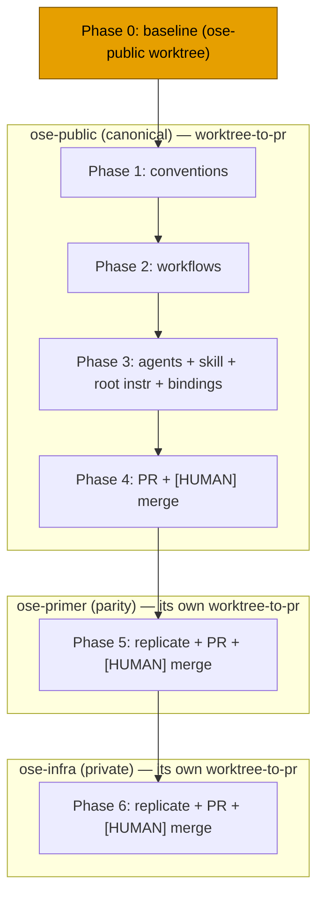

# Technical Documentation — Worktree-to-PR Default Delivery Mode

This document defines **HOW** the change is implemented: the per-file impact across all three repos,
the precedence algorithm, the binding re-sync, rollback, and open questions. See [`prd.md`](./prd.md)
for WHAT and [`brd.md`](./brd.md) for WHY.

## Change Nature

This is a **documentation/governance** change only. No files under `apps/` or `libs/` are touched; no
source code, no UI, no `specs/` feature files. Enforcement of the new `## Delivery Mode` field is
**prose-driven** via the plan agent checkers, not new `rhino-cli` code. See
[`prd.md` §Exemption Notes](./prd.md#exemption-notes-read-by-plan-checker).

## Repo Coordination Model

- **`ose-public`** — canonical scaffolding source; authored first. Absolute root:
  `/Users/wkf/ose-projects/ose-public` [Repo-grounded].
- **`ose-primer`** — public downstream parity repo; receives the identical change. Absolute root:
  `/Users/wkf/ose-projects/ose-primer` [Repo-grounded].
- **`ose-infra`** — private repo, **outside** the parity loop, but carries its own copies of these
  governance files; receives the identical conceptual change. Absolute root:
  `/Users/wkf/ose-projects/ose-infra` [Repo-grounded].

All three repos were verified to carry every target file listed below [Repo-grounded]. The
governance prose files are **not** required to be byte-identical across repos (only `apps/rhino-cli`
carries a byte-identity mandate per AGENTS.md [Repo-grounded]), so per-repo phrasing differences are
acceptable as long as the four-mode vocabulary and the three-tier precedence are conceptually
identical. Apply the change per repo; do not assume a copy-paste of the exact bytes will apply cleanly.



## Surface Inventory

Every path below is relative to a repo root and exists in **all three** repos [Repo-grounded]. The
"Change" column summarizes the edit; delivery steps in [`delivery.md`](./delivery.md) carry the
verbatim actions and acceptance criteria.

### Convention layer

| File                                                     | Change                                                                                                                                                                      |
| -------------------------------------------------------- | --------------------------------------------------------------------------------------------------------------------------------------------------------------------------- |
| `repo-governance/conventions/structure/plans.md`         | Add a `## Delivery Mode` section requirement (sibling to the existing `## Worktree` section): define the four modes, their three attributes, and the three-tier precedence. |
| `repo-governance/conventions/structure/worktree-path.md` | Cross-reference the delivery mode: a worktree is used by `worktree-to-pr` and `worktree-to-origin-main`; link to the new `## Delivery Mode` section.                        |

### Development-workflow layer

| File                                                              | Change                                                                                                                                                                                                                                                                                                                                                               |
| ----------------------------------------------------------------- | -------------------------------------------------------------------------------------------------------------------------------------------------------------------------------------------------------------------------------------------------------------------------------------------------------------------------------------------------------------------- |
| `repo-governance/development/workflow/trunk-based-development.md` | Reconcile the "all development on `main`" posture (decision 6): frame worktree → PR via short-lived plan branches as a valid TBD flavor; update the `## Default Push and Worktree Execution` section so the **default** is short-lived-branch-via-PR while preserving TBD spirit. Honor the maintenance note listing the four TBD-duplication sites [Repo-grounded]. |
| `repo-governance/development/workflow/git-push-default.md`        | Reconcile push semantics: default integration target is a PR branch (not direct `origin main`); direct push remains available via the `*-to-origin-main` modes.                                                                                                                                                                                                      |
| `repo-governance/development/workflow/git-push-safety.md`         | Reconcile: pushing to a PR branch vs directly to `main`; ensure force-push/linear-history rules read correctly for plan branches.                                                                                                                                                                                                                                    |
| `repo-governance/development/workflow/pr-merge-protocol.md`       | Document the `worktree-to-pr` terminal step: `[AI]` ensures all gates (local + CI) are GREEN; the `[HUMAN]` merge gate performs the trunk write. Confirmed present [Repo-grounded]; extend rather than create.                                                                                                                                                       |

### Workflow layer

| File                                                                              | Change                                                                                                                                                                                                                                                                                                                                                                                                                               |
| --------------------------------------------------------------------------------- | ------------------------------------------------------------------------------------------------------------------------------------------------------------------------------------------------------------------------------------------------------------------------------------------------------------------------------------------------------------------------------------------------------------------------------------ |
| `repo-governance/workflows/plan/plan-execution.md`                                | Step 0: add delivery-mode selection with the three-tier precedence alongside the existing work-branch precedence. Steps 2b/2c (per-phase quality gate + post-push CI): under `worktree-to-pr` the push target is the **PR branch**, CI is monitored on the PR. Step 8 finalization: archival delivered via PR; the `[HUMAN]` merge gate; worktree cleanup happens **after** the PR is merged. Keep the other three modes documented. |
| `repo-governance/workflows/plan/plan-planning.md`                                 | Reference delivery-mode selection where it touches worktrees/pushing.                                                                                                                                                                                                                                                                                                                                                                |
| `repo-governance/workflows/plan/plan-quality-gate.md`                             | Reference the `## Delivery Mode` field where it validates plan structure/gates.                                                                                                                                                                                                                                                                                                                                                      |
| `repo-governance/workflows/plan/plan-multi-repo-parity-planning.md`               | Reference delivery-mode selection where it touches worktrees/pushing across repos.                                                                                                                                                                                                                                                                                                                                                   |
| `repo-governance/workflows/plan/plan-multi-repo-parity-planning-and-execution.md` | Same.                                                                                                                                                                                                                                                                                                                                                                                                                                |

### Agent + skill + root-instruction layer (`.claude/**` — triggers binding re-sync)

| File                                                  | Change                                                                                                                                                                                                           |
| ----------------------------------------------------- | ---------------------------------------------------------------------------------------------------------------------------------------------------------------------------------------------------------------- |
| `.claude/skills/plan-creating-project-plans/SKILL.md` | Require authored plans to emit a `## Delivery Mode` section (default `worktree-to-pr`); add the vocabulary + precedence + template, sibling to the existing `## Worktree Specification` section [Repo-grounded]. |
| `.claude/agents/plan-maker.md`                        | Instruct the agent to author the `## Delivery Mode` section (default `worktree-to-pr`).                                                                                                                          |
| `.claude/agents/plan-checker.md`                      | Validate `## Delivery Mode` presence + valid vocabulary (closed enum).                                                                                                                                           |
| `.claude/agents/plan-execution-checker.md`            | Validate delivery happened via the declared mode (e.g., for `worktree-to-pr`: a PR exists and its gates are green).                                                                                              |
| `.claude/agents/plan-fixer.md`                        | Scaffold a missing `## Delivery Mode` section.                                                                                                                                                                   |

### Root instruction layer

| File                               | Change                                                                                                                                                      |
| ---------------------------------- | ----------------------------------------------------------------------------------------------------------------------------------------------------------- |
| `AGENTS.md` (Git Workflow section) | Update the delivery/TBD description to reflect the worktree → PR default and name the four modes.                                                           |
| `CLAUDE.md`                        | Update the delivery/TBD description consistently (note: `CLAUDE.md` imports `AGENTS.md`, so keep the Claude-specific binding text aligned) [Repo-grounded]. |

### Binding re-sync (mechanical, after any `.claude/**` edit)

- `npm run generate:bindings` — regenerates `.opencode/` and `.amazonq/` from `.claude/`
  (`cargo run … rhino-cli agents …`) [Repo-grounded — `package.json` script]. A delivery gate
  verifies `git status` shows the sync is clean (no unstaged generated drift).

## Precedence Algorithm

Resolve the active delivery mode deterministically (mirrors work-branch precedence in
plan-execution Step 0 [Repo-grounded]):

```text
resolve_delivery_mode(invocation_arg, plan_field):
    if invocation_arg is a valid mode:      # tier 1: user-at-invocation
        return invocation_arg
    if plan_field is a valid mode:          # tier 2: plan docs
        return plan_field
    return "worktree-to-pr"                 # tier 3: default
```

Valid modes = `{worktree-to-pr, worktree-to-origin-main, main-to-origin-main, main-to-pr}`. An
invalid non-empty value is a `plan-checker` finding, not a silent fallback.

## Bootstrapping Note

This plan edits `plan-execution.md` — the very workflow that will define delivery-mode selection.
Execution therefore follows this plan's own `delivery.md` **manually** (the human/executor reads the
checklist directly) rather than depending on the not-yet-updated workflow. This plan dogfoods
`worktree-to-pr`: it is delivered through three worktrees and three PRs with three `[HUMAN]` merges,
exactly as the new default prescribes.

## Rollback

Because the change is prose-only and delivered via PR per repo:

- **Before merge** — close the PR without merging; the worktree/branch carries no trunk impact.
- **After merge** — revert the merge commit on `main` (`git revert -m 1 <merge-sha>`) per repo, then
  re-run `npm run generate:bindings` to restore the prior `.opencode/`/`.amazonq/` state. No data
  migration or code rollback is involved.

## Open Questions

1. **[Unverified] Structural validator vs prose enforcement.** This plan enforces the `## Delivery
Mode` field via agent-checker prose only. If, during authoring, a deterministic `rhino-cli`
   validator for the field is judged genuinely necessary (e.g., to gate on the closed enum in CI like
   the existing `gherkin-keyword-cardinality` audit), that is a **separate, larger** change (new Rust
   command + its own Gherkin behavior tree, subject to the rhino-cli byte-identity boundary). It is
   **not assumed** here — flag and defer to a follow-up plan rather than expanding scope. Resolve
   before Phase 3 if the maintainer wants CI-level enforcement.
2. **[Unverified] Exact anchor/section names in each workflow doc.** The precise heading text to edit
   in `plan-planning.md`, `plan-quality-gate.md`, and the two parity workflows should be confirmed by
   reading each file at execution time; the delivery steps name the files and the intent, and the
   executor grep-locates the exact insertion point.
3. **[Unverified] ose-infra parity phrasing.** `ose-infra` is outside the parity loop and may phrase
   some governance prose differently; confirm the four-mode vocabulary lands conceptually intact
   rather than assuming byte-parity with `ose-public`.
