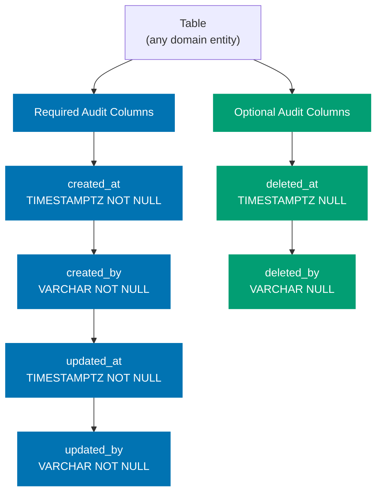

# Database Audit Trail Pattern

Every database table in open-sharia-enterprise MUST include six audit trail columns. These columns record who created, last updated, and soft-deleted each row, along with when each action occurred. Rows with `deleted_at IS NULL` are active; rows with a non-null `deleted_at` are soft-deleted and invisible to normal queries.

## Principles Implemented/Respected

This pattern implements the following core principles:

- **[Explicit Over Implicit](../../principles/software-engineering/explicit-over-implicit.md)**: All audit metadata is stored in dedicated, named columns with mandatory types and nullability. There is no implicit or hidden tracking; every change is visible in the schema.

- **[Automation Over Manual](../../principles/software-engineering/automation-over-manual.md)**: DbUp discovers and applies migration scripts automatically at startup. EF Core handles entity mapping. Manual service code is only required for soft-delete columns (`deleted_at`, `deleted_by`).

- **[Reproducibility First](../../principles/software-engineering/reproducibility.md)**: DbUp applies versioned SQL scripts in deterministic order, ensuring the schema is reproducible across PostgreSQL environments (dev/staging/prod) and Dockerised test databases without divergence.

- **[Documentation First](../../principles/content/documentation-first.md)**: This pattern documents the required columns, types, and implementation approach before any table is created, ensuring teams follow a consistent and verifiable standard.

## Conventions Implemented/Respected

This pattern respects the following conventions:

- **[Content Quality Principles](../../conventions/writing/quality.md)**: This document uses active voice, a single H1, and proper heading nesting.

- **[Acceptance Criteria Convention](../infra/acceptance-criteria.md)**: The compliance checklist at the end of this document provides testable, concrete criteria for verifying a table meets this pattern.

## Required Audit Columns

Every table MUST include all six columns in the order listed below.



| Column       | Type           | Nullable | Default    | Description                         |
| ------------ | -------------- | -------- | ---------- | ----------------------------------- |
| `created_at` | `TIMESTAMPTZ`  | NOT NULL | `NOW()`    | When the row was created (UTC)      |
| `created_by` | `VARCHAR(255)` | NOT NULL | `'system'` | Who or what created the row         |
| `updated_at` | `TIMESTAMPTZ`  | NOT NULL | `NOW()`    | When the row was last updated (UTC) |
| `updated_by` | `VARCHAR(255)` | NOT NULL | `'system'` | Who or what last updated the row    |
| `deleted_at` | `TIMESTAMPTZ`  | NULL     | —          | When the row was soft-deleted (UTC) |
| `deleted_by` | `VARCHAR(255)` | NULL     | —          | Who or what soft-deleted the row    |

Blue columns (required) are always non-null and populated by the database default or the calling service. Green columns (optional by value) are always present in the schema but null for active rows.

## Why This Pattern Exists

**Auditability**: Every change to every row is traceable to an actor and a timestamp. Security reviews, compliance audits, and internal investigations can reconstruct the full history of any record.

**Soft-Delete**: Setting `deleted_at` and `deleted_by` hides a row from normal queries without destroying data. Hard deletes make recovery impossible and break foreign key history. Soft-delete preserves referential integrity and enables undelete workflows.

**Compliance**: Sharia-compliant financial systems require evidence that transactions and contracts were not retroactively altered. The audit columns provide an immutable creation record and a last-modified record for every entity.

**Production Debugging**: When an incident occurs, `updated_at` narrows the time window and `updated_by` identifies the service or user responsible. Without these columns, incident investigation relies on log search, which is slower and less reliable.

## Migration Tool by Language

Each backend uses the idiomatic migration tool for its language and framework ecosystem. All tools must apply the same six audit columns to every table.

| App             | Migration Tool | License |
| --------------- | -------------- | ------- |
| organiclever-be | DbUp           | MIT     |
| ose-be          | DbUp           | MIT     |

> For polyglot migration tool patterns (Liquibase, Ecto, Alembic, goose, Flyway, EF Core, Migratus, @effect/sql, SQLx, Drizzle), see the [ose-primer](https://github.com/wahidyankf/ose-primer) repository.

For licensing decisions related to Liquibase's FSL-1.1-ALv2 licence (introduced in version 5.0), see [Licensing Decisions](../../../docs/explanation/software-engineering/licensing/licensing-decisions.md).

## Schema Migration

Every backend applies the six audit columns through its migration tool. The canonical column definitions are identical regardless of tool — only the migration file format differs.

Regardless of the tool used, migrations must satisfy:

- All six audit columns present in every table, in the order listed above
- `created_at` and `updated_at` use timezone-aware timestamps (`TIMESTAMPTZ` for PostgreSQL, equivalent for other databases)
- `created_by` and `updated_by` default to `'system'` so raw migrations and background jobs produce a traceable actor
- `deleted_at` and `deleted_by` are nullable with no default — `NULL` is the active-row state
- Each migration is reversible (rollback support where the tool provides it)

### F# / DbUp: versioned SQL scripts

Use plain `.sql` files under `Migrations/`. DbUp discovers and applies them in filename order at startup — no compilation step required.

The following example shows the `members` table as the reference implementation. Apply the same pattern to every new table.

```sql
-- Migrations/20240101000001_CreateMembers.sql
CREATE TABLE members (
    id UUID PRIMARY KEY DEFAULT gen_random_uuid(),
    name TEXT NOT NULL,
    -- audit columns
    created_at TIMESTAMPTZ NOT NULL DEFAULT now(),
    created_by VARCHAR(255) NOT NULL DEFAULT 'system',
    updated_at TIMESTAMPTZ NOT NULL DEFAULT now(),
    updated_by VARCHAR(255) NOT NULL DEFAULT 'system',
    deleted_at TIMESTAMPTZ,
    deleted_by VARCHAR(255)
);
```

Key points:

- Migration files are named `{timestamp}_{Description}.sql` so DbUp applies them in deterministic order.
- `DEFAULT now()` provides a safe fallback for raw SQL inserts (migrations, seeds, background jobs).
- `created_by` and `updated_by` default to `'system'` so background jobs produce a traceable actor without caller intervention.
- `deleted_at` and `deleted_by` are nullable with no default — `NULL` is the active-row state.
- DbUp does not support rollback scripts; design migrations to be additive and forward-only.

## F# Entity Implementation

### EF Core Entity Type

Map every audited table to an F# record type and configure audit columns explicitly via `IEntityTypeConfiguration`.

```fsharp
// Contexts/Members/Infrastructure/MemberEntity.fs
module Contexts.Members.Infrastructure.MemberEntity

open System
open Microsoft.EntityFrameworkCore
open Microsoft.EntityFrameworkCore.Metadata.Builders

[<CLIMutable>]
type MemberEntity =
    { Id: Guid
      Name: string
      CreatedAt: DateTimeOffset
      CreatedBy: string
      UpdatedAt: DateTimeOffset
      UpdatedBy: string
      DeletedAt: DateTimeOffset option
      DeletedBy: string option }

type MemberEntityConfiguration() =
    interface IEntityTypeConfiguration<MemberEntity> with
        member _.Configure(builder: EntityTypeBuilder<MemberEntity>) =
            builder.ToTable("members") |> ignore
            builder.HasKey(fun m -> m.Id :> obj) |> ignore
            builder.Property(fun m -> m.CreatedBy).HasMaxLength(255).HasDefaultValue("system") |> ignore
            builder.Property(fun m -> m.UpdatedBy).HasMaxLength(255).HasDefaultValue("system") |> ignore
```

### Run Migrations at Startup

Call DbUp in `Program.fs` before the HTTP server starts accepting requests.

```fsharp
// Program.fs (excerpt)
open DbUp

let upgrader =
    DeployChanges
        .To
        .PostgresqlDatabase(connectionString)
        .WithScriptsFromFileSystem("Migrations")
        .LogToConsole()
        .Build()

let result = upgrader.PerformUpgrade()
if not result.Successful then
    failwithf "DbUp migration failed: %s" (result.Error.Message)
```

### Soft-Delete in the Repository Layer

`deleted_at` and `deleted_by` are set explicitly in the repository layer. Never issue a `DELETE` statement on audited tables; always use a soft-delete `UPDATE`.

```fsharp
// Contexts/Members/Infrastructure/EfCoreMemberRepository.fs (excerpt)
member _.SoftDelete(id: Guid, actor: string) =
    task {
        let! member_ =
            dbContext.Members
                .Where(fun m -> m.Id = id && not m.DeletedAt.HasValue)
                .FirstOrDefaultAsync()
        match box member_ with
        | null -> return Error "not found"
        | _ ->
            dbContext.Members.Entry(member_).CurrentValues["DeletedAt"] <- DateTimeOffset.UtcNow
            dbContext.Members.Entry(member_).CurrentValues["DeletedBy"] <- actor
            let! _ = dbContext.SaveChangesAsync()
            return Ok ()
    }
```

## Soft-Delete Query Discipline

All queries against audited tables MUST filter `DeletedAt = null` unless the endpoint is an explicit admin or audit endpoint.

**PASS: active-row query — soft-deleted rows excluded**:

```fsharp
dbContext.Members
    .Where(fun m -> not m.DeletedAt.HasValue)
    .ToListAsync()
```

**FAIL: never omit the `DeletedAt` filter without explicit justification**:

```fsharp
// Returns soft-deleted rows — only acceptable for admin/audit endpoints
dbContext.Members.ToListAsync()
```

When an admin or audit endpoint legitimately needs soft-deleted rows, name the function clearly (e.g., `fetchAllIncludingDeleted`) and restrict the route to admin roles.

## F# Nullability Convention

F# option types encode nullability directly. The audit field mapping is:

| Column       | F# type                 | Rationale                          |
| ------------ | ----------------------- | ---------------------------------- |
| `created_at` | `DateTimeOffset`        | Non-null; database `DEFAULT now()` |
| `created_by` | `string`                | Non-null; caller must supply actor |
| `updated_at` | `DateTimeOffset`        | Non-null; database `DEFAULT now()` |
| `updated_by` | `string`                | Non-null; caller must supply actor |
| `deleted_at` | `DateTimeOffset option` | `None` means active row            |
| `deleted_by` | `string option`         | `None` means active row            |

EF Core maps `option` fields to nullable SQL columns via the `HasConversion` / nullable column configuration.

## Compliance Checklist

Use this checklist when adding a new table or reviewing an existing one.

### Schema (All Migration Tools)

- [ ] Migration includes all six audit columns in the correct order
- [ ] `created_at` and `updated_at` are timezone-aware timestamps, NOT NULL, defaulting to the current time
- [ ] `created_by` and `updated_by` are string columns (max 255 chars), NOT NULL, defaulting to `'system'`
- [ ] `deleted_at` and `deleted_by` are nullable with no default
- [ ] Migration is additive and forward-only (DbUp does not support rollback scripts)

**F# / DbUp additional checks:**

- [ ] Migration file name follows `{timestamp}_{Description}.sql` format
- [ ] DbUp `PerformUpgrade()` is called in `Program.fs` before the server starts accepting requests
- [ ] DbUp result is checked and startup aborts on failure

### Entity Type (F# / EF Core)

- [ ] Entity record type is `[<CLIMutable>]` and mapped via `IEntityTypeConfiguration`
- [ ] `CreatedAt` and `UpdatedAt` fields use `DateTimeOffset` (non-option)
- [ ] `CreatedBy` and `UpdatedBy` fields use `string` (non-option)
- [ ] `DeletedAt` and `DeletedBy` fields use `DateTimeOffset option` and `string option` respectively

### Repository Layer (F# / EF Core)

- [ ] No `DELETE` statement issued against audited tables
- [ ] Soft-delete sets both `DeletedAt = DateTimeOffset.UtcNow` and `DeletedBy = actor`
- [ ] Soft-delete filters `not m.DeletedAt.HasValue` to guard against double-deletes

### Queries

- [ ] All EF Core queries filter `not m.DeletedAt.HasValue` unless the endpoint is explicitly an admin/audit endpoint
- [ ] Functions that intentionally return soft-deleted rows are named clearly (e.g., `fetchAllIncludingDeleted`) and the route is restricted to admin roles

## Related Documentation

- [Acceptance Criteria Convention](../infra/acceptance-criteria.md) - Writing testable criteria for features involving audited entities
- [Functional Programming Practices](./functional-programming.md) - Pure functions for business logic separate from audit side effects
- [Reproducible Environments Convention](../workflow/reproducible-environments.md) - Why consistent PostgreSQL environments across dev/staging/prod matter for test reliability
- [Licensing Decisions](../../../docs/explanation/software-engineering/licensing/licensing-decisions.md) - License analysis for migration tools (Liquibase FSL-1.1-ALv2 and others)

## References

**Project Plans:**

- [Auth Register/Login Tech Docs](../../../plans/done/2026-04-22__auth-register-login/tech-docs.md) - Reference implementation of the `users` table applying this pattern

**External (F# / DbUp / EF Core):**

- [DbUp migrations (F#/.NET)](https://dbup.readthedocs.io/)
- [EF Core — `IEntityTypeConfiguration`](https://learn.microsoft.com/en-us/ef/core/modeling/)
- [EF Core Migrations (C#/.NET)](https://learn.microsoft.com/en-us/ef/core/managing-schemas/migrations/)

**External (Other Active Ecosystems):**

- [goose migrations (Go)](https://github.com/pressly/goose)
- [@effect/sql Migrator (TypeScript)](https://effect.website/docs/sql/sql-migrator)
- [Drizzle migrations (TypeScript)](https://orm.drizzle.team/docs/migrations)

## Migration Tooling Pitfalls

Lessons from adding migration tooling across 8 language ecosystems (2026-03-27). These apply to any
project replacing programmatic DDL (`AutoMigrate`, `create_all`, `EnsureCreated`, `SchemaUtils.create`)
with dedicated migration tools.

### Match the original schema exactly

Migration SQL must produce the **identical schema** that the previous programmatic DDL created — same
column types, same precision, same constraints. Common mismatches that break E2E tests:

- **DECIMAL precision**: `DECIMAL(19,4)` forces trailing zeros (`10.5000` vs `10.50`). If the
  original DDL used `DECIMAL` (arbitrary precision), keep it.
- **FK constraints**: ORMs like EF Core `EnsureCreated()` and Exposed `SchemaUtils.create()` often
  do NOT create FK constraints unless navigation properties are explicitly defined. Adding FKs in
  migration SQL breaks code that inserts with empty/placeholder foreign keys (e.g., `Guid.Empty`).
- **Type mismatches**: `UUID` vs `TEXT`, `TIMESTAMPTZ` vs `timestamp without time zone`. Check what
  the ORM driver actually generates.

**Rule**: Before writing migration SQL, inspect the original DDL source (the programmatic code being
replaced) and replicate its types exactly.

### Coverage tool configuration

When adding new Cargo crates (SQLx migrate), Go modules (goose), or Python packages (Alembic):

- **cargo-llvm-cov (Rust)**: Migration SQL files do not inflate coverage. Ensure `migrations/`
  is listed in Nx `inputs` so cache invalidates when migration files change.
- **Nx inputs**: For Go apps using `embed.FS`, add the migrations directory to `inputs` in
  `project.json` so Nx cache invalidates when migration files change.

### Embedded filesystem paths

Go's `embed.FS` creates a filesystem rooted at the package directory. When using
`goose.NewProvider(dialect, db, embedFS)`, goose expects migration files at the FS root. If the
embed directive is `//go:embed migrations/*.sql`, files live under `migrations/` — use
`fs.Sub(embedFS, "migrations")` to give goose the correct root.

### JVM locale affects test parsing

Cucumber JVM's `{double}` parameter type uses the JVM default locale. On locales where `.` is the
thousands separator (e.g., `id_ID`), `50.5` parses as `505.0`. Fix by adding
`-Duser.language=en -Duser.country=US` to JVM opts in test runner configuration.

### Docker environment differences

Integration tests (built inside `Dockerfile.integration`) and E2E tests (`cargo run` / `uv run`
with volume mount) may behave differently:

- **Rust migrations**: SQLx `sqlx::migrate!` embeds migration SQL at compile time. When using
  volume mounts, ensure `migrations/` is present in the container build context.
- **Go version**: Keep `Dockerfile`, `Dockerfile.integration`, AND `Dockerfile.be.dev` in sync with
  `go.mod`'s Go version requirement.
- **Python Alembic**: The `Dockerfile.integration` needs explicit `COPY alembic/ alembic/` and
  `COPY alembic.ini alembic.ini` — the standard `COPY . .` may not include them if `.dockerignore`
  is aggressive.
