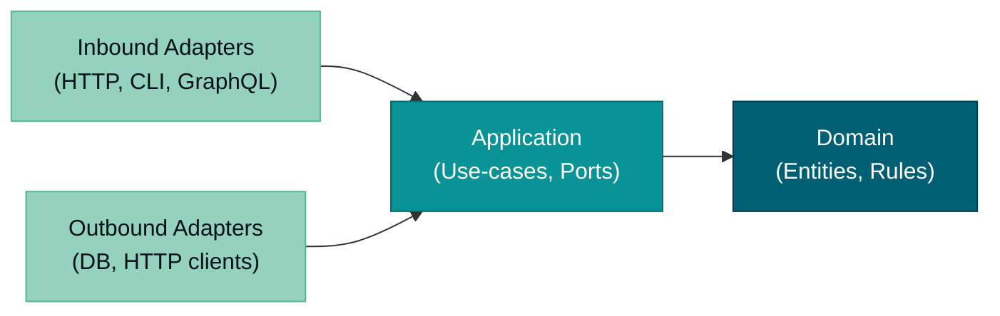

# Hexagonal Architecture

Hexagonal architecture (also called Ports and Adapters) organizes code so that business logic never depends on delivery
mechanisms or infrastructure. The domain sits at the centre; everything else adapts to it. This pattern applies across
all app types in this monorepo — CLIs, web apps, and backend services — with specializations per app type documented in
sibling files.

## Principles Implemented/Respected

This practice implements/respects the following core principles:

- **[Explicit Over Implicit](../../principles/software-engineering/explicit-over-implicit.md)**: Ports are named
  interfaces. Every dependency between layers crosses a well-defined boundary, making coupling explicit and auditable.

- **[Pure Functions Over Side Effects](../../principles/software-engineering/pure-functions.md)**: The domain layer
  contains pure business logic. Side effects (database access, HTTP calls, file I/O) are pushed outward to adapter
  implementations.

- **[Simplicity Over Complexity](../../principles/general/simplicity-over-complexity.md)**: The dependency rule
  eliminates entire classes of coupling bugs. A layer that cannot import its neighbour cannot accidentally couple to it.

- **[Immutability Over Mutability](../../principles/software-engineering/immutability.md)**: Domain models express
  business invariants as immutable value types. Adapters translate mutable external representations to and from
  immutable domain types at the boundary.

## Conventions Implemented/Respected

- **[Functional Programming Practices](./functional-programming.md)**: Domain logic uses pure functions and immutable
  data structures, consistent with the functional-core/imperative-shell pattern.

## Overview

Hexagonal architecture defines concentric zones:

| Zone              | Also Called        | Purpose                                                                    |
| ----------------- | ------------------ | -------------------------------------------------------------------------- |
| Domain            | Core               | Business entities and rules — no external imports                          |
| Application       | Use-case           | Orchestrates domain objects; defines ports (interfaces)                    |
| Inbound adapters  | Primary adapters   | Translate external input into application calls (HTTP, CLI, GraphQL)       |
| Outbound adapters | Secondary adapters | Implement application ports for infrastructure concerns (DB, HTTP clients) |

The domain has no knowledge of how it is invoked or where its data comes from. Adapters translate between external
protocols and the language of the domain.

## Core Concepts

### Ports (Interfaces)

A port is a named interface declared in the application layer. It defines what the application needs without specifying
how that need is fulfilled. Two kinds of ports exist:

- **Inbound ports** — define entry points into the application (service interfaces, use-case traits)
- **Outbound ports** — define dependencies the application requires (repository traits, email sender interfaces)

### Inbound Adapters

Inbound adapters sit outside the application and call into it through inbound ports. They translate external signals
(HTTP requests, CLI arguments, message queue events) into application calls. The application layer knows nothing about
HTTP verbs, CLI flags, or queue protocols.

Examples: HTTP route handlers, CLI command handlers, message consumers.

### Outbound Adapters

Outbound adapters implement outbound ports. They translate application calls into external operations (SQL queries,
HTTP client calls, file writes). The application layer uses the port interface only; it never instantiates or imports
the concrete adapter.

Examples: PostgreSQL repository implementations, external HTTP API clients, file-based caches.

### Domain Model

The domain model contains business entities, value objects, and pure business rules. It has zero dependencies on
frameworks, databases, or network libraries. It must compile and run in isolation from all adapters.

## Layer Definitions

### Domain Layer

**Belongs here:**

- Business entities and aggregate roots
- Value objects (immutable, equality by value)
- Domain events
- Pure domain logic and invariants
- Domain error types (no HTTP status codes — those belong in the API adapter)

**Forbidden:**

- Framework imports (Axum, Giraffe, Next.js, Clap, Tokio I/O)
- Database imports (SQLx, Diesel, Entity Framework, Dapper)
- HTTP client imports
- Logging frameworks (use return values or domain events instead)
- Network protocol types

### Application Layer

**Belongs here:**

- Use-case / service orchestration functions
- Inbound port definitions (service interfaces that adapters call)
- Outbound port definitions (repository and external-service interfaces)
- Application-level error types
- DTOs or command/query objects that cross the application boundary
- In web apps: `application/index.ts` barrel — the sole public API surface per context

**Forbidden:**

- Direct database driver calls
- HTTP framework types (request/response objects)
- Direct filesystem access
- Concrete infrastructure implementations

### Infrastructure Layer (Outbound Adapters)

**Belongs here:**

- Concrete outbound adapter implementations (repository, cache, external HTTP)
- Database connection setup
- ORM/query-builder configuration
- External service SDK wrappers

**Forbidden:**

- Business logic (move invariants to domain)
- Inbound adapter code (route handlers, CLI argument parsing)
- Domain entity instantiation that bypasses invariants

### Inbound Adapter Layer

**Belongs here:**

- HTTP route handlers and middleware
- CLI command handlers and argument parsing
- GraphQL resolvers
- Message queue consumers
- Schema validation at the boundary (before passing to application)
- Error-to-response mapping (translates domain errors to HTTP status codes or CLI exit codes)

**Forbidden:**

- Business logic (move to domain)
- Direct database access (must go through outbound port)
- Importing domain entities directly — access only through application layer

## Dependency Rule

Outer layers may depend on inner layers. Inner layers must never depend on outer layers. No import may cross inward
boundaries in the reverse direction.

The diagram reads left-to-right but the dependency rule applies in all directions: adapters depend on application;
application depends on domain; nothing in an inner circle imports from an outer circle.

## App-Type Specializations

Each app type in this monorepo applies the hexagonal pattern with concrete directory layouts and language-specific
idioms:

- **[CLI Apps](./hexagonal-architecture-cli.md)** — `commands/` as inbound adapter; Rust and Go CLIs
- **[Web Apps](./hexagonal-architecture-web.md)** — `contexts/<name>/` feature modules; Next.js with Effect.ts
- **[Backend Apps](./hexagonal-architecture-be.md)** — DDD bounded contexts + hexagonal layers; Rust/Axum and F#/Giraffe

## Related

- **[OpenAPI Contract-First Development](./openapi-contract-first.md)** — How the OpenAPI spec governs the API adapter
  boundary for backend services
- **[Functional Programming Practices](./functional-programming.md)** — Pure-function patterns used inside the domain
  and application layers
