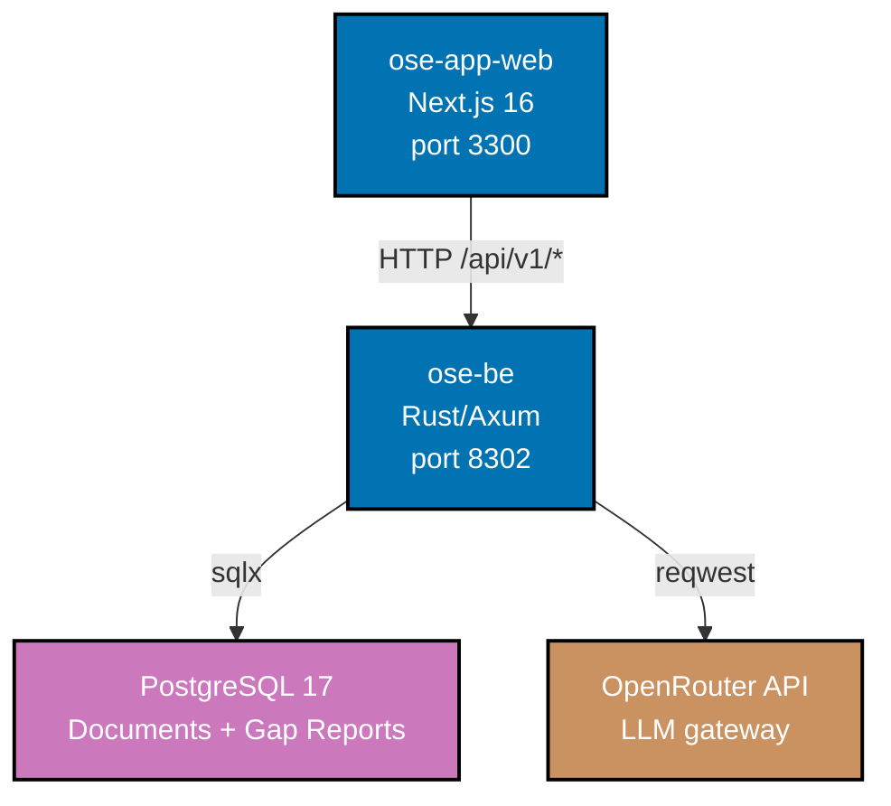
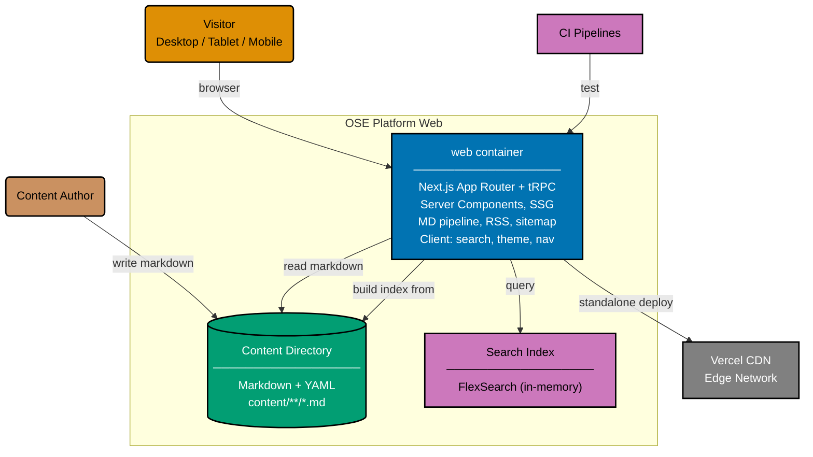

# OSE — Container Diagrams (C4 L2)

## OSE Application (`ose-app-*`)

| Container      | Technology             | Port | Purpose                                            |
| -------------- | ---------------------- | ---- | -------------------------------------------------- |
| `ose-app-web`  | Next.js 16, TypeScript | 3300 | Frontend SPA — document upload UI, gap report view |
| `ose-be`       | Rust/Axum              | 8302 | REST API — document ingestion, gap analysis engine |
| PostgreSQL 17  | Docker (dev), managed  | 5432 | Persistence for documents, policies, gap reports   |
| OpenRouter API | External HTTP API      | —    | LLM gateway for AI-assisted gap analysis           |

## OSE Platform Web (`ose-web`)

`ose-web` deploys as a **single container** named `web`. The tRPC API runs inside the same
Next.js process — there is no separate backend deployable.

| Container | Slug  | Tech                               | Hosting             | Behavior perspectives                          |
| --------- | ----- | ---------------------------------- | ------------------- | ---------------------------------------------- |
| Web       | `web` | Next.js 16 (App Router) + tRPC v11 | Vercel (standalone) | `platform-web` (UI), `platform-be` (tRPC HTTP) |

## Related

- **Context diagram**: [context.md](../system-context/context.md)
- **Parent**: [ose specs](../README.md)
